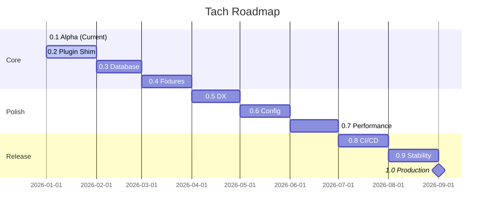

# Changelog

All notable changes to Project Tach will be documented in this file.

The format is based on [Keep a Changelog](https://keepachangelog.com/en/1.1.0/),
and this project adheres to [Semantic Versioning](https://semver.org/spec/v2.0.0.html).

## [Unreleased]

### Roadmap to 1.0.0



#### 0.2.0 - Plugin Compatibility

Shadow plugin shim for pytest ecosystem integration.

- [ ] Hook interception for `pytest_runtest_setup`/`pytest_runtest_teardown`
- [ ] Effect capture for pytest-django, pytest-asyncio
- [ ] Marker handling (`@pytest.mark.django_db`, `@pytest.mark.asyncio`)
- [ ] Conftest.py hook passthrough

#### 0.3.0 - Database Integration

Transaction rollback and connection handling for database-heavy projects.

- [ ] Django transaction rollback via `transaction.atomic()`
- [ ] SQLAlchemy session management
- [ ] Connection pool preservation across test resets
- [ ] Database FD handover via SCM_RIGHTS

#### 0.4.0 - Fixture Lifecycle

Proper handling of session and module-scoped fixtures.

- [ ] Session-scoped fixture caching (survive across all tests)
- [ ] Module-scoped fixture optimization
- [ ] Fixture finalization ordering
- [ ] Autouse fixture support

#### 0.5.0 - Developer Experience

Better error messages, debugging, and developer tools.

- [ ] Enhanced traceback formatting (pytest-style)
- [ ] Debug mode with verbose syscall logging
- [ ] Failure analysis and suggestions
- [ ] `--pdb` support for interactive debugging

#### 0.6.0 - Configuration

Complete configuration support.

- [ ] Full `[tool.tach]` pyproject.toml schema
- [ ] Per-test timeout configuration
- [ ] Test ordering options (random, dependency-based)
- [ ] Environment variable presets

#### 0.7.0 - Performance

Memory and parallelism optimizations.

- [ ] Memory usage profiling and optimization
- [ ] Adaptive batch sizing based on test duration
- [ ] Lazy module loading for large codebases
- [ ] Parallel discovery with rayon

#### 0.8.0 - CI/CD Integration

First-class CI/CD support.

- [ ] GitHub Actions workflow templates
- [ ] GitLab CI configuration examples
- [ ] JUnit XML improvements (test properties, attachments)
- [ ] Coverage format options (Cobertura, LCOV, JSON)

#### 0.9.0 - Stability

Production hardening and edge case handling.

- [ ] Crash recovery and orphan process cleanup
- [ ] Signal handling improvements
- [ ] Memory leak detection and prevention
- [ ] Stress testing under load

#### 1.0.0 - Production Ready

Stable release with API guarantees.

- [ ] Complete user documentation
- [ ] API stability commitment
- [ ] Migration guide from pytest
- [ ] Battle-tested on real-world projects

---

## [0.1.0] - 2026-01-04

### Initial Alpha Release

This is the first public release of Tach - a Hypervisor-Accelerated Python Test Runner.

> **Note**: This is an alpha release. APIs may change. Not recommended for production use.

### Highlights

- **Restoration Physics Engine**: Bit-perfect snapshot/restore of Python interpreter state
- **Zero-Copy Test Execution**: Workers inherit pre-initialized Python via fork
- **Iron Dome Sandbox**: Landlock + Seccomp hardening with graceful kernel degradation
- **pytest-Compatible CLI**: Drop-in command-line interface

### Core Features

#### Test Discovery

- Static AST-based test discovery (no Python execution during discovery)
- Fixture resolution with topological dependency ordering
- Parametrized test expansion with proper deduplication
- Class-scoped and module-scoped fixture support

#### Execution Engine

- Zygote fork-server pattern for instant worker spawning
- userfaultfd memory snapshots for sub-millisecond restore
- Toxicity classification for safe vs unsafe tests
- Parallel worker pool with automatic CPU detection

#### Memory Restoration

- TLS (Thread-Local Storage) capture and restore
- BSS/Heap split-brain prevention
- Stack restoration via ptrace
- Self-calibrating mimalloc offset discovery (Python 3.13+)

#### Sandbox (Iron Dome)

- Landlock filesystem restrictions (ABI V1+)
- Seccomp syscall filtering (blacklist approach)
- Safe workers: Full Iron Dome (Landlock + Seccomp)
- Toxic workers: Landlock only (subprocess support)

#### Coverage

- Zero-overhead bytecode instrumentation
- Ring buffer collection via memfd
- LCOV/JSON output formats

#### Reporting

- Progress bar for interactive terminals
- Dots reporter for CI environments
- JUnit XML output for CI integration
- Time Saved metric showing initialization overhead reduction

### CLI Interface

```
tach [OPTIONS] [PATH] [COMMAND]

Commands:
  test       Run tests (default)
  list       List discovered tests
  self-test  Run system diagnostics
  version    Show version information

Options:
  -n <WORKERS>     Number of parallel workers (default: auto)
  -x, --exitfirst  Exit on first failure
  --maxfail <N>    Exit after N failures
  -v, -vv          Increase verbosity
  -q               Quiet mode
  -k <EXPR>        Filter tests by keyword expression
  -m <MARKERS>     Filter tests by markers
  --coverage       Enable coverage collection
  --no-isolation   Disable worker isolation
  --junit-xml <F>  Write JUnit XML report
  --json           Output results as JSON
  --watch          Watch mode for file changes
```

### System Requirements

- Linux 5.13+ (for Landlock ABI V1)
- x86_64 or aarch64 architecture
- Python 3.8+ with libpython
- userfaultfd privileges (CAP_SYS_PTRACE or `vm.unprivileged_userfaultfd=1`)

Run `tach self-test` to verify system compatibility.

### Known Limitations

- No pytest plugin support yet (planned for 0.2.0)
- No database transaction rollback (planned for 0.3.0)
- Session-scoped fixtures not fully cached (planned for 0.4.0)
- Linux only (no Windows/macOS support)

---

## Development History

> The following documents internal development milestones.
> These were not public releases.

### Internal Milestones

| Milestone   | Focus Area      | Key Deliverables                           |
| ----------- | --------------- | ------------------------------------------ |
| Discovery   | Test Discovery  | AST-based scanning, fixture resolution     |
| Zygote      | Process Model   | Fork-server pattern, worker pool           |
| Snapshot    | Memory          | userfaultfd snapshots, MADV_DONTNEED       |
| Workers     | Execution       | Scheduler, IPC protocol, result collection |
| Coverage    | Instrumentation | PEP 669, ring buffers, memfd               |
| Iron Dome   | Security        | Landlock, Seccomp, graceful degradation    |
| Hot Reload  | Isolation       | sys.modules cleanup, import reset          |
| Allocator   | Memory          | jemalloc, tcache flush                     |
| Restoration | TLS             | fs_base capture, mimalloc calibration      |
| CLI         | Interface       | pytest-compatible arguments                |

### Key Technical Learnings

- **Clone syscall**: Never block in Seccomp - Python threading requires it
- **Landlock ABI**: Use V1 minimum for kernel 5.13+ compatibility
- **Path canonicalization**: Always canonicalize before adding Landlock rules
- **Seccomp blacklist**: Safer than allowlist - don't break unknown syscalls
- **Graceful degradation**: Log warnings, never crash on unsupported kernels
- **Toxic workers**: Need subprocess support, so bypass Seccomp

---

## Version History

> v1.0.0 was prematurely tagged and has been retracted. The first official release is v0.1.0.

[Unreleased]: https://github.com/NikkeTryHard/tach-core/compare/v0.1.0...HEAD
[0.1.0]: https://github.com/NikkeTryHard/tach-core/releases/tag/v0.1.0
