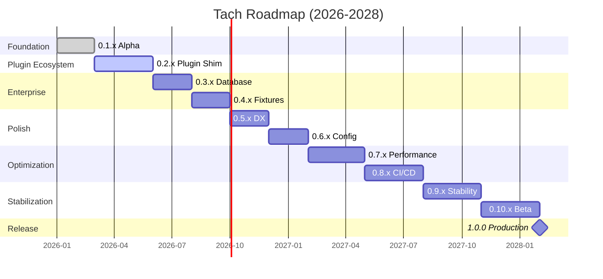

# Changelog

All notable changes to Project Tach will be documented in this file.

The format is based on [Keep a Changelog](https://keepachangelog.com/en/1.1.0/),
and this project adheres to [Semantic Versioning](https://semver.org/spec/v2.0.0.html).

## [Unreleased]

### Roadmap to 1.0.0



---

### 0.1.x - Foundation (Current)

Alpha stabilization, documentation, and minor improvements.

#### 0.1.1 - Documentation & Polish

- [ ] Improve error messages for common failures
- [ ] Add examples directory with sample projects
- [ ] Write quick-start tutorial
- [ ] Fix edge cases in AST discovery
- [ ] Improve CLI help text

#### 0.1.2 - Test Stability

- [ ] Handle more pytest assertion patterns
- [ ] Better stack trace formatting
- [ ] Fix timeout edge cases
- [ ] Improve worker cleanup on crash

#### 0.1.3 - Error Handling

- [ ] Categorize errors (user error vs system error)
- [ ] Add error codes for machine parsing
- [ ] Improve suggestions for common failures
- [ ] Add `--diagnose` flag for troubleshooting

---

### 0.2.x - Plugin Compatibility

Shadow plugin shim for pytest ecosystem integration.

#### 0.2.0 - Hook Interception Core

- [ ] Implement hook interception framework
- [ ] `pytest_runtest_setup` hook passthrough
- [ ] `pytest_runtest_teardown` hook passthrough
- [ ] Conftest.py hook discovery
- [ ] Plugin registration system

#### 0.2.1 - pytest-django Support

- [ ] `@pytest.mark.django_db` marker handling
- [ ] Django test client support
- [ ] Transaction test case compatibility
- [ ] Settings override support

#### 0.2.2 - pytest-asyncio Support

- [ ] `@pytest.mark.asyncio` marker handling
- [ ] Event loop fixture support
- [ ] Async test detection
- [ ] Coroutine test execution

#### 0.2.3 - Common Plugins

- [ ] pytest-cov compatibility (defer to our coverage)
- [ ] pytest-mock fixture support
- [ ] pytest-env variable injection
- [ ] pytest-timeout integration

---

### 0.3.x - Database Integration

Transaction rollback and connection handling for database-heavy projects.

#### 0.3.0 - Django Database

- [ ] Django transaction rollback via `transaction.atomic()`
- [ ] Multi-database support
- [ ] Database alias handling
- [ ] Migration state preservation

#### 0.3.1 - SQLAlchemy Support

- [ ] SQLAlchemy session management
- [ ] Scoped session handling
- [ ] Engine connection pooling
- [ ] Alembic migration awareness

#### 0.3.2 - Connection Management

- [ ] Connection pool preservation across test resets
- [ ] Database FD handover via SCM_RIGHTS
- [ ] Connection health checks
- [ ] Graceful connection cleanup

---

### 0.4.x - Fixture Lifecycle

Proper handling of session and module-scoped fixtures.

#### 0.4.0 - Session Fixtures

- [ ] Session-scoped fixture caching (survive across all tests)
- [ ] Fixture value serialization for cross-worker sharing
- [ ] Session fixture finalization at end
- [ ] Parallel session fixture initialization

#### 0.4.1 - Module Fixtures

- [ ] Module-scoped fixture optimization
- [ ] Module boundary detection
- [ ] Fixture reuse within modules
- [ ] Module fixture cleanup

#### 0.4.2 - Advanced Fixtures

- [ ] Autouse fixture support
- [ ] Fixture finalization ordering
- [ ] Parametrized fixture handling
- [ ] Fixture dependency graph visualization

---

### 0.5.x - Developer Experience

Better error messages, debugging, and developer tools.

#### 0.5.0 - Enhanced Tracebacks

- [ ] pytest-style traceback formatting
- [ ] Local variable display in failures
- [ ] Assertion introspection
- [ ] Diff display for comparison failures

#### 0.5.1 - Debug Mode

- [ ] Verbose syscall logging (`--debug`)
- [ ] Worker lifecycle visualization
- [ ] Memory snapshot timing breakdown
- [ ] Performance profiling output

#### 0.5.2 - Interactive Debugging

- [ ] `--pdb` support for interactive debugging
- [ ] Breakpoint detection (`breakpoint()`)
- [ ] Post-mortem debugging on failure
- [ ] Remote debugger attachment

---

### 0.6.x - Configuration

Complete configuration support.

#### 0.6.0 - pyproject.toml Schema

- [ ] Full `[tool.tach]` schema definition
- [ ] JSON schema for IDE completion
- [ ] Configuration validation
- [ ] Default value documentation

#### 0.6.1 - Test Configuration

- [ ] Per-test timeout configuration
- [ ] Per-directory settings
- [ ] Marker-based configuration
- [ ] Test exclusion patterns

#### 0.6.2 - Execution Configuration

- [ ] Test ordering options (random, dependency-based)
- [ ] Environment variable presets
- [ ] Worker count configuration
- [ ] Isolation mode selection

---

### 0.7.x - Performance

Memory and parallelism optimizations.

#### 0.7.0 - Memory Optimization

- [ ] Memory usage profiling
- [ ] Snapshot size reduction
- [ ] Lazy snapshot regions
- [ ] Memory pressure handling

#### 0.7.1 - Adaptive Scheduling

- [ ] Adaptive batch sizing based on test duration
- [ ] Test duration prediction
- [ ] Hot/cold test classification
- [ ] Load balancing improvements

#### 0.7.2 - Lazy Loading

- [ ] Lazy module loading for large codebases
- [ ] Import graph analysis
- [ ] Deferred bytecode compilation
- [ ] Memory-mapped code objects

#### 0.7.3 - Parallel Discovery

- [ ] Parallel discovery with rayon
- [ ] Incremental discovery caching
- [ ] File change detection
- [ ] Discovery result caching

---

### 0.8.x - CI/CD Integration

First-class CI/CD support.

#### 0.8.0 - GitHub Actions

- [ ] GitHub Actions workflow templates
- [ ] Artifact upload integration
- [ ] PR comment integration
- [ ] Status check reporting

#### 0.8.1 - Other CI Platforms

- [ ] GitLab CI configuration examples
- [ ] CircleCI orb
- [ ] Jenkins pipeline support
- [ ] Azure DevOps integration

#### 0.8.2 - Reporting Improvements

- [ ] JUnit XML improvements (test properties, attachments)
- [ ] HTML report generation
- [ ] Test duration trending
- [ ] Flaky test detection

#### 0.8.3 - Coverage Formats

- [ ] Coverage format options (Cobertura, LCOV, JSON)
- [ ] Coverage diff reporting
- [ ] Coverage thresholds
- [ ] Codecov/Coveralls integration

---

### 0.9.x - Stability

Production hardening and edge case handling.

#### 0.9.0 - Crash Recovery

- [ ] Crash recovery and orphan process cleanup
- [ ] Automatic worker restart
- [ ] State recovery after crash
- [ ] Graceful degradation on errors

#### 0.9.1 - Signal Handling

- [ ] Signal handling improvements
- [ ] SIGTERM graceful shutdown
- [ ] SIGINT handling (Ctrl+C)
- [ ] Child process signal forwarding

#### 0.9.2 - Resource Management

- [ ] Memory leak detection and prevention
- [ ] File descriptor leak prevention
- [ ] Resource limit enforcement
- [ ] OOM handling

#### 0.9.3 - Stress Testing

- [ ] Stress testing under load
- [ ] Long-running test suite support
- [ ] Resource exhaustion handling
- [ ] Chaos testing support

---

### 0.10.x - Beta

Feature freeze and release preparation.

#### 0.10.0 - Beta 1

- [ ] Feature freeze
- [ ] API stability review
- [ ] Documentation complete
- [ ] Migration guide draft

#### 0.10.1 - Beta 2

- [ ] Bug fixes from beta 1 feedback
- [ ] Performance regression testing
- [ ] Compatibility testing
- [ ] Security audit

#### 0.10.2 - Release Candidate 1

- [ ] Final bug fixes
- [ ] Release notes
- [ ] Upgrade path testing
- [ ] Community feedback integration

#### 0.10.3 - Release Candidate 2

- [ ] Critical bug fixes only
- [ ] Final documentation review
- [ ] Package verification
- [ ] Release preparation

---

### 1.0.0 - Production Ready

Stable release with API guarantees.

- [ ] Complete user documentation
- [ ] API stability commitment (SemVer)
- [ ] Migration guide from pytest
- [ ] Long-term support policy
- [ ] Battle-tested on real-world projects
- [ ] Performance benchmarks published
- [ ] Security best practices documented

---

## [0.1.0] - 2026-01-04

### Initial Alpha Release

This is the first public release of Tach - a Hypervisor-Accelerated Python Test Runner.

> **Note**: This is an alpha release. APIs may change. Not recommended for production use.

### Highlights

- **Restoration Physics Engine**: Bit-perfect snapshot/restore of Python interpreter state
- **Zero-Copy Test Execution**: Workers inherit pre-initialized Python via fork
- **Iron Dome Sandbox**: Landlock + Seccomp hardening with graceful kernel degradation
- **pytest-Compatible CLI**: Drop-in command-line interface

### Core Features

#### Test Discovery

- Static AST-based test discovery (no Python execution during discovery)
- Fixture resolution with topological dependency ordering
- Parametrized test expansion with proper deduplication
- Class-scoped and module-scoped fixture support

#### Execution Engine

- Zygote fork-server pattern for instant worker spawning
- userfaultfd memory snapshots for sub-millisecond restore
- Toxicity classification for safe vs unsafe tests
- Parallel worker pool with automatic CPU detection

#### Memory Restoration

- TLS (Thread-Local Storage) capture and restore
- BSS/Heap split-brain prevention
- Stack restoration via ptrace
- Self-calibrating mimalloc offset discovery (Python 3.13+)

#### Sandbox (Iron Dome)

- Landlock filesystem restrictions (ABI V1+)
- Seccomp syscall filtering (blacklist approach)
- Safe workers: Full Iron Dome (Landlock + Seccomp)
- Toxic workers: Landlock only (subprocess support)

#### Coverage

- Zero-overhead bytecode instrumentation
- Ring buffer collection via memfd
- LCOV/JSON output formats

#### Reporting

- Progress bar for interactive terminals
- Dots reporter for CI environments
- JUnit XML output for CI integration
- Time Saved metric showing initialization overhead reduction

### CLI Interface

```
tach [OPTIONS] [PATH] [COMMAND]

Commands:
  test       Run tests (default)
  list       List discovered tests
  self-test  Run system diagnostics
  version    Show version information

Options:
  -n <WORKERS>     Number of parallel workers (default: auto)
  -x, --exitfirst  Exit on first failure
  --maxfail <N>    Exit after N failures
  -v, -vv          Increase verbosity
  -q               Quiet mode
  -k <EXPR>        Filter tests by keyword expression
  -m <MARKERS>     Filter tests by markers
  --coverage       Enable coverage collection
  --no-isolation   Disable worker isolation
  --junit-xml <F>  Write JUnit XML report
  --json           Output results as JSON
  --watch          Watch mode for file changes
```

### System Requirements

- Linux 5.13+ (for Landlock ABI V1)
- x86_64 or aarch64 architecture
- Python 3.8+ with libpython
- userfaultfd privileges (CAP_SYS_PTRACE or `vm.unprivileged_userfaultfd=1`)

Run `tach self-test` to verify system compatibility.

### Known Limitations

- No pytest plugin support yet (planned for 0.2.0)
- No database transaction rollback (planned for 0.3.0)
- Session-scoped fixtures not fully cached (planned for 0.4.0)
- Linux only (no Windows/macOS support)

---

## Development History

> The following documents internal development milestones.
> These were not public releases.

### Internal Milestones

| Milestone   | Focus Area      | Key Deliverables                           |
| ----------- | --------------- | ------------------------------------------ |
| Discovery   | Test Discovery  | AST-based scanning, fixture resolution     |
| Zygote      | Process Model   | Fork-server pattern, worker pool           |
| Snapshot    | Memory          | userfaultfd snapshots, MADV_DONTNEED       |
| Workers     | Execution       | Scheduler, IPC protocol, result collection |
| Coverage    | Instrumentation | PEP 669, ring buffers, memfd               |
| Iron Dome   | Security        | Landlock, Seccomp, graceful degradation    |
| Hot Reload  | Isolation       | sys.modules cleanup, import reset          |
| Allocator   | Memory          | jemalloc, tcache flush                     |
| Restoration | TLS             | fs_base capture, mimalloc calibration      |
| CLI         | Interface       | pytest-compatible arguments                |

### Key Technical Learnings

- **Clone syscall**: Never block in Seccomp - Python threading requires it
- **Landlock ABI**: Use V1 minimum for kernel 5.13+ compatibility
- **Path canonicalization**: Always canonicalize before adding Landlock rules
- **Seccomp blacklist**: Safer than allowlist - don't break unknown syscalls
- **Graceful degradation**: Log warnings, never crash on unsupported kernels
- **Toxic workers**: Need subprocess support, so bypass Seccomp

---

## Version History

> v1.0.0 was prematurely tagged and has been retracted. The first official release is v0.1.0.

[Unreleased]: https://github.com/NikkeTryHard/tach-core/compare/v0.1.0...HEAD
[0.1.0]: https://github.com/NikkeTryHard/tach-core/releases/tag/v0.1.0
