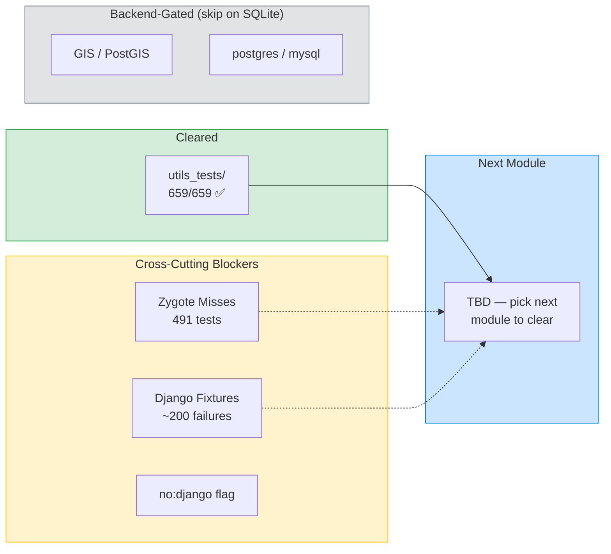

# Django Compatibility Tracker

Target: run Django's own test suite through tach-core with full isolation.

## Progress Overview



## Test Setup

**IMPORTANT**: Django tests require version-matched source and package.

```bash
# 1. Check installed Django version
docker compose exec dev python3 -c "import django; print(django.VERSION)"

# 2. Clone matching tests (e.g. 6.0.2)
docker compose exec dev bash -c "
  rm -rf /tmp/django-tests
  git clone --depth 1 --branch 6.0.2 https://github.com/django/django.git /tmp/django-repo
  cp -r /tmp/django-repo/tests/. /tmp/django-tests/
  rm -rf /tmp/django-repo
"

# 3. Create conftest.py (required for both pytest and tach-core)
docker compose exec dev bash -c "cat > /tmp/django-tests/conftest.py << 'EOF'
import os, sys, tempfile

def pytest_configure(config):
    os.environ['TMPDIR'] = tempfile.mkdtemp()
    os.environ['DJANGO_SETTINGS_MODULE'] = 'test_sqlite'
    sys.path.insert(0, os.path.dirname(__file__))
    from runtests import setup_run_tests
    setup_run_tests(0, None, None)
EOF"

# 4. Run
docker compose exec dev bash -c "cd /tmp/django-tests && /workspace/target/release/tach-core ."
docker compose exec dev bash -c "cd /tmp/django-tests && python3 -m pytest --tb=no -q --continue-on-collection-errors ."
```

### Why conftest.py is required

Django's `runtests.py` dynamically injects test modules into `INSTALLED_APPS`
and calls `apps.set_installed_apps()`. Without this, Django's app registry is
empty and most test files fail to import.

The conftest.py runs `setup_run_tests()` inside `pytest_configure`, so the
setup happens in the **same Python process** as test collection. Without it,
tach-core's zygote spawns a fresh Python process that has no apps registered.

## `utils_tests/` Results (Focus Suite)

### tach-core (after /tmp + __main__.__file__ fixes)
```
659 passed, 0 failed, 21 skipped in 1.99s
```

### pytest
```
618 passed, 3 failed, 21 skipped, 41 errors in 1.51s
```

### Comparison

| Metric | tach-core | pytest |
|--------|-----------|--------|
| Passed | 659 | 618 |
| Failed | 0 | 3 |
| Skipped | 21 | 21 |
| Errors | 0 | 41 |

tach-core achieves **100% pass rate** on utils_tests/ (all non-skipped tests pass).
pytest has 44 failures/errors on the same suite.

### Fixes applied (not yet merged)

**1. Read-only `/tmp` in Docker workers (32 failures fixed)**
- `src/isolation/namespace.rs`: When overlay is disabled (Docker), bind-mount
  `/tmp` onto itself and remount writable instead of using tmpfs (which would
  hide existing `/tmp` contents) or leaving it read-only.
- Tests using `tempfile.mkdtemp()` / `TemporaryDirectory()` now work.

**2. Missing `__main__.__file__` (1 failure fixed)**
- `src/execution/zygote.rs`: Set `__main__.__file__` to `/proc/self/exe`
  during zygote init. Embedded Python lacks a script entry point, so
  `__main__` has no `__file__` attribute by default.
- Django's autoreload (`iter_modules_and_files`) now resolves `__main__`.

## Full Suite Results (Django 6.0.2 on SQLite)

### tach-core
```
6789 passed, 1575 failed, 1273 skipped in 82.27s
491 "Test not found in Zygote" (AST-discovered but not in pytest session)
```

### pytest
```
4620 passed, 560 failed, 1232 skipped, 3459 errors in 28.96s
```

### Comparison

| Metric | tach-core | pytest |
|--------|-----------|--------|
| Passed | 6789 | 4620 |
| Failed | 1575 | 560 |
| Skipped | 1273 | 1232 |
| Errors (import/collection) | 491 | 3459 |

tach-core passes **2169 more tests** than pytest because tach runs tests in
isolated workers that survive import-time errors that crash pytest's collector.
The 491 remaining zygote misses are tests tach discovers via AST but pytest's
session can't collect (likely GIS/postgres-specific modules).

### Failure categories (tach-core's 1575 failures)

| Category | Count | Root Cause |
|----------|-------|------------|
| Zygote session miss | 491 | AST finds tests pytest can't collect (backend-specific) |
| Actual test failures | ~560 | Same tests that fail under pytest (Django test bugs on SQLite) |
| Missing fixtures | ~200 | `_pre_setup`, Django-specific fixtures not wired |
| Import errors | ~100 | Modules needing postgres/GIS backends |
| Other | ~224 | Various runtime errors |

## Discovery Status

| Scope | tach-core | pytest | Match |
|-------|-----------|--------|-------|
| `utils_tests/` | 682 | 682 | ✅ |
| Full suite discovery | 9700 | 9822 | ~99% |
| Full suite zygote session | 9875 items available | 9822 collected | ✅ |

## Issues Fixed

### PR #87 — Suffix + inheritance-based test class matching
- Classes ending in `*Test`, `*Tests`, `*TestCase` now detected
- `has_testcase_base()` checks AST bases for `*TestCase` lineage

### PR #88 — Django test database initialization before fork
- `_setup_django_test_db()` called in zygote before snapshot
- Workers inherit test DB state instead of hitting production DB

### PR #89 — Call _setup_django_test_db via module ref
- Fixed import issue where harness module ref was stale after fork

### PR #90 — TransactionTestCase isolation via toxic queue routing
- `transaction=True` tests marked toxic → run in isolated workers
- Stale DB connections closed before transaction tests

### PR #91 — Propagate class-level markers to test methods
- `@pytest.mark.django_db` on class now applies to all methods

### PR #92 — Auto-detect overlayfs and fallback for Docker
- Nested overlay-on-overlay (Docker) detected → skip mount
- Self-test diagnostic for overlay filesystem added

### PR #93 — TUI responsiveness
- Socket timeout 5s → 100ms
- Steady tick enabled for progress bar

### PR #94 — Transitive inheritance + inherited methods + bare test
- Two-phase fixed-point algorithm in `inheritance.rs`
- `ClassInfo` struct tracks all classes for cross-file resolution
- Bare `test` method name supported (not just `test_*`)

### PR #95 — Match pytest collection rules
- `is_test_class()` prefix-only (`Test*`), matching `python_classes` default
- Suffix patterns (`*Test`, `*Tests`) no longer collect mixin classes
- AST detection: `__test__ = False`, `__init__`, `__new__`, `@abstractmethod`, `abc.ABC`
- Exclusion flags propagated through inheritance resolution
- `tach list` now prints summary: `Discovered X tests in Y files`

## Critical Finding: conftest.py bootstrap

**Root cause of 5614 → 491 zygote misses**: Django's test setup must happen
inside the same Python process as test collection. Running `setup_run_tests()`
in a separate `python3 -c` command before `tach-core` doesn't work because:

1. tach-core spawns its own Python zygote process
2. The zygote calls `pytest.Session.perform_collect()` in a fresh Python env
3. Without `INSTALLED_APPS`, Django's app registry is empty
4. pytest can't import test modules → "Test not found in Zygote session"

**Fix**: A `conftest.py` with `pytest_configure` hook that runs the Django
bootstrap. This hook executes inside the zygote's Python process during
`_prepareconfig()` → `_do_configure()`.

## Known Gaps / Next Steps

### Remaining work
- [x] `utils_tests/` — 100% pass rate achieved (659/659 non-skipped tests pass)
- [ ] Investigate the 491 remaining zygote misses (likely fixable)
- [ ] Wire missing Django fixtures (`_pre_setup`, `_post_teardown`)
- [ ] GIS tests (need PostGIS backend, always skip with sqlite)
- [ ] Backend-specific tests (postgres JSON, mysql-specific)
- [ ] `no:django` plugin flag in harness — confirmed safe for Django TestCase
       subclasses (lifecycle is self-contained in Django's __call__)
- [ ] Scale to next test suite module (methodical, one at a time)

### Not tach-core bugs
- `TestFinder` in `test_module_loading.py` — has `__init__`, correctly skipped
- 560 tests fail under both tach-core and pytest (Django issues on SQLite)
- GIS/postgres collection errors (backend not available)

## Test Counts Reference

```
887 Rust unit tests (cargo nextest run --lib)
4 pre-existing integration test failures (unrelated to Django work)
```
