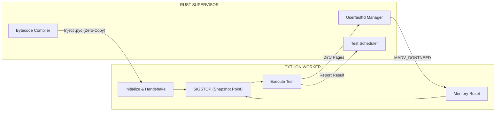
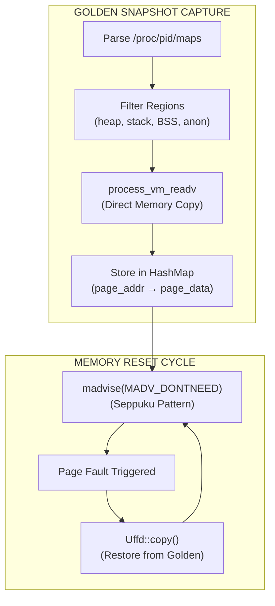
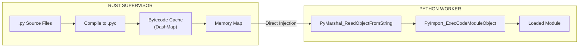
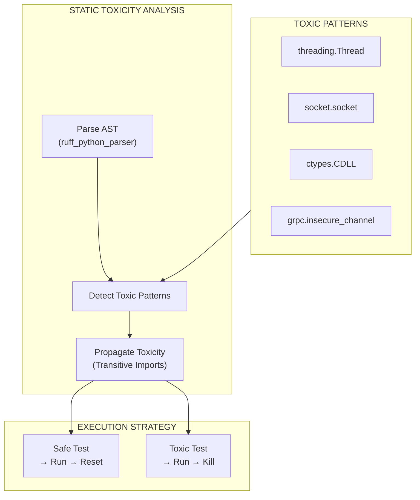

<div align="center">

# Tach

**A Snapshot-Hypervisor for Python Tests**

[](https://www.rust-lang.org/)
[](https://www.python.org/)
[](https://kernel.org/)
[](LICENSE)

_Replace pytest's execution model with microsecond-scale memory snapshots_

</div>

---

## Table of Contents

- [Overview](#overview)
- [Performance Metrics](#performance-metrics)
- [Architecture](#architecture)
  - [The Jedi Protocol](#the-jedi-protocol)
  - [Physics Engine](#physics-engine)
  - [Zero-Copy Loader](#zero-copy-loader)
  - [Toxicity Analysis](#toxicity-analysis)
- [System Requirements](#system-requirements)
- [Installation](#installation)
- [Usage](#usage)
- [Development](#development)
- [Implementation Roadmap](#implementation-roadmap)
- [Test Coverage](#test-coverage)

---

## Overview

Tach is a **Hypervisor for Python**. It abandons the traditional process creation model (`fork()` or `spawn()`) in favor of **Snapshot/Restore** architecture using Linux `userfaultfd`.

Instead of creating a new process for every test (taking approximately 2ms plus import time), Tach creates a process **once**, captures a memory snapshot, runs a test, and then **restores** the memory state in **less than 50 microseconds**.

### The Problem: Import Tax and Fork Safety

Traditional test runners suffer from three fundamental performance bottlenecks:

1. **Import Tax:** Python module imports are expensive. `import pandas` takes 200ms or more. Even with `fork()`, this penalty is paid in the Zygote initialization.

2. **Fork Safety:** The `fork()` system call copies locked mutexes from background threads (such as logging handlers), causing deadlocks in child processes.

3. **Allocator Churn:** Python's `obmalloc` fragments memory over time, making standard memory snapshots unstable.

### The Tach Solution

Tach implements a three-pronged approach to eliminate these bottlenecks:

1. **Zero-Copy Loading:** Bypasses Python's `importlib` entirely. Rust compiles `.py` source files to `.pyc` bytecode, memory-maps them, and injects them directly into the Python interpreter via C-API.

2. **Snapshot Isolation:** Uses `userfaultfd` to track memory writes and capture "golden" snapshots of worker memory state.

3. **Instant Reset:** After test execution, dirty pages are dropped via `madvise(MADV_DONTNEED)`. Subsequent memory access triggers page faults, which are serviced from the golden snapshot.

---

## Performance Metrics

| Metric                 | pytest (Standard)    | Tach (Legacy Fork) | Tach (Hypervisor)    |
| :--------------------- | :------------------- | :----------------- | :------------------- |
| **Isolation Strategy** | Process Spawn        | `fork()`           | Memory Reset         |
| **Reset Latency**      | ~200ms               | ~1ms               | **< 50μs**           |
| **Throughput**         | 1x                   | 50x                | **100x+**            |
| **Fork Safety**        | Safe (Slow)          | Unsafe (Deadlocks) | Safe (Lock Reset)    |
| **Memory Overhead**    | Full copy per worker | CoW sharing        | Minimal (page-level) |

---

## Architecture

### The Jedi Protocol

The Jedi Protocol describes the communication flow between the Rust Supervisor and Python Workers:



**Protocol Phases:**

1. **Initialization:** Worker process starts, performs UFFD handshake with Supervisor via SCM_RIGHTS
2. **Snapshot Capture:** Worker issues SIGSTOP; Supervisor captures golden memory state
3. **Test Execution:** Worker resumes, executes assigned test, reports results
4. **Memory Reset:** Worker invalidates dirty pages; page faults restore golden state

---

### Physics Engine

The Physics Engine (`snapshot.rs`) implements kernel-level memory management:



**Technical Implementation:**

| Component         | System Call              | Purpose                                                |
| :---------------- | :----------------------- | :----------------------------------------------------- |
| Memory Capture    | `process_vm_readv`       | Copy worker memory to Supervisor without ptrace attach |
| Page Tracking     | `userfaultfd`            | Register memory regions for fault notification         |
| Page Invalidation | `madvise(MADV_DONTNEED)` | Drop pages, forcing re-fault on next access            |
| Page Restoration  | `ioctl(UFFDIO_COPY)`     | Copy golden page back to worker address space          |

---

### Zero-Copy Loader

The Zero-Copy Loader (`zygote.rs`) bypasses Python's import machinery:



**Advantages over `importlib`:**

- No filesystem traversal (`sys.path` scanning)
- No disk I/O (bytecode pre-loaded in RAM)
- No repeated compilation (cached once)
- Sub-millisecond module materialization

---

### Toxicity Analysis

The Toxicity Analyzer (`discovery.rs`) identifies modules that cannot be safely snapshotted:



**Toxicity Rules:**

| Module/Call        | Toxicity Reason                                 |
| :----------------- | :---------------------------------------------- |
| `threading.Thread` | Creates OS threads that persist across snapshot |
| `multiprocessing`  | Spawns subprocesses with shared state           |
| `socket.socket`    | File descriptors inherit incorrectly            |
| `ctypes`, `cffi`   | Native code may hold locks                      |
| `grpc`             | Background connection threads                   |

---

## System Requirements

| Requirement          | Specification                                              |
| :------------------- | :--------------------------------------------------------- |
| **Operating System** | Linux Kernel 5.11+ (Ubuntu 22.04+, Fedora 34+, AWS AL2023) |
| **Privileges**       | `CAP_SYS_PTRACE` (standard in most CI environments)        |
| **Python Version**   | Python 3.10+                                               |
| **Rust Version**     | Rust 1.75+                                                 |
| **Allocator**        | Forced `PYTHONMALLOC=malloc`, glibc tcache disabled        |

**Docker Configuration:**

```yaml
security_opt:
  - seccomp:unconfined
cap_add:
  - SYS_PTRACE
```

---

## Installation

### From Source

```bash
# Clone repository
git clone https://github.com/NikkeTryHard/tach-core.git
cd tach-core

# Setup Python virtual environment
python -m venv .venv
source .venv/bin/activate
pip install pytest

# Build Rust binary
cargo build --release

# Verify kernel support (Physics Check)
sudo -E cargo test --test physics_check -- --ignored
```

---

## Usage

### Basic Execution

```bash
# Run all tests in current directory
sudo ./target/release/tach-core .

# Run specific test file
sudo ./target/release/tach-core tests/test_example.py

# Run without namespace isolation (development mode)
./target/release/tach-core --no-isolation .
```

### CLI Options

| Flag                 | Description                                   |
| :------------------- | :-------------------------------------------- |
| `--format json`      | Output results as JSON to stdout              |
| `--junit-xml <path>` | Generate JUnit XML report                     |
| `--watch`            | Watch mode: re-run on file changes            |
| `--no-isolation`     | Disable namespace isolation (for development) |
| `--list`             | List discovered tests without running         |
| `-v, --verbose`      | Increase output verbosity                     |

---

## Development

### Project Structure

```
tach-core/
├── src/
│   ├── main.rs           # CLI entry point
│   ├── discovery.rs      # AST-based test discovery
│   ├── resolver.rs       # Fixture dependency resolution
│   ├── scheduler.rs      # Async test scheduler
│   ├── zygote.rs         # Python process lifecycle
│   ├── snapshot.rs       # Userfaultfd memory management
│   ├── isolation.rs      # Linux namespace isolation
│   ├── tach_harness.py   # Python test harness
│   └── ...
├── rust_tests/           # Rust integration tests
│   ├── physics_check.rs  # UFFD memory reset verification
│   ├── snapshot_integration.rs
│   └── ...
└── tests/                # Python test fixtures
    ├── gauntlet/         # Stress/security tests
    ├── gauntlet_phase1/  # Memory reset verification
    └── ...
```

### Running Tests

```bash
# Rust unit tests
cargo test --lib

# Rust integration tests
cargo test --test snapshot_integration
cargo test --test physics_check -- --ignored  # Requires sudo

# Python gauntlet
./target/debug/tach-core --no-isolation tests/gauntlet_phase1/
```

---

## Implementation Roadmap

### Phase 1: Physics Check (COMPLETE)

Memory snapshot and reset mechanism verified:

- [x] Force system allocator (`PYTHONMALLOC=malloc`)
- [x] Userfaultfd-based page tracking
- [x] Golden snapshot capture via `process_vm_readv`
- [x] Memory reset via `madvise(MADV_DONTNEED)`
- [x] Page restoration via `Uffd::copy()`

### Phase 2: Zero-Copy Loader

Bypass `importlib` for instant module loading:

- [ ] Rust-side `.py` to `.pyc` compilation
- [ ] Bytecode cache (`DashMap<PathBuf, Vec<u8>>`)
- [ ] `PyMarshal_ReadObjectFromString` injection
- [ ] Namespace patching (`__path__`, `__package__`)

### Phase 3: Toxicity Filter

Identify and isolate unsafe modules:

- [ ] AST-based toxicity detection
- [ ] Transitive toxicity propagation
- [ ] Safe tests: Reset; Toxic tests: Kill

### Phase 4: Scheduler Refactor

Connect Physics Engine to test queue:

- [ ] Async event loop (`tokio::select!`)
- [ ] Worker state machine (Booting → Idle → Running → Resetting)
- [ ] Fragmentation cap (kill after 1000 resets)

---

## Test Coverage

| Category                                   | Tests | Status  |
| :----------------------------------------- | :---- | :------ |
| Rust Unit Tests (snapshot.rs)              | 17    | Passing |
| Rust Integration (snapshot_integration.rs) | 7     | Passing |
| Python Gauntlet Phase 1                    | 28    | Passing |
| Python Gauntlet (crash signals)            | 8     | Passing |
| Python Gauntlet (fs protection)            | 5     | Passing |

---

## License

MIT License. See [LICENSE](LICENSE) for details.

---

<div align="center">

**Built with Rust for performance and reliability**

</div>
