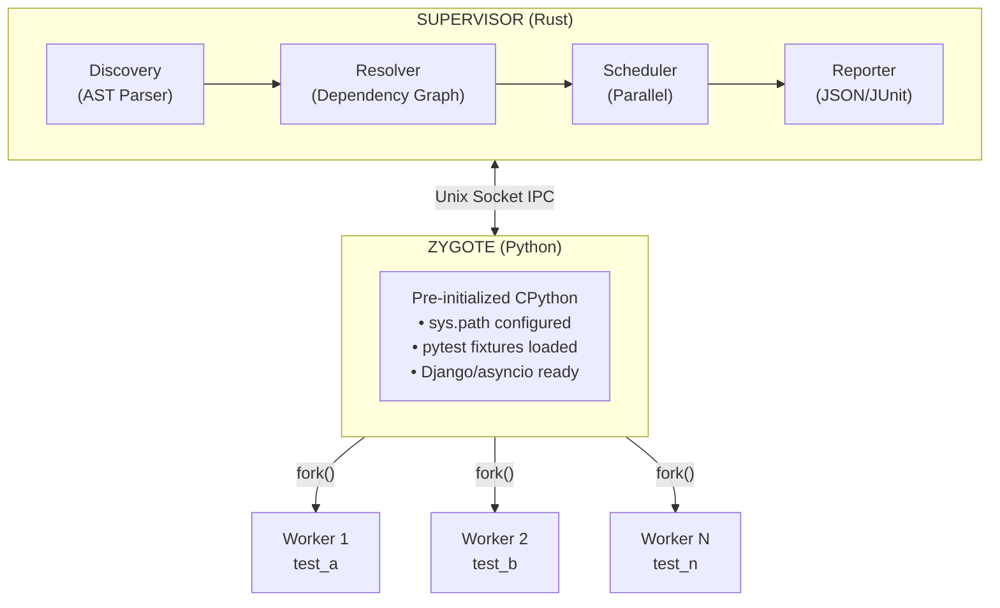

# Tach

**A Runtime Hypervisor for Python Tests**

Tach is not a test runner—it's a high-performance **test execution engine** built in Rust that replaces pytest's execution model with a Zygote/Fork architecture using Linux kernel primitives.

## Performance

| Metric              | pytest            | Tach           | Speedup |
| ------------------- | ----------------- | -------------- | ------- |
| Interpreter startup | Per-test          | **Once**       | 10-100x |
| Process isolation   | Docker/subprocess | **fork()**     | ~1ms    |
| Test discovery      | Import all        | **Static AST** | 5-20x   |

## Architecture



## Features

### Core Execution

- **Zygote Pattern**: Initialize Python once, `fork()` workers with copy-on-write memory
- **Static Discovery**: Parse tests via `ruff_python_parser` AST—no Python imports needed
- **Fixture Resolution**: Topological sort with cycle detection and scope management
- **Parallel Scheduler**: N workers with timeout, crash recovery, and dead man's switch

### Developer Experience

- **Watch Mode**: `--watch` flag for instant re-run on file changes
- **Line Numbers**: Accurate source locations for IDE integration
- **Debug Support**: `pdb` via TTY proxy through Unix sockets

### CI Integration

- **NDJSON Protocol**: Machine-readable event stream (`--format=json`)
- **JUnit XML**: Standard CI reports (`--junit-xml=report.xml`)
- **Environment Variables**: `TACH_FORMAT`, `TACH_JUNIT_XML`

## Installation

```bash
# Build from source (requires Rust 1.70+)
cd tach-core
export PYO3_PYTHON=$(which python)
cargo build --release

# Run
./target/release/tach-core
```

### Requirements

- Linux x86_64/aarch64 (uses `fork`, `clone`, namespaces)
- Rust 1.70+
- Python 3.10+
- pytest (installed in Python environment)

## Usage

```bash
# Run all tests
tach-core

# List tests (human-readable)
tach-core list

# JSON discovery output
tach-core --format=json list

# JSON event stream during execution
tach-core --format=json

# Generate JUnit XML report
tach-core --junit-xml=report.xml

# Watch mode (auto re-run on file changes)
tach-core --watch
tach-core -w

# Combine options
tach-core --format=json --junit-xml=report.xml
```

## Configuration

### pyproject.toml

```toml
[tool.tach]
env = { DATABASE_URL = "sqlite://:memory:" }
python_path = ["."]
```

### Environment Variables

| Variable         | Description                     | Default     |
| ---------------- | ------------------------------- | ----------- |
| `TACH_FORMAT`    | Output format (`human`, `json`) | `human`     |
| `TACH_JUNIT_XML` | Path for JUnit XML report       | None        |
| `PYO3_PYTHON`    | Python interpreter path         | Auto-detect |

## JSON Protocol (NDJSON)

### Discovery Output

```json
{"tests": [{"id": "test_foo.py::test_bar", "file": "test_foo.py", "line": 5, "is_async": false}], "fixtures": [...]}
```

### Execution Events

```json
{"event": "run_start", "count": 50}
{"event": "test_start", "id": "test_foo.py::test_bar", "file": "test_foo.py"}
{"event": "test_finished", "id": "test_foo.py::test_bar", "status": "pass", "duration_ms": 42}
{"event": "run_finished", "passed": 48, "failed": 2, "skipped": 0, "duration_ms": 1234}
```

## Module Reference

| Module      | Purpose                                            |
| ----------- | -------------------------------------------------- |
| `discovery` | Static AST parsing for tests and fixtures          |
| `resolver`  | Dependency graph construction and topological sort |
| `scheduler` | Parallel worker management with IPC                |
| `zygote`    | Python process initialization and fork handling    |
| `protocol`  | Binary IPC message encoding (zero-copy)            |
| `reporter`  | Output abstraction (Human, JSON, JUnit, Multi)     |
| `watch`     | Filesystem monitoring with debounce                |
| `lifecycle` | Process cleanup and signal handling                |
| `isolation` | Linux namespace setup (mount, network)             |
| `debugger`  | pdb TTY proxy and panic hooks                      |

## Kernel Primitives Used

| Primitive      | Usage                                         |
| -------------- | --------------------------------------------- |
| `fork()`       | Clone Zygote to create workers                |
| `clone()`      | Fine-grained process creation with namespaces |
| `CLONE_NEWNS`  | Mount namespace isolation                     |
| `CLONE_NEWNET` | Network namespace isolation                   |
| `ptrace`       | Debug attachment (planned)                    |
| `memfd_create` | Anonymous file-backed log buffers             |
| `Unix sockets` | Zero-copy IPC between Supervisor and Zygote   |

## Development

```bash
# Setup
uv venv && source .venv/bin/activate
pip install pytest

# Build
export PYO3_PYTHON=$(which python)
cargo build

# Test (Rust)
cargo test

# Run with test fixtures
cd tests && ../target/debug/tach-core
```

## Limitations

- **Linux only**: Uses Linux-specific syscalls (`fork`, namespaces)
- **No plugin system**: Batteries-included for Django, asyncio
- **pytest subset**: Supports `test_*` functions, `@pytest.fixture`, basic markers

## License

MIT
