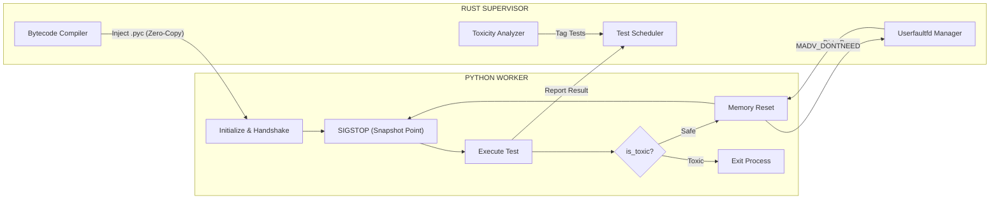
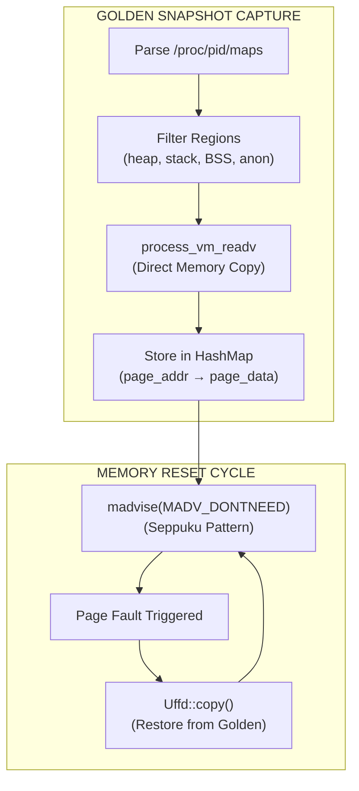
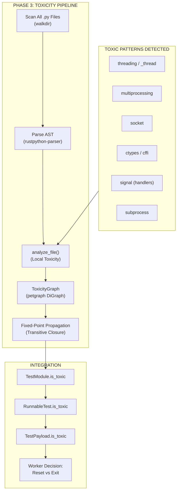
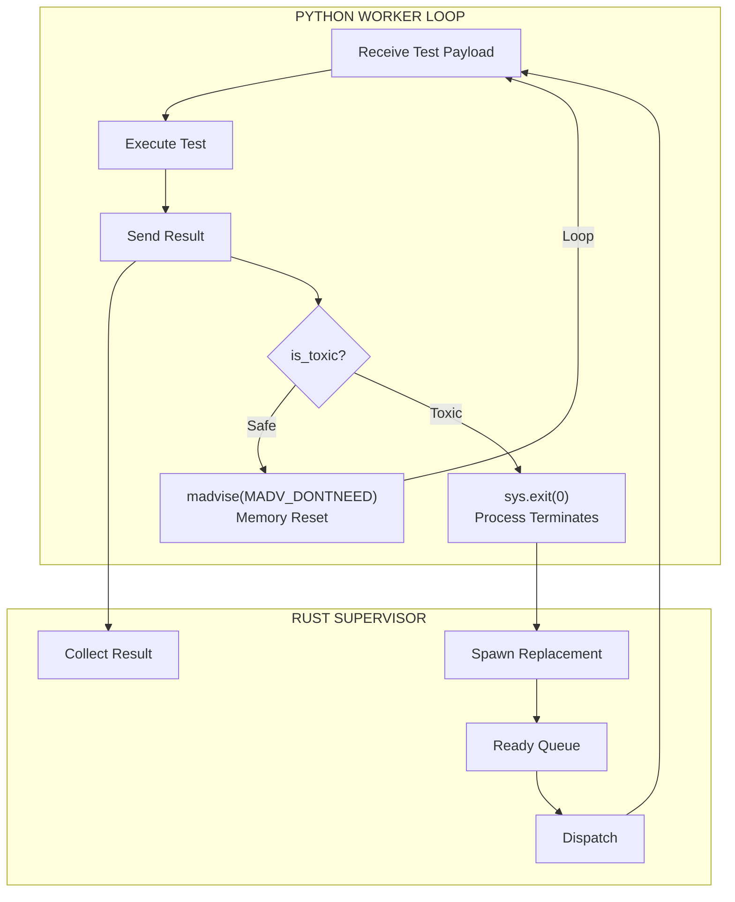
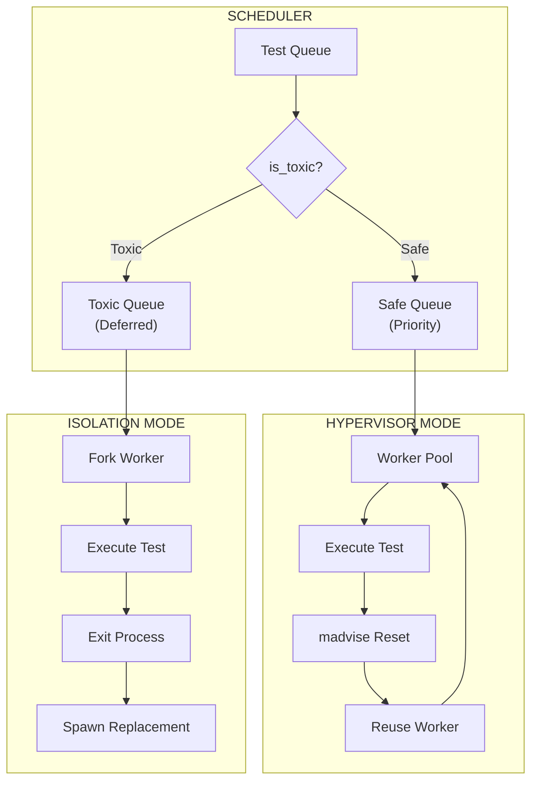
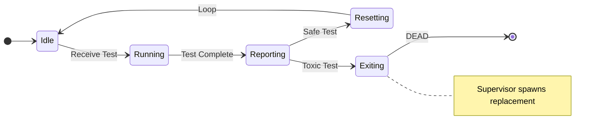

<div align="center">

# Tach

**A Snapshot-Hypervisor for Python Tests**

[](https://www.rust-lang.org/)
[](https://www.python.org/)
[](https://kernel.org/)
[](LICENSE)

_Replace pytest's execution model with microsecond-scale memory snapshots._

</div>

---

## Table of Contents

- [Overview](#overview)
- [Performance Metrics](#performance-metrics)
- [Architecture](#architecture)
  - [The Jedi Protocol](#the-jedi-protocol)
  - [Physics Engine](#physics-engine)
  - [Zero-Copy Loader](#zero-copy-loader)
  - [Toxicity Analysis](#toxicity-analysis)
  - [Worker Loop](#worker-loop)
- [System Requirements](#system-requirements)
- [Installation](#installation)
- [Usage](#usage)
- [Development](#development)
  - [Project Structure](#project-structure)
  - [Running Tests](#running-tests)
  - [Remote Development](#remote-development)
- [Implementation Roadmap](#implementation-roadmap)
- [Test Coverage](#test-coverage)
- [Technical Specifications](#technical-specifications)
- [Phase 4: Worker Loop & Dual-Path Scheduler](#phase-4-worker-loop--dual-path-scheduler)
- [Phase 5: Observability & Hardening](#phase-5-observability--hardening)

---

## Overview

Tach is a **Hypervisor for Python**. It abandons the traditional process creation model (`fork()` or `spawn()`) in favor of **Snapshot/Restore** architecture using Linux `userfaultfd`.

Instead of creating a new process for every test (taking approximately 2ms plus import time), Tach creates a process **once**, captures a memory snapshot, runs a test, and then **restores** the memory state in **less than 50 microseconds**.

### The Problem: Import Tax and Fork Safety

Traditional test runners suffer from three fundamental performance bottlenecks:

1. **Import Tax:** Python module imports are expensive. `import pandas` takes 200ms or more. Even with `fork()`, this penalty is paid in the Zygote initialization.

2. **Fork Safety:** The `fork()` system call copies locked mutexes from background threads (such as logging handlers), causing deadlocks in child processes.

3. **Allocator Churn:** Python's `obmalloc` fragments memory over time, making standard memory snapshots unstable.

### The Tach Solution

Tach implements a three-pronged approach to eliminate these bottlenecks:

1. **Zero-Copy Loading:** Bypasses Python's `importlib` entirely. Rust compiles `.py` source files to `.pyc` bytecode, memory-maps them, and injects them directly into the Python interpreter via C-API.

2. **Snapshot Isolation:** Uses `userfaultfd` to track memory writes and capture "golden" snapshots of worker memory state.

3. **Instant Reset:** After test execution, dirty pages are dropped via `madvise(MADV_DONTNEED)`. Subsequent memory access triggers page faults, which are serviced from the golden snapshot.

---

## Performance Metrics

| Metric                 | pytest (Standard)    | Tach (Legacy Fork) | Tach (Hypervisor)    |
| :--------------------- | :------------------- | :----------------- | :------------------- |
| **Isolation Strategy** | Process Spawn        | `fork()`           | Memory Reset         |
| **Reset Latency**      | ~200ms               | ~1ms               | **< 50μs**           |
| **Throughput**         | 1x                   | 50x                | **100x+**            |
| **Fork Safety**        | Safe (Slow)          | Unsafe (Deadlocks) | Safe (Lock Reset)    |
| **Memory Overhead**    | Full copy per worker | CoW sharing        | Minimal (page-level) |

### Zero-Copy Loader Performance (Phase 2)

| Metric                            | Cold Cache                | Warm Cache        |
| :-------------------------------- | :------------------------ | :---------------- |
| **Compilation Time (91 modules)** | 9.7 seconds               | 345 milliseconds  |
| **Speedup Factor**                | 1x                        | **28x**           |
| **Cache Persistence**             | Disk-based `.tach/cache/` | mtime-invalidated |

---

## Architecture

### The Jedi Protocol

The Jedi Protocol describes the communication flow between the Rust Supervisor and Python Workers:


```mermaid
flowchart LR
    subgraph Supervisor["RUST SUPERVISOR"]
        Compiler["Bytecode Compiler"]
        Uffd["Userfaultfd Manager"]
        Scheduler["Test Scheduler"]
        ToxicityGraph["Toxicity Analyzer"]
    end

    subgraph Worker["PYTHON WORKER"]
        direction TB
        Init["Initialize & Handshake"]
        Snapshot["SIGSTOP (Snapshot Point)"]
        Run["Execute Test"]
        Decision{is_toxic?}
        Reset["Memory Reset"]
        Exit["Exit Process"]
    end

    Compiler -->|"Inject .pyc (Zero-Copy)"| Init
    ToxicityGraph -->|"Tag Tests"| Scheduler
    Init --> Snapshot
    Snapshot --> Run
    Run -->|"Report Result"| Scheduler
    Run --> Decision
    Decision -->|"Safe"| Reset
    Decision -->|"Toxic"| Exit
    Reset -->|"Dirty Pages"| Uffd
    Uffd -->|"MADV_DONTNEED"| Reset
    Reset --> Snapshot
```

**Protocol Phases:**

1. **Initialization:** Worker process starts, performs UFFD handshake with Supervisor via SCM_RIGHTS
2. **Snapshot Capture:** Worker issues SIGSTOP; Supervisor captures golden memory state
3. **Test Execution:** Worker resumes, executes assigned test, reports results
4. **Dual-Path Decision:** Based on `is_toxic` flag:
   - **Safe:** Memory reset via `madvise(MADV_DONTNEED)`, loop back to snapshot point
   - **Toxic:** Exit process immediately, Supervisor spawns replacement

---

### Physics Engine

The Physics Engine (`snapshot.rs`) implements kernel-level memory management:


```mermaid
flowchart TB
    subgraph Capture["GOLDEN SNAPSHOT CAPTURE"]
        Maps["Parse /proc/pid/maps"]
        Filter["Filter Regions\n(heap, stack, BSS, anon)"]
        Copy["process_vm_readv\n(Direct Memory Copy)"]
        Store["Store in HashMap\n(page_addr → page_data)"]
    end

    subgraph Reset["MEMORY RESET CYCLE"]
        Invalidate["madvise(MADV_DONTNEED)\n(Seppuku Pattern)"]
        Fault["Page Fault Triggered"]
        Restore["Uffd::copy()\n(Restore from Golden)"]
    end

    Maps --> Filter --> Copy --> Store
    Store --> Invalidate
    Invalidate --> Fault --> Restore
    Restore --> Invalidate
```

**Technical Implementation:**

| Component         | System Call              | Purpose                                                |
| :---------------- | :----------------------- | :----------------------------------------------------- |
| Memory Capture    | `process_vm_readv`       | Copy worker memory to Supervisor without ptrace attach |
| Page Tracking     | `userfaultfd`            | Register memory regions for fault notification         |
| Page Invalidation | `madvise(MADV_DONTNEED)` | Drop pages, forcing re-fault on next access            |
| Page Restoration  | `ioctl(UFFDIO_COPY)`     | Copy golden page back to worker address space          |

---

### Zero-Copy Loader

The Zero-Copy Loader (`loader.rs`) bypasses Python's import machinery:


```mermaid
flowchart LR
    subgraph Rust["RUST SUPERVISOR"]
        Source[".py Source Files"]
        Compile["Compile to .pyc\n(py_compile)"]
        Cache["Bytecode Cache\n(.tach/cache/)"]
        Registry["ModuleRegistry\n(DashMap)"]
    end

    subgraph Python["PYTHON WORKER"]
        Finder["TachMetaPathFinder\n(sys.meta_path[0])"]
        Loader["TachLoader.exec_module"]
        Marshal["PyMarshal_ReadObjectFromString"]
        Exec["PyImport_ExecCodeModuleObject"]
        Module["Loaded Module"]
    end

    Source --> Compile --> Cache --> Registry
    Registry -->|"get_module(name)"| Finder
    Finder -->|"load_module(bytecode)"| Loader
    Loader --> Marshal --> Exec --> Module
```

**Phase 2 Implementation Details:**

| Component            | File              | Description                                          |
| :------------------- | :---------------- | :--------------------------------------------------- |
| `BytecodeCompiler`   | `loader.rs`       | Compiles `.py` → `.pyc` with persistent cache        |
| `ModuleRegistry`     | `loader.rs`       | Thread-safe `DashMap<String, BytecodeEntry>`         |
| `TachMetaPathFinder` | `tach_harness.py` | `sys.meta_path` hook at priority 0                   |
| `TachLoader`         | `tach_harness.py` | `importlib.abc.Loader` implementation                |
| `load_module`        | `loader.rs` (FFI) | C-API injection via `PyMarshal_ReadObjectFromString` |

**Advantages over `importlib`:**

- No filesystem traversal (`sys.path` scanning)
- No disk I/O (bytecode pre-loaded in RAM)
- No repeated compilation (cached once)
- Sub-millisecond module materialization
- Header-stripped bytecode (16-byte `.pyc` header removed)

---

### Toxicity Analysis

The Toxicity Analyzer (`analysis.rs`, `graph.rs`) identifies modules that cannot be safely snapshotted:


```mermaid
flowchart TB
    subgraph Discovery["PHASE 3: TOXICITY PIPELINE"]
        direction TB
        Scan["Scan All .py Files\n(walkdir)"]
        Parse["Parse AST\n(rustpython-parser)"]
        Analyze["analyze_file()\n(Local Toxicity)"]
        Graph["ToxicityGraph\n(petgraph DiGraph)"]
        Propagate["Fixed-Point Propagation\n(Transitive Closure)"]
    end

    subgraph Patterns["TOXIC PATTERNS DETECTED"]
        Threading["threading / _thread"]
        Multiprocessing["multiprocessing"]
        Socket["socket"]
        Ctypes["ctypes / cffi"]
        Signal["signal (handlers)"]
        Subprocess["subprocess"]
    end

    subgraph Output["INTEGRATION"]
        TestModule["TestModule.is_toxic"]
        RunnableTest["RunnableTest.is_toxic"]
        TestPayload["TestPayload.is_toxic"]
        Worker["Worker Decision:\nReset vs Exit"]
    end

    Scan --> Parse --> Analyze
    Patterns --> Analyze
    Analyze --> Graph --> Propagate
    Propagate --> TestModule --> RunnableTest --> TestPayload --> Worker
```

**Phase 3 Implementation Details:**

| Component                   | File          | Description                                           |
| :-------------------------- | :------------ | :---------------------------------------------------- |
| `ToxicityReport`            | `analysis.rs` | Per-file toxicity analysis result                     |
| `analyze_file()`            | `analysis.rs` | AST traversal detecting toxic imports/calls           |
| `ToxicityGraph`             | `graph.rs`    | `petgraph::DiGraph` with fixed-point propagation      |
| `discover_with_toxicity()`  | `lib.rs`      | Combined discovery + toxicity analysis entry point    |
| `is_toxic` field            | `resolver.rs` | Added to `RunnableTest` struct                        |
| `is_toxic` field            | `discovery.rs`| Added to `TestModule` struct                          |
| `is_toxic` field            | `protocol.rs` | Added to `TestPayload` for IPC serialization          |

**Toxicity Detection Rules:**

| Import/Pattern             | Toxicity Reason                                      | Detection Method           |
| :------------------------- | :--------------------------------------------------- | :------------------------- |
| `import threading`         | Creates OS threads persisting across snapshot        | Import statement           |
| `import multiprocessing`   | Spawns subprocesses with shared state                | Import statement           |
| `import socket`            | File descriptors inherit incorrectly after reset     | Import statement           |
| `import ctypes`            | Native code may hold locks, corrupt memory           | Import statement           |
| `import cffi`              | Same as ctypes                                       | Import statement           |
| `import signal`            | Signal handlers persist across reset                 | Import statement           |
| `import subprocess`        | Child processes not tracked by snapshot              | Import statement           |
| `import _thread`           | Low-level threading primitive                        | Import statement           |
| `from X import Y`          | Tracks aliased imports                               | ImportFrom statement       |
| `if TYPE_CHECKING:`        | **SKIPPED** - type hints never executed at runtime   | If statement detection     |

**Transitive Propagation Algorithm:**

```
1. Build directed graph: Module → Imports
2. Analyze each module for LOCAL toxicity
3. Fixed-point iteration:
   REPEAT:
     FOR each module M:
       IF any import of M is toxic:
         Mark M as toxic
   UNTIL no changes
4. Result: Complete transitive closure of toxicity
```

**TYPE_CHECKING Handling:**

The analyzer correctly skips imports inside `TYPE_CHECKING` blocks:

```python
from typing import TYPE_CHECKING

if TYPE_CHECKING:
    import threading  # NOT toxic - never executed at runtime

import os  # Safe - analyzed normally
```

This prevents false positives from type hint imports that are never executed.

---

### Worker Loop

The Worker Loop (`zygote.rs`, `tach_harness.py`) implements the dual-path execution model:


```mermaid
flowchart TB
    subgraph Worker["PYTHON WORKER LOOP"]
        direction TB
        Receive["Receive Test Payload"]
        Execute["Execute Test"]
        Report["Send Result"]
        Decision{is_toxic?}
        Reset["madvise(MADV_DONTNEED)<br/>Memory Reset"]
        Exit["sys.exit(0)<br/>Process Terminates"]
    end

    subgraph Supervisor["RUST SUPERVISOR"]
        ReadyQueue["Ready Queue"]
        Dispatch["Dispatch"]
        Collect["Collect Result"]
        Spawn["Spawn Replacement"]
    end

    ReadyQueue --> Dispatch --> Receive
    Receive --> Execute --> Report --> Collect
    Report --> Decision
    Decision -->|"Safe"| Reset
    Decision -->|"Toxic"| Exit
    Reset -->|"Loop"| Receive
    Exit --> Spawn --> ReadyQueue
```

**Dual-Path Decision Logic:**

| Test Type | After Execution | Worker Fate |
|:----------|:----------------|:------------|
| Safe (non-toxic) | `madvise(MADV_DONTNEED)` | Continues loop |
| Toxic | `sys.exit(0)` | Terminates, replaced |

**Memory Reset Mechanism:**

```rust
// The "Seppuku Pattern" - worker invalidates its own memory
#[pyfunction]
fn reset_memory() -> PyResult<()> {
    let regions = RESET_REGIONS.lock().unwrap();
    for &(start, len) in regions.iter() {
        unsafe {
            libc::madvise(start as *mut _, len, libc::MADV_DONTNEED);
        }
    }
    Ok(())
}
```

After `MADV_DONTNEED`:
1. Kernel marks pages as discardable
2. Next access triggers page fault
3. userfaultfd notifies Supervisor
4. Supervisor restores golden page via `UFFDIO_COPY`
5. Worker continues with pristine memory state

**Key Invariants:**

1. **Result Before Exit:** Toxic workers MUST send result before `sys.exit(0)`
2. **No Reset for Toxic:** Toxic workers never call `reset_memory()`
3. **Dead Man's Switch:** Workers die if Supervisor dies (`PR_SET_PDEATHSIG`)

---

## System Requirements

| Requirement          | Specification                                              |
| :------------------- | :--------------------------------------------------------- |
| **Operating System** | Linux Kernel 5.11+ (Ubuntu 22.04+, Fedora 34+, AWS AL2023) |
| **Privileges**       | `CAP_SYS_PTRACE` (standard in most CI environments)        |
| **Python Version**   | Python 3.10+                                               |
| **Rust Version**     | Rust 1.75+                                                 |
| **Allocator**        | Forced `PYTHONMALLOC=malloc`, glibc tcache disabled        |

**Docker Configuration:**

```yaml
security_opt:
  - seccomp:unconfined
cap_add:
  - SYS_PTRACE
```

---

## Installation

### From Source

```bash
# Clone repository
git clone https://github.com/NikkeTryHard/tach-core.git
cd tach-core

# Setup Python virtual environment
python -m venv .venv
source .venv/bin/activate
pip install pytest

# Build Rust binary
cargo build --release

# Verify kernel support (Physics Check)
sudo -E cargo test --test physics_check -- --ignored
```

---

## Usage

### Basic Execution

```bash
# Run all tests in current directory
sudo ./target/release/tach-core .

# Run specific test file
sudo ./target/release/tach-core tests/test_example.py

# Run without namespace isolation (development mode)
./target/release/tach-core --no-isolation .
```

### CLI Options

| Flag                 | Description                                   |
| :------------------- | :-------------------------------------------- |
| `--format json`      | Output results as JSON to stdout              |
| `--junit-xml <path>` | Generate JUnit XML report                     |
| `--watch`            | Watch mode: re-run on file changes            |
| `--no-isolation`     | Disable namespace isolation (for development) |
| `--list`             | List discovered tests without running         |
| `-v, --verbose`      | Increase output verbosity                     |

---

## Development

### Project Structure

```
tach-core/
├── src/
│   ├── main.rs           # CLI entry point, toxicity wiring, eager compilation
│   ├── lib.rs            # Module exports, discover_with_toxicity()
│   ├── analysis.rs       # Phase 3: Local toxicity scanner (49 tests)
│   ├── graph.rs          # Phase 3: ToxicityGraph with propagation (20 tests)
│   ├── discovery.rs      # AST-based test discovery (rustpython-parser)
│   ├── resolver.rs       # Fixture dependency resolution
│   ├── scheduler.rs      # Async test scheduler (tokio)
│   ├── zygote.rs         # Python process lifecycle, FFI registration
│   ├── snapshot.rs       # Userfaultfd memory management
│   ├── loader.rs         # Zero-Copy Module Loader (Phase 2)
│   ├── protocol.rs       # Binary IPC protocol (bincode)
│   ├── isolation.rs      # Linux namespace isolation
│   ├── environment.rs    # Environment injection
│   ├── tach_harness.py   # Python test harness, import hook
│   └── ...
├── rust_tests/           # Rust integration tests
│   ├── physics_check.rs          # UFFD memory reset verification
│   ├── snapshot_integration.rs   # Snapshot lifecycle tests
│   ├── loader_integration.rs     # 19 loader tests
│   ├── toxicity_integration.rs   # 10 toxicity pipeline tests
│   ├── tagging_integrity.rs      # 5 is_toxic propagation tests
│   └── ...
├── tests/                # Python test fixtures
│   ├── gauntlet/         # Stress/security tests
│   ├── gauntlet_phase1/  # Memory reset verification
│   ├── gauntlet_phase2/  # Loader tests (36 tests)
│   ├── gauntlet_phase5/  # Hot reload tests (4 tests)
│   ├── benchmark/        # Performance tests (50 modules)
│   └── ...
├── docs/
│   └── architecture/
│       ├── phase2_loader.md          # Phase 2 technical spec
│       ├── phase3_toxicity.md        # Phase 3 technical spec
│       ├── phase4_worker_loop.md     # Phase 4 technical spec
│       └── remote_development.md     # Remote dev setup guide
├── .cargo/
│   └── config.toml           # Build configuration
├── .github/
│   └── workflows/
│       └── ci.yml            # GitHub Actions CI
└── .tach/                # Generated cache (gitignored)
    └── cache/            # Compiled .pyc files
```

### Running Tests

```bash
# Rust unit tests (includes analysis + graph tests)
cargo test --lib                              # 195+ tests

# Specific module tests
cargo test --lib analysis::                   # 49 toxicity scanner tests
cargo test --lib graph::                      # 20 toxicity graph tests
cargo test --lib zygote::tests::              # 6 worker loop tests
cargo test --lib protocol::tests::            # 8 protocol tests
cargo test --lib scheduler::tests::           # 8 scheduler tests

# Rust integration tests
cargo test --test toxicity_integration        # 10 tests
cargo test --test tagging_integrity           # 5 tests (is_toxic propagation)
cargo test --test loader_integration          # 19 tests
cargo test --test resolver_integration        # 8 tests
cargo test --test snapshot_integration        # 7 tests
cargo test --test physics_check -- --ignored  # Requires sudo

# Python gauntlet (Phase 2)
./target/release/tach-core --no-isolation tests/gauntlet_phase2/  # 36 tests

# Python gauntlet (Phase 5 - Hot Reload)
./target/release/tach-core --no-isolation tests/gauntlet_phase5/  # 4 tests

# Python benchmark
./target/release/tach-core --no-isolation tests/benchmark/  # 2 tests
```

### Remote Development

For distributed development across multiple machines:

1. **Setup WSL2 on Windows** with 16GB+ RAM for heavy workloads
2. **Install Tailscale** on both machines for cross-network connectivity
3. **SSH tunnel** for LLM proxy access (if using local proxy server)

See [docs/architecture/remote_development.md](docs/architecture/remote_development.md) for detailed setup instructions.

**Quick Start:**

```bash
# SSH into remote (after Tailscale setup)
ssh user@<tailscale-ip>

# Start LLM proxy tunnel (if using local proxy)
ssh -L 3456:127.0.0.1:3456 user@<local-tailscale-ip> -N &

# Run tests on remote
cd ~/dev/tach-core && cargo test --lib
```

---

## Implementation Roadmap

### Phase 1: Physics Check ✅ COMPLETE

Memory snapshot and reset mechanism verified:

- [x] Force system allocator (`PYTHONMALLOC=malloc`)
- [x] Userfaultfd-based page tracking
- [x] Golden snapshot capture via `process_vm_readv`
- [x] Memory reset via `madvise(MADV_DONTNEED)`
- [x] Page restoration via `Uffd::copy()`
- [x] Worker recycling (1000+ resets per worker)
- [x] Root read-only protection (Iron Dome)

### Phase 2: Zero-Copy Loader ✅ COMPLETE

Bypass `importlib` for instant module loading:

- [x] Rust-side `.py` to `.pyc` compilation (`BytecodeCompiler`)
- [x] Bytecode cache with mtime invalidation (`.tach/cache/`)
- [x] Global registry (`OnceLock<ModuleRegistry>`)
- [x] `PyMarshal_ReadObjectFromString` injection (`load_module` FFI)
- [x] Namespace patching (`__file__`, `__path__`, `__package__`)
- [x] `TachMetaPathFinder` import hook at `sys.meta_path[0]`
- [x] `TachLoader.exec_module` implementation
- [x] Eager compilation in `main.rs` (walks ALL `.py` files via `walkdir`)
- [x] Fallback to `importlib` on cache miss
- [x] 72 tests passing (17 unit, 19 integration, 36 gauntlet)

### Phase 3: Toxicity Filter ✅ COMPLETE

Identify and isolate unsafe modules:

- [x] **Phase 3.1: Local Scanner** (`analysis.rs`)
  - [x] AST-based toxicity detection using `rustpython-parser`
  - [x] Pattern matching for 8 toxic module categories
  - [x] Import alias tracking (`from X import Y as Z`)
  - [x] Star import detection (`from X import *`)
  - [x] Submodule import detection (`import X.Y`)
  - [x] TYPE_CHECKING block skipping (prevents false positives)
  - [x] 49 unit tests covering all patterns

- [x] **Phase 3.2: Dependency Graph** (`graph.rs`)
  - [x] `ToxicityGraph` using `petgraph::DiGraph`
  - [x] Module name resolution (path → dotted name)
  - [x] Import edge construction from AST
  - [x] Fixed-point propagation algorithm
  - [x] `is_toxic()`, `toxic_modules()`, `safe_modules()` API
  - [x] 20 unit tests covering propagation scenarios

- [x] **Phase 3.3: Integration**
  - [x] `discover_with_toxicity()` in `lib.rs`
  - [x] `is_toxic` field added to `TestModule` struct
  - [x] `is_toxic` field added to `RunnableTest` struct
  - [x] `is_toxic` field added to `TestPayload` struct
  - [x] Toxicity tagging in `main.rs::execute_session()`
  - [x] 10 integration tests (`toxicity_integration.rs`)
  - [x] 5 tagging integrity tests (`tagging_integrity.rs`)
  - [x] 4 worker loop prototype tests (`zygote.rs::tests`)

**Phase 3 Test Summary:**

| Test Category                | Count | Status     |
| :--------------------------- | :---- | :--------- |
| `analysis.rs` unit tests     | 49    | ✅ Passing |
| `graph.rs` unit tests        | 20    | ✅ Passing |
| `toxicity_integration.rs`    | 10    | ✅ Passing |
| `tagging_integrity.rs`       | 5     | ✅ Passing |
| `zygote.rs::tests` (loop)    | 4     | ✅ Passing |
| **Total Phase 3 Tests**      | **88**| ✅ Passing |

### Phase 4: Worker Loop & Dual-Path Scheduler ✅ COMPLETE

Transform Tach from fork-server to true Hypervisor with worker reuse:

- [x] **Phase 4.1: Scheduler Queue Split**
  - [x] Separate `ready_queue` and `blocked_queue` in Scheduler
  - [x] Fixture-aware scheduling (tests wait for dependencies)
  - [x] Dynamic queue migration when fixtures complete

- [x] **Phase 4.2: Worker Loop Implementation**
  - [x] Continuous worker loop in `tach_harness.py`
  - [x] `is_toxic` flag check after test execution
  - [x] Safe path: `madvise(MADV_DONTNEED)` reset, continue loop
  - [x] Toxic path: `sys.exit(0)`, process terminates
  - [x] Result-before-exit invariant (no lost results)

- [x] **Phase 4.3: Persistent Worker Loop**
  - [x] `WorkerHandle` struct and `IDLE_WORKERS` pool for worker reuse
  - [x] `worker_loop()` state machine handling CMD_RUN_TEST and CMD_EXIT
  - [x] `spawn_result_collector()` Worker Lifecycle Manager thread
  - [x] `reset_and_signal_ready()` helper for memory reset + signaling
  - [x] CMD_FORK refactored to check pool before forking
  - [x] CMD_EXIT refactored to drain idle workers
  - [x] Eliminated `static mut` UB (Mutex + AtomicBool)
  - [x] Dead Man's Switch (`PR_SET_PDEATHSIG`) for orphan prevention

- [x] **Phase 4.4: Infrastructure**
  - [x] GitHub Actions CI workflow
  - [x] Remote development setup (WSL2 + Tailscale)

**Phase 4 Performance Characteristics:**

| Metric | Fork-Server | Hypervisor (Phase 4) |
|:-------|:------------|:---------------------|
| Test isolation | ~1-2ms (fork) | **< 50μs** (madvise) |
| Worker reuse | Never | Until toxic test |
| Memory overhead | Full CoW copy | Page-level tracking |

**Phase 4 Test Summary:**

| Test Category | Count | Status |
|:--------------|:------|:-------|
| `scheduler.rs` queue tests | 8 | ✅ Passing |
| `zygote.rs` worker loop tests | 6 | ✅ Passing |
| `phase4_integration.rs` tests | 10 | ✅ Passing |
| `protocol.rs` serialization tests | 8 | ✅ Passing |
| `resolver_integration.rs` | 9 | ✅ Passing |
| **Total Phase 4 Tests** | **41** | ✅ Passing |

### Phase 5: Observability & Hardening 🚧 IN PROGRESS

Make the Hypervisor usable and bulletproof:

- [ ] **Phase 5.1: Zero-Overhead Coverage (PEP 669)** - PLANNED
  - [ ] Replace `sys.settrace` with `sys.monitoring` (Python 3.12+)
  - [ ] C-callback for `PY_MONITORING_EVENT_LINE`
  - [ ] Shared memory ring buffer for coverage data
  - [ ] Zero-overhead when coverage disabled

- [ ] **Phase 5.2: The Iron Dome (Seccomp/Landlock)** - PLANNED
  - [ ] Seccomp-BPF sandbox for workers
  - [ ] Block `fork`, `exec`, `socket` in Hypervisor Mode
  - [ ] Landlock filesystem restrictions
  - [ ] Dynamic policy based on test toxicity

- [x] **Phase 5.3: Hot Reloading (sys.modules cleanup)** ✅ COMPLETE
  - [x] Capture `_INITIAL_MODULES` baseline in `post_fork_init()`
  - [x] `cleanup_test_modules()` function to remove test imports
  - [x] Protected modules list (`tach_rust`, `pytest`, `django`, etc.)
  - [x] `cleanup_modules()` pyfunction exposed via `tach_rust` module
  - [x] Integration with `reset_and_signal_ready()` cycle
  - [x] Gauntlet tests for hot reload verification (4 tests)

**Phase 5 Goal:** Enable safe worker reuse without import pollution, add coverage support, and sandbox untrusted test code.

---

## Test Coverage

| Category                                     | Tests   | Status         |
| :------------------------------------------- | :------ | :------------- |
| Rust Unit Tests (`analysis.rs`)              | 49      | ✅ Passing     |
| Rust Unit Tests (`graph.rs`)                 | 20      | ✅ Passing     |
| Rust Unit Tests (`loader.rs`)                | 17      | ✅ Passing     |
| Rust Unit Tests (`zygote.rs::tests`)         | 6       | ✅ Passing     |
| Rust Unit Tests (`protocol.rs::tests`)       | 8       | ✅ Passing     |
| Rust Unit Tests (`scheduler.rs::tests`)      | 8       | ✅ Passing     |
| Rust Integration (`toxicity_integration.rs`) | 10      | ✅ Passing     |
| Rust Integration (`tagging_integrity.rs`)    | 5       | ✅ Passing     |
| Rust Integration (`loader_integration.rs`)   | 19      | ✅ Passing     |
| Rust Integration (`resolver_integration.rs`) | 8       | ✅ Passing     |
| Rust Integration (`snapshot_integration.rs`) | 7       | ✅ Passing     |
| Python Gauntlet Phase 1                      | 28      | ✅ Passing     |
| Python Gauntlet Phase 2                      | 36      | ✅ Passing     |
| Python Gauntlet Phase 5 (hot reload)         | 4       | ✅ Passing     |
| Python Benchmark                             | 2       | ✅ Passing     |
| Python Gauntlet (crash signals)              | 8       | ✅ Passing     |
| Python Gauntlet (fs protection)              | 5       | ✅ Passing     |
| **Total**                                    | **240** | ✅ All Passing |

---

## Technical Specifications

### Toxicity Analysis Architecture (`analysis.rs`, `graph.rs`)

```rust
/// Result of analyzing a single Python file for toxicity
#[derive(Debug, Clone)]
pub struct ToxicityReport {
    pub file_path: PathBuf,
    pub is_toxic: bool,
    pub reasons: Vec<ToxicityReason>,
    pub imports: Vec<String>,  // Local imports for graph edges
}

/// Why a module is considered toxic
#[derive(Debug, Clone, PartialEq)]
pub enum ToxicityReason {
    ThreadingImport,       // import threading / _thread
    MultiprocessingImport, // import multiprocessing
    SocketImport,          // import socket
    CtypesImport,          // import ctypes
    CffiImport,            // import cffi
    SignalImport,          // import signal
    SubprocessImport,      // import subprocess
}

/// Dependency graph for transitive toxicity propagation
pub struct ToxicityGraph {
    graph: DiGraph<ModuleNode, ()>,
    name_to_idx: HashMap<String, NodeIndex>,
}

impl ToxicityGraph {
    /// Build graph from list of Python files
    pub fn build(paths: &[PathBuf], project_root: &Path) -> Self;

    /// Check if a module is toxic (direct or transitive)
    pub fn is_toxic(&self, path: &Path) -> bool;

    /// Get all toxic module names
    pub fn toxic_modules(&self) -> Vec<String>;

    /// Get all safe module names
    pub fn safe_modules(&self) -> Vec<String>;
}
```

### Protocol Extension (`protocol.rs`)

```rust
/// Payload sent to Zygote with fork command
#[derive(Debug, Clone, Serialize, Deserialize)]
pub struct TestPayload {
    pub test_id: u32,
    pub file_path: String,
    pub test_name: String,
    pub is_async: bool,
    pub fixtures: Vec<FixtureInfo>,
    pub log_fd: i32,
    pub debug_socket_path: String,
    /// Phase 3: Toxicity flag for dual-path execution
    /// Phase 4: Worker checks this to decide Reset vs Exit
    pub is_toxic: bool,
}
```

### Integration Entry Point (`lib.rs`)

```rust
/// Discover tests with toxicity analysis.
/// Combines test discovery with toxicity graph construction.
pub fn discover_with_toxicity(root: &Path) -> Result<(DiscoveryResult, ToxicityGraph)> {
    // 1. Run standard discovery (finds test files and fixtures)
    let discovery = discovery::discover(root)?;

    // 2. Collect ALL Python files (not just test modules)
    // Critical for transitive toxicity propagation
    let all_py_files = collect_all_py_files(root);

    // 3. Build toxicity graph (analyzes all files and propagates)
    let graph = ToxicityGraph::build(&all_py_files, root);

    Ok((discovery, graph))
}
```

### Loader Architecture (`loader.rs`)

```rust
// Global registry - initialized before fork, inherited via CoW
static REGISTRY: OnceLock<ModuleRegistry> = OnceLock::new();

/// Thread-safe registry of compiled Python modules
pub struct ModuleRegistry {
    modules: DashMap<String, BytecodeEntry>,
    project_root: PathBuf,
}

/// A compiled Python module ready for injection
pub struct BytecodeEntry {
    pub name: String,           // e.g., "foo.bar"
    pub source_path: PathBuf,   // e.g., "/project/foo/bar.py"
    pub bytecode: Vec<u8>,      // Header-stripped marshalled code
    pub is_package: bool,       // True if __init__.py
}

/// Compiles Python source files to bytecode
pub struct BytecodeCompiler {
    project_root: PathBuf,
    cache_dir: PathBuf,         // .tach/cache/
    python_exe: PathBuf,        // Cached Python interpreter path
    expected_magic: [u8; 4],    // Cached magic number
}
```

### FFI Functions Exposed to Python

| Function            | Signature                                        | Purpose                        |
| :------------------ | :----------------------------------------------- | :----------------------------- |
| `get_module`        | `fn(name: &str) -> Option<Vec<u8>>`              | Get bytecode from registry     |
| `get_module_path`   | `fn(name: &str) -> Option<String>`               | Get source path for `__file__` |
| `is_module_package` | `fn(name: &str) -> Option<bool>`                 | Check if module is a package   |
| `load_module`       | `fn(py, name, path, bytecode) -> PyResult<bool>` | Inject bytecode via C-API      |
| `init_snapshot_mode`| `fn(supervisor_sock: &str) -> bool`              | Initialize UFFD handshake      |
| `reset_memory`      | `fn() -> PyResult<()>`                           | Self-reset via madvise         |
| `cleanup_modules`   | `fn() -> PyResult<()>`                           | Remove test-imported modules   |

### Import Hook (`tach_harness.py`)

```python
class TachMetaPathFinder:
    """Intercepts imports at sys.meta_path[0]"""
    def find_spec(self, fullname, path, target=None):
        bytecode = tach_rust.get_module(fullname)
        if bytecode is not None:
            return ModuleSpec(fullname, TachLoader(bytecode), ...)
        return None  # Fallback to standard importlib

class TachLoader:
    """Loads modules from pre-compiled bytecode"""
    def exec_module(self, module):
        tach_rust.load_module(module.__name__, bytecode)
```

### Cache Invalidation Strategy

1. **mtime-based:** Source file modified time compared to cache file
2. **Magic number:** Python version mismatch triggers recompilation
3. **Disk persistence:** Cache survives process restart (`.tach/cache/`)
4. **Fallback:** On any cache failure, fallback to standard `importlib`

---

## Phase 4: Dual-Path Scheduler

### Design Overview

Phase 4 transforms Tach from a Fork-Server into a true Hypervisor by implementing dual execution paths:


```mermaid
flowchart TB
    subgraph Scheduler["SCHEDULER"]
        Queue["Test Queue"]
        Split{is_toxic?}
        SafeQueue["Safe Queue\n(Priority)"]
        ToxicQueue["Toxic Queue\n(Deferred)"]
    end

    subgraph Hypervisor["HYPERVISOR MODE"]
        SafeWorker["Worker Pool"]
        Execute1["Execute Test"]
        Reset["madvise Reset"]
        Reuse["Reuse Worker"]
    end

    subgraph Isolation["ISOLATION MODE"]
        Fork["Fork Worker"]
        Execute2["Execute Test"]
        Exit["Exit Process"]
        Respawn["Spawn Replacement"]
    end

    Queue --> Split
    Split -->|"Safe"| SafeQueue
    Split -->|"Toxic"| ToxicQueue
    SafeQueue --> SafeWorker --> Execute1 --> Reset --> Reuse
    Reuse --> SafeWorker
    ToxicQueue --> Fork --> Execute2 --> Exit --> Respawn
```

### Worker State Machine


```mermaid
stateDiagram-v2
    direction LR
    [*] --> Idle
    Idle --> Running: Receive Test
    Running --> Reporting: Test Complete
    Reporting --> Resetting: Safe Test
    Reporting --> Exiting: Toxic Test
    Resetting --> Idle: Loop
    Exiting --> [*]: DEAD
    note right of Exiting: Supervisor spawns replacement
```

### Key Invariants

1. **Result Before Exit:** Toxic workers MUST send `TestResult` before calling `sys.exit(0)`
2. **No Reset for Toxic:** Toxic workers NEVER call `madvise` reset
3. **Safe First:** Safe tests execute before toxic tests (throughput optimization)
4. **Crash Detection:** Scheduler distinguishes crash (no result) from expected exit (result received)

---

## License

MIT License. See [LICENSE](LICENSE) for details.

---

<div align="center">

**Built with Rust for performance and reliability.**

</div>
