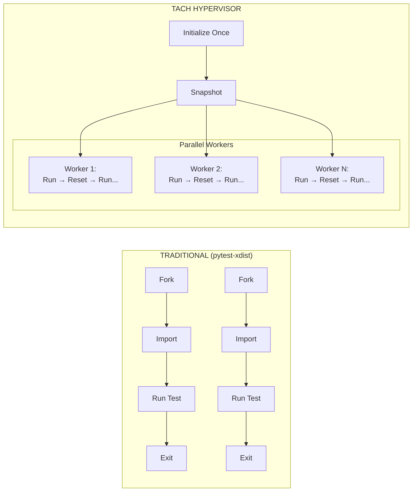
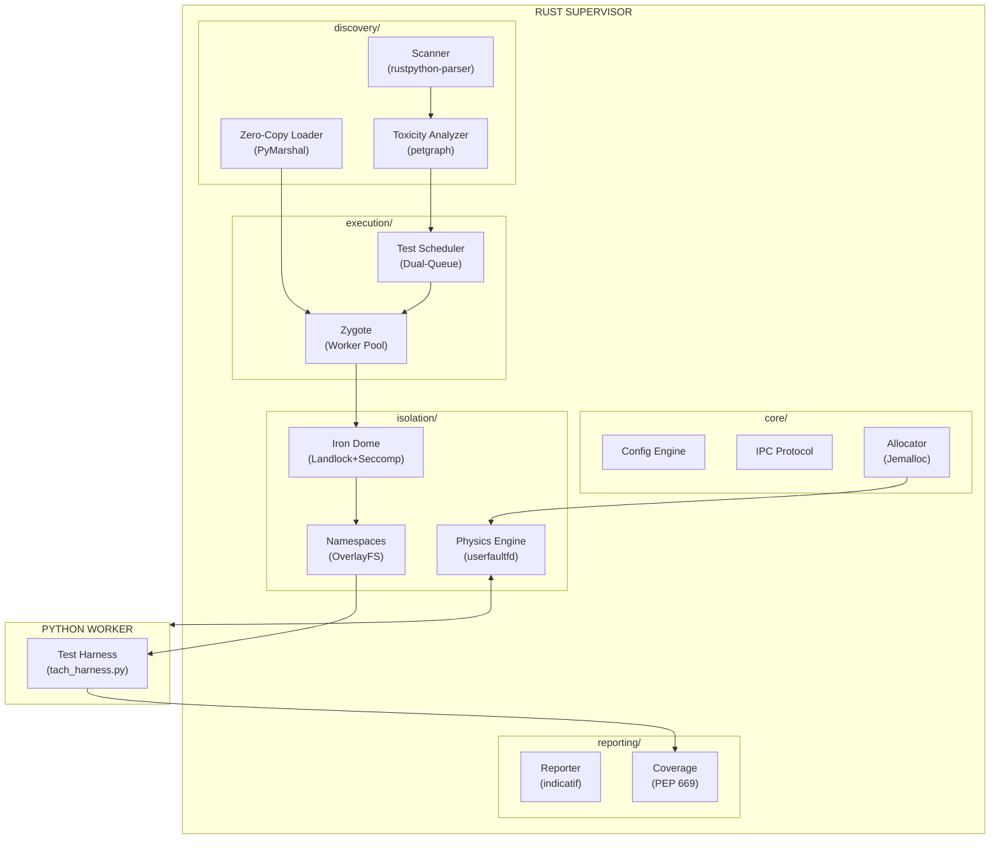

<div align="center">

# Tach

**A Snapshot-Hypervisor for Python Tests**

[](CHANGELOG.md)
[](https://www.rust-lang.org/)
[](https://www.python.org/)
[](https://kernel.org/)
[](LICENSE)

_Replace pytest's execution model with microsecond-scale memory snapshots._

> **Alpha Release**: APIs may change. Not recommended for production use. See [CHANGELOG.md](CHANGELOG.md) for roadmap.

</div>

---

## Overview

Tach is a **Runtime Hypervisor for Python Tests**. It abandons the traditional process creation model (`fork()` or `spawn()`) in favor of **Snapshot/Restore** architecture using Linux `userfaultfd`.

Instead of creating a new process for every test (~2ms + import time), Tach creates a process **once**, captures a memory snapshot, runs a test, and **restores** the memory state in **less than 50 microseconds**.

### The Problem

Traditional test runners suffer from three fundamental performance bottlenecks:

1. **Import Tax**: Python module imports are expensive. `import pandas` takes 200ms+.
2. **Fork Safety**: `fork()` copies locked mutexes from background threads, causing deadlocks.
3. **Allocator Churn**: Python's `obmalloc` fragments memory, making snapshots unstable.

### The Tach Solution


```mermaid
flowchart LR
    subgraph Traditional["TRADITIONAL (pytest-xdist)"]
        direction TB
        T1[Fork] --> T2[Import] --> T3[Run Test] --> T4[Exit]
        T5[Fork] --> T6[Import] --> T7[Run Test] --> T8[Exit]
    end

    subgraph Tach["TACH HYPERVISOR"]
        direction TB
        Z1[Initialize Once] --> Z2[Snapshot]
        Z2 --> W1 & W2 & WN
        subgraph Workers["Parallel Workers"]
            W1["Worker 1:<br/>Run → Reset → Run..."]
            W2["Worker 2:<br/>Run → Reset → Run..."]
            WN["Worker N:<br/>Run → Reset → Run..."]
        end
    end
```

| Metric            | pytest (Standard)  | Tach (Hypervisor)  |
| :---------------- | :----------------- | :----------------- |
| **Reset Latency** | ~200ms             | **< 50us**         |
| **Throughput**    | 1x                 | **100x+**          |
| **Fork Safety**   | Unsafe (Deadlocks) | Safe (Lock Reset)  |
| **Security**      | None               | Landlock + Seccomp |

---

## Quick Start

### Recommended: Docker Development Environment

Docker is the **recommended development method** for tach-core. It provides a fully-configured environment with all kernel features enabled, preventing WSL2 crashes and ensuring consistent builds.

```bash
# Clone repository
git clone https://github.com/NikkeTryHard/tach-core.git && cd tach-core

# Start development container
docker compose up -d
docker compose exec dev bash

# Inside container - everything is ready
source .venv/bin/activate
cargo build --release
./target/release/tach-core self-test  # Verify all kernel features work
```

**VS Code Users:** Open the folder and click "Reopen in Container" when prompted. The Dev Container extension handles everything automatically.

See [Docker Development](#docker-development) section below for full details.

### Alternative: Native Linux

For native Linux development (not recommended on WSL2):

```bash
# Clone and build
git clone https://github.com/NikkeTryHard/tach-core.git && cd tach-core
python -m venv .venv && source .venv/bin/activate && pip install pytest
export PYO3_PYTHON=$(which python) && cargo build --release

# Run tests
./target/release/tach-core .

# With coverage (Python 3.12+)
./target/release/tach-core --coverage .
```

---

## System Requirements

| Requirement    | Specification                                  |
| :------------- | :--------------------------------------------- |
| **OS**         | Linux Kernel 5.13+ (Ubuntu 22.04+, Fedora 34+) |
| **Python**     | 3.10+ (3.12+ for PEP 669 coverage)             |
| **Rust**       | 1.88+ (stable)                                 |
| **Privileges** | `CAP_SYS_PTRACE` or root                       |

---

## Architecture

Tach consists of 5 domain modules with interconnected subsystems:


```mermaid
flowchart TB
    subgraph Supervisor["RUST SUPERVISOR"]
        subgraph Core["core/"]
            Config["Config Engine"]
            Protocol["IPC Protocol"]
            Allocator["Allocator<br/>(Jemalloc)"]
        end

        subgraph DiscoveryMod["discovery/"]
            Scanner["Scanner<br/>(rustpython-parser)"]
            Analysis["Toxicity Analyzer<br/>(petgraph)"]
            Loader["Zero-Copy Loader<br/>(PyMarshal)"]
        end

        subgraph Execution["execution/"]
            Scheduler["Test Scheduler<br/>(Dual-Queue)"]
            Zygote["Zygote<br/>(Worker Pool)"]
        end

        subgraph IsolationMod["isolation/"]
            Sandbox["Iron Dome<br/>(Landlock+Seccomp)"]
            Namespace["Namespaces<br/>(OverlayFS)"]
            Snapshot["Physics Engine<br/>(userfaultfd)"]
        end

        subgraph Reporting["reporting/"]
            Reporter["Reporter<br/>(indicatif)"]
            Coverage["Coverage<br/>(PEP 669)"]
        end
    end

    subgraph Worker["PYTHON WORKER"]
        Harness["Test Harness<br/>(tach_harness.py)"]
    end

    Scanner --> Analysis --> Scheduler
    Loader --> Zygote
    Scheduler --> Zygote
    Zygote --> Sandbox --> Namespace --> Harness
    Harness --> Coverage
    Snapshot <--> Worker
    Allocator --> Snapshot
```

### Documentation

Detailed technical documentation for each subsystem:

| Document                                                                | Description                                     |
| :---------------------------------------------------------------------- | :---------------------------------------------- |
| **Architecture**                                                        |                                                 |
| [Overview](docs/architecture/overview.md)                               | System architecture and component interactions  |
| [Discovery Engine](docs/architecture/discovery.md)                      | AST-based test discovery with rustpython-parser |
| [Zero-Copy Loader](docs/architecture/loader.md)                         | Bytecode compilation and injection              |
| [Toxicity Analysis](docs/architecture/toxicity.md)                      | Module toxicity detection and propagation       |
| [Physics Engine](docs/architecture/snapshot.md)                         | userfaultfd memory snapshots                    |
| [Zygote Lifecycle](docs/architecture/zygote.md)                         | Process management and worker spawning          |
| [Iron Dome](docs/architecture/sandbox.md)                               | Landlock and Seccomp security                   |
| [Isolation](docs/architecture/isolation.md)                             | Namespaces and OverlayFS                        |
| [Coverage System](docs/architecture/coverage.md)                        | PEP 669 ring buffer coverage                    |
| [Fixture Resolver](docs/architecture/resolver.md)                       | Fixture discovery and resolution                |
| [Allocator](docs/architecture/allocator.md)                             | Jemalloc integration                            |
| [IPC Protocol](docs/architecture/protocol.md)                           | Binary protocol and message format              |
| [Scheduler](docs/architecture/scheduler.md)                             | Test scheduling and dispatch                    |
| [Reporter](docs/architecture/reporter.md)                               | Output formatting and progress                  |
| [TTY Debugger](docs/architecture/debugger.md)                           | Interactive debugging via breakpoint()          |
| [Restoration Physics](docs/architecture/internal-architecture.md)       | Memory restoration invariants                   |
| **Security**                                                            |                                                 |
| [EPERM Doctrine](docs/security/sandbox-enforcement.md)                  | Kernel-level security validation                |
| **Operations**                                                          |                                                 |
| [Docker Development](#docker-development)                               | Container-based development environment         |
| [CI Runner Setup](docs/ci/self-hosted-runner.md)                        | Self-hosted runner configuration                |
| [WSL2 Setup](docs/quickstart.md#wsl2-setup)                             | Platform-specific setup for WSL2                |
| **Reference**                                                           |                                                 |
| [Configuration](docs/configuration.md)                                  | CLI, pyproject.toml, environment variables      |
| [Development](docs/development.md)                                      | Build, test, project structure                  |
| [Python Compatibility](docs/python-compatibility.md)                    | Python version matrix and PEP 703 notes         |
| [Troubleshooting](docs/troubleshooting.md)                              | Common issues and debug commands                |
| [API Reference](docs/api-reference.md)                                  | FFI functions and data structures               |
| **Decisions**                                                           |                                                 |
| [ADR: Rust 2024 Edition](docs/decisions/rust-2024-edition-migration.md) | Edition migration rationale                     |

---

## CLI Usage

```bash
# Run all tests
tach-core .

# Run specific file
tach-core tests/test_example.py

# Parallel execution with 4 workers
tach-core -n 4 .

# Filter tests by keyword or marker
tach-core -k "network" .
tach-core -m "not slow" .

# Fail fast - stop on first failure
tach-core -x .

# Verbose output
tach-core -v .

# List tests without running
tach-core list .

# Dry run - show what would run without executing
tach-core --dry-run .

# Self-test kernel support
tach-core self-test

# Enable coverage
tach-core --coverage .

# JSON output
tach-core --format json .

# Traceback formatting
tach-core --tb short .

# JUnit XML report
tach-core --junit-xml results.xml .

# Test timeout (seconds)
tach-core --timeout 30 .

# Disable sandbox (development)
tach-core --no-isolation .

# Watch mode
tach-core --watch .
```

See [Configuration Reference](docs/configuration.md) for all CLI flags and options.

---

## Configuration

Configure via `pyproject.toml`:

```toml
[tool.tach]
test_pattern = "test_*.py"
timeout = 60
workers = 4

[tool.tach.coverage]
enabled = true
source = ["src"]
omit = ["**/test_*"]
format = "lcov"

[tool.pytest_env]
DATABASE_URL = "sqlite:///:memory:"
```

See [Configuration Reference](docs/configuration.md) for full details.

---

## Key Technical Features

- **Zero-Copy Module Loading**: Bypasses `importlib` entirely via `PyMarshal_ReadObjectFromString`
- **userfaultfd Snapshots**: Sub-50us memory reset via `madvise(MADV_DONTNEED)`
- **Landlock + Seccomp**: Defense-in-depth sandbox for worker processes
- **PEP 669 Coverage**: Lock-free ring buffer with `memfd_create`
- **Jemalloc Integration**: Deterministic heap via `mallctl` tcache flush
- **Toxicity Propagation**: Fixed-point algorithm over petgraph dependency graph
- **Django Integration**: Automatic transaction rollback and connection pooling
- **Async Support**: Built-in asyncio loop management for coroutine tests

---

## License

MIT License. See [LICENSE](LICENSE) for details.

---

## Docker Development

Docker is the **enforced development standard** for tach-core. It eliminates WSL2 kernel crashes, ensures all kernel features work correctly, and provides a consistent environment across all developers.

### Why Docker?

| Issue                   | Native WSL2                 | Docker Container              |
| ----------------------- | --------------------------- | ----------------------------- |
| WSL2 kernel crashes     | Common with userfaultfd     | Stable (privileged mode)      |
| Landlock availability   | Requires `.wslconfig` setup | Works out of the box          |
| Environment consistency | Varies by machine           | Identical everywhere          |
| Onboarding time         | Hours (kernel config)       | Minutes (`docker compose up`) |

### Quick Start

```bash
# Option 1: Docker Compose (standalone)
docker compose up -d              # Build and start container
docker compose exec dev bash      # Enter container shell

# Option 2: VS Code Dev Container
# Open folder → Click "Reopen in Container" → Done
```

### What's Included

The development container includes:

| Category    | Tools                           |
| ----------- | ------------------------------- |
| **Build**   | Rust 1.88+, Cargo, Clang, CMake |
| **Python**  | Python 3.12, pip, pytest, venv  |
| **Debug**   | gdb, strace, perf, htop         |
| **Search**  | ripgrep, fd-find                |
| **Editors** | vim                             |

### Container Commands

```bash
# Build tach-core
cargo build --release

# Run self-test (verify kernel features)
./target/release/tach-core self-test

# Run unit tests
cargo test --lib

# Run Python gauntlet tests
source .venv/bin/activate
pytest tests/gauntlet/ -v

# Exit container
exit

# Stop container
docker compose down
```

### Kernel Features

The container runs with `--privileged` mode, enabling all kernel features:

```
[PASS] Kernel Version: 6.6.87 (requires 5.15+)
[PASS] userfaultfd: Enabled via vm.unprivileged_userfaultfd=1
[PASS] Landlock: ABI v4 supported
[PASS] Seccomp: BPF filters available
[PASS] Jemalloc: active
[PASS] ptrace: CAP_SYS_PTRACE available
[PASS] Python: Python 3.12 (sys.monitoring available)
```

### Persistent Caches

Docker volumes preserve build caches across restarts:

- `cargo-registry` - Downloaded crates
- `cargo-git` - Git dependencies

First build: ~3 minutes. Subsequent builds: ~10 seconds (incremental).

### Files

| File                              | Purpose                    |
| --------------------------------- | -------------------------- |
| `Dockerfile`                      | Container image definition |
| `docker-compose.yml`              | Service configuration      |
| `.devcontainer/devcontainer.json` | VS Code integration        |
| `.devcontainer/post-create.sh`    | Auto-setup script          |
| `.dockerignore`                   | Build context optimization |

See [WSL2 Setup Guide](docs/quickstart.md#wsl2-setup) for additional Docker documentation and WSL2 kernel configuration.

---

## Development

```bash
# Setup
python -m venv .venv && source .venv/bin/activate && pip install pytest
rustup component add rustfmt clippy

# Build
export PYO3_PYTHON=$(which python)
cargo build --release

# Test
cargo test --lib           # Unit tests
cargo test --test '*'      # Integration tests

# Lint
cargo fmt --check && cargo clippy -- -D warnings
```

### Pre-commit Hooks

This project uses [pre-commit](https://pre-commit.com/) for automated code quality checks:

```bash
pip install pre-commit && pre-commit install
```

See [Development Guide](docs/development.md) for complete build commands, testing details, and project structure.

---

<div align="center">

**Built with Rust for performance and reliability.**

[Documentation](docs/) | [Issues](https://github.com/NikkeTryHard/tach-core/issues)

</div>
