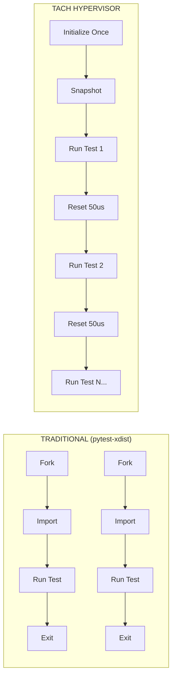
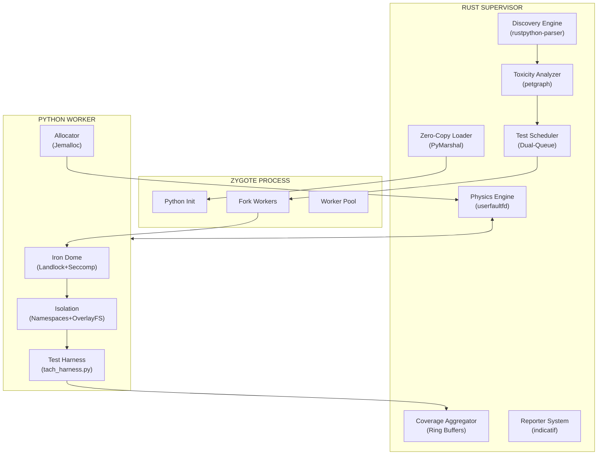

<div align="center">

# Tach

**A Snapshot-Hypervisor for Python Tests**

[](https://www.rust-lang.org/)
[](https://www.python.org/)
[](https://kernel.org/)
[](LICENSE)

_Replace pytest's execution model with microsecond-scale memory snapshots._

</div>

---

## Overview

Tach is a **Runtime Hypervisor for Python Tests**. It abandons the traditional process creation model (`fork()` or `spawn()`) in favor of **Snapshot/Restore** architecture using Linux `userfaultfd`.

Instead of creating a new process for every test (~2ms + import time), Tach creates a process **once**, captures a memory snapshot, runs a test, and **restores** the memory state in **less than 50 microseconds**.

### The Problem

Traditional test runners suffer from three fundamental performance bottlenecks:

1. **Import Tax**: Python module imports are expensive. `import pandas` takes 200ms+.
2. **Fork Safety**: `fork()` copies locked mutexes from background threads, causing deadlocks.
3. **Allocator Churn**: Python's `obmalloc` fragments memory, making snapshots unstable.

### The Tach Solution


```mermaid
flowchart LR
    subgraph Traditional["TRADITIONAL (pytest-xdist)"]
        T1[Fork] --> T2[Import] --> T3[Run Test] --> T4[Exit]
        T5[Fork] --> T6[Import] --> T7[Run Test] --> T8[Exit]
    end

    subgraph Tach["TACH HYPERVISOR"]
        Z1[Initialize Once] --> Z2[Snapshot]
        Z2 --> Z3[Run Test 1]
        Z3 --> Z4[Reset 50us]
        Z4 --> Z5[Run Test 2]
        Z5 --> Z6[Reset 50us]
        Z6 --> Z7[Run Test N...]
    end
```

| Metric            | pytest (Standard)  | Tach (Hypervisor)  |
| :---------------- | :----------------- | :----------------- |
| **Reset Latency** | ~200ms             | **< 50us**         |
| **Throughput**    | 1x                 | **100x+**          |
| **Fork Safety**   | Unsafe (Deadlocks) | Safe (Lock Reset)  |
| **Security**      | None               | Landlock + Seccomp |

---

## Quick Start

```bash
# Clone and build
git clone https://github.com/user/tach-core.git && cd tach-core
python -m venv .venv && source .venv/bin/activate && pip install pytest
export PYO3_PYTHON=$(which python) && cargo build --release

# Run tests
./target/release/tach-core .

# With coverage (Python 3.12+)
./target/release/tach-core --coverage .
```

---

## System Requirements

| Requirement    | Specification                                  |
| :------------- | :--------------------------------------------- |
| **OS**         | Linux Kernel 5.13+ (Ubuntu 22.04+, Fedora 34+) |
| **Python**     | 3.10+ (3.12+ for PEP 669 coverage)             |
| **Rust**       | 1.75+                                          |
| **Privileges** | `CAP_SYS_PTRACE` or root                       |

---

## Architecture

Tach consists of 14 interconnected subsystems:


```mermaid
flowchart TB
    subgraph Supervisor["RUST SUPERVISOR"]
        Discovery["Discovery Engine<br/>(rustpython-parser)"]
        Toxicity["Toxicity Analyzer<br/>(petgraph)"]
        Loader["Zero-Copy Loader<br/>(PyMarshal)"]
        Scheduler["Test Scheduler<br/>(Dual-Queue)"]
        Snapshot["Physics Engine<br/>(userfaultfd)"]
        Coverage["Coverage Aggregator<br/>(Ring Buffers)"]
        Reporter["Reporter System<br/>(indicatif)"]
    end

    subgraph Zygote["ZYGOTE PROCESS"]
        Init["Python Init"]
        Fork["Fork Workers"]
        Pool["Worker Pool"]
    end

    subgraph Worker["PYTHON WORKER"]
        Sandbox["Iron Dome<br/>(Landlock+Seccomp)"]
        Isolation["Isolation<br/>(Namespaces+OverlayFS)"]
        Harness["Test Harness<br/>(tach_harness.py)"]
        Allocator["Allocator<br/>(Jemalloc)"]
    end

    Discovery --> Toxicity --> Scheduler
    Loader --> Init
    Scheduler --> Fork
    Fork --> Sandbox --> Isolation --> Harness
    Harness --> Coverage
    Snapshot <--> Worker
    Allocator --> Snapshot
```

### Documentation

Detailed technical documentation for each subsystem:

| Document                                              | Description                                     |
| :---------------------------------------------------- | :---------------------------------------------- |
| **Architecture**                                      |                                                 |
| [Overview](docs/architecture/overview.md)          | System architecture and component interactions  |
| [Discovery Engine](docs/architecture/discovery.md) | AST-based test discovery with rustpython-parser |
| [Zero-Copy Loader](docs/architecture/loader.md)    | Bytecode compilation and injection              |
| [Toxicity Analysis](docs/architecture/toxicity.md) | Module toxicity detection and propagation       |
| [Physics Engine](docs/architecture/snapshot.md)    | userfaultfd memory snapshots                    |
| [Zygote Lifecycle](docs/architecture/zygote.md)    | Process management and worker spawning          |
| [Iron Dome](docs/architecture/sandbox.md)          | Landlock and Seccomp security                   |
| [Isolation](docs/architecture/isolation.md)        | Namespaces and OverlayFS                        |
| [Coverage System](docs/architecture/coverage.md)   | PEP 669 ring buffer coverage                    |
| [Fixture Resolver](docs/architecture/resolver.md)  | Fixture discovery and resolution                |
| [Allocator](docs/architecture/allocator.md)        | Jemalloc integration                            |
| [IPC Protocol](docs/architecture/protocol.md)      | Binary protocol and message format              |
| [Scheduler](docs/architecture/scheduler.md)        | Test scheduling and dispatch                    |
| [Reporter](docs/architecture/reporter.md)          | Output formatting and progress                  |
| **Reference**                                         |                                                 |
| [Configuration](docs/configuration.md)                | CLI, pyproject.toml, environment variables      |
| [Development](docs/development.md)                    | Build, test, project structure                  |
| [Troubleshooting](docs/troubleshooting.md)            | Common issues and debug commands                |
| [API Reference](docs/api-reference.md)                | FFI functions and data structures               |

---

## CLI Usage

```bash
# Run all tests
tach-core .

# Run specific file
tach-core tests/test_example.py

# List tests without running
tach-core list .

# Enable coverage
tach-core --coverage .

# JSON output
tach-core --format json .

# JUnit XML report
tach-core --junit-xml results.xml .

# Disable sandbox (development)
tach-core --no-isolation .

# Watch mode
tach-core --watch .
```

---

## Configuration

Configure via `pyproject.toml`:

```toml
[tool.tach]
test_pattern = "test_*.py"
timeout = 60
workers = 4

[tool.tach.coverage]
enabled = true
source = ["src"]
omit = ["**/test_*"]
format = "lcov"

[tool.pytest_env]
DATABASE_URL = "sqlite:///:memory:"
```

See [Configuration Reference](docs/configuration.md) for full details.

---

## Implementation Status

| Phase | Component                   | Status   |
| :---- | :-------------------------- | :------- |
| 1     | Physics Check (userfaultfd) | Complete |
| 2     | Zero-Copy Loader            | Complete |
| 3     | Toxicity Filter             | Complete |
| 4     | Worker Loop                 | Complete |
| 5.1   | Coverage (PEP 669)          | Complete |
| 5.2   | Iron Dome (Sandbox)         | Complete |
| 5.3   | Hot Reload                  | Complete |
| 5.4   | Allocator (Jemalloc)        | Complete |
| 6.1   | Coverage Resolution         | Complete |
| 6.2   | Configuration Engine        | Complete |
| 6.3   | Progress Reporter           | Complete |

**Total Tests: ~334** (All Passing)

---

## Key Technical Features

- **Zero-Copy Module Loading**: Bypasses `importlib` entirely via `PyMarshal_ReadObjectFromString`
- **userfaultfd Snapshots**: Sub-50us memory reset via `madvise(MADV_DONTNEED)`
- **Landlock + Seccomp**: Defense-in-depth sandbox for worker processes
- **PEP 669 Coverage**: Lock-free ring buffer with `memfd_create`
- **Jemalloc Integration**: Deterministic heap via `mallctl` tcache flush
- **Toxicity Propagation**: Fixed-point algorithm over petgraph dependency graph
- **Django Integration**: Automatic transaction rollback and connection pooling
- **Async Support**: Built-in asyncio loop management for coroutine tests

---

## License

MIT License. See [LICENSE](LICENSE) for details.

---

<div align="center">

**Built with Rust for performance and reliability.**

[Documentation](docs/) | [Issues](https://github.com/user/tach-core/issues)

</div>
