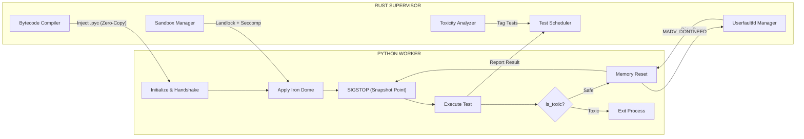
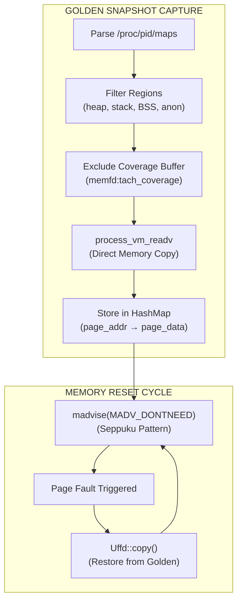
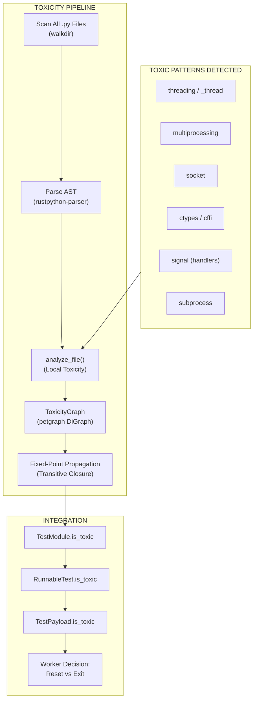
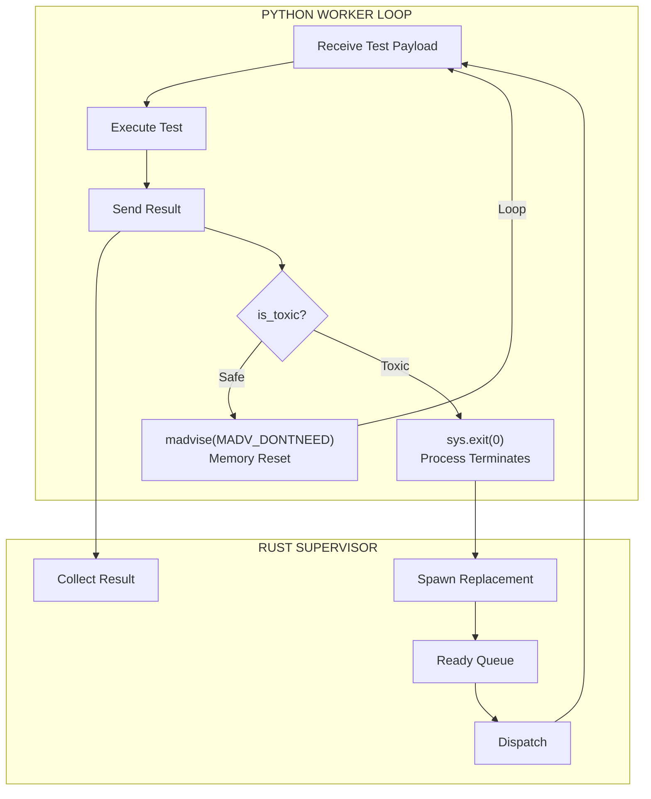
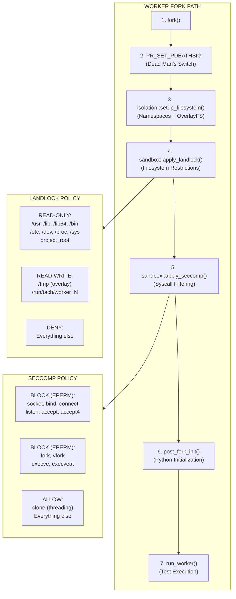
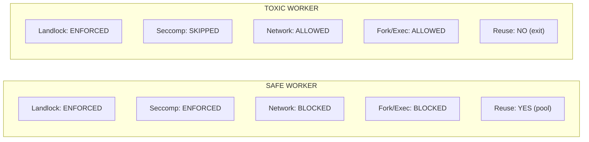
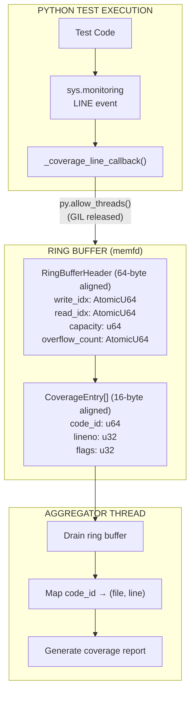

<div align="center">

# Tach

**A Snapshot-Hypervisor for Python Tests**

[](https://www.rust-lang.org/)
[](https://www.python.org/)
[](https://kernel.org/)
[](LICENSE)

_Replace pytest's execution model with microsecond-scale memory snapshots._

</div>

---

## Table of Contents

- [Overview](#overview)
- [Performance Metrics](#performance-metrics)
- [Architecture](#architecture)
  - [The Jedi Protocol](#the-jedi-protocol)
  - [Physics Engine](#physics-engine)
  - [Zero-Copy Loader](#zero-copy-loader)
  - [Toxicity Analysis](#toxicity-analysis)
  - [Worker Loop](#worker-loop)
  - [The Iron Dome (Sandbox)](#the-iron-dome-sandbox)
  - [Zero-Overhead Coverage](#zero-overhead-coverage)
  - [Deterministic Allocator](#deterministic-allocator)
- [System Requirements](#system-requirements)
- [Installation](#installation)
- [Usage](#usage)
- [Development](#development)
  - [Project Structure](#project-structure)
  - [Running Tests](#running-tests)
- [Implementation Status](#implementation-status)
- [Test Coverage](#test-coverage)
- [Technical Specifications](#technical-specifications)

---

## Overview

Tach is a **Hypervisor for Python**. It abandons the traditional process creation model (`fork()` or `spawn()`) in favor of **Snapshot/Restore** architecture using Linux `userfaultfd`.

Instead of creating a new process for every test (taking approximately 2ms plus import time), Tach creates a process **once**, captures a memory snapshot, runs a test, and then **restores** the memory state in **less than 50 microseconds**.

### The Problem: Import Tax and Fork Safety

Traditional test runners suffer from three fundamental performance bottlenecks:

1. **Import Tax:** Python module imports are expensive. `import pandas` takes 200ms or more. Even with `fork()`, this penalty is paid in the Zygote initialization.

2. **Fork Safety:** The `fork()` system call copies locked mutexes from background threads (such as logging handlers), causing deadlocks in child processes.

3. **Allocator Churn:** Python's `obmalloc` fragments memory over time, making standard memory snapshots unstable.

### The Tach Solution

Tach implements a multi-layered approach to eliminate these bottlenecks:

1. **Zero-Copy Loading:** Bypasses Python's `importlib` entirely. Rust compiles `.py` source files to `.pyc` bytecode, memory-maps them, and injects them directly into the Python interpreter via C-API.

2. **Snapshot Isolation:** Uses `userfaultfd` to track memory writes and capture "golden" snapshots of worker memory state.

3. **Instant Reset:** After test execution, dirty pages are dropped via `madvise(MADV_DONTNEED)`. Subsequent memory access triggers page faults, which are serviced from the golden snapshot.

4. **The Iron Dome:** Landlock filesystem isolation + Seccomp syscall filtering provide defense-in-depth security for worker processes.

5. **Deterministic Allocator:** Jemalloc with explicit tcache flush ensures consistent memory layout across snapshot/restore cycles.

---

## Performance Metrics

| Metric                 | pytest (Standard)    | Tach (Legacy Fork) | Tach (Hypervisor)    |
| :--------------------- | :------------------- | :----------------- | :------------------- |
| **Isolation Strategy** | Process Spawn        | `fork()`           | Memory Reset         |
| **Reset Latency**      | ~200ms               | ~1ms               | **< 50μs**           |
| **Throughput**         | 1x                   | 50x                | **100x+**            |
| **Fork Safety**        | Safe (Slow)          | Unsafe (Deadlocks) | Safe (Lock Reset)    |
| **Memory Overhead**    | Full copy per worker | CoW sharing        | Minimal (page-level) |
| **Security**           | None                 | None               | Landlock + Seccomp   |

### Zero-Copy Loader Performance

| Metric                            | Cold Cache                | Warm Cache        |
| :-------------------------------- | :------------------------ | :---------------- |
| **Compilation Time (91 modules)** | 9.7 seconds               | 345 milliseconds  |
| **Speedup Factor**                | 1x                        | **28x**           |
| **Cache Persistence**             | Disk-based `.tach/cache/` | mtime-invalidated |

### Sandbox Overhead

| Component          | Overhead | Notes                 |
| :----------------- | :------- | :-------------------- |
| Landlock setup     | ~100μs   | One-time per worker   |
| Seccomp setup      | ~50μs    | One-time per worker   |
| Coverage (PEP 669) | < 1%     | Lock-free ring buffer |

---

## Architecture

### The Jedi Protocol

The Jedi Protocol describes the communication flow between the Rust Supervisor and Python Workers:


```mermaid
flowchart LR
    subgraph Supervisor["RUST SUPERVISOR"]
        Compiler["Bytecode Compiler"]
        Uffd["Userfaultfd Manager"]
        Scheduler["Test Scheduler"]
        ToxicityGraph["Toxicity Analyzer"]
        Sandbox["Sandbox Manager"]
    end

    subgraph Worker["PYTHON WORKER"]
        direction TB
        Init["Initialize & Handshake"]
        IronDome["Apply Iron Dome"]
        Snapshot["SIGSTOP (Snapshot Point)"]
        Run["Execute Test"]
        Decision{is_toxic?}
        Reset["Memory Reset"]
        Exit["Exit Process"]
    end

    Compiler -->|"Inject .pyc (Zero-Copy)"| Init
    ToxicityGraph -->|"Tag Tests"| Scheduler
    Sandbox -->|"Landlock + Seccomp"| IronDome
    Init --> IronDome --> Snapshot
    Snapshot --> Run
    Run -->|"Report Result"| Scheduler
    Run --> Decision
    Decision -->|"Safe"| Reset
    Decision -->|"Toxic"| Exit
    Reset -->|"Dirty Pages"| Uffd
    Uffd -->|"MADV_DONTNEED"| Reset
    Reset --> Snapshot
```

**Protocol Phases:**

1. **Initialization:** Worker process starts, performs UFFD handshake with Supervisor via SCM_RIGHTS
2. **Iron Dome:** Apply Landlock filesystem restrictions and Seccomp syscall filters
3. **Snapshot Capture:** Worker issues SIGSTOP; Supervisor captures golden memory state
4. **Test Execution:** Worker resumes, executes assigned test, reports results
5. **Dual-Path Decision:** Based on `is_toxic` flag:
   - **Safe:** Memory reset via `madvise(MADV_DONTNEED)`, loop back to snapshot point
   - **Toxic:** Exit process immediately, Supervisor spawns replacement

---

### Physics Engine

The Physics Engine (`snapshot.rs`) implements kernel-level memory management:


```mermaid
flowchart TB
    subgraph Capture["GOLDEN SNAPSHOT CAPTURE"]
        Maps["Parse /proc/pid/maps"]
        Filter["Filter Regions\n(heap, stack, BSS, anon)"]
        Exclude["Exclude Coverage Buffer\n(memfd:tach_coverage)"]
        Copy["process_vm_readv\n(Direct Memory Copy)"]
        Store["Store in HashMap\n(page_addr → page_data)"]
    end

    subgraph Reset["MEMORY RESET CYCLE"]
        Invalidate["madvise(MADV_DONTNEED)\n(Seppuku Pattern)"]
        Fault["Page Fault Triggered"]
        Restore["Uffd::copy()\n(Restore from Golden)"]
    end

    Maps --> Filter --> Exclude --> Copy --> Store
    Store --> Invalidate
    Invalidate --> Fault --> Restore
    Restore --> Invalidate
```

**Technical Implementation:**

| Component          | System Call              | Purpose                                                |
| :----------------- | :----------------------- | :----------------------------------------------------- |
| Memory Capture     | `process_vm_readv`       | Copy worker memory to Supervisor without ptrace attach |
| Page Tracking      | `userfaultfd`            | Register memory regions for fault notification         |
| Page Invalidation  | `madvise(MADV_DONTNEED)` | Drop pages, forcing re-fault on next access            |
| Page Restoration   | `ioctl(UFFDIO_COPY)`     | Copy golden page back to worker address space          |
| Coverage Exclusion | Region name filtering    | Exclude `memfd:tach_coverage` from uffd registration   |

---

### Zero-Copy Loader

The Zero-Copy Loader (`loader.rs`) bypasses Python's import machinery:


```mermaid
flowchart LR
    subgraph Rust["RUST SUPERVISOR"]
        Source[".py Source Files"]
        Compile["Compile to .pyc\n(py_compile)"]
        Cache["Bytecode Cache\n(.tach/cache/)"]
        Registry["ModuleRegistry\n(DashMap)"]
    end

    subgraph Python["PYTHON WORKER"]
        Finder["TachMetaPathFinder\n(sys.meta_path[0])"]
        Loader["TachLoader.exec_module"]
        Marshal["PyMarshal_ReadObjectFromString"]
        Exec["PyImport_ExecCodeModuleObject"]
        Module["Loaded Module"]
    end

    Source --> Compile --> Cache --> Registry
    Registry -->|"get_module(name)"| Finder
    Finder -->|"load_module(bytecode)"| Loader
    Loader --> Marshal --> Exec --> Module
```

**Advantages over `importlib`:**

- No filesystem traversal (`sys.path` scanning)
- No disk I/O (bytecode pre-loaded in RAM)
- No repeated compilation (cached once)
- Sub-millisecond module materialization
- Header-stripped bytecode (16-byte `.pyc` header removed)

---

### Toxicity Analysis

The Toxicity Analyzer (`analysis.rs`, `graph.rs`) identifies modules that cannot be safely snapshotted:


```mermaid
flowchart TB
    subgraph Discovery["TOXICITY PIPELINE"]
        direction TB
        Scan["Scan All .py Files\n(walkdir)"]
        Parse["Parse AST\n(rustpython-parser)"]
        Analyze["analyze_file()\n(Local Toxicity)"]
        Graph["ToxicityGraph\n(petgraph DiGraph)"]
        Propagate["Fixed-Point Propagation\n(Transitive Closure)"]
    end

    subgraph Patterns["TOXIC PATTERNS DETECTED"]
        Threading["threading / _thread"]
        Multiprocessing["multiprocessing"]
        Socket["socket"]
        Ctypes["ctypes / cffi"]
        Signal["signal (handlers)"]
        Subprocess["subprocess"]
    end

    subgraph Output["INTEGRATION"]
        TestModule["TestModule.is_toxic"]
        RunnableTest["RunnableTest.is_toxic"]
        TestPayload["TestPayload.is_toxic"]
        Worker["Worker Decision:\nReset vs Exit"]
    end

    Scan --> Parse --> Analyze
    Patterns --> Analyze
    Analyze --> Graph --> Propagate
    Propagate --> TestModule --> RunnableTest --> TestPayload --> Worker
```

**Transitive Propagation Algorithm:**

```
1. Build directed graph: Module → Imports
2. Analyze each module for LOCAL toxicity
3. Fixed-point iteration:
   REPEAT:
     FOR each module M:
       IF any import of M is toxic:
         Mark M as toxic
   UNTIL no changes
4. Result: Complete transitive closure of toxicity
```

---

### Worker Loop

The Worker Loop (`zygote.rs`, `tach_harness.py`) implements the dual-path execution model:


```mermaid
flowchart TB
    subgraph Worker["PYTHON WORKER LOOP"]
        direction TB
        Receive["Receive Test Payload"]
        Execute["Execute Test"]
        Report["Send Result"]
        Decision{is_toxic?}
        Reset["madvise(MADV_DONTNEED)<br/>Memory Reset"]
        Exit["sys.exit(0)<br/>Process Terminates"]
    end

    subgraph Supervisor["RUST SUPERVISOR"]
        ReadyQueue["Ready Queue"]
        Dispatch["Dispatch"]
        Collect["Collect Result"]
        Spawn["Spawn Replacement"]
    end

    ReadyQueue --> Dispatch --> Receive
    Receive --> Execute --> Report --> Collect
    Report --> Decision
    Decision -->|"Safe"| Reset
    Decision -->|"Toxic"| Exit
    Reset -->|"Loop"| Receive
    Exit --> Spawn --> ReadyQueue
```

**Dual-Path Decision Logic:**

| Test Type        | After Execution          | Worker Fate          |
| :--------------- | :----------------------- | :------------------- |
| Safe (non-toxic) | `madvise(MADV_DONTNEED)` | Continues loop       |
| Toxic            | `sys.exit(0)`            | Terminates, replaced |

---

### The Iron Dome (Sandbox)

The Iron Dome (`sandbox.rs`) implements defense-in-depth security for worker processes:


```mermaid
flowchart TB
    subgraph Fork["WORKER FORK PATH"]
        direction TB
        F1["1. fork()"]
        F2["2. PR_SET_PDEATHSIG\n(Dead Man's Switch)"]
        F3["3. isolation::setup_filesystem()\n(Namespaces + OverlayFS)"]
        F4["4. sandbox::apply_landlock()\n(Filesystem Restrictions)"]
        F5["5. sandbox::apply_seccomp()\n(Syscall Filtering)"]
        F6["6. post_fork_init()\n(Python Initialization)"]
        F7["7. run_worker()\n(Test Execution)"]
    end

    subgraph Landlock["LANDLOCK POLICY"]
        RO["READ-ONLY:\n/usr, /lib, /lib64, /bin\n/etc, /dev, /proc, /sys\nproject_root"]
        RW["READ-WRITE:\n/tmp (overlay)\n/run/tach/worker_N"]
        DENY["DENY:\nEverything else"]
    end

    subgraph Seccomp["SECCOMP POLICY"]
        BlockNet["BLOCK (EPERM):\nsocket, bind, connect\nlisten, accept, accept4"]
        BlockProc["BLOCK (EPERM):\nfork, vfork\nexecve, execveat"]
        Allow["ALLOW:\nclone (threading)\nEverything else"]
    end

    F1 --> F2 --> F3 --> F4 --> F5 --> F6 --> F7
    F4 --> Landlock
    F5 --> Seccomp
```

**Safe vs Toxic Worker Security Matrix:**


```mermaid
flowchart LR
    subgraph Safe["SAFE WORKER"]
        S1["Landlock: ENFORCED"]
        S2["Seccomp: ENFORCED"]
        S3["Network: BLOCKED"]
        S4["Fork/Exec: BLOCKED"]
        S5["Reuse: YES (pool)"]
    end

    subgraph Toxic["TOXIC WORKER"]
        T1["Landlock: ENFORCED"]
        T2["Seccomp: SKIPPED"]
        T3["Network: ALLOWED"]
        T4["Fork/Exec: ALLOWED"]
        T5["Reuse: NO (exit)"]
    end
```

**Graceful Degradation:**

| Kernel Version | Landlock | Seccomp | Behavior                     |
| :------------- | :------- | :------ | :--------------------------- |
| 5.13+          | Full     | Full    | Complete sandbox             |
| 5.0-5.12       | None     | Full    | Seccomp only, warning logged |
| 3.17-4.x       | None     | Full    | Seccomp only, warning logged |
| < 3.17         | None     | None    | No sandbox, warning logged   |

---

### Zero-Overhead Coverage

The Coverage system (`coverage.rs`) implements PEP 669 `sys.monitoring` with a lock-free ring buffer:


```mermaid
flowchart TB
    subgraph Python["PYTHON TEST EXECUTION"]
        Test["Test Code"]
        PEP669["sys.monitoring\nLINE event"]
        Callback["_coverage_line_callback()"]
    end

    subgraph RingBuffer["RING BUFFER (memfd)"]
        Header["RingBufferHeader (64-byte aligned)\nwrite_idx: AtomicU64\nread_idx: AtomicU64\ncapacity: u64\noverflow_count: AtomicU64"]
        Entries["CoverageEntry[] (16-byte aligned)\ncode_id: u64\nlineno: u32\nflags: u32"]
    end

    subgraph Aggregator["AGGREGATOR THREAD"]
        Drain["Drain ring buffer"]
        Map["Map code_id → (file, line)"]
        Report["Generate coverage report"]
    end

    Test --> PEP669 --> Callback
    Callback -->|"py.allow_threads()\n(GIL released)"| RingBuffer
    Header --> Entries
    Entries --> Drain --> Map --> Report
```

**Key Design Decisions:**

| Decision                        | Rationale                                  |
| :------------------------------ | :----------------------------------------- |
| `memfd_create("tach_coverage")` | Anonymous shared memory, no filesystem     |
| 64-byte header alignment        | Cache-line aligned, prevents false sharing |
| 16-byte entry alignment         | Optimal for atomic operations              |
| `AtomicU64` for indices         | Lock-free concurrent access                |
| GIL released before write       | Prevents GIL contention in hot path        |
| Excluded from userfaultfd       | Survives `MADV_DONTNEED` during reset      |

---

### Deterministic Allocator

The Allocator (`allocator.rs`) uses Jemalloc to solve the Split-Brain problem:


```mermaid
flowchart TB
    subgraph Problem["SPLIT-BRAIN PROBLEM"]
        Snapshot["Snapshot captured"]
        Alloc1["Worker allocates memory"]
        Reset["Memory reset (MADV_DONTNEED)"]
        Alloc2["Worker allocates again"]
        Desync["Allocator metadata desync!\n(tcache holds stale pointers)"]
    end

    subgraph Solution["JEMALLOC SOLUTION"]
        JemallocInit["#[global_allocator]\nstatic ALLOC: Jemalloc"]
        TcacheFlush["mallctl('thread.tcache.flush')"]
        EpochSync["mallctl('epoch')"]
        Deterministic["Deterministic heap layout"]
    end

    Snapshot --> Alloc1 --> Reset --> Alloc2 --> Desync
    JemallocInit --> TcacheFlush --> EpochSync --> Deterministic
```

**Why Jemalloc?**

| Feature       | glibc malloc  | Jemalloc                         |
| :------------ | :------------ | :------------------------------- |
| tcache flush  | Not exposed   | `mallctl("thread.tcache.flush")` |
| Epoch sync    | Not available | `mallctl("epoch")`               |
| Determinism   | Poor          | Excellent                        |
| Fragmentation | High          | Low                              |

---

## System Requirements

| Requirement          | Specification                                              |
| :------------------- | :--------------------------------------------------------- |
| **Operating System** | Linux Kernel 5.13+ (Ubuntu 22.04+, Fedora 34+, AWS AL2023) |
| **Privileges**       | `CAP_SYS_PTRACE` (standard in most CI environments)        |
| **Python Version**   | Python 3.10+ (3.12+ for PEP 669 coverage)                  |
| **Rust Version**     | Rust 1.75+                                                 |
| **Allocator**        | Jemalloc (bundled)                                         |

**Kernel Feature Matrix:**

| Feature      | Minimum Kernel | Recommended |
| :----------- | :------------- | :---------- |
| userfaultfd  | 4.11           | 5.11+       |
| Landlock     | 5.13           | 5.19+       |
| Seccomp-BPF  | 3.17           | 4.14+       |
| memfd_create | 3.17           | 5.0+        |

**Docker Configuration:**

```yaml
security_opt:
  - seccomp:unconfined
cap_add:
  - SYS_PTRACE
```

---

## Installation

### From Source

```bash
# Clone repository
git clone https://github.com/NikkeTryHard/tach-core.git
cd tach-core

# Setup Python virtual environment
python -m venv .venv
source .venv/bin/activate
pip install pytest

# Build Rust binary
cargo build --release

# Verify kernel support (Physics Check)
sudo -E cargo test --test physics_check -- --ignored
```

---

## Usage

### Basic Execution

```bash
# Run all tests in current directory
sudo ./target/release/tach-core .

# Run specific test file
sudo ./target/release/tach-core tests/test_example.py

# Run without namespace isolation (development mode)
./target/release/tach-core --no-isolation .

# Enable coverage collection (Python 3.12+)
./target/release/tach-core --coverage .
```

### CLI Options

| Flag                 | Description                                   |
| :------------------- | :-------------------------------------------- |
| `--format json`      | Output results as JSON to stdout              |
| `--junit-xml <path>` | Generate JUnit XML report                     |
| `--watch`            | Watch mode: re-run on file changes            |
| `--no-isolation`     | Disable namespace isolation (for development) |
| `--coverage`         | Enable PEP 669 coverage collection            |
| `--list`             | List discovered tests without running         |
| `-v, --verbose`      | Increase output verbosity                     |

---

## Development

### Project Structure

```
tach-core/
├── src/
│   ├── main.rs           # CLI entry point, toxicity wiring, eager compilation
│   ├── lib.rs            # Module exports, discover_with_toxicity()
│   ├── allocator.rs      # Phase 5.4: Jemalloc global allocator
│   ├── analysis.rs       # Phase 3: Local toxicity scanner
│   ├── coverage.rs       # Phase 5.1: PEP 669 ring buffer coverage
│   ├── graph.rs          # Phase 3: ToxicityGraph with propagation
│   ├── sandbox.rs        # Phase 5.2: Landlock + Seccomp sandbox
│   ├── discovery.rs      # AST-based test discovery (rustpython-parser)
│   ├── resolver.rs       # Fixture dependency resolution
│   ├── scheduler.rs      # Async test scheduler (tokio)
│   ├── zygote.rs         # Python process lifecycle, FFI registration
│   ├── snapshot.rs       # Userfaultfd memory management
│   ├── loader.rs         # Zero-Copy Module Loader
│   ├── protocol.rs       # Binary IPC protocol (bincode)
│   ├── isolation.rs      # Linux namespace isolation
│   ├── environment.rs    # Environment injection
│   ├── tach_harness.py   # Python test harness, import hook, PEP 669
│   └── ...
├── rust_tests/           # Rust integration tests
│   ├── physics_check.rs          # UFFD memory reset verification
│   ├── snapshot_integration.rs   # Snapshot lifecycle tests
│   ├── loader_integration.rs     # Loader tests
│   ├── toxicity_integration.rs   # Toxicity pipeline tests
│   ├── tagging_integrity.rs      # is_toxic propagation tests
│   ├── phase4_integration.rs     # Worker loop tests
│   └── ...
├── tests/                # Python test fixtures
│   ├── gauntlet/         # Stress/security tests
│   ├── gauntlet_phase1/  # Memory reset verification
│   ├── gauntlet_phase2/  # Loader tests
│   ├── gauntlet_phase5/  # Hot reload tests
│   ├── gauntlet_phase5_1/ # Coverage tests
│   ├── gauntlet_phase5_2/ # Sandbox tests
│   ├── gauntlet_phase5_4/ # Allocator tests
│   ├── benchmark/        # Performance tests
│   └── ...
├── docs/
│   └── architecture/
│       ├── phase2_loader.md
│       ├── phase3_toxicity.md
│       ├── phase4_worker_loop.md
│       └── remote_development.md
├── .cargo/
│   └── config.toml
├── .github/
│   └── workflows/
│       └── ci.yml
└── .tach/                # Generated cache (gitignored)
    └── cache/
```

### Running Tests

```bash
# Rust unit tests
cargo test --lib                              # All unit tests

# Specific module tests
cargo test --lib sandbox::                    # 7 sandbox tests
cargo test --lib coverage::                   # 9 coverage tests
cargo test --lib analysis::                   # 49 toxicity scanner tests
cargo test --lib graph::                      # 20 toxicity graph tests

# Rust integration tests
cargo test --test phase4_integration          # Worker loop tests
cargo test --test toxicity_integration        # Toxicity pipeline tests
cargo test --test physics_check -- --ignored  # Requires sudo

# Python gauntlet tests
python -m pytest tests/gauntlet_phase5_1/ -v  # Coverage tests
python -m pytest tests/gauntlet_phase5_2/ -v  # Sandbox tests
python -m pytest tests/gauntlet_phase5_4/ -v  # Allocator tests
```

---

## Implementation Status

### Completed Phases

#### Phase 1: Physics Check ✅

Memory snapshot and reset mechanism verified. Userfaultfd-based page tracking, golden snapshot capture via `process_vm_readv`, memory reset via `madvise(MADV_DONTNEED)`, page restoration via `Uffd::copy()`.

#### Phase 2: Zero-Copy Loader ✅

Bypass `importlib` for instant module loading. Rust-side `.py` to `.pyc` compilation, bytecode cache with mtime invalidation, `PyMarshal_ReadObjectFromString` injection, `TachMetaPathFinder` import hook.

#### Phase 3: Toxicity Filter ✅

Identify and isolate unsafe modules. AST-based toxicity detection, `ToxicityGraph` with fixed-point propagation, `is_toxic` field propagation through `TestModule` → `RunnableTest` → `TestPayload`.

#### Phase 4: Worker Loop & Dual-Path Scheduler ✅

Transform from fork-server to true Hypervisor. Persistent worker loop, dual-path execution (Safe: reset, Toxic: exit), `WorkerHandle` pool for worker reuse, Dead Man's Switch (`PR_SET_PDEATHSIG`).

#### Phase 5: Observability & Hardening ✅

**Phase 5.1: Zero-Overhead Coverage (PEP 669)** ✅

- PEP 669 `sys.monitoring` integration (Python 3.12+)
- Lock-free ring buffer with `memfd_create`
- 64-byte aligned header, 16-byte aligned entries
- GIL discipline: `py.allow_threads()` before ring buffer access
- Coverage buffer excluded from userfaultfd registration
- `CoverageAggregator` thread drains buffer periodically
- **9 Rust tests, 7 Python tests passing**

**Phase 5.2: The Iron Dome (Sandbox Hardening)** ✅

- Landlock ABI V1 filesystem isolation (kernel 5.13+)
- RO: `/usr`, `/lib`, `/lib64`, `/bin`, `/etc`, `/dev`, `/proc`, `/sys`, project_root
- RW: `/tmp`, `/run/tach/worker_N`
- Seccomp-BPF syscall blacklist (safe workers only)
- Blocked: `socket`, `bind`, `connect`, `listen`, `accept`, `accept4`
- Blocked: `fork`, `vfork`, `execve`, `execveat`
- Clone NOT blocked (Python threading needs it)
- Toxic workers bypass Seccomp for integration test compatibility
- Graceful degradation on older kernels
- **7 Rust tests, 17 Python tests passing**

**Phase 5.3: Hot Reloading (sys.modules cleanup)** ✅

- Capture `_INITIAL_MODULES` baseline in `post_fork_init()`
- `cleanup_test_modules()` removes test imports
- Protected modules list (`tach_rust`, `pytest`, `django`, etc.)
- Integration with `reset_and_signal_ready()` cycle
- **4 Python tests passing**

**Phase 5.4: Deterministic Allocator (Jemalloc)** ✅

- `tikv-jemallocator` as global allocator
- tcache flush via `mallctl("thread.tcache.flush")`
- Epoch sync via `mallctl("epoch")`
- ELF parsing with `goblin` for libpython segment identification
- Solves Split-Brain allocator desynchronization problem
- **4 Rust tests, 6 Python tests passing**

---

## Test Coverage

| Category                                     | Tests   | Status         |
| :------------------------------------------- | :------ | :------------- |
| Rust Unit Tests (`analysis.rs`)              | 49      | ✅ Passing     |
| Rust Unit Tests (`graph.rs`)                 | 20      | ✅ Passing     |
| Rust Unit Tests (`loader.rs`)                | 17      | ✅ Passing     |
| Rust Unit Tests (`zygote.rs::tests`)         | 6       | ✅ Passing     |
| Rust Unit Tests (`protocol.rs::tests`)       | 8       | ✅ Passing     |
| Rust Unit Tests (`scheduler.rs::tests`)      | 8       | ✅ Passing     |
| Rust Unit Tests (`sandbox.rs::tests`)        | 7       | ✅ Passing     |
| Rust Unit Tests (`coverage.rs::tests`)       | 9       | ✅ Passing     |
| Rust Unit Tests (`snapshot.rs::tests`)       | 1       | ✅ Passing     |
| Rust Integration (`toxicity_integration.rs`) | 10      | ✅ Passing     |
| Rust Integration (`tagging_integrity.rs`)    | 5       | ✅ Passing     |
| Rust Integration (`loader_integration.rs`)   | 19      | ✅ Passing     |
| Rust Integration (`resolver_integration.rs`) | 8       | ✅ Passing     |
| Rust Integration (`snapshot_integration.rs`) | 7       | ✅ Passing     |
| Rust Integration (`phase4_integration.rs`)   | 10      | ✅ Passing     |
| Python Gauntlet Phase 1                      | 28      | ✅ Passing     |
| Python Gauntlet Phase 2                      | 36      | ✅ Passing     |
| Python Gauntlet Phase 5 (hot reload)         | 4       | ✅ Passing     |
| Python Gauntlet Phase 5.1 (coverage)         | 7       | ✅ Passing     |
| Python Gauntlet Phase 5.2 (sandbox)          | 17      | ✅ Passing     |
| Python Gauntlet Phase 5.4 (allocator)        | 6       | ✅ Passing     |
| Python Benchmark                             | 2       | ✅ Passing     |
| Python Gauntlet (crash signals)              | 8       | ✅ Passing     |
| Python Gauntlet (fs protection)              | 5       | ✅ Passing     |
| **Total**                                    | **297** | ✅ All Passing |

---

## Technical Specifications

### Sandbox Architecture (`sandbox.rs`)

```rust
/// Status of Landlock enforcement
pub enum SandboxStatus {
    FullyEnforced,      // All restrictions active
    PartiallyEnforced,  // Some features unavailable (older kernel)
    NotEnforced,        // Kernel too old (< 5.13)
}

/// Apply Landlock filesystem restrictions
/// RO: project_root, /usr, /lib, /lib64, /bin, /etc, /dev, /proc, /sys
/// RW: /tmp, /run/tach/worker_N
pub fn apply_landlock(project_root: &Path, worker_id: u32) -> Result<SandboxStatus>;

/// Apply Seccomp syscall blacklist (safe workers only)
/// Blocks: socket, bind, connect, listen, accept, accept4
/// Blocks: fork, vfork, execve, execveat
/// Allows: clone (Python threading), everything else
pub fn apply_seccomp() -> Result<()>;

/// Combined sandbox application with graceful degradation
pub fn apply_iron_dome(
    project_root: &Path,
    worker_id: u32,
    is_toxic: bool,
) -> Result<SandboxStatus>;
```

### Coverage Architecture (`coverage.rs`)

```rust
/// Ring buffer header (64-byte aligned for cache-line)
#[repr(C, align(64))]
pub struct RingBufferHeader {
    pub write_idx: AtomicU64,      // Producer index
    pub read_idx: AtomicU64,       // Consumer index
    pub capacity: u64,             // Number of entries
    pub overflow_count: AtomicU64, // Dropped entries counter
    _padding: [u8; 32],            // Pad to 64 bytes
}

/// Coverage entry (16-byte aligned)
#[repr(C, align(16))]
pub struct CoverageEntry {
    pub code_id: u64,   // id(code_object)
    pub lineno: u32,    // Line number
    pub flags: u32,     // Reserved for future use
}

/// Lock-free ring buffer for coverage data
pub struct CoverageRingBuffer {
    header: *mut RingBufferHeader,
    entries: *mut CoverageEntry,
    mmap_ptr: *mut u8,
    mmap_len: usize,
}

/// Aggregator thread that drains the ring buffer
pub struct CoverageAggregator {
    buffer: Arc<CoverageRingBuffer>,
    poll_interval: Duration,
    running: Arc<AtomicBool>,
}
```

### Allocator Architecture (`allocator.rs`)

```rust
use tikv_jemallocator::Jemalloc;

#[global_allocator]
static GLOBAL: Jemalloc = Jemalloc;

/// Flush thread-local cache for snapshot consistency
pub fn flush_tcache() {
    unsafe {
        tikv_jemalloc_sys::mallctl(
            b"thread.tcache.flush\0".as_ptr() as *const _,
            std::ptr::null_mut(),
            std::ptr::null_mut(),
            std::ptr::null(),
            0,
        );
    }
}

/// Synchronize allocator epoch
pub fn sync_epoch() {
    let mut epoch: u64 = 0;
    let mut len = std::mem::size_of::<u64>();
    unsafe {
        tikv_jemalloc_sys::mallctl(
            b"epoch\0".as_ptr() as *const _,
            &mut epoch as *mut _ as *mut _,
            &mut len,
            &epoch as *const _ as *const _,
            len,
        );
    }
}
```

### Protocol Extension (`protocol.rs`)

```rust
/// Payload sent to Zygote with fork command
#[derive(Debug, Clone, Serialize, Deserialize)]
pub struct TestPayload {
    pub test_id: u32,
    pub file_path: String,
    pub test_name: String,
    pub is_async: bool,
    pub fixtures: Vec<FixtureInfo>,
    pub log_fd: i32,
    pub debug_socket_path: String,
    /// Toxicity flag for dual-path execution
    /// Worker checks this to decide Reset vs Exit
    /// Also determines Seccomp application (safe only)
    pub is_toxic: bool,
}
```

### FFI Functions Exposed to Python

| Function              | Signature                                        | Purpose                        |
| :-------------------- | :----------------------------------------------- | :----------------------------- |
| `get_module`          | `fn(name: &str) -> Option<Vec<u8>>`              | Get bytecode from registry     |
| `get_module_path`     | `fn(name: &str) -> Option<String>`               | Get source path for `__file__` |
| `is_module_package`   | `fn(name: &str) -> Option<bool>`                 | Check if module is a package   |
| `load_module`         | `fn(py, name, path, bytecode) -> PyResult<bool>` | Inject bytecode via C-API      |
| `init_snapshot_mode`  | `fn(supervisor_sock: &str) -> bool`              | Initialize UFFD handshake      |
| `reset_memory`        | `fn() -> PyResult<()>`                           | Self-reset via madvise         |
| `cleanup_modules`     | `fn() -> PyResult<()>`                           | Remove test-imported modules   |
| `record_line`         | `fn(code_id: u64, lineno: u32)`                  | Record coverage hit            |
| `is_coverage_enabled` | `fn() -> bool`                                   | Check if coverage is active    |

---

## License

MIT License. See [LICENSE](LICENSE) for details.

---

<div align="center">

**Built with Rust for performance and reliability.**

</div>
