# Tach

<div align="center">

**A Runtime Hypervisor for Python Tests**

[](https://www.rust-lang.org/)
[](https://www.python.org/)
[](https://kernel.org/)
[](LICENSE)

_Replace pytest's execution model with sub-millisecond fork latency_

</div>

---

## Overview

Tach is not a test runner—it's a high-performance **test execution engine** built in Rust that replaces pytest's execution model with a **Zygote/Fork architecture** using Linux kernel primitives (`ptrace`, `clone`, `namespaces`).

### The Problem with Traditional Test Runners

```
Traditional pytest execution:
┌──────────────┐    ┌──────────────┐    ┌──────────────┐
│   test_a.py  │    │   test_b.py  │    │   test_c.py  │
│              │    │              │    │              │
│ ▸ Import lib │    │ ▸ Import lib │    │ ▸ Import lib │
│ ▸ Load frames│    │ ▸ Load frames│    │ ▸ Load frames│
│ ▸ Run test   │    │ ▸ Run test   │    │ ▸ Run test   │
└──────────────┘    └──────────────┘    └──────────────┘
    ~200ms              ~200ms              ~200ms
```

**Every test pays the Python startup tax.** For codebases with thousands of tests, this adds up to minutes of wasted time.

### The Tach Solution: Zygote Pattern

```
Tach execution:
┌────────────────────────────────────────────────────────────┐
│                         ZYGOTE                             │
│  ▸ Import lib (ONCE)                                       │
│  ▸ Load frameworks (ONCE)                                  │
│  ▸ Warm DB connections (ONCE)                              │
│  ▸ Collect all tests (ONCE)                                │
└─────────────┬────────────────────┬────────────────────┬────┘
              │ fork()             │ fork()             │ fork()
              ▼                    ▼                    ▼
        ┌──────────┐         ┌──────────┐         ┌──────────┐
        │ Worker 1 │         │ Worker 2 │         │ Worker N │
        │  test_a  │         │  test_b  │         │  test_n  │
        │   ~1ms   │         │   ~1ms   │         │   ~1ms   │
        └──────────┘         └──────────┘         └──────────┘
```

**Pay the startup cost ONCE.** Workers inherit the fully-initialized Python environment via Copy-on-Write (CoW) fork semantics.

---

## Performance Comparison

| Metric                  | pytest                | Tach                | Improvement      |
| ----------------------- | --------------------- | ------------------- | ---------------- |
| **Interpreter Startup** | Per-test (~200ms)     | **Once**            | 10-100x          |
| **Process Isolation**   | Docker/subprocess     | **fork()**          | ~1ms latency     |
| **Test Discovery**      | Import all modules    | **Static AST**      | 5-20x            |
| **Memory Usage**        | Full copy per worker  | **Copy-on-Write**   | 60-80% reduction |
| **Parallel Scheduling** | pytest-xdist (pickle) | **Unix Socket IPC** | Zero-copy        |

---

## System Architecture

### High-Level Overview

```mermaid
flowchart TB
    subgraph Supervisor["SUPERVISOR (Rust Binary)"]
        CLI["CLI Parser<br/>(clap)"]
        Discovery["Discovery<br/>(ruff AST)"]
        Resolver["Resolver<br/>(DAG Toposort)"]
        Scheduler["Scheduler<br/>(tokio async)"]
        Reporter["Reporter<br/>(JSON/JUnit)"]

        CLI --> Discovery --> Resolver --> Scheduler --> Reporter
    end

    subgraph Zygote["ZYGOTE (Python Process)"]
        PyInit["Pre-initialized CPython<br/>• sys.path configured<br/>• pytest session created<br/>• All tests collected<br/>• Django/asyncio ready"]
    end

    subgraph Workers["WORKERS (Forked Processes)"]
        W1["Worker 1<br/>test_a"]
        W2["Worker 2<br/>test_b"]
        WN["Worker N<br/>test_n"]
    end

    Supervisor <-->|"Unix Socket<br/>Command/Result"| Zygote
    Zygote -->|"fork()<br/>CoW Memory"| W1
    Zygote -->|"fork()"| W2
    Zygote -->|"fork()"| WN
```



### Layer-by-Layer Breakdown

#### Layer 1: The Supervisor (Rust)

The Supervisor is the main binary. It orchestrates the entire test run without executing Python code directly.

| Component     | Technology           | Responsibility                   |
| ------------- | -------------------- | -------------------------------- |
| **CLI**       | `clap`               | Argument parsing, configuration  |
| **Discovery** | `ruff_python_parser` | Static AST parsing of test files |
| **Resolver**  | Custom DAG           | Fixture dependency resolution    |
| **Scheduler** | `tokio`              | Async worker pool management     |
| **Reporter**  | Trait-based          | Human, NDJSON, JUnit XML output  |
| **Lifecycle** | `nix` crate          | Signal handling, process cleanup |

#### Layer 2: The Static Frontend (AST Analysis)

Instead of importing Python files (which executes code), Tach parses them as text.

```rust
// discovery.rs - Simplified
pub fn discover_tests(path: &Path) -> Vec<TestCase> {
    let ast = ruff_python_parser::parse(source);

    ast.statements
        .filter(|stmt| matches!(stmt, FunctionDef { name, .. } if name.starts_with("test_")))
        .map(|stmt| extract_test_metadata(stmt))
        .collect()
}
```

**Benefits:**

- No Python execution during discovery
- Dependency graph computed before any fork
- 5-20x faster than pytest's import-based discovery

#### Layer 3: The Zygote (Python Process)

The Zygote is a pre-warmed Python process that:

1. **Configures `sys.path`** with venv site-packages
2. **Imports pytest** and all test dependencies
3. **Collects all tests** via `session.perform_collect()`
4. **Indexes tests** into O(1) lookup map by nodeid
5. **Waits for fork commands** from the Supervisor

```python
# tach_harness.py - Zygote initialization
def init_session(target_path: str):
    global _SESSION, _ITEMS_MAP

    cfg = _pytest.config._prepareconfig([target_path, "-s", "-p", "no:terminal"])
    _SESSION = Session.from_config(cfg)
    _SESSION.perform_collect()

    # O(1) lookup for workers
    for item in _SESSION.items:
        _ITEMS_MAP[item.nodeid] = item
```

#### Layer 4: The Workers (Forked Processes)

Each worker is a `fork()` of the Zygote with:

- **Copy-on-Write memory**: Pages shared until modified
- **Inherited session**: No re-collection needed
- **O(1) test lookup**: Just run `runtestprotocol(item)`
- **Isolated namespaces**: Private `/tmp`, private network (optional)

```python
# tach_harness.py - Worker execution (FAST PATH)
def run_test(file_path: str, node_id: str) -> tuple:
    # O(1) lookup - no collection, no config parsing
    target_item = _ITEMS_MAP.get(node_id)

    # Just run the test
    reports = runtestprotocol(target_item, nextitem=None, log=False)

    return (STATUS_PASS if all(r.passed for r in reports) else STATUS_FAIL, duration, msg)
```

---

## Kernel Primitives

Tach leverages low-level Linux kernel features for maximum performance:

| Primitive                | Syscall                   | Usage                                              |
| ------------------------ | ------------------------- | -------------------------------------------------- |
| **Fork**                 | `fork()`                  | Clone Zygote with CoW semantics                    |
| **Clone**                | `clone()`                 | Fine-grained process creation with namespace flags |
| **Mount Namespace**      | `CLONE_NEWNS`             | Isolated `/tmp` per worker (OverlayFS)             |
| **Network Namespace**    | `CLONE_NEWNET`            | Private loopback, no port conflicts                |
| **Memory File**          | `memfd_create()`          | Anonymous file-backed log buffers                  |
| **Process Death Signal** | `prctl(PR_SET_PDEATHSIG)` | Auto-cleanup on supervisor crash                   |
| **Unix Sockets**         | `AF_UNIX`                 | Zero-copy IPC between processes                    |

### Filesystem Isolation (The Matrix)

```
┌─────────────────────────────────────────────────────────────┐
│                    WORKER 1 VIEW                            │
│  /tmp               → tmpfs (private, overlay)              │
│  /project           → overlayfs (CoW writes)                │
│  /etc, /usr, /lib   → read-only bind mount                  │
│  127.0.0.1:8080     → private loopback (no conflict)        │
└─────────────────────────────────────────────────────────────┘
```

**Result:** Tests that write to hardcoded paths like `/tmp/cache.db` work in parallel without conflict.

---

## Features

### Core Execution Engine

- [x] **Zygote Pattern**: Initialize Python once, fork workers with CoW
- [x] **Static Discovery**: Parse tests via AST, no imports needed
- [x] **Fixture Resolution**: Topological sort with conftest hierarchy
- [x] **Parallel Scheduler**: N workers with timeout and crash recovery
- [x] **Log Capture**: memfd-backed buffers, per-test isolation

### Batteries-Included Compatibility

No plugins needed—Tach implements native support for common patterns:

| Feature         | pytest Plugin  | Tach Implementation                            |
| --------------- | -------------- | ---------------------------------------------- |
| **Async Tests** | pytest-asyncio | Auto-detect `async def`, create event loop     |
| **Django DB**   | pytest-django  | Transaction savepoints, auto-rollback          |
| **Fixtures**    | Built-in       | `monkeypatch`, `tmp_path`, `capsys`, `request` |
| **Parametrize** | Built-in       | Static AST extraction of param names           |
| **Mocking**     | unittest.mock  | `@patch` decorator argument detection          |

### Developer Experience

- [x] **Watch Mode**: `--watch` for instant re-run on file changes
- [x] **Debug Support**: `pdb` via TTY proxy through Unix sockets
- [x] **Line Numbers**: Accurate source locations for IDE goto
- [x] **Error Messages**: Rich tracebacks with full context

### CI/CD Integration

- [x] **NDJSON Protocol**: Machine-readable event stream
- [x] **JUnit XML**: Standard CI report format
- [x] **Exit Codes**: Non-zero on failure
- [x] **Environment Variables**: `TACH_FORMAT`, `TACH_JUNIT_XML`, `TACH_NO_ISOLATION`

---

## Installation

### From Source

```bash
# Requirements: Rust 1.70+, Python 3.10+, Linux

cd tach-core
python -m venv .venv && source .venv/bin/activate
pip install pytest

export PYO3_PYTHON=$(which python)
cargo build --release

# The binary is at ./target/release/tach-core
```

### Requirements

| Requirement       | Version              | Notes                                                            |
| ----------------- | -------------------- | ---------------------------------------------------------------- |
| **OS**            | Linux x86_64/aarch64 | Uses `fork()`, namespaces                                        |
| **Rust**          | 1.70+                | For building                                                     |
| **Python**        | 3.10+                | Runtime target                                                   |
| **pytest**        | Any                  | Must be installed in venv                                        |
| **CAP_SYS_ADMIN** | Optional             | Required for namespace isolation; use `--no-isolation` to bypass |

---

## Usage

### Basic Commands

```bash
# Run all tests in current directory
tach-core

# Run tests in specific path
tach-core tests/unit/

# Run single test file
tach-core tests/test_auth.py

# List discovered tests
tach-core list

# Watch mode (auto-rerun on changes)
tach-core --watch
tach-core -w
```

### Output Formats

```bash
# Human-readable (default)
tach-core

# NDJSON event stream (for IDEs/tools)
tach-core --format=json

# JUnit XML report (for CI)
tach-core --junit-xml=report.xml

# Combine: JSON to stdout + JUnit file
tach-core --format=json --junit-xml=report.xml
```

### Performance Flags

```bash
# Disable filesystem/network isolation (no sudo required)
tach-core --no-isolation

# Filter by test name pattern (planned)
tach-core -k "test_auth"
```

---

## Configuration

### pyproject.toml

```toml
[tool.tach]
# Environment variables injected into tests
env = { DATABASE_URL = "sqlite://:memory:", DEBUG = "true" }

# Additional Python paths
python_path = [".", "src"]

# Timeout per test (seconds)
timeout = 30

# Number of parallel workers (default: CPU count)
workers = 8
```

### Environment Variables

| Variable            | Description                       | Default     |
| ------------------- | --------------------------------- | ----------- |
| `TACH_FORMAT`       | Output format (`human`, `json`)   | `human`     |
| `TACH_JUNIT_XML`    | Path for JUnit XML report         | None        |
| `TACH_NO_ISOLATION` | Skip namespace setup (`1` = skip) | None        |
| `TACH_TARGET_PATH`  | Override test path (internal)     | CLI arg     |
| `VIRTUAL_ENV`       | Python venv path                  | Auto-detect |
| `PYO3_PYTHON`       | Python interpreter for PyO3       | Auto-detect |

---

## Module Reference

### Rust Modules

| Module           | Lines | Purpose                                   |
| ---------------- | ----- | ----------------------------------------- |
| `main.rs`        | ~280  | Entry point, CLI, lifecycle orchestration |
| `discovery.rs`   | ~600  | AST parsing, test/fixture extraction      |
| `resolver.rs`    | ~500  | DAG construction, topological sort        |
| `scheduler.rs`   | ~300  | Async worker pool, IPC dispatch           |
| `zygote.rs`      | ~300  | Python initialization, fork handling      |
| `protocol.rs`    | ~200  | Binary message encoding (zero-copy)       |
| `reporter.rs`    | ~400  | Human, NDJSON, JUnit output               |
| `watch.rs`       | ~200  | Filesystem monitoring, debounce           |
| `lifecycle.rs`   | ~150  | Signal handling, process cleanup          |
| `isolation.rs`   | ~150  | Namespace setup, OverlayFS mounts         |
| `environment.rs` | ~100  | Venv detection, site-packages discovery   |
| `debugger.rs`    | ~200  | pdb TTY proxy, panic hooks                |
| `logcapture.rs`  | ~200  | memfd buffers, stdout/stderr redirect     |
| `config.rs`      | ~250  | TOML parsing, CLI struct                  |

### Python Harness

| File              | Purpose                                    |
| ----------------- | ------------------------------------------ |
| `tach_harness.py` | Embedded in binary, handles test execution |

---

## Roadmap / TODO

### Completed ✅

- [x] **Phase 0**: Physics Check - Validate fork() latency and CoW
- [x] **Phase 1**: Core Engine - AST discovery, tokio scheduler, log capture
- [x] **Phase 2**: Isolation Layer - CLONE_NEWNS, CLONE_NEWNET, OverlayFS
- [x] **Phase 3**: Native Integrations - Async support, DB transaction hooks
- [x] **Phase 4**: Lifecycle & Debugging - TTY proxy, signal handling, cleanup
- [x] **Phase 5**: Developer Experience - NDJSON, JUnit, watch mode
- [x] **Phase 6**: Builtins - monkeypatch, tmp_path, capsys, request
- [x] **Phase 7**: Parametrization - @pytest.mark.parametrize, @patch support
- [x] **Phase 8.1**: Venv Discovery - Auto-detect .venv, VIRTUAL_ENV
- [x] **Phase 8.2**: Path Injection - sys.path configuration
- [x] **Phase 8.3**: --no-isolation Flag - Run without CAP_SYS_ADMIN
- [x] **Phase 8.4**: Harness Sanitization - pytest arg conflicts fixed
- [x] **Phase 8.5**: Path Filtering - CLI path filters test selection
- [x] **Phase 8.6**: Zygote Collection - Collect once, O(1) worker lookup

### In Progress 🔄

- [ ] **Phase 8.7**: Fork Safety - Logging module lock reset
- [ ] **Phase 9**: Performance Benchmark - Flask test suite comparison
- [ ] **Phase 10**: Production Hardening - Error handling, edge cases

### Planned 📋

- [ ] **Spawned Workers**: Optional `spawn` instead of `fork` for problematic codebases
- [ ] **Test Selection**: `-k` pattern matching for test names
- [ ] **Retry Mechanism**: `--retries=N` for flaky tests
- [ ] **Coverage Integration**: Native lcov/cobertura output
- [ ] **Distributed Mode**: Multi-machine test execution
- [ ] **macOS Support**: (Requires spawn-based workers, no namespaces)

### Known Issues ⚠️

- [ ] **Logging Segfault**: Python's `logging` module RLocks don't survive `fork()`. Workaround: Use `--no-isolation` on logging-heavy test suites.
- [ ] **Thread-unsafe Libraries**: Some C extensions (e.g., `sqlite3` in threading mode) may crash after fork. Workaround: Close connections in fixtures.

---

## Development

### Setup

```bash
# Create Python venv
uv venv && source .venv/bin/activate
pip install pytest

# Build debug
export PYO3_PYTHON=$(which python)
cargo build

# Build release
cargo build --release

# Run Rust tests
cargo test

# Run on test fixtures
cd tests && ../target/debug/tach-core
```

### Debugging

```bash
# Enable debug output
RUST_LOG=debug cargo run -- tests/

# Run with GDB
gdb --args ./target/debug/tach-core tests/

# Trace syscalls
strace -f ./target/release/tach-core tests/ 2>&1 | grep -E "clone|fork|unshare"
```

---

## Technical Decisions

### Why Rust?

1. **Zero-overhead FFI**: PyO3 provides safe, efficient Python embedding
2. **Memory Safety**: No segfaults from manual memory management
3. **Async Runtime**: Tokio for high-concurrency IPC
4. **Static Linking**: Single binary, no runtime dependencies

### Why Not Plugin Support?

Traditional `pluggy` plugins execute Python code during test collection and execution. This:

- Defeats the purpose of static discovery
- Prevents namespace isolation (Python imports before fork)
- Adds 100-500ms overhead per test

**Tach implements the 90% case natively** (Django, asyncio, fixtures) and skips the plugin architecture entirely.

### Why Fork Instead of Spawn?

| Aspect            | `fork()`              | `spawn()`         |
| ----------------- | --------------------- | ----------------- |
| **Memory**        | CoW sharing           | Full copy         |
| **Latency**       | ~1ms                  | ~200ms            |
| **State**         | Inherits everything   | Fresh interpreter |
| **Compatibility** | Some libraries unsafe | Universal         |

Tach uses `fork()` for speed, with planned `spawn()` fallback for problematic codebases.

---

## License

MIT

---

<div align="center">

**Built with 🦀 Rust and ❤️ for fast tests**

</div>
