<div align="center">

# Tach

**A Snapshot-Hypervisor for Python Tests**

[](https://www.rust-lang.org/)
[](https://www.python.org/)
[](https://kernel.org/)
[](LICENSE)

_Replace pytest's execution model with microsecond-scale memory snapshots_

</div>

---

## Table of Contents

- [Overview](#overview)
- [Performance Metrics](#performance-metrics)
- [Architecture](#architecture)
  - [The Jedi Protocol](#the-jedi-protocol)
  - [Physics Engine](#physics-engine)
  - [Zero-Copy Loader](#zero-copy-loader)
  - [Toxicity Analysis](#toxicity-analysis)
- [System Requirements](#system-requirements)
- [Installation](#installation)
- [Usage](#usage)
- [Development](#development)
- [Implementation Roadmap](#implementation-roadmap)
- [Test Coverage](#test-coverage)
- [Technical Specifications](#technical-specifications)
- [Future Work (Phase 3 & 4)](#future-work-phase-3--4)

---

## Overview

Tach is a **Hypervisor for Python**. It abandons the traditional process creation model (`fork()` or `spawn()`) in favor of **Snapshot/Restore** architecture using Linux `userfaultfd`.

Instead of creating a new process for every test (taking approximately 2ms plus import time), Tach creates a process **once**, captures a memory snapshot, runs a test, and then **restores** the memory state in **less than 50 microseconds**.

### The Problem: Import Tax and Fork Safety

Traditional test runners suffer from three fundamental performance bottlenecks:

1. **Import Tax:** Python module imports are expensive. `import pandas` takes 200ms or more. Even with `fork()`, this penalty is paid in the Zygote initialization.

2. **Fork Safety:** The `fork()` system call copies locked mutexes from background threads (such as logging handlers), causing deadlocks in child processes.

3. **Allocator Churn:** Python's `obmalloc` fragments memory over time, making standard memory snapshots unstable.

### The Tach Solution

Tach implements a three-pronged approach to eliminate these bottlenecks:

1. **Zero-Copy Loading:** Bypasses Python's `importlib` entirely. Rust compiles `.py` source files to `.pyc` bytecode, memory-maps them, and injects them directly into the Python interpreter via C-API.

2. **Snapshot Isolation:** Uses `userfaultfd` to track memory writes and capture "golden" snapshots of worker memory state.

3. **Instant Reset:** After test execution, dirty pages are dropped via `madvise(MADV_DONTNEED)`. Subsequent memory access triggers page faults, which are serviced from the golden snapshot.

---

## Performance Metrics

| Metric                 | pytest (Standard)    | Tach (Legacy Fork) | Tach (Hypervisor)    |
| :--------------------- | :------------------- | :----------------- | :------------------- |
| **Isolation Strategy** | Process Spawn        | `fork()`           | Memory Reset         |
| **Reset Latency**      | ~200ms               | ~1ms               | **< 50μs**           |
| **Throughput**         | 1x                   | 50x                | **100x+**            |
| **Fork Safety**        | Safe (Slow)          | Unsafe (Deadlocks) | Safe (Lock Reset)    |
| **Memory Overhead**    | Full copy per worker | CoW sharing        | Minimal (page-level) |

### Zero-Copy Loader Performance (Phase 2)

| Metric                            | Cold Cache                | Warm Cache        |
| :-------------------------------- | :------------------------ | :---------------- |
| **Compilation Time (91 modules)** | 9.7 seconds               | 345 milliseconds  |
| **Speedup Factor**                | 1x                        | **28x**           |
| **Cache Persistence**             | Disk-based `.tach/cache/` | mtime-invalidated |

---

## Architecture

### The Jedi Protocol

The Jedi Protocol describes the communication flow between the Rust Supervisor and Python Workers:


**Protocol Phases:**

1. **Initialization:** Worker process starts, performs UFFD handshake with Supervisor via SCM_RIGHTS
2. **Snapshot Capture:** Worker issues SIGSTOP; Supervisor captures golden memory state
3. **Test Execution:** Worker resumes, executes assigned test, reports results
4. **Memory Reset:** Worker invalidates dirty pages; page faults restore golden state

---

### Physics Engine

The Physics Engine (`snapshot.rs`) implements kernel-level memory management:

```mermaid
flowchart TB
    subgraph Capture["GOLDEN SNAPSHOT CAPTURE"]
        Maps["Parse /proc/pid/maps"]
        Filter["Filter Regions\n(heap, stack, BSS, anon)"]
        Copy["process_vm_readv\n(Direct Memory Copy)"]
        Store["Store in HashMap\n(page_addr → page_data)"]
    end

    subgraph Reset["MEMORY RESET CYCLE"]
        Invalidate["madvise(MADV_DONTNEED)\n(Seppuku Pattern)"]
        Fault["Page Fault Triggered"]
        Restore["Uffd::copy()\n(Restore from Golden)"]
    end

    Maps --> Filter --> Copy --> Store
    Store --> Invalidate
    Invalidate --> Fault --> Restore
    Restore --> Invalidate
```



**Technical Implementation:**

| Component         | System Call              | Purpose                                                |
| :---------------- | :----------------------- | :----------------------------------------------------- |
| Memory Capture    | `process_vm_readv`       | Copy worker memory to Supervisor without ptrace attach |
| Page Tracking     | `userfaultfd`            | Register memory regions for fault notification         |
| Page Invalidation | `madvise(MADV_DONTNEED)` | Drop pages, forcing re-fault on next access            |
| Page Restoration  | `ioctl(UFFDIO_COPY)`     | Copy golden page back to worker address space          |

---

### Zero-Copy Loader

The Zero-Copy Loader (`loader.rs`) bypasses Python's import machinery:


**Phase 2 Implementation Details:**

| Component            | File              | Description                                          |
| :------------------- | :---------------- | :--------------------------------------------------- |
| `BytecodeCompiler`   | `loader.rs`       | Compiles `.py` → `.pyc` with persistent cache        |
| `ModuleRegistry`     | `loader.rs`       | Thread-safe `DashMap<String, BytecodeEntry>`         |
| `TachMetaPathFinder` | `tach_harness.py` | `sys.meta_path` hook at priority 0                   |
| `TachLoader`         | `tach_harness.py` | `importlib.abc.Loader` implementation                |
| `load_module`        | `loader.rs` (FFI) | C-API injection via `PyMarshal_ReadObjectFromString` |

**Advantages over `importlib`:**

- No filesystem traversal (`sys.path` scanning)
- No disk I/O (bytecode pre-loaded in RAM)
- No repeated compilation (cached once)
- Sub-millisecond module materialization
- Header-stripped bytecode (16-byte `.pyc` header removed)

---

### Toxicity Analysis

The Toxicity Analyzer (`discovery.rs`) identifies modules that cannot be safely snapshotted:

```mermaid
flowchart TB
    subgraph Analysis["STATIC TOXICITY ANALYSIS"]
        AST["Parse AST\n(ruff_python_parser)"]
        Detect["Detect Toxic Patterns"]
        Propagate["Propagate Toxicity\n(Transitive Imports)"]
    end

    subgraph Patterns["TOXIC PATTERNS"]
        Threading["threading.Thread"]
        Socket["socket.socket"]
        Ctypes["ctypes.CDLL"]
        GRPC["grpc.insecure_channel"]
    end

    subgraph Strategy["EXECUTION STRATEGY"]
        Safe["Safe Test\n→ Run → Reset"]
        Toxic["Toxic Test\n→ Run → Kill"]
    end

    AST --> Detect
    Patterns --> Detect
    Detect --> Propagate
    Propagate --> Safe
    Propagate --> Toxic
```



**Toxicity Rules:**

| Module/Call        | Toxicity Reason                                 |
| :----------------- | :---------------------------------------------- |
| `threading.Thread` | Creates OS threads that persist across snapshot |
| `multiprocessing`  | Spawns subprocesses with shared state           |
| `socket.socket`    | File descriptors inherit incorrectly            |
| `ctypes`, `cffi`   | Native code may hold locks                      |
| `grpc`             | Background connection threads                   |

---

## System Requirements

| Requirement          | Specification                                              |
| :------------------- | :--------------------------------------------------------- |
| **Operating System** | Linux Kernel 5.11+ (Ubuntu 22.04+, Fedora 34+, AWS AL2023) |
| **Privileges**       | `CAP_SYS_PTRACE` (standard in most CI environments)        |
| **Python Version**   | Python 3.10+                                               |
| **Rust Version**     | Rust 1.75+                                                 |
| **Allocator**        | Forced `PYTHONMALLOC=malloc`, glibc tcache disabled        |

**Docker Configuration:**

```yaml
security_opt:
  - seccomp:unconfined
cap_add:
  - SYS_PTRACE
```

---

## Installation

### From Source

```bash
# Clone repository
git clone https://github.com/NikkeTryHard/tach-core.git
cd tach-core

# Setup Python virtual environment
python -m venv .venv
source .venv/bin/activate
pip install pytest

# Build Rust binary
cargo build --release

# Verify kernel support (Physics Check)
sudo -E cargo test --test physics_check -- --ignored
```

---

## Usage

### Basic Execution

```bash
# Run all tests in current directory
sudo ./target/release/tach-core .

# Run specific test file
sudo ./target/release/tach-core tests/test_example.py

# Run without namespace isolation (development mode)
./target/release/tach-core --no-isolation .
```

### CLI Options

| Flag                 | Description                                   |
| :------------------- | :-------------------------------------------- |
| `--format json`      | Output results as JSON to stdout              |
| `--junit-xml <path>` | Generate JUnit XML report                     |
| `--watch`            | Watch mode: re-run on file changes            |
| `--no-isolation`     | Disable namespace isolation (for development) |
| `--list`             | List discovered tests without running         |
| `-v, --verbose`      | Increase output verbosity                     |

---

## Development

### Project Structure

```
tach-core/
├── src/
│   ├── main.rs           # CLI entry point, eager compilation wiring
│   ├── lib.rs            # Module exports
│   ├── discovery.rs      # AST-based test discovery (rustpython-parser)
│   ├── resolver.rs       # Fixture dependency resolution
│   ├── scheduler.rs      # Async test scheduler (tokio)
│   ├── zygote.rs         # Python process lifecycle, FFI registration
│   ├── snapshot.rs       # Userfaultfd memory management
│   ├── loader.rs         # Zero-Copy Module Loader (Phase 2)
│   ├── isolation.rs      # Linux namespace isolation
│   ├── environment.rs    # Environment injection
│   ├── tach_harness.py   # Python test harness, import hook
│   └── ...
├── rust_tests/           # Rust integration tests
│   ├── physics_check.rs  # UFFD memory reset verification
│   ├── snapshot_integration.rs
│   ├── loader_integration.rs  # 19 loader tests
│   └── ...
├── tests/                # Python test fixtures
│   ├── gauntlet/         # Stress/security tests
│   ├── gauntlet_phase1/  # Memory reset verification
│   ├── gauntlet_phase2/  # Loader tests (36 tests)
│   ├── benchmark/        # Performance tests (50 modules)
│   └── ...
├── docs/
│   └── architecture/
│       └── phase2_loader.md  # Phase 2 technical spec
└── .tach/                # Generated cache (gitignored)
    └── cache/            # Compiled .pyc files
```

### Running Tests

```bash
# Rust unit tests (includes 17 loader tests)
cargo test --lib

# Rust integration tests
cargo test --test loader_integration    # 19 tests
cargo test --test snapshot_integration  # 7 tests
cargo test --test physics_check -- --ignored  # Requires sudo

# Python gauntlet (Phase 2)
./target/release/tach-core --no-isolation tests/gauntlet_phase2/  # 36 tests

# Python benchmark
./target/release/tach-core --no-isolation tests/benchmark/  # 2 tests
```

---

## Implementation Roadmap

### Phase 1: Physics Check ✅ COMPLETE

Memory snapshot and reset mechanism verified:

- [x] Force system allocator (`PYTHONMALLOC=malloc`)
- [x] Userfaultfd-based page tracking
- [x] Golden snapshot capture via `process_vm_readv`
- [x] Memory reset via `madvise(MADV_DONTNEED)`
- [x] Page restoration via `Uffd::copy()`
- [x] Worker recycling (1000+ resets per worker)
- [x] Root read-only protection (Iron Dome)

### Phase 2: Zero-Copy Loader ✅ COMPLETE

Bypass `importlib` for instant module loading:

- [x] Rust-side `.py` to `.pyc` compilation (`BytecodeCompiler`)
- [x] Bytecode cache with mtime invalidation (`.tach/cache/`)
- [x] Global registry (`OnceLock<ModuleRegistry>`)
- [x] `PyMarshal_ReadObjectFromString` injection (`load_module` FFI)
- [x] Namespace patching (`__file__`, `__path__`, `__package__`)
- [x] `TachMetaPathFinder` import hook at `sys.meta_path[0]`
- [x] `TachLoader.exec_module` implementation
- [x] Eager compilation in `main.rs` (walks ALL `.py` files via `walkdir`)
- [x] Fallback to `importlib` on cache miss
- [x] 72 tests passing (17 unit, 19 integration, 36 gauntlet)

### Phase 3: Toxicity Filter 🚧 TODO

Identify and isolate unsafe modules:

- [ ] AST-based toxicity detection in `discovery.rs`
- [ ] Pattern matching for toxic imports:
  - `threading.Thread`
  - `multiprocessing.Process`
  - `socket.socket`
  - `ctypes.CDLL` / `cffi`
  - `grpc.insecure_channel`
- [ ] Transitive toxicity propagation (if A imports B, and B is toxic, A is toxic)
- [ ] `ToxicityGraph` data structure
- [ ] Execution strategy routing:
  - Safe tests → Snapshot/Reset
  - Toxic tests → Fork/Kill (no reset)
- [ ] Integration with `scheduler.rs`

### Phase 4: Scheduler Refactor 🚧 TODO

Connect Physics Engine to test queue:

- [ ] Async event loop (`tokio::select!`)
- [ ] Worker state machine:
  ```
  Booting → Idle → Running → Resetting → Idle
                          → Toxic → Kill → Respawn
  ```
- [ ] Fragmentation cap (kill worker after N resets)
- [ ] Dynamic worker pool sizing
- [ ] Priority queue for toxic tests (run last)
- [ ] Metrics collection (reset times, fault counts)

---

## Test Coverage

| Category                                     | Tests   | Status         |
| :------------------------------------------- | :------ | :------------- |
| Rust Unit Tests (`loader.rs`)                | 17      | ✅ Passing     |
| Rust Integration (`loader_integration.rs`)   | 19      | ✅ Passing     |
| Rust Integration (`snapshot_integration.rs`) | 7       | ✅ Passing     |
| Python Gauntlet Phase 1                      | 28      | ✅ Passing     |
| Python Gauntlet Phase 2                      | 36      | ✅ Passing     |
| Python Benchmark                             | 2       | ✅ Passing     |
| Python Gauntlet (crash signals)              | 8       | ✅ Passing     |
| Python Gauntlet (fs protection)              | 5       | ✅ Passing     |
| **Total**                                    | **122** | ✅ All Passing |

---

## Technical Specifications

### Loader Architecture (`loader.rs`)

```rust
// Global registry - initialized before fork, inherited via CoW
static REGISTRY: OnceLock<ModuleRegistry> = OnceLock::new();

/// Thread-safe registry of compiled Python modules
pub struct ModuleRegistry {
    modules: DashMap<String, BytecodeEntry>,
    project_root: PathBuf,
}

/// A compiled Python module ready for injection
pub struct BytecodeEntry {
    pub name: String,           // e.g., "foo.bar"
    pub source_path: PathBuf,   // e.g., "/project/foo/bar.py"
    pub bytecode: Vec<u8>,      // Header-stripped marshalled code
    pub is_package: bool,       // True if __init__.py
}

/// Compiles Python source files to bytecode
pub struct BytecodeCompiler {
    project_root: PathBuf,
    cache_dir: PathBuf,         // .tach/cache/
    python_exe: PathBuf,        // Cached Python interpreter path
    expected_magic: [u8; 4],    // Cached magic number
}
```

### FFI Functions Exposed to Python

| Function            | Signature                                        | Purpose                        |
| :------------------ | :----------------------------------------------- | :----------------------------- |
| `get_module`        | `fn(name: &str) -> Option<Vec<u8>>`              | Get bytecode from registry     |
| `get_module_path`   | `fn(name: &str) -> Option<String>`               | Get source path for `__file__` |
| `is_module_package` | `fn(name: &str) -> Option<bool>`                 | Check if module is a package   |
| `load_module`       | `fn(py, name, path, bytecode) -> PyResult<bool>` | Inject bytecode via C-API      |

### Import Hook (`tach_harness.py`)

```python
class TachMetaPathFinder:
    """Intercepts imports at sys.meta_path[0]"""
    def find_spec(self, fullname, path, target=None):
        bytecode = tach_rust.get_module(fullname)
        if bytecode is not None:
            return ModuleSpec(fullname, TachLoader(bytecode), ...)
        return None  # Fallback to standard importlib

class TachLoader:
    """Loads modules from pre-compiled bytecode"""
    def exec_module(self, module):
        tach_rust.load_module(module.__name__, bytecode)
```

### Cache Invalidation Strategy

1. **mtime-based:** Source file modified time compared to cache file
2. **Magic number:** Python version mismatch triggers recompilation
3. **Disk persistence:** Cache survives process restart (`.tach/cache/`)
4. **Fallback:** On any cache failure, fallback to standard `importlib`

---

## Future Work (Phase 3 & 4)

### Phase 3: Toxicity Filter - Detailed Design

**Goal:** Identify modules that spawn threads/processes or hold file descriptors, making them unsafe for snapshot/reset.

**Data Structures:**

```rust
/// Toxicity classification
pub enum ToxicityLevel {
    Safe,           // Can be snapshot/reset
    Toxic,          // Must fork/kill
    Unknown,        // Cannot determine statically
}

/// Toxicity analysis result
pub struct ToxicityReport {
    pub module: String,
    pub level: ToxicityLevel,
    pub reasons: Vec<ToxicityReason>,
    pub transitive_from: Option<String>,
}

/// Why a module is toxic
pub enum ToxicityReason {
    ThreadCreation,      // threading.Thread
    ProcessCreation,     // multiprocessing.Process
    SocketCreation,      // socket.socket
    NativeCodeLoading,   // ctypes.CDLL, cffi
    BackgroundThread,    // grpc
}
```

**Implementation Steps:**

1. Parse module AST during discovery
2. Pattern match against toxic patterns
3. Build import graph
4. Propagate toxicity transitively
5. Tag tests with toxicity level
6. Route to appropriate executor

### Phase 4: Scheduler Refactor - Detailed Design

**Goal:** Connect Physics Engine to test queue with proper state machine.

**Worker State Machine:**


**Implementation Steps:**

1. Refactor `scheduler.rs` to use `tokio::select!`
2. Implement worker state enum
3. Add fragmentation counter per worker
4. Kill and respawn workers after N resets
5. Priority scheduling: safe tests first, toxic tests last
6. Implement metrics collection

---

## License

MIT License. See [LICENSE](LICENSE) for details.

---

<div align="center">

**Built with Rust for performance and reliability**

</div>
