# Tach-Core Complete Documentation

> Auto-generated from docs/*.md files. Do not edit directly.
> Regenerate with: `./scripts/build-docs.sh`

---

## Table of Contents

### Architecture
- [Allocator (Jemalloc)](#allocator-jemalloc)
- [Coverage System](#coverage-system)
- [Discovery Engine](#discovery-engine)
- [Isolation (Namespaces and OverlayFS)](#isolation-namespaces-and-overlayfs)
- [Zero-Copy Loader](#zero-copy-loader)
- [Architecture Overview](#architecture-overview)
- [IPC Protocol](#ipc-protocol)
- [Reporter](#reporter)
- [Fixture Resolver](#fixture-resolver)
- [Iron Dome (Sandbox)](#iron-dome-sandbox)
- [Scheduler](#scheduler)
- [Physics Engine (Snapshot)](#physics-engine-snapshot)
- [Toxicity Analysis](#toxicity-analysis)
- [Zygote Lifecycle](#zygote-lifecycle)

### Reference
- [API Reference](#api-reference)
- [Configuration Reference](#configuration-reference)
- [Development Guide](#development-guide)
- [Troubleshooting Guide](#troubleshooting-guide)

---

# Architecture Documentation


# Allocator (Jemalloc)

The Allocator module integrates Jemalloc to solve the Split-Brain problem.

---

## Overview

Standard allocators (glibc malloc) maintain thread-local caches that become stale after memory snapshot/restore cycles. Jemalloc provides explicit control over these caches.

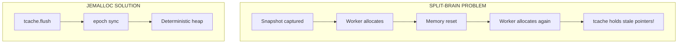

---

## Global Allocator

```rust
use tikv_jemallocator::Jemalloc;

#[global_allocator]
#[cfg(all(not(target_env = "msvc"), not(test)))]
static GLOBAL: Jemalloc = Jemalloc::default();
```

### Conditional Compilation

Jemalloc is disabled during `cargo test` to prevent instability on WSL2:

```rust
#[cfg(all(not(target_env = "msvc"), not(test)))]
```

---

## Quiesce Sequence

Before capturing a snapshot, the worker must quiesce the allocator:

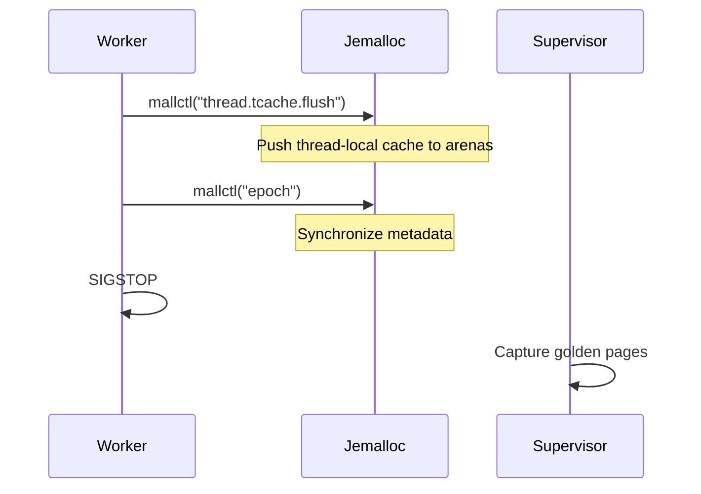

### tcache Flush

```rust
pub fn flush_tcache() {
    unsafe {
        tikv_jemalloc_sys::mallctl(
            c"thread.tcache.flush".as_ptr(),
            std::ptr::null_mut(),
            std::ptr::null_mut(),
            std::ptr::null(),
            0,
        );
    }
}
```

This pushes all thread-local free list entries back to global arenas.

### Epoch Sync

```rust
pub fn sync_epoch() {
    let mut epoch: u64 = 0;
    let mut len = std::mem::size_of::<u64>();
    unsafe {
        tikv_jemalloc_sys::mallctl(
            c"epoch".as_ptr(),
            &mut epoch as *mut _ as *mut _,
            &mut len,
            &epoch as *const _ as *const _,
            len,
        );
    }
}
```

This advances the jemalloc epoch, forcing metadata synchronization.

### Combined Function

```rust
pub fn quiesce_allocator() {
    flush_tcache();
    sync_epoch();
}
```

---

## Why Jemalloc?

| Feature       | glibc malloc  | Jemalloc                         |
| :------------ | :------------ | :------------------------------- |
| tcache flush  | Not exposed   | `mallctl("thread.tcache.flush")` |
| Epoch sync    | Not available | `mallctl("epoch")`               |
| Determinism   | Poor          | Excellent                        |
| Fragmentation | High          | Low                              |

---

## Runtime Configuration

For production, set environment variables:

```bash
export MALLOC_CONF="background_thread:false,dirty_decay_ms:0,muzzy_decay_ms:0"
```

| Option              | Value | Purpose                      |
| :------------------ | :---- | :--------------------------- |
| `background_thread` | false | Disable background purging   |
| `dirty_decay_ms`    | 0     | Immediate dirty page purging |
| `muzzy_decay_ms`    | 0     | Immediate muzzy page purging |

---

## Verification

```rust
pub fn verify_jemalloc_active() -> bool {
    let mut version: *const libc::c_char = std::ptr::null();
    let mut len = std::mem::size_of::<*const libc::c_char>();

    let result = unsafe {
        tikv_jemalloc_sys::mallctl(
            c"version".as_ptr(),
            &mut version as *mut _ as *mut _,
            &mut len,
            std::ptr::null(),
            0,
        )
    };

    if result == 0 && !version.is_null() {
        let version_str = unsafe { CStr::from_ptr(version) };
        eprintln!("[allocator] Jemalloc version: {:?}", version_str);
        true
    } else {
        false
    }
}
```

---

## Integration with Snapshot

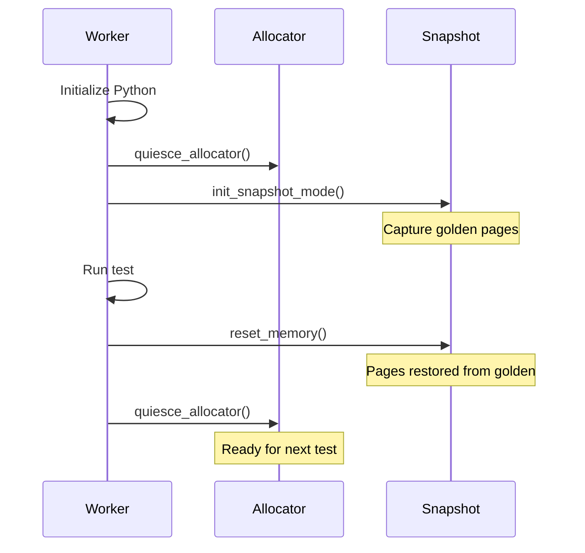

---

## ELF Parsing

For precise libpython segment identification, Tach uses `goblin`:

```rust
fn find_libpython_segments(path: &Path, base: usize) -> Vec<AlignedSegment> {
    let data = std::fs::read(path)?;
    let elf = goblin::elf::Elf::parse(&data)?;

    elf.program_headers
        .iter()
        .filter(|ph| {
            ph.p_type == goblin::elf::program_header::PT_LOAD
                && (ph.p_flags & goblin::elf::program_header::PF_W) != 0
        })
        .map(|ph| AlignedSegment {
            start: base + ph.p_vaddr as usize,
            end: base + ph.p_vaddr as usize + ph.p_memsz as usize,
            description: "libpython data/bss".into(),
        })
        .collect()
}
```

This ensures Python's small-int cache and singletons (None, True, False) are included in snapshots.

---

## Cargo Dependencies

```toml
[dependencies]
tikv-jemallocator = { version = "0.5", features = ["stats"] }
tikv-jemalloc-sys = "0.5"
goblin = "0.7"
```

---

## Related Documentation

- [Physics Engine](snapshot.md) - Memory snapshot details
- [Zygote Lifecycle](zygote.md) - When quiesce is called
- [Troubleshooting](../troubleshooting.md) - Jemalloc build issues


---


# Coverage System

The Coverage System implements PEP 669 `sys.monitoring` with lock-free ring buffers.

---

## Overview

Tach provides zero-overhead coverage collection using:

1. **PEP 669 `sys.monitoring`** (Python 3.12+) for event callbacks
2. **Dual ring buffers** in shared memory for lock-free data transfer
3. **Aggregator thread** for periodic buffer draining

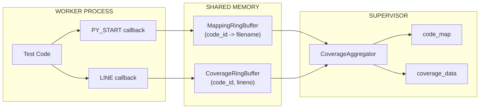

---

## Data Structures

### RingBufferHeader

64-byte aligned header for cache-line efficiency.

```rust
#[repr(C, align(64))]
pub struct RingBufferHeader {
    pub write_idx: AtomicU64,      // Producer index
    pub read_idx: AtomicU64,       // Consumer index
    pub capacity: u64,             // Number of entries
    pub overflow_count: AtomicU64, // Dropped entries
    _padding: [u8; 32],            // Pad to 64 bytes
}
```

### CoverageEntry

16-byte aligned entry for line events.

```rust
#[repr(C, align(16))]
pub struct CoverageEntry {
    pub code_id: u64,   // id(code_object)
    pub lineno: u32,    // Line number
    pub flags: u32,     // Reserved
}
```

### MappingEntry

256-byte entry for code registration.

```rust
#[repr(C, align(8))]
pub struct MappingEntry {
    pub code_id: u64,
    pub filename_len: u16,
    pub _padding: [u8; 6],
    pub filename: [u8; 240],
}
```

---

## Buffer Configuration

| Buffer   | Entry Size | Capacity | Total Size | Purpose           |
| :------- | :--------- | :------- | :--------- | :---------------- |
| Coverage | 16 bytes   | 262,144  | ~4 MB      | Line events       |
| Mapping  | 256 bytes  | 8,192    | ~2 MB      | Code registration |

---

## Dual-Buffer Architecture

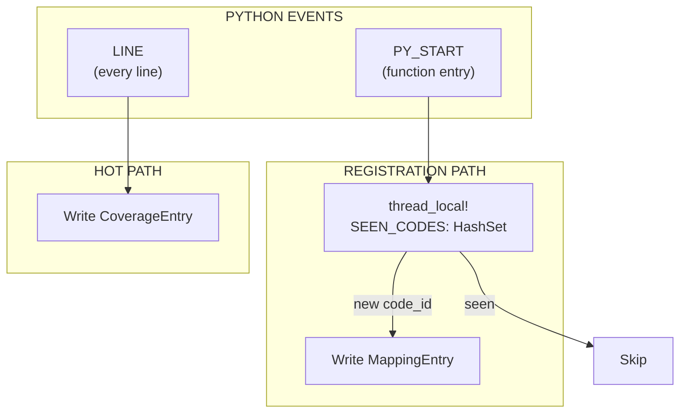

### Why Two Buffers?

1. **PY_START** events are infrequent (once per function)
2. **LINE** events are very frequent (every line)
3. Mapping entries are large (256 bytes for filename)
4. Coverage entries are small (16 bytes)

Separating them prevents large mapping entries from consuming coverage buffer space.

---

## Lock-Free Algorithm

### Write Path (Worker)

```rust
fn write_entry(&self, entry: CoverageEntry) -> bool {
    let write = self.header.write_idx.load(Ordering::Acquire);
    let read = self.header.read_idx.load(Ordering::Acquire);

    // Check if full
    if write.wrapping_sub(read) >= self.header.capacity {
        self.header.overflow_count.fetch_add(1, Ordering::Relaxed);
        return false;
    }

    // Reserve slot
    let slot = self.header.write_idx.fetch_add(1, Ordering::AcqRel);
    let index = (slot % self.header.capacity) as usize;

    // Write entry
    unsafe {
        std::ptr::write_volatile(
            self.entries.add(index),
            entry,
        );
    }
    true
}
```

### Read Path (Aggregator)

```rust
fn drain(&self) -> Vec<CoverageEntry> {
    let mut entries = Vec::new();
    loop {
        let write = self.header.write_idx.load(Ordering::Acquire);
        let read = self.header.read_idx.load(Ordering::Acquire);

        if read >= write {
            break;
        }

        let slot = self.header.read_idx.fetch_add(1, Ordering::AcqRel);
        let index = (slot % self.header.capacity) as usize;

        let entry = unsafe {
            std::ptr::read_volatile(self.entries.add(index))
        };
        entries.push(entry);
    }
    entries
}
```

---

## Aggregator Thread

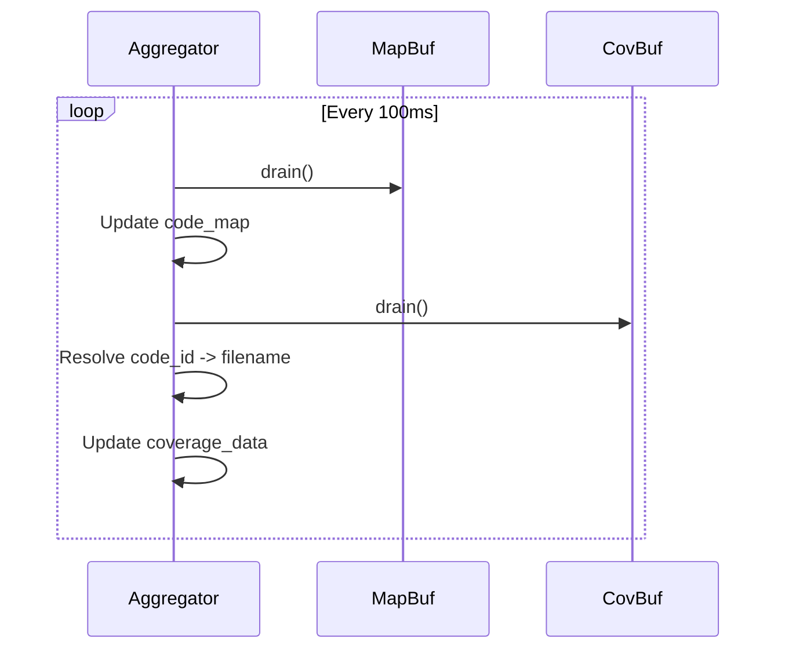

### Critical: Drain Order

Mapping buffer is drained **FIRST** to ensure `code_map` is populated before coverage entries are resolved.

```rust
impl CoverageAggregator {
    fn poll(&mut self) {
        // FIRST: Drain mapping buffer
        for entry in self.mapping_buffer.drain() {
            let filename = String::from_utf8_lossy(&entry.filename[..entry.filename_len as usize]);
            self.code_map.insert(entry.code_id, filename.to_string());
        }

        // SECOND: Drain coverage buffer
        for entry in self.coverage_buffer.drain() {
            let filename = self.code_map
                .get(&entry.code_id)
                .cloned()
                .unwrap_or_else(|| format!("<code:{:x}>", entry.code_id));

            let key = (filename, entry.lineno);
            *self.coverage_data.entry(key).or_insert(0) += 1;
        }
    }
}
```

---

## Python Callbacks

### PY_START Callback

```python
def _coverage_py_start_callback(code, offset):
    code_id = id(code)

    # Thread-local deduplication
    if code_id in _SEEN_CODES:
        return sys.monitoring.DISABLE

    _SEEN_CODES.add(code_id)
    tach_rust.record_py_start(code_id, code.co_filename)
    return sys.monitoring.DISABLE  # Only need to register once
```

### LINE Callback

```python
def _coverage_line_callback(code, line_number):
    tach_rust.record_line(id(code), line_number)
    # No return value - continue monitoring
```

---

## FFI Functions

### record_line

Hot path - writes to coverage buffer.

```rust
#[pyfunction]
fn record_line(py: Python, code_id: u64, lineno: u32) {
    py.allow_threads(|| {
        COVERAGE_BUFFER.write(CoverageEntry {
            code_id,
            lineno,
            flags: 0,
        });
    });
}
```

### record_py_start

Registration path - writes to mapping buffer.

```rust
#[pyfunction]
fn record_py_start(py: Python, code_id: u64, filename: String) {
    py.allow_threads(|| {
        MAPPING_BUFFER.write(MappingEntry::new(code_id, &filename));
    });
}
```

---

## GIL Discipline

Both callbacks release the GIL before accessing shared memory:

```rust
py.allow_threads(|| {
    // Shared memory access here
});
```

This prevents contention between the Python interpreter and the aggregator thread.

---

## Filename Truncation

Long filenames are truncated from the **LEFT** to preserve the actual filename:

```rust
fn truncate_filename(filename: &str, max_len: usize) -> &str {
    if filename.len() <= max_len {
        return filename;
    }

    let bytes = filename.as_bytes();
    let start = filename.len() - max_len;

    // Find valid UTF-8 boundary
    let mut safe_start = start;
    while safe_start < bytes.len() && (bytes[safe_start] & 0b1100_0000) == 0b1000_0000 {
        safe_start += 1;
    }

    &filename[safe_start..]
}
```

Example: `/very/long/path/to/project/src/module.py` becomes `project/src/module.py`

---

## Memory Exclusion

Coverage buffers must survive memory resets:

```rust
fn should_snapshot(region: &MemoryRegion) -> bool {
    if region.name.contains("tach_coverage") ||
       region.name.contains("tach_mapping") {
        return false;  // Exclude from snapshot
    }
    // ...
}
```

---

## Performance

| Metric        | Value        |
| :------------ | :----------- |
| Overhead      | < 1%         |
| Write latency | ~10ns        |
| Drain batch   | 4096 entries |
| Poll interval | 100ms        |

---

## Related Documentation

- [Physics Engine](snapshot.md) - Buffer exclusion from snapshots
- [API Reference](../api-reference.md) - FFI function signatures
- [Configuration](../configuration.md) - Coverage options


---


# Discovery Engine

The Discovery Engine performs static AST analysis to find tests without executing Python code.

---

## Overview

Tach uses `rustpython-parser` to parse Python source files into Abstract Syntax Trees (ASTs). This approach is:

- **Fast**: Parallel parsing with `rayon`
- **Safe**: No code execution during discovery
- **Accurate**: Full Python 3.10+ syntax support

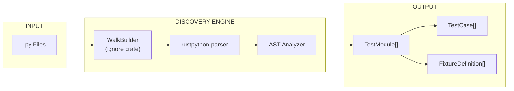

---

## Data Structures

### FixtureScope

Defines the lifecycle of a pytest fixture.

```rust
pub enum FixtureScope {
    Function,  // Default - new instance per test
    Class,     // Shared within test class
    Module,    // Shared within test file
    Session,   // Shared across entire run
}
```

### FixtureDefinition

Represents a `@pytest.fixture` decorated function.

```rust
pub struct FixtureDefinition {
    pub name: String,
    pub scope: FixtureScope,
    pub dependencies: Vec<String>,
    pub params: Option<Vec<String>>,
    pub class_scope: Option<String>,
}
```

| Field          | Description                                                    |
| :------------- | :------------------------------------------------------------- |
| `name`         | Fixture function name                                          |
| `scope`        | Lifecycle scope (function/class/module/session)                |
| `dependencies` | Other fixtures this fixture requires                           |
| `params`       | Static literal parameters from `@pytest.fixture(params=[...])` |
| `class_scope`  | If defined inside a class, the class name                      |

### TestCase

Represents an individual test function or method.

```rust
pub struct TestCase {
    pub name: String,
    pub dependencies: Vec<String>,
    pub is_async: bool,
    pub line_number: usize,
    pub parametrized_args: Vec<String>,
}
```

| Field               | Description                                                                  |
| :------------------ | :--------------------------------------------------------------------------- |
| `name`              | Test name (e.g., `test_func` or `TestClass::test_method`)                    |
| `dependencies`      | Fixtures required by the test                                                |
| `is_async`          | Whether it's an `async def`                                                  |
| `line_number`       | 1-indexed line number for reporting                                          |
| `parametrized_args` | Arguments from `@pytest.mark.parametrize` (excluded from fixture resolution) |

### TestModule

Represents a single `.py` file.

```rust
pub struct TestModule {
    pub path: PathBuf,
    pub tests: Vec<TestCase>,
    pub fixtures: Vec<FixtureDefinition>,
    pub is_toxic: bool,
}
```

### DiscoveryResult

The aggregate result of a project scan.

```rust
pub struct DiscoveryResult {
    pub modules: Vec<TestModule>,
}
```

---

## Discovery Process

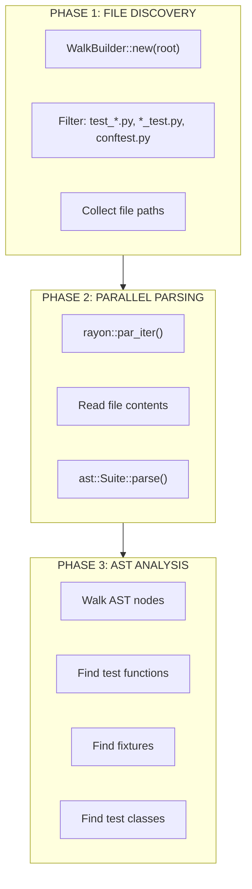

### File Filtering

Files are included if they match:

- `test_*.py` - Test files
- `*_test.py` - Test files (alternate convention)
- `conftest.py` - Fixture files

### Pattern Detection

The analyzer detects:

| Pattern         | Detection Method                             |
| :-------------- | :------------------------------------------- |
| Test functions  | `def test_*` at module level                 |
| Async tests     | `async def test_*`                           |
| Test classes    | `class Test*`                                |
| Test methods    | `def test_*` inside `Test*` class            |
| Fixtures        | `@pytest.fixture` or `@fixture` decorator    |
| Parametrization | `@pytest.mark.parametrize` decorator         |
| Mocking         | `@patch` or `@unittest.mock.patch` decorator |

---

## Key Functions

### discover

Entry point for test discovery.

```rust
pub fn discover(root: &Path) -> Result<DiscoveryResult>
```

Uses `WalkBuilder` to find files and `rayon` to parse them in parallel.

### parse_module

Parses a single Python file.

```rust
fn parse_module(path: &Path) -> Result<TestModule>
```

Reads the file and converts its AST into a `TestModule`.

### analyze_function

Extracts test/fixture data from function definitions.

```rust
fn analyze_function(
    func: &ast::StmtFunctionDef,
    class_name: Option<&str>,
) -> Option<TestOrFixture>
```

### extract_injected_args

Identifies arguments that are NOT fixtures.

```rust
fn extract_injected_args(
    decorators: &[ast::Expr],
    func_args: &[String],
) -> Vec<String>
```

Filters out arguments from:

- `@pytest.mark.parametrize("arg1, arg2", [...])`
- `@patch("module.thing")` (injects mock as argument)

---

## Special Handling

### self and cls

Method arguments `self` and `cls` are automatically excluded from fixture resolution.

### Parametrization

```python
@pytest.mark.parametrize("x, y", [(1, 2), (3, 4)])
def test_add(x, y, some_fixture):
    pass
```

Here, `x` and `y` are parametrized args (not fixtures), while `some_fixture` is a fixture dependency.

### Mock Patches

```python
@patch("module.SomeClass")
def test_thing(mock_class, some_fixture):
    pass
```

The first argument (`mock_class`) is injected by `@patch`, not a fixture.

### conftest.py

Fixtures in `conftest.py` files are automatically treated as global fixtures available to all tests in the directory tree.

### TYPE_CHECKING Blocks

Imports inside `if TYPE_CHECKING:` blocks are skipped during toxicity analysis to avoid false positives.

---

## Integration with Toxicity

After discovery, each `TestModule` is analyzed for toxicity:


See [Toxicity Analysis](toxicity.md) for details.

---

## Performance Characteristics

| Metric      | Value                                |
| :---------- | :----------------------------------- |
| Parallelism | All CPU cores via `rayon`            |
| Memory      | O(n) where n = number of files       |
| Complexity  | O(n \* m) where m = average AST size |

---

## Limitations

1. **Dynamic Tests**: Tests generated at runtime (e.g., via `pytest_generate_tests`) are not discovered
2. **Eval/Exec**: Tests defined via `eval()` or `exec()` are not discovered
3. **Namespace Packages**: Directories without `__init__.py` fall back to standard import

---

## Related Documentation

- [Toxicity Analysis](toxicity.md) - How discovered modules are analyzed for safety
- [Fixture Resolver](resolver.md) - How fixture dependencies are resolved


---


# Isolation (Namespaces and OverlayFS)

Isolation provides filesystem and network separation for worker processes.

---

## Overview

Tach uses Linux namespaces and OverlayFS to create isolated environments:

1. **Mount Namespace**: Private filesystem view
2. **Network Namespace**: Isolated network stack
3. **OverlayFS**: Copy-on-write filesystem layers

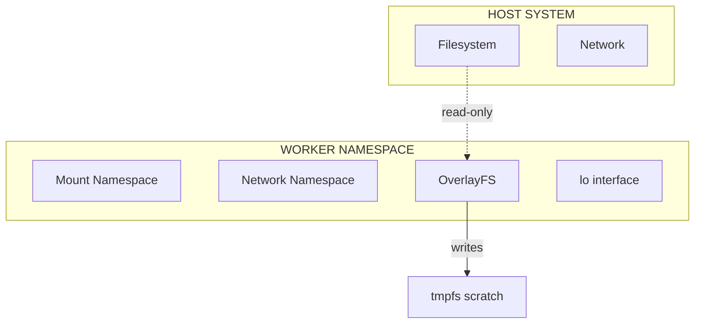

---

## Namespace Types

### Mount Namespace (CLONE_NEWNS)

Provides a private set of mount points.

```rust
unsafe {
    libc::unshare(libc::CLONE_NEWNS)?;
}
```

After unshare, the worker's mounts are isolated from the host.

### Network Namespace (CLONE_NEWNET)

Provides an isolated network stack.

```rust
unsafe {
    libc::unshare(libc::CLONE_NEWNET)?;
}
```

The worker gets its own:

- Network interfaces
- Routing tables
- Firewall rules
- Port bindings

### PID Namespace

**Not used.** Tach relies on standard `fork()` and `PR_SET_PDEATHSIG` for process management.

---

## OverlayFS Structure

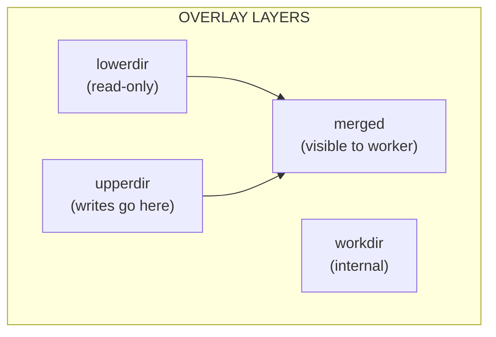

### /tmp Isolation

```
lowerdir: /tmp (host)
upperdir: /run/tach/worker_N/tmp_upper
workdir:  /run/tach/worker_N/tmp_work
merged:   /tmp (worker view)
```

Tests can write to `/tmp`, but changes are stored in the worker's tmpfs.

### Project Root Isolation

```
lowerdir: {project_root} (source code)
upperdir: /run/tach/worker_N/proj_upper
workdir:  /run/tach/worker_N/proj_work
merged:   {project_root} (worker view)
```

Tests can modify source files without affecting the actual codebase.

---

## Setup Sequence

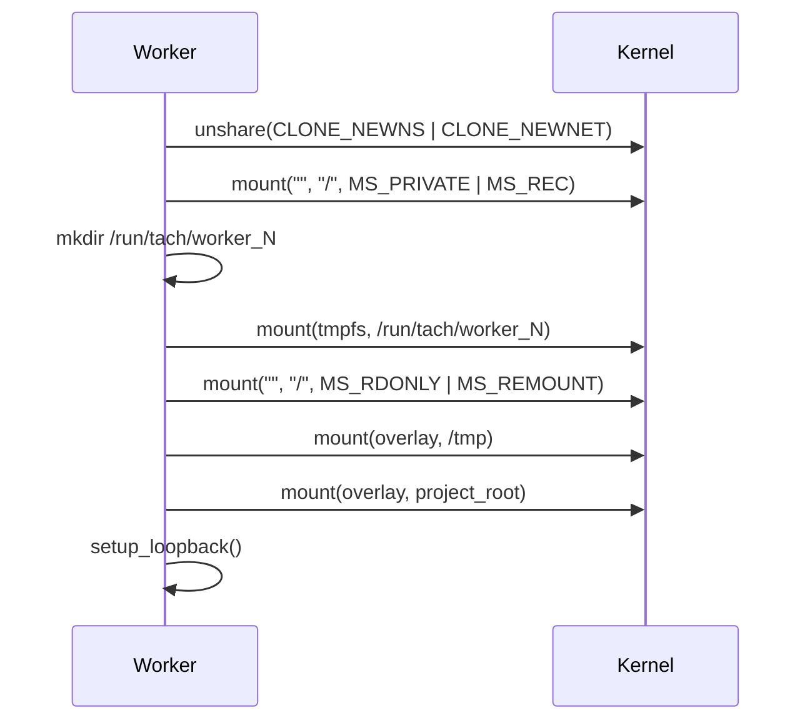

### Step 1: Enter Namespaces

```rust
pub fn setup_filesystem(project_root: &Path, worker_id: u32) -> Result<()> {
    unsafe {
        libc::unshare(libc::CLONE_NEWNS | libc::CLONE_NEWNET)?;
    }
    Ok(())
}
```

### Step 2: Privatize Mounts

```rust
unsafe {
    libc::mount(
        ptr::null(),
        c"/".as_ptr(),
        ptr::null(),
        libc::MS_PRIVATE | libc::MS_REC,
        ptr::null(),
    )?;
}
```

This prevents mount events from leaking to the host.

### Step 3: Create Worker Directory

```rust
let worker_dir = format!("/run/tach/worker_{}", worker_id);
std::fs::create_dir_all(&worker_dir)?;
```

### Step 4: Mount tmpfs

```rust
unsafe {
    libc::mount(
        c"tmpfs".as_ptr(),
        worker_dir.as_ptr(),
        c"tmpfs".as_ptr(),
        0,
        c"size=100M".as_ptr(),
    )?;
}
```

100MB memory-backed storage for worker scratch space.

### Step 5: Lock Down Root

```rust
unsafe {
    libc::mount(
        ptr::null(),
        c"/".as_ptr(),
        ptr::null(),
        libc::MS_RDONLY | libc::MS_REMOUNT | libc::MS_BIND,
        ptr::null(),
    )?;
}
```

The root filesystem becomes read-only.

### Step 6: Mount Overlays

```rust
fn mount_overlay(lower: &Path, upper: &Path, work: &Path, target: &Path) -> Result<()> {
    let options = format!(
        "lowerdir={},upperdir={},workdir={}",
        lower.display(),
        upper.display(),
        work.display(),
    );

    unsafe {
        libc::mount(
            c"overlay".as_ptr(),
            target.as_ptr(),
            c"overlay".as_ptr(),
            0,
            options.as_ptr(),
        )?;
    }
    Ok(())
}
```

### Step 7: Setup Loopback

```rust
fn setup_loopback() -> Result<()> {
    // Bring up lo interface in the new network namespace
    let sock = socket(AF_INET, SOCK_DGRAM, 0)?;
    let mut ifr: libc::ifreq = unsafe { std::mem::zeroed() };
    ifr.ifr_name[..2].copy_from_slice(b"lo");
    ifr.ifr_ifru.ifru_flags = libc::IFF_UP as i16;

    unsafe {
        libc::ioctl(sock, libc::SIOCSIFFLAGS, &ifr)?;
    }
    Ok(())
}
```

---

## Directory Structure

```
/run/tach/
  worker_0/
    tmp_upper/      # /tmp writes
    tmp_work/       # OverlayFS internal
    proj_upper/     # Project writes
    proj_work/      # OverlayFS internal
  worker_1/
    ...
```

---

## Security Properties

| Property             | Mechanism                         |
| :------------------- | :-------------------------------- |
| Filesystem isolation | Mount namespace + OverlayFS       |
| Network isolation    | Network namespace                 |
| Write containment    | tmpfs + OverlayFS upperdir        |
| Host protection      | Root remounted read-only          |
| Cleanup              | tmpfs automatically freed on exit |

---

## Interaction with Landlock

Isolation and Landlock provide redundant protection:

| Layer           | Protection                         |
| :-------------- | :--------------------------------- |
| Mount namespace | Worker can't see host mounts       |
| OverlayFS       | Writes go to tmpfs, not real files |
| Root read-only  | Can't modify system files          |
| Landlock        | Kernel-level access control        |

This "belt and suspenders" approach ensures security even if one layer fails.

---

## Environment Variable

To disable isolation for development:

```bash
TACH_NO_ISOLATION=1 ./tach-core .
```

Or:

```bash
./tach-core --no-isolation .
```

---

## Related Documentation

- [Iron Dome](sandbox.md) - Landlock and Seccomp
- [Zygote Lifecycle](zygote.md) - When isolation is applied
- [Configuration](../configuration.md) - --no-isolation flag


---


# Zero-Copy Loader

The Zero-Copy Loader bypasses Python's `importlib` for instant module loading.

---

## Overview

Traditional Python imports involve:

1. Scanning `sys.path` for the module
2. Reading the `.py` file from disk
3. Compiling to bytecode (or reading cached `.pyc`)
4. Executing the module code

Tach eliminates steps 1-3 by pre-compiling all modules and injecting bytecode directly via the C-API.

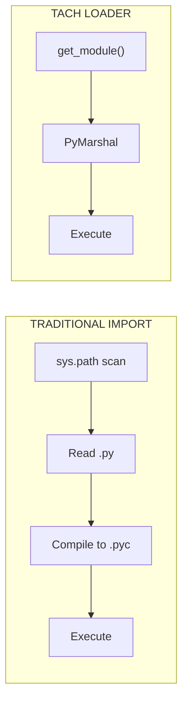

---

## Data Structures

### BytecodeEntry

Represents a single compiled module in the registry.

```rust
pub struct BytecodeEntry {
    pub name: String,
    pub source_path: PathBuf,
    pub bytecode: Vec<u8>,
    pub is_package: bool,
}
```

| Field         | Description                                   |
| :------------ | :-------------------------------------------- |
| `name`        | Fully qualified module name (e.g., `foo.bar`) |
| `source_path` | Absolute path to the original `.py` file      |
| `bytecode`    | Raw bytecode with 16-byte header removed      |
| `is_package`  | True if this was an `__init__.py` file        |

### ModuleRegistry

Thread-safe storage for compiled modules.

```rust
pub struct ModuleRegistry {
    entries: DashMap<String, BytecodeEntry>,
    project_root: PathBuf,
}
```

Uses `DashMap` for concurrent access from multiple worker threads.

### BytecodeCompiler

Handles eager compilation of Python source to bytecode.

```rust
pub struct BytecodeCompiler {
    cache_dir: PathBuf,
    project_root: PathBuf,
    python_exe: PathBuf,
    expected_magic: Option<[u8; 4]>,
}
```

---

## Compilation Pipeline

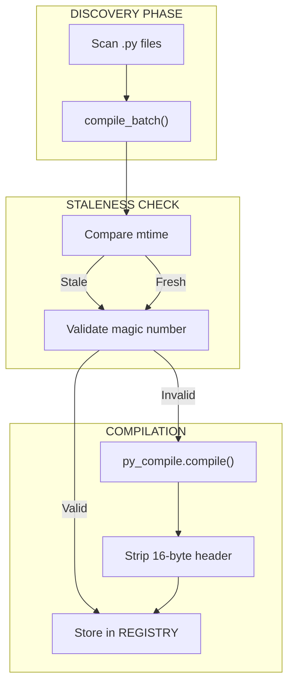

### Staleness Check

```rust
fn is_cache_stale(source: &Path, cache: &Path) -> bool {
    let source_mtime = source.metadata()?.modified()?;
    let cache_mtime = cache.metadata()?.modified()?;
    source_mtime > cache_mtime
}
```

### Magic Number Validation

Python bytecode files start with a 4-byte magic number that identifies the Python version. If the magic number doesn't match the current interpreter, the cache is invalid.

```rust
fn validate_magic(cache: &Path, expected: [u8; 4]) -> bool {
    let mut file = File::open(cache)?;
    let mut magic = [0u8; 4];
    file.read_exact(&mut magic)?;
    magic == expected
}
```

### Header Stripping

Python 3.7+ `.pyc` files have a 16-byte header (PEP 552):

| Bytes | Content                                   |
| :---- | :---------------------------------------- |
| 0-3   | Magic number                              |
| 4-7   | Bit field (hash-based invalidation flags) |
| 8-11  | Timestamp                                 |
| 12-15 | Source size                               |

Tach strips this header before storing bytecode.

---

## Cache Structure

Bytecode is cached in `.tach/cache/` with flattened filenames:

```
.tach/cache/
  src_utils.py.pyc
  src_models_user.py.pyc
  tests_test_auth.py.pyc
```

Path separators are replaced with underscores to avoid deep directory structures.

---

## Python Import Hook

The import hook is implemented in `tach_harness.py`:

### TachMetaPathFinder

Installed at `sys.meta_path[0]` for maximum priority.

```python
class TachMetaPathFinder:
    def find_spec(self, fullname, path, target=None):
        bytecode = tach_rust.get_module(fullname)
        if bytecode is None:
            return None

        origin = tach_rust.get_module_path(fullname)
        is_package = tach_rust.is_module_package(fullname)

        return ModuleSpec(
            fullname,
            TachLoader(bytecode, origin),
            origin=origin,
            is_package=is_package,
        )
```

### TachLoader

Executes the bytecode via FFI.

```python
class TachLoader:
    def __init__(self, bytecode, origin):
        self.bytecode = bytecode
        self.origin = origin

    def exec_module(self, module):
        tach_rust.load_module(
            module.__name__,
            self.origin,
            self.bytecode,
        )
```

---

## FFI Functions

### get_module

Returns bytecode from the registry.

```rust
#[pyfunction]
fn get_module(name: &str) -> Option<Vec<u8>>
```

### get_module_path

Returns the source path for `__file__`.

```rust
#[pyfunction]
fn get_module_path(name: &str) -> Option<String>
```

### is_module_package

Checks if the module is a package.

```rust
#[pyfunction]
fn is_module_package(name: &str) -> Option<bool>
```

### load_module

Injects bytecode into Python.

```rust
#[pyfunction]
fn load_module(
    py: Python,
    name: &str,
    source_path: &str,
    bytecode: Vec<u8>,
) -> PyResult<bool>
```

Implementation:

1. `PyMarshal_ReadObjectFromString` - Deserialize bytecode to code object
2. `PyImport_ExecCodeModuleObject` - Execute and register in `sys.modules`
3. `patch_module_namespace` - Set `__file__`, `__package__`, `__path__`

---

## Namespace Patching

After loading, the module namespace is patched:

```rust
fn patch_module_namespace(module: &PyModule, entry: &BytecodeEntry) {
    module.setattr("__file__", entry.source_path.to_str())?;
    module.setattr("__package__", parent_package(&entry.name))?;

    if entry.is_package {
        let path = entry.source_path.parent();
        module.setattr("__path__", vec![path.to_str()])?;
    }
}
```

---

## Performance Characteristics

| Metric                   | Cold Cache  | Warm Cache       |
| :----------------------- | :---------- | :--------------- |
| Compilation (91 modules) | 9.7 seconds | 345 milliseconds |
| Speedup Factor           | 1x          | **28x**          |

### Why It's Fast

1. **No filesystem traversal**: Module location is known
2. **No disk I/O**: Bytecode pre-loaded in RAM
3. **No repeated compilation**: Cached once
4. **Sub-millisecond materialization**: Direct memory injection

---

## Global Caching

To prevent redundant work during parallel startup:

```rust
static CACHED_PYTHON_EXE: OnceLock<PathBuf> = OnceLock::new();
static CACHED_MAGIC: OnceLock<[u8; 4]> = OnceLock::new();
```

---

## Limitations

1. **Namespace Packages**: Directories without `__init__.py` fall back to standard `importlib`
2. **Dynamic Imports**: `__import__()` and `importlib.import_module()` bypass the hook
3. **C Extensions**: `.so`/`.pyd` files are not handled by the loader

---

## Related Documentation

- [Discovery Engine](discovery.md) - How modules are found
- [Zygote Lifecycle](zygote.md) - How the loader is initialized


---


# Architecture Overview

This document provides a high-level view of Tach's architecture and how its components interact.

---

## System Architecture

Tach operates as a three-tier system: **Supervisor**, **Zygote**, and **Workers**.

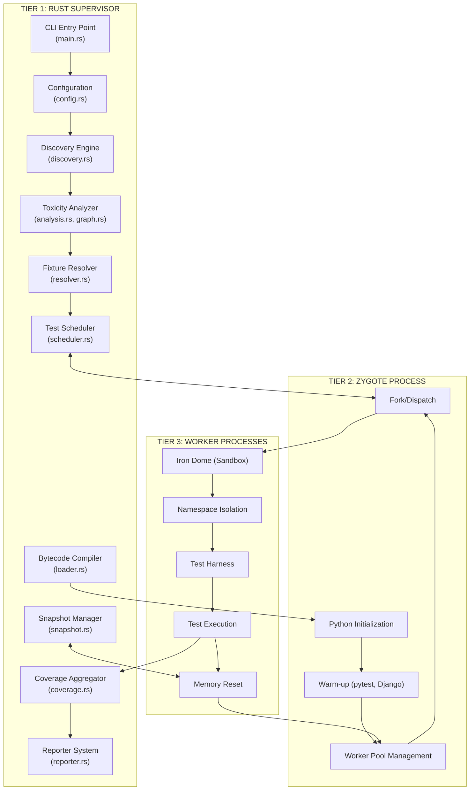

---

## Component Responsibilities

### Tier 1: Rust Supervisor

| Component     | File                                          | Responsibility                                        |
| :------------ | :-------------------------------------------- | :---------------------------------------------------- |
| **CLI**       | `main.rs`                                     | Parse arguments, orchestrate execution                |
| **Config**    | `core/config.rs`                              | Load pyproject.toml, merge CLI/env/file settings      |
| **Discovery** | `discovery/scanner.rs`                        | AST-based test discovery using rustpython-parser      |
| **Toxicity**  | `discovery/analysis.rs`, `discovery/graph.rs` | Detect unsafe modules, propagate via dependency graph |
| **Loader**    | `discovery/loader.rs`                         | Compile .py to .pyc, manage bytecode cache            |
| **Resolver**  | `discovery/resolver.rs`                       | Resolve fixture dependencies, topological sort        |
| **Scheduler** | `execution/scheduler.rs`                      | Dispatch tests to workers, manage queues              |
| **Snapshot**  | `isolation/snapshot.rs`                       | userfaultfd registration, page fault handling         |
| **Coverage**  | `reporting/coverage.rs`                       | Ring buffer management, aggregation thread            |
| **Reporter**  | `reporting/reporter.rs`                       | Progress bar, dots, JSON output                       |

### Tier 2: Zygote Process

The Zygote is a long-lived Python process that:

1. **Initializes Python** with all imports pre-loaded
2. **Warms up frameworks** (pytest, Django)
3. **Manages the worker pool** for safe test reuse
4. **Forks workers** on demand from the Supervisor

### Tier 3: Worker Processes

Workers are short-lived (toxic) or long-lived (safe) processes that:

1. **Apply security sandbox** (Landlock + Seccomp)
2. **Enter namespace isolation** (Mount + Network)
3. **Execute tests** via the Python harness
4. **Reset memory** or exit based on toxicity

---

## Data Flow

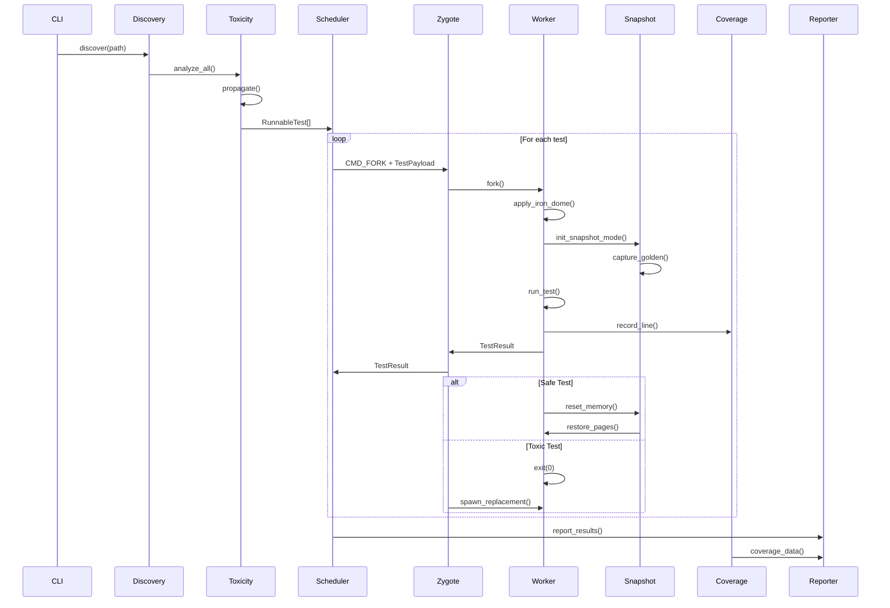

---

## Memory Architecture

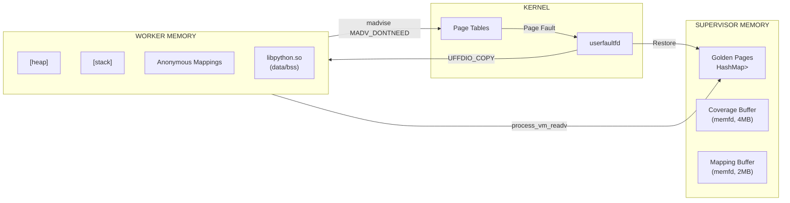

---

## IPC Architecture

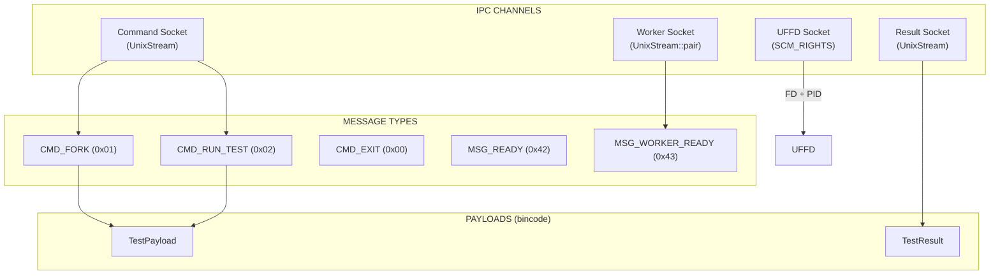

---

## Security Layers

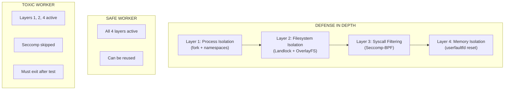

---

## File Organization

```
src/
  main.rs           # CLI entry, orchestration
  lib.rs            # Module exports, discover_with_toxicity()

  # Core Infrastructure
  core/
    allocator.rs    # Jemalloc integration
    config.rs       # Configuration loading
    environment.rs  # Environment injection
    lifecycle.rs    # Process lifecycle management
    protocol.rs     # IPC messages
    signals.rs      # Signal handling

  # Discovery & Analysis
  discovery/
    scanner.rs      # AST-based test discovery (was discovery.rs)
    resolver.rs     # Fixture resolution
    loader.rs       # Bytecode compilation
    graph.rs        # ToxicityGraph, propagation
    analysis.rs     # Local toxicity detection

  # Execution
  execution/
    scheduler.rs    # Test dispatch
    watch.rs        # File watching
    zygote.rs       # Process lifecycle, FFI

  # Isolation & Security
  isolation/
    namespace.rs    # Namespaces + OverlayFS (was isolation.rs)
    sandbox.rs      # Landlock + Seccomp
    snapshot.rs     # userfaultfd, golden pages

  # Reporting & Observability
  reporting/
    reporter.rs     # Output formatting
    junit.rs        # JUnit XML output
    logcapture.rs   # Log capture
    debugger.rs     # Debugger integration
    coverage.rs     # Ring buffers, aggregator

  tach_harness.py   # Python test harness
```

---

## Key Design Decisions

| Decision              | Rationale                                             |
| :-------------------- | :---------------------------------------------------- |
| **Rust Supervisor**   | Zero-cost abstractions, memory safety, syscall access |
| **Python Zygote**     | Pay import tax once, share via fork                   |
| **userfaultfd**       | Sub-microsecond page restoration                      |
| **Jemalloc**          | Deterministic heap for snapshot consistency           |
| **Landlock**          | Kernel-level filesystem isolation (5.13+)             |
| **Seccomp**           | Syscall filtering without ptrace overhead             |
| **bincode**           | Fast binary serialization for IPC                     |
| **petgraph**          | Efficient dependency graph for toxicity               |
| **rustpython-parser** | Pure Rust AST parsing, no Python execution            |
| **memfd_create**      | Anonymous shared memory for coverage                  |

---

## Next Steps

- [Discovery Engine](discovery.md) - How tests are found
- [Zero-Copy Loader](loader.md) - How modules are loaded
- [Toxicity Analysis](toxicity.md) - How unsafe code is detected


---


# IPC Protocol

The IPC Protocol defines communication between Supervisor, Zygote, and Workers.

---

## Overview

Tach uses Unix domain sockets with binary serialization:

1. **bincode** for structured message serialization
2. **Length-prefixed framing** for message boundaries
3. **SCM_RIGHTS** for file descriptor passing

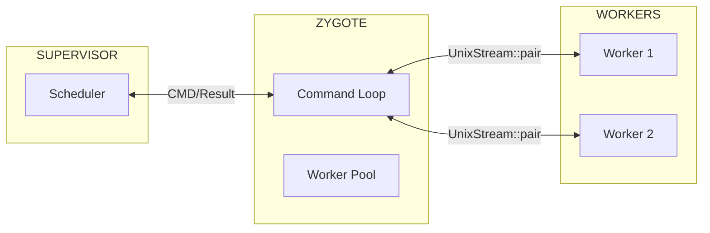

---

## Data Structures

### TestPayload

Sent from Supervisor to Worker to initiate a test.

```rust
#[derive(Debug, Clone, Serialize, Deserialize)]
pub struct TestPayload {
    pub test_id: u32,
    pub file_path: String,
    pub test_name: String,
    pub is_async: bool,
    pub fixtures: Vec<FixtureInfo>,
    pub log_fd: i32,
    pub debug_socket_path: String,
    pub is_toxic: bool,
}
```

| Field               | Description                               |
| :------------------ | :---------------------------------------- |
| `test_id`           | Unique identifier for result correlation  |
| `file_path`         | Path to test file                         |
| `test_name`         | Fully qualified test name (node ID)       |
| `is_async`          | Whether test is async                     |
| `fixtures`          | Required fixtures                         |
| `log_fd`            | File descriptor for stdout/stderr capture |
| `debug_socket_path` | Path for pdb tunneling                    |
| `is_toxic`          | Determines worker lifecycle               |

### TestResult

Sent from Worker to Supervisor upon test completion.

```rust
#[derive(Debug, Clone, Serialize, Deserialize)]
pub struct TestResult {
    pub test_id: u32,
    pub status: u8,
    pub duration_ns: u64,
    pub message: String,
}
```

### FixtureInfo

Metadata about required fixtures.

```rust
#[derive(Debug, Clone, Serialize, Deserialize)]
pub struct FixtureInfo {
    pub name: String,
    pub scope: String,
}
```

---

## Command Bytes

| Constant           | Value | Direction            | Purpose                     |
| :----------------- | :---- | :------------------- | :-------------------------- |
| `CMD_EXIT`         | 0x00  | Supervisor -> Zygote | Shutdown                    |
| `CMD_FORK`         | 0x01  | Supervisor -> Zygote | Spawn/dispatch test         |
| `CMD_RUN_TEST`     | 0x02  | Zygote -> Worker     | Run test on existing worker |
| `MSG_READY`        | 0x42  | Zygote -> Supervisor | Zygote initialized          |
| `MSG_WORKER_READY` | 0x43  | Worker -> Zygote     | Worker reset complete       |

---

## Status Codes

| Constant               | Value | Meaning                 |
| :--------------------- | :---- | :---------------------- |
| `STATUS_PASS`          | 0     | Test passed             |
| `STATUS_FAIL`          | 1     | Test failed (assertion) |
| `STATUS_SKIP`          | 2     | Test skipped            |
| `STATUS_CRASH`         | 3     | Worker crashed          |
| `STATUS_ERROR`         | 4     | Test error (exception)  |
| `STATUS_HARNESS_ERROR` | 5     | Harness error           |

---

## Message Framing

All structured messages use length-prefixed framing:

```
+----------------+------------------+
| Length (4 bytes, LE u32) | Payload (bincode) |
+----------------+------------------+
```

### Encoding

```rust
pub fn encode_with_length<T: Serialize>(value: &T) -> Result<Vec<u8>> {
    let payload = bincode::serialize(value)?;
    let len = payload.len() as u32;

    let mut buf = Vec::with_capacity(4 + payload.len());
    buf.extend_from_slice(&len.to_le_bytes());
    buf.extend_from_slice(&payload);
    Ok(buf)
}
```

### Decoding

```rust
pub fn decode_with_length<T: DeserializeOwned>(reader: &mut impl Read) -> Result<T> {
    let mut len_buf = [0u8; 4];
    reader.read_exact(&mut len_buf)?;
    let len = u32::from_le_bytes(len_buf) as usize;

    let mut payload = vec![0u8; len];
    reader.read_exact(&mut payload)?;
    Ok(bincode::deserialize(&payload)?)
}
```

---

## Socket Architecture

```mermaid
flowchart TB
    subgraph Channels["IPC CHANNELS"]
        CmdSock["Command Socket<br/>(Supervisor -> Zygote)"]
        ResSock["Result Socket<br/>(Zygote -> Supervisor)"]
        WorkSock["Worker Socket<br/>(Zygote <-> Worker)"]
        UffdSock["UFFD Socket<br/>(Worker -> Supervisor)"]
    end
```

### Supervisor <-> Zygote

Two separate sockets prevent head-of-line blocking:

```rust
let (cmd_sock, zygote_cmd) = UnixStream::pair()?;
let (res_sock, zygote_res) = UnixStream::pair()?;
```

### Zygote <-> Worker

Created at fork time:

```rust
let (parent_sock, child_sock) = UnixStream::pair()?;
match unsafe { fork() } {
    0 => {
        // Child uses child_sock
        drop(parent_sock);
    }
    pid => {
        // Parent uses parent_sock
        drop(child_sock);
    }
}
```

---

## SCM_RIGHTS (File Descriptor Passing)

Used to pass userfaultfd from Worker to Supervisor.

### Sending

```rust
pub fn send_fd(sock: &UnixStream, pid: i32, fd: RawFd) -> Result<()> {
    let pid_bytes = pid.to_le_bytes();
    let iov = [IoSlice::new(&pid_bytes)];
    let fds = [fd];
    let cmsg = [ControlMessage::ScmRights(&fds)];

    sendmsg::<()>(sock.as_raw_fd(), &iov, &cmsg, MsgFlags::empty(), None)?;
    Ok(())
}
```

### Receiving

```rust
pub fn recv_fd(sock: &UnixStream) -> Result<(i32, OwnedFd)> {
    let mut pid_buf = [0u8; 4];
    let mut iov = [IoSliceMut::new(&mut pid_buf)];
    let mut cmsg_buf = cmsg_space!([RawFd; 1]);

    let msg = recvmsg::<()>(
        sock.as_raw_fd(),
        &mut iov,
        Some(&mut cmsg_buf),
        MsgFlags::empty(),
    )?;

    let pid = i32::from_le_bytes(pid_buf);
    let fd = extract_fd_from_cmsg(&msg)?;
    Ok((pid, fd))
}
```

---

## Message Truncation

Result messages are truncated to prevent buffer overflow:

```rust
const MAX_MESSAGE_LEN: usize = 4096;

fn truncate_message(msg: &str) -> String {
    if msg.len() <= MAX_MESSAGE_LEN {
        msg.to_string()
    } else {
        format!("{}... (truncated)", &msg[..MAX_MESSAGE_LEN - 20])
    }
}
```

---

## Timeout Handling

The scheduler uses read timeouts for crash detection:

```rust
sock.set_read_timeout(Some(Duration::from_secs(5)))?;

match decode_with_length::<TestResult>(&mut sock) {
    Ok(result) => handle_result(result),
    Err(e) if e.kind() == ErrorKind::TimedOut => {
        mark_worker_crashed(worker_id);
    }
    Err(e) => return Err(e.into()),
}
```

---

## Protocol Flow

```mermaid
sequenceDiagram
    participant Sup as Supervisor
    participant Zyg as Zygote
    participant Work as Worker

    Sup->>Zyg: CMD_FORK + TestPayload
    Zyg->>Work: fork()
    Work->>Work: init_snapshot_mode()
    Work->>Sup: send_fd(uffd, pid)
    Sup->>Sup: capture_golden()
    Sup->>Work: SIGCONT
    Work->>Work: run_test()
    Work->>Zyg: TestResult
    Zyg->>Sup: TestResult

    alt Safe Test
        Work->>Work: reset_memory()
        Work->>Zyg: MSG_WORKER_READY
    else Toxic Test
        Work->>Work: exit(0)
    end
```

---

## Related Documentation

- [Scheduler](scheduler.md) - How messages are dispatched
- [Zygote Lifecycle](zygote.md) - Command loop implementation
- [Physics Engine](snapshot.md) - UFFD handshake details


---


# Reporter

The Reporter system provides adaptive output based on environment detection.

---

## Overview

Tach supports multiple output formats:

1. **ProgressReporter** - Interactive progress bar for terminals
2. **DotsReporter** - Simple dots for CI environments
3. **JsonReporter** - NDJSON for IDE integration
4. **JunitReporter** - JUnit XML for CI systems

```mermaid
flowchart TB
    subgraph Detection["ENVIRONMENT DETECTION"]
        TTY["atty::is(Stderr)?"]
        CI["CI env var?"]
    end

    subgraph Selection["REPORTER SELECTION"]
        Progress["ProgressReporter"]
        Dots["DotsReporter"]
        JSON["JsonReporter"]
    end

    TTY -->|Yes| CI
    TTY -->|No| Dots
    CI -->|No| Progress
    CI -->|Yes| Dots
```

---

## Reporter Trait

```rust
pub trait Reporter {
    fn on_run_start(&mut self, total: usize);
    fn on_test_started(&mut self, test: &RunnableTest);
    fn on_test_finished(&mut self, result: &TestResult);
    fn on_run_finished(&mut self, results: &[TestResult]);
}
```

---

## ProgressReporter

Interactive progress bar using `indicatif`.

### Output Format

```
Running tests...
[=========>          ] 45/100  P:40 F:3 S:2
```

### Implementation

```rust
pub struct ProgressReporter {
    bar: ProgressBar,
    passed: usize,
    failed: usize,
    skipped: usize,
    failures: Vec<TestResult>,
}

impl ProgressReporter {
    pub fn new() -> Self {
        let bar = ProgressBar::new(0);
        bar.set_style(ProgressStyle::default_bar()
            .template("{msg}\n[{bar:40}] {pos}/{len}  P:{passed} F:{failed} S:{skipped}")
            .unwrap());
        Self {
            bar,
            passed: 0,
            failed: 0,
            skipped: 0,
            failures: Vec::new(),
        }
    }
}
```

### Failure Buffering

Failures are buffered and displayed at the end:

```rust
fn on_run_finished(&mut self, _results: &[TestResult]) {
    self.bar.finish_and_clear();

    if !self.failures.is_empty() {
        eprintln!("\n=== FAILURES ===\n");
        for failure in &self.failures {
            eprintln!("FAILED: {}", failure.test_name);
            eprintln!("{}\n", failure.message);
        }
    }

    eprintln!("\n{} passed, {} failed, {} skipped",
        self.passed, self.failed, self.skipped);
}
```

---

## DotsReporter

Simple dots output for CI environments.

### Output Format

```
....F..s....F.....
```

- `.` = passed
- `F` = failed
- `s` = skipped

### Implementation

```rust
pub struct DotsReporter {
    failures: Vec<TestResult>,
}

impl Reporter for DotsReporter {
    fn on_test_finished(&mut self, result: &TestResult) {
        let char = match result.status {
            STATUS_PASS => '.',
            STATUS_FAIL | STATUS_ERROR => 'F',
            STATUS_SKIP => 's',
            STATUS_CRASH => 'C',
            _ => '?',
        };
        eprint!("{}", char);

        if result.status == STATUS_FAIL || result.status == STATUS_ERROR {
            self.failures.push(result.clone());
        }
    }
}
```

---

## JsonReporter

NDJSON output for IDE integration.

### Output Format

```json
{"event":"test_started","test":"test_example.py::test_foo"}
{"event":"test_finished","test":"test_example.py::test_foo","status":"pass","duration_ms":12}
```

### Implementation

```rust
pub struct JsonReporter;

impl Reporter for JsonReporter {
    fn on_test_finished(&mut self, result: &TestResult) {
        let event = json!({
            "event": "test_finished",
            "test": result.test_name,
            "status": status_to_string(result.status),
            "duration_ms": result.duration_ns / 1_000_000,
            "message": result.message,
        });
        println!("{}", event);
    }
}
```

### Stdout Purity

JsonReporter writes to **stdout** while other output goes to **stderr**, ensuring clean JSON parsing.

---

## JunitReporter

JUnit XML for CI systems.

### Output Format

```xml
<?xml version="1.0" encoding="UTF-8"?>
<testsuites>
  <testsuite name="tach" tests="100" failures="3" errors="0" skipped="2">
    <testcase name="test_foo" classname="test_example" time="0.012"/>
    <testcase name="test_bar" classname="test_example" time="0.008">
      <failure message="AssertionError">...</failure>
    </testcase>
  </testsuite>
</testsuites>
```

### Implementation

```rust
pub struct JunitReporter {
    output_path: PathBuf,
    results: Vec<TestResult>,
}

impl Reporter for JunitReporter {
    fn on_run_finished(&mut self, results: &[TestResult]) {
        let xml = generate_junit_xml(results);
        std::fs::write(&self.output_path, xml).unwrap();
    }
}
```

---

## MultiReporter

Broadcasts events to multiple reporters.

```rust
pub struct MultiReporter {
    reporters: Vec<Box<dyn Reporter>>,
}

impl Reporter for MultiReporter {
    fn on_test_finished(&mut self, result: &TestResult) {
        for reporter in &mut self.reporters {
            reporter.on_test_finished(result);
        }
    }
}
```

### Usage

```rust
let mut reporters = MultiReporter::new();
reporters.add(Box::new(ProgressReporter::new()));
reporters.add(Box::new(JunitReporter::new("results.xml")));
```

---

## Environment Detection

```rust
pub fn should_use_progress_bar() -> bool {
    atty::is(atty::Stream::Stderr) && std::env::var("CI").is_err()
}
```

| Condition       | Reporter         |
| :-------------- | :--------------- |
| TTY + no CI     | ProgressReporter |
| TTY + CI        | DotsReporter     |
| No TTY          | DotsReporter     |
| `--format json` | JsonReporter     |

---

## Color Output

```rust
fn format_status(status: u8) -> ColoredString {
    match status {
        STATUS_PASS => "PASS".green(),
        STATUS_FAIL => "FAIL".red(),
        STATUS_SKIP => "SKIP".yellow(),
        STATUS_CRASH => "CRASH".red().bold(),
        _ => "???".normal(),
    }
}
```

---

## CLI Integration

```rust
// In main.rs
let mut reporters: Vec<Box<dyn Reporter>> = Vec::new();

if cli.format == "json" {
    reporters.push(Box::new(JsonReporter::new()));
} else if should_use_progress_bar() {
    reporters.push(Box::new(ProgressReporter::new()));
} else {
    reporters.push(Box::new(DotsReporter::new()));
}

if let Some(path) = &cli.junit_xml {
    reporters.push(Box::new(JunitReporter::new(path)));
}

let mut multi = MultiReporter::new(reporters);
scheduler.run(&mut multi)?;
```

---

## Related Documentation

- [Scheduler](scheduler.md) - How results are collected
- [Configuration](../configuration.md) - --format and --junit-xml flags


---


# Fixture Resolver

The Fixture Resolver discovers and resolves pytest fixture dependencies.

---

## Overview

Tach resolves fixtures statically via AST analysis, enabling:

1. **Dependency ordering** via topological sort
2. **Scope tracking** (function, class, module, session)
3. **conftest.py integration** for global fixtures

```mermaid
flowchart LR
    subgraph Discovery["DISCOVERY"]
        Scan["Scan files"]
        Parse["Parse fixtures"]
        Registry["FixtureRegistry"]
    end

    subgraph Resolution["RESOLUTION"]
        Test["Test dependencies"]
        Lookup["Lookup fixtures"]
        Topo["Topological sort"]
    end

    subgraph Output["OUTPUT"]
        Runnable["RunnableTest"]
        Fixtures["ResolvedFixture[]"]
    end

    Discovery --> Resolution --> Output
```

---

## Data Structures

### FixtureRegistry

Central repository for all discovered fixtures.

```rust
pub struct FixtureRegistry {
    pub global: HashMap<String, FixtureDefinition>,
    pub local: HashMap<PathBuf, HashMap<String, FixtureDefinition>>,
    pub class_scoped: HashMap<(PathBuf, String), HashMap<String, FixtureDefinition>>,
}
```

| Field          | Description                          |
| :------------- | :----------------------------------- |
| `global`       | Fixtures from `conftest.py` files    |
| `local`        | Module-level fixtures per file       |
| `class_scoped` | Fixtures defined inside test classes |

### ResolvedFixture

A fixture that has been located and linked.

```rust
pub struct ResolvedFixture {
    pub name: String,
    pub scope: FixtureScope,
    pub source_file: PathBuf,
    pub dependencies: Vec<String>,
}
```

### RunnableTest

The final output with resolved fixtures.

```rust
pub struct RunnableTest {
    pub file_path: PathBuf,
    pub test_name: String,
    pub is_async: bool,
    pub is_toxic: bool,
    pub fixtures: Vec<ResolvedFixture>,  // Topologically sorted
}
```

### ResolutionError

```rust
pub enum ResolutionError {
    MissingFixture { name: String, test: String },
    CyclicDependency { cycle: Vec<String> },
}
```

---

## Resolution Algorithm

```mermaid
flowchart TB
    subgraph Lookup["LOOKUP ORDER"]
        Class["1. Class scope"]
        Local["2. Module scope"]
        Global["3. conftest.py"]
        Builtin["4. pytest builtins"]
    end

    subgraph Process["PROCESS"]
        Find["Find fixture"]
        Recurse["Resolve dependencies"]
        Add["Add to result"]
    end

    Class --> Local --> Global --> Builtin
    Find --> Recurse --> Add
```

### Lookup Priority

1. **Class scope**: Fixtures defined in the test class
2. **Module scope**: Fixtures in the same file
3. **Global scope**: Fixtures from `conftest.py`
4. **Builtins**: pytest-provided fixtures (skipped)

### Topological Sort

Fixtures are added in dependency order:

```rust
fn resolve_fixture(
    &mut self,
    name: &str,
    stack: &mut HashSet<String>,
    result: &mut Vec<ResolvedFixture>,
) -> Result<()> {
    // Cycle detection
    if stack.contains(name) {
        return Err(ResolutionError::CyclicDependency {
            cycle: stack.iter().cloned().collect(),
        });
    }

    // Skip if already resolved
    if result.iter().any(|f| f.name == name) {
        return Ok(());
    }

    // Skip builtins
    if PYTEST_BUILTINS.contains(&name) {
        return Ok(());
    }

    // Lookup fixture
    let fixture = self.lookup(name)?;

    // Resolve dependencies first (recursion)
    stack.insert(name.to_string());
    for dep in &fixture.dependencies {
        self.resolve_fixture(dep, stack, result)?;
    }
    stack.remove(name);

    // Add after dependencies (post-order)
    result.push(ResolvedFixture::from(fixture));
    Ok(())
}
```

---

## pytest Builtins

These fixtures are provided by pytest at runtime and skipped during static resolution:

```rust
const PYTEST_BUILTINS: &[&str] = &[
    "tmp_path",
    "tmp_path_factory",
    "tmpdir",
    "tmpdir_factory",
    "monkeypatch",
    "capsys",
    "capfd",
    "caplog",
    "request",
    "pytestconfig",
    "cache",
    "record_property",
    "record_testsuite_property",
];
```

---

## conftest.py Handling

Fixtures in `conftest.py` are automatically global:

```rust
fn register_fixtures(&mut self, module: &TestModule) {
    let is_conftest = module.path.file_name() == Some("conftest.py".as_ref());

    for fixture in &module.fixtures {
        if is_conftest {
            self.global.insert(fixture.name.clone(), fixture.clone());
        } else {
            self.local
                .entry(module.path.clone())
                .or_default()
                .insert(fixture.name.clone(), fixture.clone());
        }
    }
}
```

### Shadowing

Local fixtures shadow global fixtures:

```python
# conftest.py
@pytest.fixture
def db():
    return global_db()

# test_module.py
@pytest.fixture
def db():
    return local_db()  # This one is used

def test_something(db):
    pass  # Gets local_db()
```

---

## Parametrization Filtering

Arguments from `@pytest.mark.parametrize` are not fixtures:

```python
@pytest.mark.parametrize("x, y", [(1, 2), (3, 4)])
def test_add(x, y, some_fixture):
    pass
```

Here:

- `x`, `y` are parametrized args (not resolved)
- `some_fixture` is a fixture dependency (resolved)

```rust
fn get_fixture_dependencies(test: &TestCase) -> Vec<String> {
    test.dependencies
        .iter()
        .filter(|dep| !test.parametrized_args.contains(dep))
        .cloned()
        .collect()
}
```

---

## Class-Scoped Fixtures

Fixtures defined inside test classes:

```python
class TestUser:
    @pytest.fixture
    def user(self):
        return User(name="test")

    def test_name(self, user):
        assert user.name == "test"
```

```rust
fn lookup_class_fixture(
    &self,
    name: &str,
    file: &Path,
    class_name: &str,
) -> Option<&FixtureDefinition> {
    self.class_scoped
        .get(&(file.to_path_buf(), class_name.to_string()))
        .and_then(|fixtures| fixtures.get(name))
}
```

---

## Error Handling

### Missing Fixture

```rust
ResolutionError::MissingFixture {
    name: "unknown_fixture".into(),
    test: "test_something".into(),
}
```

### Cyclic Dependency

```rust
ResolutionError::CyclicDependency {
    cycle: vec!["fixture_a", "fixture_b", "fixture_a"],
}
```

---

## Integration with Harness

The Python harness uses resolved fixtures:

```python
def run_test(file_path, test_name, fixtures):
    # Fixtures are already in dependency order
    fixture_values = {}
    for fixture in fixtures:
        if fixture.name in PYTEST_BUILTINS:
            fixture_values[fixture.name] = get_builtin(fixture.name)
        else:
            fixture_values[fixture.name] = call_fixture(
                fixture,
                fixture_values,
            )

    # Call test with fixture values
    test_func(**fixture_values)
```

---

## Related Documentation

- [Discovery Engine](discovery.md) - How fixtures are discovered
- [Zygote Lifecycle](zygote.md) - Fixture execution
- [IPC Protocol](protocol.md) - FixtureInfo in TestPayload


---


# Iron Dome (Sandbox)

The Iron Dome provides defense-in-depth security for worker processes using Landlock and Seccomp.

---

## Overview

Workers execute untrusted test code. The Iron Dome restricts:

1. **Filesystem access** via Landlock (kernel 5.13+)
2. **System calls** via Seccomp-BPF (kernel 3.17+)

```mermaid
flowchart TB
    subgraph Worker["WORKER PROCESS"]
        Test["Test Code"]
    end

    subgraph IronDome["IRON DOME"]
        Landlock["Landlock<br/>(Filesystem)"]
        Seccomp["Seccomp<br/>(Syscalls)"]
    end

    subgraph Blocked["BLOCKED"]
        FS["Write to /etc"]
        Net["socket()"]
        Exec["execve()"]
    end

    Test --> IronDome
    IronDome --> Blocked
```

---

## Data Structures

### SandboxStatus

```rust
pub enum SandboxStatus {
    FullyEnforced,      // All restrictions active
    PartiallyEnforced,  // Some features unavailable
    NotEnforced,        // Kernel too old
}
```

---

## Landlock Implementation

Landlock provides kernel-level filesystem access control.

### ABI Version

Tach uses **ABI V1** for maximum compatibility (Linux 5.13+).

### Path Rules

```mermaid
flowchart LR
    subgraph ReadOnly["READ-ONLY"]
        RO1["/usr"]
        RO2["/lib"]
        RO3["/lib64"]
        RO4["/bin"]
        RO5["/etc"]
        RO6["/dev"]
        RO7["/proc"]
        RO8["/sys"]
        RO9["project_root"]
    end

    subgraph ReadWrite["READ-WRITE"]
        RW1["/tmp"]
        RW2["/run"]
        RW3["/run/tach/worker_N"]
    end

    subgraph Denied["DENIED"]
        D1["Everything else"]
    end
```

### Implementation

```rust
pub fn apply_landlock(project_root: &Path, worker_id: u32) -> Result<SandboxStatus> {
    let abi = ABI::V1;
    let mut ruleset = Ruleset::default()
        .handle_access(AccessFs::from_all(abi))?
        .create()?;

    // Read-only paths
    let ro_paths = [
        project_root,
        Path::new("/usr"),
        Path::new("/lib"),
        Path::new("/lib64"),
        Path::new("/bin"),
        Path::new("/etc"),
        Path::new("/dev"),
        Path::new("/proc"),
        Path::new("/sys"),
    ];

    for path in &ro_paths {
        add_path_rule_if_exists(&mut ruleset, path, AccessFs::from_read(abi))?;
    }

    // Read-write paths
    let worker_dir = format!("/run/tach/worker_{}", worker_id);
    let rw_paths = [
        Path::new("/tmp"),
        Path::new("/run"),
        Path::new(&worker_dir),
    ];

    for path in &rw_paths {
        add_path_rule_if_exists(&mut ruleset, path, AccessFs::from_all(abi))?;
    }

    let status = ruleset.restrict_self()?;
    Ok(status.into())
}
```

### Path Canonicalization

All paths are canonicalized before adding rules to prevent symlink bypasses:

```rust
fn add_path_rule_if_exists(
    ruleset: &mut Ruleset,
    path: &Path,
    access: AccessFs,
) -> Result<()> {
    if let Ok(canonical) = path.canonicalize() {
        ruleset.add_rule(PathBeneath::new(
            PathFd::new(&canonical)?,
            access,
        ))?;
    }
    Ok(())
}
```

---

## Seccomp Implementation

Seccomp-BPF filters system calls at the kernel level.

### Architecture Support

| Architecture | Supported |
| :----------- | :-------- |
| x86_64       | Yes       |
| aarch64      | Yes       |
| Other        | No        |

### Blocked Syscalls

```rust
const BLOCKED_SYSCALLS: &[i64] = &[
    // Network
    libc::SYS_socket,
    libc::SYS_bind,
    libc::SYS_connect,
    libc::SYS_listen,
    libc::SYS_accept,
    libc::SYS_accept4,

    // Process creation
    libc::SYS_fork,
    libc::SYS_vfork,
    libc::SYS_execve,
    libc::SYS_execveat,
];
```

### Critical: clone NOT Blocked

```rust
// clone and clone3 are NOT blocked
// Python threading requires clone()
```

### Implementation

```rust
pub fn apply_seccomp() -> Result<()> {
    let arch = std::env::consts::ARCH;
    let arch_token = match arch {
        "x86_64" => AUDIT_ARCH_X86_64,
        "aarch64" => AUDIT_ARCH_AARCH64,
        _ => return Err(anyhow!("Unsupported architecture")),
    };

    let mut rules = BpfMap::new();
    for syscall in BLOCKED_SYSCALLS {
        rules.insert(*syscall, vec![SeccompRule::new(vec![])?]);
    }

    let filter = SeccompFilter::new(
        rules,
        SeccompAction::Allow,  // Default: allow
        SeccompAction::Errno(libc::EPERM),  // Blocked: EPERM
        arch_token,
    )?;

    apply_filter(&filter)?;
    Ok(())
}
```

### EPERM vs SIGSYS

Blocked syscalls return `EPERM` instead of killing the process. This allows Python to catch the error:

```python
try:
    import socket
    s = socket.socket()  # Returns EPERM
except OSError as e:
    print(f"Socket blocked: {e}")
```

---

## Safe vs Toxic Workers

```mermaid
flowchart LR
    subgraph Safe["SAFE WORKER"]
        S1["Landlock: ENFORCED"]
        S2["Seccomp: ENFORCED"]
        S3["Network: BLOCKED"]
        S4["Fork/Exec: BLOCKED"]
        S5["Reuse: YES"]
    end

    subgraph Toxic["TOXIC WORKER"]
        T1["Landlock: ENFORCED"]
        T2["Seccomp: SKIPPED"]
        T3["Network: ALLOWED"]
        T4["Fork/Exec: ALLOWED"]
        T5["Reuse: NO"]
    end
```

### apply_iron_dome

```rust
pub fn apply_iron_dome(
    project_root: &Path,
    worker_id: u32,
    is_toxic: bool,
) -> Result<SandboxStatus> {
    // Always apply Landlock
    let status = apply_landlock(project_root, worker_id)?;

    // Only apply Seccomp for safe workers
    if !is_toxic {
        if let Err(e) = apply_seccomp() {
            eprintln!("[sandbox] Seccomp failed: {}", e);
        }
    }

    Ok(status)
}
```

---

## Graceful Degradation

| Kernel Version | Landlock | Seccomp | Behavior              |
| :------------- | :------- | :------ | :-------------------- |
| 5.13+          | Full     | Full    | Complete sandbox      |
| 5.0-5.12       | None     | Full    | Seccomp only, warning |
| 3.17-4.x       | None     | Full    | Seccomp only, warning |
| < 3.17         | None     | None    | No sandbox, warning   |

```rust
fn apply_landlock(...) -> Result<SandboxStatus> {
    match Ruleset::default().create() {
        Ok(ruleset) => { /* apply rules */ }
        Err(e) if e.kind() == ErrorKind::Unsupported => {
            eprintln!("[sandbox] Landlock not available (kernel < 5.13)");
            return Ok(SandboxStatus::NotEnforced);
        }
        Err(e) => return Err(e.into()),
    }
}
```

---

## Security Considerations

| Consideration              | Status    | Notes                        |
| :------------------------- | :-------- | :--------------------------- |
| Symlink bypass             | Mitigated | Paths canonicalized          |
| clone bypass               | By design | Python threading needs clone |
| Toxic network access       | Allowed   | Seccomp skipped for toxic    |
| File write outside sandbox | Blocked   | Landlock enforced            |

---

## Overhead

| Component        | Overhead | Notes                    |
| :--------------- | :------- | :----------------------- |
| Landlock setup   | ~100us   | One-time per worker      |
| Seccomp setup    | ~50us    | One-time per worker      |
| Runtime overhead | ~0       | Kernel-level enforcement |

---

## Related Documentation

- [Isolation](isolation.md) - Namespace and OverlayFS setup
- [Toxicity Analysis](toxicity.md) - How toxicity is determined
- [Zygote Lifecycle](zygote.md) - When sandbox is applied


---


# Scheduler

The Scheduler dispatches tests to workers using a dual-queue system.

---

## Overview

The Scheduler manages test execution with:

1. **Dual queues** for safe and toxic tests
2. **Worker slot management** for parallelism
3. **Result collection** with timeout handling

```mermaid
flowchart TB
    subgraph Input["INPUT"]
        Tests["RunnableTest[]"]
    end

    subgraph Scheduler["SCHEDULER"]
        SafeQ["Safe Queue"]
        ToxicQ["Toxic Queue"]
        Slots["Worker Slots"]
        Dispatch["Dispatch Loop"]
    end

    subgraph Output["OUTPUT"]
        Results["TestResult[]"]
    end

    Tests --> SafeQ
    Tests --> ToxicQ
    SafeQ --> Dispatch
    ToxicQ --> Dispatch
    Dispatch --> Slots --> Results
```

---

## Data Structures

### Scheduler

```rust
pub struct Scheduler {
    cmd_socket: UnixStream,
    result_socket: UnixStream,
    safe_queue: VecDeque<RunnableTest>,
    toxic_queue: VecDeque<RunnableTest>,
    active_workers: Mutex<HashMap<u32, ActiveWorker>>,
    max_workers: usize,
}
```

### ActiveWorker

```rust
pub struct ActiveWorker {
    pub test_id: u32,
    pub start_time: Instant,
    pub pid: Option<i32>,
}
```

---

## Queue Priority

Safe tests are dispatched first to maximize worker reuse:

```mermaid
flowchart LR
    subgraph Priority["DISPATCH PRIORITY"]
        P1["1. Safe tests (reusable workers)"]
        P2["2. Toxic tests (disposable workers)"]
    end

    P1 --> P2
```

### Rationale

- **Safe workers** reset in ~50us and continue
- **Toxic workers** exit and must be replaced (~2ms)

Processing safe tests first maximizes the benefit of snapshot-based reset.

---

## Dispatch Loop

```rust
impl Scheduler {
    pub fn run(&mut self, reporter: &mut dyn Reporter) -> Result<Vec<TestResult>> {
        let mut results = Vec::new();

        while !self.safe_queue.is_empty() || !self.toxic_queue.is_empty() {
            // Wait for available slot
            while self.active_count() >= self.max_workers {
                if let Some(result) = self.try_collect_result()? {
                    results.push(result);
                    reporter.on_test_finished(&result);
                }
            }

            // Dispatch next test (safe first)
            let test = self.safe_queue.pop_front()
                .or_else(|| self.toxic_queue.pop_front());

            if let Some(test) = test {
                self.dispatch(test)?;
            }
        }

        // Collect remaining results
        while self.active_count() > 0 {
            if let Some(result) = self.try_collect_result()? {
                results.push(result);
                reporter.on_test_finished(&result);
            }
        }

        Ok(results)
    }
}
```

---

## Test Dispatch

```rust
fn dispatch(&mut self, test: RunnableTest) -> Result<()> {
    let payload = TestPayload {
        test_id: self.next_test_id(),
        file_path: test.file_path.to_string_lossy().to_string(),
        test_name: test.test_name.clone(),
        is_async: test.is_async,
        fixtures: test.fixtures.iter().map(FixtureInfo::from).collect(),
        log_fd: self.log_capture.get_fd()?,
        debug_socket_path: self.debug_socket_path.clone(),
        is_toxic: test.is_toxic,
    };

    // Send to Zygote
    self.cmd_socket.write_all(&[CMD_FORK])?;
    let encoded = encode_with_length(&payload)?;
    self.cmd_socket.write_all(&encoded)?;

    // Track active worker
    self.active_workers.lock().insert(payload.test_id, ActiveWorker {
        test_id: payload.test_id,
        start_time: Instant::now(),
        pid: None,
    });

    Ok(())
}
```

---

## Result Collection

```rust
fn try_collect_result(&mut self) -> Result<Option<TestResult>> {
    self.result_socket.set_read_timeout(Some(Duration::from_millis(100)))?;

    match decode_with_length::<TestResult>(&mut self.result_socket) {
        Ok(result) => {
            self.active_workers.lock().remove(&result.test_id);
            Ok(Some(result))
        }
        Err(e) if e.kind() == ErrorKind::WouldBlock => Ok(None),
        Err(e) if e.kind() == ErrorKind::TimedOut => {
            self.check_stale_workers()?;
            Ok(None)
        }
        Err(e) => Err(e.into()),
    }
}
```

---

## Crash Detection

Workers that don't respond within the timeout are marked as crashed:

```rust
fn check_stale_workers(&mut self) -> Result<()> {
    let stale_threshold = Duration::from_secs(3);
    let now = Instant::now();

    let stale: Vec<u32> = self.active_workers.lock()
        .iter()
        .filter(|(_, w)| now.duration_since(w.start_time) > stale_threshold)
        .map(|(id, _)| *id)
        .collect();

    for test_id in stale {
        self.active_workers.lock().remove(&test_id);
        // Report as crashed
        self.report_crash(test_id)?;
    }

    Ok(())
}
```

---

## Slot Management

The number of concurrent workers is limited:

```rust
fn active_count(&self) -> usize {
    self.active_workers.lock().len()
}
```

`max_workers` is typically set to `num_cpus` or configured via `[tool.tach].workers`.

---

## Log Capture

Each worker slot has a dedicated memfd for stdout/stderr:

```rust
pub struct LogCapture {
    slots: Vec<OwnedFd>,
    slot_count: usize,
}

impl LogCapture {
    pub fn get_fd(&mut self) -> Result<i32> {
        // Round-robin slot assignment
        let slot = self.next_slot % self.slot_count;
        self.next_slot += 1;
        Ok(self.slots[slot].as_raw_fd())
    }
}
```

---

## Synchronous Design

The current scheduler is **synchronous** (not async/tokio):

```rust
// Blocking socket operations
self.result_socket.set_read_timeout(Some(Duration::from_millis(100)))?;
let result = decode_with_length::<TestResult>(&mut self.result_socket)?;
```

This simplifies the implementation while still achieving high throughput due to the fast worker reset times.

---

## Integration Flow

```mermaid
sequenceDiagram
    participant Main
    participant Sched as Scheduler
    participant Zyg as Zygote
    participant Work as Worker

    Main->>Sched: run(tests, reporter)

    loop For each test
        Sched->>Sched: pop from queue
        Sched->>Zyg: CMD_FORK + TestPayload
        Zyg->>Work: fork/dispatch
        Work->>Work: run_test()
        Work->>Zyg: TestResult
        Zyg->>Sched: TestResult
        Sched->>Main: reporter.on_test_finished()
    end

    Sched->>Main: Vec<TestResult>
```

---

## Configuration

| Setting   | Source                | Default    |
| :-------- | :-------------------- | :--------- |
| `workers` | `[tool.tach].workers` | `num_cpus` |
| `timeout` | `[tool.tach].timeout` | 60 seconds |

---

## Related Documentation

- [IPC Protocol](protocol.md) - Message format
- [Zygote Lifecycle](zygote.md) - Command handling
- [Reporter](reporter.md) - Result reporting


---


# Physics Engine (Snapshot)

The Physics Engine manages memory snapshots using Linux `userfaultfd`.

---

## Overview

Traditional test isolation creates a new process per test. Tach instead:

1. **Captures** a "golden" memory snapshot after Python initialization
2. **Runs** the test, which modifies memory
3. **Resets** memory by invalidating dirty pages
4. **Restores** pages on-demand when accessed

This achieves sub-50 microsecond reset times.

```mermaid
flowchart TB
    subgraph Capture["SNAPSHOT CAPTURE"]
        Parse["Parse /proc/pid/maps"]
        Filter["Filter regions"]
        Copy["process_vm_readv"]
        Store["Store golden pages"]
    end

    subgraph Reset["MEMORY RESET"]
        Invalidate["madvise(MADV_DONTNEED)"]
        Fault["Page fault"]
        Restore["UFFDIO_COPY"]
    end

    Capture --> Reset
    Invalidate --> Fault --> Restore --> Invalidate
```

---

## Data Structures

### MemoryRegion

Represents a raw entry from `/proc/pid/maps`.

```rust
pub struct MemoryRegion {
    pub start: usize,
    pub end: usize,
    pub len: usize,
    pub perms: String,    // e.g., "rw-p"
    pub name: String,     // e.g., "[heap]"
}
```

### AlignedSegment

A page-aligned memory range for userfaultfd registration.

```rust
pub struct AlignedSegment {
    pub start: usize,     // Aligned down to page boundary
    pub end: usize,       // Aligned up to page boundary
    pub description: String,
}
```

### WorkerSnapshot

Holds the golden state for a specific worker.

```rust
pub struct WorkerSnapshot {
    pub uffd: Uffd,
    pub golden_pages: HashMap<usize, Vec<u8>>,
    pub regions: Vec<MemoryRegion>,
}
```

| Field          | Description                            |
| :------------- | :------------------------------------- |
| `uffd`         | The userfaultfd object for this worker |
| `golden_pages` | Map of page address to page data       |
| `regions`      | Original memory regions                |

### SnapshotManager

Central supervisor-side authority.

```rust
pub struct SnapshotManager {
    pub available: bool,
    pub workers: HashMap<i32, WorkerSnapshot>,
}
```

### LibpythonInfo

Metadata for locating Python's global state.

```rust
pub struct LibpythonInfo {
    pub path: PathBuf,
    pub base_addr: usize,
    pub is_static: bool,
}
```

---

## Snapshot Capture Sequence

```mermaid
sequenceDiagram
    participant Worker
    participant Supervisor
    participant Kernel

    Worker->>Worker: Initialize Python
    Worker->>Worker: Quiesce jemalloc
    Worker->>Kernel: userfaultfd()
    Worker->>Supervisor: send_fd(uffd, pid)
    Worker->>Worker: SIGSTOP

    Supervisor->>Supervisor: recv_fd()
    Supervisor->>Kernel: read /proc/pid/maps
    Supervisor->>Supervisor: Filter regions
    Supervisor->>Supervisor: Parse libpython ELF
    Supervisor->>Kernel: process_vm_readv()
    Supervisor->>Supervisor: Store golden_pages
    Supervisor->>Kernel: UFFDIO_REGISTER
    Supervisor->>Worker: SIGCONT
```

### Step 1: Quiesce Allocator

Before snapshot, the worker flushes jemalloc state:

```rust
fn quiesce_allocator() {
    mallctl(c"thread.tcache.flush", ...);
    mallctl(c"epoch", ...);
}
```

This ensures deterministic heap layout.

### Step 2: UFFD Handshake

The worker creates a userfaultfd and sends it to the supervisor via SCM_RIGHTS:

```rust
fn init_snapshot_mode(supervisor_sock: &str) -> bool {
    let uffd = userfaultfd::UffdBuilder::new()
        .non_blocking(false)
        .create()?;

    send_fd(&sock, pid, uffd.as_raw_fd())?;
    raise(SIGSTOP);
    true
}
```

### Step 3: Memory Discovery

The supervisor parses `/proc/pid/maps`:

```
7f1234560000-7f1234580000 rw-p 00000000 00:00 0    [heap]
7f1234580000-7f12345a0000 rw-p 00000000 00:00 0
7ffd12340000-7ffd12360000 rw-p 00000000 00:00 0    [stack]
```

### Step 4: Region Filtering

Regions are filtered for snapshot eligibility:

| Region                | Included | Reason              |
| :-------------------- | :------- | :------------------ |
| `[heap]`              | Yes      | Python objects      |
| `[stack]`             | Yes      | Local variables     |
| Anonymous (`rw-p`)    | Yes      | Dynamic allocations |
| `libpython.so` data   | Yes      | Python globals      |
| `[vdso]`              | No       | Kernel-provided     |
| `[vsyscall]`          | No       | Kernel-provided     |
| `memfd:tach_coverage` | No       | Must survive reset  |
| Read-only             | No       | Code segments       |

### Step 5: ELF Parsing

For `libpython.so`, the supervisor uses `goblin` to find writable segments:

```rust
fn find_libpython_segments(path: &Path, base: usize) -> Vec<AlignedSegment> {
    let elf = goblin::elf::Elf::parse(&data)?;
    elf.program_headers
        .iter()
        .filter(|ph| ph.p_type == PT_LOAD && ph.p_flags & PF_W != 0)
        .map(|ph| AlignedSegment {
            start: base + ph.p_vaddr as usize,
            end: base + ph.p_vaddr as usize + ph.p_memsz as usize,
            description: "libpython data".into(),
        })
        .collect()
}
```

### Step 6: Memory Capture

```rust
fn capture_golden(pid: i32, regions: &[MemoryRegion]) -> HashMap<usize, Vec<u8>> {
    let mut golden = HashMap::new();
    for region in regions {
        let mut data = vec![0u8; region.len];
        let local = IoSliceMut::new(&mut data);
        let remote = RemoteIoVec {
            base: region.start,
            len: region.len,
        };
        process_vm_readv(pid, &mut [local], &[remote])?;

        for offset in (0..region.len).step_by(PAGE_SIZE) {
            let page_addr = region.start + offset;
            let page_data = data[offset..offset + PAGE_SIZE].to_vec();
            golden.insert(page_addr, page_data);
        }
    }
    golden
}
```

---

## Memory Reset

### The Seppuku Pattern

Workers reset their own memory:

```rust
fn reset_memory() {
    for region in RESET_REGIONS.lock().iter() {
        // Skip stack to avoid crashing current execution
        if region.name == "[stack]" {
            continue;
        }
        unsafe {
            libc::madvise(
                region.start as *mut _,
                region.len,
                libc::MADV_DONTNEED,
            );
        }
    }
}
```

`MADV_DONTNEED` tells the kernel to discard the pages. The next access triggers a page fault.

### Page Fault Handling

```mermaid
sequenceDiagram
    participant Worker
    participant Kernel
    participant Supervisor

    Worker->>Kernel: Access invalidated page
    Kernel->>Supervisor: UFFD event (page fault)
    Supervisor->>Supervisor: Lookup golden_pages[addr]
    Supervisor->>Kernel: UFFDIO_COPY(addr, data)
    Kernel->>Worker: Resume execution
```

```rust
fn handle_pending_faults(worker: &mut WorkerSnapshot) {
    loop {
        match worker.uffd.read_event() {
            Ok(Event::Pagefault { addr, .. }) => {
                let page_addr = addr & !0xFFF;
                if let Some(data) = worker.golden_pages.get(&page_addr) {
                    worker.uffd.copy(page_addr, data, true)?;
                } else {
                    worker.uffd.zeropage(page_addr, PAGE_SIZE, true)?;
                }
            }
            Err(e) if e.kind() == WouldBlock => break,
            _ => break,
        }
    }
}
```

---

## System Calls

| System Call              | Purpose                                           |
| :----------------------- | :------------------------------------------------ |
| `userfaultfd`            | Create tracking object for lazy restoration       |
| `process_vm_readv`       | Copy worker memory to supervisor without ptrace   |
| `madvise(MADV_DONTNEED)` | Drop pages, forcing re-fault on access            |
| `ioctl(UFFDIO_REGISTER)` | Register memory regions for fault notification    |
| `ioctl(UFFDIO_COPY)`     | Copy golden page back to worker                   |
| `ioctl(UFFDIO_ZEROPAGE)` | Zero-fill new pages                               |
| `pidfd_open`             | Get process file descriptor for remote operations |
| `process_madvise`        | Remote memory invalidation (syscall 440)          |

---

## Coverage Buffer Exclusion

The coverage ring buffer must survive memory resets:

```rust
fn should_snapshot(region: &MemoryRegion) -> bool {
    // Exclude coverage buffer
    if region.name.contains("tach_coverage") ||
       region.name.contains("tach_mapping") {
        return false;
    }
    // ... other filters
}
```

---

## Performance Characteristics

| Operation           | Time             |
| :------------------ | :--------------- |
| Snapshot capture    | ~10ms (one-time) |
| Memory reset        | **< 50us**       |
| Page fault handling | ~1us per page    |

---

## Kernel Requirements

| Feature          | Minimum Kernel | Recommended |
| :--------------- | :------------- | :---------- |
| userfaultfd      | 4.11           | 5.11+       |
| process_vm_readv | 3.2            | 5.0+        |
| process_madvise  | 5.10           | 5.10+       |

---

## Related Documentation

- [Allocator](allocator.md) - Jemalloc quiesce sequence
- [Zygote Lifecycle](zygote.md) - Worker initialization
- [IPC Protocol](protocol.md) - SCM_RIGHTS fd passing


---


# Toxicity Analysis

The Toxicity Analyzer identifies modules that cannot be safely snapshotted and restored.

---

## Overview

Some Python code creates state that cannot be reset via memory snapshots:

- **Threading**: Background threads, locks, condition variables
- **Networking**: Open sockets, connections
- **Subprocesses**: Child processes, file descriptors
- **FFI**: C extensions with global state

Tach detects these patterns statically and marks affected tests as "toxic", forcing them to run in isolated processes that exit after each test.

```mermaid
flowchart TB
    subgraph Analysis["LOCAL ANALYSIS"]
        Scan["Scan .py files"]
        Parse["Parse AST"]
        Detect["Detect toxic patterns"]
        Report["ToxicityReport"]
    end

    subgraph Graph["GRAPH PROPAGATION"]
        Build["Build dependency graph"]
        Propagate["Fixed-point iteration"]
        Tag["Tag all reachable modules"]
    end

    subgraph Output["OUTPUT"]
        Safe["Safe Tests<br/>(Hypervisor Mode)"]
        Toxic["Toxic Tests<br/>(Isolation Mode)"]
    end

    Analysis --> Graph --> Output
```

---

## Data Structures

### ToxicityReport

Result of analyzing a single file.

```rust
pub struct ToxicityReport {
    pub is_toxic: bool,
    pub reasons: Vec<String>,
    pub imports: Vec<String>,
}
```

| Field      | Description                                   |
| :--------- | :-------------------------------------------- |
| `is_toxic` | Whether the file contains toxic patterns      |
| `reasons`  | Human-readable explanations                   |
| `imports`  | All detected imports (for graph construction) |

### ModuleNode

Data stored in each graph node.

```rust
pub struct ModuleNode {
    pub name: String,
    pub path: PathBuf,
    pub is_toxic: bool,
    pub reasons: Vec<String>,
}
```

### ToxicityGraph

The dependency graph for toxicity propagation.

```rust
pub struct ToxicityGraph {
    graph: DiGraph<ModuleNode, ()>,
    name_to_node: HashMap<String, NodeIndex>,
    path_to_node: HashMap<PathBuf, NodeIndex>,
}
```

Uses `petgraph::graph::DiGraph` where an edge `A -> B` means "A imports B".

---

## Toxic Patterns

### Standard Library Blocklist

```rust
const TOXIC_STD_LIB: &[&str] = &[
    "threading",
    "_thread",
    "multiprocessing",
    "socket",
    "ctypes",
    "signal",
    "concurrent.futures",
];
```

### External Module Blocklist

```rust
const TOXIC_EXTERNAL_MODULES: &[&str] = &[
    "grpc",
    "pandas",      // OpenMP threads
    "tensorflow",  // CUDA state
    "torch",       // CUDA state
    "cv2",         // OpenCV threads
    "gevent",      // Greenlets
    "cffi",
];
```

### Dynamic Import Patterns

| Pattern                   | Example                             | Reason                   |
| :------------------------ | :---------------------------------- | :----------------------- |
| `__import__`              | `__import__("threading")`           | Runtime module loading   |
| `exec`                    | `exec("import socket")`             | Arbitrary code execution |
| `importlib.import_module` | `importlib.import_module("ctypes")` | Dynamic imports          |

### Star Imports

```python
from threading import *  # Toxic - imports Thread, Lock, etc.
```

Star imports from toxic modules are aggressively marked toxic.

### Toxic Calls

```python
import threading
t = threading.Thread(target=fn)  # Toxic call detected
```

Direct calls to functions from toxic modules are detected even with aliasing.

---

## Propagation Algorithm

Toxicity propagates transitively through the import graph:

```mermaid
graph TD
    A[test_user.py] --> B[auth.py]
    B --> C[crypto_utils.py]
    C --> D[ctypes]

    style D fill:#f66
    style C fill:#f96
    style B fill:#fc6
    style A fill:#ff6

    subgraph Legend
        L1[Directly Toxic]
        L2[Transitively Toxic]
    end
```

### Fixed-Point Iteration

```
1. Build directed graph: Module -> Imports
2. Analyze each module for LOCAL toxicity
3. Fixed-point iteration:
   REPEAT:
     FOR each edge (from, to):
       IF to.is_toxic AND NOT from.is_toxic:
         from.is_toxic = true
         from.reasons.push("Imports toxic module '{to.name}'")
   UNTIL no changes
4. Result: Complete transitive closure of toxicity
```

### Implementation

```rust
impl ToxicityGraph {
    pub fn propagate(&mut self) {
        let mut changed = true;
        while changed {
            changed = false;
            for edge in self.graph.edge_indices() {
                let (from, to) = self.graph.edge_endpoints(edge).unwrap();
                let to_toxic = self.graph[to].is_toxic;
                let from_node = &mut self.graph[from];

                if to_toxic && !from_node.is_toxic {
                    from_node.is_toxic = true;
                    from_node.reasons.push(format!(
                        "Imports toxic module '{}'",
                        self.graph[to].name
                    ));
                    changed = true;
                }
            }
        }
    }
}
```

---

## Integration with Test Pipeline

```mermaid
sequenceDiagram
    participant Disc as Discovery
    participant Tox as Toxicity
    participant Sched as Scheduler
    participant Work as Worker

    Disc->>Tox: TestModule[]
    Tox->>Tox: analyze_all()
    Tox->>Tox: build_graph()
    Tox->>Tox: propagate()
    Tox->>Sched: RunnableTest[] with is_toxic

    loop For each test
        Sched->>Work: TestPayload{is_toxic}
        alt is_toxic = false
            Work->>Work: Apply Seccomp
            Work->>Work: Run test
            Work->>Work: Reset memory
        else is_toxic = true
            Work->>Work: Skip Seccomp
            Work->>Work: Run test
            Work->>Work: exit(0)
        end
    end
```

---

## False Positive Mitigation

### TYPE_CHECKING Blocks

Imports inside `if TYPE_CHECKING:` blocks are skipped:

```python
from typing import TYPE_CHECKING

if TYPE_CHECKING:
    import threading  # NOT toxic - only for type hints
```

### Conditional Imports

Currently, all imports are detected regardless of runtime conditions:

```python
if sys.platform == "win32":
    import ctypes  # Still marked toxic
```

This is conservative but safe.

---

## Key Functions

### analyze_file

Analyzes a single Python file for local toxicity.

```rust
pub fn analyze_file(path: &Path) -> Result<ToxicityReport>
```

### ToxicityGraph::build

Constructs the dependency graph from all project files.

```rust
pub fn build(modules: &[TestModule]) -> ToxicityGraph
```

### ToxicityGraph::is_toxic

Queries whether a module is toxic (including transitively).

```rust
pub fn is_toxic(&self, path: &Path) -> bool
```

---

## Worker Behavior

| Test Type | Seccomp | After Execution | Worker Fate       |
| :-------- | :------ | :-------------- | :---------------- |
| Safe      | Applied | Memory reset    | Continues in pool |
| Toxic     | Skipped | `exit(0)`       | Replaced          |

Toxic workers skip Seccomp because they may legitimately need:

- `fork`/`exec` for subprocess tests
- `socket` for network tests

---

## Related Documentation

- [Discovery Engine](discovery.md) - How modules are found
- [Iron Dome](sandbox.md) - How Seccomp is applied
- [Scheduler](scheduler.md) - How tests are dispatched


---


# Zygote Lifecycle

The Zygote manages Python process initialization and worker spawning.

---

## Overview

The Zygote is a long-lived Python process that:

1. **Initializes Python** with all imports pre-loaded
2. **Warms up frameworks** (pytest, Django)
3. **Manages the worker pool** for safe test reuse
4. **Forks workers** on demand from the Supervisor

```mermaid
flowchart TB
    subgraph Supervisor["RUST SUPERVISOR"]
        Scheduler["Scheduler"]
    end

    subgraph Zygote["ZYGOTE PROCESS"]
        Init["Python Init"]
        Warmup["Framework Warmup"]
        Pool["Worker Pool"]
        Fork["Fork/Dispatch"]
    end

    subgraph Workers["WORKER PROCESSES"]
        W1["Worker 1"]
        W2["Worker 2"]
        W3["Worker N"]
    end

    Scheduler -->|CMD_FORK| Fork
    Fork -->|fork()| W1
    Fork -->|fork()| W2
    Fork -->|fork()| W3
    W1 -->|MSG_WORKER_READY| Pool
    W2 -->|MSG_WORKER_READY| Pool
```

---

## Data Structures

### WorkerHandle

Represents a persistent worker in the pool.

```rust
pub struct WorkerHandle {
    pub pid: i32,
    pub socket: UnixStream,
}
```

### Static State

```rust
// Pool of idle workers ready for reuse
static IDLE_WORKERS: Mutex<Vec<WorkerHandle>> = Mutex::new(Vec::new());

// Cached memory regions for self-reset
static RESET_REGIONS: Mutex<Vec<MemoryRegion>> = Mutex::new(Vec::new());

// Whether snapshot mode is active
static SNAPSHOT_ENABLED: AtomicBool = AtomicBool::new(false);
```

---

## Initialization Sequence

```mermaid
sequenceDiagram
    participant Supervisor
    participant Zygote
    participant Python

    Supervisor->>Zygote: spawn()
    Zygote->>Zygote: PR_SET_PDEATHSIG(SIGKILL)
    Zygote->>Zygote: SIGCHLD = SIG_IGN
    Zygote->>Python: Initialize interpreter
    Zygote->>Python: Inject sys.path
    Zygote->>Python: import pytest
    Zygote->>Python: Django setup (if configured)
    Zygote->>Python: Inject tach_rust module
    Zygote->>Python: Load tach_harness.py
    Zygote->>Python: init_session()
    Zygote->>Supervisor: MSG_READY
```

### Dead Man's Switch

```rust
unsafe {
    libc::prctl(libc::PR_SET_PDEATHSIG, libc::SIGKILL);
}
```

If the Supervisor dies, the Zygote is automatically killed.

### Zombie Prevention

```rust
unsafe {
    libc::signal(libc::SIGCHLD, libc::SIG_IGN);
}
```

Child processes are automatically reaped.

### Python Warm-up

```python
# In Zygote initialization
import sys
sys.path.insert(0, venv_site_packages)
sys.path.insert(0, project_root)

import pytest
pytest.main(["--collect-only", "-q"])  # Pay collection tax once

# Django warm-up
if os.environ.get("DJANGO_SETTINGS_MODULE"):
    import django
    django.setup()
    # Warm up DB connections
    from django.db import connections
    for conn in connections.all():
        conn.ensure_connection()
```

---

## Command Loop

```mermaid
flowchart TB
    subgraph Loop["ZYGOTE COMMAND LOOP"]
        Receive["Receive command"]
        CheckCmd{Command?}
        CheckPool{Idle worker?}
        Dispatch["Dispatch to worker"]
        Fork["fork()"]
        Forward["Forward result"]
    end

    Receive --> CheckCmd
    CheckCmd -->|CMD_FORK| CheckPool
    CheckCmd -->|CMD_EXIT| Exit["Exit"]
    CheckPool -->|Yes| Dispatch
    CheckPool -->|No| Fork
    Fork --> Forward
    Dispatch --> Forward
    Forward --> Receive
```

### Worker Reuse

For safe tests, the Zygote attempts to reuse idle workers:

```rust
fn handle_fork_command(payload: TestPayload) {
    if !payload.is_toxic {
        if let Some(worker) = IDLE_WORKERS.lock().pop() {
            // Reuse existing worker
            send_command(&worker.socket, CMD_RUN_TEST, &payload)?;
            return;
        }
    }
    // Fork new worker
    fork_worker(payload)?;
}
```

---

## Fork Sequence

```mermaid
sequenceDiagram
    participant Zygote
    participant Worker
    participant Sandbox
    participant Harness

    Zygote->>Worker: fork()
    Worker->>Worker: PR_SET_PDEATHSIG(SIGKILL)
    Worker->>Worker: SIGCHLD = SIG_DFL
    Worker->>Sandbox: setup_filesystem()
    Worker->>Sandbox: apply_iron_dome()
    Worker->>Harness: post_fork_init()
    Worker->>Worker: init_snapshot_mode()
    Worker->>Worker: SIGSTOP
    Note over Worker: Supervisor captures snapshot
    Worker->>Worker: SIGCONT
    Worker->>Harness: run_test()
```

### Step 1: Fork

```rust
match unsafe { libc::fork() } {
    0 => {
        // Child process
        run_worker(payload, socket)?;
    }
    pid => {
        // Parent (Zygote)
        workers.insert(pid, WorkerHandle { pid, socket });
    }
}
```

### Step 2: Dead Man's Switch (Worker)

```rust
unsafe {
    libc::prctl(libc::PR_SET_PDEATHSIG, libc::SIGKILL);
}
```

### Step 3: Restore SIGCHLD

```rust
unsafe {
    libc::signal(libc::SIGCHLD, libc::SIG_DFL);
}
```

Workers need `SIG_DFL` for `subprocess` and `multiprocessing` to work.

### Step 4: Apply Sandbox

```rust
isolation::setup_filesystem(project_root, worker_id)?;
sandbox::apply_iron_dome(project_root, worker_id, payload.is_toxic)?;
```

### Step 5: Post-Fork Init

```python
def post_fork_init():
    # Capture module baseline for cleanup
    global _INITIAL_MODULES
    _INITIAL_MODULES = set(sys.modules.keys())

    # Reseed RNGs (The Clone Curse)
    inject_entropy()

    # Fix logging locks (fork corrupts RLocks)
    import logging
    logging._lock = threading.RLock()
    logging.Manager._lock = threading.RLock()
```

### Step 6: Snapshot Handshake

```python
def init_snapshot_mode(supervisor_sock):
    # Create userfaultfd
    # Send to supervisor via SCM_RIGHTS
    # SIGSTOP (supervisor captures golden state)
    # Resume on SIGCONT
    return tach_rust.init_snapshot_mode(supervisor_sock)
```

---

## Worker Loop

```mermaid
flowchart TB
    subgraph Loop["WORKER LOOP"]
        Receive["Receive TestPayload"]
        Execute["Execute test"]
        Report["Send TestResult"]
        Decision{is_toxic?}
        Reset["reset_memory()"]
        Cleanup["cleanup_test_modules()"]
        Ready["MSG_WORKER_READY"]
        Exit["exit(0)"]
    end

    Receive --> Execute --> Report --> Decision
    Decision -->|Safe| Reset --> Cleanup --> Ready --> Receive
    Decision -->|Toxic| Exit
```

### Safe Path (Hypervisor Mode)

```python
def worker_loop_iteration(payload):
    result = run_test(payload.file_path, payload.test_name)
    send_result(result)

    if not payload.is_toxic:
        tach_rust.reset_memory()
        cleanup_test_modules()
        send_message(MSG_WORKER_READY)
        return True  # Continue loop
    else:
        sys.exit(0)
```

### Toxic Path (Isolation Mode)

Toxic workers exit immediately after the test. The Zygote spawns a replacement.

---

## FFI Functions

### init_snapshot_mode

Initializes userfaultfd handshake.

```rust
#[pyfunction]
fn init_snapshot_mode(supervisor_sock: &str) -> bool
```

### reset_memory

Triggers the Seppuku pattern.

```rust
#[pyfunction]
fn reset_memory() -> PyResult<()>
```

### cleanup_modules

Removes test-imported modules.

```rust
#[pyfunction]
fn cleanup_modules() -> PyResult<()>
```

---

## Entropy Injection

The "Clone Curse" causes forked processes to share RNG state:

```python
def inject_entropy():
    import random
    random.seed()

    try:
        import numpy as np
        np.random.seed()
    except ImportError:
        pass

    try:
        import torch
        torch.manual_seed(torch.initial_seed())
    except ImportError:
        pass
```

---

## Logging Lock Reset

Fork corrupts `threading.RLock` state:

```python
def reset_logging_locks():
    import logging
    import threading

    # Recreate the global lock
    logging._lock = threading.RLock()

    # Recreate the manager lock
    if hasattr(logging.Logger, 'manager'):
        logging.Logger.manager._lock = threading.RLock()
```

---

## Django Integration

```python
def setup_django():
    if not os.environ.get("DJANGO_SETTINGS_MODULE"):
        return

    import django
    django.setup()

    # Warm up database connections
    from django.db import connections
    for alias in connections:
        connections[alias].ensure_connection()
```

During test execution, Django tests are wrapped in transactions:

```python
def run_django_test(test_func):
    from django.db import connections, transaction

    for conn in connections.all():
        atomic = transaction.atomic(using=conn.alias)
        atomic.__enter__()

    try:
        result = test_func()
    finally:
        for conn in connections.all():
            transaction.set_rollback(True, using=conn.alias)
            atomic.__exit__(None, None, None)

    return result
```

---

## Related Documentation

- [Physics Engine](snapshot.md) - Memory snapshot details
- [Iron Dome](sandbox.md) - Sandbox application
- [IPC Protocol](protocol.md) - Message format


---


# Reference Documentation


# API Reference

Complete reference for Tach internal APIs and data structures.

---

## Core Data Structures

### TestCase

Represents a discovered test function.

```rust
pub struct TestCase {
    pub name: String,
    pub is_async: bool,
    pub fixtures: Vec<String>,
    pub markers: Vec<String>,
    pub lineno: usize,
}
```

| Field      | Type          | Description                      |
| :--------- | :------------ | :------------------------------- |
| `name`     | `String`      | Function name (e.g., `test_foo`) |
| `is_async` | `bool`        | Whether function is async        |
| `fixtures` | `Vec<String>` | Required fixture names           |
| `markers`  | `Vec<String>` | Applied markers                  |
| `lineno`   | `usize`       | Line number in source file       |

---

### TestModule

Represents a parsed test file.

```rust
pub struct TestModule {
    pub path: PathBuf,
    pub tests: Vec<TestCase>,
    pub fixtures: Vec<FixtureDefinition>,
    pub imports: Vec<String>,
}
```

| Field      | Type                     | Description               |
| :--------- | :----------------------- | :------------------------ |
| `path`     | `PathBuf`                | Absolute path to file     |
| `tests`    | `Vec<TestCase>`          | Discovered test functions |
| `fixtures` | `Vec<FixtureDefinition>` | Defined fixtures          |
| `imports`  | `Vec<String>`            | Import statements         |

---

### FixtureDefinition

Represents a fixture definition.

```rust
pub struct FixtureDefinition {
    pub name: String,
    pub scope: FixtureScope,
    pub dependencies: Vec<String>,
    pub is_async: bool,
    pub autouse: bool,
}
```

| Field          | Type           | Description                    |
| :------------- | :------------- | :----------------------------- |
| `name`         | `String`       | Fixture function name          |
| `scope`        | `FixtureScope` | Lifetime scope                 |
| `dependencies` | `Vec<String>`  | Other fixtures this depends on |
| `is_async`     | `bool`         | Whether fixture is async       |
| `autouse`      | `bool`         | Whether auto-applied           |

---

### FixtureScope

Enum for fixture lifetime.

```rust
pub enum FixtureScope {
    Function,
    Class,
    Module,
    Session,
}
```

| Variant    | Description                  |
| :--------- | :--------------------------- |
| `Function` | Created per test (default)   |
| `Class`    | Shared within test class     |
| `Module`   | Shared within test module    |
| `Session`  | Shared across entire session |

---

### RunnableTest

Test ready for execution with resolved fixtures.

```rust
pub struct RunnableTest {
    pub file_path: PathBuf,
    pub test_name: String,
    pub is_async: bool,
    pub fixtures: Vec<ResolvedFixture>,
    pub is_toxic: bool,
}
```

| Field       | Type                   | Description                    |
| :---------- | :--------------------- | :----------------------------- |
| `file_path` | `PathBuf`              | Path to test file              |
| `test_name` | `String`               | Fully qualified name (node ID) |
| `is_async`  | `bool`                 | Whether test is async          |
| `fixtures`  | `Vec<ResolvedFixture>` | Resolved fixture chain         |
| `is_toxic`  | `bool`                 | Requires worker restart        |

---

### ResolvedFixture

Fixture with source location resolved.

```rust
pub struct ResolvedFixture {
    pub name: String,
    pub scope: FixtureScope,
    pub source_path: PathBuf,
    pub is_async: bool,
}
```

---

## Protocol Structures

### TestPayload

Sent from Supervisor to Worker.

```rust
#[derive(Serialize, Deserialize)]
pub struct TestPayload {
    pub test_id: u32,
    pub file_path: String,
    pub test_name: String,
    pub is_async: bool,
    pub fixtures: Vec<FixtureInfo>,
    pub log_fd: i32,
    pub debug_socket_path: String,
    pub is_toxic: bool,
}
```

| Field               | Type               | Description                 |
| :------------------ | :----------------- | :-------------------------- |
| `test_id`           | `u32`              | Unique test identifier      |
| `file_path`         | `String`           | Path to test file           |
| `test_name`         | `String`           | Fully qualified test name   |
| `is_async`          | `bool`             | Whether test is async       |
| `fixtures`          | `Vec<FixtureInfo>` | Required fixture metadata   |
| `log_fd`            | `i32`              | File descriptor for logging |
| `debug_socket_path` | `String`           | Path for pdb tunneling      |
| `is_toxic`          | `bool`             | Whether worker should exit  |

---

### TestResult

Sent from Worker to Supervisor.

```rust
#[derive(Serialize, Deserialize)]
pub struct TestResult {
    pub test_id: u32,
    pub status: u8,
    pub duration_ns: u64,
    pub message: String,
}
```

| Field         | Type     | Description              |
| :------------ | :------- | :----------------------- |
| `test_id`     | `u32`    | Matching test identifier |
| `status`      | `u8`     | Status code (see below)  |
| `duration_ns` | `u64`    | Execution time in ns     |
| `message`     | `String` | Error message if failed  |

---

### FixtureInfo

Fixture metadata for test execution.

```rust
#[derive(Serialize, Deserialize)]
pub struct FixtureInfo {
    pub name: String,
    pub scope: String,
}
```

---

## Status Codes

| Constant               | Value | Description             |
| :--------------------- | :---- | :---------------------- |
| `STATUS_PASS`          | 0     | Test passed             |
| `STATUS_FAIL`          | 1     | Test failed (assertion) |
| `STATUS_SKIP`          | 2     | Test skipped            |
| `STATUS_CRASH`         | 3     | Worker crashed          |
| `STATUS_ERROR`         | 4     | Test error (exception)  |
| `STATUS_HARNESS_ERROR` | 5     | Harness error           |

---

## Command Bytes

| Constant           | Value | Description           |
| :----------------- | :---- | :-------------------- |
| `CMD_EXIT`         | 0x00  | Shutdown signal       |
| `CMD_FORK`         | 0x01  | Spawn/dispatch test   |
| `CMD_RUN_TEST`     | 0x02  | Run test on worker    |
| `MSG_READY`        | 0x42  | Zygote initialized    |
| `MSG_WORKER_READY` | 0x43  | Worker ready for next |

---

## Coverage Structures

### RingBufferHeader

Shared memory buffer header.

```rust
#[repr(C)]
pub struct RingBufferHeader {
    pub write_pos: AtomicU64,
    pub read_pos: AtomicU64,
    pub capacity: u64,
    pub overflow_count: AtomicU64,
}
```

| Field            | Type        | Description                |
| :--------------- | :---------- | :------------------------- |
| `write_pos`      | `AtomicU64` | Next write position        |
| `read_pos`       | `AtomicU64` | Next read position         |
| `capacity`       | `u64`       | Buffer capacity in entries |
| `overflow_count` | `AtomicU64` | Number of dropped entries  |

---

### CoverageEntry

Single coverage event.

```rust
#[repr(C)]
pub struct CoverageEntry {
    pub file_id: u32,
    pub lineno: u32,
}
```

| Field     | Type  | Description          |
| :-------- | :---- | :------------------- |
| `file_id` | `u32` | Interned file ID     |
| `lineno`  | `u32` | Line number executed |

---

### MappingEntry

File ID to path mapping.

```rust
#[repr(C)]
pub struct MappingEntry {
    pub file_id: u32,
    pub path_len: u32,
    pub path: [u8; 256],
}
```

---

## Toxicity Structures

### ToxicityReport

Module toxicity classification.

```rust
pub struct ToxicityReport {
    pub is_toxic: bool,
    pub reason: Option<String>,
    pub propagated_from: Vec<String>,
}
```

| Field             | Type             | Description                     |
| :---------------- | :--------------- | :------------------------------ |
| `is_toxic`        | `bool`           | Whether module is toxic         |
| `reason`          | `Option<String>` | Direct toxicity reason          |
| `propagated_from` | `Vec<String>`    | Modules that caused propagation |

---

### ToxicityGraph

Dependency graph for toxicity propagation.

```rust
pub struct ToxicityGraph {
    graph: DiGraph<ModuleNode, ()>,
    node_map: HashMap<String, NodeIndex>,
}
```

---

## Snapshot Structures

### MemoryRegion

Captured memory region.

```rust
pub struct MemoryRegion {
    pub start: usize,
    pub end: usize,
    pub prot: i32,
    pub path: Option<String>,
}
```

| Field   | Type             | Description              |
| :------ | :--------------- | :----------------------- |
| `start` | `usize`          | Start address            |
| `end`   | `usize`          | End address              |
| `prot`  | `i32`            | Protection flags (mmap)  |
| `path`  | `Option<String>` | Backing file path if any |

---

### WorkerSnapshot

Complete worker memory state.

```rust
pub struct WorkerSnapshot {
    pub regions: Vec<MemoryRegion>,
    pub segments: Vec<AlignedSegment>,
    pub uffd: OwnedFd,
}
```

---

### AlignedSegment

Page-aligned data segment.

```rust
pub struct AlignedSegment {
    pub base: usize,
    pub data: Vec<u8>,
}
```

---

## Sandbox Types

### SandboxStatus

Result of sandbox application.

```rust
pub enum SandboxStatus {
    Full,           // Landlock + Seccomp
    LandlockOnly,   // Landlock without Seccomp
    Degraded,       // Partial isolation
    Disabled,       // No isolation
}
```

---

## Configuration Structures

### TachConfig

Parsed configuration.

```rust
pub struct TachConfig {
    pub test_pattern: String,
    pub timeout: u64,
    pub workers: usize,
    pub isolation_strategy: IsolationStrategy,
    pub coverage: CoverageConfig,
}
```

---

### CoverageConfig

Coverage collection settings.

```rust
pub struct CoverageConfig {
    pub enabled: bool,
    pub source: Vec<String>,
    pub omit: Vec<String>,
    pub output: PathBuf,
    pub format: CoverageFormat,
}
```

---

### IsolationStrategy

Worker isolation mode.

```rust
pub enum IsolationStrategy {
    Auto,      // Choose based on toxicity
    Fork,      // Traditional fork
    Snapshot,  // userfaultfd snapshots
}
```

---

## Reporter Trait

Interface for test result reporting.

```rust
pub trait Reporter {
    fn on_run_start(&mut self, total: usize);
    fn on_test_started(&mut self, test: &RunnableTest);
    fn on_test_finished(&mut self, result: &TestResult);
    fn on_run_finished(&mut self, results: &[TestResult]);
}
```

| Method             | Description                     |
| :----------------- | :------------------------------ |
| `on_run_start`     | Called before first test        |
| `on_test_started`  | Called when test begins         |
| `on_test_finished` | Called when test completes      |
| `on_run_finished`  | Called after all tests complete |

---

## FFI Functions

### Python-Callable Functions

Exposed via PyO3 for the Python harness.

| Function                | Signature                   | Description                 |
| :---------------------- | :-------------------------- | :-------------------------- |
| `run_test`              | `(payload: bytes) -> bytes` | Execute test, return result |
| `reset_memory`          | `() -> bool`                | Trigger memory reset        |
| `get_coverage_buffer`   | `() -> memoryview`          | Get coverage ring buffer    |
| `get_mapping_buffer`    | `() -> memoryview`          | Get file mapping buffer     |
| `get_coverage_overflow` | `() -> u64`                 | Get overflow count          |
| `quiesce_allocator`     | `()`                        | Flush jemalloc caches       |
| `inject_entropy`        | `() -> bool`                | Refresh random state        |

---

### Internal FFI

Used between Rust components.

| Function             | Description                            |
| :------------------- | :------------------------------------- |
| `send_fd`            | Send file descriptor via SCM_RIGHTS    |
| `recv_fd`            | Receive file descriptor via SCM_RIGHTS |
| `encode_with_length` | Serialize with length prefix           |
| `decode_with_length` | Deserialize with length prefix         |

---

## Environment Variables

### Build-Time

| Variable      | Description             |
| :------------ | :---------------------- |
| `PYO3_PYTHON` | Python interpreter path |
| `MALLOC_CONF` | Jemalloc configuration  |

### Runtime

| Variable               | Description                       |
| :--------------------- | :-------------------------------- |
| `TACH_FORMAT`          | Output format (`human` or `json`) |
| `TACH_JUNIT_XML`       | JUnit XML output path             |
| `TACH_COVERAGE`        | Enable coverage (`1` or `true`)   |
| `TACH_NO_ISOLATION`    | Disable sandbox (`1` or `true`)   |
| `TACH_TARGET_PATH`     | Test path (set internally)        |
| `TACH_SUPERVISOR_SOCK` | UFFD socket path (set internally) |
| `RUST_LOG`             | Log level for debugging           |
| `CI`                   | Detected for reporter selection   |

---

## Exit Codes

| Code | Meaning             |
| :--- | :------------------ |
| 0    | All tests passed    |
| 1    | Some tests failed   |
| 2    | Configuration error |
| 3    | Discovery error     |
| 4    | Runtime error       |

---

## File Formats

### JUnit XML

```xml
<?xml version="1.0" encoding="UTF-8"?>
<testsuites>
  <testsuite name="tach" tests="N" failures="F" errors="E" skipped="S">
    <testcase name="test_name" classname="module" time="0.123"/>
    <testcase name="test_fail" classname="module" time="0.456">
      <failure message="AssertionError">Traceback...</failure>
    </testcase>
  </testsuite>
</testsuites>
```

### NDJSON (JSON Lines)

```json
{"event":"run_start","total":100}
{"event":"test_started","test":"test_example.py::test_foo"}
{"event":"test_finished","test":"test_example.py::test_foo","status":"pass","duration_ms":12}
{"event":"run_finished","passed":98,"failed":2,"skipped":0}
```

### LCOV Coverage

```
TN:
SF:/path/to/source.py
DA:1,1
DA:2,1
DA:5,0
LF:3
LH:2
end_of_record
```

---

## Related Documentation

- [Protocol](architecture/protocol.md) - IPC protocol details
- [Coverage](architecture/coverage.md) - Coverage implementation
- [Toxicity](architecture/toxicity.md) - Toxicity classification
- [Configuration](configuration.md) - Configuration options


---


# Configuration Reference

Complete reference for Tach configuration options.

---

## Configuration Sources

Tach reads configuration from multiple sources with the following precedence:

1. **CLI arguments** (highest priority)
2. **Environment variables**
3. **pyproject.toml** (lowest priority)

---

## CLI Arguments

```bash
tach-core [OPTIONS] [COMMAND] [PATH]
```

### Commands

| Command | Description                           |
| :------ | :------------------------------------ |
| `test`  | Run tests (default)                   |
| `list`  | List discovered tests without running |

### Options

| Flag                 | Description                         | Default |
| :------------------- | :---------------------------------- | :------ |
| `--format <FORMAT>`  | Output format: `human` or `json`    | `human` |
| `--junit-xml <PATH>` | Generate JUnit XML report           | -       |
| `--coverage`         | Enable PEP 669 coverage collection  | false   |
| `--no-isolation`     | Disable namespace/sandbox isolation | false   |
| `--watch`, `-w`      | Re-run tests on file changes        | false   |
| `[PATH]`             | Test path (file or directory)       | `.`     |

### Examples

```bash
# Run all tests
tach-core .

# Run specific file
tach-core tests/test_auth.py

# List tests without running
tach-core list .

# Enable coverage
tach-core --coverage .

# JSON output for IDE integration
tach-core --format json .

# Generate JUnit XML
tach-core --junit-xml results.xml .

# Development mode (no sandbox)
tach-core --no-isolation .

# Watch mode
tach-core --watch .
```

---

## Environment Variables

| Variable               | Description                       | Default |
| :--------------------- | :-------------------------------- | :------ |
| `TACH_FORMAT`          | Output format (`human` or `json`) | `human` |
| `TACH_JUNIT_XML`       | Path to JUnit XML output          | -       |
| `TACH_COVERAGE`        | Enable coverage (`1` or `true`)   | -       |
| `TACH_NO_ISOLATION`    | Disable sandbox (`1` or `true`)   | -       |
| `TACH_TARGET_PATH`     | Test path (set internally)        | `.`     |
| `TACH_SUPERVISOR_SOCK` | UFFD socket path (set internally) | -       |
| `CI`                   | Detected for reporter selection   | -       |
| `PYO3_PYTHON`          | Python interpreter path for build | -       |
| `MALLOC_CONF`          | Jemalloc configuration            | -       |

### Examples

```bash
# Enable coverage via environment
TACH_COVERAGE=1 tach-core .

# Force JSON output
TACH_FORMAT=json tach-core .

# Disable sandbox
TACH_NO_ISOLATION=1 tach-core .

# Configure jemalloc
MALLOC_CONF="background_thread:false,dirty_decay_ms:0" tach-core .
```

---

## pyproject.toml

Configure Tach via the `[tool.tach]` section:

```toml
[tool.tach]
# Test file pattern (glob)
test_pattern = "test_*.py"

# Test timeout in seconds
timeout = 60

# Number of worker processes
workers = 4

# Isolation strategy: "auto", "fork", "snapshot"
isolation_strategy = "auto"

[tool.tach.coverage]
# Enable coverage collection
enabled = true

# Source directories to measure
source = ["src", "lib"]

# Patterns to omit from coverage
omit = ["**/test_*", "**/migrations/*"]

# Output file path
output = ".coverage"

# Output format: "lcov", "html", "json"
format = "lcov"
```

### [tool.tach] Options

| Option               | Type    | Default       | Description                 |
| :------------------- | :------ | :------------ | :-------------------------- |
| `test_pattern`       | string  | `"test_*.py"` | Glob pattern for test files |
| `timeout`            | integer | `60`          | Test timeout in seconds     |
| `workers`            | integer | `num_cpus`    | Number of worker processes  |
| `isolation_strategy` | string  | `"auto"`      | Isolation mode              |

### [tool.tach.coverage] Options

| Option    | Type    | Default       | Description                   |
| :-------- | :------ | :------------ | :---------------------------- |
| `enabled` | boolean | `false`       | Enable coverage collection    |
| `source`  | array   | `[]`          | Source directories to measure |
| `omit`    | array   | `[]`          | Patterns to exclude           |
| `output`  | string  | `".coverage"` | Output file path              |
| `format`  | string  | `"lcov"`      | Output format                 |

---

## pytest-env Compatibility

Tach supports `[tool.pytest_env]` for environment variable injection:

```toml
[tool.pytest_env]
DATABASE_URL = "sqlite:///:memory:"
DEBUG = "true"
SECRET_KEY = "test-secret"
```

These variables are set before test execution.

---

## Isolation Strategies

| Strategy   | Description                                 |
| :--------- | :------------------------------------------ |
| `auto`     | Automatically choose based on test toxicity |
| `fork`     | Traditional fork-based isolation            |
| `snapshot` | userfaultfd-based memory snapshots          |

---

## Configuration Precedence Examples

### Coverage

```bash
# CLI wins
tach-core --coverage .  # Coverage enabled

# Environment wins over file
TACH_COVERAGE=1 tach-core .  # Coverage enabled

# File is lowest priority
# pyproject.toml: [tool.tach.coverage] enabled = true
tach-core .  # Coverage enabled (from file)
```

### Format

```bash
# CLI wins
tach-core --format json .  # JSON output

# Environment wins over default
TACH_FORMAT=json tach-core .  # JSON output
```

---

## Docker Configuration

When running in Docker, you may need additional capabilities:

```yaml
# docker-compose.yml
services:
  tests:
    image: your-image
    security_opt:
      - seccomp:unconfined
    cap_add:
      - SYS_PTRACE
```

Or with `docker run`:

```bash
docker run --cap-add SYS_PTRACE --security-opt seccomp=unconfined your-image
```

---

## CI Configuration Examples

### GitHub Actions

```yaml
- name: Run tests
  run: |
    ./target/release/tach-core --junit-xml results.xml .

- name: Upload results
  uses: actions/upload-artifact@v3
  with:
    name: test-results
    path: results.xml
```

### GitLab CI

```yaml
test:
  script:
    - ./target/release/tach-core --junit-xml results.xml .
  artifacts:
    reports:
      junit: results.xml
```

---

## Related Documentation

- [Development](development.md) - Build and test commands
- [Troubleshooting](troubleshooting.md) - Common issues
- [Reporter](architecture/reporter.md) - Output format details


---


# Development Guide

Guide for building, testing, and contributing to Tach.

---

## Prerequisites

| Requirement | Version                    |
| :---------- | :------------------------- |
| Rust        | 1.75+                      |
| Python      | 3.10+ (3.12+ for coverage) |
| Linux       | Kernel 5.13+               |
| Build tools | gcc, make, autoconf        |

---

## Quick Start

```bash
# Clone repository
git clone https://github.com/user/tach-core.git
cd tach-core

# Setup Python virtual environment
python -m venv .venv
source .venv/bin/activate
pip install pytest

# Build
export PYO3_PYTHON=$(which python)
cargo build

# Run tests
cargo test --lib
```

---

## Build Commands

### Development Build

```bash
export PYO3_PYTHON=$(which python)
cargo build
```

### Release Build

```bash
export PYO3_PYTHON=$(which python)
cargo build --release
```

### Check (No Build)

```bash
cargo check
```

### Format

```bash
cargo fmt
```

### Lint

```bash
cargo clippy
```

---

## Testing

### Rust Unit Tests

```bash
# All unit tests
cargo test --lib

# Specific module
cargo test --lib sandbox::
cargo test --lib coverage::
cargo test --lib analysis::
cargo test --lib graph::
```

### Rust Integration Tests

```bash
# All integration tests
cargo test --test '*'

# Specific test file
cargo test --test phase4_integration
cargo test --test toxicity_integration
cargo test --test loader_integration

# Physics check (requires sudo)
sudo -E cargo test --test physics_check -- --ignored
```

### Python Gauntlet Tests

```bash
# All gauntlet tests
python -m pytest tests/gauntlet_phase*/

# Specific phase
python -m pytest tests/gauntlet_phase1/ -v
python -m pytest tests/gauntlet_phase2/ -v
python -m pytest tests/gauntlet_phase5_1/ -v  # Coverage
python -m pytest tests/gauntlet_phase5_2/ -v  # Sandbox
python -m pytest tests/gauntlet_phase5_4/ -v  # Allocator
```

---

## Project Structure

```
tach-core/
  src/
    main.rs           # CLI entry point
    lib.rs            # Module exports
    tach_harness.py   # Python test harness

    core/             # Core infrastructure
      allocator.rs    # Jemalloc integration
      config.rs       # Configuration loading
      environment.rs  # Environment injection
      lifecycle.rs    # Process lifecycle management
      protocol.rs     # IPC messages
      signals.rs      # Signal handling

    discovery/        # Test discovery & analysis
      scanner.rs      # AST-based test discovery
      resolver.rs     # Fixture resolution
      loader.rs       # Bytecode compilation
      graph.rs        # ToxicityGraph, propagation
      analysis.rs     # Local toxicity detection

    execution/        # Test execution
      scheduler.rs    # Test dispatch
      watch.rs        # File watching
      zygote.rs       # Process lifecycle, FFI

    isolation/        # Isolation & Security
      namespace.rs    # Namespaces + OverlayFS
      sandbox.rs      # Landlock + Seccomp
      snapshot.rs     # userfaultfd, golden pages

    reporting/        # Observability
      reporter.rs     # Output formatting
      junit.rs        # JUnit XML output
      logcapture.rs   # Log capture
      debugger.rs     # Debugger support
      coverage.rs     # Ring buffers, aggregator

  rust_tests/         # Rust integration tests
    physics_check.rs
    snapshot_integration.rs
    loader_integration.rs
    toxicity_integration.rs
    tagging_integrity.rs
    phase4_integration.rs

  tests/              # Python test fixtures
    gauntlet_phase1/  # Memory reset verification
    gauntlet_phase2/  # Loader tests
    gauntlet_phase5/  # Hot reload tests
    gauntlet_phase5_1/ # Coverage tests
    gauntlet_phase5_2/ # Sandbox tests
    gauntlet_phase5_4/ # Allocator tests
    benchmark/        # Performance tests

  docs/               # Documentation
    architecture/     # Architecture docs
    configuration.md
    development.md
    troubleshooting.md
    api-reference.md

  .tach/              # Generated cache (gitignored)
    cache/            # Bytecode cache
```

---

## Key Files

| File                        | Purpose                            |
| :-------------------------- | :--------------------------------- |
| `src/execution/zygote.rs`   | Process lifecycle, worker spawning |
| `src/isolation/sandbox.rs`  | Landlock + Seccomp implementation  |
| `src/reporting/coverage.rs` | Zero-overhead coverage collection  |
| `src/core/allocator.rs`     | Jemalloc configuration             |
| `src/isolation/snapshot.rs` | userfaultfd memory snapshots       |
| `src/core/config.rs`        | Configuration and CLI              |
| `src/tach_harness.py`       | Python test harness                |

---

## Git Workflow

### Commit Message Format

```
<type>: <short description>

<optional body>

Co-Authored-By: Claude <noreply@anthropic.com>
```

### Commit Types

| Type        | Description               |
| :---------- | :------------------------ |
| `feat:`     | New feature               |
| `fix:`      | Bug fix                   |
| `docs:`     | Documentation only        |
| `test:`     | Adding or modifying tests |
| `refactor:` | Code restructure          |
| `chore:`    | Maintenance, dependencies |
| `perf:`     | Performance improvement   |

### Example

```bash
git commit -m "feat: add coverage buffer overflow detection

Adds overflow counter to ring buffer header and exposes
get_coverage_overflow() FFI function.

Co-Authored-By: Claude <noreply@anthropic.com>"
```

---

## Debug Commands

### Check Kernel Version

```bash
uname -r
```

### Check Landlock Support

```bash
cat /sys/kernel/security/lsm | grep landlock
```

### Check Seccomp Support

```bash
grep CONFIG_SECCOMP /boot/config-$(uname -r)
```

### Trace Syscalls

```bash
strace -f ./target/release/tach-core . 2>&1 | head -100
```

### Check Python Version

```bash
python --version
```

### Verify Jemalloc

```bash
./target/release/tach-core --help 2>&1 | grep -i jemalloc
```

---

## Performance Profiling

### With perf

```bash
perf record -g ./target/release/tach-core .
perf report
```

### Lock Contention

```bash
perf lock record ./target/release/tach-core .
perf lock report
```

### Memory Usage

```bash
/usr/bin/time -v ./target/release/tach-core .
```

---

## Common Development Tasks

### Adding a New FFI Function

1. Add function in `src/execution/zygote.rs`:

   ```rust
   #[pyfunction]
   fn my_function(py: Python) -> PyResult<()> {
       Ok(())
   }
   ```

2. Register in module:

   ```rust
   m.add_function(wrap_pyfunction!(my_function, m)?)?;
   ```

3. Use in `tach_harness.py`:
   ```python
   tach_rust.my_function()
   ```

### Adding a New Test Phase

1. Create directory: `tests/gauntlet_phaseN/`
2. Add test files: `test_*.py`
3. Update CI workflow if needed

### Modifying the Protocol

1. Update structs in `src/core/protocol.rs`
2. Update serialization if needed
3. Update Python harness if needed
4. Add integration tests

---

## Troubleshooting Build Issues

See [Troubleshooting](troubleshooting.md) for common issues.

---

## Related Documentation

- [Architecture Overview](architecture/overview.md)
- [Configuration](configuration.md)
- [Troubleshooting](troubleshooting.md)


---


# Troubleshooting Guide

Common issues and solutions for Tach.

---

## Quick Diagnostics

Run these commands to check system compatibility:

```bash
# Kernel version (needs 5.13+ for full features)
uname -r

# Landlock support
cat /sys/kernel/security/lsm | grep landlock

# Seccomp support
grep CONFIG_SECCOMP /boot/config-$(uname -r)

# Python version
python --version

# userfaultfd support
cat /proc/sys/vm/unprivileged_userfaultfd
```

---

## Build Issues

### PYO3_PYTHON Not Set

**Symptom:**

```
error: could not find Python interpreter
```

**Solution:**

```bash
export PYO3_PYTHON=$(which python)
cargo build
```

### Wrong Python Version

**Symptom:**

```
error: Python 3.10+ required
```

**Solution:**

```bash
# Use specific Python
export PYO3_PYTHON=/usr/bin/python3.12
cargo build

# Or with virtual environment
python3.12 -m venv .venv
source .venv/bin/activate
export PYO3_PYTHON=$(which python)
cargo build
```

### Missing Build Tools

**Symptom:**

```
error: linker `cc` not found
```

**Solution:**

```bash
# Ubuntu/Debian
sudo apt install build-essential

# Fedora
sudo dnf install gcc make

# Arch
sudo pacman -S base-devel
```

### Jemalloc Build Failure

**Symptom:**

```
error: failed to run custom build command for `tikv-jemallocator`
```

**Solution:**

```bash
# Install autoconf
sudo apt install autoconf

# Clean and rebuild
cargo clean
cargo build
```

---

## Runtime Issues

### EPERM on Landlock

**Symptom:**

```
[WARN] Landlock not available: EPERM
```

**Cause:** Kernel < 5.13 or Landlock not enabled.

**Diagnosis:**

```bash
# Check kernel version
uname -r

# Check if Landlock is in LSM list
cat /sys/kernel/security/lsm
```

**Solution:**

- Upgrade kernel to 5.13+
- Or run with `--no-isolation` (reduced security)

### EPERM on Seccomp

**Symptom:**

```
[WARN] Seccomp filter rejected: EPERM
```

**Cause:** Seccomp-BPF not enabled in kernel.

**Diagnosis:**

```bash
grep CONFIG_SECCOMP /boot/config-$(uname -r)
# Should show: CONFIG_SECCOMP=y and CONFIG_SECCOMP_FILTER=y
```

**Solution:**

- Tach degrades gracefully (Landlock-only mode)
- For full security, enable seccomp in kernel config

### userfaultfd Permission Denied

**Symptom:**

```
Error: userfaultfd creation failed: EPERM
```

**Cause:** Unprivileged userfaultfd disabled.

**Diagnosis:**

```bash
cat /proc/sys/vm/unprivileged_userfaultfd
# 0 = disabled, 1 = enabled
```

**Solution:**

```bash
# Enable temporarily
sudo sysctl vm.unprivileged_userfaultfd=1

# Enable permanently
echo 'vm.unprivileged_userfaultfd=1' | sudo tee /etc/sysctl.d/99-userfaultfd.conf
sudo sysctl --system
```

### Test Hangs

**Symptom:** Tests hang indefinitely without progress.

**Common Causes:**

| Cause                    | Solution                               |
| :----------------------- | :------------------------------------- |
| Clone syscall blocked    | Ensure clone NOT in seccomp filter     |
| Deadlock in test         | Check for lock contention in test code |
| Infinite loop in fixture | Add timeout to fixture                 |
| Network wait in sandbox  | Use `--no-isolation` for network tests |

**Diagnosis:**

```bash
# Check for stuck processes
ps aux | grep tach

# Trace syscalls
strace -f -p <PID> 2>&1 | tail -20

# Check what process is waiting on
cat /proc/<PID>/wchan
```

### Worker Crashes

**Symptom:**

```
CRASH: test_example.py::test_foo
```

**Common Causes:**

| Cause                   | Solution                      |
| :---------------------- | :---------------------------- |
| Segfault in C extension | Check extension compatibility |
| Out of memory           | Increase memory limits        |
| Blocked syscall         | Check seccomp filter          |
| Signal handling         | Test may be catching signals  |

**Diagnosis:**

```bash
# Run with reduced isolation
tach-core --no-isolation tests/

# Check coredump
coredumpctl list
coredumpctl info <PID>
```

### Coverage Data Missing

**Symptom:** Coverage report shows 0% or missing files.

**Common Causes:**

| Cause              | Solution                                    |
| :----------------- | :------------------------------------------ |
| Python < 3.12      | Upgrade Python (PEP 669 required)           |
| Source not in path | Add source to `[tool.tach.coverage].source` |
| Files omitted      | Check `[tool.tach.coverage].omit` patterns  |
| Buffer overflow    | Increase buffer size (rare)                 |

**Diagnosis:**

```bash
# Check Python version
python --version

# Verify coverage enabled
tach-core --coverage . 2>&1 | head -20
```

---

## Test Discovery Issues

### Tests Not Found

**Symptom:**

```
Discovered 0 tests in 0 files
```

**Common Causes:**

| Cause                     | Solution                         |
| :------------------------ | :------------------------------- |
| Wrong pattern             | Check `[tool.tach].test_pattern` |
| Syntax error in test file | Fix Python syntax                |
| Non-standard naming       | Rename to `test_*.py`            |
| Wrong directory           | Specify correct path             |

**Diagnosis:**

```bash
# List discovered tests
tach-core list .

# Check for syntax errors
python -m py_compile tests/test_example.py
```

### Fixtures Not Found

**Symptom:**

```
Error: Fixture 'my_fixture' not found
```

**Common Causes:**

| Cause                  | Solution                        |
| :--------------------- | :------------------------------ |
| Missing conftest.py    | Create conftest.py with fixture |
| Fixture in wrong scope | Move to correct conftest.py     |
| Typo in fixture name   | Check spelling                  |
| Dynamic fixture        | Tach uses static analysis only  |

**Diagnosis:**

```bash
# Check conftest.py exists
ls -la tests/conftest.py

# Verify fixture is defined
grep -r "def my_fixture" tests/
```

### Async Tests Skipped

**Symptom:** Async tests marked as skipped.

**Solution:** Ensure `pytest-asyncio` is installed and fixtures are properly scoped:

```python
# conftest.py
import pytest

@pytest.fixture
def event_loop():
    import asyncio
    loop = asyncio.new_event_loop()
    yield loop
    loop.close()
```

---

## Performance Issues

### Slow Test Startup

**Symptom:** Long delay before first test runs.

**Cause:** Zygote initialization includes importing all dependencies.

**Solution:**

- Reduce imports in conftest.py
- Lazy-load heavy dependencies
- Use bytecode cache (enabled by default)

**Diagnosis:**

```bash
# Profile import time
python -X importtime -c "import your_module" 2>&1 | head -30
```

### Memory Usage High

**Symptom:** Tests consuming excessive memory.

**Cause:** Large test data or memory leaks in tests.

**Solution:**

```bash
# Check memory usage
/usr/bin/time -v tach-core .

# Profile with valgrind
valgrind --tool=massif ./target/release/tach-core .
```

### Worker Reset Slow

**Symptom:** Tests running slower than expected.

**Diagnosis:**

```bash
# Check for toxic tests (require full restart)
tach-core list . 2>&1 | grep -i toxic

# Profile with perf
perf record -g ./target/release/tach-core .
perf report
```

---

## Docker Issues

### Sandbox Fails in Container

**Symptom:**

```
[WARN] Landlock not available in container
```

**Solution:** Add required capabilities:

```yaml
# docker-compose.yml
services:
  tests:
    security_opt:
      - seccomp:unconfined
    cap_add:
      - SYS_PTRACE
      - SYS_ADMIN
```

Or with `docker run`:

```bash
docker run \
  --cap-add SYS_PTRACE \
  --cap-add SYS_ADMIN \
  --security-opt seccomp=unconfined \
  your-image
```

### userfaultfd in Container

**Symptom:**

```
userfaultfd not available in container
```

**Solution:** Ensure host kernel supports userfaultfd and container has `SYS_PTRACE`:

```bash
# On host
sudo sysctl vm.unprivileged_userfaultfd=1

# In container
docker run --cap-add SYS_PTRACE your-image
```

---

## CI Issues

### GitHub Actions Permissions

**Symptom:** Tests fail in GitHub Actions with EPERM.

**Solution:** Ensure runner has required permissions. For self-hosted runners:

```yaml
jobs:
  test:
    runs-on: self-hosted
    steps:
      - uses: actions/checkout@v4
      - name: Run tests
        run: |
          # May need --no-isolation in some environments
          ./target/release/tach-core --no-isolation .
```

### JUnit XML Not Generated

**Symptom:** No JUnit XML output in CI.

**Solution:**

```bash
# Specify output path explicitly
tach-core --junit-xml results.xml .

# Verify file exists
ls -la results.xml
```

---

## Database Issues

### Django Test Database

**Symptom:** Database errors in Django tests.

**Cause:** Transaction isolation not working.

**Solution:** Configure Django for Tach:

```python
# settings.py
DATABASES['default']['TEST'] = {
    'NAME': ':memory:',  # Use in-memory SQLite
}
```

### Connection Pool Exhaustion

**Symptom:**

```
OperationalError: too many connections
```

**Solution:** Configure connection limits:

```python
# Django
DATABASES['default']['CONN_MAX_AGE'] = 0

# SQLAlchemy
engine = create_engine(url, pool_size=5, max_overflow=0)
```

---

## Log Analysis

### Enable Debug Logging

```bash
# Verbose output
RUST_LOG=debug tach-core .

# Specific module
RUST_LOG=tach_core::isolation::sandbox=debug tach-core .
```

### Interpreting Log Messages

| Log Pattern                             | Meaning                          |
| :-------------------------------------- | :------------------------------- |
| `[DEBUG] Landlock ABI: V3`              | Landlock version detected        |
| `[WARN] Falling back to fork isolation` | Snapshot mode unavailable        |
| `[INFO] Worker reset: 45us`             | Healthy reset time               |
| `[WARN] Worker reset: 5ms`              | Slow reset (check memory usage)  |
| `[ERROR] Worker crashed`                | Worker process died unexpectedly |

---

## Getting Help

### Collect Diagnostic Information

```bash
# System info
uname -a
python --version
cat /etc/os-release

# Tach version
./target/release/tach-core --version

# Kernel features
cat /sys/kernel/security/lsm
cat /proc/sys/vm/unprivileged_userfaultfd

# Run self-test
./target/release/tach-core --self-test
```

### Report Issues

When reporting issues, include:

1. Full error message
2. System diagnostic output (above)
3. Minimal reproduction case
4. pyproject.toml configuration

---

## Related Documentation

- [Configuration](configuration.md) - CLI and config options
- [Development](development.md) - Build and test commands
- [Sandbox](architecture/sandbox.md) - Security architecture
- [Snapshot](architecture/snapshot.md) - Memory snapshot details


---

