# Tach-Core Complete Documentation

> Auto-generated from docs/*.md files. Do not edit directly.
> Regenerate with: `./scripts/build-docs.sh`

---

## Table of Contents

### Architecture
- [Allocator (Jemalloc)](#allocator-jemalloc)
- [Coverage System](#coverage-system)
- [TTY Proxy for Interactive Debugging](#tty-proxy-for-interactive-debugging)
- [Discovery Engine](#discovery-engine)
- [Internal Architecture: The Physics of Restoration](#internal-architecture-the-physics-of-restoration)
- [Isolation Architecture (Namespaces and OverlayFS)](#isolation-architecture-namespaces-and-overlayfs)
- [Zero-Copy Loader](#zero-copy-loader)
- [Architecture Overview](#architecture-overview)
- [IPC Protocol](#ipc-protocol)
- [Reporter](#reporter)
- [Fixture Resolver](#fixture-resolver)
- [Iron Dome (Sandbox)](#iron-dome-sandbox)
- [Scheduler Architecture](#scheduler-architecture)
- [Physics Engine (Snapshot)](#physics-engine-snapshot)
- [Toxicity Analysis](#toxicity-analysis)
- [Zygote Lifecycle](#zygote-lifecycle)

### Security
- [Sandbox Enforcement: The EPERM Doctrine](#sandbox-enforcement-the-eperm-doctrine)

### Operations
- [Self-Hosted Runner Requirements](#self-hosted-runner-requirements)

### Decisions
- [Rust 2024 Edition Migration Analysis](#rust-2024-edition-migration-analysis)

### Reference
- [API Reference](#api-reference)
- [Tach Performance Benchmarks](#tach-performance-benchmarks)
- [Configuration Reference](#configuration-reference)
- [Development Guide](#development-guide)
- [Tach Error Reference](#tach-error-reference)
- [Python Compatibility](#python-compatibility)
- [Quickstart Guide](#quickstart-guide)
- [Troubleshooting Guide](#troubleshooting-guide)
- [WSL2 Setup Guide for tach-core](#wsl2-setup-guide-for-tach-core)

---

# Architecture Documentation


# Allocator (Jemalloc)

The Allocator module integrates Jemalloc to solve the Split-Brain problem.

---

## Overview

Standard allocators (glibc malloc) maintain thread-local caches that become stale after memory snapshot/restore cycles. Jemalloc provides explicit control over these caches.

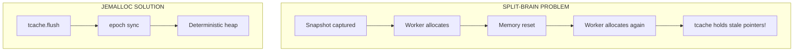

---

## Global Allocator

```rust
use tikv_jemallocator::Jemalloc;

#[global_allocator]
#[cfg(all(not(target_env = "msvc"), not(test)))]
static GLOBAL: Jemalloc = Jemalloc::default();
```

### Conditional Compilation

Jemalloc is disabled during `cargo test` to prevent instability on WSL2:

```rust
#[cfg(all(not(target_env = "msvc"), not(test)))]
```

---

## Quiesce Sequence

Before capturing a snapshot, the worker must quiesce the allocator:

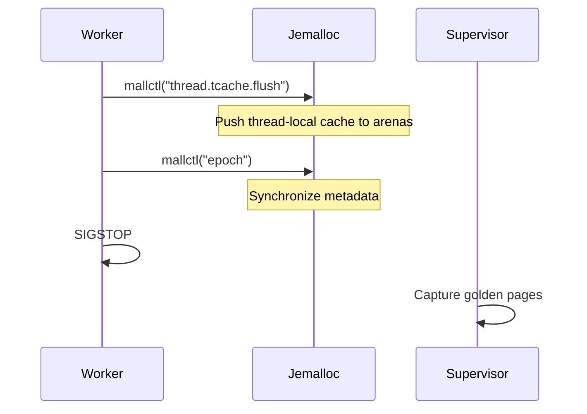

### tcache Flush

```rust
pub fn flush_tcache() {
    unsafe {
        tikv_jemalloc_sys::mallctl(
            c"thread.tcache.flush".as_ptr(),
            std::ptr::null_mut(),
            std::ptr::null_mut(),
            std::ptr::null(),
            0,
        );
    }
}
```

This pushes all thread-local free list entries back to global arenas.

### Epoch Sync

```rust
pub fn sync_epoch() {
    let mut epoch: u64 = 0;
    let mut len = std::mem::size_of::<u64>();
    unsafe {
        tikv_jemalloc_sys::mallctl(
            c"epoch".as_ptr(),
            &mut epoch as *mut _ as *mut _,
            &mut len,
            &epoch as *const _ as *const _,
            len,
        );
    }
}
```

This advances the jemalloc epoch, forcing metadata synchronization.

### Combined Function

```rust
pub fn quiesce_allocator() {
    flush_tcache();
    sync_epoch();
}
```

---

## Why Jemalloc?

| Feature       | glibc malloc  | Jemalloc                         |
| :------------ | :------------ | :------------------------------- |
| tcache flush  | Not exposed   | `mallctl("thread.tcache.flush")` |
| Epoch sync    | Not available | `mallctl("epoch")`               |
| Determinism   | Poor          | Excellent                        |
| Fragmentation | High          | Low                              |

---

## Runtime Configuration

For production, set environment variables:

```bash
export MALLOC_CONF="background_thread:false,dirty_decay_ms:0,muzzy_decay_ms:0"
```

| Option              | Value | Purpose                      |
| :------------------ | :---- | :--------------------------- |
| `background_thread` | false | Disable background purging   |
| `dirty_decay_ms`    | 0     | Immediate dirty page purging |
| `muzzy_decay_ms`    | 0     | Immediate muzzy page purging |

---

## Verification

```rust
pub fn verify_jemalloc_active() -> bool {
    let mut version: *const libc::c_char = std::ptr::null();
    let mut len = std::mem::size_of::<*const libc::c_char>();

    let result = unsafe {
        tikv_jemalloc_sys::mallctl(
            c"version".as_ptr(),
            &mut version as *mut _ as *mut _,
            &mut len,
            std::ptr::null(),
            0,
        )
    };

    if result == 0 && !version.is_null() {
        let version_str = unsafe { CStr::from_ptr(version) };
        eprintln!("[allocator] Jemalloc version: {:?}", version_str);
        true
    } else {
        false
    }
}
```

---

## Integration with Snapshot

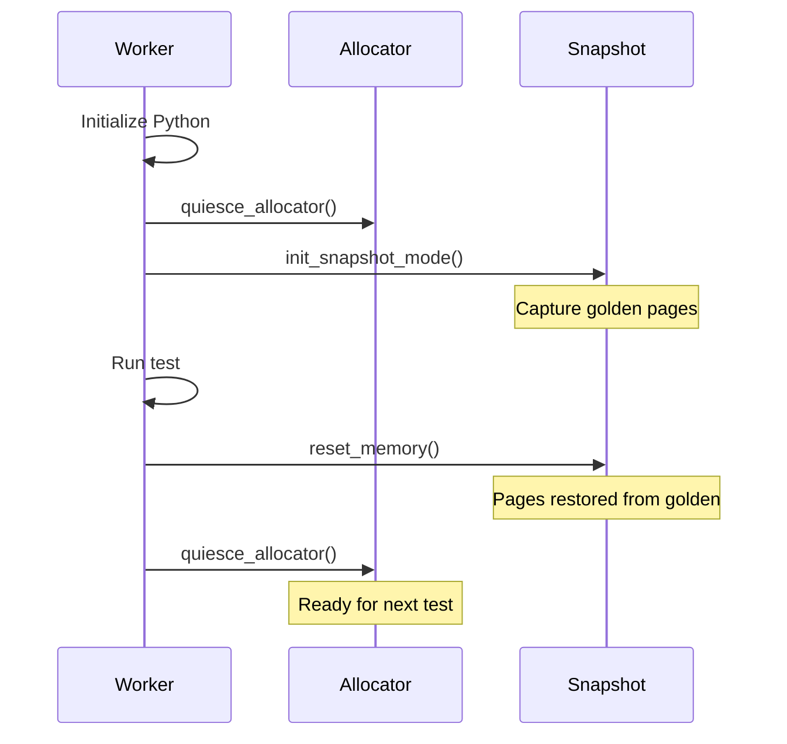

---

## ELF Parsing

For precise libpython segment identification, Tach uses `goblin`:

```rust
fn find_libpython_segments(path: &Path, base: usize) -> Vec<AlignedSegment> {
    let data = std::fs::read(path)?;
    let elf = goblin::elf::Elf::parse(&data)?;

    elf.program_headers
        .iter()
        .filter(|ph| {
            ph.p_type == goblin::elf::program_header::PT_LOAD
                && (ph.p_flags & goblin::elf::program_header::PF_W) != 0
        })
        .map(|ph| AlignedSegment {
            start: base + ph.p_vaddr as usize,
            end: base + ph.p_vaddr as usize + ph.p_memsz as usize,
            description: "libpython data/bss".into(),
        })
        .collect()
}
```

This ensures Python's small-int cache and singletons (None, True, False) are included in snapshots.

---

## Cargo Dependencies

```toml
[dependencies]
tikv-jemallocator = "0.6"
tikv-jemalloc-sys = { version = "0.6", features = ["stats"] }
goblin = "0.10"
```

---

## Related Documentation

- [Physics Engine](snapshot.md) - Memory snapshot details
- [Zygote Lifecycle](zygote.md) - When quiesce is called
- [Troubleshooting](../troubleshooting.md) - Jemalloc build issues


---


# Coverage System

Zero-overhead coverage collection using PEP 669 `sys.monitoring` with lock-free ring buffers.

---

## Overview

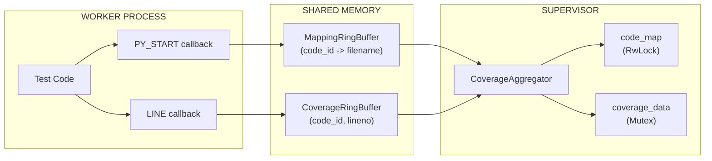

**Key Components:**

- **PEP 669 `sys.monitoring`** (Python 3.12+) for event callbacks
- **Dual ring buffers** with lock-free CAS loops
- **RwLock** for read-heavy code_map access
- **Mutex poisoning recovery** for panic resilience

---

## Data Structures

### RingBufferHeader (64 bytes, cache-line aligned)

```rust
#[repr(C, align(64))]
pub struct RingBufferHeader {
    pub write_idx: AtomicU64,      // Worker increments atomically
    pub read_idx: AtomicU64,       // Supervisor increments
    pub capacity: u64,
    pub overflow_count: AtomicU64, // Entries dropped when full
    _padding: [u8; 32],
}
```

### CoverageEntry (16 bytes)

```rust
#[repr(C, align(16))]
pub struct CoverageEntry {
    pub code_id: u64,  // Python code object address
    pub lineno: u32,
    pub flags: u32,    // Reserved: LINE/CALL/RETURN bits
}
```

### MappingEntry (256 bytes)

```rust
#[repr(C, align(8))]
pub struct MappingEntry {
    pub code_id: u64,
    pub filename_len: u16,
    pub _padding: [u8; 6],
    pub filename: [u8; 240],  // Truncated from LEFT if > 240 bytes
}
```

---

## Buffer Configuration

| Buffer   | Entry Size | Capacity | Total Size |
| :------- | :--------- | :------- | :--------- |
| Coverage | 16 bytes   | 262,144  | ~4 MB      |
| Mapping  | 256 bytes  | 8,192    | ~2 MB      |

```rust
pub const DEFAULT_CAPACITY: usize = 262_144;  // Coverage entries
pub const MAPPING_CAPACITY: usize = 8_192;    // Mapping entries
pub const HEADER_SIZE: usize = 64;
```

---

## Dual-Buffer Architecture

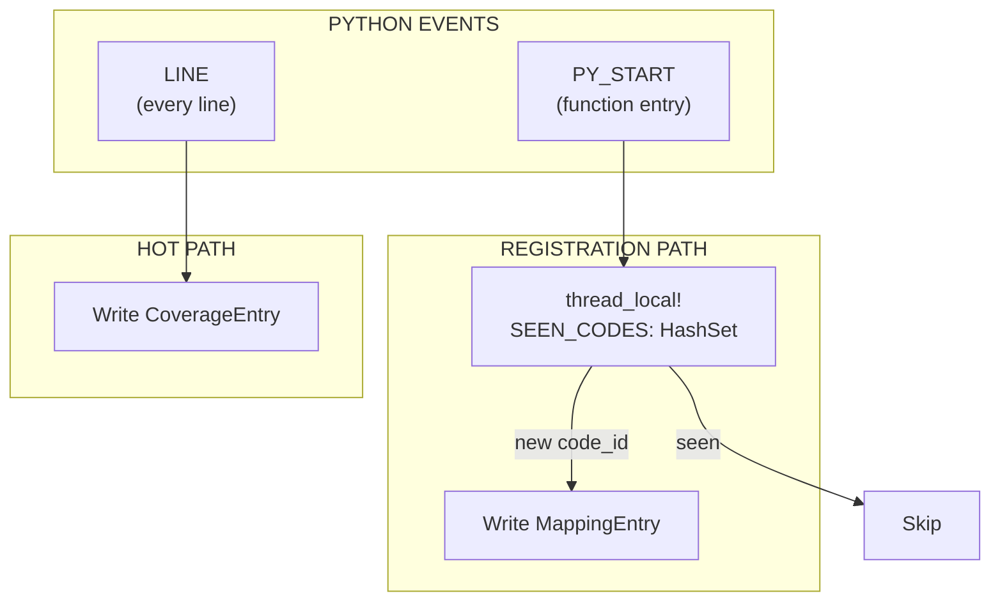

**Why Two Buffers?** PY_START events are infrequent with large entries (256B), LINE events are frequent with small entries (16B). Separation prevents mapping entries from consuming coverage buffer space.

---

## Lock-Free CAS Loop

The CAS (Compare-And-Swap) loop prevents TOCTOU races by atomically checking capacity AND reserving a slot:

```rust
#[inline]
pub fn write(&self, entry: CoverageEntry) -> bool {
    let header = self.header();
    loop {
        let write = header.write_idx.load(Ordering::Acquire);
        let read = header.read_idx.load(Ordering::Acquire);

        if write.wrapping_sub(read) >= header.capacity {
            header.overflow_count.fetch_add(1, Ordering::Relaxed);
            return false;
        }

        match header.write_idx.compare_exchange_weak(
            write, write.wrapping_add(1), Ordering::AcqRel, Ordering::Relaxed
        ) {
            Ok(_) => {
                let slot = (write % self.capacity as u64) as usize;
                unsafe { std::ptr::write_volatile(self.entries_ptr().add(slot), entry); }
                return true;
            }
            Err(_) => { std::hint::spin_loop(); continue; }
        }
    }
}
```

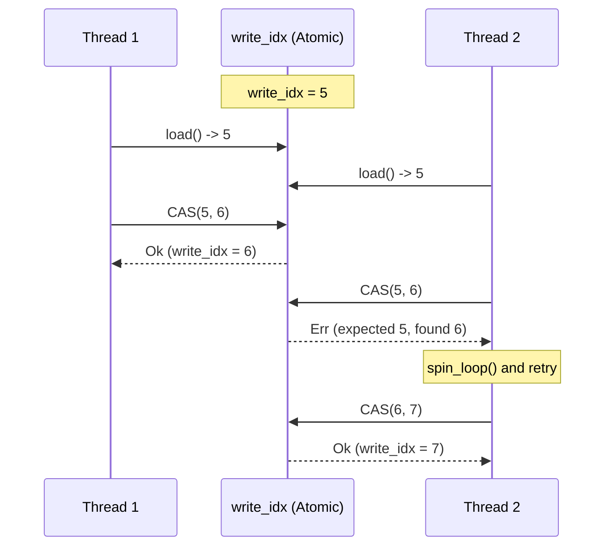

**Invariants:** No slot double-allocation, no buffer overflow, lock-free progress guarantee.

**spin_loop():** Emits `PAUSE` (x86) or `YIELD` (ARM) to reduce power consumption during retry.

---

## RwLock for code_map

The `code_map` uses RwLock for read-heavy access (writes are infrequent, reads happen for every coverage entry):

```rust
pub struct CoverageAggregator {
    data: Arc<Mutex<CoverageData>>,
    code_map: Arc<RwLock<HashMap<u64, String>>>,  // Read-heavy
    stop_flag: Arc<AtomicBool>,
    thread_handle: Option<JoinHandle<()>>,
}
```

```rust
// WRITE: Populating from mapping buffer
let mut guard = code_map.write().unwrap_or_else(|e| e.into_inner());

// READ: Resolving coverage entries (concurrent readers allowed)
let guard = code_map.read().unwrap_or_else(|e| e.into_inner());
```

---

## Mutex Poisoning Recovery

When a thread panics while holding a lock, it becomes "poisoned". Tach recovers using:

```rust
let guard = mutex.lock().unwrap_or_else(|e| e.into_inner());
```

This extracts the guard from `PoisonError`, allowing coverage collection to continue despite test panics.

---

## Performance Optimizations

1. **Zero-Copy Extraction:** `take_data()` uses `std::mem::take()` to move coverage data without cloning.
2. **Pre-allocated HashSet:** `SEEN_CODES` (thread-local) starts with 1024 capacity to avoid hot-path reallocations.
3. **Batch Processing:** Aggregator drains in batches (4096 coverage, 1024 mapping) to amortize lock acquisition.
4. **Volatile Writes:** Ensures visibility across processes without compiler optimization interference.

---

## Ring Buffer Architecture

- **Shared Memory:** Created via `memfd_create` with `MAP_SHARED`.
- **Index Wrapping:** Uses wrapping arithmetic to handle `u64` overflow.
- **Memory Layout:** 64-byte header followed by entry array.

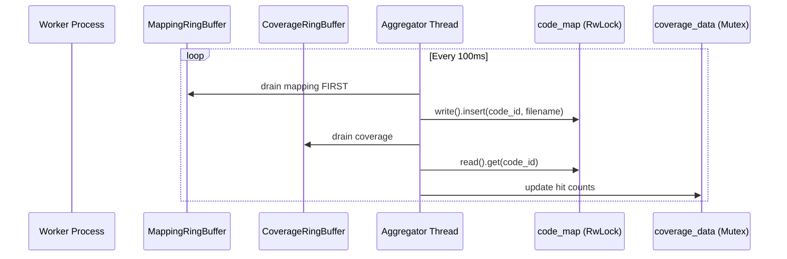

---

## Python Callbacks & FFI

- **PY_START:** Registers `code_id -> filename` once per function.
- **LINE:** Records `(code_id, lineno)` for every line executed.
- **GIL Discipline:** All FFI functions (`record_line`, `record_py_start`) release the GIL using `py.detach()` before shared memory access.

---

## Filename Truncation

Long paths are truncated from the **LEFT** to preserve filenames while fitting in 240-byte `MappingEntry` slots. Truncation respects UTF-8 boundaries.

---

## Memory Exclusion

Coverage buffers (`memfd:tach_coverage`, `memfd:tach_mapping`) are excluded from `userfaultfd` snapshots to ensure coverage persists across memory resets.

---

## Performance Metrics

| Metric        | Value |
| :------------ | :---- |
| Overhead      | < 1%  |
| Write Latency | ~10ns |
| Poll Interval | 100ms |

---

## Test Coverage

Validated by comprehensive unit tests for alignment/wrapping and stress tests for CAS loop concurrency (up to 16 threads). Run `cargo test --lib coverage::` to execute.

---

## Related Documentation

- [Physics Engine](snapshot.md) - Snapshot exclusion
- [API Reference](../api-reference.md) - FFI signatures
- [Configuration](../configuration.md) - Coverage options


---


# TTY Proxy for Interactive Debugging

The Debugger module enables `breakpoint()` and `pdb` inside isolated, parallel workers by implementing a bidirectional terminal tunnel between the Supervisor and Workers.

---

## Overview

When a worker hits a breakpoint, the debugger:

1. Pauses all other workers (SIGSTOP) to prevent log interleaving
2. Switches the terminal to Raw mode for character-by-character I/O
3. Tunnels stdin/stdout bidirectionally through a Unix socket
4. Restores Cooked mode and resumes workers (SIGCONT) when debugging ends

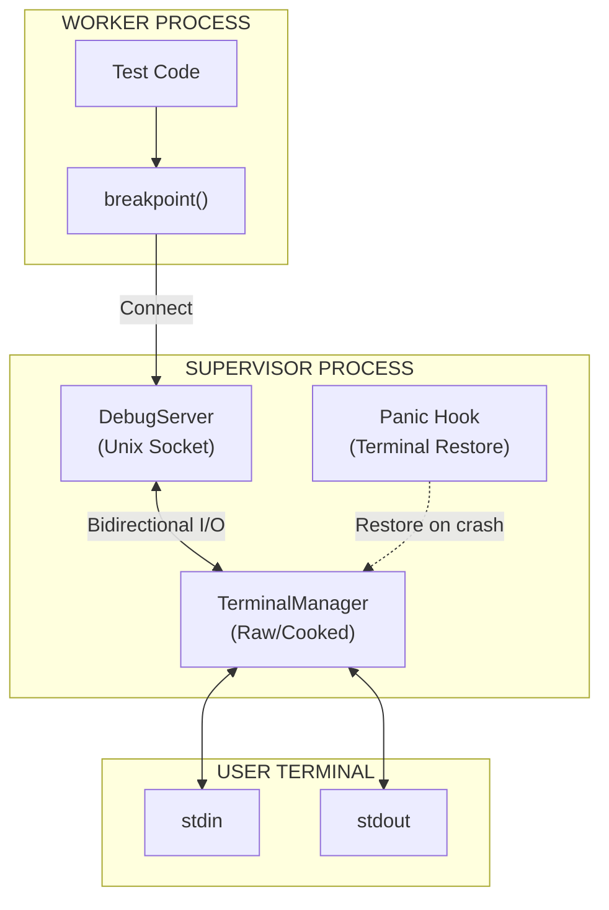

---

## Security Fix: Static Mut Elimination

### The Problem: Unsafe Static Mutable State

The original implementation used `static mut` to store the original terminal settings:

```rust
// BAD: Unsafe static mut - causes undefined behavior
static mut ORIGINAL_TERMIOS: Option<Termios> = None;

// Accessing requires unsafe blocks everywhere
unsafe {
    ORIGINAL_TERMIOS = Some(termios);
}
```

This pattern is **fundamentally unsafe** because:

| Issue                    | Description                                                                      |
| :----------------------- | :------------------------------------------------------------------------------- |
| **Data Races**           | Multiple threads accessing `static mut` simultaneously causes undefined behavior |
| **No Synchronization**   | No memory barriers or locks protect the data                                     |
| **Compiler Assumptions** | The compiler may optimize reads/writes incorrectly                               |
| **Undefined Behavior**   | Even single-threaded access can cause UB if the compiler reorders operations     |

### The Solution: Thread-Safe Mutex Pattern

The fix replaces `static mut` with a thread-safe `Mutex<Option<Termios>>`:

```rust
// GOOD: Thread-safe via Mutex
static ORIGINAL_TERMIOS: Mutex<Option<Termios>> = Mutex::new(None);
```

This pattern provides:

| Benefit             | Description                                  |
| :------------------ | :------------------------------------------- |
| **Thread Safety**   | Mutex ensures exclusive access               |
| **Memory Ordering** | Lock/unlock provides proper memory barriers  |
| **No Unsafe**       | All access is through safe Rust APIs         |
| **Panic Safety**    | Mutex poisoning detects panics during access |

### Why Not OnceLock?

The code includes a comment explaining why `OnceLock` cannot be used:

```rust
/// Saved original termios for panic recovery
/// Uses Mutex for thread-safe access without unsafe static mut
/// (Termios contains RefCell which is not Sync, so OnceLock cannot be used)
static ORIGINAL_TERMIOS: Mutex<Option<Termios>> = Mutex::new(None);
```

`OnceLock<T>` requires `T: Sync`, but `Termios` from the `nix` crate contains a `RefCell` internally, which is not `Sync`. Therefore, `Mutex` is the correct choice.

### Safe Access Pattern

Reading from the mutex:

```rust
// Thread-safe read via Mutex
if let Ok(guard) = ORIGINAL_TERMIOS.lock() {
    if let Some(ref original) = *guard {
        let stdin = io::stdin();
        let _ = tcsetattr(&stdin, SetArg::TCSANOW, original);
    }
}
```

Writing to the mutex:

```rust
// Thread-safe write via Mutex
if let Ok(mut guard) = ORIGINAL_TERMIOS.lock() {
    *guard = Some(original.clone());
}
```

---

## Data Structures

### TerminalMode

```rust
#[derive(Debug, Clone, Copy, PartialEq)]
pub enum TerminalMode {
    /// Normal line-buffered mode with echo
    Cooked,
    /// Character-by-character, no echo, no signal processing
    Raw,
}
```

### TerminalManager

Manages terminal state transitions and ensures safe restoration:

```rust
pub struct TerminalManager {
    stdin_fd: RawFd,
    original_termios: Option<Termios>,
    current_mode: TerminalMode,
}
```

### DebugServer

Listens for worker connections on a Unix socket:

```rust
pub struct DebugServer {
    socket_path: PathBuf,  // /tmp/tach_debug_{pid}.sock
    listener: UnixListener,
}
```

---

## Terminal Mode Management

### Raw Mode

Raw mode disables terminal processing for direct character I/O:

```rust
pub fn enter_raw_mode(&mut self) -> Result<()> {
    if self.current_mode == TerminalMode::Raw {
        return Ok(());
    }

    let mut raw = self.original_termios.clone()
        .context("No original termios saved")?;

    // cfmakeraw disables all the flags we need:
    // - ICANON, ECHO, ECHOE, ECHOK, ECHONL, ISIG, IEXTEN
    // - BRKINT, ICRNL, INPCK, ISTRIP, IXON
    // - OPOST
    // - CSIZE, PARENB (sets CS8)
    cfmakeraw(&mut raw);

    let stdin = io::stdin();
    tcsetattr(&stdin, SetArg::TCSANOW, &raw)
        .context("Failed to set raw mode")?;

    IN_RAW_MODE.store(true, Ordering::SeqCst);
    self.current_mode = TerminalMode::Raw;

    Ok(())
}
```

### Cooked Mode Restoration

```rust
pub fn restore(&mut self) -> Result<()> {
    if self.current_mode == TerminalMode::Cooked {
        return Ok(());
    }

    if let Some(ref original) = self.original_termios {
        let stdin = io::stdin();
        tcsetattr(&stdin, SetArg::TCSANOW, original)
            .context("Failed to restore terminal")?;
    }

    IN_RAW_MODE.store(false, Ordering::SeqCst);
    self.current_mode = TerminalMode::Cooked;

    Ok(())
}
```

### Drop Implementation

The `TerminalManager` implements `Drop` to ensure terminal restoration:

```rust
impl Drop for TerminalManager {
    fn drop(&mut self) {
        // Best-effort restoration on drop
        let _ = self.restore();
    }
}
```

---

## Panic Hook Installation

### The Problem

If the program panics while in Raw mode, the terminal is left in an unusable state:

- No echo (you cannot see what you type)
- No line buffering (Enter does not work normally)
- No signal processing (Ctrl+C does not work)

### The Solution

A panic hook is installed at program startup to restore the terminal:

```rust
/// Install panic hook to restore terminal on crash
///
/// CRITICAL: Without this, a panic in raw mode leaves the terminal unusable.
/// Call this once at program startup.
pub fn install_panic_hook() {
    let default_hook = std::panic::take_hook();

    std::panic::set_hook(Box::new(move |info| {
        // Attempt to restore terminal if we were in raw mode
        if IN_RAW_MODE.load(Ordering::SeqCst) {
            // Thread-safe read via Mutex
            if let Ok(guard) = ORIGINAL_TERMIOS.lock() {
                if let Some(ref original) = *guard {
                    let stdin = io::stdin();
                    let _ = tcsetattr(&stdin, SetArg::TCSANOW, original);
                }
            }
            IN_RAW_MODE.store(false, Ordering::SeqCst);
            eprintln!("\n[tach] Terminal restored after panic.\n");
        }

        // Call the default panic handler
        default_hook(info);
    }));
}
```

### How It Works

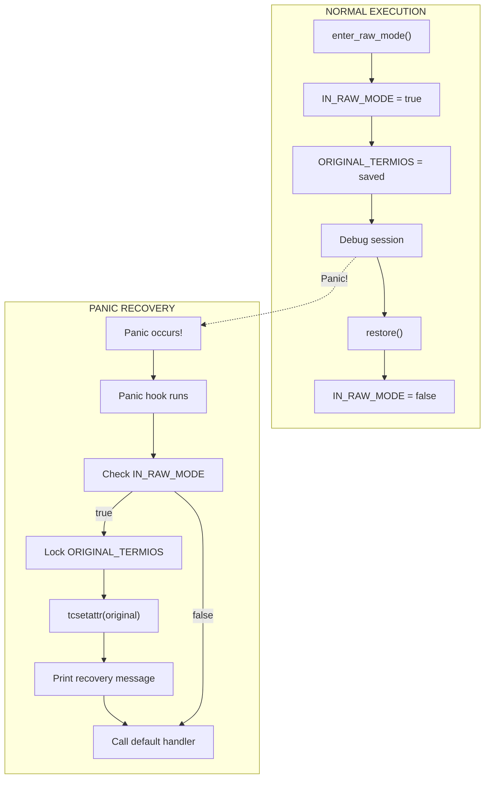

### Global State for Panic Recovery

Two global variables enable panic recovery:

```rust
/// Global flag to track if we're in raw mode (for panic hook)
static IN_RAW_MODE: AtomicBool = AtomicBool::new(false);

/// Saved original termios for panic recovery
/// Uses Mutex for thread-safe access without unsafe static mut
static ORIGINAL_TERMIOS: Mutex<Option<Termios>> = Mutex::new(None);
```

| Variable           | Type                     | Purpose                                  |
| :----------------- | :----------------------- | :--------------------------------------- |
| `IN_RAW_MODE`      | `AtomicBool`             | Fast check if terminal needs restoration |
| `ORIGINAL_TERMIOS` | `Mutex<Option<Termios>>` | Thread-safe storage of original settings |

---

## DebugServer Implementation

### Socket Creation

```rust
pub fn new() -> Result<Self> {
    let pid = std::process::id();
    let socket_path = PathBuf::from(format!("/tmp/tach_debug_{}.sock", pid));

    // Clean up any stale socket file
    if socket_path.exists() {
        fs::remove_file(&socket_path)
            .context("Failed to remove stale debug socket")?;
    }

    let listener = UnixListener::bind(&socket_path)
        .context("Failed to bind debug socket")?;

    // Set non-blocking so we can check for connections without blocking scheduler
    listener.set_nonblocking(true)
        .context("Failed to set socket non-blocking")?;

    eprintln!("[debugger] Listening on {}", socket_path.display());

    Ok(Self { socket_path, listener })
}
```

### Non-Blocking Accept

```rust
/// Check if a worker is waiting to connect (non-blocking)
pub fn try_accept(&self) -> Option<UnixStream> {
    match self.listener.accept() {
        Ok((stream, _)) => Some(stream),
        Err(ref e) if e.kind() == io::ErrorKind::WouldBlock => None,
        Err(e) => {
            eprintln!("[debugger] Accept error: {}", e);
            None
        }
    }
}
```

### Debug Session Handling

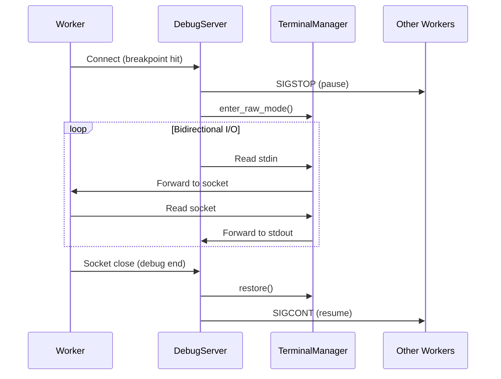

### Worker Pause/Resume

Other workers are paused during debugging to prevent log interleaving:

```rust
/// Pause all workers by sending SIGSTOP
fn pause_workers(worker_pids: &[i32], debug_worker_pid: Option<i32>) {
    for &pid in worker_pids {
        if Some(pid) == debug_worker_pid {
            continue; // Don't stop the worker we're debugging!
        }
        if pid > 0 {
            let _ = kill(Pid::from_raw(pid), Signal::SIGSTOP);
        }
    }
}

/// Resume all paused workers by sending SIGCONT
fn resume_workers(worker_pids: &[i32]) {
    for &pid in worker_pids {
        if pid > 0 {
            let _ = kill(Pid::from_raw(pid), Signal::SIGCONT);
        }
    }
}
```

### Socket Cleanup

```rust
impl Drop for DebugServer {
    fn drop(&mut self) {
        self.cleanup();
    }
}

fn cleanup(&self) {
    if self.socket_path.exists() {
        let _ = fs::remove_file(&self.socket_path);
    }
}
```

---

## Integration with Lifecycle

The debugger integrates with the lifecycle module via a global flag:

```rust
// In handle_session():
crate::lifecycle::IS_DEBUGGING.store(true, Ordering::SeqCst);

// ... debug session ...

crate::lifecycle::IS_DEBUGGING.store(false, Ordering::SeqCst);
```

This flag affects signal handling - SIGINT is ignored during debugging because Raw mode handles Ctrl+C directly (as byte 0x03).

---

## Thread Safety Summary

| Component          | Synchronization          | Notes                                    |
| :----------------- | :----------------------- | :--------------------------------------- |
| `IN_RAW_MODE`      | `AtomicBool`             | Lock-free, fast check                    |
| `ORIGINAL_TERMIOS` | `Mutex<Option<Termios>>` | Thread-safe, handles non-Sync inner type |
| `DebugServer`      | Single-threaded          | Only supervisor uses it                  |
| `TerminalManager`  | Instance-based           | Created per session                      |

---

## Error Handling

| Error                               | Cause             | Recovery                     |
| :---------------------------------- | :---------------- | :--------------------------- |
| `Failed to get terminal attributes` | stdin not a TTY   | Return error, skip debugging |
| `Failed to set raw mode`            | Permission denied | Return error, skip debugging |
| `Failed to bind debug socket`       | Port in use       | Clean stale socket, retry    |
| Panic in raw mode                   | Any panic         | Panic hook restores terminal |

---

## Usage Example

```rust
use tach::reporting::debugger::{DebugServer, install_panic_hook};

fn main() -> Result<()> {
    // Install panic hook at startup (once)
    install_panic_hook();

    // Create debug server
    let debug_server = DebugServer::new()?;

    // In scheduler loop:
    if let Some(stream) = debug_server.try_accept() {
        let worker_pids = get_all_worker_pids();
        let debug_worker_pid = get_connecting_worker_pid();

        debug_server.handle_session(
            stream,
            &worker_pids,
            Some(debug_worker_pid),
        )?;
    }

    Ok(())
}
```

---

## Related Documentation

- [Scheduler](scheduler.md) - How the scheduler integrates with the debug server
- [Zygote Lifecycle](zygote.md) - Worker process management
- [Isolation](isolation.md) - How workers are isolated


---


# Discovery Engine

The Discovery Engine performs static AST analysis to find tests without executing Python code.

---

## Overview

Tach uses `rustpython-parser` to parse Python source files into Abstract Syntax Trees (ASTs). This approach is:

- **Fast**: Parallel parsing with `rayon`
- **Safe**: No code execution during discovery
- **Accurate**: Full Python 3.10+ syntax support

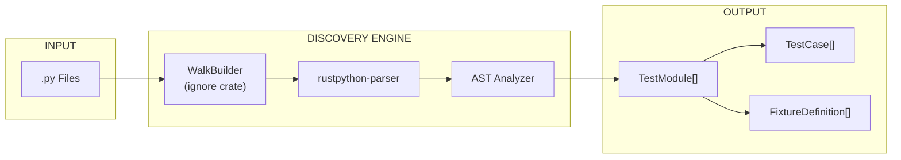

---

## Data Structures

### FixtureScope

Defines the lifecycle of a pytest fixture.

```rust
pub enum FixtureScope {
    Function,  // Default - new instance per test
    Class,     // Shared within test class
    Module,    // Shared within test file
    Session,   // Shared across entire run
}
```

### FixtureDefinition

Represents a `@pytest.fixture` decorated function.

```rust
pub struct FixtureDefinition {
    pub name: String,
    pub scope: FixtureScope,
    pub dependencies: Vec<String>,
    pub params: Option<Vec<String>>,
    pub class_scope: Option<String>,
}
```

| Field          | Description                                                    |
| :------------- | :------------------------------------------------------------- |
| `name`         | Fixture function name                                          |
| `scope`        | Lifecycle scope (function/class/module/session)                |
| `dependencies` | Other fixtures this fixture requires                           |
| `params`       | Static literal parameters from `@pytest.fixture(params=[...])` |
| `class_scope`  | If defined inside a class, the class name                      |

### TestCase

Represents an individual test function or method.

```rust
pub struct TestCase {
    pub name: String,
    pub dependencies: Vec<String>,
    pub is_async: bool,
    pub line_number: usize,
    pub parametrized_args: Vec<String>,
    pub timeout_secs: Option<u64>,
}
```

| Field               | Description                                                                  |
| :------------------ | :--------------------------------------------------------------------------- |
| `name`              | Test name (e.g., `test_func` or `TestClass::test_method`)                    |
| `dependencies`      | Fixtures required by the test                                                |
| `is_async`          | Whether it's an `async def`                                                  |
| `line_number`       | 1-indexed line number for reporting                                          |
| `parametrized_args` | Arguments from `@pytest.mark.parametrize` (excluded from fixture resolution) |
| `timeout_secs`      | Per-test timeout from `@pytest.mark.timeout(N)`                              |

### TestModule

Represents a single `.py` file.

```rust
pub struct TestModule {
    pub path: PathBuf,
    pub tests: Vec<TestCase>,
    pub fixtures: Vec<FixtureDefinition>,
    pub is_toxic: bool,
}
```

### DiscoveryResult

The aggregate result of a project scan.

```rust
pub struct DiscoveryResult {
    pub modules: Vec<TestModule>,
}
```

---

## Discovery Process

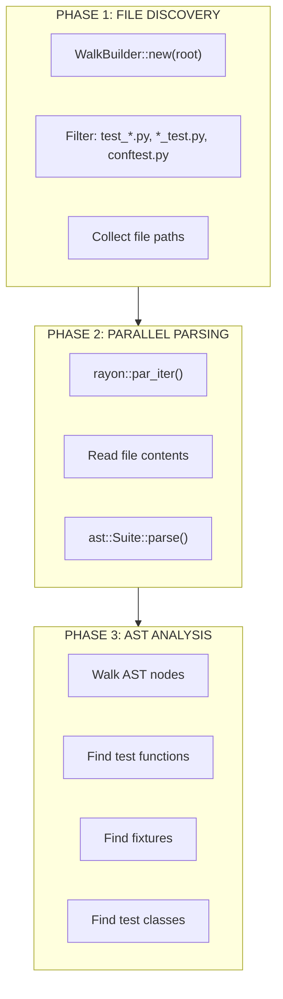

### File Filtering

Files are included if they match:

- `test_*.py` - Test files
- `*_test.py` - Test files (alternate convention)
- `conftest.py` - Fixture files

### Pattern Detection

The analyzer detects:

| Pattern         | Detection Method                             |
| :-------------- | :------------------------------------------- |
| Test functions  | `def test_*` at module level                 |
| Async tests     | `async def test_*`                           |
| Test classes    | `class Test*`                                |
| Test methods    | `def test_*` inside `Test*` class            |
| Fixtures        | `@pytest.fixture` or `@fixture` decorator    |
| Parametrization | `@pytest.mark.parametrize` decorator         |
| Mocking         | `@patch` or `@unittest.mock.patch` decorator |

---

## Key Functions

### discover

Entry point for test discovery.

```rust
pub fn discover(root: &Path) -> Result<DiscoveryResult>
```

Uses `WalkBuilder` to find files and `rayon` to parse them in parallel.

### parse_module

Parses a single Python file.

```rust
fn parse_module(path: &Path) -> Result<TestModule>
```

Reads the file and converts its AST into a `TestModule`.

### analyze_function

Extracts test/fixture data from function definitions.

```rust
fn analyze_function(
    func: &ast::StmtFunctionDef,
    class_name: Option<&str>,
) -> Option<TestOrFixture>
```

### extract_injected_args

Identifies arguments that are NOT fixtures.

```rust
fn extract_injected_args(
    decorators: &[ast::Expr],
    func_args: &[String],
) -> Vec<String>
```

Filters out arguments from:

- `@pytest.mark.parametrize("arg1, arg2", [...])`
- `@patch("module.thing")` (injects mock as argument)

---

## Special Handling

### self and cls

Method arguments `self` and `cls` are automatically excluded from fixture resolution.

### Parametrization

```python
@pytest.mark.parametrize("x, y", [(1, 2), (3, 4)])
def test_add(x, y, some_fixture):
    pass
```

Here, `x` and `y` are parametrized args (not fixtures), while `some_fixture` is a fixture dependency.

### Mock Patches

```python
@patch("module.SomeClass")
def test_thing(mock_class, some_fixture):
    pass
```

The first argument (`mock_class`) is injected by `@patch`, not a fixture.

### conftest.py

Fixtures in `conftest.py` files are automatically treated as global fixtures available to all tests in the directory tree.

### TYPE_CHECKING Blocks

Imports inside `if TYPE_CHECKING:` blocks are skipped during toxicity analysis to avoid false positives.

---

## Integration with Toxicity

After discovery, each `TestModule` is analyzed for toxicity:


See [Toxicity Analysis](toxicity.md) for details.

---

## Performance Characteristics

| Metric      | Value                                |
| :---------- | :----------------------------------- |
| Parallelism | All CPU cores via `rayon`            |
| Memory      | O(n) where n = number of files       |
| Complexity  | O(n \* m) where m = average AST size |

---

## Limitations

1. **Dynamic Tests**: Tests generated at runtime (e.g., via `pytest_generate_tests`) are not discovered
2. **Eval/Exec**: Tests defined via `eval()` or `exec()` are not discovered
3. **Namespace Packages**: Directories without `__init__.py` fall back to standard import

---

## Related Documentation

- [Toxicity Analysis](toxicity.md) - How discovered modules are analyzed for safety
- [Fixture Resolver](resolver.md) - How fixture dependencies are resolved


---


# Internal Architecture: The Physics of Restoration

> **Purpose**: Define restoration invariants and document allocator-specific state locations

---

## Executive Summary

This document bridges the **EPERM Doctrine** (security enforcement) with the **Physics of Restoration** (memory snapshot/restore). It defines the invariants that must hold for successful test isolation and documents the critical memory locations that must be synchronized during restoration.

---

## The Restoration Quadrant

Successful memory restoration requires the synchronization of **four** interdependent memory regions:

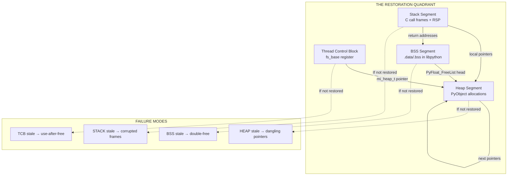

### The Four Pillars

| Pillar    | Memory Location             | Contains                            | Restoration Method          |
| --------- | --------------------------- | ----------------------------------- | --------------------------- |
| **TCB**   | `fs_base` register          | TLS pointers (mi_heap_t, mi_tld_t)  | arch_prctl(ARCH_SET_FS)     |
| **BSS**   | libpython .data/.bss        | Free list heads, singletons         | userfaultfd + MADV_DONTNEED |
| **Heap**  | `[heap]` + anonymous maps   | PyObject allocations                | userfaultfd + MADV_DONTNEED |
| **Stack** | `[stack]` in /proc/pid/maps | C call frames, local variables, RSP | userfaultfd + longjmp       |

### Stack Restoration Semantics

The Stack pillar is special because it requires **two-phase restoration**:

1. **Memory Restoration**: userfaultfd restores the stack memory contents (same as Heap/BSS)
2. **Register Restoration**: `longjmp` restores RSP/RBP to point to the correct stack frame

```c
// Phase 1: setjmp captures stack context during golden snapshot
jmp_buf golden_context;
if (setjmp(golden_context) == 0) {
    // First return: capture golden state
    take_snapshot();
} else {
    // Second return: we just restored!
    verify_restoration();
}

// Phase 2: longjmp restores registers after memory is restored
longjmp(golden_context, 1);  // Jumps to setjmp, returns 1
```

**Critical**: `longjmp` only restores **registers** (RSP, RBP, RIP). The actual stack **memory** must already be restored via userfaultfd before longjmp is called.

---

## Restoration Invariants

### Invariant 1: Bit-Perfect Alignment

A successful restore is **NOT** just "no crash." It is a **bit-perfect** alignment of:

| Component | Location                      | Validation                           |
| --------- | ----------------------------- | ------------------------------------ |
| **TCB**   | `fs_base` register            | `self_ptr == fs_base`                |
| **BSS**   | libpython .data/.bss segments | `sha256(restored) == sha256(golden)` |
| **Heap**  | Anonymous mappings + `[heap]` | `sha256(restored) == sha256(golden)` |
| **Stack** | `[stack]` region              | `sha256(restored) == sha256(golden)` |

### Invariant 2: Pointer Consistency

All pointers from BSS → Heap must point to valid, restored objects:

```
BEFORE RESTORE:
  BSS: PyFloat_FreeList → 0x7f1234560000 (heap object A)
  Heap: Object A at 0x7f1234560000, next → Object B

AFTER RESTORE (CORRECT):
  BSS: PyFloat_FreeList → 0x7f1234560000 (SAME address)
  Heap: Object A at 0x7f1234560000 (RESTORED content)

AFTER RESTORE (FAILURE):
  BSS: PyFloat_FreeList → 0x7f1234560000 (old address)
  Heap: 0x7f1234560000 is ZEROED (MADV_DONTNEED zapped it)
  RESULT: Next float allocation follows NULL/garbage pointer → SIGSEGV
```

### Invariant 3: TLS Synchronization

Thread Local Storage must be restored alongside Heap when using allocators that cache state in TLS (mimalloc in Python 3.13+):

```
TCB at fs_base:
  +0x0ad8: mi_heap_t* → points into anonymous heap region
  +0x0ae0: mi_tld_t* → thread-local data
  ...

If Heap is restored but TLS is not:
  mi_heap_t* points to RESTORED memory
  BUT mi_heap_t->pages still references STALE page list
  RESULT: Allocator returns memory that was "freed" in snapshot
```

### Invariant 4: GC Stability

Post-restoration, the garbage collector must be able to traverse all objects without fault:

```python
# Verification: Run 100 times without SIGSEGV
for _ in range(100):
    gc.collect()
```

If any of the following occur, restoration has FAILED:

- `SIGSEGV` (invalid pointer dereference)
- `SIGBUS` (unaligned access)
- Python exception from gc internals
- Memory leak detected by gc

### Invariant 5: Stack Integrity

The C stack must be restored with valid return addresses and frame pointers:

```
BEFORE RESTORE (Golden):
  RSP: 0x7ffe12345000
  Stack: [...][return_addr_A][frame_ptr_A][locals_A][...]

AFTER RESTORE (CORRECT):
  RSP: 0x7ffe12345000 (restored via longjmp)
  Stack: [...][return_addr_A][frame_ptr_A][locals_A][...] (restored via uffd)

AFTER RESTORE (FAILURE):
  RSP: 0x7ffe12345000 (restored via longjmp)
  Stack: [...][GARBAGE][GARBAGE][GARBAGE][...] (not restored)
  RESULT: Next function return jumps to invalid address → SIGSEGV
```

Stack restoration is validated by:

1. Deep recursion before snapshot (stress test with 100+ frames)
2. Restore triggers stack page faults
3. Continue execution without crash
4. Verify local variables are preserved

---

## The mimalloc Offset Registry

Python 3.13 uses mimalloc as its memory allocator. mimalloc stores thread-local state at fixed offsets from `fs_base`.

### Discovered Offsets (Python 3.13, x86_64, glibc)

| Offset from fs_base | Structure    | Description                         |
| ------------------- | ------------ | ----------------------------------- |
| `+0x0ad8`           | `mi_heap_t*` | **Primary heap pointer** (CRITICAL) |
| `+0x0ae0`           | `mi_tld_t*`  | Thread-local data                   |
| `+0x0af8`           | Unknown      | Secondary heap reference            |
| `+0x0b00`           | Unknown      | Page list pointer                   |
| `+0x0b20`           | Unknown      | Segment metadata                    |
| `+0x0b40`           | Unknown      | Segment base                        |
| `+0x0b60`           | Unknown      | Free list cache                     |
| `+0x0b80`           | Unknown      | Free list cache                     |

### Version Compatibility Matrix

| Python Version | Allocator | TLS Offsets               | Status     |
| -------------- | --------- | ------------------------- | ---------- |
| 3.11.x         | pymalloc  | N/A (no TLS caching)      | Safe       |
| 3.12.x         | pymalloc  | N/A (no TLS caching)      | Safe       |
| 3.13.x         | mimalloc  | `fs_base+0xad8` (primary) | **HAZARD** |
| 3.14.x         | TBD       | TBD                       | Unknown    |

### Detection Method

The mimalloc TLS offsets are discovered at runtime using **Sentinel Scan**:

1. Allocate a unique sentinel pattern (`0xDEADC0DE_BAADF00D`) in Python heap via ctypes
2. Read `fs_base` via `arch_prctl(ARCH_GET_FS)`
3. Parse `/proc/self/maps` to identify TLS region boundaries
4. Scan TLS (12KB range) for pointers targeting the sentinel or heap regions
5. Record offsets where valid heap pointers are found

**Why Runtime Discovery?**

Hardcoded offsets are "Voodoo Engineering" because they vary with:

- Python version (3.13.x vs 3.14.x)
- glibc version
- libpython build configuration
- ASLR state

The sentinel scan is performed **once during Zygote warm-up** and cached for the process tree's lifetime.

See `experiments/tls_sentinel_scan.rs` for the implementation.

---

## The Split-Brain Hazard

### Definition

The **Split-Brain Hazard** occurs when BSS and Heap are restored independently, leaving cross-segment pointers in an inconsistent state.

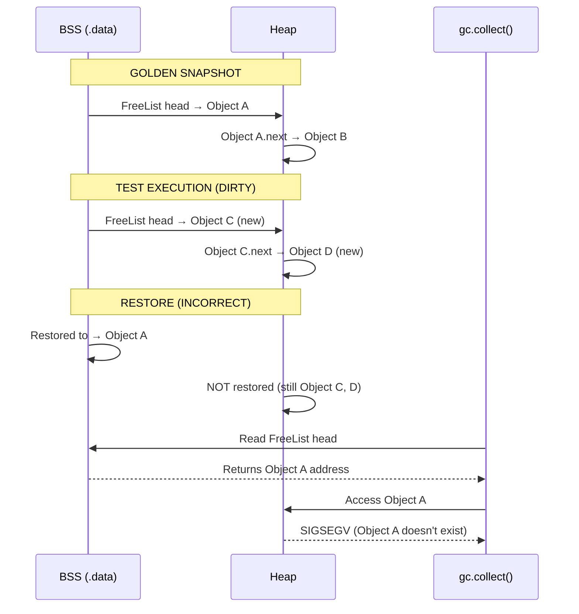

### Mitigation

The Split-Brain Hazard is mitigated by:

1. **Atomic Restoration**: Both BSS and Heap are invalidated in a single `madvise(MADV_DONTNEED)` pass
2. **userfaultfd Handling**: All page faults are resolved from the golden snapshot
3. **Validation**: Post-restore GC stress test (100 iterations)

---

## The Free List Architecture

### PyFloat_FreeList (Example)

Python caches freed `PyFloatObject` instances in a singly-linked free list:

```c
// In Objects/floatobject.c
static PyFloatObject *free_list = NULL;  // BSS segment
static int numfree = 0;                   // BSS segment

// When a float is freed:
void float_dealloc(PyFloatObject *op) {
    op->ob_type = (PyTypeObject *)free_list;  // Heap modification
    free_list = op;                            // BSS modification
    numfree++;
}

// When a float is allocated:
PyFloatObject *float_alloc(void) {
    if (free_list != NULL) {
        PyFloatObject *op = free_list;              // Read from BSS
        free_list = (PyFloatObject *)op->ob_type;   // BSS modification
        numfree--;
        return op;  // Return from Heap
    }
    return PyObject_Malloc(sizeof(PyFloatObject));
}
```

### Restoration Requirement

For correct restoration:

| Segment | Must Contain                                         |
| ------- | ---------------------------------------------------- |
| BSS     | `free_list` pointer from golden snapshot             |
| Heap    | The exact `PyFloatObject` that `free_list` points to |

If BSS is restored but Heap is not:

- `free_list` points to golden address (e.g., `0x7f1234560000`)
- But that address now contains post-test data
- Next `float_alloc()` returns corrupted object

---

## Validation Strategy

### The Memory Invariant Test

Located at: `rust_tests/memory_invariant.rs`

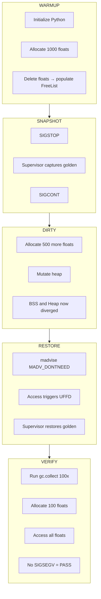

### Success Criteria

| Metric                      | Target            | Validation Method                |
| --------------------------- | ----------------- | -------------------------------- |
| **Bit-Perfect Restoration** | sha256 match      | Compare memory ranges            |
| **GC Stability**            | 100x gc.collect() | No SIGSEGV                       |
| **Float Allocation**        | Success           | Allocate 100 floats post-restore |
| **Latency**                 | <500μs for 1GB    | Benchmark restoration time       |

---

## Security Integration

### From EPERM Doctrine to Physics

The EPERM Doctrine (documented in `docs/security/sandbox-enforcement.md`) ensures that workers cannot escape their sandbox. The Physics of Restoration ensures that workers cannot corrupt each other through stale memory state.

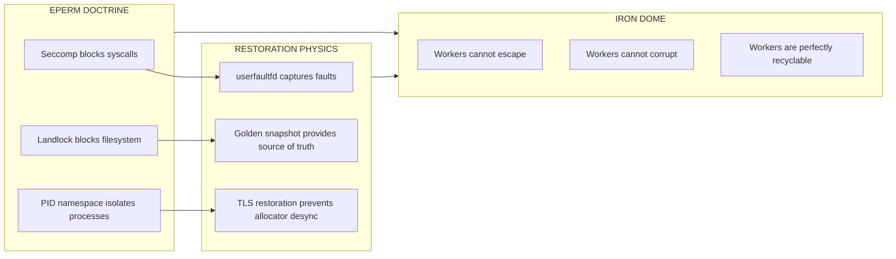

---

## Future Work

### Phase 2.2: TLS Restoration Implementation (COMPLETE)

1. **Runtime Sentinel Scan** - COMPLETE (`experiments/tls_sentinel_scan.rs`)
2. **Stack Registration** - COMPLETE (`src/isolation/snapshot.rs` includes `[stack]`)
3. **Capture TLS** - COMPLETE (via `ptrace(PTRACE_ARCH_PRCTL, ARCH_GET_FS)`)
4. **Restore TLS** - COMPLETE (via `process_vm_writev` + `ptrace(PTRACE_ARCH_PRCTL, ARCH_SET_FS)`)
5. **Validate** mimalloc state after restoration - COMPLETE (via physics tests)

### Phase 2.3: The Final Sync (COMPLETE)

Implemented the full TLS Snapshot/Restore mechanism in `src/isolation/snapshot.rs`:

#### Key Functions Added

| Function                 | Purpose                                          |
| ------------------------ | ------------------------------------------------ |
| `get_fs_base_ptrace()`   | Read fs_base register via ptrace ARCH_GET_FS     |
| `set_fs_base_ptrace()`   | Write fs_base register via ptrace ARCH_SET_FS    |
| `capture_tls_snapshot()` | Capture 12KB TLS block + fs_base during snapshot |
| `restore_tls_snapshot()` | Restore TLS block via process_vm_writev + ptrace |
| `restore_worker_tls()`   | SnapshotManager method for TLS restoration       |
| `reset_worker_full()`    | Combined memory + TLS reset for complete restore |

#### TLS Snapshot Structure

```rust
pub struct TlsSnapshot {
    pub fs_base: usize,           // Thread Control Block address
    pub tls_data: Vec<u8>,        // 12KB TLS memory block
    pub tls_region_start: usize,  // TLS region bounds (from /proc/maps)
    pub tls_region_end: usize,
}
```

#### Restoration Flow

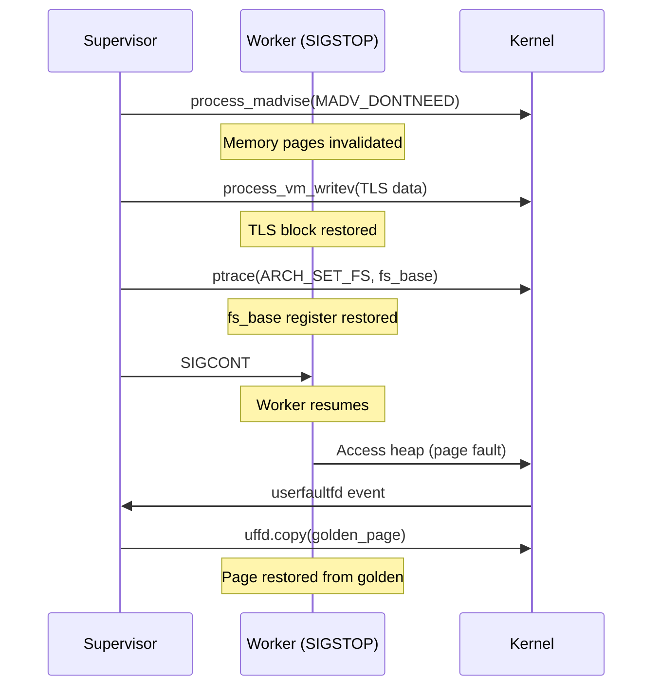

### Performance Optimization (PLANNED)

1. **Lazy TLS capture**: Only snapshot TLS offsets that contain heap pointers
2. **COW optimization**: Use `userfaultfd(UFFD_FEATURE_MINOR_HUGETLBFS)` for huge pages
3. **Batched restoration**: Group page faults for reduced syscall overhead
4. **Syscall batching**: Explore vectorized `process_vm_writev` for TLS + Stack

### Multi-Version Support (PLANNED)

1. **Detect Python version** at runtime
2. **Load appropriate offset registry** for that version
3. **Skip TLS restoration** for pre-3.13 (pymalloc doesn't use TLS)

---

## References

- `docs/security/sandbox-enforcement.md` - EPERM Doctrine
- `docs/ci/self-hosted-runner.md` - CI infrastructure requirements
- `experiments/tls_python_poc.rs` - mimalloc TLS detection (static)
- `experiments/tls_sentinel_scan.rs` - Runtime TLS offset discovery (dynamic)
- `rust_tests/memory_invariant.rs` - BSS/Heap validation test
- `rust_tests/physics_check.rs` - Core physics validation
- `src/isolation/snapshot.rs` - Snapshot manager implementation
- `scripts/run_physics_local.sh` - Local physics test bootstrap

---

_"The Iron Dome is only as strong as its weakest pointer."_

_Project Tach Internal Architecture Standard_


---


# Isolation Architecture (Namespaces and OverlayFS)

Worker isolation provides filesystem and network separation for test processes, ensuring tests cannot interfere with each other or the host system.

---

## Overview

Tach uses Linux namespaces and OverlayFS to create isolated environments for each worker:

1. **Mount Namespace (CLONE_NEWNS)**: Private filesystem view per worker
2. **Network Namespace (CLONE_NEWNET)**: Isolated network stack with own loopback
3. **OverlayFS**: Copy-on-write layers for `/tmp` and project directory

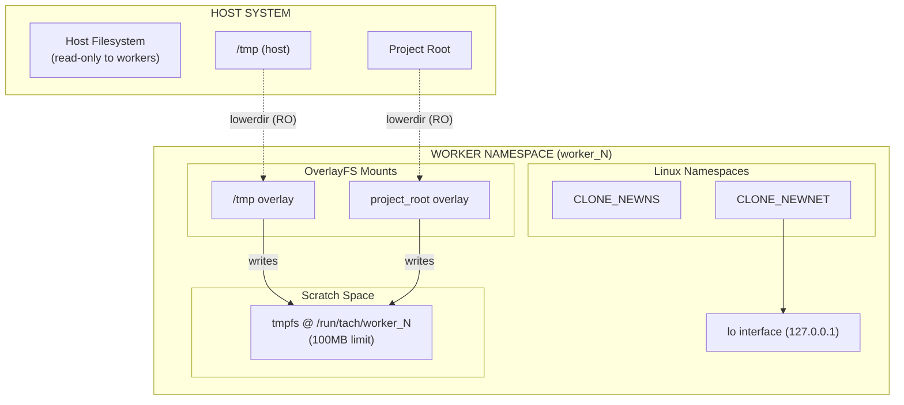

---

## Namespace Types

### Mount Namespace (CLONE_NEWNS)

Provides a private set of mount points. After entering, mount operations are invisible to host and other workers.

```rust
unshare(CloneFlags::CLONE_NEWNS | CloneFlags::CLONE_NEWNET)
    .context("unshare failed - requires CAP_SYS_ADMIN")?;
```

**Key Properties:** Worker mounts isolated from host; mount propagation disabled via `MS_PRIVATE`.

### Network Namespace (CLONE_NEWNET)

Provides isolated network stack preventing tests from binding conflicting ports or interfering with host services.

**Each Worker Gets:** Own network interfaces, routing tables, firewall rules, and port bindings.

**Loopback Setup:** After entering namespace, bring up loopback manually:

```rust
fn setup_loopback() -> Result<()> {
    Command::new("ip").args(["link", "set", "lo", "up"]).output()?;
    Ok(())
}
```

### PID Namespace

**Not used.** Tach uses standard `fork()` and `PR_SET_PDEATHSIG` for process management.

---

## The setup_filesystem Function

Main entry point for worker isolation with a critical execution sequence.

### Function Signature

```rust
/// Set up complete isolation for a worker (Iron Dome)
/// If TACH_NO_ISOLATION=1, skip all isolation (for benchmarking/debugging)
pub fn setup_filesystem(worker_id: u32, project_root: &Path) -> Result<()>
```

### Critical Execution Sequence

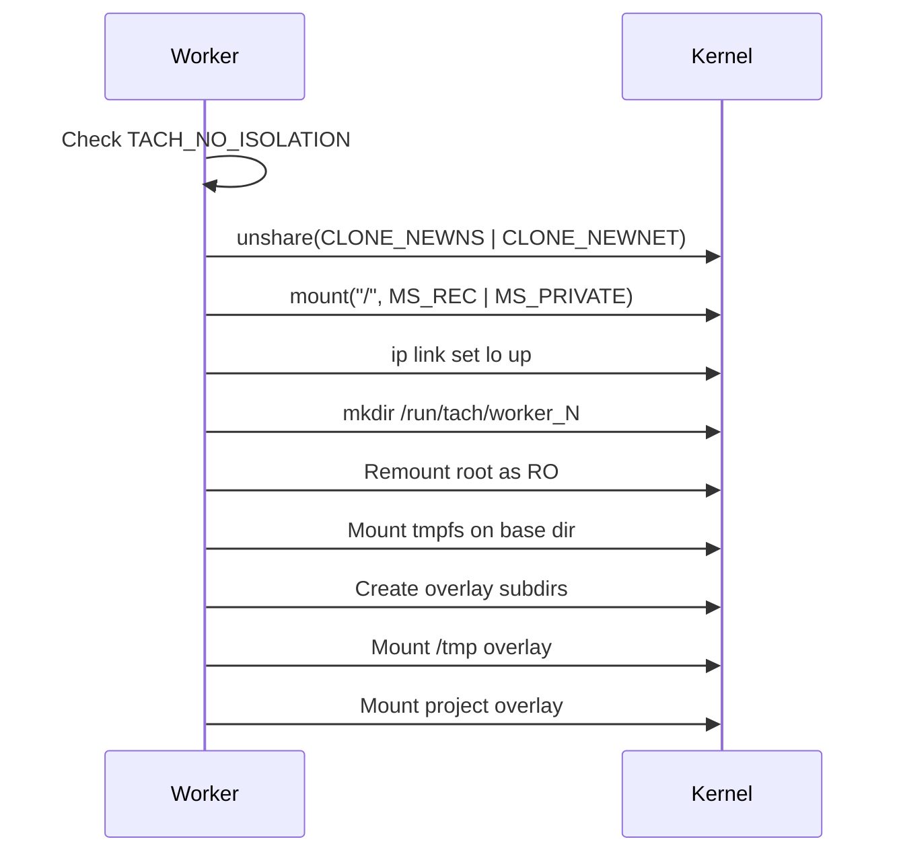

### Implementation (Key Steps)

```rust
pub fn setup_filesystem(worker_id: u32, project_root: &Path) -> Result<()> {
    if std::env::var("TACH_NO_ISOLATION").unwrap_or_default() == "1" {
        return Ok(());
    }

    // 1. Create namespaces
    unshare(CloneFlags::CLONE_NEWNS | CloneFlags::CLONE_NEWNET)?;

    // 2. Privatize mounts
    mount::<str, str, str, str>(None, "/", None, MsFlags::MS_REC | MsFlags::MS_PRIVATE, None)?;

    // 3. Setup loopback
    setup_loopback()?;

    // 4. Create base dir (while root still writable)
    let base = PathBuf::from(format!("/run/tach/worker_{}", worker_id));
    fs::create_dir_all(&base)?;

    // 5. Lock root as read-only
    mount::<str, str, str, str>(Some("/"), "/", None, MsFlags::MS_BIND | MsFlags::MS_REC, None)?;
    mount::<str, str, str, str>(Some("/"), "/", None,
        MsFlags::MS_BIND | MsFlags::MS_REMOUNT | MsFlags::MS_RDONLY | MsFlags::MS_REC, None)?;

    // 6. Mount tmpfs
    mount::<str, PathBuf, str, str>(Some("tmpfs"), &base, Some("tmpfs"),
        MsFlags::empty(), Some("size=100M,mode=0755"))?;

    // 7. Create overlay subdirs and mount overlays
    // ... (tmp_upper, tmp_work, proj_upper, proj_work)
    // ... mount overlay on /tmp and project_root

    Ok(())
}
```

### Mount Flags

| Flag         | Purpose                            |
| :----------- | :--------------------------------- |
| `MS_REC`     | Apply recursively to all submounts |
| `MS_PRIVATE` | Disable mount propagation          |
| `MS_BIND`    | Create bind mount                  |
| `MS_REMOUNT` | Change flags on existing mount     |
| `MS_RDONLY`  | Make mount read-only               |

---

## OverlayFS Structure

OverlayFS provides copy-on-write semantics, allowing workers to appear to modify files while writing to a separate location.

```mermaid
flowchart TB
    Lower["lowerdir (read-only source)"]
    Upper["upperdir (writes captured)"]
    Work["workdir (internal)"]
    Merged["merged view (visible to worker)"]

    Lower -->|"provides base"| Merged
    Upper -->|"overlays mods"| Merged
    Work -.->|"atomic ops"| Upper
```

### Overlay Configurations

| Mount Point    | lowerdir         | upperdir                        | workdir                        |
| :------------- | :--------------- | :------------------------------ | :----------------------------- |
| `/tmp`         | `/tmp` (host)    | `/run/tach/worker_N/tmp_upper`  | `/run/tach/worker_N/tmp_work`  |
| `project_root` | `{project_root}` | `/run/tach/worker_N/proj_upper` | `/run/tach/worker_N/proj_work` |

---

## Worker Base Directory Structure

Each worker gets dedicated scratch space under `/run/tach/`:

```
/run/tach/
  worker_0/
    tmp_upper/     # /tmp writes
    tmp_work/      # OverlayFS workdir
    proj_upper/    # Project writes
    proj_work/     # OverlayFS workdir
  worker_1/
    ...
```

**Path Format:** `/run/tach/worker_{worker_id}` (worker_id is u32)

**tmpfs Config:** `size=100M,mode=0755` - prevents disk exhaustion, auto-freed on exit.

---

## Helper Functions API

Pure functions testable without root privileges.

### worker_base_dir

```rust
#[inline]
pub fn worker_base_dir(worker_id: u32) -> PathBuf {
    PathBuf::from(format!("/run/tach/worker_{}", worker_id))
}
```

### tmp_overlay_options / project_overlay_options

```rust
pub fn tmp_overlay_options(base: &Path) -> String {
    format!("lowerdir=/tmp,upperdir={}/tmp_upper,workdir={}/tmp_work",
        base.display(), base.display())
}

pub fn project_overlay_options(base: &Path, project_root: &Path) -> String {
    format!("lowerdir={},upperdir={}/proj_upper,workdir={}/proj_work",
        project_root.display(), base.display(), base.display())
}
```

### is_isolation_disabled

```rust
pub fn is_isolation_disabled() -> bool {
    std::env::var("TACH_NO_ISOLATION").unwrap_or_default() == "1"
}
```

| TACH_NO_ISOLATION | Returns |
| :---------------- | :------ |
| `"1"`             | `true`  |
| Any other value   | `false` |

---

## TACH_NO_ISOLATION Bypass

Skip all isolation for benchmarking, debugging, or CI without privileges.

```bash
TACH_NO_ISOLATION=1 ./tach-core .
```

### Security Implications

| Protection           | With Isolation             | Without Isolation         |
| :------------------- | :------------------------- | :------------------------ |
| Filesystem isolation | Workers isolated           | Workers share filesystem  |
| Network isolation    | Private network per worker | Shared network stack      |
| Write containment    | Writes to tmpfs            | Writes to real filesystem |
| Host protection      | Root read-only             | Root writable             |

```mermaid
flowchart LR
    subgraph Isolated["TACH_NO_ISOLATION=0"]
        I1["Worker"] -->|"writes"| T1["tmpfs"]
        I1 x--x|"blocked"| Host1["Host FS"]
    end

    subgraph NotIsolated["TACH_NO_ISOLATION=1"]
        N1["Worker"] -->|"writes"| Host2["Host FS"]
    end
```

---

## Security Properties

| Property             | Mechanism                   | Description                            |
| :------------------- | :-------------------------- | :------------------------------------- |
| Filesystem isolation | Mount namespace + OverlayFS | Workers can't see each other's changes |
| Network isolation    | Network namespace           | Each worker has own network stack      |
| Write containment    | tmpfs + OverlayFS           | All writes to memory-backed storage    |
| Host protection      | Root remounted read-only    | Workers can't modify system files      |
| Automatic cleanup    | tmpfs freed on exit         | No persistent state left behind        |
| Resource limits      | tmpfs size=100M             | Workers can't exhaust host memory      |

### Iron Dome Integration

Isolation works with Landlock and Seccomp for defense in depth:

```mermaid
flowchart TB
    subgraph IronDome["IRON DOME"]
        L1["Layer 1: Namespaces<br/>Mount + Network isolation"]
        L2["Layer 2: OverlayFS<br/>CoW + RO root"]
        L3["Layer 3: Landlock<br/>Kernel-level ACL"]
        L4["Layer 4: Seccomp<br/>Syscall filtering"]
    end

    L1 --> L2 --> L3 --> L4
```

| Layer           | Protection                  | Failure Mode            |
| :-------------- | :-------------------------- | :---------------------- |
| Mount namespace | Can't see host mounts       | Other layers protect    |
| OverlayFS       | Writes to tmpfs             | Landlock blocks paths   |
| Landlock        | Kernel-level access control | Seccomp blocks syscalls |
| Seccomp         | Syscall filtering           | Process termination     |

---

## Unit Tests

The isolation module includes unit tests verifiable without root privileges.

### Test Categories

| Category              | Description                              |
| :-------------------- | :--------------------------------------- |
| Worker Base Directory | Path format, large IDs, absolute paths   |
| Overlay Options       | Format validation, no spaces, uniqueness |
| TACH_NO_ISOLATION     | Environment variable behavior            |
| Path Components       | Subdirectory consistency                 |

### Running Tests

```bash
cargo test --lib isolation::namespace
cargo test --lib isolation::namespace -- --nocapture
```

---

## Related Documentation

- [Iron Dome (Sandbox)](sandbox.md) - Landlock and Seccomp security layers
- [Zygote Lifecycle](zygote.md) - When isolation is applied during worker spawning
- [Configuration](../configuration.md) - `--no-isolation` CLI flag
- [README](../../README.md) - Project architecture overview


---


# Zero-Copy Loader

The Zero-Copy Loader bypasses Python's `importlib` for instant module loading.

---

## Overview

Traditional Python imports involve:

1. Scanning `sys.path` for the module
2. Reading the `.py` file from disk
3. Compiling to bytecode (or reading cached `.pyc`)
4. Executing the module code

Tach eliminates steps 1-3 by pre-compiling all modules and injecting bytecode directly via the C-API.

```mermaid
flowchart LR
    subgraph Traditional["TRADITIONAL IMPORT"]
        T1["sys.path scan"] --> T2["Read .py"]
        T2 --> T3["Compile to .pyc"]
        T3 --> T4["Execute"]
    end

    subgraph Tach["TACH LOADER"]
        Z1["get_module()"] --> Z2["PyMarshal"]
        Z2 --> Z3["Execute"]
    end
```

---

## Data Structures

### BytecodeEntry

Represents a single compiled module in the registry.

```rust
pub struct BytecodeEntry {
    pub name: String,
    pub source_path: PathBuf,
    pub bytecode: Vec<u8>,
    pub is_package: bool,
}
```

| Field         | Description                                   |
| :------------ | :-------------------------------------------- |
| `name`        | Fully qualified module name (e.g., `foo.bar`) |
| `source_path` | Absolute path to the original `.py` file      |
| `bytecode`    | Raw bytecode with 16-byte header removed      |
| `is_package`  | True if this was an `__init__.py` file        |

### ModuleRegistry

Thread-safe storage for compiled modules.

```rust
pub struct ModuleRegistry {
    entries: DashMap<String, BytecodeEntry>,
    project_root: PathBuf,
}
```

Uses `DashMap` for concurrent access from multiple worker threads.

### BytecodeCompiler

Handles eager compilation of Python source to bytecode.

```rust
pub struct BytecodeCompiler {
    cache_dir: PathBuf,
    project_root: PathBuf,
    python_exe: PathBuf,
    expected_magic: Option<[u8; 4]>,
}
```

---

## Compilation Pipeline

```mermaid
flowchart TB
    subgraph Discovery["DISCOVERY PHASE"]
        Scan["Scan .py files"]
        Batch["compile_batch()"]
    end

    subgraph Staleness["STALENESS CHECK"]
        Mtime["Compare mtime"]
        Magic["Validate magic number"]
    end

    subgraph Compile["COMPILATION"]
        PyCompile["py_compile.compile()"]
        StripHeader["Strip 16-byte header"]
        Store["Store in REGISTRY"]
    end

    Scan --> Batch --> Mtime
    Mtime -->|Stale| Magic
    Mtime -->|Fresh| Magic
    Magic -->|Invalid| PyCompile
    Magic -->|Valid| Store
    PyCompile --> StripHeader --> Store
```

### Staleness Check

```rust
fn is_cache_stale(source: &Path, cache: &Path) -> bool {
    let source_mtime = source.metadata()?.modified()?;
    let cache_mtime = cache.metadata()?.modified()?;
    source_mtime > cache_mtime
}
```

### Magic Number Validation

Python bytecode files start with a 4-byte magic number that identifies the Python version. If the magic number doesn't match the current interpreter, the cache is invalid.

```rust
fn validate_magic(cache: &Path, expected: [u8; 4]) -> bool {
    let mut file = File::open(cache)?;
    let mut magic = [0u8; 4];
    file.read_exact(&mut magic)?;
    magic == expected
}
```

### Header Stripping

Python 3.7+ `.pyc` files have a 16-byte header (PEP 552):

| Bytes | Content                                   |
| :---- | :---------------------------------------- |
| 0-3   | Magic number                              |
| 4-7   | Bit field (hash-based invalidation flags) |
| 8-11  | Timestamp                                 |
| 12-15 | Source size                               |

Tach strips this header before storing bytecode.

---

## Cache Structure

Bytecode is cached in `.tach/cache/` with flattened filenames:

```
.tach/cache/
  src_utils.py.pyc
  src_models_user.py.pyc
  tests_test_auth.py.pyc
```

Path separators are replaced with underscores to avoid deep directory structures.

---

## Python Import Hook

The import hook is implemented in `tach_harness.py`:

### TachMetaPathFinder

Installed at `sys.meta_path[0]` for maximum priority.

```python
class TachMetaPathFinder:
    def find_spec(self, fullname, path, target=None):
        bytecode = tach_rust.get_module(fullname)
        if bytecode is None:
            return None

        origin = tach_rust.get_module_path(fullname)
        is_package = tach_rust.is_module_package(fullname)

        return ModuleSpec(
            fullname,
            TachLoader(bytecode, origin),
            origin=origin,
            is_package=is_package,
        )
```

### TachLoader

Executes the bytecode via FFI.

```python
class TachLoader:
    def __init__(self, bytecode, origin):
        self.bytecode = bytecode
        self.origin = origin

    def exec_module(self, module):
        tach_rust.load_module(
            module.__name__,
            self.origin,
            self.bytecode,
        )
```

---

## FFI Functions

### get_module

Returns bytecode from the registry.

```rust
#[pyfunction]
fn get_module(name: &str) -> Option<Vec<u8>>
```

### get_module_path

Returns the source path for `__file__`.

```rust
#[pyfunction]
fn get_module_path(name: &str) -> Option<String>
```

### is_module_package

Checks if the module is a package.

```rust
#[pyfunction]
fn is_module_package(name: &str) -> Option<bool>
```

### load_module

Injects bytecode into Python.

```rust
#[pyfunction]
fn load_module(
    py: Python,
    name: &str,
    source_path: &str,
    bytecode: &[u8],
) -> PyResult<bool>
```

Implementation:

1. `PyMarshal_ReadObjectFromString` - Deserialize bytecode to code object
2. `PyImport_ExecCodeModuleObject` - Execute and register in `sys.modules`
3. `patch_module_namespace` - Set `__file__`, `__package__`, `__path__`

---

## Namespace Patching

After loading, the module namespace is patched:

```rust
fn patch_module_namespace(module: &PyModule, entry: &BytecodeEntry) {
    module.setattr("__file__", entry.source_path.to_str())?;
    module.setattr("__package__", parent_package(&entry.name))?;

    if entry.is_package {
        let path = entry.source_path.parent();
        module.setattr("__path__", vec![path.to_str()])?;
    }
}
```

---

## Performance Characteristics

| Metric                   | Cold Cache  | Warm Cache       |
| :----------------------- | :---------- | :--------------- |
| Compilation (91 modules) | 9.7 seconds | 345 milliseconds |
| Speedup Factor           | 1x          | **28x**          |

### Why It's Fast

1. **No filesystem traversal**: Module location is known
2. **No disk I/O**: Bytecode pre-loaded in RAM
3. **No repeated compilation**: Cached once
4. **Sub-millisecond materialization**: Direct memory injection

---

## Global Caching

To prevent redundant work during parallel startup:

```rust
static CACHED_PYTHON_EXE: OnceLock<PathBuf> = OnceLock::new();
static CACHED_MAGIC: OnceLock<[u8; 4]> = OnceLock::new();
```

---

## Limitations

1. **Namespace Packages**: Directories without `__init__.py` fall back to standard `importlib`
2. **Dynamic Imports**: `__import__()` and `importlib.import_module()` bypass the hook
3. **C Extensions**: `.so`/`.pyd` files are not handled by the loader

---

## Security: Dangling Pointer Prevention

When passing C-style strings to the Python C-API, improper `CString` usage can lead to **use-after-free vulnerabilities**.

### The Dangerous Pattern (BAD)

```rust
// BAD - CString is dropped immediately, pointer dangles!
let file_val = ffi::PyUnicode_FromString(
    std::ffi::CString::new(source_path).unwrap().as_ptr()
);
```

The temporary `CString` is dropped after `.as_ptr()` returns, leaving a dangling pointer that `PyUnicode_FromString` reads from - undefined behavior.

### The Safe Pattern (GOOD)

```rust
// GOOD - CString lives long enough for the pointer to be used
let source_path_cstr = std::ffi::CString::new(source_path).unwrap();
let file_val = ffi::PyUnicode_FromString(source_path_cstr.as_ptr());
// source_path_cstr is still alive here, pointer is valid
```

Storing the `CString` in a named variable keeps it alive until scope end, ensuring the pointer remains valid during the C-API call.

```mermaid
sequenceDiagram
    participant Code as Rust Code
    participant CString as CString (named variable)
    participant Memory as Heap Memory
    participant Python as Python C-API

    Code->>CString: let cstr = CString::new(source_path)
    CString->>Memory: Allocate buffer for "path/to/file.py\0"
    Code->>CString: cstr.as_ptr()
    CString-->>Code: Return raw pointer 0x7fff1234
    Note over CString: CString still alive!
    Code->>Python: PyUnicode_FromString(0x7fff1234)
    Python->>Memory: Read from 0x7fff1234
    Note over Memory: Memory valid, read succeeds
    Python-->>Code: Return PyObject*
    Note over CString: CString dropped at scope end
    CString->>Memory: Deallocate buffer (safe now)
```

### Implementation in Tach

The `patch_module_namespace` and `load_module` functions in `src/discovery/loader.rs` demonstrate this pattern. Each `CString` is stored in a named variable with a `// SAFETY:` comment explaining why the pointer usage is safe.

### Consequences of Use-After-Free

| Scenario                   | Consequence                                       |
| :------------------------- | :------------------------------------------------ |
| Memory reused by allocator | Corrupted module path, wrong `__file__` attribute |
| Memory zeroed by allocator | Empty string or null pointer dereference crash    |
| Memory reused by Python    | Arbitrary string as module path (security risk)   |
| Memory page unmapped       | Segmentation fault (SIGSEGV)                      |
| Intermittent failures      | Heisenbugs that only appear under memory pressure |

### Key Takeaways

1. **Never chain `.as_ptr()` on a temporary `CString`** - always store it in a named variable first
2. **The `CString` must outlive all uses of the pointer** - keep it alive until after the C function returns
3. **Add `// SAFETY:` comments** explaining why the pointer usage is safe
4. **This pattern applies to all FFI string passing** - not just Python C-API

---

## Zero-Copy Bytecode Loading Architecture

The loader implements a zero-copy architecture that minimizes memory allocations and data movement during module loading.

### Memory Flow

```mermaid
flowchart TB
    subgraph Discovery["DISCOVERY PHASE (Eager)"]
        Source[".py Source Files"]
        Compile["py_compile.compile()"]
        Strip["Strip 16-byte Header"]
        Registry["ModuleRegistry<br/>(DashMap)"]
    end

    subgraph Worker["WORKER PHASE (On-Demand)"]
        Request["get_module(name)"]
        Bytecode["Raw Bytecode<br/>(Vec<u8>)"]
        Marshal["PyMarshal_ReadObjectFromString"]
        CodeObj["PyCodeObject*"]
        Exec["PyImport_ExecCodeModuleObject"]
        SysModules["sys.modules[name]"]
    end

    Source --> Compile --> Strip --> Registry
    Registry --> Request --> Bytecode --> Marshal --> CodeObj --> Exec --> SysModules
```

### Key Design Decisions

#### 1. Header Stripping at Compile Time

The 16-byte `.pyc` header is stripped during compilation, not at load time:

```rust
fn read_and_strip_header(&self, pyc_path: &Path) -> Result<Vec<u8>> {
    let data = fs::read(pyc_path)?;

    if data.len() < PYC_HEADER_SIZE {
        return Err(anyhow!("Invalid .pyc file (too short)"));
    }

    // Return bytes after header - this is the only copy
    Ok(data[PYC_HEADER_SIZE..].to_vec())
}
```

**Rationale:** The header is only needed for cache validation. By stripping it once during compilation, we avoid repeated slicing operations during the hot path.

#### 2. Direct Pointer Passing to C-API

Bytecode is passed directly to `PyMarshal_ReadObjectFromString` without intermediate copies:

```rust
let code_obj = ffi::PyMarshal_ReadObjectFromString(
    bytecode.as_ptr() as *const i8,  // Direct pointer to Vec<u8> buffer
    bytecode.len() as isize,
);
```

**Rationale:** The `Vec<u8>` buffer is passed by pointer, not copied. Python's marshal module reads directly from our Rust-owned memory.

#### 3. DashMap for Lock-Free Reads

The registry uses `DashMap` instead of `RwLock<HashMap>`:

```rust
pub struct ModuleRegistry {
    entries: DashMap<String, BytecodeEntry>,
    project_root: PathBuf,
}
```

**Rationale:** `DashMap` provides lock-free reads for concurrent worker access. Multiple workers can request different modules simultaneously without contention.

#### 4. Global Caching to Prevent Subprocess Spawning

Python path and magic number are cached globally:

```rust
static CACHED_PYTHON_EXE: OnceLock<PathBuf> = OnceLock::new();
static CACHED_MAGIC: OnceLock<[u8; 4]> = OnceLock::new();
```

**Rationale:** Without caching, each `BytecodeCompiler::new()` call would spawn Python subprocesses to get the magic number. During parallel test execution, this could spawn hundreds of processes, causing OOM.

### Memory Ownership Model

```mermaid
flowchart LR
    subgraph Rust["RUST OWNERSHIP"]
        Registry["ModuleRegistry"]
        Entry["BytecodeEntry"]
        Bytecode["Vec<u8>"]
    end

    subgraph Python["PYTHON OWNERSHIP"]
        CodeObj["PyCodeObject"]
        Module["PyModuleObject"]
        SysModules["sys.modules"]
    end

    Registry --> Entry --> Bytecode
    Bytecode -.->|"PyMarshal (reads)"| CodeObj
    CodeObj -.->|"PyImport (consumes)"| Module
    Module --> SysModules

    style Bytecode fill:#e1f5fe
    style CodeObj fill:#fff3e0
```

| Component          | Owner                   | Lifetime                   |
| :----------------- | :---------------------- | :------------------------- |
| `BytecodeEntry`    | Rust (`ModuleRegistry`) | Process lifetime           |
| `Vec<u8>` bytecode | Rust (`BytecodeEntry`)  | Process lifetime           |
| `PyCodeObject*`    | Python (new reference)  | Must `Py_DECREF` after use |
| `PyModuleObject*`  | Python (`sys.modules`)  | Until module unloaded      |

### Reference Counting in load_module

The `load_module` function carefully manages Python reference counts:

```rust
unsafe {
    // PyMarshal returns NEW reference - we own it
    let code_obj = ffi::PyMarshal_ReadObjectFromString(...);

    // PyUnicode_FromString returns NEW reference - we own it
    let name_obj = ffi::PyUnicode_FromString(name_cstr.as_ptr());
    let path_obj = ffi::PyUnicode_FromString(path_cstr.as_ptr());

    // PyImport does NOT steal references - we still own them
    let module = ffi::PyImport_ExecCodeModuleObject(
        name_obj,
        code_obj,
        path_obj,
        std::ptr::null_mut(),
    );

    // Clean up all references we created
    ffi::Py_DECREF(code_obj);
    ffi::Py_DECREF(name_obj);
    ffi::Py_DECREF(path_obj);

    // Module is in sys.modules, we can release our reference
    ffi::Py_DECREF(module);
}
```

**Critical:** If any step fails, we must `Py_DECREF` all previously created objects to avoid memory leaks.

---

## Related Documentation

- [Discovery Engine](discovery.md) - How modules are found
- [Zygote Lifecycle](zygote.md) - How the loader is initialized

---

## Research References

This implementation is informed by the following research papers (see `docs/pdfs/txt/` for full text):

| Paper                                        | Key Contribution                                                     |
| :------------------------------------------- | :------------------------------------------------------------------- |
| **Zero-Copy Python Module Loading**          | `sys.meta_path` bypass, `mmap` of `.pyc` artifacts, header stripping |
| **Python Testing Engine Rust Breakthroughs** | Content-addressable logic, eliminating the "Import Tax"              |

### Key Technical Details from Research

- **Stat Storm Elimination**: Traditional `importlib` performs ~10 stat calls per import - bypassing it eliminates this overhead
- **16-Byte Header**: `.pyc` files have a 16-byte header (magic + timestamp + size) that must be stripped before `PyMarshal_ReadObjectFromString`
- **mmap Workflow**: `mmap(pyc_file)` -> skip 16 bytes -> `PyMarshal_ReadObjectFromString` -> `PyImport_ExecCodeModuleObject`
- **Relative Import Hazard**: Must manually set `__package__` and `__path__` attributes or relative imports will fail
- **sys.modules Injection**: Use `PyImport_ExecCodeModuleObject` (preferred over `PyImport_ExecCodeModule`) for full control over module attributes

See [Research Investigation](../research-investigation.md) for complete analysis.


---


# Architecture Overview

This document provides a high-level view of Tach's architecture and how its components interact.

---

## System Architecture

Tach operates as a three-tier system: **Supervisor**, **Zygote**, and **Workers**.

```mermaid
flowchart TB
    subgraph Tier1["TIER 1: RUST SUPERVISOR"]
        direction TB
        CLI["CLI Entry Point<br/>(main.rs)"]
        Config["Configuration<br/>(config.rs)"]
        Discovery["Discovery Engine<br/>(discovery.rs)"]
        Toxicity["Toxicity Analyzer<br/>(analysis.rs, graph.rs)"]
        Loader["Bytecode Compiler<br/>(loader.rs)"]
        Resolver["Fixture Resolver<br/>(resolver.rs)"]
        Scheduler["Test Scheduler<br/>(scheduler.rs)"]
        Snapshot["Snapshot Manager<br/>(snapshot.rs)"]
        Coverage["Coverage Aggregator<br/>(coverage.rs)"]
        Reporter["Reporter System<br/>(reporter.rs)"]
    end

    subgraph Tier2["TIER 2: ZYGOTE PROCESS"]
        direction TB
        ZygoteInit["Python Initialization"]
        ZygoteWarm["Warm-up (pytest, Django)"]
        ZygotePool["Worker Pool Management"]
        ZygoteFork["Fork/Dispatch"]
    end

    subgraph Tier3["TIER 3: WORKER PROCESSES"]
        direction TB
        WorkerSandbox["Iron Dome (Sandbox)"]
        WorkerIsolation["Namespace Isolation"]
        WorkerHarness["Test Harness"]
        WorkerExec["Test Execution"]
        WorkerReset["Memory Reset"]
    end

    CLI --> Config --> Discovery
    Discovery --> Toxicity --> Resolver --> Scheduler
    Loader --> ZygoteInit
    Scheduler <--> ZygoteFork
    ZygoteInit --> ZygoteWarm --> ZygotePool --> ZygoteFork
    ZygoteFork --> WorkerSandbox --> WorkerIsolation --> WorkerHarness
    WorkerHarness --> WorkerExec --> WorkerReset
    WorkerReset --> ZygotePool
    Snapshot <--> WorkerReset
    WorkerExec --> Coverage
    Coverage --> Reporter
```

---

## Component Responsibilities

### Tier 1: Rust Supervisor

| Component     | File                                          | Responsibility                                        |
| :------------ | :-------------------------------------------- | :---------------------------------------------------- |
| **CLI**       | `main.rs`                                     | Parse arguments, orchestrate execution                |
| **Config**    | `core/config.rs`                              | Load pyproject.toml, merge CLI/env/file settings      |
| **Discovery** | `discovery/scanner.rs`                        | AST-based test discovery using rustpython-parser      |
| **Toxicity**  | `discovery/analysis.rs`, `discovery/graph.rs` | Detect unsafe modules, propagate via dependency graph |
| **Loader**    | `discovery/loader.rs`                         | Compile .py to .pyc, manage bytecode cache            |
| **Resolver**  | `discovery/resolver.rs`                       | Resolve fixture dependencies, topological sort        |
| **Scheduler** | `execution/scheduler.rs`                      | Dispatch tests to workers, manage queues              |
| **Snapshot**  | `isolation/snapshot.rs`                       | userfaultfd registration, page fault handling         |
| **Coverage**  | `reporting/coverage.rs`                       | Ring buffer management, aggregation thread            |
| **Reporter**  | `reporting/reporter.rs`                       | Progress bar, dots, JSON output                       |

### Tier 2: Zygote Process

The Zygote is a long-lived Python process that:

1. **Initializes Python** with all imports pre-loaded
2. **Warms up frameworks** (pytest, Django)
3. **Manages the worker pool** for safe test reuse
4. **Forks workers** on demand from the Supervisor

### Tier 3: Worker Processes

Workers are short-lived (toxic) or long-lived (safe) processes that:

1. **Apply security sandbox** (Landlock + Seccomp)
2. **Enter namespace isolation** (Mount + Network)
3. **Execute tests** via the Python harness
4. **Reset memory** or exit based on toxicity

---

## Data Flow

```mermaid
sequenceDiagram
    participant CLI as CLI
    participant Disc as Discovery
    participant Tox as Toxicity
    participant Sched as Scheduler
    participant Zyg as Zygote
    participant Work as Worker
    participant Snap as Snapshot
    participant Cov as Coverage
    participant Rep as Reporter

    CLI->>Disc: discover(path)
    Disc->>Tox: analyze_all()
    Tox->>Tox: propagate()
    Tox->>Sched: RunnableTest[]

    loop For each test
        Sched->>Zyg: CMD_FORK + TestPayload
        Zyg->>Work: fork()
        Work->>Work: apply_iron_dome()
        Work->>Snap: init_snapshot_mode()
        Snap->>Snap: capture_golden()
        Work->>Work: run_test()
        Work->>Cov: record_line()
        Work->>Zyg: TestResult
        Zyg->>Sched: TestResult

        alt Safe Test
            Work->>Snap: reset_memory()
            Snap->>Work: restore_pages()
        else Toxic Test
            Work->>Work: exit(0)
            Zyg->>Work: spawn_replacement()
        end
    end

    Sched->>Rep: report_results()
    Cov->>Rep: coverage_data()
```

---

## Memory Architecture

```mermaid
flowchart LR
    subgraph Supervisor["SUPERVISOR MEMORY"]
        GoldenPages["Golden Pages<br/>HashMap<addr, Vec<u8>>"]
        CovBuffer["Coverage Buffer<br/>(memfd, 4MB)"]
        MapBuffer["Mapping Buffer<br/>(memfd, 2MB)"]
    end

    subgraph Worker["WORKER MEMORY"]
        Heap["[heap]"]
        Stack["[stack]"]
        Anon["Anonymous Mappings"]
        Libpython["libpython.so<br/>(data/bss)"]
    end

    subgraph Kernel["KERNEL"]
        UFFD["userfaultfd"]
        PageTable["Page Tables"]
    end

    Worker -->|process_vm_readv| GoldenPages
    UFFD -->|UFFDIO_COPY| Worker
    Worker -->|madvise MADV_DONTNEED| PageTable
    PageTable -->|Page Fault| UFFD
    UFFD -->|Restore| GoldenPages
```

---

## IPC Architecture

```mermaid
flowchart TB
    subgraph Channels["IPC CHANNELS"]
        CmdSock["Command Socket<br/>(UnixStream)"]
        ResSock["Result Socket<br/>(UnixStream)"]
        WorkSock["Worker Socket<br/>(UnixStream::pair)"]
        UffdSock["UFFD Socket<br/>(SCM_RIGHTS)"]
    end

    subgraph Messages["MESSAGE TYPES"]
        CmdFork["CMD_FORK (0x01)"]
        CmdRun["CMD_RUN_TEST (0x02)"]
        CmdExit["CMD_EXIT (0x00)"]
        MsgReady["MSG_READY (0x42)"]
        MsgWorkerReady["MSG_WORKER_READY (0x43)"]
    end

    subgraph Payloads["PAYLOADS (bincode)"]
        TestPayload["TestPayload"]
        TestResult["TestResult"]
    end

    CmdSock --> CmdFork --> TestPayload
    CmdSock --> CmdRun --> TestPayload
    ResSock --> TestResult
    WorkSock --> MsgWorkerReady
    UffdSock --> |"FD + PID"| UFFD
```

---

## Security Layers

```mermaid
flowchart TB
    subgraph Layers["DEFENSE IN DEPTH"]
        L1["Layer 1: Process Isolation<br/>(fork + namespaces)"]
        L2["Layer 2: Filesystem Isolation<br/>(Landlock + OverlayFS)"]
        L3["Layer 3: Syscall Filtering<br/>(Seccomp-BPF)"]
        L4["Layer 4: Memory Isolation<br/>(userfaultfd reset)"]
    end

    L1 --> L2 --> L3 --> L4

    subgraph SafeWorker["SAFE WORKER"]
        S1["All 4 layers active"]
        S2["Can be reused"]
    end

    subgraph ToxicWorker["TOXIC WORKER"]
        T1["Layers 1, 2, 4 active"]
        T2["Seccomp skipped"]
        T3["Must exit after test"]
    end
```

---

## File Organization

See [README.md](../../README.md#project-structure) for complete source file organization.

---

## Key Design Decisions

| Decision              | Rationale                                             |
| :-------------------- | :---------------------------------------------------- |
| **Rust Supervisor**   | Zero-cost abstractions, memory safety, syscall access |
| **Python Zygote**     | Pay import tax once, share via fork                   |
| **userfaultfd**       | Sub-microsecond page restoration                      |
| **Jemalloc**          | Deterministic heap for snapshot consistency           |
| **Landlock**          | Kernel-level filesystem isolation (5.13+)             |
| **Seccomp**           | Syscall filtering without ptrace overhead             |
| **bincode**           | Fast binary serialization for IPC                     |
| **petgraph**          | Efficient dependency graph for toxicity               |
| **rustpython-parser** | Pure Rust AST parsing, no Python execution            |
| **memfd_create**      | Anonymous shared memory for coverage                  |

---

## Next Steps

- [Discovery Engine](discovery.md) - How tests are found
- [Zero-Copy Loader](loader.md) - How modules are loaded
- [Toxicity Analysis](toxicity.md) - How unsafe code is detected


---


# IPC Protocol

The IPC Protocol defines communication between Supervisor, Zygote, and Workers.

---

## Overview

Tach uses Unix domain sockets with binary serialization:

1. **bincode** for structured message serialization
2. **Length-prefixed framing** for message boundaries
3. **SCM_RIGHTS** for file descriptor passing

```mermaid
flowchart LR
    subgraph Supervisor["SUPERVISOR"]
        Sched["Scheduler"]
    end

    subgraph Zygote["ZYGOTE"]
        CmdLoop["Command Loop"]
        Pool["Worker Pool"]
    end

    subgraph Workers["WORKERS"]
        W1["Worker 1"]
        W2["Worker 2"]
    end

    Sched <-->|"CMD/Result"| CmdLoop
    CmdLoop <-->|"UnixStream::pair"| W1
    CmdLoop <-->|"UnixStream::pair"| W2
```

---

## Data Structures

### TestPayload

Sent from Supervisor to Worker to initiate a test.

```rust
#[derive(Debug, Clone, Serialize, Deserialize)]
pub struct TestPayload {
    pub test_id: u32,
    pub file_path: String,
    pub test_name: String,
    pub is_async: bool,
    pub fixtures: Vec<FixtureInfo>,
    pub log_fd: i32,
    pub debug_socket_path: String,
    pub is_toxic: bool,
    pub timeout_secs: Option<u64>,
}
```

| Field               | Description                               |
| :------------------ | :---------------------------------------- |
| `test_id`           | Unique identifier for result correlation  |
| `file_path`         | Path to test file                         |
| `test_name`         | Fully qualified test name (node ID)       |
| `is_async`          | Whether test is async                     |
| `fixtures`          | Required fixtures                         |
| `log_fd`            | File descriptor for stdout/stderr capture |
| `debug_socket_path` | Path for pdb tunneling                    |
| `is_toxic`          | Determines worker lifecycle               |
| `timeout_secs`      | Per-test timeout override (from marker)   |

### TestResult

Sent from Worker to Supervisor upon test completion.

```rust
#[derive(Debug, Clone, Serialize, Deserialize)]
pub struct TestResult {
    pub test_id: u32,
    pub status: u8,
    pub duration_ns: u64,
    pub message: String,
    pub memory_rss_bytes: Option<u64>,
}
```

### FixtureInfo

Metadata about required fixtures.

```rust
#[derive(Debug, Clone, Serialize, Deserialize)]
pub struct FixtureInfo {
    pub name: String,
    pub scope: String,
}
```

---

## Command Bytes

| Constant           | Value | Direction            | Purpose                     |
| :----------------- | :---- | :------------------- | :-------------------------- |
| `CMD_EXIT`         | 0x00  | Supervisor -> Zygote | Shutdown                    |
| `CMD_FORK`         | 0x01  | Supervisor -> Zygote | Spawn/dispatch test         |
| `CMD_RUN_TEST`     | 0x02  | Zygote -> Worker     | Run test on existing worker |
| `CMD_PING`         | 0x03  | Supervisor -> Worker | Health check ping           |
| `MSG_READY`        | 0x42  | Zygote -> Supervisor | Zygote initialized          |
| `MSG_WORKER_READY` | 0x43  | Worker -> Zygote     | Worker reset complete       |
| `MSG_PONG`         | 0x44  | Worker -> Supervisor | Health check response       |

---

## Status Codes

| Constant               | Value | Meaning                 |
| :--------------------- | :---- | :---------------------- |
| `STATUS_PASS`          | 0     | Test passed             |
| `STATUS_FAIL`          | 1     | Test failed (assertion) |
| `STATUS_SKIP`          | 2     | Test skipped            |
| `STATUS_CRASH`         | 3     | Worker crashed          |
| `STATUS_ERROR`         | 4     | Test error (exception)  |
| `STATUS_HARNESS_ERROR` | 5     | Harness error           |
| `STATUS_TIMEOUT`       | 6     | Test timed out          |

---

## Message Framing

All structured messages use an 8-byte header with magic bytes, version, and length:

```
+--------+---------+----------+--------+------------------+
| Magic  | Version | Reserved | Length | Payload          |
| 2 bytes| 1 byte  | 1 byte   | 4 bytes| (bincode)        |
| "TA"   | 0x01    | 0x00     | LE u32 |                  |
+--------+---------+----------+--------+------------------+

Total header size: 8 bytes (HEADER_SIZE constant)
```

### Encoding

```rust
/// Encode a struct to bincode bytes with protocol header
pub fn encode_with_length<T: serde::Serialize>(
    value: &T,
) -> Result<Vec<u8>, bincode::error::EncodeError> {
    let payload = bincode::serde::encode_to_vec(value, bincode::config::standard())?;
    let len = payload.len() as u32;
    let mut result = Vec::with_capacity(HEADER_SIZE + payload.len());
    result.extend_from_slice(&PROTOCOL_MAGIC);  // "TA"
    result.push(PROTOCOL_VERSION);              // 1
    result.push(0);                             // Reserved
    result.extend_from_slice(&len.to_le_bytes());
    result.extend_from_slice(&payload);
    Ok(result)
}
```

### Decoding

Decoding uses `decode_with_limit` which validates the protocol header before parsing:

```rust
// Read protocol header: magic(2) + version(1) + reserved(1) + length(4) = 8 bytes
let mut header_buf = [0u8; HEADER_SIZE];
reader.read_exact(&mut header_buf)?;

// Extract length from bytes 4-7 (little-endian u32)
let len = u32::from_le_bytes(header_buf[4..8].try_into().unwrap()) as usize;

// OOM protection: Validate size BEFORE allocating
if len > MAX_PAYLOAD_SIZE {
    return Err(ProtocolError::PayloadTooLarge);
}

// Allocate buffer for header + payload
let mut full_buf = vec![0u8; HEADER_SIZE + len];
full_buf[..HEADER_SIZE].copy_from_slice(&header_buf);
reader.read_exact(&mut full_buf[HEADER_SIZE..])?;

// Decode with header validation
let decoded: T = decode_with_limit(&full_buf, MAX_PAYLOAD_SIZE)?;
```

> **Note:** `decode_with_limit` validates magic bytes and protocol version before decoding.

---

## Message Size Limits

To prevent OOM attacks from malicious payloads, all IPC messages enforce size limits:

| Limit              | Value  | Purpose                            |
| ------------------ | ------ | ---------------------------------- |
| `MAX_PAYLOAD_SIZE` | 16 MiB | Maximum serialized message size    |
| Message truncation | 4 KiB  | Maximum error/output string length |

### Enforcement

Size validation occurs **before** memory allocation using `decode_with_limit`:

```rust
pub fn decode_with_limit<T: DeserializeOwned>(
    data: &[u8],
    max_size: usize,
) -> Result<T, DecodeWithLimitError> {
    // Validate minimum header size
    if data.len() < HEADER_SIZE {
        return Err(DecodeWithLimitError::InsufficientData { ... });
    }

    // Validate magic bytes
    if data[0..2] != PROTOCOL_MAGIC {
        return Err(DecodeWithLimitError::InvalidMagic);
    }

    // Validate protocol version
    if data[2] != PROTOCOL_VERSION {
        return Err(DecodeWithLimitError::VersionMismatch { ... });
    }

    // Extract length from bytes 4-7 (after magic, version, reserved)
    let claimed_len = u32::from_le_bytes(data[4..8].try_into()?) as usize;

    // Reject before allocating
    if claimed_len > max_size {
        return Err(DecodeWithLimitError::PayloadTooLarge { ... });
    }
    // ... proceed with decode
}
```

This prevents a malicious actor from sending a crafted length prefix (e.g., `0xFFFFFFFF`) to trigger a 4GB allocation.

> **Security Note:** The `decode_with_limit` function is used at all IPC boundaries where untrusted data is received (Supervisor ↔ Zygote, Zygote ↔ Worker).

---

## Socket Architecture

```mermaid
flowchart TB
    subgraph Channels["IPC CHANNELS"]
        CmdSock["Command Socket<br/>(Supervisor -> Zygote)"]
        ResSock["Result Socket<br/>(Zygote -> Supervisor)"]
        WorkSock["Worker Socket<br/>(Zygote <-> Worker)"]
        UffdSock["UFFD Socket<br/>(Worker -> Supervisor)"]
    end
```

### Supervisor <-> Zygote

Two separate sockets prevent head-of-line blocking:

```rust
let (cmd_sock, zygote_cmd) = UnixStream::pair()?;
let (res_sock, zygote_res) = UnixStream::pair()?;
```

### Zygote <-> Worker

Created at fork time:

```rust
let (parent_sock, child_sock) = UnixStream::pair()?;
match unsafe { fork() } {
    0 => {
        // Child uses child_sock
        drop(parent_sock);
    }
    pid => {
        // Parent uses parent_sock
        drop(child_sock);
    }
}
```

---

## SCM_RIGHTS (File Descriptor Passing)

Used to pass userfaultfd from Worker to Supervisor.

### Sending

```rust
pub fn send_fd(sock: &UnixStream, pid: i32, fd: RawFd) -> Result<()> {
    let pid_bytes = pid.to_le_bytes();
    let iov = [IoSlice::new(&pid_bytes)];
    let fds = [fd];
    let cmsg = [ControlMessage::ScmRights(&fds)];

    sendmsg::<()>(sock.as_raw_fd(), &iov, &cmsg, MsgFlags::empty(), None)?;
    Ok(())
}
```

### Receiving

```rust
pub fn recv_fd(sock: &UnixStream) -> Result<(i32, OwnedFd)> {
    let mut pid_buf = [0u8; 4];
    let mut iov = [IoSliceMut::new(&mut pid_buf)];
    let mut cmsg_buf = cmsg_space!([RawFd; 1]);

    let msg = recvmsg::<()>(
        sock.as_raw_fd(),
        &mut iov,
        Some(&mut cmsg_buf),
        MsgFlags::empty(),
    )?;

    let pid = i32::from_le_bytes(pid_buf);
    let fd = extract_fd_from_cmsg(&msg)?;
    Ok((pid, fd))
}
```

---

## Message Truncation

Result messages are truncated to prevent buffer overflow:

```rust
fn truncate_message(msg: String) -> String {
    const MAX_LEN: usize = 4096;
    if msg.len() > MAX_LEN {
        format!("{}... [truncated]", &msg[..MAX_LEN])
    } else {
        msg
    }
}
```

---

## Timeout Handling

The scheduler uses read timeouts for crash detection:

```rust
sock.set_read_timeout(Some(Duration::from_secs(5)))?;

// Read length-prefixed message with timeout
let mut len_buf = [0u8; 4];
match sock.read_exact(&mut len_buf) {
    Ok(_) => {
        let len = u32::from_le_bytes(len_buf) as usize;
        let mut payload = vec![0u8; len];
        sock.read_exact(&mut payload)?;
        let (result, _): (TestResult, usize) =
            bincode::serde::decode_from_slice(&payload, bincode::config::standard())?;
        handle_result(result);
    }
    Err(e) if e.kind() == ErrorKind::TimedOut => {
        mark_worker_crashed(worker_id);
    }
    Err(e) => return Err(e.into()),
}
```

---

## Protocol Flow

```mermaid
sequenceDiagram
    participant Sup as Supervisor
    participant Zyg as Zygote
    participant Work as Worker

    Sup->>Zyg: CMD_FORK + TestPayload
    Zyg->>Work: fork()
    Work->>Work: init_snapshot_mode()
    Work->>Sup: send_fd(uffd, pid)
    Sup->>Sup: capture_golden()
    Sup->>Work: SIGCONT
    Work->>Work: run_test()
    Work->>Zyg: TestResult
    Zyg->>Sup: TestResult

    alt Safe Test
        Work->>Work: reset_memory()
        Work->>Zyg: MSG_WORKER_READY
    else Toxic Test
        Work->>Work: exit(0)
    end
```

---

## Related Documentation

- [Scheduler](scheduler.md) - How messages are dispatched
- [Zygote Lifecycle](zygote.md) - Command loop implementation
- [Physics Engine](snapshot.md) - UFFD handshake details


---


# Reporter

The Reporter system provides adaptive output based on environment detection.

---

## Overview

Tach supports multiple output formats:

1. **ProgressReporter** - Interactive progress bar for terminals
2. **DotsReporter** - Simple dots for CI environments
3. **HumanReporter** - Simple human-readable text output
4. **JsonReporter** - NDJSON for IDE integration

```mermaid
flowchart TB
    subgraph Detection["ENVIRONMENT DETECTION"]
        TTY["stderr().is_terminal()?"]
        CI["CI env var?"]
    end

    subgraph Selection["REPORTER SELECTION"]
        Progress["ProgressReporter"]
        Dots["DotsReporter"]
        JSON["JsonReporter"]
        Human["HumanReporter"]
    end

    TTY -->|Yes| CI
    TTY -->|No| Dots
    CI -->|No| Progress
    CI -->|Yes| Dots
```

---

## Reporter Trait

```rust
pub trait Reporter {
    /// Called at start of test run
    fn on_run_start(&mut self, count: usize);

    /// Called when a test begins execution
    fn on_test_start(&mut self, id: &str, file: &str);

    /// Called when a test completes
    fn on_test_finished(&mut self, id: &str, status: &str, duration_ms: u64, message: Option<&str>);

    /// Called at end of test run
    fn on_run_finished(&mut self, passed: usize, failed: usize, skipped: usize, duration_ms: u64);

    /// Called on fatal error
    fn on_error(&mut self, message: &str);
}
```

### Status Strings

The reporter uses simple string literals for status values:

- `"pass"` - Test passed
- `"fail"` - Test failed
- `"skip"` - Test skipped

---

## HumanReporter

Simple human-readable output to stderr. Example:

```
[tach] Running 100 tests...
  test_foo.py::test_example ... PASS (12ms)
  test_foo.py::test_another ... FAIL (8ms)
[tach] 98 passed, 1 failed, 1 skipped in 2.50s
```

---

## ProgressReporter

Interactive progress bar using `indicatif`.

### Output Format

```
Running tests...
[=>          ] 45/100  P:40 F:3 S:2
```

### Implementation

```rust
/// Record of a test failure for summary display
struct FailureRecord {
    id: String,
    message: String,
}

pub struct ProgressReporter {
    bar: ProgressBar,
    passed: usize,
    failed: usize,
    skipped: usize,
    failures: Vec<FailureRecord>,
    total: usize,
}

impl ProgressReporter {
    pub fn new() -> Self {
        let bar = ProgressBar::new(0);
        bar.set_style(
            ProgressStyle::default_bar()
                .template(
                    "{spinner:.green} [{elapsed_precise}] [{bar:40.cyan/blue}] {pos}/{len} {msg}",
                )
                .unwrap_or_else(|_| ProgressStyle::default_bar())
                .progress_chars("=>-"),
        );

        Self {
            bar,
            passed: 0,
            failed: 0,
            skipped: 0,
            failures: Vec::new(),
            total: 0,
        }
    }

    /// Check if we should use progress bar (interactive terminal)
    pub fn should_use_progress_bar() -> bool {
        std::io::stderr().is_terminal() && std::env::var("CI").is_err()
    }
}
```

### Failure Buffering

Failures are buffered and displayed at the end:

```rust
fn on_run_finished(&mut self, passed: usize, failed: usize, skipped: usize, duration_ms: u64) {
    self.bar.finish_and_clear();

    // Print failure details
    if !self.failures.is_empty() {
        eprintln!("\n{} FAILURES {}", "=".repeat(30), "=".repeat(30));
        for failure in &self.failures {
            eprintln!("\n{}", failure.id);
            eprintln!("{}", "-".repeat(failure.id.len().min(70)));
            // Limit failure message to 20 lines
            for line in failure.message.lines().take(20) {
                eprintln!("{}", line);
            }
        }
        eprintln!("{}", "=".repeat(70));
    }

    // Print summary with colors
    let duration_secs = duration_ms as f64 / 1000.0;
    if failed > 0 {
        eprintln!(
            "\n\x1b[31m{} passed, {} failed, {} skipped in {:.2}s\x1b[0m",
            passed, failed, skipped, duration_secs
        );
    } else {
        eprintln!(
            "\n\x1b[32m{} passed, {} failed, {} skipped in {:.2}s\x1b[0m",
            passed, failed, skipped, duration_secs
        );
    }
}
```

---

## DotsReporter

Simple dots output for CI environments.

### Output Format

```
....F..s.....F.....
```

- `.` = passed
- `F` = failed
- `s` = skipped
- `?` = unknown status

### Implementation

```rust
pub struct DotsReporter {
    passed: usize,
    failed: usize,
    skipped: usize,
    failures: Vec<FailureRecord>,
    column: usize,
}

impl Reporter for DotsReporter {
    fn on_test_finished(
        &mut self,
        id: &str,
        status: &str,
        _duration_ms: u64,
        message: Option<&str>,
    ) {
        match status {
            "pass" => {
                self.passed += 1;
                self.print_char('.');
            }
            "fail" => {
                self.failed += 1;
                self.print_char('F');
                // Buffer failure for summary
                self.failures.push(FailureRecord {
                    id: id.to_string(),
                    message: message.unwrap_or("").to_string(),
                });
            }
            "skip" => {
                self.skipped += 1;
                self.print_char('s');
            }
            _ => {
                self.print_char('?');
            }
        }
    }
}
```

The DotsReporter wraps output at 80 columns for readability.

---

## JsonReporter

NDJSON output for IDE integration.

### Output Format

```json
{"event":"run_start","count":100}
{"event":"test_start","id":"test_example.py::test_foo","file":"test_example.py"}
{"event":"test_finished","id":"test_example.py::test_foo","status":"pass","duration_ms":12}
{"event":"run_finished","passed":98,"failed":1,"skipped":1,"duration_ms":2500}
```

### MachineEvent Enum

```rust
#[derive(Serialize)]
#[serde(tag = "event", rename_all = "snake_case")]
pub enum MachineEvent<'a> {
    RunStart { count: usize },
    TestStart { id: &'a str, file: &'a str },
    TestFinished {
        id: &'a str,
        status: &'a str,
        duration_ms: u64,
        #[serde(skip_serializing_if = "Option::is_none")]
        message: Option<&'a str>,
    },
    RunFinished {
        passed: usize,
        failed: usize,
        skipped: usize,
        duration_ms: u64,
    },
    Error { message: &'a str },
}
```

### Implementation

```rust
pub struct JsonReporter;

impl Reporter for JsonReporter {
    fn on_test_finished(
        &mut self,
        id: &str,
        status: &str,
        duration_ms: u64,
        message: Option<&str>,
    ) {
        let event = MachineEvent::TestFinished {
            id,
            status,
            duration_ms,
            message,
        };
        if let Ok(json) = serde_json::to_string(&event) {
            println!("{}", json);
        }
    }
}
```

### Stdout Purity

JsonReporter writes to **stdout** while other output goes to **stderr**, ensuring clean JSON parsing.

---

## MultiReporter

Broadcasts events to multiple reporters.

```rust
pub struct MultiReporter {
    reporters: Vec<Box<dyn Reporter>>,
}

impl MultiReporter {
    pub fn new(reporters: Vec<Box<dyn Reporter>>) -> Self {
        Self { reporters }
    }
}

impl Reporter for MultiReporter {
    fn on_test_finished(&mut self, id: &str, status: &str, duration_ms: u64, message: Option<&str>) {
        for reporter in &mut self.reporters {
            reporter.on_test_finished(id, status, duration_ms, message);
        }
    }
}
```

### Usage

```rust
let reporters: Vec<Box<dyn Reporter>> = vec![
    Box::new(ProgressReporter::new()),
    Box::new(JsonReporter),
];
let mut multi = MultiReporter::new(reporters);
```

---

## Environment Detection

```rust
pub fn should_use_progress_bar() -> bool {
    std::io::stderr().is_terminal() && std::env::var("CI").is_err()
}
```

| Condition       | Reporter         |
| :-------------- | :--------------- |
| TTY + no CI     | ProgressReporter |
| TTY + CI        | DotsReporter     |
| No TTY          | DotsReporter     |
| `--format json` | JsonReporter     |

---

## Color Output

The reporters use raw ANSI escape codes for terminal colors:

```rust
// Red for failures
eprintln!("\x1b[31m{} passed, {} failed, {} skipped\x1b[0m", passed, failed, skipped);

// Green for success
eprintln!("\x1b[32m{} passed, {} failed, {} skipped\x1b[0m", passed, failed, skipped);

// Cyan for informational messages
eprintln!("\x1b[36m(Saved {:.1}s of initialization overhead)\x1b[0m", saved_secs);
```

ANSI color codes used:

- `\x1b[31m` - Red (failures)
- `\x1b[32m` - Green (success)
- `\x1b[36m` - Cyan (info)
- `\x1b[0m` - Reset

---

## CLI Integration

```rust
// In main.rs
let reporters: Vec<Box<dyn Reporter>> = if cli.format == "json" {
    vec![Box::new(JsonReporter)]
} else if ProgressReporter::should_use_progress_bar() {
    vec![Box::new(ProgressReporter::new())]
} else {
    vec![Box::new(DotsReporter::new())]
};

let mut multi = MultiReporter::new(reporters);
scheduler.run(&mut multi)?;
```

---

## Related Documentation

- [Scheduler](scheduler.md) - How results are collected
- [Configuration](../configuration.md) - --format and --junit-xml flags


---


# Fixture Resolver

The Fixture Resolver discovers and resolves pytest fixture dependencies.

---

## Overview

Tach resolves fixtures statically via AST analysis, enabling:

1. **Dependency ordering** via topological sort
2. **Scope tracking** (function, class, module, session)
3. **conftest.py integration** for global fixtures

```mermaid
flowchart LR
    subgraph Discovery["DISCOVERY"]
        Scan["Scan files"]
        Parse["Parse fixtures"]
        Registry["FixtureRegistry"]
    end

    subgraph Resolution["RESOLUTION"]
        Test["Test dependencies"]
        Lookup["Lookup fixtures"]
        Topo["Topological sort"]
    end

    subgraph Output["OUTPUT"]
        Runnable["RunnableTest"]
        Fixtures["ResolvedFixture[]"]
    end

    Discovery --> Resolution --> Output
```

---

## Data Structures

### FixtureRegistry

Central repository for all discovered fixtures.

```rust
pub struct FixtureRegistry {
    pub global: HashMap<String, (FixtureDefinition, PathBuf)>,
    pub local: HashMap<PathBuf, HashMap<String, FixtureDefinition>>,
    pub class_scoped: HashMap<(PathBuf, String), HashMap<String, FixtureDefinition>>,
}
```

| Field          | Description                                          |
| :------------- | :--------------------------------------------------- |
| `global`       | Fixtures from `conftest.py` files (with source path) |
| `local`        | Module-level fixtures per file                       |
| `class_scoped` | Fixtures defined inside test classes                 |

### ResolvedFixture

A fixture that has been located and linked.

```rust
pub struct ResolvedFixture {
    pub name: String,
    pub source_file: PathBuf,
    pub scope: FixtureScope,
}
```

### RunnableTest

The final output with resolved fixtures.

```rust
pub struct RunnableTest {
    pub file_path: PathBuf,
    pub test_name: String,
    pub is_async: bool,
    pub is_toxic: bool,
    pub fixtures: Vec<ResolvedFixture>,  // Topologically sorted
}
```

### ResolutionError

```rust
pub enum ResolutionError {
    MissingFixture { test: String, fixture: String },
    CyclicDependency { test: String, cycle: Vec<String> },
}
```

---

## Resolution Algorithm

```mermaid
flowchart TB
    subgraph Lookup["LOOKUP ORDER"]
        Class["1. Class scope"]
        Local["2. Module scope"]
        Global["3. conftest.py"]
        Builtin["4. pytest builtins"]
    end

    subgraph Process["PROCESS"]
        Find["Find fixture"]
        Recurse["Resolve dependencies"]
        Add["Add to result"]
    end

    Class --> Local --> Global --> Builtin
    Find --> Recurse --> Add
```

### Lookup Priority

1. **Class scope**: Fixtures defined in the test class
2. **Module scope**: Fixtures in the same file
3. **Global scope**: Fixtures from `conftest.py`
4. **Builtins**: pytest-provided fixtures (skipped)

### Topological Sort

Fixtures are added in dependency order:

```rust
fn resolve_fixture(
    &mut self,
    name: &str,
    stack: &mut HashSet<String>,
    result: &mut Vec<ResolvedFixture>,
) -> Result<()> {
    // Cycle detection
    if stack.contains(name) {
        return Err(ResolutionError::CyclicDependency {
            cycle: stack.iter().cloned().collect(),
        });
    }

    // Skip if already resolved
    if result.iter().any(|f| f.name == name) {
        return Ok(());
    }

    // Skip builtins
    if PYTEST_BUILTINS.contains(&name) {
        return Ok(());
    }

    // Lookup fixture
    let fixture = self.lookup(name)?;

    // Resolve dependencies first (recursion)
    stack.insert(name.to_string());
    for dep in &fixture.dependencies {
        self.resolve_fixture(dep, stack, result)?;
    }
    stack.remove(name);

    // Add after dependencies (post-order)
    result.push(ResolvedFixture::from(fixture));
    Ok(())
}
```

---

## pytest Builtins

These fixtures are provided by pytest at runtime and skipped during static resolution:

```rust
const PYTEST_BUILTINS: &[&str] = &[
    // Monkey-patching and environment
    "monkeypatch",
    // Temporary directories
    "tmp_path",
    "tmp_path_factory",
    "tmpdir",
    "tmpdir_factory",
    // Output capture
    "capsys",
    "capfd",
    "capsysbinary",
    "capfdbinary",
    "caplog",
    // Fixture metadata
    "request",
    // Caching
    "cache",
    // Recording
    "record_property",
    "record_testsuite_property",
    "record_xml_attribute",
    // Doctest
    "doctest_namespace",
    // Recwarn
    "recwarn",
    // Pytestconfig
    "pytestconfig",
];
```

---

## conftest.py Handling

Fixtures in `conftest.py` are automatically global:

```rust
fn register_fixtures(&mut self, module: &TestModule) {
    let is_conftest = module.path.file_name() == Some("conftest.py".as_ref());

    for fixture in &module.fixtures {
        if is_conftest {
            self.global.insert(fixture.name.clone(), fixture.clone());
        } else {
            self.local
                .entry(module.path.clone())
                .or_default()
                .insert(fixture.name.clone(), fixture.clone());
        }
    }
}
```

### Shadowing

Local fixtures shadow global fixtures:

```python
# conftest.py
@pytest.fixture
def db():
    return global_db()

# test_module.py
@pytest.fixture
def db():
    return local_db()  # This one is used

def test_something(db):
    pass  # Gets local_db()
```

---

## Parametrization Filtering

Arguments from `@pytest.mark.parametrize` are not fixtures:

```python
@pytest.mark.parametrize("x, y", [(1, 2), (3, 4)])
def test_add(x, y, some_fixture):
    pass
```

Here:

- `x`, `y` are parametrized args (not resolved)
- `some_fixture` is a fixture dependency (resolved)

```rust
fn get_fixture_dependencies(test: &TestCase) -> Vec<String> {
    test.dependencies
        .iter()
        .filter(|dep| !test.parametrized_args.contains(dep))
        .cloned()
        .collect()
}
```

---

## Class-Scoped Fixtures

Fixtures defined inside test classes:

```python
class TestUser:
    @pytest.fixture
    def user(self):
        return User(name="test")

    def test_name(self, user):
        assert user.name == "test"
```

```rust
fn lookup_class_fixture(
    &self,
    name: &str,
    file: &Path,
    class_name: &str,
) -> Option<&FixtureDefinition> {
    self.class_scoped
        .get(&(file.to_path_buf(), class_name.to_string()))
        .and_then(|fixtures| fixtures.get(name))
}
```

---

## Error Handling

### Missing Fixture

```rust
ResolutionError::MissingFixture {
    test: "test_something".into(),
    fixture: "unknown_fixture".into(),
}
```

### Cyclic Dependency

```rust
ResolutionError::CyclicDependency {
    test: "test_something".into(),
    cycle: vec!["fixture_a", "fixture_b", "fixture_a"],
}
```

---

## Integration with Harness

The Python harness uses resolved fixtures:

```python
def run_test(file_path, test_name, fixtures):
    # Fixtures are already in dependency order
    fixture_values = {}
    for fixture in fixtures:
        if fixture.name in PYTEST_BUILTINS:
            fixture_values[fixture.name] = get_builtin(fixture.name)
        else:
            fixture_values[fixture.name] = call_fixture(
                fixture,
                fixture_values,
            )

    # Call test with fixture values
    test_func(**fixture_values)
```

---

## Related Documentation

- [Discovery Engine](discovery.md) - How fixtures are discovered
- [Zygote Lifecycle](zygote.md) - Fixture execution
- [IPC Protocol](protocol.md) - FixtureInfo in TestPayload


---


# Iron Dome (Sandbox)

Defense-in-depth security for worker processes using Landlock filesystem isolation, Seccomp syscall filtering, and environment variable sanitization.

---

## Overview

Workers execute untrusted test code. The Iron Dome restricts:

1. **Filesystem access** via Landlock (kernel 5.13+)
2. **System calls** via Seccomp-BPF (kernel 3.17+)
3. **Environment variables** via denylist filtering

```mermaid
flowchart TB
    subgraph Worker["WORKER PROCESS"]
        Test["Test Code"]
    end

    subgraph IronDome["IRON DOME"]
        Landlock["Landlock<br/>(Filesystem)"]
        Seccomp["Seccomp<br/>(Syscalls)"]
        EnvFilter["Env Denylist<br/>(11 vars blocked)"]
    end

    subgraph Blocked["BLOCKED"]
        FS["Write to /etc"]
        Net["socket()"]
        Exec["execve()"]
        Ptrace["ptrace()"]
        Mount["mount()"]
        Namespace["unshare()/setns()"]
        LDPreload["LD_PRELOAD"]
    end

    Test --> IronDome
    IronDome --> Blocked
```

---

## SandboxStatus

```rust
#[derive(Debug, Clone, Copy, PartialEq, Eq)]
pub enum SandboxStatus {
    FullyEnforced,      // All restrictions enforced (kernel supports all features)
    PartiallyEnforced,  // Some restrictions enforced (partial kernel support)
    NotEnforced,        // No restrictions (kernel < 5.13 or disabled)
}
```

---

## Landlock Implementation

Landlock is a Linux Security Module (LSM) for kernel-level filesystem access control, allowing unprivileged processes to restrict their own access.

### ABI Version

Tach uses **ABI V1** for maximum compatibility (Linux 5.13+):

| ABI | Kernel | Features Added                  |
| :-- | :----- | :------------------------------ |
| V1  | 5.13+  | Basic filesystem access control |
| V2  | 5.19+  | TRUNCATE rights                 |
| V3  | 6.2+   | Network access control          |
| V4  | 6.7+   | More granular rights            |

### Path Rules

```mermaid
flowchart LR
    subgraph ReadOnly["READ-ONLY"]
        RO1["/usr, /lib, /lib64, /bin"]
        RO2["/etc, /dev, /proc, /sys"]
        RO3["project_root"]
    end

    subgraph ReadWrite["READ-WRITE"]
        RW1["/tmp, /run"]
        RW2["/run/tach/worker_N"]
    end

    subgraph Denied["DENIED"]
        D1["Everything else"]
    end
```

| Path                                 | Access | Purpose                              |
| :----------------------------------- | :----- | :----------------------------------- |
| `project_root`                       | RO     | Source files (writes go to overlay)  |
| `/usr`, `/lib`, `/lib64`, `/bin`     | RO     | System libraries and binaries        |
| `/etc`                               | RO     | Python configs, SSL certs, timezone  |
| `/dev`, `/proc`, `/sys`              | RO     | Device nodes, process info, hardware |
| `/tmp`, `/run`, `/run/tach/worker_N` | RW     | Worker scratch space and overlays    |

### TOCTOU Fix

**Problem:** Using `path.exists()` before adding Landlock rules creates a race condition.

**Solution:** Attempt `PathFd::new()` directly and handle `ENOENT` atomically:

```rust
fn add_path_rule_if_exists<T, A>(ruleset: T, path: impl AsRef<Path>, access: A) -> Result<T>
where
    T: landlock::RulesetCreatedAttr,
    A: Into<landlock::BitFlags<landlock::AccessFs>> + Copy,
{
    match PathFd::new(path.as_ref()) {
        Ok(fd) => ruleset.add_rule(PathBeneath::new(fd, access)),
        Err(PathFdError::OpenCall { source, .. })
            if source.raw_os_error() == Some(libc::ENOENT) => Ok(ruleset),
        Err(_) => Ok(ruleset), // Graceful degradation
    }
}
```

This prevents TOCTOU because `PathFd::new()` opens the file descriptor atomically, and once obtained, it refers to the inode, not the path.

### Implementation

```rust
pub fn apply_landlock(project_root: &Path, worker_id: u32) -> Result<SandboxStatus> {
    let abi = ABI::V1;
    let project_root = project_root.canonicalize()?;
    let worker_scratch = format!("/run/tach/worker_{}", worker_id);

    let all_access = AccessFs::from_all(abi);
    let read_access = AccessFs::from_read(abi);

    let ruleset = Ruleset::default().handle_access(all_access)?.create()?;

    // Read-only paths
    let ruleset = add_path_rule(ruleset, &project_root, read_access)?;
    let ruleset = add_path_rule_if_exists(ruleset, "/usr", read_access)?;
    // ... other read-only paths ...

    // Read-write paths
    let ruleset = add_path_rule_if_exists(ruleset, "/tmp", all_access)?;
    let ruleset = add_path_rule_if_exists(ruleset, &worker_scratch, all_access)?;

    let status = ruleset.restrict_self()?;
    Ok(status.ruleset.into())
}
```

---

## Seccomp Implementation

Seccomp-BPF filters system calls at the kernel level. Tach uses a **blacklist approach** (Python's syscall patterns vary too much for a whitelist).

**Supported architectures:** x86_64, aarch64 (others gracefully degrade)

### Blocked Syscalls (15 Total)

| Category          | Syscalls                                                   | Purpose                  |
| :---------------- | :--------------------------------------------------------- | :----------------------- |
| **Network (6)**   | `socket`, `bind`, `connect`, `listen`, `accept`, `accept4` | Prevent network I/O      |
| **Process (4)**   | `fork`, `vfork`, `execve`, `execveat`                      | Prevent process spawning |
| **Privilege (5)** | `ptrace`, `mount`, `umount2`, `unshare`, `setns`           | Prevent sandbox escape   |

### Critical: clone NOT Blocked

Python's `threading` module requires `clone()`. Forked processes are still harmless because:

- Cannot execute new programs (`execve` blocked)
- Cannot write outside allowed paths (Landlock)
- Inherit the same Seccomp filter

### Implementation

```rust
pub fn apply_seccomp() -> Result<()> {
    let target_arch = match std::env::consts::ARCH {
        "x86_64" => TargetArch::x86_64,
        "aarch64" => TargetArch::aarch64,
        arch => anyhow::bail!("Unsupported architecture: {}", arch),
    };

    let mut rules: BTreeMap<i64, Vec<SeccompRule>> = BTreeMap::new();
    // Network, process, and privilege escalation syscalls...
    rules.insert(libc::SYS_socket, vec![]);
    // ... (15 total syscalls)

    let filter = SeccompFilter::new(
        rules,
        SeccompAction::Allow,
        SeccompAction::Errno(libc::EPERM as u32), // EPERM, not SIGSYS
        target_arch,
    )?;

    seccompiler::apply_filter(&filter.try_into()?)?;
    Ok(())
}
```

### EPERM vs SIGSYS

Blocked syscalls return `EPERM` (not `SIGSYS`) so Python can catch errors gracefully via `OSError` instead of crashing with a core dump

---

## Environment Variable Denylist

Tach blocks dangerous environment variables to prevent malicious configuration injection via `pyproject.toml`.

### Blocked Variables (11 Total)

| Category              | Variables                                                   |
| :-------------------- | :---------------------------------------------------------- |
| **Library Injection** | `LD_PRELOAD`, `LD_LIBRARY_PATH`, `LD_AUDIT`, `LD_DEBUG`     |
| **Python Hijacking**  | `PYTHONPATH`, `PYTHONHOME`, `PYTHONSTARTUP`, `PYTHONMALLOC` |
| **Path Manipulation** | `PATH`, `HOME`, `USER`                                      |

Matching is **case-insensitive** to prevent bypass attempts.

---

## Safe vs Toxic Workers

```mermaid
flowchart LR
    subgraph Safe["SAFE WORKER"]
        S1["Landlock: ENFORCED"]
        S2["Seccomp: ENFORCED"]
        S3["Network/Fork/Exec: BLOCKED"]
        S4["Reuse: YES"]
    end

    subgraph Toxic["TOXIC WORKER"]
        T1["Landlock: ENFORCED"]
        T2["Seccomp: SKIPPED"]
        T3["Network/Fork/Exec: ALLOWED"]
        T4["Reuse: NO"]
    end
```

Toxic workers (e.g., integration tests needing network or subprocesses) skip Seccomp but still have Landlock filesystem isolation.

### apply_iron_dome

```rust
pub fn apply_iron_dome(project_root: &Path, worker_id: u32, is_toxic: bool) -> Result<SandboxStatus> {
    // Landlock is always applied
    let landlock_status = apply_landlock(project_root, worker_id).unwrap_or(SandboxStatus::NotEnforced);

    // Seccomp is for safe workers only
    if !is_toxic {
        let _ = apply_seccomp();
    }

    Ok(landlock_status)
}
```

---

## Graceful Degradation

The Iron Dome logs warnings and continues with reduced protection on older kernels.

| Kernel | Landlock | Seccomp | Behavior         |
| :----- | :------- | :------ | :--------------- |
| 5.13+  | Full     | Full    | Complete sandbox |
| 5.0+   | None     | Full    | Seccomp only     |
| < 3.17 | None     | None    | No sandbox       |

---

## Security Considerations

- **TOCTOU:** Prevented by atomic `PathFd::new()` handling.
- **Symlinks:** Mitigated by path canonicalization.
- **clone:** Allowed for threading; `execve` blocked instead.
- **Escapes:** `ptrace`, `mount`, and namespaces blocked in Seccomp.

---

## Overhead

- **Setup:** ~150us one-time per worker.
- **Runtime:** Near zero (kernel-level enforcement).

---

## Related Documentation

- [Isolation](isolation.md) - Namespace and OverlayFS setup
- [Toxicity Analysis](toxicity.md) - How toxicity is determined
- [Zygote Lifecycle](zygote.md) - When sandbox is applied
- [Configuration](../configuration.md) - pyproject.toml settings


---


# Scheduler Architecture

The Scheduler orchestrates test execution using a **dual-queue priority system** with crash detection and mutex poisoning recovery.

---

## Overview

Key capabilities:

- **Dual-queue priority** - Safe tests first (Hypervisor Mode), toxic tests last (Isolation Mode)
- **Worker slot management** - Parallelism based on CPU cores
- **Crash detection** - Timeout-based stale worker identification
- **Mutex poisoning recovery** - Prevents panics from worker failures
- **Deadline-based result collection** - Non-blocking with timeout handling

```mermaid
flowchart TB
    subgraph Input["INPUT PHASE"]
        Tests["Vec<RunnableTest>"]
        Populate["populate_queues()"]
    end

    subgraph Scheduler["SCHEDULER CORE"]
        subgraph Queues["DUAL-QUEUE SYSTEM"]
            SafeQ["Safe Queue<br/>(Hypervisor Mode)"]
            ToxicQ["Toxic Queue<br/>(Isolation Mode)"]
        end

        NextTest["next_test()<br/>Safe First Priority"]
        Slots["Worker Slots<br/>(max_workers)"]
        Dispatch["dispatch_test()"]
        Collect["try_collect_result_for_reporter()"]
        Stale["get_stale_workers()"]
    end

    subgraph Output["OUTPUT PHASE"]
        Results["SchedulerStats"]
        Reporter["Reporter Events"]
    end

    Tests --> Populate
    Populate --> SafeQ
    Populate --> ToxicQ
    SafeQ --> NextTest
    ToxicQ --> NextTest
    NextTest --> Dispatch
    Dispatch --> Slots
    Slots --> Collect
    Collect --> Reporter
    Stale --> Collect
    Collect --> Results
```

---

## Dual-Queue Architecture

| Mode                | Queue       | Worker Behavior             | Throughput         |
| ------------------- | ----------- | --------------------------- | ------------------ |
| **Hypervisor Mode** | Safe Queue  | Reset via snapshot and loop | High (~50us reset) |
| **Isolation Mode**  | Toxic Queue | Exit after each test        | Lower (~2ms spawn) |

**Why Safe First?** Safe workers reset via userfaultfd in ~50us; toxic workers must exit and respawn (~2ms). Processing safe tests first maximizes snapshot reuse before incurring isolation overhead.

---

## Data Structures

### Scheduler Struct

```rust
pub struct Scheduler {
    cmd_socket: UnixStream,
    result_socket: Arc<Mutex<UnixStream>>,
    log_capture: Arc<Mutex<LogCapture>>,
    active_workers: Arc<Mutex<HashMap<u32, ActiveWorker>>>,
    max_workers: usize,
    debug_socket_path: PathBuf,
    safe_queue: VecDeque<(u32, RunnableTest)>,
    toxic_queue: VecDeque<(u32, RunnableTest)>,
}
```

| Field            | Purpose                                    |
| ---------------- | ------------------------------------------ |
| `cmd_socket`     | Sends CMD_FORK/CMD_EXIT to Zygote          |
| `result_socket`  | Receives TestResult from workers           |
| `log_capture`    | Per-slot memfd log capture                 |
| `active_workers` | Tracks in-flight tests for crash detection |
| `max_workers`    | Maximum concurrent workers                 |
| `safe_queue`     | Queue of non-toxic tests (Hypervisor Mode) |
| `toxic_queue`    | Queue of toxic tests (Isolation Mode)      |

### ActiveWorker Struct

```rust
struct ActiveWorker {
    test_name: String,
    slot: usize,
    start_time: Instant,
}
```

### SchedulerStats Struct

```rust
pub struct SchedulerStats {
    pub total: usize,
    pub passed: usize,
    pub failed: usize,
    pub duration_ms: u64,
}
```

---

## Queue Population and Priority Dispatch

`populate_queues()` sorts tests into queues based on toxicity. `next_test()` implements priority dispatch: safe tests first (high throughput via reset), then toxic tests (containment via exit).

```rust
fn next_test(&mut self) -> Option<(u32, RunnableTest)> {
    self.safe_queue.pop_front().or_else(|| self.toxic_queue.pop_front())
}
```

---

## Mutex Poisoning Recovery

The scheduler uses a **recovery pattern** to prevent panics if a thread holding a lock panics:

```rust
.lock().unwrap_or_else(|e| e.into_inner())
```

This extracts the underlying `MutexGuard` from a `PoisonError`, allowing the scheduler to continue operating even after worker failures. This is applied to `active_workers`, `result_socket`, and `log_capture`.

---

## Stale Worker Detection

Crash detection is implemented via timeout-based identification:

```rust
fn get_stale_workers(&self, timeout: Duration) -> Vec<(u32, String, usize)> {
    let workers = self.active_workers.lock().unwrap_or_else(|e| e.into_inner());
    workers.iter()
        .filter(|(_, w)| w.start_time.elapsed() > timeout)
        .map(|(id, w)| (*id, w.test_name.clone(), w.slot))
        .collect()
}
```

| Timeout                | Value      | Purpose                             |
| ---------------------- | ---------- | ----------------------------------- |
| Socket read timeout    | 5 seconds  | Result socket timeout               |
| Stale worker threshold | 3 seconds  | Threshold for `get_stale_workers()` |
| Collection deadline    | 10 seconds | Maximum wait for remaining results  |

---

## Test Dispatch Protocol

`dispatch_test()` serializes a `TestPayload` and sends it to the Zygote via `cmd_socket`:

```rust
fn dispatch_test(&mut self, test: &RunnableTest, test_id: u32, slot: usize) -> Result<()> {
    let log_fd = self.log_capture.lock().unwrap_or_else(|e| e.into_inner()).get_fd(slot).unwrap_or(-1);
    let payload = TestPayload { /* ... */ };
    let payload_bytes = bincode::serde::encode_to_vec(&payload, bincode::config::standard())?;
    let len = payload_bytes.len() as u32;

    self.cmd_socket.write_all(&[CMD_FORK])?;
    self.cmd_socket.write_all(&len.to_le_bytes())?;
    self.cmd_socket.write_all(&payload_bytes)?;

    let mut pid_buf = [0u8; 4];
    self.cmd_socket.read_exact(&mut pid_buf)?;
    // ... track in active_workers
    Ok(())
}
```

---

## Result Collection

`try_collect_result_for_reporter()` handles non-blocking result retrieval and log cleanup:

```rust
fn try_collect_result_for_reporter(&self) -> Option<(String, &'static str, u64, Option<String>)> {
    let mut socket = self.result_socket.lock().unwrap_or_else(|e| e.into_inner());
    let mut len_buf = [0u8; 4];
    if socket.read_exact(&mut len_buf).is_ok() {
        let len = u32::from_le_bytes(len_buf) as usize;
        let mut result_buf = vec![0u8; len];
        if socket.read_exact(&mut result_buf).is_ok() {
            if let Ok((result, _)) = bincode::serde::decode_from_slice::<TestResult, _>(
                &result_buf,
                bincode::config::standard(),
            ) {
                // ... remove worker, clear logs, format for reporter
                return Some((test_name, status, duration_ms, msg));
            }
        }
    }
    None
}
```

---

## Slot Management

Worker slots are assigned using modular arithmetic to ensure even distribution:

```rust
let slot = test_id as usize % self.max_workers;
```

The scheduler blocks when `active_workers.len() >= max_workers`, waiting for results to free up slots.

---

## Log Capture Integration

Each worker slot has a dedicated memfd for stdout/stderr. The scheduler:

1. Passes the log FD to the worker via `TestPayload.log_fd`
2. Clears the log slot after collecting the result via `log_capture.read_and_clear(slot)`

---

## Synchronous Design

The scheduler uses **synchronous blocking I/O** (with timeouts) instead of async/tokio.

**Rationale:**

- **Complexity:** Lower overhead, no async runtime needed.
- **Throughput:** Worker reset (~50us) is the bottleneck, not I/O.
- **Debugging:** Straightforward stack traces.

---

## Integration Flow

```mermaid
sequenceDiagram
    participant Main
    participant Sched as Scheduler
    participant Zyg as Zygote
    participant Work as Worker
    participant Rep as Reporter

    Main->>Sched: run(tests, reporter)
    Sched->>Sched: populate_queues(tests)
    Sched->>Rep: on_run_start(total)

    loop For each test (safe first, then toxic)
        Sched->>Sched: next_test()
        alt At max capacity
            Sched->>Sched: try_collect_result_for_reporter()
            Sched->>Rep: on_test_finished()
        end
        Sched->>Rep: on_test_start()
        Sched->>Zyg: CMD_FORK + TestPayload
        Zyg->>Work: fork/run_test()
        Work->>Zyg: TestResult
        Zyg->>Sched: TestResult
    end

    loop Collect remaining with deadline
        alt Result available
            Sched->>Sched: try_collect_result_for_reporter()
            Sched->>Rep: on_test_finished()
        else Timeout
            Sched->>Sched: get_stale_workers()
            Sched->>Rep: on_test_finished(CRASHED)
        end
    end
    Sched->>Rep: on_run_finished()
```

---

## Related Documentation

- [IPC Protocol](protocol.md)
- [Zygote Lifecycle](zygote.md)
- [Reporter](reporter.md)
- [Sandbox](sandbox.md)
- [Coverage](coverage.md)


---


# Physics Engine (Snapshot)

The Physics Engine manages memory snapshots using Linux `userfaultfd`.

---

## Overview

Traditional test isolation creates a new process per test. Tach instead:

1. **Captures** a "golden" memory snapshot after Python initialization
2. **Runs** the test, which modifies memory
3. **Resets** memory by invalidating dirty pages
4. **Restores** pages on-demand when accessed

This achieves sub-50 microsecond reset times.

```mermaid
flowchart TB
    subgraph Capture["SNAPSHOT CAPTURE"]
        Parse["Parse /proc/pid/maps"]
        Filter["Filter regions"]
        Copy["process_vm_readv"]
        Store["Store golden pages"]
    end

    subgraph Reset["MEMORY RESET"]
        Invalidate["madvise(MADV_DONTNEED)"]
        Fault["Page fault"]
        Restore["UFFDIO_COPY"]
    end

    Capture --> Reset
    Invalidate --> Fault --> Restore --> Invalidate
```

---

## Data Structures

### MemoryRegion

Represents a raw entry from `/proc/pid/maps`.

```rust
pub struct MemoryRegion {
    pub start: usize,
    pub end: usize,
    pub len: usize,
    pub perms: String,    // e.g., "rw-p"
    pub name: String,     // e.g., "[heap]"
}
```

### AlignedSegment

A page-aligned memory range for userfaultfd registration.

```rust
pub struct AlignedSegment {
    pub start: usize,     // Aligned down to page boundary
    pub end: usize,       // Aligned up to page boundary
    pub description: String,
}
```

### WorkerSnapshot

Holds the golden state for a specific worker.

```rust
pub struct WorkerSnapshot {
    pub uffd: Uffd,
    pub golden_pages: HashMap<usize, Vec<u8>>,
    pub regions: Vec<MemoryRegion>,
    #[cfg(target_arch = "x86_64")]
    pub tls_snapshot: Option<TlsSnapshot>,
}
```

| Field          | Description                                                  |
| :------------- | :----------------------------------------------------------- |
| `uffd`         | The userfaultfd object for this worker                       |
| `golden_pages` | Map of page address to page data                             |
| `regions`      | Original memory regions                                      |
| `tls_snapshot` | TLS snapshot for Python 3.13+ mimalloc support (x86_64 only) |

### SnapshotManager

Central supervisor-side authority.

```rust
pub struct SnapshotManager {
    pub available: bool,
    workers: HashMap<i32, WorkerSnapshot>,  // private field
    #[cfg(target_arch = "x86_64")]
    calibration: Option<TlsCalibration>,    // TLS calibration data
}
```

| Field         | Description                                             |
| :------------ | :------------------------------------------------------ |
| `available`   | Whether userfaultfd is available on this kernel         |
| `workers`     | Per-worker snapshot state (private field)               |
| `calibration` | TLS calibration data for mimalloc support (x86_64 only) |

### LibpythonInfo

Metadata for locating Python's global state.

```rust
pub struct LibpythonInfo {
    pub path: PathBuf,
    pub base_addr: usize,
    pub is_static: bool,
}
```

---

## Snapshot Capture Sequence

```mermaid
sequenceDiagram
    participant Worker
    participant Supervisor
    participant Kernel

    Worker->>Worker: Initialize Python
    Worker->>Worker: Quiesce jemalloc
    Worker->>Kernel: userfaultfd()
    Worker->>Supervisor: send_fd(uffd, pid)
    Worker->>Worker: SIGSTOP

    Supervisor->>Supervisor: recv_fd()
    Supervisor->>Kernel: read /proc/pid/maps
    Supervisor->>Supervisor: Filter regions
    Supervisor->>Supervisor: Parse libpython ELF
    Supervisor->>Kernel: process_vm_readv()
    Supervisor->>Supervisor: Store golden_pages
    Supervisor->>Kernel: UFFDIO_REGISTER
    Supervisor->>Worker: SIGCONT
```

### Step 1: Quiesce Allocator

Before snapshot, the worker flushes jemalloc state:

```rust
fn quiesce_allocator() {
    mallctl(c"thread.tcache.flush", ...);
    mallctl(c"epoch", ...);
}
```

This ensures deterministic heap layout.

### Step 2: UFFD Handshake

The worker creates a userfaultfd and sends it to the supervisor via SCM_RIGHTS:

```rust
fn init_snapshot_mode(supervisor_sock: &str) -> bool {
    let uffd = userfaultfd::UffdBuilder::new()
        .non_blocking(false)
        .create()?;

    send_fd(&sock, pid, uffd.as_raw_fd())?;
    raise(SIGSTOP);
    true
}
```

### Step 3: Memory Discovery

The supervisor parses `/proc/pid/maps`:

```
7f1234560000-7f1234580000 rw-p 00000000 00:00 0    [heap]
7f1234580000-7f12345a0000 rw-p 00000000 00:00 0
7ffd12340000-7ffd12360000 rw-p 00000000 00:00 0    [stack]
```

### Step 4: Region Filtering

Regions are filtered for snapshot eligibility:

| Region                | Included | Reason              |
| :-------------------- | :------- | :------------------ |
| `[heap]`              | Yes      | Python objects      |
| `[stack]`             | Yes      | Local variables     |
| Anonymous (`rw-p`)    | Yes      | Dynamic allocations |
| `libpython.so` data   | Yes      | Python globals      |
| `[vdso]`              | No       | Kernel-provided     |
| `[vsyscall]`          | No       | Kernel-provided     |
| `memfd:tach_coverage` | No       | Must survive reset  |
| Read-only             | No       | Code segments       |

### Step 5: ELF Parsing

For `libpython.so`, the supervisor uses `goblin` to find writable segments:

```rust
fn find_libpython_segments(path: &Path, base: usize) -> Vec<AlignedSegment> {
    let elf = goblin::elf::Elf::parse(&data)?;
    elf.program_headers
        .iter()
        .filter(|ph| ph.p_type == PT_LOAD && ph.p_flags & PF_W != 0)
        .map(|ph| AlignedSegment {
            start: base + ph.p_vaddr as usize,
            end: base + ph.p_vaddr as usize + ph.p_memsz as usize,
            description: "libpython data".into(),
        })
        .collect()
}
```

### Step 6: Memory Capture

```rust
fn capture_golden(pid: i32, regions: &[MemoryRegion]) -> HashMap<usize, Vec<u8>> {
    let mut golden = HashMap::new();
    for region in regions {
        let mut data = vec![0u8; region.len];
        let local = IoSliceMut::new(&mut data);
        let remote = RemoteIoVec {
            base: region.start,
            len: region.len,
        };
        process_vm_readv(pid, &mut [local], &[remote])?;

        for offset in (0..region.len).step_by(PAGE_SIZE) {
            let page_addr = region.start + offset;
            let page_data = data[offset..offset + PAGE_SIZE].to_vec();
            golden.insert(page_addr, page_data);
        }
    }
    golden
}
```

---

## Memory Reset

### The Seppuku Pattern

Workers reset their own memory:

```rust
fn reset_memory() {
    for region in RESET_REGIONS.lock().iter() {
        // Skip stack to avoid crashing current execution
        if region.name == "[stack]" {
            continue;
        }
        unsafe {
            libc::madvise(
                region.start as *mut _,
                region.len,
                libc::MADV_DONTNEED,
            );
        }
    }
}
```

`MADV_DONTNEED` tells the kernel to discard the pages. The next access triggers a page fault.

### Page Fault Handling

```mermaid
sequenceDiagram
    participant Worker
    participant Kernel
    participant Supervisor

    Worker->>Kernel: Access invalidated page
    Kernel->>Supervisor: UFFD event (page fault)
    Supervisor->>Supervisor: Lookup golden_pages[addr]
    Supervisor->>Kernel: UFFDIO_COPY(addr, data)
    Kernel->>Worker: Resume execution
```

```rust
fn handle_pending_faults(worker: &mut WorkerSnapshot) {
    loop {
        match worker.uffd.read_event() {
            Ok(Event::Pagefault { addr, .. }) => {
                let page_addr = addr & !0xFFF;
                if let Some(data) = worker.golden_pages.get(&page_addr) {
                    worker.uffd.copy(page_addr, data, true)?;
                } else {
                    worker.uffd.zeropage(page_addr, PAGE_SIZE, true)?;
                }
            }
            Err(e) if e.kind() == WouldBlock => break,
            _ => break,
        }
    }
}
```

---

## TLS Restoration System

Python 3.13+ uses mimalloc instead of pymalloc. mimalloc stores critical heap pointers in Thread Local Storage (TLS). Without restoring TLS alongside memory, workers suffer from "Fractured Brain" syndrome where heap pointers point to stale data.

### The Restoration Quadrant

The complete memory restoration requires four components:

```mermaid
flowchart TB
    subgraph Quadrant["RESTORATION QUADRANT"]
        BSS["BSS Segment<br/>(Python globals)"]
        Heap["Heap<br/>(Object allocations)"]
        Stack["Stack<br/>(Local variables)"]
        TCB["Thread Control Block<br/>(TLS + fs_base)"]
    end

    MADV["madvise(MADV_DONTNEED)"]
    UFFD["userfaultfd lazy restore"]
    TLS["TLS direct restore"]

    MADV --> BSS & Heap & Stack
    UFFD --> BSS & Heap & Stack
    TLS --> TCB

    style TCB fill:#f96,stroke:#333,stroke-width:2px
```

### TlsSnapshot

```rust
pub struct TlsSnapshot {
    pub fs_base: usize,           // x86_64 fs_base register (TCB address)
    pub tls_data: Vec<u8>,        // Captured TLS memory (dynamic size)
    pub tls_region_start: usize,  // From /proc/pid/maps
    pub tls_region_end: usize,
}
```

### Key Functions (x86_64 only)

```rust
pub fn get_fs_base_ptrace(pid: Pid) -> Result<usize>;
pub fn set_fs_base_ptrace(pid: Pid, fs_base: usize) -> Result<()>;
pub fn capture_tls_snapshot(pid: Pid) -> Result<TlsSnapshot>;
pub fn restore_tls_snapshot(pid: Pid, snapshot: &TlsSnapshot) -> Result<()>;
pub fn restore_vectorized(pid: Pid, regions: &[RestoreRegion]) -> Result<VectorizedRestoreResult>;
```

**Dynamic TLS Sizing**: Capture size from `/proc/pid/maps` boundaries, not fixed 12KB. Handles TensorFlow/PyTorch C-extensions with large Dynamic Thread Vectors.

**Performance**: Expected 20-40% reduction in restoration time compared to individual restores.

---

## Full Reset Methods

### reset_worker_full

Complete worker reset with TLS restoration.

```rust
#[cfg(target_arch = "x86_64")]
pub fn reset_worker_full(&self, pid: Pid) -> Result<()>;
```

**Sequence**:

1. Invalidate memory pages via `process_madvise(MADV_DONTNEED)`
2. Restore TLS block via `process_vm_writev`
3. Restore fs_base register via `ptrace ARCH_SET_FS`
4. Page faults restore heap/BSS via userfaultfd

### reset_worker_full_vectorized

Optimized version using batched writes.

```rust
#[cfg(target_arch = "x86_64")]
pub fn reset_worker_full_vectorized(&self, pid: Pid) -> Result<VectorizedRestoreResult>;
```

**Sequence**:

1. Invalidate memory pages via `process_madvise(MADV_DONTNEED)`
2. Vectorized restore: TLS + critical regions in single syscall
3. Restore fs_base register via ptrace
4. Page faults restore remaining heap/BSS via userfaultfd

---

## System Calls

| System Call              | Purpose                                           |
| :----------------------- | :------------------------------------------------ |
| `userfaultfd`            | Create tracking object for lazy restoration       |
| `process_vm_readv`       | Copy worker memory to supervisor without ptrace   |
| `process_vm_writev`      | Write memory to worker (TLS restoration)          |
| `madvise(MADV_DONTNEED)` | Drop pages, forcing re-fault on access            |
| `ioctl(UFFDIO_REGISTER)` | Register memory regions for fault notification    |
| `ioctl(UFFDIO_COPY)`     | Copy golden page back to worker                   |
| `ioctl(UFFDIO_ZEROPAGE)` | Zero-fill new pages                               |
| `pidfd_open`             | Get process file descriptor for remote operations |
| `process_madvise`        | Remote memory invalidation (syscall 440)          |
| `ptrace(ARCH_PRCTL)`     | Get/set fs_base register for TLS (x86_64)         |

---

## Coverage Buffer Exclusion

The coverage ring buffer must survive memory resets:

```rust
fn should_snapshot(region: &MemoryRegion) -> bool {
    // Exclude coverage buffer and other tach-managed memfd regions
    if region.name.contains("tach_coverage") ||
       region.name.contains("memfd:tach") {
        return false;
    }
    // ... other filters
}
```

---

## Performance Characteristics

| Operation           | Time             |
| :------------------ | :--------------- |
| Snapshot capture    | ~10ms (one-time) |
| Memory reset        | **< 50us**       |
| Page fault handling | ~1us per page    |

---

## Kernel Requirements

| Feature          | Minimum Kernel | Recommended |
| :--------------- | :------------- | :---------- |
| userfaultfd      | 4.11           | 5.11+       |
| process_vm_readv | 3.2            | 5.0+        |
| process_madvise  | 5.10           | 5.10+       |

---

## Related Documentation

- [Allocator](allocator.md) - Jemalloc quiesce sequence
- [Zygote Lifecycle](zygote.md) - Worker initialization
- [IPC Protocol](protocol.md) - SCM_RIGHTS fd passing

---

## Research References

This implementation is informed by the following research papers (see `docs/pdfs/txt/` for full text):

| Paper                                             | Key Contribution                                                                        |
| :------------------------------------------------ | :-------------------------------------------------------------------------------------- |
| **Python Memory Snapshotting with Userfaultfd**   | Core UFFD architecture, `UFFDIO_COPY` workflow, O(N) cost model where N = touched pages |
| **Userfaultfd and CPython Allocator Interaction** | TLS restoration requirements, `mi_heap_t` synchronization, GC race conditions           |
| **Rust-Python Test Isolation Blueprint**          | `MADV_DONTNEED` reset loop, stack restoration requirements                              |

### Key Technical Details from Research

- **Page Fault Lifecycle**: `handle_mm_fault` -> UFFD-managed VMA check -> thread suspension -> `UFFD_EVENT_PAGEFAULT` -> supervisor `UFFDIO_COPY` -> thread wake
- **TLB Shootdown Cost**: `MADV_DONTNEED` triggers Inter-Processor Interrupts (IPIs) to flush TLBs across all cores - this is the primary performance bottleneck
- **setjmp/longjmp Limitation**: `longjmp` restores RSP but NOT stack contents - full stack memory must be tracked and restored
- **mimalloc TLS Hazard**: Python 3.13+ stores `mi_heap_t` pointers in TLS via `fs_base` - must use `arch_prctl(ARCH_GET_FS)` to capture

See [Research Investigation](../research-investigation.md) for complete analysis.


---


# Toxicity Analysis

The Toxicity Analyzer identifies modules that cannot be safely snapshotted and restored.

---

## Overview

Some Python code creates state that cannot be reset via memory snapshots:

- **Threading**: Background threads, locks, condition variables
- **Networking**: Open sockets, connections
- **Subprocesses**: Child processes, file descriptors
- **FFI**: C extensions with global state

Tach detects these patterns statically and marks affected tests as "toxic", forcing them to run in isolated processes that exit after each test.

```mermaid
flowchart TB
    subgraph Analysis["LOCAL ANALYSIS"]
        Scan["Scan .py files"]
        Parse["Parse AST"]
        Detect["Detect toxic patterns"]
        Report["ToxicityReport"]
    end

    subgraph Graph["GRAPH PROPAGATION"]
        Build["Build dependency graph"]
        Propagate["Fixed-point iteration"]
        Tag["Tag all reachable modules"]
    end

    subgraph Output["OUTPUT"]
        Safe["Safe Tests<br/>(Hypervisor Mode)"]
        Toxic["Toxic Tests<br/>(Isolation Mode)"]
    end

    Analysis --> Graph --> Output
```

---

## Data Structures

### ToxicityReport

Result of analyzing a single file.

```rust
pub struct ToxicityReport {
    pub is_toxic: bool,
    pub reasons: Vec<String>,
    pub imports: Vec<String>,
}
```

| Field      | Description                                   |
| :--------- | :-------------------------------------------- |
| `is_toxic` | Whether the file contains toxic patterns      |
| `reasons`  | Human-readable explanations                   |
| `imports`  | All detected imports (for graph construction) |

### ModuleNode

Data stored in each graph node.

```rust
pub struct ModuleNode {
    pub name: String,
    pub path: PathBuf,
    pub is_toxic: bool,
    pub reasons: Vec<String>,
}
```

### ToxicityGraph

The dependency graph for toxicity propagation.

```rust
pub struct ToxicityGraph {
    graph: DiGraph<ModuleNode, ()>,
    name_to_node: HashMap<String, NodeIndex>,
    path_to_node: HashMap<PathBuf, NodeIndex>,
}
```

Uses `petgraph::graph::DiGraph` where an edge `A -> B` means "A imports B".

---

## Toxic Patterns

### Standard Library Blocklist

```rust
const TOXIC_STD_LIB: &[&str] = &[
    "threading",
    "_thread",
    "multiprocessing",
    "socket",
    "ctypes",
    "signal",
    "concurrent.futures",
];
```

### External Module Blocklist

```rust
const TOXIC_EXTERNAL_MODULES: &[&str] = &[
    "grpc",
    "pandas",      // OpenMP threads
    "tensorflow",  // CUDA state
    "torch",       // CUDA state
    "cv2",         // OpenCV threads
    "gevent",      // Greenlets
    "cffi",
];
```

### Dynamic Import Patterns

| Pattern                   | Example                             | Reason                   |
| :------------------------ | :---------------------------------- | :----------------------- |
| `__import__`              | `__import__("threading")`           | Runtime module loading   |
| `exec`                    | `exec("import socket")`             | Arbitrary code execution |
| `importlib.import_module` | `importlib.import_module("ctypes")` | Dynamic imports          |

### Star Imports

```python
from threading import *  # Toxic - imports Thread, Lock, etc.
```

Star imports from toxic modules are aggressively marked toxic.

### Toxic Calls

```python
import threading
t = threading.Thread(target=fn)  # Toxic call detected
```

Direct calls to functions from toxic modules are detected even with aliasing.

---

## Propagation Algorithm

Toxicity propagates transitively through the import graph:

```mermaid
graph TD
    A[test_user.py] --> B[auth.py]
    B --> C[crypto_utils.py]
    C --> D[ctypes]

    style D fill:#f66
    style C fill:#f96
    style B fill:#fc6
    style A fill:#ff6

    subgraph Legend
        L1[Directly Toxic]
        L2[Transitively Toxic]
    end
```

### Fixed-Point Iteration

```
1. Build directed graph: Module -> Imports
2. Analyze each module for LOCAL toxicity
3. Fixed-point iteration:
   REPEAT:
     FOR each edge (from, to):
       IF to.is_toxic AND NOT from.is_toxic:
         from.is_toxic = true
         from.reasons.push("Imports toxic module '{to.name}'")
   UNTIL no changes
4. Result: Complete transitive closure of toxicity
```

### Implementation

The `propagate` method is an internal helper called by `build()`:

```rust
impl ToxicityGraph {
    /// Private method - called internally by build()
    fn propagate(&mut self) {
        loop {
            let mut changed = false;

            // Collect edges to avoid borrow issues
            let edges: Vec<(NodeIndex, NodeIndex)> = self
                .graph
                .edge_indices()
                .filter_map(|e| self.graph.edge_endpoints(e))
                .collect();

            for (from_idx, to_idx) in edges {
                let to_toxic = self.graph[to_idx].is_toxic;
                let to_name = self.graph[to_idx].name.clone();

                if to_toxic && !self.graph[from_idx].is_toxic {
                    self.graph[from_idx].is_toxic = true;
                    self.graph[from_idx]
                        .reasons
                        .push(format!("Imports toxic module '{}'", to_name));
                    changed = true;
                }
            }

            if !changed {
                break;
            }
        }
    }
}
```

---

## Integration with Test Pipeline

```mermaid
sequenceDiagram
    participant Disc as Discovery
    participant Tox as Toxicity
    participant Sched as Scheduler
    participant Work as Worker

    Disc->>Tox: TestModule[]
    Tox->>Tox: analyze_all()
    Tox->>Tox: build_graph()
    Tox->>Tox: propagate()
    Tox->>Sched: RunnableTest[] with is_toxic

    loop For each test
        Sched->>Work: TestPayload{is_toxic}
        alt is_toxic = false
            Work->>Work: Apply Seccomp
            Work->>Work: Run test
            Work->>Work: Reset memory
        else is_toxic = true
            Work->>Work: Skip Seccomp
            Work->>Work: Run test
            Work->>Work: exit(0)
        end
    end
```

---

## False Positive Mitigation

### TYPE_CHECKING Blocks

Imports inside `if TYPE_CHECKING:` blocks are skipped:

```python
from typing import TYPE_CHECKING

if TYPE_CHECKING:
    import threading  # NOT toxic - only for type hints
```

### Conditional Imports

Currently, all imports are detected regardless of runtime conditions:

```python
if sys.platform == "win32":
    import ctypes  # Still marked toxic
```

This is conservative but safe.

---

## Key Functions

### analyze_file

Analyzes a single Python file for local toxicity.

```rust
pub fn analyze_file(source: &str, path: &Path) -> ToxicityReport
```

| Parameter | Description                                |
| :-------- | :----------------------------------------- |
| `source`  | Python source code as a string             |
| `path`    | Path to the file (used for error messages) |

Returns a `ToxicityReport` directly (not wrapped in Result).

### ToxicityGraph::build

Constructs the dependency graph from all project files.

```rust
pub fn build(paths: &[PathBuf], project_root: &Path) -> Self
```

| Parameter      | Description                               |
| :------------- | :---------------------------------------- |
| `paths`        | List of Python file paths to analyze      |
| `project_root` | Root directory for module name resolution |

This method:

1. Indexes all files (path to module name)
2. Analyzes each file for local toxicity
3. Builds import edges
4. Propagates toxicity transitively

### ToxicityGraph::is_toxic

Queries whether a module is toxic (including transitively).

```rust
pub fn is_toxic(&self, path: &Path) -> bool
```

---

## Worker Behavior

| Test Type | Seccomp | After Execution | Worker Fate       |
| :-------- | :------ | :-------------- | :---------------- |
| Safe      | Applied | Memory reset    | Continues in pool |
| Toxic     | Skipped | `exit(0)`       | Replaced          |

Toxic workers skip Seccomp because they may legitimately need:

- `fork`/`exec` for subprocess tests
- `socket` for network tests

---

## Related Documentation

- [Discovery Engine](discovery.md) - How modules are found
- [Iron Dome](sandbox.md) - How Seccomp is applied
- [Scheduler](scheduler.md) - How tests are dispatched

---

## Research References

This implementation is informed by the following research papers (see `docs/pdfs/txt/` for full text):

| Paper                                             | Key Contribution                                                                          |
| :------------------------------------------------ | :---------------------------------------------------------------------------------------- |
| **Fork Safety of Python C-Extensions**            | Orphaned lock scenarios, async-signal-safety, "Poison Fork" triggers (OpenMP, CUDA, gRPC) |
| **Rust Static Analysis for Toxic Python Modules** | Taxonomy of import-time toxicity, `ruff_python_parser` integration, fixed-point iteration |
| **Python Monorepo Zygote Tree Design**            | Toxicity propagation rules, contagion model ("if A imports toxic B, A is toxic")          |

> **Implementation Note:** Tach uses `rustpython-parser` for AST analysis. The research paper analyzed `ruff_python_parser` as an alternative but the implementation chose `rustpython-parser` for API stability.

### Key Technical Details from Research

- **Orphaned Locks**: `fork()` only clones the calling thread - background threads (BLAS workers, gRPC pollers) vanish, leaving mutexes permanently locked
- **POSIX Constraint**: Post-fork, only async-signal-safe functions are safe to call - Python interpreter is NOT async-signal-safe
- **Detection Patterns**: `threading.Thread().start()`, `ssl.create_default_context()`, `multiprocessing.Pool()` at module scope (depth=0)
- **C-Extension Blindspot**: Static analysis cannot see into compiled `.so` files - consider `ld-linux.so` auditing for thread spawning detection
- **if **name** == "**main**" Guard**: Must not flag code inside this guard as toxic (only runs when executed as main)

See [Research Investigation](../research-investigation.md) for complete analysis.


---


# Zygote Lifecycle

The Zygote manages Python process initialization and worker spawning.

---

## Overview

The Zygote is a long-lived Python process that:

1. **Initializes Python** with all imports pre-loaded
2. **Warms up frameworks** (pytest, Django)
3. **Manages the worker pool** for safe test reuse
4. **Forks workers** on demand from the Supervisor

```mermaid
flowchart TB
    subgraph Supervisor["RUST SUPERVISOR"]
        Scheduler["Scheduler"]
    end

    subgraph Zygote["ZYGOTE PROCESS"]
        Init["Python Init"]
        Warmup["Framework Warmup"]
        Pool["Worker Pool"]
        Fork["Fork/Dispatch"]
    end

    subgraph Workers["WORKER PROCESSES"]
        W1["Worker 1"]
        W2["Worker 2"]
        W3["Worker N"]
    end

    Scheduler -->|CMD_FORK| Fork
    Fork -->|fork()| W1
    Fork -->|fork()| W2
    Fork -->|fork()| W3
    W1 -->|MSG_WORKER_READY| Pool
    W2 -->|MSG_WORKER_READY| Pool
```

---

## Data Structures

### WorkerHandle

Represents a persistent worker in the pool.

```rust
struct WorkerHandle {
    pid: i32,
    socket: UnixStream,
}
```

### Static State

```rust
// Pool of idle workers ready for reuse
static IDLE_WORKERS: Mutex<Vec<WorkerHandle>> = Mutex::new(Vec::new());

// Cached memory regions for self-reset (start_address, length)
static RESET_REGIONS: Mutex<Vec<(usize, usize)>> = Mutex::new(Vec::new());

// Whether snapshot mode is active
static SNAPSHOT_ENABLED: AtomicBool = AtomicBool::new(false);
```

---

## Initialization Sequence

```mermaid
sequenceDiagram
    participant Supervisor
    participant Zygote
    participant Python

    Supervisor->>Zygote: spawn()
    Zygote->>Zygote: PR_SET_PDEATHSIG(SIGKILL)
    Zygote->>Zygote: SIGCHLD = SIG_IGN
    Zygote->>Python: Initialize interpreter
    Zygote->>Python: Inject sys.path
    Zygote->>Python: import pytest
    Zygote->>Python: Django setup (if configured)
    Zygote->>Python: Inject tach_rust module
    Zygote->>Python: Load tach_harness.py
    Zygote->>Python: init_session()
    Zygote->>Supervisor: MSG_READY
```

### Dead Man's Switch

```rust
unsafe {
    libc::prctl(libc::PR_SET_PDEATHSIG, libc::SIGKILL);
}
```

If the Supervisor dies, the Zygote is automatically killed.

### Zombie Prevention

```rust
unsafe {
    libc::signal(libc::SIGCHLD, libc::SIG_IGN);
}
```

Child processes are automatically reaped.

### Python Warm-up

```python
# In Zygote initialization
import sys
sys.path.insert(0, venv_site_packages)
sys.path.insert(0, project_root)

import pytest
pytest.main(["--collect-only", "-q"])  # Pay collection tax once

# Django warm-up
if os.environ.get("DJANGO_SETTINGS_MODULE"):
    import django
    django.setup()
    # Warm up DB connections
    from django.db import connections
    for conn in connections.all():
        conn.ensure_connection()
```

---

## Command Loop

```mermaid
flowchart TB
    subgraph Loop["ZYGOTE COMMAND LOOP"]
        Receive["Receive command"]
        CheckCmd{Command?}
        CheckPool{Idle worker?}
        Dispatch["Dispatch to worker"]
        Fork["fork()"]
        Forward["Forward result"]
    end

    Receive --> CheckCmd
    CheckCmd -->|CMD_FORK| CheckPool
    CheckCmd -->|CMD_EXIT| Exit["Exit"]
    CheckPool -->|Yes| Dispatch
    CheckPool -->|No| Fork
    Fork --> Forward
    Dispatch --> Forward
    Forward --> Receive
```

### Worker Reuse

For safe tests, the Zygote attempts to reuse idle workers:

```rust
fn handle_fork_command(payload: TestPayload) {
    if !payload.is_toxic {
        if let Some(worker) = IDLE_WORKERS.lock().pop() {
            // Reuse existing worker
            send_command(&worker.socket, CMD_RUN_TEST, &payload)?;
            return;
        }
    }
    // Fork new worker
    fork_worker(payload)?;
}
```

---

## Fork Sequence

```mermaid
sequenceDiagram
    participant Zygote
    participant Worker
    participant Sandbox
    participant Harness

    Zygote->>Worker: fork()
    Worker->>Worker: PR_SET_PDEATHSIG(SIGKILL)
    Worker->>Worker: SIGCHLD = SIG_DFL
    Worker->>Sandbox: setup_filesystem()
    Worker->>Sandbox: apply_iron_dome()
    Worker->>Harness: post_fork_init()
    Worker->>Worker: init_snapshot_mode()
    Worker->>Worker: SIGSTOP
    Note over Worker: Supervisor captures snapshot
    Worker->>Worker: SIGCONT
    Worker->>Harness: run_test()
```

### Step 1: Fork

```rust
match unsafe { libc::fork() } {
    0 => {
        // Child process
        run_worker(payload, socket)?;
    }
    pid => {
        // Parent (Zygote)
        workers.insert(pid, WorkerHandle { pid, socket });
    }
}
```

### Step 2: Dead Man's Switch (Worker)

```rust
unsafe {
    libc::prctl(libc::PR_SET_PDEATHSIG, libc::SIGKILL);
}
```

### Step 3: Restore SIGCHLD

```rust
unsafe {
    libc::signal(libc::SIGCHLD, libc::SIG_DFL);
}
```

Workers need `SIG_DFL` for `subprocess` and `multiprocessing` to work.

### Step 4: Apply Sandbox

```rust
isolation::setup_filesystem(project_root, worker_id)?;
sandbox::apply_iron_dome(project_root, worker_id, payload.is_toxic)?;
```

### Step 5: Post-Fork Init

```python
def post_fork_init():
    # Capture module baseline for cleanup
    global _INITIAL_MODULES
    _INITIAL_MODULES = set(sys.modules.keys())

    # Reseed RNGs (The Clone Curse)
    inject_entropy()

    # Fix logging locks (fork corrupts RLocks)
    import logging
    logging._lock = threading.RLock()
    logging.Manager._lock = threading.RLock()
```

### Step 6: Snapshot Handshake

```python
def init_snapshot_mode(sock_path):
    # Create userfaultfd
    # Send to supervisor via SCM_RIGHTS
    # SIGSTOP (supervisor captures golden state)
    # Resume on SIGCONT
    return tach_rust.init_snapshot_mode(sock_path)
```

---

## Worker Loop

```mermaid
flowchart TB
    subgraph Loop["WORKER LOOP"]
        Receive["Receive TestPayload"]
        Execute["Execute test"]
        Report["Send TestResult"]
        Decision{is_toxic?}
        Reset["reset_memory()"]
        Cleanup["cleanup_test_modules()"]
        Ready["MSG_WORKER_READY"]
        Exit["exit(0)"]
    end

    Receive --> Execute --> Report --> Decision
    Decision -->|Safe| Reset --> Cleanup --> Ready --> Receive
    Decision -->|Toxic| Exit
```

### Safe Path (Hypervisor Mode)

```python
def worker_loop_iteration(payload):
    result = run_test(payload.file_path, payload.test_name)
    send_result(result)

    if not payload.is_toxic:
        tach_rust.reset_memory()
        cleanup_test_modules()
        send_message(MSG_WORKER_READY)
        return True  # Continue loop
    else:
        sys.exit(0)
```

### Toxic Path (Isolation Mode)

Toxic workers exit immediately after the test. The Zygote spawns a replacement.

---

## FFI Functions

The `tach_rust` module is injected into Python's `sys.modules` by `inject_tach_rust_module()` and exposes 14 functions organized into 5 categories:

### Snapshot Mode

Core functions for memory snapshotting and reset.

| Function             | Signature                                                  | Description                                                                                                                                                                                    |
| -------------------- | ---------------------------------------------------------- | ---------------------------------------------------------------------------------------------------------------------------------------------------------------------------------------------- |
| `init_snapshot_mode` | `fn init_snapshot_mode(sock_path: &str) -> PyResult<bool>` | Creates userfaultfd, sends to Supervisor via SCM_RIGHTS, caches memory regions, quiesces jemalloc, then SIGSTOP for snapshot capture. Returns true if snapshotting enabled, false if fallback. |
| `reset_memory`       | `fn reset_memory() -> PyResult<()>`                        | The "Seppuku" pattern - calls `madvise(MADV_DONTNEED)` on cached regions to trigger UFFD faults for golden page restoration.                                                                   |
| `cleanup_modules`    | `fn cleanup_modules() -> PyResult<()>`                     | Delegates to `tach_harness.cleanup_test_modules()` to remove test-imported modules from `sys.modules`.                                                                                         |

### Jemalloc Allocator Control

Functions for managing the jemalloc allocator state before snapshot.

| Function            | Signature                                     | Description                                                                                                                                 |
| ------------------- | --------------------------------------------- | ------------------------------------------------------------------------------------------------------------------------------------------- |
| `quiesce_allocator` | `fn py_quiesce_allocator() -> PyResult<()>`   | Flushes thread-local caches (`thread.tcache.flush`) and synchronizes allocator metadata (`epoch`) to ensure heap is in snapshot-safe state. |
| `verify_jemalloc`   | `fn py_verify_jemalloc() -> PyResult<String>` | Verifies that jemalloc is the active allocator. Returns version string or error.                                                            |

### Zero-Overhead Coverage (PEP 669)

Functions for `sys.monitoring` callbacks to record coverage data in ring buffers.

| Function                | Signature                                                          | Description                                                                                                           |
| ----------------------- | ------------------------------------------------------------------ | --------------------------------------------------------------------------------------------------------------------- |
| `record_line`           | `fn py_record_line(py: Python, code_id: u64, lineno: u32) -> bool` | Records a LINE event (code_id, lineno) to the ring buffer. Returns false if buffer full. Releases GIL before writing. |
| `is_coverage_enabled`   | `fn py_is_coverage_enabled() -> bool`                              | Returns true if coverage collection is active.                                                                        |
| `get_coverage_overflow` | `fn py_get_coverage_overflow() -> u64`                             | Returns count of dropped entries due to buffer full.                                                                  |

### Coverage Resolution

Functions for mapping code_id to filename.

| Function               | Signature                                                           | Description                                                                                                         |
| ---------------------- | ------------------------------------------------------------------- | ------------------------------------------------------------------------------------------------------------------- |
| `record_py_start`      | `fn py_record_py_start(py: Python, code_id: u64, filename: String)` | Registers code object on first function entry (PY_START event). Maps code_id to filename. Releases GIL before work. |
| `get_mapping_overflow` | `fn py_get_mapping_overflow() -> u64`                               | Returns count of dropped mappings due to buffer full.                                                               |

### Zero-Copy Loader

Functions for the bytecode registry (Request Model).

| Function            | Signature                                                                                      | Description                                                                                                  |
| ------------------- | ---------------------------------------------------------------------------------------------- | ------------------------------------------------------------------------------------------------------------ |
| `get_module`        | `fn get_module(name: &str) -> Option<Vec<u8>>`                                                 | Returns pre-compiled bytecode for a module from the registry.                                                |
| `get_module_path`   | `fn get_module_path(name: &str) -> Option<String>`                                             | Returns the source file path for a module.                                                                   |
| `is_module_package` | `fn is_module_package(name: &str) -> Option<bool>`                                             | Returns whether the module is a package.                                                                     |
| `load_module`       | `fn load_module(py: Python, name: &str, source_path: &str, bytecode: &[u8]) -> PyResult<bool>` | Deserializes bytecode via `PyMarshal_ReadObjectFromString` and executes via `PyImport_ExecCodeModuleObject`. |

---

## Entropy Injection

The "Clone Curse" causes forked processes to share RNG state:

```python
def inject_entropy():
    import random
    random.seed()

    try:
        import numpy as np
        np.random.seed()
    except ImportError:
        pass

    try:
        import torch
        torch.manual_seed(torch.initial_seed())
    except ImportError:
        pass
```

---

## Logging Lock Reset

Fork corrupts `threading.RLock` state:

```python
def reset_logging_locks():
    import logging
    import threading

    # Recreate the global lock
    logging._lock = threading.RLock()

    # Recreate the manager lock
    if hasattr(logging.Logger, 'manager'):
        logging.Logger.manager._lock = threading.RLock()
```

---

## Django Integration

```python
def setup_django():
    if not os.environ.get("DJANGO_SETTINGS_MODULE"):
        return

    import django
    django.setup()

    # Warm up database connections
    from django.db import connections
    for alias in connections:
        connections[alias].ensure_connection()
```

During test execution, Django tests are wrapped in transactions:

```python
def run_django_test(test_func):
    from django.db import connections, transaction

    for conn in connections.all():
        atomic = transaction.atomic(using=conn.alias)
        atomic.__enter__()

    try:
        result = test_func()
    finally:
        for conn in connections.all():
            transaction.set_rollback(True, using=conn.alias)
            atomic.__exit__(None, None, None)

    return result
```

---

## Related Documentation

- [Physics Engine](snapshot.md) - Memory snapshot details
- [Iron Dome](sandbox.md) - Sandbox application
- [IPC Protocol](protocol.md) - Message format

---

## Research References

This implementation is informed by the following research papers (see `docs/pdfs/txt/` for full text):

| Paper                                       | Key Contribution                                                                             |
| :------------------------------------------ | :------------------------------------------------------------------------------------------- |
| **Python Monorepo Zygote Tree Design**      | Hierarchical zygote trees, DAAC clustering algorithm, tiered warm-up                         |
| **Forklift: Fitting Zygote Trees**          | Original research on hierarchical zygotes, 5x latency improvement, top-15 package preloading |
| **Cross-Platform Process Cloning Research** | macOS `mach_vm_remap`, Windows NT process cloning, platform-specific spawning                |

### Key Technical Details from Research

- **DAAC Algorithm**: Dependency-Aware Agglomerative Clustering groups tests by shared "Safe" dependencies using Jaccard similarity
- **Tiered Architecture**: Root Zygote (bare Python) -> Specialized Zygotes (framework-specific) -> Leaf Workers
- **Merge Gain Formula**: `gain = memory_saved / (latency_increase + epsilon)` for tree pruning decisions
- **Top-15 Optimization**: Pre-importing the top 15 most common packages (requests, numpy, django, etc.) improves median latency by 5x
- **Tree Depth Limit**: Deep trees (depth > 3) increase OS scheduler latency - prefer wider, shallower trees
- **macOS Alternative**: Use `mach_vm_remap` with `VM_FLAGS_OVERWRITE` + `copy=TRUE` for CoW semantics without fork()

See [Research Investigation](../research-investigation.md) for complete analysis.


---


# Security Documentation


# Sandbox Enforcement: The EPERM Doctrine

> **Status**: Complete - Kernel Validation Achieved
> **Author**: Project Tach Development Team
> **Mandate**: "Stop testing if the code works. Start testing if the kernel is being obeyed."

---

## Executive Summary

Project Tach is not a Python application; it is a **userspace kernel extension**. Our sandbox is not a configuration setting - it is a verified hardware-level boundary enforced by the Linux kernel.

This document codifies the **EPERM Doctrine**: the principle that security enforcement must be validated at the syscall level, not through logical assertions about code behavior.

---

## The EPERM Doctrine

### Core Principle

> A sandbox is only as strong as the kernel's refusal to cooperate with malicious code.

We do not trust our sandbox implementation based on code inspection. We trust it because:

1. **Seccomp** returns `EPERM` (errno 1) when blocked syscalls are attempted
2. **Landlock** returns `EACCES` (errno 13) when blocked filesystem access is attempted
3. **PID Namespaces** return `ESRCH` (errno 3) when attempting to signal invisible processes

### Validation Philosophy

```
Traditional Testing:     "Did our code set up the sandbox correctly?"
EPERM Doctrine Testing:  "Does the kernel actually block the operation?"
```

---

## The Suicide Worker Pattern

The **Suicide Worker** is Project Tach's gold standard for isolation testing. It validates kernel enforcement by deliberately attempting prohibited operations.

### Pattern Definition

```mermaid
sequenceDiagram
    participant Parent as Test Process
    participant Child as Suicide Worker
    participant Kernel as Linux Kernel

    Parent->>Child: fork()
    Child->>Child: apply_sandbox()
    Child->>Kernel: attempt_blocked_syscall()
    Kernel-->>Child: EPERM/EACCES
    Child->>Parent: exit(errno)
    Parent->>Parent: assert!(exit_code == expected_errno)
```

### Implementation Reference

```rust
// From rust_tests/sandbox_enforcement.rs
#[test]
fn test_seccomp_blocks_socket() {
    match unsafe { fork() }.expect("fork failed") {
        ForkResult::Child => {
            // Apply Seccomp filter
            apply_seccomp().expect("Failed to apply Seccomp");

            // Attempt blocked syscall
            let result = unsafe {
                libc::socket(libc::AF_INET, libc::SOCK_STREAM, 0)
            };

            if result == -1 {
                let errno = std::io::Error::last_os_error()
                    .raw_os_error().unwrap_or(0);
                std::process::exit(errno);  // Exit with errno
            } else {
                std::process::exit(255);  // CRITICAL: Sandbox failed!
            }
        }
        ForkResult::Parent { child } => {
            match waitpid(child, None).expect("waitpid failed") {
                WaitStatus::Exited(_, code) => {
                    assert_eq!(code, libc::EPERM,
                        "Seccomp should block socket() with EPERM");
                }
                status => panic!("Unexpected status: {:?}", status),
            }
        }
    }
}
```

### Why Exit with errno?

The child process exits with the errno value, allowing the parent to verify:

- `exit(1)` = `EPERM` - Seccomp blocked the syscall
- `exit(13)` = `EACCES` - Landlock blocked filesystem access
- `exit(255)` = Operation succeeded - **SANDBOX FAILURE**

---

## The Fork-Clone Duality

### Discovery

During Phase 1 implementation, we discovered that modern glibc maps `fork()` to the `clone()` syscall internally. This is a critical finding for sandbox testing.

### Technical Details

```
User Code:           libc::fork()
Glibc Translation:   SYS_clone(SIGCHLD, 0, NULL, NULL, 0)
Kernel Execution:    clone() syscall
```

### Implications for Seccomp Testing

| Approach                  | Syscall     | Result                                       |
| ------------------------- | ----------- | -------------------------------------------- |
| `libc::fork()`            | `SYS_clone` | Allowed (clone is whitelisted for threading) |
| `libc::syscall(SYS_fork)` | `SYS_fork`  | Blocked with EPERM                           |

### Correct Implementation

```rust
// WRONG: Tests clone(), not fork()
let result = unsafe { libc::fork() };

// CORRECT: Tests actual SYS_fork syscall
let result = unsafe { libc::syscall(libc::SYS_fork) };
```

### Reference

See `test_seccomp_blocks_fork` in `rust_tests/sandbox_enforcement.rs` for the canonical implementation.

---

## The "Matrix" Boundary: PID Namespace Isolation

### Concept

Workers operate in separate PID namespaces. From inside their namespace, sibling workers do not exist - they are invisible to `kill()`, `ptrace()`, and `/proc` enumeration.

### Validation Method

Use `kill(target_pid, 0)` to probe for process existence:

- Returns `0` if process exists and is signalable
- Returns `-1` with `ESRCH` if process does not exist
- Returns `-1` with `EPERM` if process exists but is not signalable

### Implementation

```rust
// From rust_tests/sandbox_enforcement.rs
#[test]
fn test_kill_sibling_returns_esrch() {
    let fake_pid = Pid::from_raw(999999);

    let result = kill(fake_pid, None);  // Signal 0 = probe

    match result {
        Err(Errno::ESRCH) => {
            // Expected: process doesn't exist in our namespace
        }
        Ok(_) => {
            panic!("kill() should return ESRCH for invisible PID");
        }
        Err(e) => {
            assert!(e == Errno::ESRCH || e == Errno::EPERM,
                "Expected ESRCH or EPERM, got {:?}", e);
        }
    }
}
```

### Namespace Proof

Workers in separate PID namespaces have low PIDs (typically 1-10) because each namespace has its own PID counter:

```rust
#[test]
fn test_pid_namespace_isolation() {
    let (worker1_host_pid, worker1_inner_pid) = spawn_namespaced_worker();
    let (worker2_host_pid, worker2_inner_pid) = spawn_namespaced_worker();

    // Inside their namespaces, both workers have low PIDs
    assert!(worker1_inner_pid < 100);
    assert!(worker2_inner_pid < 100);

    // But they have different host PIDs
    assert_ne!(worker1_host_pid, worker2_host_pid);
}
```

---

## Test Matrix: Phase 1 Results

### Seccomp Enforcement Tests

| Test                          | Syscall           | Expected | Status |
| ----------------------------- | ----------------- | -------- | ------ |
| `test_seccomp_blocks_socket`  | `socket(AF_INET)` | EPERM    | PASS   |
| `test_seccomp_blocks_connect` | `connect()`       | EPERM    | PASS   |
| `test_seccomp_blocks_fork`    | `SYS_fork` (raw)  | EPERM    | PASS   |
| `test_seccomp_blocks_execve`  | `execve()`        | EPERM    | PASS   |
| `test_seccomp_allows_clone`   | `clone()`         | Success  | PASS   |

### Landlock Enforcement Tests

| Test                                | Operation | Path          | Expected | Status |
| ----------------------------------- | --------- | ------------- | -------- | ------ |
| `test_landlock_blocks_etc_write`    | write     | `/etc/passwd` | EACCES   | PASS   |
| `test_landlock_blocks_root_write`   | create    | `/evil.txt`   | EACCES   | PASS   |
| `test_landlock_allows_tmp_write`    | create    | `/tmp/*`      | Success  | PASS   |
| `test_landlock_allows_project_read` | read      | `{project}/`  | Success  | PASS   |

### Namespace Isolation Tests

| Test                              | Validation                     | Status |
| --------------------------------- | ------------------------------ | ------ |
| `test_pid_namespace_isolation`    | Workers have isolated low PIDs | PASS   |
| `test_kill_sibling_returns_esrch` | Invisible PIDs return ESRCH    | PASS   |

### Toxic vs Safe Worker Differentiation

| Test                                   | Worker Type | Network | Filesystem | Status |
| -------------------------------------- | ----------- | ------- | ---------- | ------ |
| `test_toxic_worker_can_use_network`    | Toxic       | Allowed | Restricted | PASS   |
| `test_toxic_worker_still_has_landlock` | Toxic       | N/A     | Restricted | PASS   |
| `test_safe_worker_full_iron_dome`      | Safe        | Blocked | Restricted | PASS   |

### File Descriptor Isolation

| Test                            | Validation                           | Status |
| ------------------------------- | ------------------------------------ | ------ |
| `test_fd_isolation_clone_files` | Child FD close doesn't affect parent | PASS   |

---

## Iron Dome Architecture

### Two-Tier Sandbox Model

```mermaid
graph TB
    subgraph "Safe Worker"
        SW_LL[Landlock: Filesystem Restriction]
        SW_SC[Seccomp: Syscall Filtering]
        SW_NS[PID Namespace: Process Isolation]
    end

    subgraph "Toxic Worker"
        TW_LL[Landlock: Filesystem Restriction]
        TW_NS[PID Namespace: Process Isolation]
        TW_NET[Network: ALLOWED]
    end

    SW_LL --> SW_SC
    SW_SC --> SW_NS

    TW_LL --> TW_NS
    TW_NET -.->|Seccomp Bypassed| TW_NS
```

### Safe Workers

Full Iron Dome protection:

- **Landlock**: Filesystem restricted to project root, `/tmp`, Python stdlib
- **Seccomp**: Network, fork, exec syscalls blocked
- **Namespaces**: PID, mount, user isolation

### Toxic Workers

Relaxed Seccomp for subprocess support:

- **Landlock**: Full filesystem restrictions (same as safe)
- **Seccomp**: BYPASSED (toxic tests may need subprocesses)
- **Namespaces**: PID, mount, user isolation

### Why Clone Must Be Allowed

Python's `threading` module uses `clone()` internally:

```
import threading
threading.Thread(target=fn).start()
    ↓
pthread_create()
    ↓
clone(CLONE_VM | CLONE_FS | CLONE_FILES | CLONE_SIGHAND | ...)
```

Blocking `clone()` breaks Python threading. Our Seccomp filter explicitly allows it.

---

## Error Code Reference

| Error    | Code | Context  | Meaning                                 |
| -------- | ---- | -------- | --------------------------------------- |
| `EPERM`  | 1    | Seccomp  | Syscall blocked by BPF filter           |
| `EACCES` | 13   | Landlock | Filesystem access denied                |
| `ESRCH`  | 3    | kill()   | Process not found (namespace isolation) |
| `EINVAL` | 22   | Landlock | Invalid ruleset configuration           |
| `SIGSYS` | 31   | Seccomp  | Process killed (SECCOMP_RET_KILL mode)  |

---

## Kernel Version Requirements

| Feature         | Minimum Kernel | Notes                          |
| --------------- | -------------- | ------------------------------ |
| Seccomp-BPF     | 3.17           | Required for syscall filtering |
| Landlock        | 5.13           | Filesystem sandboxing          |
| Landlock ABI v2 | 5.19           | File truncation rules          |
| userfaultfd     | 4.11           | Memory snapshot/restore        |
| PID Namespaces  | 2.6.24         | Process isolation              |

### Graceful Degradation

On unsupported kernels, Tach logs warnings but continues:

```rust
match apply_landlock(&project_root, 9999) {
    Ok(SandboxStatus::NotEnforced) => {
        eprintln!("[sandbox] WARNING: Landlock not supported, continuing without");
    }
    Ok(SandboxStatus::FullyEnforced) => {
        eprintln!("[sandbox] Landlock enforced");
    }
    Err(e) => {
        return Err(e);  // Critical error, fail fast
    }
}
```

---

## References

- `rust_tests/sandbox_enforcement.rs` - Suicide Worker tests
- `src/isolation/sandbox.rs` - Landlock and Seccomp implementation
- `docs/architecture/sandbox.md` - Sandbox architecture documentation
- Linux Kernel Documentation: [Seccomp](https://www.kernel.org/doc/html/latest/userspace-api/seccomp_filter.html)
- Linux Kernel Documentation: [Landlock](https://www.kernel.org/doc/html/latest/security/landlock.html)

---

_"A sandbox is not secure until the kernel says no."_

_The EPERM Doctrine - Project Tach Security Standard_


---


# Operations Documentation


# Self-Hosted Runner Requirements

> **Status**: Infrastructure Documentation
> **Author**: Project Tach Development Team
> **Purpose**: Define requirements for running Tach's Physics tests in CI

---

## Executive Summary

Tach's Physics tests (memory snapshot/restore validation) require kernel capabilities that are unavailable in standard GitHub Actions runners. This document specifies the requirements for a self-hosted runner capable of executing the full test suite.

---

## Why Self-Hosted?

```mermaid
graph TB
    subgraph "GitHub Actions Standard Runner"
        GHA[Ubuntu Runner]
        GHA --> |"userfaultfd"| BLOCKED1[EPERM - Kernel locked down]
        GHA --> |"ptrace"| BLOCKED2[No CAP_SYS_PTRACE]
        GHA --> |"namespaces"| BLOCKED3[Disabled in container]
    end

    subgraph "Self-Hosted Runner"
        SHR[Custom Runner]
        SHR --> |"userfaultfd"| OK1[sysctl vm.unprivileged_userfaultfd=1]
        SHR --> |"ptrace"| OK2[CAP_SYS_PTRACE granted]
        SHR --> |"namespaces"| OK3[Full namespace support]
    end
```

### Kernel Features Required

| Feature        | Purpose                             | Why Not Available in GHA                   |
| -------------- | ----------------------------------- | ------------------------------------------ |
| `userfaultfd`  | Memory snapshot/restore             | `vm.unprivileged_userfaultfd=0` by default |
| `ptrace`       | TLS exploration, process inspection | Container lacks `CAP_SYS_PTRACE`           |
| PID Namespaces | Worker isolation                    | Container namespace nesting disabled       |
| Landlock       | Filesystem sandboxing               | Requires kernel 5.13+, GHA may be older    |
| Seccomp        | Syscall filtering                   | GHA applies restrictive seccomp profile    |

---

## Runner Requirements

### Operating System

| Requirement      | Specification                         |
| ---------------- | ------------------------------------- |
| **Distribution** | Ubuntu 22.04 LTS or later             |
| **Kernel**       | 5.15+ (required for Landlock ABI v1)  |
| **Architecture** | x86_64 (primary), aarch64 (secondary) |

### Kernel Configuration

The following sysctl settings must be applied:

```bash
# Enable unprivileged userfaultfd (required for Physics tests)
sudo sysctl -w vm.unprivileged_userfaultfd=1

# Persist across reboots
echo "vm.unprivileged_userfaultfd=1" | sudo tee /etc/sysctl.d/99-tach.conf
```

### Docker Configuration (If Using Docker)

If the runner uses Docker for isolation, the container must be started with:

```bash
docker run \
  --cap-add=SYS_PTRACE \
  --security-opt seccomp=unconfined \
  --security-opt apparmor=unconfined \
  --privileged \
  <image>
```

**Or with specific capabilities:**

```bash
docker run \
  --cap-add=SYS_PTRACE \
  --cap-add=SYS_ADMIN \
  --security-opt seccomp=unconfined \
  <image>
```

### Required Capabilities

| Capability       | Purpose                                           |
| ---------------- | ------------------------------------------------- |
| `CAP_SYS_PTRACE` | Process memory access, TLS exploration            |
| `CAP_SYS_ADMIN`  | Namespace creation (optional, enhances isolation) |

---

## Software Dependencies

### Build Tools

```bash
# Rust toolchain
curl --proto '=https' --tlsv1.2 -sSf https://sh.rustup.rs | sh
rustup default stable

# Python 3.12+ (Tach requires 3.10+; 3.12+ recommended for PEP 669 coverage)
sudo apt install python3.12 python3.12-venv python3.12-dev

# Build essentials
sudo apt install build-essential pkg-config libssl-dev
```

### Python Environment

```bash
python3.12 -m venv .venv
source .venv/bin/activate
pip install pytest
```

### Environment Variables

```bash
# Required for PyO3 compilation
export PYO3_PYTHON=/path/to/.venv/bin/python

# Optional: Jemalloc configuration for production builds
export MALLOC_CONF="background_thread:false,dirty_decay_ms:0,muzzy_decay_ms:0"
```

---

## GitHub Actions Integration

### Runner Labels

Add the following labels to the self-hosted runner:

- `self-hosted`
- `linux`
- `x86_64`
- `physics` (custom label for Physics tests)

### Workflow Configuration

```yaml
# .github/workflows/physics.yml
name: Physics Tests

on:
  push:
    branches: [master]
  pull_request:
    branches: [master]

jobs:
  physics:
    runs-on: [self-hosted, linux, physics]
    steps:
      - uses: actions/checkout@v4

      - name: Verify Kernel Support
        run: |
          echo "Kernel version: $(uname -r)"
          sysctl vm.unprivileged_userfaultfd

      - name: Setup Python
        run: |
          python3 -m venv .venv
          source .venv/bin/activate
          pip install pytest

      - name: Build
        run: |
          source .venv/bin/activate
          export PYO3_PYTHON=$(which python)
          cargo build --release

      - name: Run Physics Tests
        run: |
          source .venv/bin/activate
          export PYO3_PYTHON=$(which python)
          cargo test --test physics_check -- --ignored --nocapture
          cargo test --test memory_invariant -- --ignored --nocapture

      - name: Run Sandbox Enforcement Tests
        run: |
          source .venv/bin/activate
          export PYO3_PYTHON=$(which python)
          cargo test --test sandbox_enforcement -- --nocapture
```

---

## Verification Script

Run this script to verify the runner meets all requirements:

```bash
#!/bin/bash
set -e

echo "=== Tach Self-Hosted Runner Verification ==="

# Check kernel version
KERNEL=$(uname -r)
echo "Kernel: $KERNEL"

# Check userfaultfd
UFFD=$(sysctl -n vm.unprivileged_userfaultfd 2>/dev/null || echo "0")
if [ "$UFFD" = "1" ]; then
    echo "userfaultfd: ENABLED"
else
    echo "userfaultfd: DISABLED (run: sudo sysctl -w vm.unprivileged_userfaultfd=1)"
    exit 1
fi

# Check for landlock support
if [ -d "/sys/kernel/security/landlock" ]; then
    echo "Landlock: AVAILABLE"
else
    echo "Landlock: NOT AVAILABLE (kernel too old)"
fi

# Check Rust
if command -v cargo &> /dev/null; then
    echo "Rust: $(cargo --version)"
else
    echo "Rust: NOT INSTALLED"
    exit 1
fi

# Check Python
if command -v python3 &> /dev/null; then
    echo "Python: $(python3 --version)"
else
    echo "Python: NOT INSTALLED"
    exit 1
fi

# Try creating userfaultfd
echo "Testing userfaultfd creation..."
python3 -c "
import os
import ctypes
libc = ctypes.CDLL('libc.so.6')
# Try userfaultfd syscall
result = libc.syscall(323, 0)  # SYS_userfaultfd on x86_64
if result >= 0:
    os.close(result)
    print('userfaultfd creation: SUCCESS')
else:
    print('userfaultfd creation: FAILED (errno:', ctypes.get_errno(), ')')
    exit(1)
"

echo "=== All Checks Passed ==="
```

---

## Security Considerations

### Runner Isolation

The self-hosted runner should:

1. **Run on dedicated hardware** - Not shared with production workloads
2. **Use ephemeral workers** - Clean up after each job
3. **Limit network access** - Only allow required GitHub API endpoints
4. **Monitor for abuse** - Log all job executions

### Capability Justification

| Capability           | Why Needed                                              | Risk Mitigation                    |
| -------------------- | ------------------------------------------------------- | ---------------------------------- |
| `CAP_SYS_PTRACE`     | TLS exploration via `arch_prctl`, process memory access | Runner runs only trusted Tach code |
| `SYS_ADMIN`          | PID namespace creation                                  | Optional, enhances isolation       |
| `seccomp=unconfined` | Allow userfaultfd syscall                               | Runner is isolated, not exposed    |

---

## Troubleshooting

### Common Issues

| Issue                  | Cause                           | Solution                     |
| ---------------------- | ------------------------------- | ---------------------------- |
| `EPERM` on userfaultfd | `vm.unprivileged_userfaultfd=0` | Run sysctl command           |
| `EPERM` on ptrace      | Missing `CAP_SYS_PTRACE`        | Add capability to container  |
| Test hangs             | Missing SIGSTOP handling        | Ensure test timeout is set   |
| Landlock `ENOSYS`      | Kernel < 5.13                   | Upgrade kernel or skip tests |

### Debugging

```bash
# Check userfaultfd availability
cat /proc/sys/vm/unprivileged_userfaultfd

# Check capabilities
capsh --print

# Check seccomp profile
cat /proc/self/status | grep Seccomp

# Check Landlock
ls -la /sys/kernel/security/landlock/
```

---

## Cloud Provider Options

### AWS EC2

Recommended instance type: `t3.medium` or larger

```bash
# User data script
#!/bin/bash
sysctl -w vm.unprivileged_userfaultfd=1
echo "vm.unprivileged_userfaultfd=1" >> /etc/sysctl.conf
```

### Google Cloud Compute

```bash
# Startup script
#!/bin/bash
sysctl -w vm.unprivileged_userfaultfd=1
```

### Azure VM

Use Ubuntu 22.04 LTS image with Standard_B2s or larger.

---

## References

- [GitHub Self-Hosted Runners](https://docs.github.com/en/actions/hosting-your-own-runners)
- [userfaultfd(2) man page](https://man7.org/linux/man-pages/man2/userfaultfd.2.html)
- [Landlock Documentation](https://docs.kernel.org/security/landlock.html)
- [Docker Security Options](https://docs.docker.com/engine/reference/run/#security-configuration)

---

_"The Iron Dome requires an iron foundation."_

_Project Tach CI Infrastructure Standard_


---


# Architecture Decision Records


# Rust 2024 Edition Migration Analysis

> **Status**: Decision Document
> **Date**: 2026-01-04
> **Author**: Project Tach Development Team
> **Rust Version**: 1.85.0+ required for Edition 2024

---

## Executive Summary

Rust 2024 Edition was stabilized with Rust 1.85.0 (February 20, 2025). This document analyzes whether tach-core should migrate from Edition 2021 to Edition 2024, covering the pros, cons, breaking changes, and impact on our codebase.

**Recommendation**: Migrate to Edition 2024 after addressing the `static mut` references issue. The edition brings safety improvements that align with our security-first philosophy.

---

## What is a Rust Edition?

Rust editions are released every three years (2015, 2018, 2021, 2024) and allow the language to evolve without breaking existing code. Key points:

- Editions are opt-in via `Cargo.toml`
- Different editions can interoperate (crates can depend on crates using different editions)
- `cargo fix --edition` automates most migrations
- Editions only affect how the compiler parses code, not runtime behavior

---

## Rust 2024 Edition Changes

### Language Changes

| Change                                         | Impact on tach-core                                                    | Severity |
| ---------------------------------------------- | ---------------------------------------------------------------------- | -------- |
| **RPIT Lifetime Capture Rules**                | Low - We don't heavily use `impl Trait` returns with complex lifetimes | Minor    |
| **Disallow `static mut` references**           | **HIGH** - We have `static mut` in allocator code                      | Breaking |
| **`unsafe extern` blocks required**            | Medium - Our FFI code needs updates                                    | Moderate |
| **`unsafe` attributes (`#[no_mangle]`, etc.)** | Medium - Requires `#[unsafe(no_mangle)]`                               | Moderate |
| **`gen` keyword reserved**                     | None - We don't use `gen` as an identifier                             | None     |
| **Match ergonomics refinements**               | Low - Minor pattern matching changes                                   | Minor    |
| **`if let` temporary scope changes**           | Low - May affect some patterns                                         | Minor    |
| **Tail expression temporary scope**            | Low - Affects temporary lifetimes                                      | Minor    |

### Tooling Changes

| Change                                      | Impact   | Notes                                  |
| ------------------------------------------- | -------- | -------------------------------------- |
| **Rustfmt Style Edition**                   | Low      | Formatting can be pinned to 2021 style |
| **Cargo: Reject unused `default-features`** | Low      | May need Cargo.toml cleanup            |
| **Rustdoc: Combined doctests**              | Positive | Faster doc test execution              |

### Standard Library Changes

| Change                                | Impact | Notes                                       |
| ------------------------------------- | ------ | ------------------------------------------- |
| **`std::env::set_var` is now unsafe** | None   | We don't modify env vars in unsafe contexts |
| **Prelude additions**                 | None   | New items in prelude                        |

---

## Analysis for tach-core

### Breaking Changes We Must Address

#### 1. `static mut` References (Critical)

In Edition 2024, references to `static mut` are denied by default. This affects our codebase in:

**Current problematic pattern:**

```rust
// This is now an error in Edition 2024
static mut COUNTER: u32 = 0;

unsafe {
    COUNTER += 1;  // Error: creating reference to mutable static
}
```

**Solution options:**

1. Use `std::sync::atomic` types (preferred for simple counters)
2. Use `std::sync::Mutex` or `OnceLock`
3. Use `std::ptr::addr_of_mut!` for raw pointer access

**Our current usage**: We already follow best practices with `AtomicBool`, `Mutex<T>`, and `OnceLock` in most places. A grep for `static mut` will identify any remaining instances.

#### 2. `unsafe extern` Blocks

All `extern` blocks must now be marked `unsafe`:

**Before (2021):**

```rust
extern "C" {
    fn some_ffi_function();
}
```

**After (2024):**

```rust
unsafe extern "C" {
    fn some_ffi_function();
}
```

**Impact**: Our PyO3 FFI code may need updates.

#### 3. Unsafe Attributes

Attributes like `#[no_mangle]` and `#[link_section]` must use `#[unsafe(...)]` syntax:

**Before (2021):**

```rust
#[no_mangle]
pub extern "C" fn my_function() {}
```

**After (2024):**

```rust
#[unsafe(no_mangle)]
pub extern "C" fn my_function() {}
```

---

## Pros of Migration

### 1. Safety Improvements

- **`static mut` denial**: Eliminates a class of undefined behavior that we've already been avoiding
- **`unsafe extern` clarity**: Makes FFI safety boundaries explicit
- **Unsafe attributes**: Documents that certain attributes have safety implications

### 2. Better Lifetime Semantics

- **RPIT lifetime capture**: More intuitive behavior for `impl Trait` return types
- **Consistent rules**: `async fn` and `-> impl Trait` now behave consistently

### 3. Future-Proofing

- **`gen` keyword**: Ready for generator syntax when stabilized
- **Match ergonomics**: Aligns with future pattern matching improvements
- **Ecosystem alignment**: Libraries will start requiring 2024 edition

### 4. Tooling Improvements

- **Rustfmt style editions**: Independent formatting evolution
- **Faster doctests**: Combined doctest execution
- **Better error messages**: Improved diagnostics

---

## Cons of Migration

### 1. Breaking Changes Require Code Updates

- Must address `static mut` references
- Must update `extern` blocks
- Must update unsafe attributes

### 2. MSRV Bump

- Requires Rust 1.85.0+
- May exclude users on older toolchains
- CI must use 1.85.0+

### 3. Potential Hidden Issues

- Lifetime capture changes may cause subtle breaks in edge cases
- Match ergonomics changes may require pattern updates

### 4. Formatting Changes

- If using default rustfmt style, code will be reformatted
- Can mitigate with `style_edition = "2021"` in rustfmt.toml

---

## Migration Steps

### Pre-Migration Checklist

```bash
# 1. Ensure Rust 1.85.0+
rustup update stable
rustc --version  # Should show 1.85.0 or later

# 2. Check for static mut usage
grep -r "static mut" src/

# 3. Check for extern blocks
grep -r 'extern "C"' src/

# 4. Check for unsafe attributes
grep -r "#\[no_mangle\]" src/
grep -r "#\[link_section\]" src/
```

### Migration Process

```bash
# 1. Enable 2024 compatibility lints (while still on 2021)
# Add to lib.rs or main.rs:
# #![warn(rust_2024_compatibility)]

# 2. Fix all warnings

# 3. Run cargo fix
cargo fix --edition

# 4. Update Cargo.toml
# edition = "2024"

# 5. (Optional) Pin rustfmt style
# Add to rustfmt.toml:
# style_edition = "2021"

# 6. Run tests
cargo test --all

# 7. Verify no regressions
cargo clippy --all-targets
```

---

## Recommendation

### Should tach-core Migrate?

**Yes, but not immediately.**

**Rationale:**

1. **Safety alignment**: Edition 2024's safety improvements (static mut denial, unsafe extern) align with our security-first philosophy
2. **Future-proofing**: The ecosystem will move to 2024; early adoption prevents technical debt
3. **Clean codebase**: We already follow most best practices; migration should be minimal

### Recommended Timeline

| Phase       | Action                                | When  |
| ----------- | ------------------------------------- | ----- |
| **Phase 1** | Audit codebase for breaking patterns  | 0.1.x |
| **Phase 2** | Enable `rust_2024_compatibility` lint | 0.1.x |
| **Phase 3** | Fix all compatibility warnings        | 0.2.x |
| **Phase 4** | Migrate to Edition 2024               | 0.2.0 |

### Pre-Requisites

Before migrating:

1. Ensure all `static mut` uses are converted to safe alternatives
2. Update all `extern` blocks with `unsafe` keyword
3. Update all unsafe attributes to `#[unsafe(...)]` syntax
4. Verify all tests pass with compatibility lints enabled

---

## Impact on Development Velocity

### Positive Impacts

- Better compiler errors reduce debugging time
- Consistent lifetime rules reduce cognitive overhead
- Alignment with Rust community best practices

### Negative Impacts

- One-time migration effort (~1-2 hours for tach-core)
- Potential for subtle bugs if lifetime changes aren't understood

### Net Impact

**Neutral to slightly positive**. The one-time migration cost is low, and the ongoing benefits of clearer safety boundaries and better tooling will accelerate development.

---

## References

- [Rust 1.85.0 Release Announcement](https://blog.rust-lang.org/2025/02/20/Rust-1.85.0/)
- [Rust 2024 Edition Guide](https://doc.rust-lang.org/edition-guide/rust-2024/index.html)
- [RFC 3498: RPIT Lifetime Capture Rules](https://rust-lang.github.io/rfcs/3498-lifetime-capture-rules-2024.html)
- [Static Mut References Edition Guide](https://doc.rust-lang.org/edition-guide/rust-2024/static-mut-references.html)
- [Updating a Large Codebase to Rust 2024](https://codeandbitters.com/rust-2024-upgrade/)

---

_"Safety is not an optional feature."_

_Project Tach - Rust Edition Migration Analysis_


---


# Reference Documentation


# API Reference

Complete reference for Tach internal APIs and data structures.

---

## Core Data Structures

### TestCase

```rust
pub struct TestCase {
    pub name: String,        // Function name (e.g., `test_foo`)
    pub is_async: bool,      // Whether function is async
    pub fixtures: Vec<String>, // Required fixture names
    pub markers: Vec<String>,  // Applied markers
    pub lineno: usize,       // Line number in source file
}
```

---

### TestModule

```rust
pub struct TestModule {
    pub path: PathBuf,                   // Absolute path to file
    pub tests: Vec<TestCase>,            // Discovered test functions
    pub fixtures: Vec<FixtureDefinition>, // Defined fixtures
    pub imports: Vec<String>,            // Import statements
}
```

---

### FixtureDefinition

```rust
pub struct FixtureDefinition {
    pub name: String,              // Fixture function name
    pub scope: FixtureScope,       // Lifetime scope
    pub dependencies: Vec<String>, // Other fixtures this depends on
    pub is_async: bool,            // Whether fixture is async
    pub autouse: bool,             // Whether auto-applied
}
```

---

### FixtureScope

```rust
pub enum FixtureScope {
    Function,  // Created per test (default)
    Class,     // Shared within test class
    Module,    // Shared within test module
    Session,   // Shared across entire session
}
```

---

### RunnableTest

```rust
pub struct RunnableTest {
    pub file_path: PathBuf,              // Path to test file
    pub test_name: String,               // Fully qualified name (node ID)
    pub is_async: bool,                  // Whether test is async
    pub fixtures: Vec<ResolvedFixture>,  // Resolved fixture chain
    pub is_toxic: bool,                  // Requires worker restart
    pub timeout_secs: Option<u64>,       // Per-test timeout override
}
```

---

### ResolvedFixture

```rust
pub struct ResolvedFixture {
    pub name: String,
    pub scope: FixtureScope,
    pub source_path: PathBuf,
    pub is_async: bool,
}
```

---

## Protocol Structures

### TestPayload

Sent from Supervisor to Worker.

```rust
#[derive(Serialize, Deserialize)]
pub struct TestPayload {
    pub test_id: u32,              // Unique test identifier
    pub file_path: String,         // Path to test file
    pub test_name: String,         // Fully qualified test name
    pub is_async: bool,
    pub fixtures: Vec<FixtureInfo>,
    pub log_fd: i32,               // File descriptor for logging
    pub debug_socket_path: String, // Path for pdb tunneling
    pub is_toxic: bool,            // Whether worker should exit
}
```

---

### TestResult

Sent from Worker to Supervisor.

```rust
#[derive(Serialize, Deserialize)]
pub struct TestResult {
    pub test_id: u32,       // Matching test identifier
    pub status: u8,         // Status code (see below)
    pub duration_ns: u64,   // Execution time in ns
    pub message: String,    // Error message if failed
}
```

---

### FixtureInfo

```rust
#[derive(Serialize, Deserialize)]
pub struct FixtureInfo {
    pub name: String,
    pub scope: String,
}
```

---

## Status Codes

| Constant               | Value | Description             |
| :--------------------- | :---- | :---------------------- |
| `STATUS_PASS`          | 0     | Test passed             |
| `STATUS_FAIL`          | 1     | Test failed (assertion) |
| `STATUS_SKIP`          | 2     | Test skipped            |
| `STATUS_CRASH`         | 3     | Worker crashed          |
| `STATUS_ERROR`         | 4     | Test error (exception)  |
| `STATUS_HARNESS_ERROR` | 5     | Harness error           |

---

## Command Bytes

| Constant           | Value | Description           |
| :----------------- | :---- | :-------------------- |
| `CMD_EXIT`         | 0x00  | Shutdown signal       |
| `CMD_FORK`         | 0x01  | Spawn/dispatch test   |
| `CMD_RUN_TEST`     | 0x02  | Run test on worker    |
| `MSG_READY`        | 0x42  | Zygote initialized    |
| `MSG_WORKER_READY` | 0x43  | Worker ready for next |

---

## Coverage Module API

High-performance coverage collection using shared memory ring buffers and lock-free atomic operations.

### Constants

```rust
pub const DEFAULT_CAPACITY: usize = 262_144;  // 4MB total (16 bytes/entry)
pub const HEADER_SIZE: usize = 64;            // Cache-line aligned
pub const ENTRY_SIZE: usize = 16;
pub const MEMFD_NAME: &str = "tach_coverage";
pub const MAPPING_CAPACITY: usize = 8_192;
pub const MAPPING_ENTRY_SIZE: usize = 256;
pub const MAPPING_MEMFD_NAME: &str = "tach_mapping";
```

---

### RingBufferHeader

```rust
#[repr(C, align(64))]
pub struct RingBufferHeader {
    pub write_idx: AtomicU64,     // Next write position
    pub read_idx: AtomicU64,      // Next read position
    pub capacity: u64,            // Buffer capacity in entries
    pub overflow_count: AtomicU64, // Number of dropped entries
    _padding: [u8; 32],
}

impl RingBufferHeader {
    #[inline] pub fn is_full(&self) -> bool;
    #[inline] pub fn available(&self) -> u64;
}
```

---

### CoverageEntry

```rust
#[repr(C, align(16))]
#[derive(Clone, Copy, Debug, Default)]
pub struct CoverageEntry {
    pub code_id: u64,  // Memory address of code object
    pub lineno: u32,   // Line number executed
    pub flags: u32,    // Event type (LINE=0x01, CALL=0x02, RETURN=0x04)
}

impl CoverageEntry {
    #[inline] pub fn line(code_id: u64, lineno: u32) -> Self;
}
```

---

### MappingEntry

```rust
#[repr(C, align(8))]
pub struct MappingEntry {
    pub code_id: u64,        // Memory address of code object
    pub filename_len: u16,   // Length of filename (max 240)
    pub _padding: [u8; 6],
    pub filename: [u8; 240], // UTF-8 filename, left-truncated if long
}

impl MappingEntry {
    pub fn new(code_id: u64, filename: &str) -> Self;
    pub fn filename(&self) -> String;
}
```

---

### CoverageRingBuffer

Shared memory ring buffer via `memfd_create` + `mmap` for zero-copy IPC.

```rust
pub struct CoverageRingBuffer {
    ptr: *mut u8,
    size: usize,
    fd: i32,
    capacity: usize,
}

unsafe impl Send for CoverageRingBuffer {}
unsafe impl Sync for CoverageRingBuffer {}

impl CoverageRingBuffer {
    pub fn new(capacity: usize) -> Result<Self>;
    pub fn fd(&self) -> i32;
    #[inline] pub fn header(&self) -> &RingBufferHeader;
    #[inline] pub fn header_mut(&self) -> &mut RingBufferHeader;

    /// Write entry using lock-free CAS loop. Returns false if buffer full.
    #[inline] pub fn write(&self, entry: CoverageEntry) -> bool;

    /// Drain up to max_entries into out vector. Returns count read.
    pub fn drain(&self, out: &mut Vec<CoverageEntry>, max_entries: usize) -> usize;

    pub fn overflow_count(&self) -> u64;
    pub fn base_addr(&self) -> usize;
    pub fn region_size(&self) -> usize;
}
```

---

### MappingRingBuffer

Similar to `CoverageRingBuffer` but with 256-byte entries for filenames.

```rust
pub struct MappingRingBuffer { /* same fields */ }

impl MappingRingBuffer {
    pub fn new(capacity: usize) -> Result<Self>;
    #[inline] pub fn header(&self) -> &RingBufferHeader;
    #[inline] pub fn write(&self, entry: MappingEntry) -> bool;
    pub fn drain(&self, out: &mut Vec<MappingEntry>, max_entries: usize) -> usize;
    pub fn overflow_count(&self) -> u64;
}
```

---

### CoverageAggregator

Drains ring buffers and accumulates coverage data in a dedicated thread.

```rust
pub type CoverageData = HashMap<(String, u32), u64>;

pub struct CoverageAggregator {
    data: Arc<Mutex<CoverageData>>,
    code_map: Arc<RwLock<HashMap<u64, String>>>,
    stop_flag: Arc<AtomicBool>,
    thread_handle: Option<JoinHandle<()>>,
}

impl CoverageAggregator {
    pub fn new() -> Self;
    pub fn start(&mut self, poll_interval: Duration);
    pub fn register_code(&self, code_id: u64, filename: String);
    pub fn stop(&mut self);
    pub fn get_data(&self) -> CoverageData;
    pub fn take_data(&mut self) -> CoverageData;  // Zero-copy extraction
    pub fn covered_lines(&self) -> usize;
    pub fn total_hits(&self) -> u64;
}
```

---

### Global Buffer Functions

```rust
pub fn init_coverage_buffer(capacity: usize) -> Result<&'static CoverageRingBuffer>;
pub fn get_coverage_buffer() -> Option<&'static CoverageRingBuffer>;
pub fn is_coverage_enabled() -> bool;
pub fn init_mapping_buffer(capacity: usize) -> Result<&'static MappingRingBuffer>;
pub fn get_mapping_buffer() -> Option<&'static MappingRingBuffer>;
```

---

## Namespace Module API

Worker isolation using Linux Namespaces and OverlayFS.

### Main Function

```rust
/// Set up complete isolation (Iron Dome).
/// Sequence: unshare -> private mounts -> create dirs -> RO root -> tmpfs -> overlays
/// Set TACH_NO_ISOLATION=1 to disable.
pub fn setup_filesystem(worker_id: u32, project_root: &Path) -> Result<()>;
```

### Helper Functions

```rust
#[inline] pub fn worker_base_dir(worker_id: u32) -> PathBuf;
// Returns: /run/tach/worker_{worker_id}

pub fn tmp_overlay_options(base: &Path) -> String;
// Format: lowerdir=/tmp,upperdir={base}/tmp_upper,workdir={base}/tmp_work

pub fn project_overlay_options(base: &Path, project_root: &Path) -> String;
// Format: lowerdir={project_root},upperdir={base}/proj_upper,workdir={base}/proj_work

pub fn is_isolation_disabled() -> bool;
// Returns true only if TACH_NO_ISOLATION=1
```

### Overlay Directory Structure

```
/run/tach/
  worker_0/
    tmp_upper/     # Writable layer for /tmp
    tmp_work/      # OverlayFS work directory
    proj_upper/    # Writable layer for project
    proj_work/     # OverlayFS work directory
```

---

## LogCapture API

Non-blocking stdout/stderr capture using memfd.

```rust
pub const LOG_BUFFER_SIZE: usize = 1024 * 1024;  // 1MB per slot

pub struct LogCapture {
    fds: HashMap<usize, RawFd>,
    num_slots: usize,
}

impl LogCapture {
    pub fn new(max_slots: usize) -> Result<Self>;
    pub fn get_fd(&self, slot: usize) -> Option<RawFd>;
    pub fn slot_count(&self) -> usize;
    pub fn read_and_clear(&self, slot: usize) -> Result<String>;
}

impl Drop for LogCapture {
    fn drop(&mut self);  // Closes all file descriptors
}

/// Redirect stdout/stderr to fd (call in worker after fork).
pub fn redirect_output(fd: RawFd) -> Result<()>;
```

---

## Toxicity Structures

### ToxicityReport

```rust
pub struct ToxicityReport {
    pub is_toxic: bool,
    pub reason: Option<String>,
    pub propagated_from: Vec<String>,
}
```

### ToxicityGraph

```rust
pub struct ToxicityGraph {
    graph: DiGraph<ModuleNode, ()>,
    node_map: HashMap<String, NodeIndex>,
}
```

---

## Snapshot Structures

### MemoryRegion

```rust
pub struct MemoryRegion {
    pub start: usize,        // Start address
    pub end: usize,          // End address
    pub prot: i32,           // Protection flags (mmap)
    pub path: Option<String>, // Backing file path if any
}
```

### WorkerSnapshot

```rust
pub struct WorkerSnapshot {
    pub regions: Vec<MemoryRegion>,
    pub segments: Vec<AlignedSegment>,
    pub uffd: OwnedFd,
}
```

### AlignedSegment

```rust
pub struct AlignedSegment {
    pub base: usize,
    pub data: Vec<u8>,
}
```

---

## Sandbox Types

```rust
pub enum SandboxStatus {
    Full,         // Landlock + Seccomp
    LandlockOnly, // Landlock without Seccomp
    Degraded,     // Partial isolation
    Disabled,     // No isolation
}
```

---

## Configuration Structures

### TachConfig

```rust
pub struct TachConfig {
    pub test_pattern: String,
    pub timeout: u64,
    pub workers: usize,
    pub isolation_strategy: IsolationStrategy,
    pub coverage: CoverageConfig,
}
```

### CoverageConfig

```rust
pub struct CoverageConfig {
    pub enabled: bool,
    pub source: Vec<String>,
    pub omit: Vec<String>,
    pub output: PathBuf,
    pub format: CoverageFormat,
}
```

### IsolationStrategy

```rust
pub enum IsolationStrategy {
    Auto,      // Choose based on toxicity
    Fork,      // Traditional fork
    Snapshot,  // userfaultfd snapshots
}
```

---

## Reporter Trait

```rust
pub trait Reporter {
    fn on_run_start(&mut self, total: usize);
    fn on_test_started(&mut self, test: &RunnableTest);
    fn on_test_finished(&mut self, result: &TestResult);
    fn on_run_finished(&mut self, results: &[TestResult]);
}
```

---

## FFI Functions

### Python-Callable Functions (PyO3)

| Function                | Signature                   | Description                 |
| :---------------------- | :-------------------------- | :-------------------------- |
| `run_test`              | `(payload: bytes) -> bytes` | Execute test, return result |
| `reset_memory`          | `() -> bool`                | Trigger memory reset        |
| `get_coverage_buffer`   | `() -> memoryview`          | Get coverage ring buffer    |
| `get_mapping_buffer`    | `() -> memoryview`          | Get file mapping buffer     |
| `get_coverage_overflow` | `() -> u64`                 | Get overflow count          |
| `quiesce_allocator`     | `()`                        | Flush jemalloc caches       |
| `inject_entropy`        | `() -> bool`                | Refresh random state        |

### Coverage PyO3 Functions

```rust
#[pyfunction]
pub fn py_record_line(py: Python<'_>, code_id: u64, lineno: u32) -> bool;

#[pyfunction]
pub fn py_is_coverage_enabled() -> bool;

#[pyfunction]
pub fn py_get_coverage_overflow() -> u64;

#[pyfunction]
pub fn py_record_py_start(py: Python<'_>, code_id: u64, filename: String);

#[pyfunction]
pub fn py_get_mapping_overflow() -> u64;
```

### Internal FFI

| Function             | Description                            |
| :------------------- | :------------------------------------- |
| `send_fd`            | Send file descriptor via SCM_RIGHTS    |
| `recv_fd`            | Receive file descriptor via SCM_RIGHTS |
| `encode_with_length` | Serialize with length prefix           |
| `decode_with_length` | Deserialize with length prefix         |

---

## Environment Variables

See [Configuration Reference](configuration.md#environment-variables) for complete environment variable documentation.

---

## Exit Codes

| Code | Meaning             |
| :--- | :------------------ |
| 0    | All tests passed    |
| 1    | Some tests failed   |
| 2    | Configuration error |
| 3    | Discovery error     |
| 4    | Runtime error       |

---

## File Formats

### JUnit XML

```xml
<?xml version="1.0" encoding="UTF-8"?>
<testsuites>
  <testsuite name="tach" tests="N" failures="F" errors="E" skipped="S">
    <testcase name="test_name" classname="module" time="0.123"/>
    <testcase name="test_fail" classname="module" time="0.456">
      <failure message="AssertionError">Traceback...</failure>
    </testcase>
  </testsuite>
</testsuites>
```

### NDJSON

```json
{"event":"run_start","total":100}
{"event":"test_started","test":"test_example.py::test_foo"}
{"event":"test_finished","test":"test_example.py::test_foo","status":"pass","duration_ms":12}
{"event":"run_finished","passed":98,"failed":2,"skipped":0}
```

### LCOV Coverage

```
TN:
SF:/path/to/source.py
DA:1,1
DA:2,1
DA:5,0
LF:3
LH:2
end_of_record
```

---

## Related Documentation

- [README](../README.md) - Project overview and quick start
- [Protocol](architecture/protocol.md) - IPC protocol details
- [Coverage](architecture/coverage.md) - Coverage implementation
- [Toxicity](architecture/toxicity.md) - Toxicity classification
- [Configuration](configuration.md) - Configuration options


---


# Tach Performance Benchmarks

> **Status:** Benchmark framework established. Results pending systematic collection.

## Methodology

### Test Environment

Benchmarks should be run on:

- Clean system (no background processes)
- Warm filesystem cache (run twice, report second)
- Minimum 3 runs with median reported

### Benchmark Suite

| Benchmark        | Description            | Command                 |
| ---------------- | ---------------------- | ----------------------- |
| Cold Start       | First run, empty cache | `time tach tests/`      |
| Warm Start       | Repeated run, cached   | `time tach tests/`      |
| Parallel Scaling | 1-16 workers           | `tach -n {N} tests/`    |
| Large Suite      | 1000+ tests            | `tach tests/benchmark/` |

## Performance Targets

Based on architecture design, expected improvements over pytest:

| Metric       | pytest Baseline | Tach Target  | Mechanism                    |
| ------------ | --------------- | ------------ | ---------------------------- |
| Discovery    | 100%            | 10%          | Static AST vs runtime import |
| Fork latency | ~50ms           | <1ms         | Zygote pre-initialization    |
| Isolation    | N/A             | <5% overhead | Namespace + Landlock         |

## Collected Results

> **TODO:** Add actual benchmark results here after systematic collection.

### How to Contribute Benchmarks

1. Run: `./scripts/benchmark.sh` (when available)
2. Include system specs in results
3. Submit via PR to `docs/benchmarks.md`

## Comparison with Other Tools

See [docs/research/external-research.md](research/external-research.md#23-competitive-landscape) for competitive analysis.


---


# Configuration Reference

Complete reference for Tach configuration options.

---

## Configuration Sources

Tach reads configuration from multiple sources with the following precedence:

1. **CLI arguments** (highest priority)
2. **Environment variables**
3. **pyproject.toml** (lowest priority)

---

## CLI Arguments

```bash
tach-core [OPTIONS] [COMMAND] [PATH]
```

### Commands

| Command       | Description                                                             |
| :------------ | :---------------------------------------------------------------------- |
| `test`        | Run tests (default)                                                     |
| `list`        | List discovered tests without running                                   |
| `self-test`   | Run self-diagnostics to verify kernel support                           |
| `version`     | Show version and build information                                      |
| `completions` | Generate shell completion scripts (bash, zsh, fish, powershell, elvish) |

### Options

#### Parallel Execution

| Flag                | Description                                       | Default |
| :------------------ | :------------------------------------------------ | :------ |
| `-n, --workers <N>` | Number of parallel workers (`auto` for CPU count) | `auto`  |

#### Test Selection

| Flag                      | Description                             | Default |
| :------------------------ | :-------------------------------------- | :------ |
| `-k, --keyword <EXPR>`    | Run tests matching substring expression | -       |
| `-m, --markers <MARKERS>` | Run tests matching marker expression    | -       |
| `[PATH]`                  | Test path (file or directory)           | `.`     |

#### Execution Control

| Flag              | Description                       | Default |
| :---------------- | :-------------------------------- | :------ |
| `-x, --exitfirst` | Exit on first failure (fail fast) | false   |
| `--maxfail <N>`   | Exit after N failures             | -       |
| `--watch`, `-w`   | Re-run tests on file changes      | false   |

#### Output Control

| Flag                | Description                                              | Default |
| :------------------ | :------------------------------------------------------- | :------ |
| `-v, --verbose`     | Increase verbosity (`-v` or `-vv`)                       | normal  |
| `-q, --quiet`       | Decrease verbosity (quiet mode)                          | false   |
| `--format <FORMAT>` | Output format: `human` or `json`                         | `human` |
| `--tb <STYLE>`      | Traceback style: `short`, `long`, `line`, `native`, `no` | `long`  |
| `--durations <N>`   | Show timing for slowest N tests                          | -       |

#### Coverage

| Flag           | Description                                       | Default |
| :------------- | :------------------------------------------------ | :------ |
| `--coverage`   | Enable PEP 669 coverage collection                | false   |
| `--cov <PATH>` | Source directories for coverage (can be repeated) | -       |

#### Reporting

| Flag                 | Description               | Default |
| :------------------- | :------------------------ | :------ |
| `--junit-xml <PATH>` | Generate JUnit XML report | -       |

#### Tach-Specific Options

| Flag             | Description                                        | Default |
| :--------------- | :------------------------------------------------- | :------ |
| `--timeout <N>`  | Global timeout in seconds for each test            | `60`    |
| `--dry-run`      | Show what would run without executing Python code  | false   |
| `--no-isolation` | Disable namespace/sandbox isolation                | false   |
| `--force-toxic`  | Force toxic mode for all tests (no snapshot reuse) | false   |
| `--memory`       | Show memory usage for each test                    | false   |
| `--debug`        | Enable debug logging                               | false   |
| `--trace`        | Enable trace-level logging                         | false   |
| `--diagnose`     | Run system diagnostics and exit                    | false   |

#### Passthrough Arguments

| Flag           | Description                            |
| :------------- | :------------------------------------- |
| `-- <ARGS>...` | Extra arguments to pass to pytest shim |

### Examples

```bash
tach-core .                          # Run all tests
tach-core tests/test_auth.py         # Run specific file
tach-core -n 4 .                     # 4 parallel workers
tach-core -k "network" .             # Filter by keyword
tach-core -m "not slow" .            # Filter by marker
tach-core -x .                       # Fail fast
tach-core -v .                       # Verbose output
tach-core --coverage .               # Enable coverage
tach-core --format json .            # JSON output (IDE)
tach-core --junit-xml results.xml .  # JUnit XML report
tach-core --watch .                  # Watch mode
tach-core list .                     # List tests only
tach-core self-test                  # Verify kernel support
```

---

## Environment Variables

| Variable               | Description                                               | Default         |
| :--------------------- | :-------------------------------------------------------- | :-------------- |
| `TACH_WORKERS`         | Number of parallel workers                                | `auto`          |
| `TACH_FORMAT`          | Output format (`human` or `json`)                         | `human`         |
| `TACH_TB`              | Traceback style (`short`, `long`, `line`, `native`, `no`) | `long`          |
| `TACH_TIMEOUT`         | Global timeout per test in seconds                        | `60`            |
| `TACH_JUNIT_XML`       | Path to JUnit XML output                                  | -               |
| `TACH_COVERAGE`        | Enable coverage (`1` or `true`)                           | -               |
| `TACH_COVERAGE_OUTPUT` | Path to save coverage report                              | `coverage.lcov` |
| `TACH_COVERAGE_FORMAT` | Coverage format (`lcov`, `html`, `json`)                  | `lcov`          |
| `TACH_NO_ISOLATION`    | Disable sandbox (`1` or `true`)                           | -               |
| `TACH_LOG_LEVEL`       | Log verbosity level (`debug`, `trace`, `info`)            | `info`          |
| `TACH_TARGET_PATH`     | Test path (set internally)                                | `.`             |
| `TACH_SUPERVISOR_SOCK` | UFFD socket path (set internally)                         | -               |
| `CI`                   | Detected for reporter selection                           | -               |
| `PYO3_PYTHON`          | Python interpreter path for build                         | -               |
| `MALLOC_CONF`          | Jemalloc configuration                                    | -               |

### Examples

```bash
# Set number of parallel workers
TACH_WORKERS=4 tach-core .

# Enable coverage via environment
TACH_COVERAGE=1 tach-core .

# Force JSON output
TACH_FORMAT=json tach-core .

# Disable sandbox
TACH_NO_ISOLATION=1 tach-core .

# Configure jemalloc
MALLOC_CONF="background_thread:false,dirty_decay_ms:0" tach-core .
```

---

## pyproject.toml

Configure Tach via the `[tool.tach]` section:

```toml
[tool.tach]
# Test file pattern (glob)
test_pattern = "test_*.py"

# Test timeout in seconds
timeout = 60

# Number of worker processes
workers = 4

# Isolation strategy: "auto", "fork", "snapshot"
isolation_strategy = "auto"

# Python callback for timeout events (optional)
timeout_hook = "my_package.hooks:on_timeout"

[tool.tach.coverage]
# Enable coverage collection
enabled = true

# Source directories to measure
source = ["src", "lib"]

# Patterns to omit from coverage
omit = ["**/test_*", "**/migrations/*"]

# Output file path
output = ".coverage"

# Output format: "lcov", "html", "json"
format = "lcov"
```

### [tool.tach] Options

| Option               | Type    | Default       | Description                        |
| :------------------- | :------ | :------------ | :--------------------------------- |
| `test_pattern`       | string  | `"test_*.py"` | Glob pattern for test files        |
| `timeout`            | integer | `60`          | Test timeout in seconds            |
| `workers`            | integer | `num_cpus`    | Number of worker processes         |
| `isolation_strategy` | string  | `"auto"`      | Isolation mode                     |
| `timeout_hook`       | string  | -             | Python callback for timeout events |

### [tool.tach.coverage] Options

| Option    | Type    | Default       | Description                   |
| :-------- | :------ | :------------ | :---------------------------- |
| `enabled` | boolean | `false`       | Enable coverage collection    |
| `source`  | array   | `[]`          | Source directories to measure |
| `omit`    | array   | `[]`          | Patterns to exclude           |
| `output`  | string  | `".coverage"` | Output file path              |
| `format`  | string  | `"lcov"`      | Output format                 |

---

## pytest-env Compatibility

Tach supports `[tool.pytest_env]` for environment variable injection:

```toml
[tool.pytest_env]
DATABASE_URL = "sqlite:///:memory:"
DEBUG = "true"
SECRET_KEY = "test-secret"
```

These variables are set before test execution.

---

## Security: Environment Variable Denylist

Tach blocks dangerous environment variables in `[tool.pytest_env]` to prevent supply chain attacks via compromised `pyproject.toml` files.

### Blocked Variables

| Variable          | Category              | Risk                                                               |
| :---------------- | :-------------------- | :----------------------------------------------------------------- |
| `LD_PRELOAD`      | Library Injection     | Loads arbitrary shared libraries before all others                 |
| `LD_LIBRARY_PATH` | Library Injection     | Redirects library loading to attacker-controlled paths             |
| `LD_AUDIT`        | Library Injection     | Loads audit libraries that can intercept all function calls        |
| `LD_DEBUG`        | Library Injection     | Enables debug output that can leak sensitive information           |
| `PYTHONPATH`      | Python Hijacking      | Injects malicious Python modules into import path                  |
| `PYTHONHOME`      | Python Hijacking      | Redirects Python installation to attacker-controlled location      |
| `PYTHONSTARTUP`   | Python Hijacking      | Executes arbitrary Python code on interpreter startup              |
| `PYTHONMALLOC`    | Allocator Override    | Overrides memory allocator, breaking jemalloc snapshot consistency |
| `PATH`            | Path Manipulation     | Redirects command execution to malicious binaries                  |
| `HOME`            | Path Manipulation     | Changes home directory, affecting config file loading              |
| `USER`            | Identity Manipulation | Spoofs user identity for permission checks                         |

### Why These Are Dangerous

- **Library Injection** (`LD_*`): Allows arbitrary code execution by loading malicious shared libraries before your application starts.
- **Python Hijacking** (`PYTHON*`): Enables module injection and startup code execution. `PYTHONMALLOC` is critical for Tach since overriding the allocator breaks jemalloc snapshot consistency.
- **Path Manipulation** (`PATH`, `HOME`, `USER`): Redirects command execution or config file loading to attacker-controlled locations.

Matching is **case-insensitive** to prevent bypass attempts (e.g., `ld_preload` is also blocked).

### Warning Message

When a blocked variable is detected, Tach emits a warning and skips it:

```
[config] WARNING: Blocked dangerous env var from pyproject.toml: LD_PRELOAD
```

### Workarounds

If you legitimately need these variables, set them via shell environment (not blocked):

```bash
# Shell environment is trusted - only pyproject.toml parsing is restricted
export PYTHONPATH="/my/custom/path"
tach-core .
```

Or use a wrapper script:

```bash
#!/bin/bash
export PYTHONPATH="/my/custom/path"
exec tach-core "$@"
```

---

## Isolation Strategies

| Strategy   | Description                                 |
| :--------- | :------------------------------------------ |
| `auto`     | Automatically choose based on test toxicity |
| `fork`     | Traditional fork-based isolation            |
| `snapshot` | userfaultfd-based memory snapshots          |

---

## Configuration Precedence Examples

### Coverage

```bash
# CLI wins
tach-core --coverage .  # Coverage enabled

# Environment wins over file
TACH_COVERAGE=1 tach-core .  # Coverage enabled

# File is lowest priority
# pyproject.toml: [tool.tach.coverage] enabled = true
tach-core .  # Coverage enabled (from file)
```

### Format

```bash
# CLI wins
tach-core --format json .  # JSON output

# Environment wins over default
TACH_FORMAT=json tach-core .  # JSON output
```

---

## Docker Configuration

When running in Docker, you may need additional capabilities:

```yaml
# docker-compose.yml
services:
  tests:
    image: your-image
    security_opt:
      - seccomp:unconfined
    cap_add:
      - SYS_PTRACE
```

Or with `docker run`:

```bash
docker run --cap-add SYS_PTRACE --security-opt seccomp=unconfined your-image
```

---

## CI Configuration Examples

### GitHub Actions

```yaml
- name: Run tests
  run: |
    ./target/release/tach-core --junit-xml results.xml .

- name: Upload results
  uses: actions/upload-artifact@v3
  with:
    name: test-results
    path: results.xml
```

### GitLab CI

```yaml
test:
  script:
    - ./target/release/tach-core --junit-xml results.xml .
  artifacts:
    reports:
      junit: results.xml
```

---

## Related Documentation

- [README](../README.md) - Project overview and quick start
- [Development](development.md) - Build and test commands
- [Troubleshooting](troubleshooting.md) - Common issues
- [Reporter](architecture/reporter.md) - Output format details


---


# Development Guide

Guide for building, testing, and contributing to Tach - the Runtime Hypervisor for Python tests.

---

## Prerequisites

| Requirement | Version                    | Notes                         |
| :---------- | :------------------------- | :---------------------------- |
| Rust        | 1.85+                      | Async traits, Rust 2024 Edition |
| Python      | 3.10+ (3.12+ for coverage) | Coverage uses PEP 669         |
| Linux       | Kernel 5.13+               | Landlock filesystem isolation |
| Build tools | gcc, make, autoconf        | Jemalloc compilation          |
| iproute2    | Any                        | Network namespace setup       |

**Optional:** perf (profiling), strace (debugging), valgrind (memory leaks)

---

## Quick Start

```bash
git clone https://github.com/NikkeTryHard/tach-core.git && cd tach-core
python -m venv .venv && source .venv/bin/activate && pip install pytest
export PYO3_PYTHON=$(which python) && cargo build
cargo test --lib
```

### Environment Variables

| Variable            | Purpose                           |
| :------------------ | :-------------------------------- |
| `PYO3_PYTHON`       | Python interpreter path for PyO3  |
| `TACH_NO_ISOLATION` | Skip filesystem/network isolation |
| `TACH_FORMAT`       | Output format (human/json)        |
| `TACH_COVERAGE`     | Enable coverage collection        |
| `MALLOC_CONF`       | Jemalloc production config        |

**Production Jemalloc:**

```bash
MALLOC_CONF="background_thread:false,dirty_decay_ms:0,muzzy_decay_ms:0" ./target/release/tach-core
```

---

## Build Commands

```bash
export PYO3_PYTHON=$(which python)
cargo build                    # Development
cargo build --release          # Release
cargo check                    # Check only
cargo fmt                      # Format
cargo clippy                   # Lint
cargo fmt --check && cargo clippy -- -D warnings && cargo test --lib  # Full CI
```

---

## Testing

| Category        | Command                           | Purpose                   |
| :-------------- | :-------------------------------- | :------------------------ |
| Unit Tests      | `cargo test --lib`                | Pure logic, no OS mocking |
| Integration     | `cargo test --test '*'`           | Real Zygotes/Workers      |
| Property Tests  | `cargo test --test 'proptest*'`   | Randomized input fuzzing  |
| Fuzz Tests      | `cargo fuzz run <target>`         | Crash/panic discovery     |
| Golden Tests    | `pytest tests/regression/golden/` | Output stability          |
| Perf Regression | `pytest tests/regression/perf/`   | Timing/memory baselines   |
| Python Gauntlet | `pytest tests/gauntlet*/`         | End-to-end through tach   |

### Rust Unit Tests

```bash
cargo test --lib                    # All unit tests
cargo test --lib sandbox::          # Sandbox/Iron Dome
cargo test --lib coverage::         # Coverage ring buffer
cargo test --lib analysis::         # Toxicity analysis
cargo test --lib graph::            # Toxicity graph
cargo test --lib namespace::        # Namespace isolation
cargo test --lib logcapture::       # Log capture
cargo test --lib scheduler::        # Scheduler
cargo test --lib config::           # Configuration engine
cargo test --lib reporter::         # Progress bar/reporter
```

### Rust Integration Tests

```bash
cargo test --test '*'                                    # All
cargo test --test phase4_integration                     # Specific test
cargo test --test sandbox_enforcement                    # Sandbox only
cargo test --test 'proptest*'                            # Property tests
sudo -E cargo test --test physics_check -- --ignored    # Physics (requires sudo)
```

### Fuzz Tests

```bash
# Requires nightly toolchain
cargo +nightly fuzz run fuzz_config_toml -- -max_total_time=60
cargo +nightly fuzz run fuzz_protocol_deserialize
cargo +nightly fuzz run fuzz_scanner_paths
```

### Python Gauntlet Tests

```bash
pytest tests/gauntlet/ -v          # General gauntlet tests
pytest tests/gauntlet_db/ -v       # Database integration
pytest tests/gauntlet_numpy/ -v    # NumPy compatibility
pytest tests/gauntlet_coverage/ -v # Coverage tests
pytest tests/gauntlet_phase*/ -v   # All phase tests
pytest tests/gauntlet_012/ -v      # Version-specific (0.1.2)
pytest tests/regression/ -v        # Regression suite
```

**Jemalloc tests** (disabled by default for WSL2 stability):

```bash
cargo test --lib allocator -- --ignored
```

---

## Project Structure

```
tach-core/
  src/
    main.rs, lib.rs, tach_harness.py
    core/         # allocator, config, environment, lifecycle, protocol, signals
    discovery/    # scanner, resolver, loader, graph, analysis
    execution/    # scheduler, watch, zygote
    isolation/    # namespace, sandbox, snapshot
    reporting/    # reporter, junit, logcapture, debugger, coverage

  rust_tests/     # Integration tests
  tests/          # Python gauntlet tests (phase1-5)
  docs/           # Documentation
  .tach/          # Generated cache (gitignored)
```

---

## Key Files

| File                          | Purpose                                 |
| :---------------------------- | :-------------------------------------- |
| `src/execution/zygote.rs`     | Process lifecycle, worker spawning, FFI |
| `src/isolation/sandbox.rs`    | Landlock + Seccomp (Iron Dome)          |
| `src/isolation/namespace.rs`  | Linux Namespaces + OverlayFS            |
| `src/reporting/coverage.rs`   | Zero-overhead coverage                  |
| `src/reporting/logcapture.rs` | memfd-based stdout/stderr capture       |
| `src/core/allocator.rs`       | Jemalloc configuration                  |
| `src/isolation/snapshot.rs`   | userfaultfd memory snapshots            |
| `src/core/config.rs`          | Configuration, CLI, env denylist        |
| `src/execution/scheduler.rs`  | Dual-path test scheduling               |

---

## Security Hardening

### Memory Safety Patterns

```rust
// BAD: static mut causes UB
static mut COUNTER: u32 = 0;

// GOOD: Use atomics or Mutex
static COUNTER: AtomicU32 = AtomicU32::new(0);
static STATE: Mutex<Option<State>> = Mutex::new(None);
```

```rust
// BAD: TOCTOU race condition
if path.exists() { let fd = PathFd::new(path)?; }

// GOOD: Atomic open with error handling
match PathFd::new(path) {
    Ok(fd) => { /* use fd */ }
    Err(e) => { /* handle */ }
}
```

### Syscall Security

**Seccomp Blacklist** (blocks dangerous syscalls, allows Python threading):

| Category  | Blocked                                | Reason                 |
| :-------- | :------------------------------------- | :--------------------- |
| Network   | socket, bind, connect, listen, accept  | Prevent network access |
| Process   | fork, vfork, execve, execveat          | Prevent spawning       |
| Privilege | ptrace, mount, umount2, unshare, setns | Prevent escape         |

**Critical:** `clone`/`clone3` NOT blocked - Python threading requires them.

**Landlock Filesystem:**

| Access     | Paths                                      | Purpose        |
| :--------- | :----------------------------------------- | :------------- |
| READ-ONLY  | Project root, /usr, /lib, /bin, /etc, /dev | System libs    |
| READ-WRITE | /tmp, /run/tach/worker\_{id}               | Temp files     |
| DENY       | Everything else                            | Default policy |

**Environment Denylist:** `LD_PRELOAD`, `LD_LIBRARY_PATH`, `PYTHONPATH`, `PYTHONHOME`, `PATH`, `HOME`

---

## Testing Guidelines

### Common Patterns

```rust
// Mutex poisoning recovery
let guard = self.data.lock().unwrap_or_else(|e| e.into_inner());

// Environment variable isolation
let original = std::env::var("MY_VAR").ok();
std::env::set_var("MY_VAR", "test_value");
// ... test ...
match original {
    Some(v) => std::env::set_var("MY_VAR", v),
    None => std::env::remove_var("MY_VAR"),
}
```

### Naming Convention

```python
# Python: test_<component>.py, test_<letter>_<description>
def test_a_kernel_version_detection():
```

```rust
// Rust: test_<component>_<behavior>
fn test_worker_base_dir_format() { }
```

---

## Git Workflow

```
<type>: <short description>

<optional body>

Co-Authored-By: Claude <noreply@anthropic.com>
```

**Types:** `feat:`, `fix:`, `docs:`, `test:`, `refactor:`, `chore:`, `perf:`

---

## Debug Commands

```bash
uname -r                                              # Kernel version
cat /sys/kernel/security/lsm | grep landlock          # Landlock support
grep CONFIG_SECCOMP /boot/config-$(uname -r)          # Seccomp support
strace -f ./target/release/tach-core . 2>&1 | head -100  # Trace syscalls
cat /proc/sys/kernel/unprivileged_userns_clone        # User namespaces
```

---

## Performance Profiling

```bash
perf record -g ./target/release/tach-core . && perf report  # CPU profiling
perf lock record ./target/release/tach-core . && perf lock report  # Lock contention
/usr/bin/time -v ./target/release/tach-core .         # Memory usage
cargo flamegraph --bin tach-core -- .                 # Flamegraph
```

---

## Common Development Tasks

### Adding FFI Function

```rust
// 1. Add in src/execution/zygote.rs
#[pyfunction]
fn my_function(py: Python) -> PyResult<()> { Ok(()) }

// 2. Register: m.add_function(wrap_pyfunction!(my_function, m)?)?;
```

```python
# 3. Use in tach_harness.py
tach_rust.my_function()
```

### Adding Test Phase

1. Create `tests/gauntlet_phaseN/`
2. Add `test_*.py` files
3. Update CI if needed

### Adding Reporter

Implement `Reporter` trait in `src/reporting/reporter.rs`:

- `on_run_start`, `on_test_start`, `on_test_finished`, `on_run_finished`, `on_error`

---

## Troubleshooting

| Issue                 | Cause            | Solution                             |
| :-------------------- | :--------------- | :----------------------------------- |
| `PYO3_PYTHON` not set | Missing env var  | `export PYO3_PYTHON=$(which python)` |
| `EPERM` on Landlock   | Kernel < 5.13    | Graceful degradation                 |
| `EPERM` on Seccomp    | Bad filter       | Check syscalls, use blacklist        |
| Test hangs            | Clone blocked    | Ensure clone NOT in seccomp          |
| Coverage wrong        | GIL held         | Release GIL during Rust ops          |
| WSL2 instability      | Jemalloc + tests | Jemalloc disabled in `cargo test`    |

---

## Related Documentation

- [README](../README.md) - Project overview and quick start
- [Architecture Overview](architecture/overview.md)
- [Configuration](configuration.md)
- [Troubleshooting](troubleshooting.md)
- [API Reference](api-reference.md)


---


# Tach Error Reference

This document provides a comprehensive reference for all Tach error codes, their causes, and remediation steps.

## Error Code Overview

Error codes follow the pattern `EXXX` where:

- **E001-E004, E010, E012**: User errors (test code, configuration, Python version)
- **E005-E009, E011, E013-E016**: System errors (kernel, permissions, resources)
- **E017-E020**: Extended user errors (syntax, fixtures, test status)

## User Errors

### E001: Test Assertion Failed

**Category:** User

**Cause:** A test assertion failed during execution. The test's expected outcome did not match the actual result.

**Solution:**

1. Review the test assertion and expected values
2. Check if the code under test has changed
3. Verify test data and fixtures are correct

---

### E002: Import Error

**Category:** User

**Cause:** Failed to import a module in a test file. This could be a missing dependency or incorrect import path.

**Solution:**

1. Ensure the module is installed: `pip install <module>`
2. Verify the import path is correct
3. Check for circular imports
4. Ensure `PYTHONPATH` is set correctly

---

### E003: Fixture Not Found

**Category:** User

**Cause:** A test requests a fixture that does not exist or is not accessible.

**Solution:**

1. Define the fixture in `conftest.py` or the test file
2. Check for typos in the fixture name
3. Ensure conftest.py is in the correct directory
4. Verify fixture scope is appropriate

---

### E004: Invalid Marker Expression

**Category:** User

**Cause:** The marker expression passed via `-m` flag has invalid syntax.

**Solution:**

1. Check marker syntax: `-m "slow and not integration"`
2. Use proper boolean operators: `and`, `or`, `not`
3. Ensure marker names are valid identifiers

---

### E010: Timeout Exceeded

**Category:** User

**Cause:** A test exceeded the configured timeout limit.

**Solution:**

1. Increase timeout: `@pytest.mark.timeout(N)` on the test
2. Increase global timeout: `--timeout N` CLI flag
3. Optimize the test for better performance
4. Check for infinite loops or deadlocks

---

### E012: Python Version Mismatch

**Category:** User

**Cause:** The Python binary used does not match the expected version.

**Solution:**

1. Set `PYO3_PYTHON` to the correct Python binary path
2. Verify Python version: `python --version`
3. Create a virtual environment with the correct version

---

### E017: Syntax Error in Test File

**Category:** User

**Cause:** A Python syntax error was found in a test file.

**Solution:**

1. Run `python -m py_compile <file>` to locate the error
2. Fix the syntax error at the indicated line
3. Check for missing colons, brackets, or indentation issues

---

### E018: Circular Fixture Dependency

**Category:** User

**Cause:** Fixtures have circular dependencies that cannot be resolved.

**Solution:**

1. Review fixture dependency graph
2. Refactor fixtures to break the cycle
3. Use factory patterns to defer fixture creation
4. Consider using fixture scopes to avoid the cycle

---

### E019: Skipped Test

**Category:** User (Informational)

**Cause:** A test was skipped due to a skip marker or condition.

**Note:** This is informational, not an error. The test was intentionally skipped.

---

### E020: Expected Failure (Xfail)

**Category:** User (Informational)

**Cause:** A test is marked as expected to fail (`@pytest.mark.xfail`).

**Note:** This is informational, not an error. The test is known to fail and tracked.

---

## System Errors

### E005: userfaultfd Not Available

**Category:** System

**Cause:** The userfaultfd system call is not available. This is required for Tach's memory snapshot feature.

**Solution:**

1. Enable unprivileged userfaultfd:
   ```bash
   sudo sysctl -w vm.unprivileged_userfaultfd=1
   ```
2. Make it persistent by adding to `/etc/sysctl.conf`:
   ```
   vm.unprivileged_userfaultfd=1
   ```
3. Alternatively, run with `CAP_SYS_PTRACE`:
   ```bash
   sudo setcap cap_sys_ptrace+ep ./tach-core
   ```

---

### E006: Landlock Not Supported

**Category:** System

**Cause:** Landlock filesystem sandboxing is not available. Requires Linux kernel 5.13+.

**Solution:**

1. Upgrade to Linux kernel 5.13 or later
2. Tach will run with degraded filesystem isolation
3. Check kernel config: `CONFIG_SECURITY_LANDLOCK=y`

---

### E007: Permission Denied

**Category:** System

**Cause:** An operation was denied due to insufficient permissions.

**Solution:**

1. Check file and directory permissions
2. Run with elevated privileges if necessary
3. In containers, use `--privileged` flag
4. Check SELinux/AppArmor policies

---

### E008: Out of Memory

**Category:** System

**Cause:** System ran out of memory during test execution.

**Solution:**

1. Reduce worker count: `-n 2`
2. Increase system memory or swap
3. Check for memory leaks in tests
4. Use `--force-toxic` to reduce snapshot memory usage

---

### E009: Too Many Open Files

**Category:** System

**Cause:** The process exceeded the file descriptor limit.

**Solution:**

1. Increase file descriptor limit:
   ```bash
   ulimit -n 65536
   ```
2. Make permanent in `/etc/security/limits.conf`:
   ```
   * soft nofile 65536
   * hard nofile 65536
   ```
3. Reduce worker count to use fewer file descriptors

---

### E011: OverlayFS Mount Failed

**Category:** System

**Cause:** Failed to mount an OverlayFS filesystem for test isolation.

**Solution:**

1. Ensure the overlayfs kernel module is loaded:
   ```bash
   sudo modprobe overlay
   ```
2. Check mount permissions
3. Verify the work directory supports overlayfs

---

### E013: Namespace Creation Failed

**Category:** System

**Cause:** Failed to create a Linux namespace for process isolation.

**Solution:**

1. Check kernel configuration for namespace support
2. Run with `CAP_SYS_ADMIN`:
   ```bash
   sudo setcap cap_sys_admin+ep ./tach-core
   ```
3. In Docker, use `--privileged` or specific capability flags

---

### E014: Worker Crash

**Category:** System

**Cause:** A worker process crashed with a signal (SIGSEGV, SIGBUS, etc.).

**Solution:**

1. Check for memory corruption in C extensions
2. Increase stack size: `ulimit -s unlimited`
3. Run with `--force-toxic` to isolate problematic tests
4. Check for segfault-causing code in tests

---

### E015: IPC Channel Failure

**Category:** System

**Cause:** Communication between supervisor and worker failed.

**Solution:**

1. Check system resources (memory, file descriptors)
2. Reduce worker count: `-n 2`
3. Check for worker crashes in logs
4. Ensure `/dev/shm` has sufficient space

---

### E016: Snapshot Integrity Failure

**Category:** System

**Cause:** Memory snapshot verification failed, indicating corruption.

**Solution:**

1. This is an internal error - please report a bug
2. Try running with `--force-toxic` as a workaround
3. Check for memory-corrupting C extensions
4. Verify system memory is healthy: `memtest86+`

---

## Diagnostic Commands

### Check System Compatibility

```bash
tach self-test
```

### Run with Maximum Verbosity

```bash
tach --debug --trace tests/
```

### Run Comprehensive Diagnostics

```bash
tach --diagnose
```

## See Also

- [Configuration Reference](configuration.md)
- [Troubleshooting Guide](troubleshooting.md)
- [Development Guide](development.md)


---


# Python Compatibility

This document describes Python version compatibility for Tach.

---

## Version Matrix

| Python Version    | Status       | Notes                            |
| :---------------- | :----------- | :------------------------------- |
| **3.10**          | Supported    | Minimum supported version        |
| **3.11**          | Supported    | Full feature support             |
| **3.12**          | Supported    | Required for PEP 669 coverage    |
| **3.13**          | Supported    | Includes mimalloc TLS handling   |
| **3.13t**         | Experimental | Free-threading build (see below) |
| **3.14**          | Supported    | Latest release (Oct 2025)        |
| **3.9 and below** | Unsupported  | May work but not tested          |

### Feature Availability by Version

| Feature                  | Minimum Version | Notes                                |
| :----------------------- | :-------------- | :----------------------------------- |
| Core test execution      | 3.10            | Basic functionality                  |
| Zero-overhead coverage   | 3.12            | Uses PEP 669 (Low-Impact Monitoring) |
| mimalloc TLS restoration | 3.13            | Self-calibrating offset discovery    |

---

## PyO3 Compatibility

Tach uses [PyO3](https://pyo3.rs/) 0.27 for Rust-Python integration.

### PyO3 0.27 Support Matrix

| Implementation | Version              | Status            |
| :------------- | :------------------- | :---------------- |
| **CPython**    | 3.7+                 | Supported by PyO3 |
| **PyPy**       | 7.3 (Python 3.11+)   | Experimental      |
| **GraalPy**    | 24.0+ (Python 3.10+) | Untested          |

> **Note**: While PyO3 supports CPython 3.7+, Tach requires Python 3.10+ for its own functionality.

---

## Alternative Python Implementations

### PyPy (Experimental)

PyPy is an alternative Python implementation with a JIT compiler. PyO3 0.27 provides experimental support for PyPy 7.3 (targeting Python 3.11+).

**Current Status**: Untested with Tach.

**Known Considerations**:

- PyPy has a different memory model than CPython
- The userfaultfd-based snapshot/restore may behave differently
- C extension compatibility varies
- JIT compilation may interact unexpectedly with Tach's isolation model

**Recommendation**: PyPy support is experimental. If you need to test PyPy-based projects, consider using `--no-isolation` mode and report any issues encountered.

### GraalPy

GraalPy is the GraalVM-based Python implementation.

**Current Status**: Untested with Tach.

GraalPy has a fundamentally different runtime architecture that may not be compatible with Tach's low-level process manipulation.

---

## PEP 703: Free-Threading (No-GIL Python)

### Overview

[PEP 703](https://peps.python.org/pep-0703/) introduces a build configuration (`--disable-gil`) that allows CPython to run without the Global Interpreter Lock (GIL). This is available as an experimental feature starting with Python 3.13.

Free-threaded Python builds are identified as `python3.13t` (the "t" suffix indicates free-threading).

### Key Changes in Free-Threading Mode

1. **No Global Interpreter Lock**: Multiple threads can execute Python bytecode simultaneously
2. **Memory Model**: Uses biased reference counting instead of the traditional reference counting
3. **Allocator**: Replaces pymalloc with mimalloc for thread-safe memory allocation
4. **C Extensions**: Must explicitly declare thread-safety; otherwise, the GIL is re-enabled

### Implications for Tach

#### Worker Model Impact

Tach's current architecture relies on several assumptions that may be affected:

```mermaid
flowchart TB
    subgraph Current["CURRENT MODEL (GIL-based)"]
        direction TB
        A[Zygote Process] --> B[Fork Workers]
        B --> C[Memory Snapshot]
        C --> D[Test Execution]
        D --> E[Memory Restore]

        note1["GIL ensures single-threaded<br/>Python execution per process"]
    end

    subgraph FreeThreaded["FREE-THREADING CONSIDERATIONS"]
        direction TB
        F[Multiple Threads] --> G[Concurrent Execution]
        G --> H[Memory Contention]
        H --> I[Snapshot Complexity]

        note2["No GIL means true<br/>concurrent Python threads"]
    end
```

**Considerations**:

| Aspect             | Current (GIL)              | Free-Threading                       |
| :----------------- | :------------------------- | :----------------------------------- |
| Thread Safety      | GIL serializes access      | Explicit synchronization required    |
| Memory Snapshots   | Single-threaded state      | Must handle concurrent modifications |
| Reference Counting | Simple increment/decrement | Biased reference counting            |
| Allocator          | pymalloc/jemalloc          | mimalloc (thread-local)              |
| C Extensions       | Assume GIL protection      | Must declare `Py_mod_gil`            |

#### Specific Technical Concerns

1. **Snapshot Timing**: Without the GIL, determining a safe point to capture memory state becomes more complex. Multiple threads may be modifying Python objects concurrently.

2. **Reference Count Integrity**: The biased reference counting system in free-threaded Python uses deferred reference counting for some objects, which may affect snapshot consistency.

3. **mimalloc Thread-Local State**: Free-threaded Python uses mimalloc with thread-local allocation buffers (TLABs). Tach already handles mimalloc TLS restoration for Python 3.13+, but concurrent thread allocation patterns may introduce new edge cases.

4. **Extension Compatibility**: PyO3-based extensions (including Tach itself) must declare free-threading compatibility using `#[pymodule(gil_used = false)]` or the GIL will be re-enabled at runtime.

#### Recommended Approach

For free-threaded Python support in Tach:

1. **Phase 1 (Current)**: Document implications and monitor Python 3.13t ecosystem maturity
2. **Phase 2 (Future)**: Test basic functionality with `--no-isolation` mode
3. **Phase 3 (Future)**: Investigate snapshot-safe synchronization primitives
4. **Phase 4 (Future)**: Implement full free-threading support if demand exists

### PyO3 Free-Threading Support

PyO3 0.23+ provides experimental support for free-threaded Python:

- Use `#[pymodule(gil_used = false)]` to declare thread-safety
- Use `Py_GIL_DISABLED` for conditional compilation
- Replace `static mut` with `PyOnceLock` or `Mutex` for shared state
- abi3 (limited API) is not compatible with free-threading

**Note**: Extensions that do not explicitly declare free-threading support will cause the interpreter to re-enable the GIL at runtime, effectively falling back to the traditional model.

---

## Python 3.14

Python 3.14 was released on October 7, 2025 and is fully supported by Tach.

### Key Python 3.14 Changes

| Feature                          | Status     | Notes                                      |
| :------------------------------- | :--------- | :----------------------------------------- |
| PEP 649: Deferred Annotations    | Compatible | Annotations evaluated lazily (now default) |
| PEP 750: Template Strings        | Compatible | New t-strings syntax supported             |
| Improved error messages          | Compatible | Better exception formatting                |
| `sys.monitoring` improvements    | Compatible | Coverage collection works correctly        |
| Free-threaded build availability | Untested   | 3.14t builds not yet tested                |

### Compatibility Notes

- All core functionality works identically to Python 3.13
- Coverage collection via PEP 669 (`sys.monitoring`) functions correctly
- No changes required to Tach configuration
- mimalloc TLS handling continues to work as in 3.13

See the [Python 3.14 release notes](https://docs.python.org/3/whatsnew/3.14.html) and
[PEP 745 (Release Schedule)](https://peps.python.org/pep-0745/) for details.

---

## Version Detection

Tach automatically detects the Python version at runtime:

```bash
# Check Python version
python --version

# Verify Tach sees the correct Python
./target/release/tach-core self-test
```

The `self-test` command reports the detected Python version and validates system compatibility.

---

## Troubleshooting

### Wrong Python Version Detected

If Tach uses the wrong Python version:

1. Ensure `PYO3_PYTHON` is set during build:

   ```bash
   export PYO3_PYTHON=$(which python)
   cargo build --release
   ```

2. Verify the virtual environment is active:
   ```bash
   source .venv/bin/activate
   which python
   ```

### Coverage Not Working

Coverage requires Python 3.12+ for PEP 669 support:

```bash
python --version  # Must be 3.12+
./target/release/tach-core --coverage .
```

If using Python 3.10 or 3.11, coverage collection is disabled.

### mimalloc Issues on Python 3.13+

Python 3.13 switched from pymalloc to mimalloc. If you encounter memory-related issues:

1. Verify Tach version supports Python 3.13
2. Check for TLS restoration errors in verbose output (`-vv`)
3. Report issues with detailed system information

---

## Related Documentation

- [Development Guide](development.md) - Build and test instructions
- [Configuration](configuration.md) - Runtime configuration options
- [Troubleshooting](troubleshooting.md) - Common issues and solutions
- [Architecture: Snapshot](architecture/snapshot.md) - Memory snapshot internals


---


# Quickstart Guide

Get started with Tach in minutes. This guide covers installation, running your first tests, and migrating from pytest.

---

## Installation

Tach runs on Linux with kernel 5.13 or later. Choose your distribution below.

### Ubuntu (22.04+)

```bash
# Install system dependencies
sudo apt update
sudo apt install -y build-essential python3-dev python3-venv

# Install Rust (if not already installed)
curl --proto '=https' --tlsv1.2 -sSf https://sh.rustup.rs | sh
source "$HOME/.cargo/env"

# Clone and build Tach
git clone https://github.com/NikkeTryHard/tach-core.git
cd tach-core

# Create Python environment
python3 -m venv .venv
source .venv/bin/activate
pip install pytest

# Build Tach
export PYO3_PYTHON=$(which python)
cargo build --release

# Verify installation
./target/release/tach-core --version
./target/release/tach-core self-test
```

### Fedora (34+)

```bash
# Install system dependencies
sudo dnf install -y gcc make python3-devel

# Install Rust (if not already installed)
curl --proto '=https' --tlsv1.2 -sSf https://sh.rustup.rs | sh
source "$HOME/.cargo/env"

# Clone and build Tach
git clone https://github.com/NikkeTryHard/tach-core.git
cd tach-core

# Create Python environment
python3 -m venv .venv
source .venv/bin/activate
pip install pytest

# Build Tach
export PYO3_PYTHON=$(which python)
cargo build --release

# Verify installation
./target/release/tach-core --version
./target/release/tach-core self-test
```

### Arch Linux

```bash
# Install system dependencies
sudo pacman -S base-devel python

# Install Rust (if not already installed)
curl --proto '=https' --tlsv1.2 -sSf https://sh.rustup.rs | sh
source "$HOME/.cargo/env"

# Clone and build Tach
git clone https://github.com/NikkeTryHard/tach-core.git
cd tach-core

# Create Python environment
python -m venv .venv
source .venv/bin/activate
pip install pytest

# Build Tach
export PYO3_PYTHON=$(which python)
cargo build --release

# Verify installation
./target/release/tach-core --version
./target/release/tach-core self-test
```

### Verifying Kernel Support

After installation, verify your system supports Tach:

```bash
# Check kernel version (must be 5.13+)
uname -r

# Check Landlock support
cat /sys/kernel/security/lsm | grep landlock

# Run self-test for complete verification
./target/release/tach-core self-test
```

---

## First Test Run

### Step 1: Create a Test File

Create a simple test file to verify Tach works:

```python
# tests/test_example.py
def test_addition():
    assert 1 + 1 == 2

def test_string():
    assert "hello".upper() == "HELLO"

def test_list():
    items = [1, 2, 3]
    assert len(items) == 3
```

### Step 2: Run with Tach

```bash
# Run tests
./target/release/tach-core tests/

# Expected output:
# tests/test_example.py::test_addition PASSED
# tests/test_example.py::test_string PASSED
# tests/test_example.py::test_list PASSED
#
# 3 passed in 0.05s
```

### Step 3: Explore Options

```bash
# Verbose output
./target/release/tach-core -v tests/

# Run with 4 parallel workers
./target/release/tach-core -n 4 tests/

# Filter tests by keyword
./target/release/tach-core -k "string" tests/

# Stop on first failure
./target/release/tach-core -x tests/

# List tests without running
./target/release/tach-core list tests/
```

---

## Comparison with pytest

Tach is designed as a drop-in replacement for pytest with better performance. Here is a side-by-side comparison.

### Running Tests

| Task               | pytest                   | Tach                                 |
| :----------------- | :----------------------- | :----------------------------------- |
| Run all tests      | `pytest .`               | `tach-core .`                        |
| Run specific file  | `pytest tests/test_a.py` | `tach-core tests/test_a.py`          |
| Parallel execution | `pytest -n 4`            | `tach-core -n 4`                     |
| Verbose output     | `pytest -v`              | `tach-core -v`                       |
| Stop on failure    | `pytest -x`              | `tach-core -x`                       |
| Filter by keyword  | `pytest -k "pattern"`    | `tach-core -k "pattern"`             |
| Filter by marker   | `pytest -m "slow"`       | `tach-core -m "slow"`                |
| List tests         | `pytest --collect-only`  | `tach-core list` or `--collect-only` |

### Coverage

| Task            | pytest                   | Tach                             |
| :-------------- | :----------------------- | :------------------------------- |
| Enable coverage | `pytest --cov=src`       | `tach-core --coverage --cov=src` |
| Coverage report | Generated via pytest-cov | Generated in LCOV format         |

### Output Formats

| Task            | pytest                     | Tach                          |
| :-------------- | :------------------------- | :---------------------------- |
| JUnit XML       | `pytest --junit-xml=r.xml` | `tach-core --junit-xml=r.xml` |
| JSON output     | Requires plugins           | `tach-core --format json`     |
| Traceback style | `pytest --tb=short`        | `tach-core --tb short`        |

### Example Workflows

**pytest workflow:**

```bash
# Traditional pytest with xdist for parallel execution
pip install pytest pytest-xdist pytest-cov
pytest tests/ -n 4 --cov=src --junit-xml=results.xml
```

**Tach workflow:**

```bash
# Tach with built-in parallelism and coverage
./target/release/tach-core tests/ -n 4 --coverage --cov=src --junit-xml=results.xml
```

---

## Migration Guide from pytest

Migrating from pytest to Tach is straightforward. Most test suites work without modification.

### What Stays the Same

- **Test discovery** - `test_*.py` files and `test_*` functions work identically
- **Assertions** - Standard Python assertions and pytest assertions work
- **Fixtures** - pytest fixtures work (module, function, session scope)
- **Markers** - `@pytest.mark.*` decorators are supported
- **conftest.py** - Configuration files are recognized
- **pyproject.toml** - pytest settings in `[tool.pytest.ini_options]` are read

### What Changes

| Aspect             | pytest                | Tach                         |
| :----------------- | :-------------------- | :--------------------------- |
| Parallel execution | Requires pytest-xdist | Built-in (`-n` flag)         |
| Coverage           | Requires pytest-cov   | Built-in (`--coverage` flag) |
| Process isolation  | Fork per test         | Memory snapshots             |
| Platform support   | Windows, macOS, Linux | Linux only (kernel 5.13+)    |
| Watch mode         | Requires pytest-watch | Built-in (`--watch` flag)    |

### Migration Checklist

1. **Verify kernel version**

   ```bash
   uname -r  # Must be 5.13 or later
   ```

2. **Run self-test**

   ```bash
   ./target/release/tach-core self-test
   ```

3. **Test with existing suite**

   ```bash
   # Run your existing tests with Tach
   ./target/release/tach-core tests/
   ```

4. **Compare results**

   ```bash
   # Run with pytest for comparison
   pytest tests/ -v > pytest_output.txt

   # Run with Tach
   ./target/release/tach-core tests/ -v > tach_output.txt

   # Compare (test counts and results should match)
   diff pytest_output.txt tach_output.txt
   ```

5. **Add Tach configuration** (optional)

   ```toml
   # pyproject.toml
   [tool.tach]
   test_pattern = "test_*.py"
   timeout = 60
   workers = 4
   ```

### Known Differences

| Feature                 | pytest behavior          | Tach behavior                    |
| :---------------------- | :----------------------- | :------------------------------- |
| Plugin system           | Extensive plugin support | Limited (core features built-in) |
| Subprocess tests        | Work normally            | Sandboxed (some restrictions)    |
| Network access in tests | Allowed                  | Blocked by default (Seccomp)     |
| Database connections    | Per-test setup           | Connection pooling preserved     |

### Handling Incompatibilities

**Network-dependent tests:**

Tests that require network access will fail with Seccomp enabled. Disable sandboxing for these tests:

```bash
# Disable isolation (development only)
./target/release/tach-core --no-isolation tests/
```

**Subprocess-heavy tests:**

Tests marked as "toxic" (using subprocess, multiprocessing) run in a separate mode:

```bash
# Force toxic mode for all tests
./target/release/tach-core --force-toxic tests/
```

---

## Next Steps

- [Configuration Reference](configuration.md) - Full CLI and pyproject.toml options
- [Django Example](../examples/django/README.md) - Database testing example
- [Development Guide](development.md) - Contributing and building
- [Troubleshooting](troubleshooting.md) - Common issues and solutions

---

## Quick Reference

```bash
# Run all tests
tach-core .

# Parallel execution
tach-core -n 4 .

# Verbose with coverage
tach-core -v --coverage .

# Filter and fail fast
tach-core -k "auth" -x .

# JUnit output for CI
tach-core --junit-xml results.xml .

# List tests
tach-core list .

# Watch mode
tach-core --watch .

# Self-test
tach-core self-test
```


---


# Troubleshooting Guide

Common issues and solutions for Tach.

---

## Quick Diagnostics

Run these commands to check system compatibility:

```bash
# Kernel version (needs 5.13+ for full features)
uname -r

# Landlock support
cat /sys/kernel/security/lsm | grep landlock

# Seccomp support
grep CONFIG_SECCOMP /boot/config-$(uname -r)

# Python version
python --version

# userfaultfd support
cat /proc/sys/vm/unprivileged_userfaultfd
```

---

## Build Issues

### PYO3_PYTHON Not Set

**Symptom:**

```
error: could not find Python interpreter
```

**Solution:**

```bash
export PYO3_PYTHON=$(which python)
cargo build
```

### Wrong Python Version

**Symptom:**

```
error: Python 3.10+ required
```

**Solution:**

```bash
# Use specific Python
export PYO3_PYTHON=/usr/bin/python3.12
cargo build

# Or with virtual environment
python3.12 -m venv .venv
source .venv/bin/activate
export PYO3_PYTHON=$(which python)
cargo build
```

### Missing Build Tools

**Symptom:**

```
error: linker `cc` not found
```

**Solution:**

```bash
# Ubuntu/Debian
sudo apt install build-essential

# Fedora
sudo dnf install gcc make

# Arch
sudo pacman -S base-devel
```

### Jemalloc Build Failure

**Symptom:**

```
error: failed to run custom build command for `tikv-jemallocator`
```

**Solution:**

```bash
# Install autoconf
sudo apt install autoconf

# Clean and rebuild
cargo clean
cargo build
```

---

## Runtime Issues

### EPERM on Landlock

**Symptom:**

```
[WARN] Landlock not available: EPERM
```

**Cause:** Kernel < 5.13 or Landlock not enabled.

**Diagnosis:**

```bash
# Check kernel version
uname -r

# Check if Landlock is in LSM list
cat /sys/kernel/security/lsm
```

**Solution:**

- Upgrade kernel to 5.13+
- Or run with `--no-isolation` (reduced security)

### EPERM on Seccomp

**Symptom:**

```
[WARN] Seccomp filter rejected: EPERM
```

**Cause:** Seccomp-BPF not enabled in kernel.

**Diagnosis:**

```bash
grep CONFIG_SECCOMP /boot/config-$(uname -r)
# Should show: CONFIG_SECCOMP=y and CONFIG_SECCOMP_FILTER=y
```

**Solution:**

- Tach degrades gracefully (Landlock-only mode)
- For full security, enable seccomp in kernel config

### userfaultfd Permission Denied

**Symptom:**

```
Error: userfaultfd creation failed: EPERM
```

**Cause:** Unprivileged userfaultfd disabled.

**Diagnosis:**

```bash
cat /proc/sys/vm/unprivileged_userfaultfd
# 0 = disabled, 1 = enabled
```

**Solution:**

```bash
# Enable temporarily
sudo sysctl vm.unprivileged_userfaultfd=1

# Enable permanently
echo 'vm.unprivileged_userfaultfd=1' | sudo tee /etc/sysctl.d/99-userfaultfd.conf
sudo sysctl --system
```

### Test Hangs

**Symptom:** Tests hang indefinitely without progress.

**Common Causes:**

| Cause                    | Solution                               |
| :----------------------- | :------------------------------------- |
| Clone syscall blocked    | Ensure clone NOT in seccomp filter     |
| Deadlock in test         | Check for lock contention in test code |
| Infinite loop in fixture | Add timeout to fixture                 |
| Network wait in sandbox  | Use `--no-isolation` for network tests |

**Diagnosis:**

```bash
# Check for stuck processes
ps aux | grep tach

# Trace syscalls
strace -f -p <PID> 2>&1 | tail -20

# Check what process is waiting on
cat /proc/<PID>/wchan
```

### Worker Crashes

**Symptom:**

```
CRASH: test_example.py::test_foo
```

**Common Causes:**

| Cause                   | Solution                      |
| :---------------------- | :---------------------------- |
| Segfault in C extension | Check extension compatibility |
| Out of memory           | Increase memory limits        |
| Blocked syscall         | Check seccomp filter          |
| Signal handling         | Test may be catching signals  |

**Diagnosis:**

```bash
# Run with reduced isolation
tach-core --no-isolation tests/

# Check coredump
coredumpctl list
coredumpctl info <PID>
```

### Coverage Data Missing

**Symptom:** Coverage report shows 0% or missing files.

**Common Causes:**

| Cause              | Solution                                    |
| :----------------- | :------------------------------------------ |
| Python < 3.12      | Upgrade Python (PEP 669 required)           |
| Source not in path | Add source to `[tool.tach.coverage].source` |
| Files omitted      | Check `[tool.tach.coverage].omit` patterns  |
| Buffer overflow    | Increase buffer size (rare)                 |

**Diagnosis:**

```bash
# Check Python version
python --version

# Verify coverage enabled
tach-core --coverage . 2>&1 | head -20
```

---

## Test Discovery Issues

### Tests Not Found

**Symptom:**

```
Discovered 0 tests in 0 files
```

**Common Causes:**

| Cause                     | Solution                         |
| :------------------------ | :------------------------------- |
| Wrong pattern             | Check `[tool.tach].test_pattern` |
| Syntax error in test file | Fix Python syntax                |
| Non-standard naming       | Rename to `test_*.py`            |
| Wrong directory           | Specify correct path             |

**Diagnosis:**

```bash
# List discovered tests
tach-core list .

# Check for syntax errors
python -m py_compile tests/test_example.py
```

### Fixtures Not Found

**Symptom:**

```
Error: Fixture 'my_fixture' not found
```

**Common Causes:**

| Cause                  | Solution                        |
| :--------------------- | :------------------------------ |
| Missing conftest.py    | Create conftest.py with fixture |
| Fixture in wrong scope | Move to correct conftest.py     |
| Typo in fixture name   | Check spelling                  |
| Dynamic fixture        | Tach uses static analysis only  |

**Diagnosis:**

```bash
# Check conftest.py exists
ls -la tests/conftest.py

# Verify fixture is defined
grep -r "def my_fixture" tests/
```

### Async Tests Skipped

**Symptom:** Async tests marked as skipped.

**Solution:** Ensure `pytest-asyncio` is installed and fixtures are properly scoped:

```python
# conftest.py
import pytest

@pytest.fixture
def event_loop():
    import asyncio
    loop = asyncio.new_event_loop()
    yield loop
    loop.close()
```

---

## Performance Issues

### Slow Test Startup

**Symptom:** Long delay before first test runs.

**Cause:** Zygote initialization includes importing all dependencies.

**Solution:**

- Reduce imports in conftest.py
- Lazy-load heavy dependencies
- Use bytecode cache (enabled by default)

**Diagnosis:**

```bash
# Profile import time
python -X importtime -c "import your_module" 2>&1 | head -30
```

### Memory Usage High

**Symptom:** Tests consuming excessive memory.

**Cause:** Large test data or memory leaks in tests.

**Solution:**

```bash
# Check memory usage
/usr/bin/time -v tach-core .

# Profile with valgrind
valgrind --tool=massif ./target/release/tach-core .
```

### Worker Reset Slow

**Symptom:** Tests running slower than expected.

**Diagnosis:**

```bash
# Check for toxic tests (require full restart)
tach-core list . 2>&1 | grep -i toxic

# Profile with perf
perf record -g ./target/release/tach-core .
perf report
```

---

## Docker Issues

### Sandbox Fails in Container

**Symptom:**

```
[WARN] Landlock not available in container
```

**Solution:** Add required capabilities:

```yaml
# docker-compose.yml
services:
  tests:
    security_opt:
      - seccomp:unconfined
    cap_add:
      - SYS_PTRACE
      - SYS_ADMIN
```

Or with `docker run`:

```bash
docker run \
  --cap-add SYS_PTRACE \
  --cap-add SYS_ADMIN \
  --security-opt seccomp=unconfined \
  your-image
```

### userfaultfd in Container

**Symptom:**

```
userfaultfd not available in container
```

**Solution:** Ensure host kernel supports userfaultfd and container has `SYS_PTRACE`:

```bash
# On host
sudo sysctl vm.unprivileged_userfaultfd=1

# In container
docker run --cap-add SYS_PTRACE your-image
```

---

## CI Issues

### GitHub Actions Permissions

**Symptom:** Tests fail in GitHub Actions with EPERM.

**Solution:** Ensure runner has required permissions. For self-hosted runners:

```yaml
jobs:
  test:
    runs-on: self-hosted
    steps:
      - uses: actions/checkout@v4
      - name: Run tests
        run: |
          # May need --no-isolation in some environments
          ./target/release/tach-core --no-isolation .
```

### JUnit XML Not Generated

**Symptom:** No JUnit XML output in CI.

**Solution:**

```bash
# Specify output path explicitly
tach-core --junit-xml results.xml .

# Verify file exists
ls -la results.xml
```

---

## Database Issues

### Django Test Database

**Symptom:** Database errors in Django tests.

**Cause:** Transaction isolation not working.

**Solution:** Configure Django for Tach:

```python
# settings.py
DATABASES['default']['TEST'] = {
    'NAME': ':memory:',  # Use in-memory SQLite
}
```

### Connection Pool Exhaustion

**Symptom:**

```
OperationalError: too many connections
```

**Solution:** Configure connection limits:

```python
# Django
DATABASES['default']['CONN_MAX_AGE'] = 0

# SQLAlchemy
engine = create_engine(url, pool_size=5, max_overflow=0)
```

---

## Log Analysis

### Enable Debug Logging

```bash
# Verbose output
RUST_LOG=debug tach-core .

# Specific module
RUST_LOG=tach_core::isolation::sandbox=debug tach-core .
```

### Interpreting Log Messages

| Log Pattern                             | Meaning                          |
| :-------------------------------------- | :------------------------------- |
| `[DEBUG] Landlock ABI: V3`              | Landlock version detected        |
| `[WARN] Falling back to fork isolation` | Snapshot mode unavailable        |
| `[INFO] Worker reset: 45us`             | Healthy reset time               |
| `[WARN] Worker reset: 5ms`              | Slow reset (check memory usage)  |
| `[ERROR] Worker crashed`                | Worker process died unexpectedly |

---

## Getting Help

### Collect Diagnostic Information

```bash
# System info
uname -a
python --version
cat /etc/os-release

# Tach version
./target/release/tach-core --version

# Kernel features
cat /sys/kernel/security/lsm
cat /proc/sys/vm/unprivileged_userfaultfd

# Run self-test
./target/release/tach-core self-test
```

### Report Issues

When reporting issues, include:

1. Full error message
2. System diagnostic output (above)
3. Minimal reproduction case
4. pyproject.toml configuration

---

## Related Documentation

- [README](../README.md) - Project overview and quick start
- [Configuration](configuration.md) - CLI and config options
- [Development](development.md) - Build and test commands
- [Sandbox](architecture/sandbox.md) - Security architecture
- [Snapshot](architecture/snapshot.md) - Memory snapshot details


---


# WSL2 Setup Guide for tach-core

This guide documents WSL2-specific limitations and workarounds for running tach-core.

## Quick Diagnosis

Run this to check your system's feature availability:

```bash
# Check userfaultfd
cat /proc/sys/vm/unprivileged_userfaultfd
# 0 = disabled (needs fix), 1 = enabled

# Check Landlock
cat /sys/kernel/security/landlock/abi_version
# Should show version number, "No such file" = not loaded

# Check kernel config
zcat /proc/config.gz | grep -E "USERFAULTFD|LANDLOCK|SECCOMP"
```

Or run the built-in diagnostics:

```bash
./target/debug/tach-core self-test
```

## Feature Status in WSL2

| Feature     | Purpose            | Typical WSL2 Status                  | Impact if Missing                  |
| ----------- | ------------------ | ------------------------------------ | ---------------------------------- |
| userfaultfd | Memory snapshots   | Compiled in, but disabled by default | Falls back to fork-server (slower) |
| Landlock    | Filesystem sandbox | Compiled in, but LSM not loaded      | No filesystem isolation            |
| Seccomp     | Syscall filtering  | Works                                | N/A                                |
| Namespaces  | Process isolation  | Works                                | N/A                                |
| OverlayFS   | Test isolation     | Works on ext4, issues on /mnt/c/     | Use native Linux paths             |

## Workarounds

### 1. Enable userfaultfd (Highest Priority)

userfaultfd enables memory snapshots for sub-millisecond test isolation reset.

#### Option A: Temporary (until WSL restart)

```bash
sudo sysctl -w vm.unprivileged_userfaultfd=1
```

#### Option B: Persistent via .wslconfig

Create or edit `C:\Users\<YourUsername>\.wslconfig` on Windows:

```ini
[wsl2]
kernelCommandLine = sysctl.vm.unprivileged_userfaultfd=1
```

Then restart WSL from PowerShell:

```powershell
wsl --shutdown
```

#### Option C: Startup script

Add to `~/.bashrc` or create `/etc/profile.d/tach.sh`:

```bash
if [ -f /proc/sys/vm/unprivileged_userfaultfd ]; then
    current=$(cat /proc/sys/vm/unprivileged_userfaultfd)
    if [ "$current" = "0" ]; then
        sudo sysctl -w vm.unprivileged_userfaultfd=1 >/dev/null 2>&1
    fi
fi
```

### 2. Enable Landlock LSM

Landlock provides filesystem sandboxing. Microsoft's WSL2 kernel has it compiled in but doesn't load it by default.

#### Option A: Add LSM to kernel command line

Edit `C:\Users\<YourUsername>\.wslconfig`:

```ini
[wsl2]
kernelCommandLine = lsm=landlock,lockdown,yama,integrity,apparmor,bpf sysctl.vm.unprivileged_userfaultfd=1
```

Restart WSL:

```powershell
wsl --shutdown
```

#### Option B: Build custom WSL2 kernel

For full control, build a custom kernel:

```bash
# Clone Microsoft's kernel source
git clone --depth 1 https://github.com/microsoft/WSL2-Linux-Kernel.git
cd WSL2-Linux-Kernel

# Use Microsoft's config as base
cp Microsoft/config-wsl .config

# Enable Landlock in menuconfig
make menuconfig
# Navigate to: Security options -> Landlock support
# Ensure it's set to [*] (built-in) and in LSM stack

# Build
make -j$(nproc) bzImage

# Copy to Windows-accessible location
cp arch/x86/boot/bzImage /mnt/c/Users/<YourUsername>/wsl-kernel
```

Then edit `.wslconfig`:

```ini
[wsl2]
kernel=C:\\Users\\<YourUsername>\\wsl-kernel\\bzImage
kernelCommandLine = lsm=landlock,lockdown,yama,integrity,apparmor,bpf sysctl.vm.unprivileged_userfaultfd=1
```

### 3. Filesystem Considerations

#### Use Native ext4 Paths

WSL2 performance is much better on the native ext4 filesystem:

```bash
# Good - native ext4
/home/username/dev/project

# Bad - Windows filesystem via 9P (slow, OverlayFS issues)
/mnt/c/Users/username/projects
```

If your project is on `/mnt/c/`, consider moving it:

```bash
mv /mnt/c/Users/username/project ~/dev/
```

### 4. Docker Alternative

Run tach-core inside a Docker container with elevated privileges:

```bash
docker run -it --privileged \
  -v $(pwd):/workspace \
  -w /workspace \
  ubuntu:24.04 bash

# Inside container, kernel features work normally
apt update && apt install -y python3 python3-pip
pip install pytest
# ... build and run tach-core
```

### 5. Accept Graceful Degradation

tach-core is designed to handle missing features gracefully:

- **Without userfaultfd**: Uses fork-server pattern (no snapshots, slower but works)
- **Without Landlock**: Logs warning, continues without filesystem sandbox
- **Without Seccomp**: Only affects safe workers (toxic workers bypass it anyway)

Use `--no-isolation` flag to explicitly disable sandboxing:

```bash
./target/debug/tach-core --no-isolation tests/
```

## Complete .wslconfig Template

Create `C:\Users\<YourUsername>\.wslconfig`:

```ini
[wsl2]
# Enable userfaultfd for memory snapshots
# Enable Landlock LSM for filesystem sandboxing
kernelCommandLine = lsm=landlock,lockdown,yama,integrity,apparmor,bpf sysctl.vm.unprivileged_userfaultfd=1

# Optional: Limit memory/CPU if needed
# memory=8GB
# processors=4

# Optional: Custom kernel path (if you built one)
# kernel=C:\\Users\\<YourUsername>\\wsl-kernel\\bzImage
```

After creating/editing, restart WSL:

```powershell
wsl --shutdown
```

## Verification Script

Save as `~/verify-tach-wsl2.sh`:

```bash
#!/bin/bash
echo "=== tach-core WSL2 Feature Check ==="
echo ""

# userfaultfd
uffd=$(cat /proc/sys/vm/unprivileged_userfaultfd 2>/dev/null)
if [ "$uffd" = "1" ]; then
    echo "[OK] userfaultfd: enabled"
else
    echo "[!!] userfaultfd: DISABLED (run: sudo sysctl -w vm.unprivileged_userfaultfd=1)"
fi

# Landlock
ll_ver=$(cat /sys/kernel/security/landlock/abi_version 2>/dev/null)
if [ -n "$ll_ver" ]; then
    echo "[OK] Landlock: ABI v$ll_ver"
else
    echo "[!!] Landlock: NOT LOADED (add lsm= to .wslconfig kernelCommandLine)"
fi

# Seccomp
if grep -q "CONFIG_SECCOMP=y" /proc/config.gz 2>/dev/null; then
    echo "[OK] Seccomp: enabled"
else
    echo "[??] Seccomp: unknown"
fi

# Filesystem
if [[ "$(pwd)" == /mnt/* ]]; then
    echo "[!!] Filesystem: Windows path (slow) - consider moving to ~/dev/"
else
    echo "[OK] Filesystem: native ext4"
fi

echo ""
echo "Run './target/debug/tach-core self-test' for full diagnostics"
```

## Troubleshooting

### "EPERM on userfaultfd"

userfaultfd is disabled. Fix:

```bash
sudo sysctl -w vm.unprivileged_userfaultfd=1
```

### "Landlock not available"

LSM not loaded. Add to `.wslconfig` kernelCommandLine or accept degraded mode.

### Tests hang or timeout

Possible causes:

- Project on `/mnt/c/` (slow 9P filesystem)
- Insufficient memory allocated to WSL2
- Docker Desktop consuming resources

### Build fails with PyO3 errors

Ensure Python is accessible:

```bash
export PYO3_PYTHON=$(which python3)
cargo build
```

## References

- [Microsoft WSL2 Kernel Source](https://github.com/microsoft/WSL2-Linux-Kernel)
- [WSL Configuration Options](https://learn.microsoft.com/en-us/windows/wsl/wsl-config)
- [Landlock Documentation](https://docs.kernel.org/userspace-api/landlock.html)
- [userfaultfd Documentation](https://www.kernel.org/doc/html/latest/admin-guide/mm/userfaultfd.html)


---

