# Tach-Core Complete Documentation

> Auto-generated from docs/*.md files. Do not edit directly.
> Regenerate with: `./scripts/build-docs.sh`

---

## Table of Contents

### Architecture
- [Allocator (Jemalloc)](#allocator-jemalloc)
- [Coverage System](#coverage-system)
- [TTY Proxy for Interactive Debugging](#tty-proxy-for-interactive-debugging)
- [Discovery Engine](#discovery-engine)
- [Isolation Architecture (Namespaces and OverlayFS)](#isolation-architecture-namespaces-and-overlayfs)
- [Zero-Copy Loader](#zero-copy-loader)
- [Architecture Overview](#architecture-overview)
- [IPC Protocol](#ipc-protocol)
- [Reporter](#reporter)
- [Fixture Resolver](#fixture-resolver)
- [Iron Dome (Sandbox)](#iron-dome-sandbox)
- [Scheduler Architecture](#scheduler-architecture)
- [Physics Engine (Snapshot)](#physics-engine-snapshot)
- [Toxicity Analysis](#toxicity-analysis)
- [Zygote Lifecycle](#zygote-lifecycle)

### Reference
- [API Reference](#api-reference)
- [Configuration Reference](#configuration-reference)
- [Development Guide](#development-guide)
- [Troubleshooting Guide](#troubleshooting-guide)

---

# Architecture Documentation


# Allocator (Jemalloc)

The Allocator module integrates Jemalloc to solve the Split-Brain problem.

---

## Overview

Standard allocators (glibc malloc) maintain thread-local caches that become stale after memory snapshot/restore cycles. Jemalloc provides explicit control over these caches.

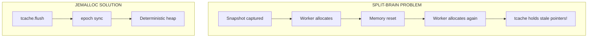

---

## Global Allocator

```rust
use tikv_jemallocator::Jemalloc;

#[global_allocator]
#[cfg(all(not(target_env = "msvc"), not(test)))]
static GLOBAL: Jemalloc = Jemalloc::default();
```

### Conditional Compilation

Jemalloc is disabled during `cargo test` to prevent instability on WSL2:

```rust
#[cfg(all(not(target_env = "msvc"), not(test)))]
```

---

## Quiesce Sequence

Before capturing a snapshot, the worker must quiesce the allocator:

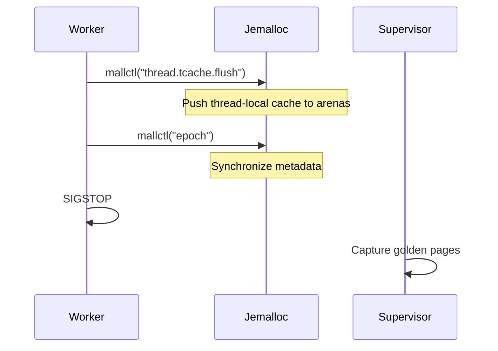

### tcache Flush

```rust
pub fn flush_tcache() {
    unsafe {
        tikv_jemalloc_sys::mallctl(
            c"thread.tcache.flush".as_ptr(),
            std::ptr::null_mut(),
            std::ptr::null_mut(),
            std::ptr::null(),
            0,
        );
    }
}
```

This pushes all thread-local free list entries back to global arenas.

### Epoch Sync

```rust
pub fn sync_epoch() {
    let mut epoch: u64 = 0;
    let mut len = std::mem::size_of::<u64>();
    unsafe {
        tikv_jemalloc_sys::mallctl(
            c"epoch".as_ptr(),
            &mut epoch as *mut _ as *mut _,
            &mut len,
            &epoch as *const _ as *const _,
            len,
        );
    }
}
```

This advances the jemalloc epoch, forcing metadata synchronization.

### Combined Function

```rust
pub fn quiesce_allocator() {
    flush_tcache();
    sync_epoch();
}
```

---

## Why Jemalloc?

| Feature       | glibc malloc  | Jemalloc                         |
| :------------ | :------------ | :------------------------------- |
| tcache flush  | Not exposed   | `mallctl("thread.tcache.flush")` |
| Epoch sync    | Not available | `mallctl("epoch")`               |
| Determinism   | Poor          | Excellent                        |
| Fragmentation | High          | Low                              |

---

## Runtime Configuration

For production, set environment variables:

```bash
export MALLOC_CONF="background_thread:false,dirty_decay_ms:0,muzzy_decay_ms:0"
```

| Option              | Value | Purpose                      |
| :------------------ | :---- | :--------------------------- |
| `background_thread` | false | Disable background purging   |
| `dirty_decay_ms`    | 0     | Immediate dirty page purging |
| `muzzy_decay_ms`    | 0     | Immediate muzzy page purging |

---

## Verification

```rust
pub fn verify_jemalloc_active() -> bool {
    let mut version: *const libc::c_char = std::ptr::null();
    let mut len = std::mem::size_of::<*const libc::c_char>();

    let result = unsafe {
        tikv_jemalloc_sys::mallctl(
            c"version".as_ptr(),
            &mut version as *mut _ as *mut _,
            &mut len,
            std::ptr::null(),
            0,
        )
    };

    if result == 0 && !version.is_null() {
        let version_str = unsafe { CStr::from_ptr(version) };
        eprintln!("[allocator] Jemalloc version: {:?}", version_str);
        true
    } else {
        false
    }
}
```

---

## Integration with Snapshot

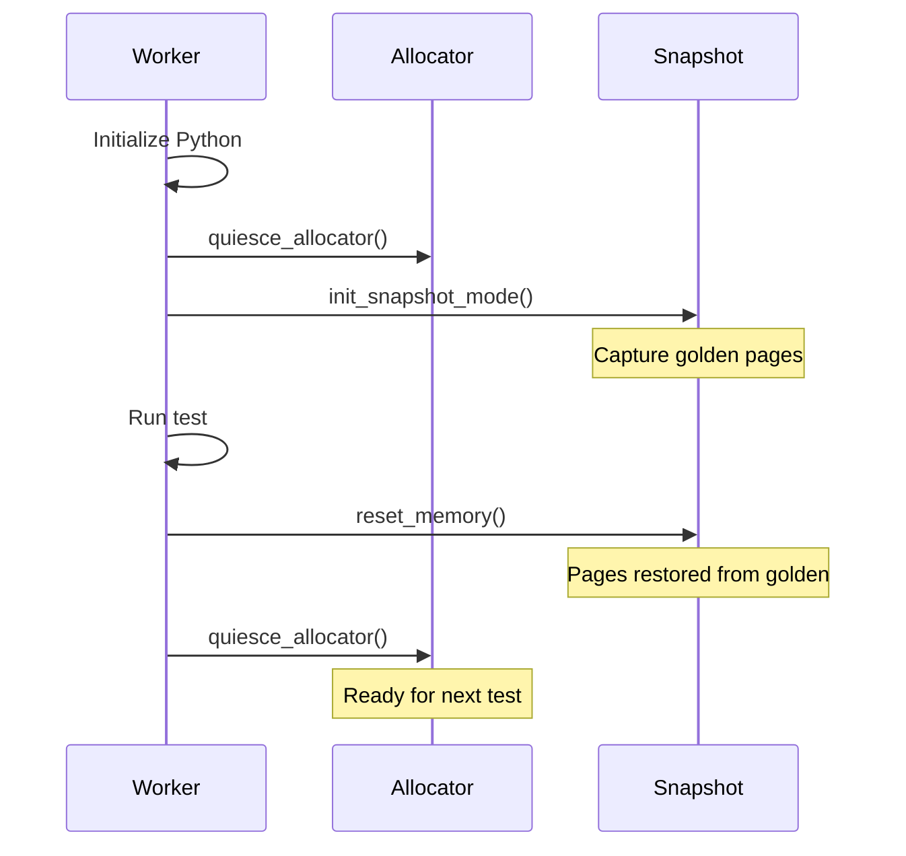

---

## ELF Parsing

For precise libpython segment identification, Tach uses `goblin`:

```rust
fn find_libpython_segments(path: &Path, base: usize) -> Vec<AlignedSegment> {
    let data = std::fs::read(path)?;
    let elf = goblin::elf::Elf::parse(&data)?;

    elf.program_headers
        .iter()
        .filter(|ph| {
            ph.p_type == goblin::elf::program_header::PT_LOAD
                && (ph.p_flags & goblin::elf::program_header::PF_W) != 0
        })
        .map(|ph| AlignedSegment {
            start: base + ph.p_vaddr as usize,
            end: base + ph.p_vaddr as usize + ph.p_memsz as usize,
            description: "libpython data/bss".into(),
        })
        .collect()
}
```

This ensures Python's small-int cache and singletons (None, True, False) are included in snapshots.

---

## Cargo Dependencies

```toml
[dependencies]
tikv-jemallocator = { version = "0.5", features = ["stats"] }
tikv-jemalloc-sys = "0.5"
goblin = "0.7"
```

---

## Related Documentation

- [Physics Engine](snapshot.md) - Memory snapshot details
- [Zygote Lifecycle](zygote.md) - When quiesce is called
- [Troubleshooting](../troubleshooting.md) - Jemalloc build issues


---


# Coverage System

Zero-overhead coverage collection using PEP 669 `sys.monitoring` with lock-free ring buffers.

---

## Overview

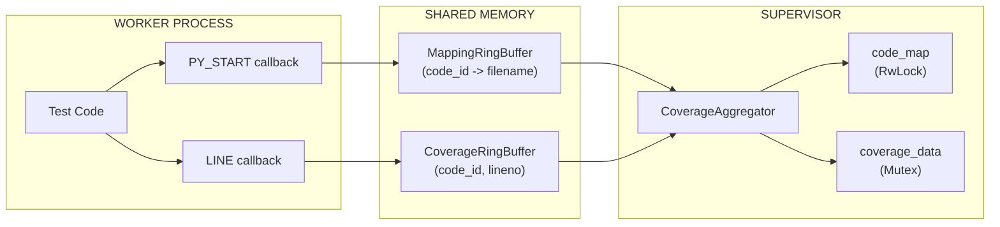

**Key Components:**

- **PEP 669 `sys.monitoring`** (Python 3.12+) for event callbacks
- **Dual ring buffers** with lock-free CAS loops
- **RwLock** for read-heavy code_map access
- **Mutex poisoning recovery** for panic resilience

---

## Data Structures

### RingBufferHeader (64 bytes, cache-line aligned)

```rust
#[repr(C, align(64))]
pub struct RingBufferHeader {
    pub write_idx: AtomicU64,      // Worker increments atomically
    pub read_idx: AtomicU64,       // Supervisor increments
    pub capacity: u64,
    pub overflow_count: AtomicU64, // Entries dropped when full
    _padding: [u8; 32],
}
```

### CoverageEntry (16 bytes)

```rust
#[repr(C, align(16))]
pub struct CoverageEntry {
    pub code_id: u64,  // Python code object address
    pub lineno: u32,
    pub flags: u32,    // Reserved: LINE/CALL/RETURN bits
}
```

### MappingEntry (256 bytes)

```rust
#[repr(C, align(8))]
pub struct MappingEntry {
    pub code_id: u64,
    pub filename_len: u16,
    pub _padding: [u8; 6],
    pub filename: [u8; 240],  // Truncated from LEFT if > 240 bytes
}
```

---

## Buffer Configuration

| Buffer   | Entry Size | Capacity | Total Size |
| :------- | :--------- | :------- | :--------- |
| Coverage | 16 bytes   | 262,144  | ~4 MB      |
| Mapping  | 256 bytes  | 8,192    | ~2 MB      |

```rust
pub const DEFAULT_CAPACITY: usize = 262_144;  // Coverage entries
pub const MAPPING_CAPACITY: usize = 8_192;    // Mapping entries
pub const HEADER_SIZE: usize = 64;
```

---

## Dual-Buffer Architecture

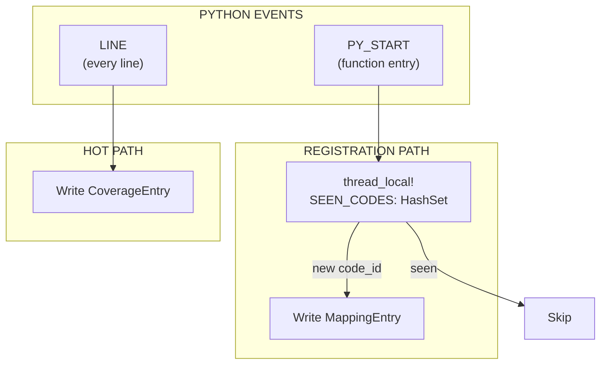

**Why Two Buffers?** PY_START events are infrequent with large entries (256B), LINE events are frequent with small entries (16B). Separation prevents mapping entries from consuming coverage buffer space.

---

## Lock-Free CAS Loop

The CAS (Compare-And-Swap) loop prevents TOCTOU races by atomically checking capacity AND reserving a slot:

```rust
#[inline]
pub fn write(&self, entry: CoverageEntry) -> bool {
    let header = self.header();
    loop {
        let write = header.write_idx.load(Ordering::Acquire);
        let read = header.read_idx.load(Ordering::Acquire);

        if write.wrapping_sub(read) >= header.capacity {
            header.overflow_count.fetch_add(1, Ordering::Relaxed);
            return false;
        }

        match header.write_idx.compare_exchange_weak(
            write, write.wrapping_add(1), Ordering::AcqRel, Ordering::Relaxed
        ) {
            Ok(_) => {
                let slot = (write % self.capacity as u64) as usize;
                unsafe { std::ptr::write_volatile(self.entries_ptr().add(slot), entry); }
                return true;
            }
            Err(_) => { std::hint::spin_loop(); continue; }
        }
    }
}
```

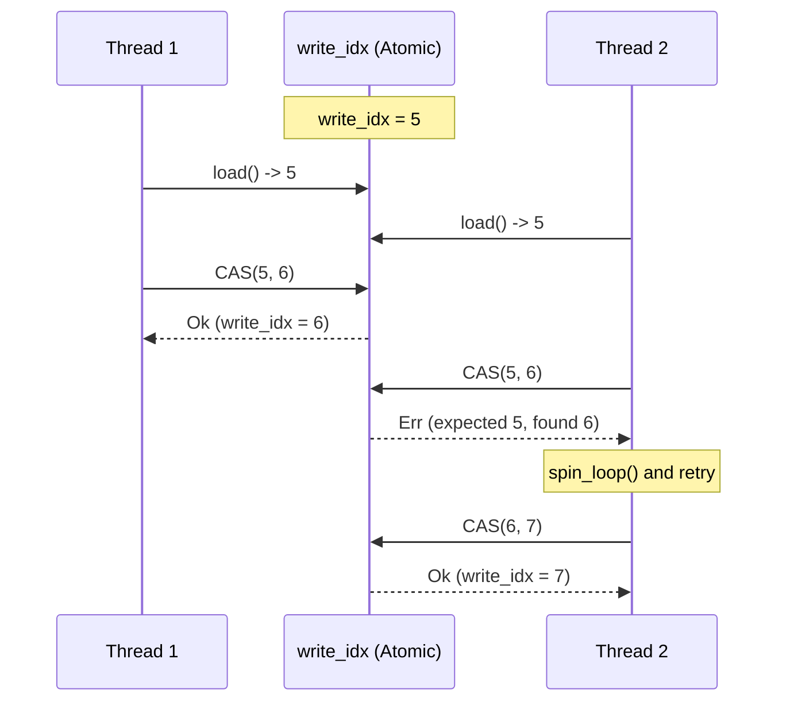

**Invariants:** No slot double-allocation, no buffer overflow, lock-free progress guarantee.

**spin_loop():** Emits `PAUSE` (x86) or `YIELD` (ARM) to reduce power consumption during retry.

---

## RwLock for code_map

The `code_map` uses RwLock for read-heavy access (writes are infrequent, reads happen for every coverage entry):

```rust
pub struct CoverageAggregator {
    data: Arc<Mutex<CoverageData>>,
    code_map: Arc<RwLock<HashMap<u64, String>>>,  // Read-heavy
    stop_flag: Arc<AtomicBool>,
    thread_handle: Option<JoinHandle<()>>,
}
```

```rust
// WRITE: Populating from mapping buffer
let mut guard = code_map.write().unwrap_or_else(|e| e.into_inner());

// READ: Resolving coverage entries (concurrent readers allowed)
let guard = code_map.read().unwrap_or_else(|e| e.into_inner());
```

---

## Mutex Poisoning Recovery

When a thread panics while holding a lock, it becomes "poisoned". Tach recovers using:

```rust
let guard = mutex.lock().unwrap_or_else(|e| e.into_inner());
```

This extracts the guard from `PoisonError`, allowing coverage collection to continue despite test panics.

---

## Performance Optimizations

1. **Zero-Copy Extraction:** `take_data()` uses `std::mem::take()` to move coverage data without cloning.
2. **Pre-allocated HashSet:** `SEEN_CODES` (thread-local) starts with 1024 capacity to avoid hot-path reallocations.
3. **Batch Processing:** Aggregator drains in batches (4096 coverage, 1024 mapping) to amortize lock acquisition.
4. **Volatile Writes:** Ensures visibility across processes without compiler optimization interference.

---

## Ring Buffer Architecture

- **Shared Memory:** Created via `memfd_create` with `MAP_SHARED`.
- **Index Wrapping:** Uses wrapping arithmetic to handle `u64` overflow.
- **Memory Layout:** 64-byte header followed by entry array.

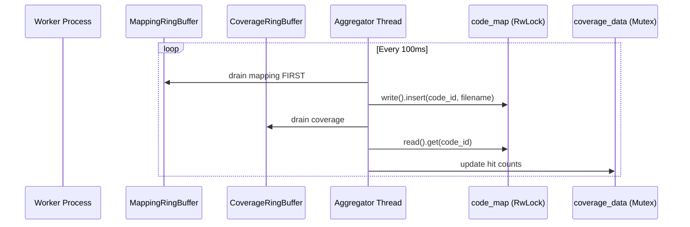

---

## Python Callbacks & FFI

- **PY_START:** Registers `code_id -> filename` once per function.
- **LINE:** Records `(code_id, lineno)` for every line executed.
- **GIL Discipline:** All FFI functions (`record_line`, `record_py_start`) release the GIL using `py.allow_threads` before shared memory access.

---

## Filename Truncation

Long paths are truncated from the **LEFT** to preserve filenames while fitting in 240-byte `MappingEntry` slots. Truncation respects UTF-8 boundaries.

---

## Memory Exclusion

Coverage buffers (`memfd:tach_coverage`, `memfd:tach_mapping`) are excluded from `userfaultfd` snapshots to ensure coverage persists across memory resets.

---

## Performance Metrics

| Metric        | Value |
| :------------ | :---- |
| Overhead      | < 1%  |
| Write Latency | ~10ns |
| Poll Interval | 100ms |

---

## Test Coverage

Validated by comprehensive unit tests for alignment/wrapping and stress tests for CAS loop concurrency (up to 16 threads). Run `cargo test --lib coverage::` to execute.

---

## Related Documentation

- [Physics Engine](snapshot.md) - Snapshot exclusion
- [API Reference](../api-reference.md) - FFI signatures
- [Configuration](../configuration.md) - Coverage options


---


# TTY Proxy for Interactive Debugging

The Debugger module enables `breakpoint()` and `pdb` inside isolated, parallel workers by implementing a bidirectional terminal tunnel between the Supervisor and Workers.

---

## Overview

When a worker hits a breakpoint, the debugger:

1. Pauses all other workers (SIGSTOP) to prevent log interleaving
2. Switches the terminal to Raw mode for character-by-character I/O
3. Tunnels stdin/stdout bidirectionally through a Unix socket
4. Restores Cooked mode and resumes workers (SIGCONT) when debugging ends

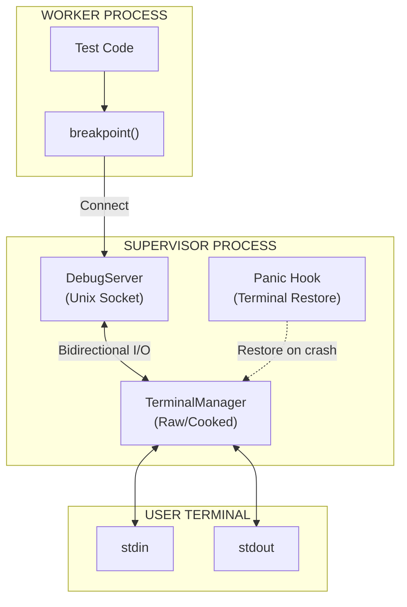

---

## Security Fix: Static Mut Elimination

### The Problem: Unsafe Static Mutable State

The original implementation used `static mut` to store the original terminal settings:

```rust
// BAD: Unsafe static mut - causes undefined behavior
static mut ORIGINAL_TERMIOS: Option<Termios> = None;

// Accessing requires unsafe blocks everywhere
unsafe {
    ORIGINAL_TERMIOS = Some(termios);
}
```

This pattern is **fundamentally unsafe** because:

| Issue                    | Description                                                                      |
| :----------------------- | :------------------------------------------------------------------------------- |
| **Data Races**           | Multiple threads accessing `static mut` simultaneously causes undefined behavior |
| **No Synchronization**   | No memory barriers or locks protect the data                                     |
| **Compiler Assumptions** | The compiler may optimize reads/writes incorrectly                               |
| **Undefined Behavior**   | Even single-threaded access can cause UB if the compiler reorders operations     |

### The Solution: Thread-Safe Mutex Pattern

The fix replaces `static mut` with a thread-safe `Mutex<Option<Termios>>`:

```rust
// GOOD: Thread-safe via Mutex
static ORIGINAL_TERMIOS: Mutex<Option<Termios>> = Mutex::new(None);
```

This pattern provides:

| Benefit             | Description                                  |
| :------------------ | :------------------------------------------- |
| **Thread Safety**   | Mutex ensures exclusive access               |
| **Memory Ordering** | Lock/unlock provides proper memory barriers  |
| **No Unsafe**       | All access is through safe Rust APIs         |
| **Panic Safety**    | Mutex poisoning detects panics during access |

### Why Not OnceLock?

The code includes a comment explaining why `OnceLock` cannot be used:

```rust
/// Saved original termios for panic recovery
/// Uses Mutex for thread-safe access without unsafe static mut
/// (Termios contains RefCell which is not Sync, so OnceLock cannot be used)
static ORIGINAL_TERMIOS: Mutex<Option<Termios>> = Mutex::new(None);
```

`OnceLock<T>` requires `T: Sync`, but `Termios` from the `nix` crate contains a `RefCell` internally, which is not `Sync`. Therefore, `Mutex` is the correct choice.

### Safe Access Pattern

Reading from the mutex:

```rust
// Thread-safe read via Mutex
if let Ok(guard) = ORIGINAL_TERMIOS.lock() {
    if let Some(ref original) = *guard {
        let stdin = io::stdin();
        let _ = tcsetattr(&stdin, SetArg::TCSANOW, original);
    }
}
```

Writing to the mutex:

```rust
// Thread-safe write via Mutex
if let Ok(mut guard) = ORIGINAL_TERMIOS.lock() {
    *guard = Some(original.clone());
}
```

---

## Data Structures

### TerminalMode

```rust
#[derive(Debug, Clone, Copy, PartialEq)]
pub enum TerminalMode {
    /// Normal line-buffered mode with echo
    Cooked,
    /// Character-by-character, no echo, no signal processing
    Raw,
}
```

### TerminalManager

Manages terminal state transitions and ensures safe restoration:

```rust
pub struct TerminalManager {
    stdin_fd: RawFd,
    original_termios: Option<Termios>,
    current_mode: TerminalMode,
}
```

### DebugServer

Listens for worker connections on a Unix socket:

```rust
pub struct DebugServer {
    socket_path: PathBuf,  // /tmp/tach_debug_{pid}.sock
    listener: UnixListener,
}
```

---

## Terminal Mode Management

### Raw Mode

Raw mode disables terminal processing for direct character I/O:

```rust
pub fn enter_raw_mode(&mut self) -> Result<()> {
    if self.current_mode == TerminalMode::Raw {
        return Ok(());
    }

    let mut raw = self.original_termios.clone()
        .context("No original termios saved")?;

    // cfmakeraw disables all the flags we need:
    // - ICANON, ECHO, ECHOE, ECHOK, ECHONL, ISIG, IEXTEN
    // - BRKINT, ICRNL, INPCK, ISTRIP, IXON
    // - OPOST
    // - CSIZE, PARENB (sets CS8)
    cfmakeraw(&mut raw);

    let stdin = io::stdin();
    tcsetattr(&stdin, SetArg::TCSANOW, &raw)
        .context("Failed to set raw mode")?;

    IN_RAW_MODE.store(true, Ordering::SeqCst);
    self.current_mode = TerminalMode::Raw;

    Ok(())
}
```

### Cooked Mode Restoration

```rust
pub fn restore(&mut self) -> Result<()> {
    if self.current_mode == TerminalMode::Cooked {
        return Ok(());
    }

    if let Some(ref original) = self.original_termios {
        let stdin = io::stdin();
        tcsetattr(&stdin, SetArg::TCSANOW, original)
            .context("Failed to restore terminal")?;
    }

    IN_RAW_MODE.store(false, Ordering::SeqCst);
    self.current_mode = TerminalMode::Cooked;

    Ok(())
}
```

### Drop Implementation

The `TerminalManager` implements `Drop` to ensure terminal restoration:

```rust
impl Drop for TerminalManager {
    fn drop(&mut self) {
        // Best-effort restoration on drop
        let _ = self.restore();
    }
}
```

---

## Panic Hook Installation

### The Problem

If the program panics while in Raw mode, the terminal is left in an unusable state:

- No echo (you cannot see what you type)
- No line buffering (Enter does not work normally)
- No signal processing (Ctrl+C does not work)

### The Solution

A panic hook is installed at program startup to restore the terminal:

```rust
/// Install panic hook to restore terminal on crash
///
/// CRITICAL: Without this, a panic in raw mode leaves the terminal unusable.
/// Call this once at program startup.
pub fn install_panic_hook() {
    let default_hook = std::panic::take_hook();

    std::panic::set_hook(Box::new(move |info| {
        // Attempt to restore terminal if we were in raw mode
        if IN_RAW_MODE.load(Ordering::SeqCst) {
            // Thread-safe read via Mutex
            if let Ok(guard) = ORIGINAL_TERMIOS.lock() {
                if let Some(ref original) = *guard {
                    let stdin = io::stdin();
                    let _ = tcsetattr(&stdin, SetArg::TCSANOW, original);
                }
            }
            IN_RAW_MODE.store(false, Ordering::SeqCst);
            eprintln!("\n[tach] Terminal restored after panic.\n");
        }

        // Call the default panic handler
        default_hook(info);
    }));
}
```

### How It Works

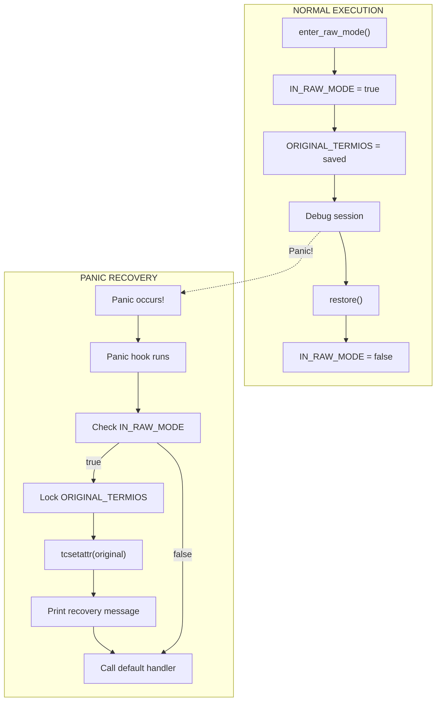

### Global State for Panic Recovery

Two global variables enable panic recovery:

```rust
/// Global flag to track if we're in raw mode (for panic hook)
static IN_RAW_MODE: AtomicBool = AtomicBool::new(false);

/// Saved original termios for panic recovery
/// Uses Mutex for thread-safe access without unsafe static mut
static ORIGINAL_TERMIOS: Mutex<Option<Termios>> = Mutex::new(None);
```

| Variable           | Type                     | Purpose                                  |
| :----------------- | :----------------------- | :--------------------------------------- |
| `IN_RAW_MODE`      | `AtomicBool`             | Fast check if terminal needs restoration |
| `ORIGINAL_TERMIOS` | `Mutex<Option<Termios>>` | Thread-safe storage of original settings |

---

## DebugServer Implementation

### Socket Creation

```rust
pub fn new() -> Result<Self> {
    let pid = std::process::id();
    let socket_path = PathBuf::from(format!("/tmp/tach_debug_{}.sock", pid));

    // Clean up any stale socket file
    if socket_path.exists() {
        fs::remove_file(&socket_path)
            .context("Failed to remove stale debug socket")?;
    }

    let listener = UnixListener::bind(&socket_path)
        .context("Failed to bind debug socket")?;

    // Set non-blocking so we can check for connections without blocking scheduler
    listener.set_nonblocking(true)
        .context("Failed to set socket non-blocking")?;

    eprintln!("[debugger] Listening on {}", socket_path.display());

    Ok(Self { socket_path, listener })
}
```

### Non-Blocking Accept

```rust
/// Check if a worker is waiting to connect (non-blocking)
pub fn try_accept(&self) -> Option<UnixStream> {
    match self.listener.accept() {
        Ok((stream, _)) => Some(stream),
        Err(ref e) if e.kind() == io::ErrorKind::WouldBlock => None,
        Err(e) => {
            eprintln!("[debugger] Accept error: {}", e);
            None
        }
    }
}
```

### Debug Session Handling

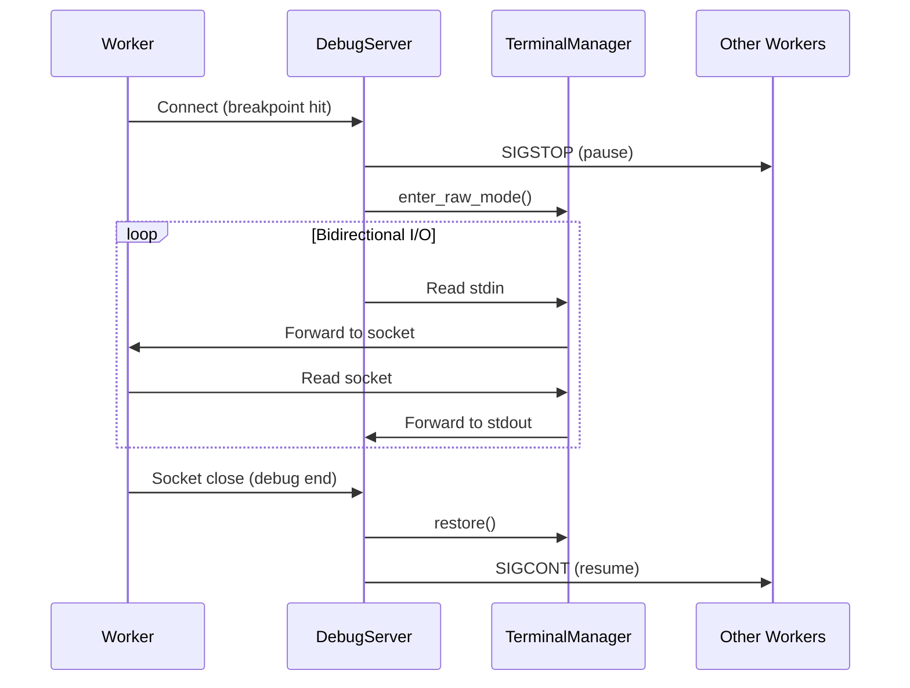

### Worker Pause/Resume

Other workers are paused during debugging to prevent log interleaving:

```rust
/// Pause all workers by sending SIGSTOP
fn pause_workers(worker_pids: &[i32], debug_worker_pid: Option<i32>) {
    for &pid in worker_pids {
        if Some(pid) == debug_worker_pid {
            continue; // Don't stop the worker we're debugging!
        }
        if pid > 0 {
            let _ = kill(Pid::from_raw(pid), Signal::SIGSTOP);
        }
    }
}

/// Resume all paused workers by sending SIGCONT
fn resume_workers(worker_pids: &[i32]) {
    for &pid in worker_pids {
        if pid > 0 {
            let _ = kill(Pid::from_raw(pid), Signal::SIGCONT);
        }
    }
}
```

### Socket Cleanup

```rust
impl Drop for DebugServer {
    fn drop(&mut self) {
        self.cleanup();
    }
}

fn cleanup(&self) {
    if self.socket_path.exists() {
        let _ = fs::remove_file(&self.socket_path);
    }
}
```

---

## Integration with Lifecycle

The debugger integrates with the lifecycle module via a global flag:

```rust
// In handle_session():
crate::lifecycle::IS_DEBUGGING.store(true, Ordering::SeqCst);

// ... debug session ...

crate::lifecycle::IS_DEBUGGING.store(false, Ordering::SeqCst);
```

This flag affects signal handling - SIGINT is ignored during debugging because Raw mode handles Ctrl+C directly (as byte 0x03).

---

## Thread Safety Summary

| Component          | Synchronization          | Notes                                    |
| :----------------- | :----------------------- | :--------------------------------------- |
| `IN_RAW_MODE`      | `AtomicBool`             | Lock-free, fast check                    |
| `ORIGINAL_TERMIOS` | `Mutex<Option<Termios>>` | Thread-safe, handles non-Sync inner type |
| `DebugServer`      | Single-threaded          | Only supervisor uses it                  |
| `TerminalManager`  | Instance-based           | Created per session                      |

---

## Error Handling

| Error                               | Cause             | Recovery                     |
| :---------------------------------- | :---------------- | :--------------------------- |
| `Failed to get terminal attributes` | stdin not a TTY   | Return error, skip debugging |
| `Failed to set raw mode`            | Permission denied | Return error, skip debugging |
| `Failed to bind debug socket`       | Port in use       | Clean stale socket, retry    |
| Panic in raw mode                   | Any panic         | Panic hook restores terminal |

---

## Usage Example

```rust
use tach::reporting::debugger::{DebugServer, install_panic_hook};

fn main() -> Result<()> {
    // Install panic hook at startup (once)
    install_panic_hook();

    // Create debug server
    let debug_server = DebugServer::new()?;

    // In scheduler loop:
    if let Some(stream) = debug_server.try_accept() {
        let worker_pids = get_all_worker_pids();
        let debug_worker_pid = get_connecting_worker_pid();

        debug_server.handle_session(
            stream,
            &worker_pids,
            Some(debug_worker_pid),
        )?;
    }

    Ok(())
}
```

---

## Related Documentation

- [Scheduler](scheduler.md) - How the scheduler integrates with the debug server
- [Zygote Lifecycle](zygote.md) - Worker process management
- [Isolation](isolation.md) - How workers are isolated


---


# Discovery Engine

The Discovery Engine performs static AST analysis to find tests without executing Python code.

---

## Overview

Tach uses `rustpython-parser` to parse Python source files into Abstract Syntax Trees (ASTs). This approach is:

- **Fast**: Parallel parsing with `rayon`
- **Safe**: No code execution during discovery
- **Accurate**: Full Python 3.10+ syntax support

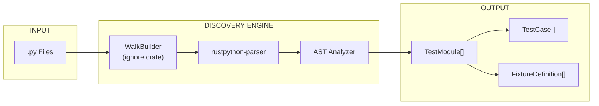

---

## Data Structures

### FixtureScope

Defines the lifecycle of a pytest fixture.

```rust
pub enum FixtureScope {
    Function,  // Default - new instance per test
    Class,     // Shared within test class
    Module,    // Shared within test file
    Session,   // Shared across entire run
}
```

### FixtureDefinition

Represents a `@pytest.fixture` decorated function.

```rust
pub struct FixtureDefinition {
    pub name: String,
    pub scope: FixtureScope,
    pub dependencies: Vec<String>,
    pub params: Option<Vec<String>>,
    pub class_scope: Option<String>,
}
```

| Field          | Description                                                    |
| :------------- | :------------------------------------------------------------- |
| `name`         | Fixture function name                                          |
| `scope`        | Lifecycle scope (function/class/module/session)                |
| `dependencies` | Other fixtures this fixture requires                           |
| `params`       | Static literal parameters from `@pytest.fixture(params=[...])` |
| `class_scope`  | If defined inside a class, the class name                      |

### TestCase

Represents an individual test function or method.

```rust
pub struct TestCase {
    pub name: String,
    pub dependencies: Vec<String>,
    pub is_async: bool,
    pub line_number: usize,
    pub parametrized_args: Vec<String>,
}
```

| Field               | Description                                                                  |
| :------------------ | :--------------------------------------------------------------------------- |
| `name`              | Test name (e.g., `test_func` or `TestClass::test_method`)                    |
| `dependencies`      | Fixtures required by the test                                                |
| `is_async`          | Whether it's an `async def`                                                  |
| `line_number`       | 1-indexed line number for reporting                                          |
| `parametrized_args` | Arguments from `@pytest.mark.parametrize` (excluded from fixture resolution) |

### TestModule

Represents a single `.py` file.

```rust
pub struct TestModule {
    pub path: PathBuf,
    pub tests: Vec<TestCase>,
    pub fixtures: Vec<FixtureDefinition>,
    pub is_toxic: bool,
}
```

### DiscoveryResult

The aggregate result of a project scan.

```rust
pub struct DiscoveryResult {
    pub modules: Vec<TestModule>,
}
```

---

## Discovery Process

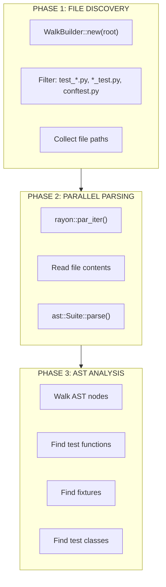

### File Filtering

Files are included if they match:

- `test_*.py` - Test files
- `*_test.py` - Test files (alternate convention)
- `conftest.py` - Fixture files

### Pattern Detection

The analyzer detects:

| Pattern         | Detection Method                             |
| :-------------- | :------------------------------------------- |
| Test functions  | `def test_*` at module level                 |
| Async tests     | `async def test_*`                           |
| Test classes    | `class Test*`                                |
| Test methods    | `def test_*` inside `Test*` class            |
| Fixtures        | `@pytest.fixture` or `@fixture` decorator    |
| Parametrization | `@pytest.mark.parametrize` decorator         |
| Mocking         | `@patch` or `@unittest.mock.patch` decorator |

---

## Key Functions

### discover

Entry point for test discovery.

```rust
pub fn discover(root: &Path) -> Result<DiscoveryResult>
```

Uses `WalkBuilder` to find files and `rayon` to parse them in parallel.

### parse_module

Parses a single Python file.

```rust
fn parse_module(path: &Path) -> Result<TestModule>
```

Reads the file and converts its AST into a `TestModule`.

### analyze_function

Extracts test/fixture data from function definitions.

```rust
fn analyze_function(
    func: &ast::StmtFunctionDef,
    class_name: Option<&str>,
) -> Option<TestOrFixture>
```

### extract_injected_args

Identifies arguments that are NOT fixtures.

```rust
fn extract_injected_args(
    decorators: &[ast::Expr],
    func_args: &[String],
) -> Vec<String>
```

Filters out arguments from:

- `@pytest.mark.parametrize("arg1, arg2", [...])`
- `@patch("module.thing")` (injects mock as argument)

---

## Special Handling

### self and cls

Method arguments `self` and `cls` are automatically excluded from fixture resolution.

### Parametrization

```python
@pytest.mark.parametrize("x, y", [(1, 2), (3, 4)])
def test_add(x, y, some_fixture):
    pass
```

Here, `x` and `y` are parametrized args (not fixtures), while `some_fixture` is a fixture dependency.

### Mock Patches

```python
@patch("module.SomeClass")
def test_thing(mock_class, some_fixture):
    pass
```

The first argument (`mock_class`) is injected by `@patch`, not a fixture.

### conftest.py

Fixtures in `conftest.py` files are automatically treated as global fixtures available to all tests in the directory tree.

### TYPE_CHECKING Blocks

Imports inside `if TYPE_CHECKING:` blocks are skipped during toxicity analysis to avoid false positives.

---

## Integration with Toxicity

After discovery, each `TestModule` is analyzed for toxicity:


See [Toxicity Analysis](toxicity.md) for details.

---

## Performance Characteristics

| Metric      | Value                                |
| :---------- | :----------------------------------- |
| Parallelism | All CPU cores via `rayon`            |
| Memory      | O(n) where n = number of files       |
| Complexity  | O(n \* m) where m = average AST size |

---

## Limitations

1. **Dynamic Tests**: Tests generated at runtime (e.g., via `pytest_generate_tests`) are not discovered
2. **Eval/Exec**: Tests defined via `eval()` or `exec()` are not discovered
3. **Namespace Packages**: Directories without `__init__.py` fall back to standard import

---

## Related Documentation

- [Toxicity Analysis](toxicity.md) - How discovered modules are analyzed for safety
- [Fixture Resolver](resolver.md) - How fixture dependencies are resolved


---


# Isolation Architecture (Namespaces and OverlayFS)

Worker isolation provides filesystem and network separation for test processes, ensuring tests cannot interfere with each other or the host system.

---

## Overview

Tach uses Linux namespaces and OverlayFS to create isolated environments for each worker:

1. **Mount Namespace (CLONE_NEWNS)**: Private filesystem view per worker
2. **Network Namespace (CLONE_NEWNET)**: Isolated network stack with own loopback
3. **OverlayFS**: Copy-on-write layers for `/tmp` and project directory

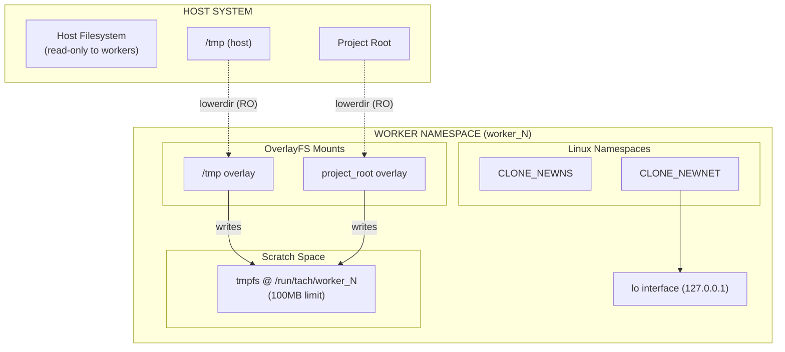

---

## Namespace Types

### Mount Namespace (CLONE_NEWNS)

Provides a private set of mount points. After entering, mount operations are invisible to host and other workers.

```rust
unshare(CloneFlags::CLONE_NEWNS | CloneFlags::CLONE_NEWNET)
    .context("unshare failed - requires CAP_SYS_ADMIN")?;
```

**Key Properties:** Worker mounts isolated from host; mount propagation disabled via `MS_PRIVATE`.

### Network Namespace (CLONE_NEWNET)

Provides isolated network stack preventing tests from binding conflicting ports or interfering with host services.

**Each Worker Gets:** Own network interfaces, routing tables, firewall rules, and port bindings.

**Loopback Setup:** After entering namespace, bring up loopback manually:

```rust
fn setup_loopback() -> Result<()> {
    Command::new("ip").args(["link", "set", "lo", "up"]).output()?;
    Ok(())
}
```

### PID Namespace

**Not used.** Tach uses standard `fork()` and `PR_SET_PDEATHSIG` for process management.

---

## The setup_filesystem Function

Main entry point for worker isolation with a critical execution sequence.

### Function Signature

```rust
/// Set up complete isolation for a worker (Iron Dome)
/// If TACH_NO_ISOLATION=1, skip all isolation (for benchmarking/debugging)
pub fn setup_filesystem(worker_id: u32, project_root: &Path) -> Result<()>
```

### Critical Execution Sequence

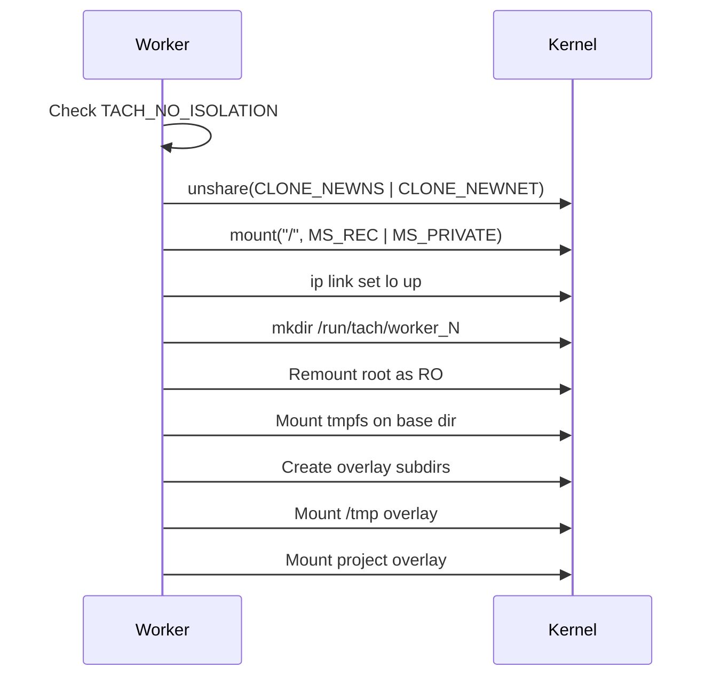

### Implementation (Key Steps)

```rust
pub fn setup_filesystem(worker_id: u32, project_root: &Path) -> Result<()> {
    if std::env::var("TACH_NO_ISOLATION").unwrap_or_default() == "1" {
        return Ok(());
    }

    // 1. Create namespaces
    unshare(CloneFlags::CLONE_NEWNS | CloneFlags::CLONE_NEWNET)?;

    // 2. Privatize mounts
    mount::<str, str, str, str>(None, "/", None, MsFlags::MS_REC | MsFlags::MS_PRIVATE, None)?;

    // 3. Setup loopback
    setup_loopback()?;

    // 4. Create base dir (while root still writable)
    let base = PathBuf::from(format!("/run/tach/worker_{}", worker_id));
    fs::create_dir_all(&base)?;

    // 5. Lock root as read-only
    mount::<str, str, str, str>(Some("/"), "/", None, MsFlags::MS_BIND | MsFlags::MS_REC, None)?;
    mount::<str, str, str, str>(Some("/"), "/", None,
        MsFlags::MS_BIND | MsFlags::MS_REMOUNT | MsFlags::MS_RDONLY | MsFlags::MS_REC, None)?;

    // 6. Mount tmpfs
    mount::<str, PathBuf, str, str>(Some("tmpfs"), &base, Some("tmpfs"),
        MsFlags::empty(), Some("size=100M,mode=0755"))?;

    // 7. Create overlay subdirs and mount overlays
    // ... (tmp_upper, tmp_work, proj_upper, proj_work)
    // ... mount overlay on /tmp and project_root

    Ok(())
}
```

### Mount Flags

| Flag         | Purpose                            |
| :----------- | :--------------------------------- |
| `MS_REC`     | Apply recursively to all submounts |
| `MS_PRIVATE` | Disable mount propagation          |
| `MS_BIND`    | Create bind mount                  |
| `MS_REMOUNT` | Change flags on existing mount     |
| `MS_RDONLY`  | Make mount read-only               |

---

## OverlayFS Structure

OverlayFS provides copy-on-write semantics, allowing workers to appear to modify files while writing to a separate location.

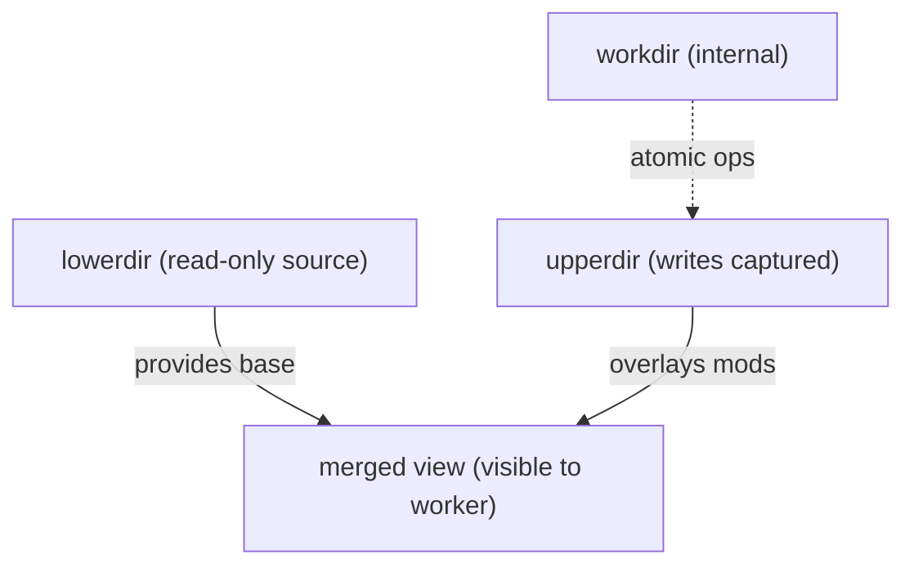

### Overlay Configurations

| Mount Point    | lowerdir         | upperdir                        | workdir                        |
| :------------- | :--------------- | :------------------------------ | :----------------------------- |
| `/tmp`         | `/tmp` (host)    | `/run/tach/worker_N/tmp_upper`  | `/run/tach/worker_N/tmp_work`  |
| `project_root` | `{project_root}` | `/run/tach/worker_N/proj_upper` | `/run/tach/worker_N/proj_work` |

---

## Worker Base Directory Structure

Each worker gets dedicated scratch space under `/run/tach/`:

```
/run/tach/
  worker_0/
    tmp_upper/     # /tmp writes
    tmp_work/      # OverlayFS workdir
    proj_upper/    # Project writes
    proj_work/     # OverlayFS workdir
  worker_1/
    ...
```

**Path Format:** `/run/tach/worker_{worker_id}` (worker_id is u32)

**tmpfs Config:** `size=100M,mode=0755` - prevents disk exhaustion, auto-freed on exit.

---

## Helper Functions API

Pure functions testable without root privileges.

### worker_base_dir

```rust
#[inline]
pub fn worker_base_dir(worker_id: u32) -> PathBuf {
    PathBuf::from(format!("/run/tach/worker_{}", worker_id))
}
```

### tmp_overlay_options / project_overlay_options

```rust
pub fn tmp_overlay_options(base: &Path) -> String {
    format!("lowerdir=/tmp,upperdir={}/tmp_upper,workdir={}/tmp_work",
        base.display(), base.display())
}

pub fn project_overlay_options(base: &Path, project_root: &Path) -> String {
    format!("lowerdir={},upperdir={}/proj_upper,workdir={}/proj_work",
        project_root.display(), base.display(), base.display())
}
```

### is_isolation_disabled

```rust
pub fn is_isolation_disabled() -> bool {
    std::env::var("TACH_NO_ISOLATION").unwrap_or_default() == "1"
}
```

| TACH_NO_ISOLATION | Returns |
| :---------------- | :------ |
| `"1"`             | `true`  |
| Any other value   | `false` |

---

## TACH_NO_ISOLATION Bypass

Skip all isolation for benchmarking, debugging, or CI without privileges.

```bash
TACH_NO_ISOLATION=1 ./tach-core .
```

### Security Implications

| Protection           | With Isolation             | Without Isolation         |
| :------------------- | :------------------------- | :------------------------ |
| Filesystem isolation | Workers isolated           | Workers share filesystem  |
| Network isolation    | Private network per worker | Shared network stack      |
| Write containment    | Writes to tmpfs            | Writes to real filesystem |
| Host protection      | Root read-only             | Root writable             |

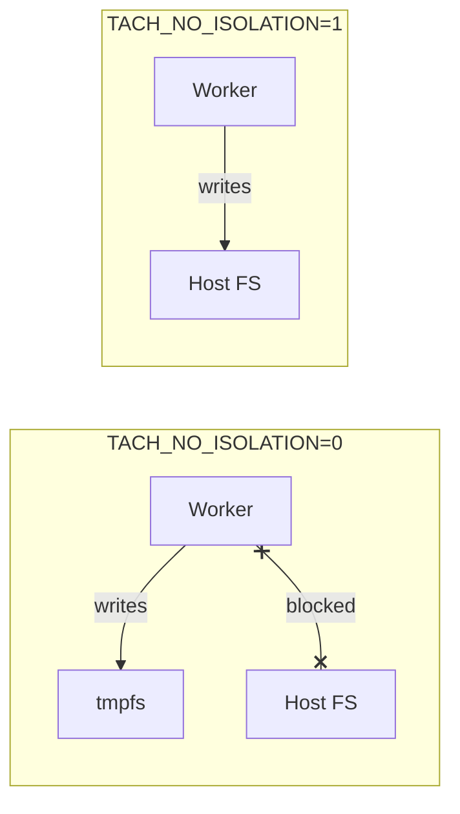

---

## Security Properties

| Property             | Mechanism                   | Description                            |
| :------------------- | :-------------------------- | :------------------------------------- |
| Filesystem isolation | Mount namespace + OverlayFS | Workers can't see each other's changes |
| Network isolation    | Network namespace           | Each worker has own network stack      |
| Write containment    | tmpfs + OverlayFS           | All writes to memory-backed storage    |
| Host protection      | Root remounted read-only    | Workers can't modify system files      |
| Automatic cleanup    | tmpfs freed on exit         | No persistent state left behind        |
| Resource limits      | tmpfs size=100M             | Workers can't exhaust host memory      |

### Iron Dome Integration

Isolation works with Landlock and Seccomp for defense in depth:

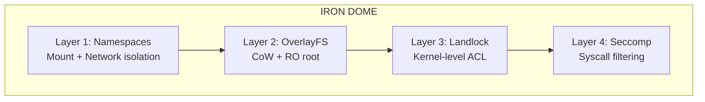

| Layer           | Protection                  | Failure Mode            |
| :-------------- | :-------------------------- | :---------------------- |
| Mount namespace | Can't see host mounts       | Other layers protect    |
| OverlayFS       | Writes to tmpfs             | Landlock blocks paths   |
| Landlock        | Kernel-level access control | Seccomp blocks syscalls |
| Seccomp         | Syscall filtering           | Process termination     |

---

## Unit Tests

The isolation module includes 15 unit tests verifiable without root privileges.

### Test Categories

| Category              | Tests | Description                              |
| :-------------------- | :---- | :--------------------------------------- |
| Worker Base Directory | 3     | Path format, large IDs, absolute paths   |
| Overlay Options       | 5     | Format validation, no spaces, uniqueness |
| TACH_NO_ISOLATION     | 5     | Environment variable behavior            |
| Path Components       | 2     | Subdirectory consistency                 |

### Running Tests

```bash
cargo test --lib isolation::namespace
cargo test --lib isolation::namespace -- --nocapture
```

---

## Related Documentation

- [Iron Dome (Sandbox)](sandbox.md) - Landlock and Seccomp security layers
- [Zygote Lifecycle](zygote.md) - When isolation is applied during worker spawning
- [Configuration](../configuration.md) - `--no-isolation` CLI flag
- [README](../../README.md) - Project architecture overview


---


# Zero-Copy Loader

The Zero-Copy Loader bypasses Python's `importlib` for instant module loading.

---

## Overview

Traditional Python imports involve:

1. Scanning `sys.path` for the module
2. Reading the `.py` file from disk
3. Compiling to bytecode (or reading cached `.pyc`)
4. Executing the module code

Tach eliminates steps 1-3 by pre-compiling all modules and injecting bytecode directly via the C-API.

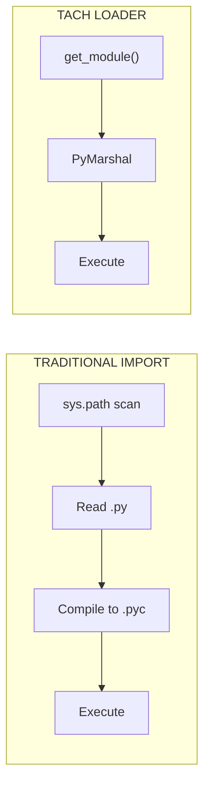

---

## Data Structures

### BytecodeEntry

Represents a single compiled module in the registry.

```rust
pub struct BytecodeEntry {
    pub name: String,
    pub source_path: PathBuf,
    pub bytecode: Vec<u8>,
    pub is_package: bool,
}
```

| Field         | Description                                   |
| :------------ | :-------------------------------------------- |
| `name`        | Fully qualified module name (e.g., `foo.bar`) |
| `source_path` | Absolute path to the original `.py` file      |
| `bytecode`    | Raw bytecode with 16-byte header removed      |
| `is_package`  | True if this was an `__init__.py` file        |

### ModuleRegistry

Thread-safe storage for compiled modules.

```rust
pub struct ModuleRegistry {
    entries: DashMap<String, BytecodeEntry>,
    project_root: PathBuf,
}
```

Uses `DashMap` for concurrent access from multiple worker threads.

### BytecodeCompiler

Handles eager compilation of Python source to bytecode.

```rust
pub struct BytecodeCompiler {
    cache_dir: PathBuf,
    project_root: PathBuf,
    python_exe: PathBuf,
    expected_magic: Option<[u8; 4]>,
}
```

---

## Compilation Pipeline

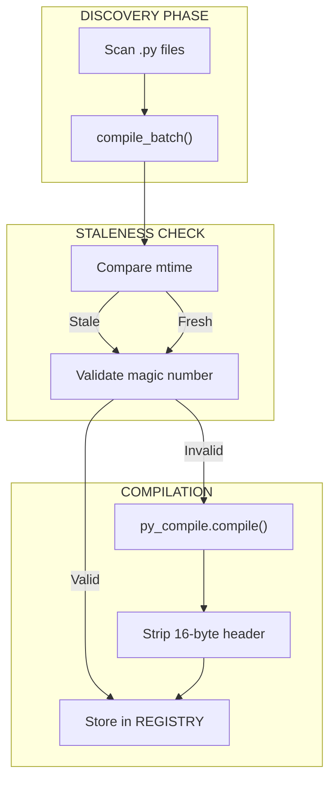

### Staleness Check

```rust
fn is_cache_stale(source: &Path, cache: &Path) -> bool {
    let source_mtime = source.metadata()?.modified()?;
    let cache_mtime = cache.metadata()?.modified()?;
    source_mtime > cache_mtime
}
```

### Magic Number Validation

Python bytecode files start with a 4-byte magic number that identifies the Python version. If the magic number doesn't match the current interpreter, the cache is invalid.

```rust
fn validate_magic(cache: &Path, expected: [u8; 4]) -> bool {
    let mut file = File::open(cache)?;
    let mut magic = [0u8; 4];
    file.read_exact(&mut magic)?;
    magic == expected
}
```

### Header Stripping

Python 3.7+ `.pyc` files have a 16-byte header (PEP 552):

| Bytes | Content                                   |
| :---- | :---------------------------------------- |
| 0-3   | Magic number                              |
| 4-7   | Bit field (hash-based invalidation flags) |
| 8-11  | Timestamp                                 |
| 12-15 | Source size                               |

Tach strips this header before storing bytecode.

---

## Cache Structure

Bytecode is cached in `.tach/cache/` with flattened filenames:

```
.tach/cache/
  src_utils.py.pyc
  src_models_user.py.pyc
  tests_test_auth.py.pyc
```

Path separators are replaced with underscores to avoid deep directory structures.

---

## Python Import Hook

The import hook is implemented in `tach_harness.py`:

### TachMetaPathFinder

Installed at `sys.meta_path[0]` for maximum priority.

```python
class TachMetaPathFinder:
    def find_spec(self, fullname, path, target=None):
        bytecode = tach_rust.get_module(fullname)
        if bytecode is None:
            return None

        origin = tach_rust.get_module_path(fullname)
        is_package = tach_rust.is_module_package(fullname)

        return ModuleSpec(
            fullname,
            TachLoader(bytecode, origin),
            origin=origin,
            is_package=is_package,
        )
```

### TachLoader

Executes the bytecode via FFI.

```python
class TachLoader:
    def __init__(self, bytecode, origin):
        self.bytecode = bytecode
        self.origin = origin

    def exec_module(self, module):
        tach_rust.load_module(
            module.__name__,
            self.origin,
            self.bytecode,
        )
```

---

## FFI Functions

### get_module

Returns bytecode from the registry.

```rust
#[pyfunction]
fn get_module(name: &str) -> Option<Vec<u8>>
```

### get_module_path

Returns the source path for `__file__`.

```rust
#[pyfunction]
fn get_module_path(name: &str) -> Option<String>
```

### is_module_package

Checks if the module is a package.

```rust
#[pyfunction]
fn is_module_package(name: &str) -> Option<bool>
```

### load_module

Injects bytecode into Python.

```rust
#[pyfunction]
fn load_module(
    py: Python,
    name: &str,
    source_path: &str,
    bytecode: Vec<u8>,
) -> PyResult<bool>
```

Implementation:

1. `PyMarshal_ReadObjectFromString` - Deserialize bytecode to code object
2. `PyImport_ExecCodeModuleObject` - Execute and register in `sys.modules`
3. `patch_module_namespace` - Set `__file__`, `__package__`, `__path__`

---

## Namespace Patching

After loading, the module namespace is patched:

```rust
fn patch_module_namespace(module: &PyModule, entry: &BytecodeEntry) {
    module.setattr("__file__", entry.source_path.to_str())?;
    module.setattr("__package__", parent_package(&entry.name))?;

    if entry.is_package {
        let path = entry.source_path.parent();
        module.setattr("__path__", vec![path.to_str()])?;
    }
}
```

---

## Performance Characteristics

| Metric                   | Cold Cache  | Warm Cache       |
| :----------------------- | :---------- | :--------------- |
| Compilation (91 modules) | 9.7 seconds | 345 milliseconds |
| Speedup Factor           | 1x          | **28x**          |

### Why It's Fast

1. **No filesystem traversal**: Module location is known
2. **No disk I/O**: Bytecode pre-loaded in RAM
3. **No repeated compilation**: Cached once
4. **Sub-millisecond materialization**: Direct memory injection

---

## Global Caching

To prevent redundant work during parallel startup:

```rust
static CACHED_PYTHON_EXE: OnceLock<PathBuf> = OnceLock::new();
static CACHED_MAGIC: OnceLock<[u8; 4]> = OnceLock::new();
```

---

## Limitations

1. **Namespace Packages**: Directories without `__init__.py` fall back to standard `importlib`
2. **Dynamic Imports**: `__import__()` and `importlib.import_module()` bypass the hook
3. **C Extensions**: `.so`/`.pyd` files are not handled by the loader

---

## Security: Dangling Pointer Prevention

When passing C-style strings to the Python C-API, improper `CString` usage can lead to **use-after-free vulnerabilities**.

### The Dangerous Pattern (BAD)

```rust
// BAD - CString is dropped immediately, pointer dangles!
let file_val = ffi::PyUnicode_FromString(
    std::ffi::CString::new(source_path).unwrap().as_ptr()
);
```

The temporary `CString` is dropped after `.as_ptr()` returns, leaving a dangling pointer that `PyUnicode_FromString` reads from - undefined behavior.

### The Safe Pattern (GOOD)

```rust
// GOOD - CString lives long enough for the pointer to be used
let source_path_cstr = std::ffi::CString::new(source_path).unwrap();
let file_val = ffi::PyUnicode_FromString(source_path_cstr.as_ptr());
// source_path_cstr is still alive here, pointer is valid
```

Storing the `CString` in a named variable keeps it alive until scope end, ensuring the pointer remains valid during the C-API call.

```mermaid
sequenceDiagram
    participant Code as Rust Code
    participant CString as CString (named variable)
    participant Memory as Heap Memory
    participant Python as Python C-API

    Code->>CString: let cstr = CString::new(source_path)
    CString->>Memory: Allocate buffer for "path/to/file.py\0"
    Code->>CString: cstr.as_ptr()
    CString-->>Code: Return raw pointer 0x7fff1234
    Note over CString: CString still alive!
    Code->>Python: PyUnicode_FromString(0x7fff1234)
    Python->>Memory: Read from 0x7fff1234
    Note over Memory: Memory valid, read succeeds
    Python-->>Code: Return PyObject*
    Note over CString: CString dropped at scope end
    CString->>Memory: Deallocate buffer (safe now)
```

### Implementation in Tach

The `patch_module_namespace` and `load_module` functions in `src/discovery/loader.rs` demonstrate this pattern. Each `CString` is stored in a named variable with a `// SAFETY:` comment explaining why the pointer usage is safe.

### Consequences of Use-After-Free

| Scenario                   | Consequence                                       |
| :------------------------- | :------------------------------------------------ |
| Memory reused by allocator | Corrupted module path, wrong `__file__` attribute |
| Memory zeroed by allocator | Empty string or null pointer dereference crash    |
| Memory reused by Python    | Arbitrary string as module path (security risk)   |
| Memory page unmapped       | Segmentation fault (SIGSEGV)                      |
| Intermittent failures      | Heisenbugs that only appear under memory pressure |

### Key Takeaways

1. **Never chain `.as_ptr()` on a temporary `CString`** - always store it in a named variable first
2. **The `CString` must outlive all uses of the pointer** - keep it alive until after the C function returns
3. **Add `// SAFETY:` comments** explaining why the pointer usage is safe
4. **This pattern applies to all FFI string passing** - not just Python C-API

---

## Zero-Copy Bytecode Loading Architecture

The loader implements a zero-copy architecture that minimizes memory allocations and data movement during module loading.

### Memory Flow

```mermaid
flowchart TB
    subgraph Discovery["DISCOVERY PHASE (Eager)"]
        Source[".py Source Files"]
        Compile["py_compile.compile()"]
        Strip["Strip 16-byte Header"]
        Registry["ModuleRegistry<br/>(DashMap)"]
    end

    subgraph Worker["WORKER PHASE (On-Demand)"]
        Request["get_module(name)"]
        Bytecode["Raw Bytecode<br/>(Vec<u8>)"]
        Marshal["PyMarshal_ReadObjectFromString"]
        CodeObj["PyCodeObject*"]
        Exec["PyImport_ExecCodeModuleObject"]
        SysModules["sys.modules[name]"]
    end

    Source --> Compile --> Strip --> Registry
    Registry --> Request --> Bytecode --> Marshal --> CodeObj --> Exec --> SysModules
```

### Key Design Decisions

#### 1. Header Stripping at Compile Time

The 16-byte `.pyc` header is stripped during compilation, not at load time:

```rust
fn read_and_strip_header(&self, pyc_path: &Path) -> Result<Vec<u8>> {
    let data = fs::read(pyc_path)?;

    if data.len() < PYC_HEADER_SIZE {
        return Err(anyhow!("Invalid .pyc file (too short)"));
    }

    // Return bytes after header - this is the only copy
    Ok(data[PYC_HEADER_SIZE..].to_vec())
}
```

**Rationale:** The header is only needed for cache validation. By stripping it once during compilation, we avoid repeated slicing operations during the hot path.

#### 2. Direct Pointer Passing to C-API

Bytecode is passed directly to `PyMarshal_ReadObjectFromString` without intermediate copies:

```rust
let code_obj = ffi::PyMarshal_ReadObjectFromString(
    bytecode.as_ptr() as *const i8,  // Direct pointer to Vec<u8> buffer
    bytecode.len() as isize,
);
```

**Rationale:** The `Vec<u8>` buffer is passed by pointer, not copied. Python's marshal module reads directly from our Rust-owned memory.

#### 3. DashMap for Lock-Free Reads

The registry uses `DashMap` instead of `RwLock<HashMap>`:

```rust
pub struct ModuleRegistry {
    entries: DashMap<String, BytecodeEntry>,
    project_root: PathBuf,
}
```

**Rationale:** `DashMap` provides lock-free reads for concurrent worker access. Multiple workers can request different modules simultaneously without contention.

#### 4. Global Caching to Prevent Subprocess Spawning

Python path and magic number are cached globally:

```rust
static CACHED_PYTHON_EXE: OnceLock<PathBuf> = OnceLock::new();
static CACHED_MAGIC: OnceLock<[u8; 4]> = OnceLock::new();
```

**Rationale:** Without caching, each `BytecodeCompiler::new()` call would spawn Python subprocesses to get the magic number. During parallel test execution, this could spawn hundreds of processes, causing OOM.

### Memory Ownership Model

```mermaid
flowchart LR
    subgraph Rust["RUST OWNERSHIP"]
        Registry["ModuleRegistry"]
        Entry["BytecodeEntry"]
        Bytecode["Vec<u8>"]
    end

    subgraph Python["PYTHON OWNERSHIP"]
        CodeObj["PyCodeObject"]
        Module["PyModuleObject"]
        SysModules["sys.modules"]
    end

    Registry --> Entry --> Bytecode
    Bytecode -.->|"PyMarshal (reads)"| CodeObj
    CodeObj -.->|"PyImport (consumes)"| Module
    Module --> SysModules

    style Bytecode fill:#e1f5fe
    style CodeObj fill:#fff3e0
```

| Component          | Owner                   | Lifetime                   |
| :----------------- | :---------------------- | :------------------------- |
| `BytecodeEntry`    | Rust (`ModuleRegistry`) | Process lifetime           |
| `Vec<u8>` bytecode | Rust (`BytecodeEntry`)  | Process lifetime           |
| `PyCodeObject*`    | Python (new reference)  | Must `Py_DECREF` after use |
| `PyModuleObject*`  | Python (`sys.modules`)  | Until module unloaded      |

### Reference Counting in load_module

The `load_module` function carefully manages Python reference counts:

```rust
unsafe {
    // PyMarshal returns NEW reference - we own it
    let code_obj = ffi::PyMarshal_ReadObjectFromString(...);

    // PyUnicode_FromString returns NEW reference - we own it
    let name_obj = ffi::PyUnicode_FromString(name_cstr.as_ptr());
    let path_obj = ffi::PyUnicode_FromString(path_cstr.as_ptr());

    // PyImport does NOT steal references - we still own them
    let module = ffi::PyImport_ExecCodeModuleObject(
        name_obj,
        code_obj,
        path_obj,
        std::ptr::null_mut(),
    );

    // Clean up all references we created
    ffi::Py_DECREF(code_obj);
    ffi::Py_DECREF(name_obj);
    ffi::Py_DECREF(path_obj);

    // Module is in sys.modules, we can release our reference
    ffi::Py_DECREF(module);
}
```

**Critical:** If any step fails, we must `Py_DECREF` all previously created objects to avoid memory leaks.

---

## Related Documentation

- [Discovery Engine](discovery.md) - How modules are found
- [Zygote Lifecycle](zygote.md) - How the loader is initialized


---


# Architecture Overview

This document provides a high-level view of Tach's architecture and how its components interact.

---

## System Architecture

Tach operates as a three-tier system: **Supervisor**, **Zygote**, and **Workers**.

```mermaid
flowchart TB
    subgraph Tier1["TIER 1: RUST SUPERVISOR"]
        direction TB
        CLI["CLI Entry Point<br/>(main.rs)"]
        Config["Configuration<br/>(config.rs)"]
        Discovery["Discovery Engine<br/>(discovery.rs)"]
        Toxicity["Toxicity Analyzer<br/>(analysis.rs, graph.rs)"]
        Loader["Bytecode Compiler<br/>(loader.rs)"]
        Resolver["Fixture Resolver<br/>(resolver.rs)"]
        Scheduler["Test Scheduler<br/>(scheduler.rs)"]
        Snapshot["Snapshot Manager<br/>(snapshot.rs)"]
        Coverage["Coverage Aggregator<br/>(coverage.rs)"]
        Reporter["Reporter System<br/>(reporter.rs)"]
    end

    subgraph Tier2["TIER 2: ZYGOTE PROCESS"]
        direction TB
        ZygoteInit["Python Initialization"]
        ZygoteWarm["Warm-up (pytest, Django)"]
        ZygotePool["Worker Pool Management"]
        ZygoteFork["Fork/Dispatch"]
    end

    subgraph Tier3["TIER 3: WORKER PROCESSES"]
        direction TB
        WorkerSandbox["Iron Dome (Sandbox)"]
        WorkerIsolation["Namespace Isolation"]
        WorkerHarness["Test Harness"]
        WorkerExec["Test Execution"]
        WorkerReset["Memory Reset"]
    end

    CLI --> Config --> Discovery
    Discovery --> Toxicity --> Resolver --> Scheduler
    Loader --> ZygoteInit
    Scheduler <--> ZygoteFork
    ZygoteInit --> ZygoteWarm --> ZygotePool --> ZygoteFork
    ZygoteFork --> WorkerSandbox --> WorkerIsolation --> WorkerHarness
    WorkerHarness --> WorkerExec --> WorkerReset
    WorkerReset --> ZygotePool
    Snapshot <--> WorkerReset
    WorkerExec --> Coverage
    Coverage --> Reporter
```

---

## Component Responsibilities

### Tier 1: Rust Supervisor

| Component     | File                                          | Responsibility                                        |
| :------------ | :-------------------------------------------- | :---------------------------------------------------- |
| **CLI**       | `main.rs`                                     | Parse arguments, orchestrate execution                |
| **Config**    | `core/config.rs`                              | Load pyproject.toml, merge CLI/env/file settings      |
| **Discovery** | `discovery/scanner.rs`                        | AST-based test discovery using rustpython-parser      |
| **Toxicity**  | `discovery/analysis.rs`, `discovery/graph.rs` | Detect unsafe modules, propagate via dependency graph |
| **Loader**    | `discovery/loader.rs`                         | Compile .py to .pyc, manage bytecode cache            |
| **Resolver**  | `discovery/resolver.rs`                       | Resolve fixture dependencies, topological sort        |
| **Scheduler** | `execution/scheduler.rs`                      | Dispatch tests to workers, manage queues              |
| **Snapshot**  | `isolation/snapshot.rs`                       | userfaultfd registration, page fault handling         |
| **Coverage**  | `reporting/coverage.rs`                       | Ring buffer management, aggregation thread            |
| **Reporter**  | `reporting/reporter.rs`                       | Progress bar, dots, JSON output                       |

### Tier 2: Zygote Process

The Zygote is a long-lived Python process that:

1. **Initializes Python** with all imports pre-loaded
2. **Warms up frameworks** (pytest, Django)
3. **Manages the worker pool** for safe test reuse
4. **Forks workers** on demand from the Supervisor

### Tier 3: Worker Processes

Workers are short-lived (toxic) or long-lived (safe) processes that:

1. **Apply security sandbox** (Landlock + Seccomp)
2. **Enter namespace isolation** (Mount + Network)
3. **Execute tests** via the Python harness
4. **Reset memory** or exit based on toxicity

---

## Data Flow

```mermaid
sequenceDiagram
    participant CLI as CLI
    participant Disc as Discovery
    participant Tox as Toxicity
    participant Sched as Scheduler
    participant Zyg as Zygote
    participant Work as Worker
    participant Snap as Snapshot
    participant Cov as Coverage
    participant Rep as Reporter

    CLI->>Disc: discover(path)
    Disc->>Tox: analyze_all()
    Tox->>Tox: propagate()
    Tox->>Sched: RunnableTest[]

    loop For each test
        Sched->>Zyg: CMD_FORK + TestPayload
        Zyg->>Work: fork()
        Work->>Work: apply_iron_dome()
        Work->>Snap: init_snapshot_mode()
        Snap->>Snap: capture_golden()
        Work->>Work: run_test()
        Work->>Cov: record_line()
        Work->>Zyg: TestResult
        Zyg->>Sched: TestResult

        alt Safe Test
            Work->>Snap: reset_memory()
            Snap->>Work: restore_pages()
        else Toxic Test
            Work->>Work: exit(0)
            Zyg->>Work: spawn_replacement()
        end
    end

    Sched->>Rep: report_results()
    Cov->>Rep: coverage_data()
```

---

## Memory Architecture

```mermaid
flowchart LR
    subgraph Supervisor["SUPERVISOR MEMORY"]
        GoldenPages["Golden Pages<br/>HashMap<addr, Vec<u8>>"]
        CovBuffer["Coverage Buffer<br/>(memfd, 4MB)"]
        MapBuffer["Mapping Buffer<br/>(memfd, 2MB)"]
    end

    subgraph Worker["WORKER MEMORY"]
        Heap["[heap]"]
        Stack["[stack]"]
        Anon["Anonymous Mappings"]
        Libpython["libpython.so<br/>(data/bss)"]
    end

    subgraph Kernel["KERNEL"]
        UFFD["userfaultfd"]
        PageTable["Page Tables"]
    end

    Worker -->|process_vm_readv| GoldenPages
    UFFD -->|UFFDIO_COPY| Worker
    Worker -->|madvise MADV_DONTNEED| PageTable
    PageTable -->|Page Fault| UFFD
    UFFD -->|Restore| GoldenPages
```

---

## IPC Architecture

```mermaid
flowchart TB
    subgraph Channels["IPC CHANNELS"]
        CmdSock["Command Socket<br/>(UnixStream)"]
        ResSock["Result Socket<br/>(UnixStream)"]
        WorkSock["Worker Socket<br/>(UnixStream::pair)"]
        UffdSock["UFFD Socket<br/>(SCM_RIGHTS)"]
    end

    subgraph Messages["MESSAGE TYPES"]
        CmdFork["CMD_FORK (0x01)"]
        CmdRun["CMD_RUN_TEST (0x02)"]
        CmdExit["CMD_EXIT (0x00)"]
        MsgReady["MSG_READY (0x42)"]
        MsgWorkerReady["MSG_WORKER_READY (0x43)"]
    end

    subgraph Payloads["PAYLOADS (bincode)"]
        TestPayload["TestPayload"]
        TestResult["TestResult"]
    end

    CmdSock --> CmdFork --> TestPayload
    CmdSock --> CmdRun --> TestPayload
    ResSock --> TestResult
    WorkSock --> MsgWorkerReady
    UffdSock --> |"FD + PID"| UFFD
```

---

## Security Layers

```mermaid
flowchart TB
    subgraph Layers["DEFENSE IN DEPTH"]
        L1["Layer 1: Process Isolation<br/>(fork + namespaces)"]
        L2["Layer 2: Filesystem Isolation<br/>(Landlock + OverlayFS)"]
        L3["Layer 3: Syscall Filtering<br/>(Seccomp-BPF)"]
        L4["Layer 4: Memory Isolation<br/>(userfaultfd reset)"]
    end

    L1 --> L2 --> L3 --> L4

    subgraph SafeWorker["SAFE WORKER"]
        S1["All 4 layers active"]
        S2["Can be reused"]
    end

    subgraph ToxicWorker["TOXIC WORKER"]
        T1["Layers 1, 2, 4 active"]
        T2["Seccomp skipped"]
        T3["Must exit after test"]
    end
```

---

## File Organization

See [README.md](../../README.md#project-structure) for complete source file organization.

---

## Key Design Decisions

| Decision              | Rationale                                             |
| :-------------------- | :---------------------------------------------------- |
| **Rust Supervisor**   | Zero-cost abstractions, memory safety, syscall access |
| **Python Zygote**     | Pay import tax once, share via fork                   |
| **userfaultfd**       | Sub-microsecond page restoration                      |
| **Jemalloc**          | Deterministic heap for snapshot consistency           |
| **Landlock**          | Kernel-level filesystem isolation (5.13+)             |
| **Seccomp**           | Syscall filtering without ptrace overhead             |
| **bincode**           | Fast binary serialization for IPC                     |
| **petgraph**          | Efficient dependency graph for toxicity               |
| **rustpython-parser** | Pure Rust AST parsing, no Python execution            |
| **memfd_create**      | Anonymous shared memory for coverage                  |

---

## Next Steps

- [Discovery Engine](discovery.md) - How tests are found
- [Zero-Copy Loader](loader.md) - How modules are loaded
- [Toxicity Analysis](toxicity.md) - How unsafe code is detected


---


# IPC Protocol

The IPC Protocol defines communication between Supervisor, Zygote, and Workers.

---

## Overview

Tach uses Unix domain sockets with binary serialization:

1. **bincode** for structured message serialization
2. **Length-prefixed framing** for message boundaries
3. **SCM_RIGHTS** for file descriptor passing

```mermaid
flowchart LR
    subgraph Supervisor["SUPERVISOR"]
        Sched["Scheduler"]
    end

    subgraph Zygote["ZYGOTE"]
        CmdLoop["Command Loop"]
        Pool["Worker Pool"]
    end

    subgraph Workers["WORKERS"]
        W1["Worker 1"]
        W2["Worker 2"]
    end

    Sched <-->|"CMD/Result"| CmdLoop
    CmdLoop <-->|"UnixStream::pair"| W1
    CmdLoop <-->|"UnixStream::pair"| W2
```

---

## Data Structures

### TestPayload

Sent from Supervisor to Worker to initiate a test.

```rust
#[derive(Debug, Clone, Serialize, Deserialize)]
pub struct TestPayload {
    pub test_id: u32,
    pub file_path: String,
    pub test_name: String,
    pub is_async: bool,
    pub fixtures: Vec<FixtureInfo>,
    pub log_fd: i32,
    pub debug_socket_path: String,
    pub is_toxic: bool,
}
```

| Field               | Description                               |
| :------------------ | :---------------------------------------- |
| `test_id`           | Unique identifier for result correlation  |
| `file_path`         | Path to test file                         |
| `test_name`         | Fully qualified test name (node ID)       |
| `is_async`          | Whether test is async                     |
| `fixtures`          | Required fixtures                         |
| `log_fd`            | File descriptor for stdout/stderr capture |
| `debug_socket_path` | Path for pdb tunneling                    |
| `is_toxic`          | Determines worker lifecycle               |

### TestResult

Sent from Worker to Supervisor upon test completion.

```rust
#[derive(Debug, Clone, Serialize, Deserialize)]
pub struct TestResult {
    pub test_id: u32,
    pub status: u8,
    pub duration_ns: u64,
    pub message: String,
}
```

### FixtureInfo

Metadata about required fixtures.

```rust
#[derive(Debug, Clone, Serialize, Deserialize)]
pub struct FixtureInfo {
    pub name: String,
    pub scope: String,
}
```

---

## Command Bytes

| Constant           | Value | Direction            | Purpose                     |
| :----------------- | :---- | :------------------- | :-------------------------- |
| `CMD_EXIT`         | 0x00  | Supervisor -> Zygote | Shutdown                    |
| `CMD_FORK`         | 0x01  | Supervisor -> Zygote | Spawn/dispatch test         |
| `CMD_RUN_TEST`     | 0x02  | Zygote -> Worker     | Run test on existing worker |
| `MSG_READY`        | 0x42  | Zygote -> Supervisor | Zygote initialized          |
| `MSG_WORKER_READY` | 0x43  | Worker -> Zygote     | Worker reset complete       |

---

## Status Codes

| Constant               | Value | Meaning                 |
| :--------------------- | :---- | :---------------------- |
| `STATUS_PASS`          | 0     | Test passed             |
| `STATUS_FAIL`          | 1     | Test failed (assertion) |
| `STATUS_SKIP`          | 2     | Test skipped            |
| `STATUS_CRASH`         | 3     | Worker crashed          |
| `STATUS_ERROR`         | 4     | Test error (exception)  |
| `STATUS_HARNESS_ERROR` | 5     | Harness error           |

---

## Message Framing

All structured messages use length-prefixed framing:

```
+----------------+------------------+
| Length (4 bytes, LE u32) | Payload (bincode) |
+----------------+------------------+
```

### Encoding

```rust
pub fn encode_with_length<T: Serialize>(value: &T) -> Result<Vec<u8>> {
    let payload = bincode::serialize(value)?;
    let len = payload.len() as u32;

    let mut buf = Vec::with_capacity(4 + payload.len());
    buf.extend_from_slice(&len.to_le_bytes());
    buf.extend_from_slice(&payload);
    Ok(buf)
}
```

### Decoding

```rust
pub fn decode_with_length<T: DeserializeOwned>(reader: &mut impl Read) -> Result<T> {
    let mut len_buf = [0u8; 4];
    reader.read_exact(&mut len_buf)?;
    let len = u32::from_le_bytes(len_buf) as usize;

    let mut payload = vec![0u8; len];
    reader.read_exact(&mut payload)?;
    Ok(bincode::deserialize(&payload)?)
}
```

---

## Socket Architecture

```mermaid
flowchart TB
    subgraph Channels["IPC CHANNELS"]
        CmdSock["Command Socket<br/>(Supervisor -> Zygote)"]
        ResSock["Result Socket<br/>(Zygote -> Supervisor)"]
        WorkSock["Worker Socket<br/>(Zygote <-> Worker)"]
        UffdSock["UFFD Socket<br/>(Worker -> Supervisor)"]
    end
```

### Supervisor <-> Zygote

Two separate sockets prevent head-of-line blocking:

```rust
let (cmd_sock, zygote_cmd) = UnixStream::pair()?;
let (res_sock, zygote_res) = UnixStream::pair()?;
```

### Zygote <-> Worker

Created at fork time:

```rust
let (parent_sock, child_sock) = UnixStream::pair()?;
match unsafe { fork() } {
    0 => {
        // Child uses child_sock
        drop(parent_sock);
    }
    pid => {
        // Parent uses parent_sock
        drop(child_sock);
    }
}
```

---

## SCM_RIGHTS (File Descriptor Passing)

Used to pass userfaultfd from Worker to Supervisor.

### Sending

```rust
pub fn send_fd(sock: &UnixStream, pid: i32, fd: RawFd) -> Result<()> {
    let pid_bytes = pid.to_le_bytes();
    let iov = [IoSlice::new(&pid_bytes)];
    let fds = [fd];
    let cmsg = [ControlMessage::ScmRights(&fds)];

    sendmsg::<()>(sock.as_raw_fd(), &iov, &cmsg, MsgFlags::empty(), None)?;
    Ok(())
}
```

### Receiving

```rust
pub fn recv_fd(sock: &UnixStream) -> Result<(i32, OwnedFd)> {
    let mut pid_buf = [0u8; 4];
    let mut iov = [IoSliceMut::new(&mut pid_buf)];
    let mut cmsg_buf = cmsg_space!([RawFd; 1]);

    let msg = recvmsg::<()>(
        sock.as_raw_fd(),
        &mut iov,
        Some(&mut cmsg_buf),
        MsgFlags::empty(),
    )?;

    let pid = i32::from_le_bytes(pid_buf);
    let fd = extract_fd_from_cmsg(&msg)?;
    Ok((pid, fd))
}
```

---

## Message Truncation

Result messages are truncated to prevent buffer overflow:

```rust
const MAX_MESSAGE_LEN: usize = 4096;

fn truncate_message(msg: &str) -> String {
    if msg.len() <= MAX_MESSAGE_LEN {
        msg.to_string()
    } else {
        format!("{}... (truncated)", &msg[..MAX_MESSAGE_LEN - 20])
    }
}
```

---

## Timeout Handling

The scheduler uses read timeouts for crash detection:

```rust
sock.set_read_timeout(Some(Duration::from_secs(5)))?;

match decode_with_length::<TestResult>(&mut sock) {
    Ok(result) => handle_result(result),
    Err(e) if e.kind() == ErrorKind::TimedOut => {
        mark_worker_crashed(worker_id);
    }
    Err(e) => return Err(e.into()),
}
```

---

## Protocol Flow

```mermaid
sequenceDiagram
    participant Sup as Supervisor
    participant Zyg as Zygote
    participant Work as Worker

    Sup->>Zyg: CMD_FORK + TestPayload
    Zyg->>Work: fork()
    Work->>Work: init_snapshot_mode()
    Work->>Sup: send_fd(uffd, pid)
    Sup->>Sup: capture_golden()
    Sup->>Work: SIGCONT
    Work->>Work: run_test()
    Work->>Zyg: TestResult
    Zyg->>Sup: TestResult

    alt Safe Test
        Work->>Work: reset_memory()
        Work->>Zyg: MSG_WORKER_READY
    else Toxic Test
        Work->>Work: exit(0)
    end
```

---

## Related Documentation

- [Scheduler](scheduler.md) - How messages are dispatched
- [Zygote Lifecycle](zygote.md) - Command loop implementation
- [Physics Engine](snapshot.md) - UFFD handshake details


---


# Reporter

The Reporter system provides adaptive output based on environment detection.

---

## Overview

Tach supports multiple output formats:

1. **ProgressReporter** - Interactive progress bar for terminals
2. **DotsReporter** - Simple dots for CI environments
3. **JsonReporter** - NDJSON for IDE integration
4. **JunitReporter** - JUnit XML for CI systems

```mermaid
flowchart TB
    subgraph Detection["ENVIRONMENT DETECTION"]
        TTY["atty::is(Stderr)?"]
        CI["CI env var?"]
    end

    subgraph Selection["REPORTER SELECTION"]
        Progress["ProgressReporter"]
        Dots["DotsReporter"]
        JSON["JsonReporter"]
    end

    TTY -->|Yes| CI
    TTY -->|No| Dots
    CI -->|No| Progress
    CI -->|Yes| Dots
```

---

## Reporter Trait

```rust
pub trait Reporter {
    fn on_run_start(&mut self, total: usize);
    fn on_test_started(&mut self, test: &RunnableTest);
    fn on_test_finished(&mut self, result: &TestResult);
    fn on_run_finished(&mut self, results: &[TestResult]);
}
```

---

## ProgressReporter

Interactive progress bar using `indicatif`.

### Output Format

```
Running tests...
[=========>          ] 45/100  P:40 F:3 S:2
```

### Implementation

```rust
pub struct ProgressReporter {
    bar: ProgressBar,
    passed: usize,
    failed: usize,
    skipped: usize,
    failures: Vec<TestResult>,
}

impl ProgressReporter {
    pub fn new() -> Self {
        let bar = ProgressBar::new(0);
        bar.set_style(ProgressStyle::default_bar()
            .template("{msg}\n[{bar:40}] {pos}/{len}  P:{passed} F:{failed} S:{skipped}")
            .unwrap());
        Self {
            bar,
            passed: 0,
            failed: 0,
            skipped: 0,
            failures: Vec::new(),
        }
    }
}
```

### Failure Buffering

Failures are buffered and displayed at the end:

```rust
fn on_run_finished(&mut self, _results: &[TestResult]) {
    self.bar.finish_and_clear();

    if !self.failures.is_empty() {
        eprintln!("\n=== FAILURES ===\n");
        for failure in &self.failures {
            eprintln!("FAILED: {}", failure.test_name);
            eprintln!("{}\n", failure.message);
        }
    }

    eprintln!("\n{} passed, {} failed, {} skipped",
        self.passed, self.failed, self.skipped);
}
```

---

## DotsReporter

Simple dots output for CI environments.

### Output Format

```
....F..s....F.....
```

- `.` = passed
- `F` = failed
- `s` = skipped

### Implementation

```rust
pub struct DotsReporter {
    failures: Vec<TestResult>,
}

impl Reporter for DotsReporter {
    fn on_test_finished(&mut self, result: &TestResult) {
        let char = match result.status {
            STATUS_PASS => '.',
            STATUS_FAIL | STATUS_ERROR => 'F',
            STATUS_SKIP => 's',
            STATUS_CRASH => 'C',
            _ => '?',
        };
        eprint!("{}", char);

        if result.status == STATUS_FAIL || result.status == STATUS_ERROR {
            self.failures.push(result.clone());
        }
    }
}
```

---

## JsonReporter

NDJSON output for IDE integration.

### Output Format

```json
{"event":"test_started","test":"test_example.py::test_foo"}
{"event":"test_finished","test":"test_example.py::test_foo","status":"pass","duration_ms":12}
```

### Implementation

```rust
pub struct JsonReporter;

impl Reporter for JsonReporter {
    fn on_test_finished(&mut self, result: &TestResult) {
        let event = json!({
            "event": "test_finished",
            "test": result.test_name,
            "status": status_to_string(result.status),
            "duration_ms": result.duration_ns / 1_000_000,
            "message": result.message,
        });
        println!("{}", event);
    }
}
```

### Stdout Purity

JsonReporter writes to **stdout** while other output goes to **stderr**, ensuring clean JSON parsing.

---

## JunitReporter

JUnit XML for CI systems.

### Output Format

```xml
<?xml version="1.0" encoding="UTF-8"?>
<testsuites>
  <testsuite name="tach" tests="100" failures="3" errors="0" skipped="2">
    <testcase name="test_foo" classname="test_example" time="0.012"/>
    <testcase name="test_bar" classname="test_example" time="0.008">
      <failure message="AssertionError">...</failure>
    </testcase>
  </testsuite>
</testsuites>
```

### Implementation

```rust
pub struct JunitReporter {
    output_path: PathBuf,
    results: Vec<TestResult>,
}

impl Reporter for JunitReporter {
    fn on_run_finished(&mut self, results: &[TestResult]) {
        let xml = generate_junit_xml(results);
        std::fs::write(&self.output_path, xml).unwrap();
    }
}
```

---

## MultiReporter

Broadcasts events to multiple reporters.

```rust
pub struct MultiReporter {
    reporters: Vec<Box<dyn Reporter>>,
}

impl Reporter for MultiReporter {
    fn on_test_finished(&mut self, result: &TestResult) {
        for reporter in &mut self.reporters {
            reporter.on_test_finished(result);
        }
    }
}
```

### Usage

```rust
let mut reporters = MultiReporter::new();
reporters.add(Box::new(ProgressReporter::new()));
reporters.add(Box::new(JunitReporter::new("results.xml")));
```

---

## Environment Detection

```rust
pub fn should_use_progress_bar() -> bool {
    atty::is(atty::Stream::Stderr) && std::env::var("CI").is_err()
}
```

| Condition       | Reporter         |
| :-------------- | :--------------- |
| TTY + no CI     | ProgressReporter |
| TTY + CI        | DotsReporter     |
| No TTY          | DotsReporter     |
| `--format json` | JsonReporter     |

---

## Color Output

```rust
fn format_status(status: u8) -> ColoredString {
    match status {
        STATUS_PASS => "PASS".green(),
        STATUS_FAIL => "FAIL".red(),
        STATUS_SKIP => "SKIP".yellow(),
        STATUS_CRASH => "CRASH".red().bold(),
        _ => "???".normal(),
    }
}
```

---

## CLI Integration

```rust
// In main.rs
let mut reporters: Vec<Box<dyn Reporter>> = Vec::new();

if cli.format == "json" {
    reporters.push(Box::new(JsonReporter::new()));
} else if should_use_progress_bar() {
    reporters.push(Box::new(ProgressReporter::new()));
} else {
    reporters.push(Box::new(DotsReporter::new()));
}

if let Some(path) = &cli.junit_xml {
    reporters.push(Box::new(JunitReporter::new(path)));
}

let mut multi = MultiReporter::new(reporters);
scheduler.run(&mut multi)?;
```

---

## Related Documentation

- [Scheduler](scheduler.md) - How results are collected
- [Configuration](../configuration.md) - --format and --junit-xml flags


---


# Fixture Resolver

The Fixture Resolver discovers and resolves pytest fixture dependencies.

---

## Overview

Tach resolves fixtures statically via AST analysis, enabling:

1. **Dependency ordering** via topological sort
2. **Scope tracking** (function, class, module, session)
3. **conftest.py integration** for global fixtures

```mermaid
flowchart LR
    subgraph Discovery["DISCOVERY"]
        Scan["Scan files"]
        Parse["Parse fixtures"]
        Registry["FixtureRegistry"]
    end

    subgraph Resolution["RESOLUTION"]
        Test["Test dependencies"]
        Lookup["Lookup fixtures"]
        Topo["Topological sort"]
    end

    subgraph Output["OUTPUT"]
        Runnable["RunnableTest"]
        Fixtures["ResolvedFixture[]"]
    end

    Discovery --> Resolution --> Output
```

---

## Data Structures

### FixtureRegistry

Central repository for all discovered fixtures.

```rust
pub struct FixtureRegistry {
    pub global: HashMap<String, FixtureDefinition>,
    pub local: HashMap<PathBuf, HashMap<String, FixtureDefinition>>,
    pub class_scoped: HashMap<(PathBuf, String), HashMap<String, FixtureDefinition>>,
}
```

| Field          | Description                          |
| :------------- | :----------------------------------- |
| `global`       | Fixtures from `conftest.py` files    |
| `local`        | Module-level fixtures per file       |
| `class_scoped` | Fixtures defined inside test classes |

### ResolvedFixture

A fixture that has been located and linked.

```rust
pub struct ResolvedFixture {
    pub name: String,
    pub scope: FixtureScope,
    pub source_file: PathBuf,
    pub dependencies: Vec<String>,
}
```

### RunnableTest

The final output with resolved fixtures.

```rust
pub struct RunnableTest {
    pub file_path: PathBuf,
    pub test_name: String,
    pub is_async: bool,
    pub is_toxic: bool,
    pub fixtures: Vec<ResolvedFixture>,  // Topologically sorted
}
```

### ResolutionError

```rust
pub enum ResolutionError {
    MissingFixture { name: String, test: String },
    CyclicDependency { cycle: Vec<String> },
}
```

---

## Resolution Algorithm

```mermaid
flowchart TB
    subgraph Lookup["LOOKUP ORDER"]
        Class["1. Class scope"]
        Local["2. Module scope"]
        Global["3. conftest.py"]
        Builtin["4. pytest builtins"]
    end

    subgraph Process["PROCESS"]
        Find["Find fixture"]
        Recurse["Resolve dependencies"]
        Add["Add to result"]
    end

    Class --> Local --> Global --> Builtin
    Find --> Recurse --> Add
```

### Lookup Priority

1. **Class scope**: Fixtures defined in the test class
2. **Module scope**: Fixtures in the same file
3. **Global scope**: Fixtures from `conftest.py`
4. **Builtins**: pytest-provided fixtures (skipped)

### Topological Sort

Fixtures are added in dependency order:

```rust
fn resolve_fixture(
    &mut self,
    name: &str,
    stack: &mut HashSet<String>,
    result: &mut Vec<ResolvedFixture>,
) -> Result<()> {
    // Cycle detection
    if stack.contains(name) {
        return Err(ResolutionError::CyclicDependency {
            cycle: stack.iter().cloned().collect(),
        });
    }

    // Skip if already resolved
    if result.iter().any(|f| f.name == name) {
        return Ok(());
    }

    // Skip builtins
    if PYTEST_BUILTINS.contains(&name) {
        return Ok(());
    }

    // Lookup fixture
    let fixture = self.lookup(name)?;

    // Resolve dependencies first (recursion)
    stack.insert(name.to_string());
    for dep in &fixture.dependencies {
        self.resolve_fixture(dep, stack, result)?;
    }
    stack.remove(name);

    // Add after dependencies (post-order)
    result.push(ResolvedFixture::from(fixture));
    Ok(())
}
```

---

## pytest Builtins

These fixtures are provided by pytest at runtime and skipped during static resolution:

```rust
const PYTEST_BUILTINS: &[&str] = &[
    "tmp_path",
    "tmp_path_factory",
    "tmpdir",
    "tmpdir_factory",
    "monkeypatch",
    "capsys",
    "capfd",
    "caplog",
    "request",
    "pytestconfig",
    "cache",
    "record_property",
    "record_testsuite_property",
];
```

---

## conftest.py Handling

Fixtures in `conftest.py` are automatically global:

```rust
fn register_fixtures(&mut self, module: &TestModule) {
    let is_conftest = module.path.file_name() == Some("conftest.py".as_ref());

    for fixture in &module.fixtures {
        if is_conftest {
            self.global.insert(fixture.name.clone(), fixture.clone());
        } else {
            self.local
                .entry(module.path.clone())
                .or_default()
                .insert(fixture.name.clone(), fixture.clone());
        }
    }
}
```

### Shadowing

Local fixtures shadow global fixtures:

```python
# conftest.py
@pytest.fixture
def db():
    return global_db()

# test_module.py
@pytest.fixture
def db():
    return local_db()  # This one is used

def test_something(db):
    pass  # Gets local_db()
```

---

## Parametrization Filtering

Arguments from `@pytest.mark.parametrize` are not fixtures:

```python
@pytest.mark.parametrize("x, y", [(1, 2), (3, 4)])
def test_add(x, y, some_fixture):
    pass
```

Here:

- `x`, `y` are parametrized args (not resolved)
- `some_fixture` is a fixture dependency (resolved)

```rust
fn get_fixture_dependencies(test: &TestCase) -> Vec<String> {
    test.dependencies
        .iter()
        .filter(|dep| !test.parametrized_args.contains(dep))
        .cloned()
        .collect()
}
```

---

## Class-Scoped Fixtures

Fixtures defined inside test classes:

```python
class TestUser:
    @pytest.fixture
    def user(self):
        return User(name="test")

    def test_name(self, user):
        assert user.name == "test"
```

```rust
fn lookup_class_fixture(
    &self,
    name: &str,
    file: &Path,
    class_name: &str,
) -> Option<&FixtureDefinition> {
    self.class_scoped
        .get(&(file.to_path_buf(), class_name.to_string()))
        .and_then(|fixtures| fixtures.get(name))
}
```

---

## Error Handling

### Missing Fixture

```rust
ResolutionError::MissingFixture {
    name: "unknown_fixture".into(),
    test: "test_something".into(),
}
```

### Cyclic Dependency

```rust
ResolutionError::CyclicDependency {
    cycle: vec!["fixture_a", "fixture_b", "fixture_a"],
}
```

---

## Integration with Harness

The Python harness uses resolved fixtures:

```python
def run_test(file_path, test_name, fixtures):
    # Fixtures are already in dependency order
    fixture_values = {}
    for fixture in fixtures:
        if fixture.name in PYTEST_BUILTINS:
            fixture_values[fixture.name] = get_builtin(fixture.name)
        else:
            fixture_values[fixture.name] = call_fixture(
                fixture,
                fixture_values,
            )

    # Call test with fixture values
    test_func(**fixture_values)
```

---

## Related Documentation

- [Discovery Engine](discovery.md) - How fixtures are discovered
- [Zygote Lifecycle](zygote.md) - Fixture execution
- [IPC Protocol](protocol.md) - FixtureInfo in TestPayload


---


# Iron Dome (Sandbox)

Defense-in-depth security for worker processes using Landlock filesystem isolation, Seccomp syscall filtering, and environment variable sanitization.

---

## Overview

Workers execute untrusted test code. The Iron Dome restricts:

1. **Filesystem access** via Landlock (kernel 5.13+)
2. **System calls** via Seccomp-BPF (kernel 3.17+)
3. **Environment variables** via denylist filtering

```mermaid
flowchart TB
    subgraph Worker["WORKER PROCESS"]
        Test["Test Code"]
    end

    subgraph IronDome["IRON DOME"]
        Landlock["Landlock<br/>(Filesystem)"]
        Seccomp["Seccomp<br/>(Syscalls)"]
        EnvFilter["Env Denylist<br/>(11 vars blocked)"]
    end

    subgraph Blocked["BLOCKED"]
        FS["Write to /etc"]
        Net["socket()"]
        Exec["execve()"]
        Ptrace["ptrace()"]
        Mount["mount()"]
        Namespace["unshare()/setns()"]
        LDPreload["LD_PRELOAD"]
    end

    Test --> IronDome
    IronDome --> Blocked
```

---

## SandboxStatus

```rust
#[derive(Debug, Clone, Copy, PartialEq, Eq)]
pub enum SandboxStatus {
    FullyEnforced,      // All restrictions enforced (kernel supports all features)
    PartiallyEnforced,  // Some restrictions enforced (partial kernel support)
    NotEnforced,        // No restrictions (kernel < 5.13 or disabled)
}
```

---

## Landlock Implementation

Landlock is a Linux Security Module (LSM) for kernel-level filesystem access control, allowing unprivileged processes to restrict their own access.

### ABI Version

Tach uses **ABI V1** for maximum compatibility (Linux 5.13+):

| ABI | Kernel | Features Added                  |
| :-- | :----- | :------------------------------ |
| V1  | 5.13+  | Basic filesystem access control |
| V2  | 5.19+  | TRUNCATE rights                 |
| V3  | 6.2+   | Network access control          |
| V4  | 6.7+   | More granular rights            |

### Path Rules

```mermaid
flowchart LR
    subgraph ReadOnly["READ-ONLY"]
        RO1["/usr, /lib, /lib64, /bin"]
        RO2["/etc, /dev, /proc, /sys"]
        RO3["project_root"]
    end

    subgraph ReadWrite["READ-WRITE"]
        RW1["/tmp, /run"]
        RW2["/run/tach/worker_N"]
    end

    subgraph Denied["DENIED"]
        D1["Everything else"]
    end
```

| Path                                 | Access | Purpose                              |
| :----------------------------------- | :----- | :----------------------------------- |
| `project_root`                       | RO     | Source files (writes go to overlay)  |
| `/usr`, `/lib`, `/lib64`, `/bin`     | RO     | System libraries and binaries        |
| `/etc`                               | RO     | Python configs, SSL certs, timezone  |
| `/dev`, `/proc`, `/sys`              | RO     | Device nodes, process info, hardware |
| `/tmp`, `/run`, `/run/tach/worker_N` | RW     | Worker scratch space and overlays    |

### TOCTOU Fix

**Problem:** Using `path.exists()` before adding Landlock rules creates a race condition.

**Solution:** Attempt `PathFd::new()` directly and handle `ENOENT` atomically:

```rust
fn add_path_rule_if_exists<T, A>(ruleset: T, path: impl AsRef<Path>, access: A) -> Result<T>
where
    T: landlock::RulesetCreatedAttr,
    A: Into<landlock::BitFlags<landlock::AccessFs>> + Copy,
{
    match PathFd::new(path.as_ref()) {
        Ok(fd) => ruleset.add_rule(PathBeneath::new(fd, access)),
        Err(PathFdError::OpenCall { source, .. })
            if source.raw_os_error() == Some(libc::ENOENT) => Ok(ruleset),
        Err(_) => Ok(ruleset), // Graceful degradation
    }
}
```

This prevents TOCTOU because `PathFd::new()` opens the file descriptor atomically, and once obtained, it refers to the inode, not the path.

### Implementation

```rust
pub fn apply_landlock(project_root: &Path, worker_id: u32) -> Result<SandboxStatus> {
    let abi = ABI::V1;
    let project_root = project_root.canonicalize()?;
    let worker_scratch = format!("/run/tach/worker_{}", worker_id);

    let all_access = AccessFs::from_all(abi);
    let read_access = AccessFs::from_read(abi);

    let ruleset = Ruleset::default().handle_access(all_access)?.create()?;

    // Read-only paths
    let ruleset = add_path_rule(ruleset, &project_root, read_access)?;
    let ruleset = add_path_rule_if_exists(ruleset, "/usr", read_access)?;
    // ... other read-only paths ...

    // Read-write paths
    let ruleset = add_path_rule_if_exists(ruleset, "/tmp", all_access)?;
    let ruleset = add_path_rule_if_exists(ruleset, &worker_scratch, all_access)?;

    let status = ruleset.restrict_self()?;
    Ok(status.ruleset.into())
}
```

---

## Seccomp Implementation

Seccomp-BPF filters system calls at the kernel level. Tach uses a **blacklist approach** (Python's syscall patterns vary too much for a whitelist).

**Supported architectures:** x86_64, aarch64 (others gracefully degrade)

### Blocked Syscalls (15 Total)

| Category          | Syscalls                                                   | Purpose                  |
| :---------------- | :--------------------------------------------------------- | :----------------------- |
| **Network (6)**   | `socket`, `bind`, `connect`, `listen`, `accept`, `accept4` | Prevent network I/O      |
| **Process (4)**   | `fork`, `vfork`, `execve`, `execveat`                      | Prevent process spawning |
| **Privilege (5)** | `ptrace`, `mount`, `umount2`, `unshare`, `setns`           | Prevent sandbox escape   |

### Critical: clone NOT Blocked

Python's `threading` module requires `clone()`. Forked processes are still harmless because:

- Cannot execute new programs (`execve` blocked)
- Cannot write outside allowed paths (Landlock)
- Inherit the same Seccomp filter

### Implementation

```rust
pub fn apply_seccomp() -> Result<()> {
    let target_arch = match std::env::consts::ARCH {
        "x86_64" => TargetArch::x86_64,
        "aarch64" => TargetArch::aarch64,
        arch => anyhow::bail!("Unsupported architecture: {}", arch),
    };

    let mut rules: BTreeMap<i64, Vec<SeccompRule>> = BTreeMap::new();
    // Network, process, and privilege escalation syscalls...
    rules.insert(libc::SYS_socket, vec![]);
    // ... (15 total syscalls)

    let filter = SeccompFilter::new(
        rules,
        SeccompAction::Allow,
        SeccompAction::Errno(libc::EPERM as u32), // EPERM, not SIGSYS
        target_arch,
    )?;

    seccompiler::apply_filter(&filter.try_into()?)?;
    Ok(())
}
```

### EPERM vs SIGSYS

Blocked syscalls return `EPERM` (not `SIGSYS`) so Python can catch errors gracefully via `OSError` instead of crashing with a core dump

---

## Environment Variable Denylist

Tach blocks dangerous environment variables to prevent malicious configuration injection via `pyproject.toml`.

### Blocked Variables (11 Total)

| Category              | Variables                                                   |
| :-------------------- | :---------------------------------------------------------- |
| **Library Injection** | `LD_PRELOAD`, `LD_LIBRARY_PATH`, `LD_AUDIT`, `LD_DEBUG`     |
| **Python Hijacking**  | `PYTHONPATH`, `PYTHONHOME`, `PYTHONSTARTUP`, `PYTHONMALLOC` |
| **Path Manipulation** | `PATH`, `HOME`, `USER`                                      |

Matching is **case-insensitive** to prevent bypass attempts.

---

## Safe vs Toxic Workers

```mermaid
flowchart LR
    subgraph Safe["SAFE WORKER"]
        S1["Landlock: ENFORCED"]
        S2["Seccomp: ENFORCED"]
        S3["Network/Fork/Exec: BLOCKED"]
        S4["Reuse: YES"]
    end

    subgraph Toxic["TOXIC WORKER"]
        T1["Landlock: ENFORCED"]
        T2["Seccomp: SKIPPED"]
        T3["Network/Fork/Exec: ALLOWED"]
        T4["Reuse: NO"]
    end
```

Toxic workers (e.g., integration tests needing network or subprocesses) skip Seccomp but still have Landlock filesystem isolation.

### apply_iron_dome

```rust
pub fn apply_iron_dome(project_root: &Path, worker_id: u32, is_toxic: bool) -> Result<SandboxStatus> {
    // Landlock is always applied
    let landlock_status = apply_landlock(project_root, worker_id).unwrap_or(SandboxStatus::NotEnforced);

    // Seccomp is for safe workers only
    if !is_toxic {
        let _ = apply_seccomp();
    }

    Ok(landlock_status)
}
```

---

## Graceful Degradation

The Iron Dome logs warnings and continues with reduced protection on older kernels.

| Kernel | Landlock | Seccomp | Behavior         |
| :----- | :------- | :------ | :--------------- |
| 5.13+  | Full     | Full    | Complete sandbox |
| 5.0+   | None     | Full    | Seccomp only     |
| < 3.17 | None     | None    | No sandbox       |

---

## Security Considerations

- **TOCTOU:** Prevented by atomic `PathFd::new()` handling.
- **Symlinks:** Mitigated by path canonicalization.
- **clone:** Allowed for threading; `execve` blocked instead.
- **Escapes:** `ptrace`, `mount`, and namespaces blocked in Seccomp.

---

## Overhead

- **Setup:** ~150us one-time per worker.
- **Runtime:** Near zero (kernel-level enforcement).

---

## Related Documentation

- [Isolation](isolation.md) - Namespace and OverlayFS setup
- [Toxicity Analysis](toxicity.md) - How toxicity is determined
- [Zygote Lifecycle](zygote.md) - When sandbox is applied
- [Configuration](../configuration.md) - pyproject.toml settings


---


# Scheduler Architecture

The Scheduler orchestrates test execution using a **dual-queue priority system** with crash detection and mutex poisoning recovery.

---

## Overview

Key capabilities:

- **Dual-queue priority** - Safe tests first (Hypervisor Mode), toxic tests last (Isolation Mode)
- **Worker slot management** - Parallelism based on CPU cores
- **Crash detection** - Timeout-based stale worker identification
- **Mutex poisoning recovery** - Prevents panics from worker failures
- **Deadline-based result collection** - Non-blocking with timeout handling

```mermaid
flowchart TB
    subgraph Input["INPUT PHASE"]
        Tests["Vec<RunnableTest>"]
        Populate["populate_queues()"]
    end

    subgraph Scheduler["SCHEDULER CORE"]
        subgraph Queues["DUAL-QUEUE SYSTEM"]
            SafeQ["Safe Queue<br/>(Hypervisor Mode)"]
            ToxicQ["Toxic Queue<br/>(Isolation Mode)"]
        end

        NextTest["next_test()<br/>Safe First Priority"]
        Slots["Worker Slots<br/>(max_workers)"]
        Dispatch["dispatch_test()"]
        Collect["try_collect_result_for_reporter()"]
        Stale["get_stale_workers()"]
    end

    subgraph Output["OUTPUT PHASE"]
        Results["SchedulerStats"]
        Reporter["Reporter Events"]
    end

    Tests --> Populate
    Populate --> SafeQ
    Populate --> ToxicQ
    SafeQ --> NextTest
    ToxicQ --> NextTest
    NextTest --> Dispatch
    Dispatch --> Slots
    Slots --> Collect
    Collect --> Reporter
    Stale --> Collect
    Collect --> Results
```

---

## Dual-Queue Architecture

| Mode                | Queue       | Worker Behavior             | Throughput         |
| ------------------- | ----------- | --------------------------- | ------------------ |
| **Hypervisor Mode** | Safe Queue  | Reset via snapshot and loop | High (~50us reset) |
| **Isolation Mode**  | Toxic Queue | Exit after each test        | Lower (~2ms spawn) |

**Why Safe First?** Safe workers reset via userfaultfd in ~50us; toxic workers must exit and respawn (~2ms). Processing safe tests first maximizes snapshot reuse before incurring isolation overhead.

---

## Data Structures

### Scheduler Struct

```rust
pub struct Scheduler {
    cmd_socket: UnixStream,
    result_socket: Arc<Mutex<UnixStream>>,
    log_capture: Arc<Mutex<LogCapture>>,
    active_workers: Arc<Mutex<HashMap<u32, ActiveWorker>>>,
    max_workers: usize,
    debug_socket_path: PathBuf,
    safe_queue: VecDeque<(u32, RunnableTest)>,
    toxic_queue: VecDeque<(u32, RunnableTest)>,
}
```

| Field            | Purpose                                    |
| ---------------- | ------------------------------------------ |
| `cmd_socket`     | Sends CMD_FORK/CMD_EXIT to Zygote          |
| `result_socket`  | Receives TestResult from workers           |
| `log_capture`    | Per-slot memfd log capture                 |
| `active_workers` | Tracks in-flight tests for crash detection |
| `max_workers`    | Maximum concurrent workers                 |
| `safe_queue`     | Queue of non-toxic tests (Hypervisor Mode) |
| `toxic_queue`    | Queue of toxic tests (Isolation Mode)      |

### ActiveWorker Struct

```rust
struct ActiveWorker {
    test_name: String,
    slot: usize,
    start_time: Instant,
}
```

### SchedulerStats Struct

```rust
pub struct SchedulerStats {
    pub total: usize,
    pub passed: usize,
    pub failed: usize,
    pub duration_ms: u64,
}
```

---

## Queue Population and Priority Dispatch

`populate_queues()` sorts tests into queues based on toxicity. `next_test()` implements priority dispatch: safe tests first (high throughput via reset), then toxic tests (containment via exit).

```rust
fn next_test(&mut self) -> Option<(u32, RunnableTest)> {
    self.safe_queue.pop_front().or_else(|| self.toxic_queue.pop_front())
}
```

---

## Mutex Poisoning Recovery

The scheduler uses a **recovery pattern** to prevent panics if a thread holding a lock panics:

```rust
.lock().unwrap_or_else(|e| e.into_inner())
```

This extracts the underlying `MutexGuard` from a `PoisonError`, allowing the scheduler to continue operating even after worker failures. This is applied to `active_workers`, `result_socket`, and `log_capture`.

---

## Stale Worker Detection

Crash detection is implemented via timeout-based identification:

```rust
fn get_stale_workers(&self, timeout: Duration) -> Vec<(u32, String, usize)> {
    let workers = self.active_workers.lock().unwrap_or_else(|e| e.into_inner());
    workers.iter()
        .filter(|(_, w)| w.start_time.elapsed() > timeout)
        .map(|(id, w)| (*id, w.test_name.clone(), w.slot))
        .collect()
}
```

| Timeout                | Value      | Purpose                             |
| ---------------------- | ---------- | ----------------------------------- |
| Socket read timeout    | 5 seconds  | Result socket timeout               |
| Stale worker threshold | 3 seconds  | Threshold for `get_stale_workers()` |
| Collection deadline    | 10 seconds | Maximum wait for remaining results  |

---

## Test Dispatch Protocol

`dispatch_test()` serializes a `TestPayload` and sends it to the Zygote via `cmd_socket`:

```rust
fn dispatch_test(&mut self, test: &RunnableTest, test_id: u32, slot: usize) -> Result<()> {
    let log_fd = self.log_capture.lock().unwrap_or_else(|e| e.into_inner()).get_fd(slot).unwrap_or(-1);
    let payload = TestPayload { /* ... */ };
    let payload_bytes = bincode::serialize(&payload)?;
    let len = payload_bytes.len() as u32;

    self.cmd_socket.write_all(&[CMD_FORK])?;
    self.cmd_socket.write_all(&len.to_le_bytes())?;
    self.cmd_socket.write_all(&payload_bytes)?;

    let mut pid_buf = [0u8; 4];
    self.cmd_socket.read_exact(&mut pid_buf)?;
    // ... track in active_workers
    Ok(())
}
```

---

## Result Collection

`try_collect_result_for_reporter()` handles non-blocking result retrieval and log cleanup:

```rust
fn try_collect_result_for_reporter(&self) -> Option<(String, &'static str, u64, Option<String>)> {
    let mut socket = self.result_socket.lock().unwrap_or_else(|e| e.into_inner());
    let mut len_buf = [0u8; 4];
    if socket.read_exact(&mut len_buf).is_ok() {
        let len = u32::from_le_bytes(len_buf) as usize;
        let mut result_buf = vec![0u8; len];
        if socket.read_exact(&mut result_buf).is_ok() {
            if let Ok(result) = bincode::deserialize::<TestResult>(&result_buf) {
                // ... remove worker, clear logs, format for reporter
                return Some((test_name, status, duration_ms, msg));
            }
        }
    }
    None
}
```

---

## Slot Management

Worker slots are assigned using modular arithmetic to ensure even distribution:

```rust
let slot = test_id as usize % self.max_workers;
```

The scheduler blocks when `active_workers.len() >= max_workers`, waiting for results to free up slots.

---

## Log Capture Integration

Each worker slot has a dedicated memfd for stdout/stderr. The scheduler:

1. Passes the log FD to the worker via `TestPayload.log_fd`
2. Clears the log slot after collecting the result via `log_capture.read_and_clear(slot)`

---

## Synchronous Design

The scheduler uses **synchronous blocking I/O** (with timeouts) instead of async/tokio.

**Rationale:**

- **Complexity:** Lower overhead, no async runtime needed.
- **Throughput:** Worker reset (~50us) is the bottleneck, not I/O.
- **Debugging:** Straightforward stack traces.

---

## Integration Flow

```mermaid
sequenceDiagram
    participant Main
    participant Sched as Scheduler
    participant Zyg as Zygote
    participant Work as Worker
    participant Rep as Reporter

    Main->>Sched: run(tests, reporter)
    Sched->>Sched: populate_queues(tests)
    Sched->>Rep: on_run_start(total)

    loop For each test (safe first, then toxic)
        Sched->>Sched: next_test()
        alt At max capacity
            Sched->>Sched: try_collect_result_for_reporter()
            Sched->>Rep: on_test_finished()
        end
        Sched->>Rep: on_test_start()
        Sched->>Zyg: CMD_FORK + TestPayload
        Zyg->>Work: fork/run_test()
        Work->>Zyg: TestResult
        Zyg->>Sched: TestResult
    end

    loop Collect remaining with deadline
        alt Result available
            Sched->>Sched: try_collect_result_for_reporter()
            Sched->>Rep: on_test_finished()
        else Timeout
            Sched->>Sched: get_stale_workers()
            Sched->>Rep: on_test_finished(CRASHED)
        end
    end
    Sched->>Rep: on_run_finished()
```

---

## Related Documentation

- [IPC Protocol](protocol.md)
- [Zygote Lifecycle](zygote.md)
- [Reporter](reporter.md)
- [Sandbox](sandbox.md)
- [Coverage](coverage.md)


---


# Physics Engine (Snapshot)

The Physics Engine manages memory snapshots using Linux `userfaultfd`.

---

## Overview

Traditional test isolation creates a new process per test. Tach instead:

1. **Captures** a "golden" memory snapshot after Python initialization
2. **Runs** the test, which modifies memory
3. **Resets** memory by invalidating dirty pages
4. **Restores** pages on-demand when accessed

This achieves sub-50 microsecond reset times.

```mermaid
flowchart TB
    subgraph Capture["SNAPSHOT CAPTURE"]
        Parse["Parse /proc/pid/maps"]
        Filter["Filter regions"]
        Copy["process_vm_readv"]
        Store["Store golden pages"]
    end

    subgraph Reset["MEMORY RESET"]
        Invalidate["madvise(MADV_DONTNEED)"]
        Fault["Page fault"]
        Restore["UFFDIO_COPY"]
    end

    Capture --> Reset
    Invalidate --> Fault --> Restore --> Invalidate
```

---

## Data Structures

### MemoryRegion

Represents a raw entry from `/proc/pid/maps`.

```rust
pub struct MemoryRegion {
    pub start: usize,
    pub end: usize,
    pub len: usize,
    pub perms: String,    // e.g., "rw-p"
    pub name: String,     // e.g., "[heap]"
}
```

### AlignedSegment

A page-aligned memory range for userfaultfd registration.

```rust
pub struct AlignedSegment {
    pub start: usize,     // Aligned down to page boundary
    pub end: usize,       // Aligned up to page boundary
    pub description: String,
}
```

### WorkerSnapshot

Holds the golden state for a specific worker.

```rust
pub struct WorkerSnapshot {
    pub uffd: Uffd,
    pub golden_pages: HashMap<usize, Vec<u8>>,
    pub regions: Vec<MemoryRegion>,
}
```

| Field          | Description                            |
| :------------- | :------------------------------------- |
| `uffd`         | The userfaultfd object for this worker |
| `golden_pages` | Map of page address to page data       |
| `regions`      | Original memory regions                |

### SnapshotManager

Central supervisor-side authority.

```rust
pub struct SnapshotManager {
    pub available: bool,
    pub workers: HashMap<i32, WorkerSnapshot>,
}
```

### LibpythonInfo

Metadata for locating Python's global state.

```rust
pub struct LibpythonInfo {
    pub path: PathBuf,
    pub base_addr: usize,
    pub is_static: bool,
}
```

---

## Snapshot Capture Sequence

```mermaid
sequenceDiagram
    participant Worker
    participant Supervisor
    participant Kernel

    Worker->>Worker: Initialize Python
    Worker->>Worker: Quiesce jemalloc
    Worker->>Kernel: userfaultfd()
    Worker->>Supervisor: send_fd(uffd, pid)
    Worker->>Worker: SIGSTOP

    Supervisor->>Supervisor: recv_fd()
    Supervisor->>Kernel: read /proc/pid/maps
    Supervisor->>Supervisor: Filter regions
    Supervisor->>Supervisor: Parse libpython ELF
    Supervisor->>Kernel: process_vm_readv()
    Supervisor->>Supervisor: Store golden_pages
    Supervisor->>Kernel: UFFDIO_REGISTER
    Supervisor->>Worker: SIGCONT
```

### Step 1: Quiesce Allocator

Before snapshot, the worker flushes jemalloc state:

```rust
fn quiesce_allocator() {
    mallctl(c"thread.tcache.flush", ...);
    mallctl(c"epoch", ...);
}
```

This ensures deterministic heap layout.

### Step 2: UFFD Handshake

The worker creates a userfaultfd and sends it to the supervisor via SCM_RIGHTS:

```rust
fn init_snapshot_mode(supervisor_sock: &str) -> bool {
    let uffd = userfaultfd::UffdBuilder::new()
        .non_blocking(false)
        .create()?;

    send_fd(&sock, pid, uffd.as_raw_fd())?;
    raise(SIGSTOP);
    true
}
```

### Step 3: Memory Discovery

The supervisor parses `/proc/pid/maps`:

```
7f1234560000-7f1234580000 rw-p 00000000 00:00 0    [heap]
7f1234580000-7f12345a0000 rw-p 00000000 00:00 0
7ffd12340000-7ffd12360000 rw-p 00000000 00:00 0    [stack]
```

### Step 4: Region Filtering

Regions are filtered for snapshot eligibility:

| Region                | Included | Reason              |
| :-------------------- | :------- | :------------------ |
| `[heap]`              | Yes      | Python objects      |
| `[stack]`             | Yes      | Local variables     |
| Anonymous (`rw-p`)    | Yes      | Dynamic allocations |
| `libpython.so` data   | Yes      | Python globals      |
| `[vdso]`              | No       | Kernel-provided     |
| `[vsyscall]`          | No       | Kernel-provided     |
| `memfd:tach_coverage` | No       | Must survive reset  |
| Read-only             | No       | Code segments       |

### Step 5: ELF Parsing

For `libpython.so`, the supervisor uses `goblin` to find writable segments:

```rust
fn find_libpython_segments(path: &Path, base: usize) -> Vec<AlignedSegment> {
    let elf = goblin::elf::Elf::parse(&data)?;
    elf.program_headers
        .iter()
        .filter(|ph| ph.p_type == PT_LOAD && ph.p_flags & PF_W != 0)
        .map(|ph| AlignedSegment {
            start: base + ph.p_vaddr as usize,
            end: base + ph.p_vaddr as usize + ph.p_memsz as usize,
            description: "libpython data".into(),
        })
        .collect()
}
```

### Step 6: Memory Capture

```rust
fn capture_golden(pid: i32, regions: &[MemoryRegion]) -> HashMap<usize, Vec<u8>> {
    let mut golden = HashMap::new();
    for region in regions {
        let mut data = vec![0u8; region.len];
        let local = IoSliceMut::new(&mut data);
        let remote = RemoteIoVec {
            base: region.start,
            len: region.len,
        };
        process_vm_readv(pid, &mut [local], &[remote])?;

        for offset in (0..region.len).step_by(PAGE_SIZE) {
            let page_addr = region.start + offset;
            let page_data = data[offset..offset + PAGE_SIZE].to_vec();
            golden.insert(page_addr, page_data);
        }
    }
    golden
}
```

---

## Memory Reset

### The Seppuku Pattern

Workers reset their own memory:

```rust
fn reset_memory() {
    for region in RESET_REGIONS.lock().iter() {
        // Skip stack to avoid crashing current execution
        if region.name == "[stack]" {
            continue;
        }
        unsafe {
            libc::madvise(
                region.start as *mut _,
                region.len,
                libc::MADV_DONTNEED,
            );
        }
    }
}
```

`MADV_DONTNEED` tells the kernel to discard the pages. The next access triggers a page fault.

### Page Fault Handling

```mermaid
sequenceDiagram
    participant Worker
    participant Kernel
    participant Supervisor

    Worker->>Kernel: Access invalidated page
    Kernel->>Supervisor: UFFD event (page fault)
    Supervisor->>Supervisor: Lookup golden_pages[addr]
    Supervisor->>Kernel: UFFDIO_COPY(addr, data)
    Kernel->>Worker: Resume execution
```

```rust
fn handle_pending_faults(worker: &mut WorkerSnapshot) {
    loop {
        match worker.uffd.read_event() {
            Ok(Event::Pagefault { addr, .. }) => {
                let page_addr = addr & !0xFFF;
                if let Some(data) = worker.golden_pages.get(&page_addr) {
                    worker.uffd.copy(page_addr, data, true)?;
                } else {
                    worker.uffd.zeropage(page_addr, PAGE_SIZE, true)?;
                }
            }
            Err(e) if e.kind() == WouldBlock => break,
            _ => break,
        }
    }
}
```

---

## System Calls

| System Call              | Purpose                                           |
| :----------------------- | :------------------------------------------------ |
| `userfaultfd`            | Create tracking object for lazy restoration       |
| `process_vm_readv`       | Copy worker memory to supervisor without ptrace   |
| `madvise(MADV_DONTNEED)` | Drop pages, forcing re-fault on access            |
| `ioctl(UFFDIO_REGISTER)` | Register memory regions for fault notification    |
| `ioctl(UFFDIO_COPY)`     | Copy golden page back to worker                   |
| `ioctl(UFFDIO_ZEROPAGE)` | Zero-fill new pages                               |
| `pidfd_open`             | Get process file descriptor for remote operations |
| `process_madvise`        | Remote memory invalidation (syscall 440)          |

---

## Coverage Buffer Exclusion

The coverage ring buffer must survive memory resets:

```rust
fn should_snapshot(region: &MemoryRegion) -> bool {
    // Exclude coverage buffer
    if region.name.contains("tach_coverage") ||
       region.name.contains("tach_mapping") {
        return false;
    }
    // ... other filters
}
```

---

## Performance Characteristics

| Operation           | Time             |
| :------------------ | :--------------- |
| Snapshot capture    | ~10ms (one-time) |
| Memory reset        | **< 50us**       |
| Page fault handling | ~1us per page    |

---

## Kernel Requirements

| Feature          | Minimum Kernel | Recommended |
| :--------------- | :------------- | :---------- |
| userfaultfd      | 4.11           | 5.11+       |
| process_vm_readv | 3.2            | 5.0+        |
| process_madvise  | 5.10           | 5.10+       |

---

## Related Documentation

- [Allocator](allocator.md) - Jemalloc quiesce sequence
- [Zygote Lifecycle](zygote.md) - Worker initialization
- [IPC Protocol](protocol.md) - SCM_RIGHTS fd passing


---


# Toxicity Analysis

The Toxicity Analyzer identifies modules that cannot be safely snapshotted and restored.

---

## Overview

Some Python code creates state that cannot be reset via memory snapshots:

- **Threading**: Background threads, locks, condition variables
- **Networking**: Open sockets, connections
- **Subprocesses**: Child processes, file descriptors
- **FFI**: C extensions with global state

Tach detects these patterns statically and marks affected tests as "toxic", forcing them to run in isolated processes that exit after each test.

```mermaid
flowchart TB
    subgraph Analysis["LOCAL ANALYSIS"]
        Scan["Scan .py files"]
        Parse["Parse AST"]
        Detect["Detect toxic patterns"]
        Report["ToxicityReport"]
    end

    subgraph Graph["GRAPH PROPAGATION"]
        Build["Build dependency graph"]
        Propagate["Fixed-point iteration"]
        Tag["Tag all reachable modules"]
    end

    subgraph Output["OUTPUT"]
        Safe["Safe Tests<br/>(Hypervisor Mode)"]
        Toxic["Toxic Tests<br/>(Isolation Mode)"]
    end

    Analysis --> Graph --> Output
```

---

## Data Structures

### ToxicityReport

Result of analyzing a single file.

```rust
pub struct ToxicityReport {
    pub is_toxic: bool,
    pub reasons: Vec<String>,
    pub imports: Vec<String>,
}
```

| Field      | Description                                   |
| :--------- | :-------------------------------------------- |
| `is_toxic` | Whether the file contains toxic patterns      |
| `reasons`  | Human-readable explanations                   |
| `imports`  | All detected imports (for graph construction) |

### ModuleNode

Data stored in each graph node.

```rust
pub struct ModuleNode {
    pub name: String,
    pub path: PathBuf,
    pub is_toxic: bool,
    pub reasons: Vec<String>,
}
```

### ToxicityGraph

The dependency graph for toxicity propagation.

```rust
pub struct ToxicityGraph {
    graph: DiGraph<ModuleNode, ()>,
    name_to_node: HashMap<String, NodeIndex>,
    path_to_node: HashMap<PathBuf, NodeIndex>,
}
```

Uses `petgraph::graph::DiGraph` where an edge `A -> B` means "A imports B".

---

## Toxic Patterns

### Standard Library Blocklist

```rust
const TOXIC_STD_LIB: &[&str] = &[
    "threading",
    "_thread",
    "multiprocessing",
    "socket",
    "ctypes",
    "signal",
    "concurrent.futures",
];
```

### External Module Blocklist

```rust
const TOXIC_EXTERNAL_MODULES: &[&str] = &[
    "grpc",
    "pandas",      // OpenMP threads
    "tensorflow",  // CUDA state
    "torch",       // CUDA state
    "cv2",         // OpenCV threads
    "gevent",      // Greenlets
    "cffi",
];
```

### Dynamic Import Patterns

| Pattern                   | Example                             | Reason                   |
| :------------------------ | :---------------------------------- | :----------------------- |
| `__import__`              | `__import__("threading")`           | Runtime module loading   |
| `exec`                    | `exec("import socket")`             | Arbitrary code execution |
| `importlib.import_module` | `importlib.import_module("ctypes")` | Dynamic imports          |

### Star Imports

```python
from threading import *  # Toxic - imports Thread, Lock, etc.
```

Star imports from toxic modules are aggressively marked toxic.

### Toxic Calls

```python
import threading
t = threading.Thread(target=fn)  # Toxic call detected
```

Direct calls to functions from toxic modules are detected even with aliasing.

---

## Propagation Algorithm

Toxicity propagates transitively through the import graph:

```mermaid
graph TD
    A[test_user.py] --> B[auth.py]
    B --> C[crypto_utils.py]
    C --> D[ctypes]

    style D fill:#f66
    style C fill:#f96
    style B fill:#fc6
    style A fill:#ff6

    subgraph Legend
        L1[Directly Toxic]
        L2[Transitively Toxic]
    end
```

### Fixed-Point Iteration

```
1. Build directed graph: Module -> Imports
2. Analyze each module for LOCAL toxicity
3. Fixed-point iteration:
   REPEAT:
     FOR each edge (from, to):
       IF to.is_toxic AND NOT from.is_toxic:
         from.is_toxic = true
         from.reasons.push("Imports toxic module '{to.name}'")
   UNTIL no changes
4. Result: Complete transitive closure of toxicity
```

### Implementation

```rust
impl ToxicityGraph {
    pub fn propagate(&mut self) {
        let mut changed = true;
        while changed {
            changed = false;
            for edge in self.graph.edge_indices() {
                let (from, to) = self.graph.edge_endpoints(edge).unwrap();
                let to_toxic = self.graph[to].is_toxic;
                let from_node = &mut self.graph[from];

                if to_toxic && !from_node.is_toxic {
                    from_node.is_toxic = true;
                    from_node.reasons.push(format!(
                        "Imports toxic module '{}'",
                        self.graph[to].name
                    ));
                    changed = true;
                }
            }
        }
    }
}
```

---

## Integration with Test Pipeline

```mermaid
sequenceDiagram
    participant Disc as Discovery
    participant Tox as Toxicity
    participant Sched as Scheduler
    participant Work as Worker

    Disc->>Tox: TestModule[]
    Tox->>Tox: analyze_all()
    Tox->>Tox: build_graph()
    Tox->>Tox: propagate()
    Tox->>Sched: RunnableTest[] with is_toxic

    loop For each test
        Sched->>Work: TestPayload{is_toxic}
        alt is_toxic = false
            Work->>Work: Apply Seccomp
            Work->>Work: Run test
            Work->>Work: Reset memory
        else is_toxic = true
            Work->>Work: Skip Seccomp
            Work->>Work: Run test
            Work->>Work: exit(0)
        end
    end
```

---

## False Positive Mitigation

### TYPE_CHECKING Blocks

Imports inside `if TYPE_CHECKING:` blocks are skipped:

```python
from typing import TYPE_CHECKING

if TYPE_CHECKING:
    import threading  # NOT toxic - only for type hints
```

### Conditional Imports

Currently, all imports are detected regardless of runtime conditions:

```python
if sys.platform == "win32":
    import ctypes  # Still marked toxic
```

This is conservative but safe.

---

## Key Functions

### analyze_file

Analyzes a single Python file for local toxicity.

```rust
pub fn analyze_file(path: &Path) -> Result<ToxicityReport>
```

### ToxicityGraph::build

Constructs the dependency graph from all project files.

```rust
pub fn build(modules: &[TestModule]) -> ToxicityGraph
```

### ToxicityGraph::is_toxic

Queries whether a module is toxic (including transitively).

```rust
pub fn is_toxic(&self, path: &Path) -> bool
```

---

## Worker Behavior

| Test Type | Seccomp | After Execution | Worker Fate       |
| :-------- | :------ | :-------------- | :---------------- |
| Safe      | Applied | Memory reset    | Continues in pool |
| Toxic     | Skipped | `exit(0)`       | Replaced          |

Toxic workers skip Seccomp because they may legitimately need:

- `fork`/`exec` for subprocess tests
- `socket` for network tests

---

## Related Documentation

- [Discovery Engine](discovery.md) - How modules are found
- [Iron Dome](sandbox.md) - How Seccomp is applied
- [Scheduler](scheduler.md) - How tests are dispatched


---


# Zygote Lifecycle

The Zygote manages Python process initialization and worker spawning.

---

## Overview

The Zygote is a long-lived Python process that:

1. **Initializes Python** with all imports pre-loaded
2. **Warms up frameworks** (pytest, Django)
3. **Manages the worker pool** for safe test reuse
4. **Forks workers** on demand from the Supervisor

```mermaid
flowchart TB
    subgraph Supervisor["RUST SUPERVISOR"]
        Scheduler["Scheduler"]
    end

    subgraph Zygote["ZYGOTE PROCESS"]
        Init["Python Init"]
        Warmup["Framework Warmup"]
        Pool["Worker Pool"]
        Fork["Fork/Dispatch"]
    end

    subgraph Workers["WORKER PROCESSES"]
        W1["Worker 1"]
        W2["Worker 2"]
        W3["Worker N"]
    end

    Scheduler -->|CMD_FORK| Fork
    Fork -->|fork()| W1
    Fork -->|fork()| W2
    Fork -->|fork()| W3
    W1 -->|MSG_WORKER_READY| Pool
    W2 -->|MSG_WORKER_READY| Pool
```

---

## Data Structures

### WorkerHandle

Represents a persistent worker in the pool.

```rust
pub struct WorkerHandle {
    pub pid: i32,
    pub socket: UnixStream,
}
```

### Static State

```rust
// Pool of idle workers ready for reuse
static IDLE_WORKERS: Mutex<Vec<WorkerHandle>> = Mutex::new(Vec::new());

// Cached memory regions for self-reset
static RESET_REGIONS: Mutex<Vec<MemoryRegion>> = Mutex::new(Vec::new());

// Whether snapshot mode is active
static SNAPSHOT_ENABLED: AtomicBool = AtomicBool::new(false);
```

---

## Initialization Sequence

```mermaid
sequenceDiagram
    participant Supervisor
    participant Zygote
    participant Python

    Supervisor->>Zygote: spawn()
    Zygote->>Zygote: PR_SET_PDEATHSIG(SIGKILL)
    Zygote->>Zygote: SIGCHLD = SIG_IGN
    Zygote->>Python: Initialize interpreter
    Zygote->>Python: Inject sys.path
    Zygote->>Python: import pytest
    Zygote->>Python: Django setup (if configured)
    Zygote->>Python: Inject tach_rust module
    Zygote->>Python: Load tach_harness.py
    Zygote->>Python: init_session()
    Zygote->>Supervisor: MSG_READY
```

### Dead Man's Switch

```rust
unsafe {
    libc::prctl(libc::PR_SET_PDEATHSIG, libc::SIGKILL);
}
```

If the Supervisor dies, the Zygote is automatically killed.

### Zombie Prevention

```rust
unsafe {
    libc::signal(libc::SIGCHLD, libc::SIG_IGN);
}
```

Child processes are automatically reaped.

### Python Warm-up

```python
# In Zygote initialization
import sys
sys.path.insert(0, venv_site_packages)
sys.path.insert(0, project_root)

import pytest
pytest.main(["--collect-only", "-q"])  # Pay collection tax once

# Django warm-up
if os.environ.get("DJANGO_SETTINGS_MODULE"):
    import django
    django.setup()
    # Warm up DB connections
    from django.db import connections
    for conn in connections.all():
        conn.ensure_connection()
```

---

## Command Loop

```mermaid
flowchart TB
    subgraph Loop["ZYGOTE COMMAND LOOP"]
        Receive["Receive command"]
        CheckCmd{Command?}
        CheckPool{Idle worker?}
        Dispatch["Dispatch to worker"]
        Fork["fork()"]
        Forward["Forward result"]
    end

    Receive --> CheckCmd
    CheckCmd -->|CMD_FORK| CheckPool
    CheckCmd -->|CMD_EXIT| Exit["Exit"]
    CheckPool -->|Yes| Dispatch
    CheckPool -->|No| Fork
    Fork --> Forward
    Dispatch --> Forward
    Forward --> Receive
```

### Worker Reuse

For safe tests, the Zygote attempts to reuse idle workers:

```rust
fn handle_fork_command(payload: TestPayload) {
    if !payload.is_toxic {
        if let Some(worker) = IDLE_WORKERS.lock().pop() {
            // Reuse existing worker
            send_command(&worker.socket, CMD_RUN_TEST, &payload)?;
            return;
        }
    }
    // Fork new worker
    fork_worker(payload)?;
}
```

---

## Fork Sequence

```mermaid
sequenceDiagram
    participant Zygote
    participant Worker
    participant Sandbox
    participant Harness

    Zygote->>Worker: fork()
    Worker->>Worker: PR_SET_PDEATHSIG(SIGKILL)
    Worker->>Worker: SIGCHLD = SIG_DFL
    Worker->>Sandbox: setup_filesystem()
    Worker->>Sandbox: apply_iron_dome()
    Worker->>Harness: post_fork_init()
    Worker->>Worker: init_snapshot_mode()
    Worker->>Worker: SIGSTOP
    Note over Worker: Supervisor captures snapshot
    Worker->>Worker: SIGCONT
    Worker->>Harness: run_test()
```

### Step 1: Fork

```rust
match unsafe { libc::fork() } {
    0 => {
        // Child process
        run_worker(payload, socket)?;
    }
    pid => {
        // Parent (Zygote)
        workers.insert(pid, WorkerHandle { pid, socket });
    }
}
```

### Step 2: Dead Man's Switch (Worker)

```rust
unsafe {
    libc::prctl(libc::PR_SET_PDEATHSIG, libc::SIGKILL);
}
```

### Step 3: Restore SIGCHLD

```rust
unsafe {
    libc::signal(libc::SIGCHLD, libc::SIG_DFL);
}
```

Workers need `SIG_DFL` for `subprocess` and `multiprocessing` to work.

### Step 4: Apply Sandbox

```rust
isolation::setup_filesystem(project_root, worker_id)?;
sandbox::apply_iron_dome(project_root, worker_id, payload.is_toxic)?;
```

### Step 5: Post-Fork Init

```python
def post_fork_init():
    # Capture module baseline for cleanup
    global _INITIAL_MODULES
    _INITIAL_MODULES = set(sys.modules.keys())

    # Reseed RNGs (The Clone Curse)
    inject_entropy()

    # Fix logging locks (fork corrupts RLocks)
    import logging
    logging._lock = threading.RLock()
    logging.Manager._lock = threading.RLock()
```

### Step 6: Snapshot Handshake

```python
def init_snapshot_mode(supervisor_sock):
    # Create userfaultfd
    # Send to supervisor via SCM_RIGHTS
    # SIGSTOP (supervisor captures golden state)
    # Resume on SIGCONT
    return tach_rust.init_snapshot_mode(supervisor_sock)
```

---

## Worker Loop

```mermaid
flowchart TB
    subgraph Loop["WORKER LOOP"]
        Receive["Receive TestPayload"]
        Execute["Execute test"]
        Report["Send TestResult"]
        Decision{is_toxic?}
        Reset["reset_memory()"]
        Cleanup["cleanup_test_modules()"]
        Ready["MSG_WORKER_READY"]
        Exit["exit(0)"]
    end

    Receive --> Execute --> Report --> Decision
    Decision -->|Safe| Reset --> Cleanup --> Ready --> Receive
    Decision -->|Toxic| Exit
```

### Safe Path (Hypervisor Mode)

```python
def worker_loop_iteration(payload):
    result = run_test(payload.file_path, payload.test_name)
    send_result(result)

    if not payload.is_toxic:
        tach_rust.reset_memory()
        cleanup_test_modules()
        send_message(MSG_WORKER_READY)
        return True  # Continue loop
    else:
        sys.exit(0)
```

### Toxic Path (Isolation Mode)

Toxic workers exit immediately after the test. The Zygote spawns a replacement.

---

## FFI Functions

### init_snapshot_mode

Initializes userfaultfd handshake.

```rust
#[pyfunction]
fn init_snapshot_mode(supervisor_sock: &str) -> bool
```

### reset_memory

Triggers the Seppuku pattern.

```rust
#[pyfunction]
fn reset_memory() -> PyResult<()>
```

### cleanup_modules

Removes test-imported modules.

```rust
#[pyfunction]
fn cleanup_modules() -> PyResult<()>
```

---

## Entropy Injection

The "Clone Curse" causes forked processes to share RNG state:

```python
def inject_entropy():
    import random
    random.seed()

    try:
        import numpy as np
        np.random.seed()
    except ImportError:
        pass

    try:
        import torch
        torch.manual_seed(torch.initial_seed())
    except ImportError:
        pass
```

---

## Logging Lock Reset

Fork corrupts `threading.RLock` state:

```python
def reset_logging_locks():
    import logging
    import threading

    # Recreate the global lock
    logging._lock = threading.RLock()

    # Recreate the manager lock
    if hasattr(logging.Logger, 'manager'):
        logging.Logger.manager._lock = threading.RLock()
```

---

## Django Integration

```python
def setup_django():
    if not os.environ.get("DJANGO_SETTINGS_MODULE"):
        return

    import django
    django.setup()

    # Warm up database connections
    from django.db import connections
    for alias in connections:
        connections[alias].ensure_connection()
```

During test execution, Django tests are wrapped in transactions:

```python
def run_django_test(test_func):
    from django.db import connections, transaction

    for conn in connections.all():
        atomic = transaction.atomic(using=conn.alias)
        atomic.__enter__()

    try:
        result = test_func()
    finally:
        for conn in connections.all():
            transaction.set_rollback(True, using=conn.alias)
            atomic.__exit__(None, None, None)

    return result
```

---

## Related Documentation

- [Physics Engine](snapshot.md) - Memory snapshot details
- [Iron Dome](sandbox.md) - Sandbox application
- [IPC Protocol](protocol.md) - Message format


---


# Reference Documentation


# API Reference

Complete reference for Tach internal APIs and data structures.

---

## Core Data Structures

### TestCase

```rust
pub struct TestCase {
    pub name: String,        // Function name (e.g., `test_foo`)
    pub is_async: bool,      // Whether function is async
    pub fixtures: Vec<String>, // Required fixture names
    pub markers: Vec<String>,  // Applied markers
    pub lineno: usize,       // Line number in source file
}
```

---

### TestModule

```rust
pub struct TestModule {
    pub path: PathBuf,                   // Absolute path to file
    pub tests: Vec<TestCase>,            // Discovered test functions
    pub fixtures: Vec<FixtureDefinition>, // Defined fixtures
    pub imports: Vec<String>,            // Import statements
}
```

---

### FixtureDefinition

```rust
pub struct FixtureDefinition {
    pub name: String,              // Fixture function name
    pub scope: FixtureScope,       // Lifetime scope
    pub dependencies: Vec<String>, // Other fixtures this depends on
    pub is_async: bool,            // Whether fixture is async
    pub autouse: bool,             // Whether auto-applied
}
```

---

### FixtureScope

```rust
pub enum FixtureScope {
    Function,  // Created per test (default)
    Class,     // Shared within test class
    Module,    // Shared within test module
    Session,   // Shared across entire session
}
```

---

### RunnableTest

```rust
pub struct RunnableTest {
    pub file_path: PathBuf,              // Path to test file
    pub test_name: String,               // Fully qualified name (node ID)
    pub is_async: bool,                  // Whether test is async
    pub fixtures: Vec<ResolvedFixture>,  // Resolved fixture chain
    pub is_toxic: bool,                  // Requires worker restart
}
```

---

### ResolvedFixture

```rust
pub struct ResolvedFixture {
    pub name: String,
    pub scope: FixtureScope,
    pub source_path: PathBuf,
    pub is_async: bool,
}
```

---

## Protocol Structures

### TestPayload

Sent from Supervisor to Worker.

```rust
#[derive(Serialize, Deserialize)]
pub struct TestPayload {
    pub test_id: u32,              // Unique test identifier
    pub file_path: String,         // Path to test file
    pub test_name: String,         // Fully qualified test name
    pub is_async: bool,
    pub fixtures: Vec<FixtureInfo>,
    pub log_fd: i32,               // File descriptor for logging
    pub debug_socket_path: String, // Path for pdb tunneling
    pub is_toxic: bool,            // Whether worker should exit
}
```

---

### TestResult

Sent from Worker to Supervisor.

```rust
#[derive(Serialize, Deserialize)]
pub struct TestResult {
    pub test_id: u32,       // Matching test identifier
    pub status: u8,         // Status code (see below)
    pub duration_ns: u64,   // Execution time in ns
    pub message: String,    // Error message if failed
}
```

---

### FixtureInfo

```rust
#[derive(Serialize, Deserialize)]
pub struct FixtureInfo {
    pub name: String,
    pub scope: String,
}
```

---

## Status Codes

| Constant               | Value | Description             |
| :--------------------- | :---- | :---------------------- |
| `STATUS_PASS`          | 0     | Test passed             |
| `STATUS_FAIL`          | 1     | Test failed (assertion) |
| `STATUS_SKIP`          | 2     | Test skipped            |
| `STATUS_CRASH`         | 3     | Worker crashed          |
| `STATUS_ERROR`         | 4     | Test error (exception)  |
| `STATUS_HARNESS_ERROR` | 5     | Harness error           |

---

## Command Bytes

| Constant           | Value | Description           |
| :----------------- | :---- | :-------------------- |
| `CMD_EXIT`         | 0x00  | Shutdown signal       |
| `CMD_FORK`         | 0x01  | Spawn/dispatch test   |
| `CMD_RUN_TEST`     | 0x02  | Run test on worker    |
| `MSG_READY`        | 0x42  | Zygote initialized    |
| `MSG_WORKER_READY` | 0x43  | Worker ready for next |

---

## Coverage Module API

High-performance coverage collection using shared memory ring buffers and lock-free atomic operations.

### Constants

```rust
pub const DEFAULT_CAPACITY: usize = 262_144;  // 4MB total (16 bytes/entry)
pub const HEADER_SIZE: usize = 64;            // Cache-line aligned
pub const ENTRY_SIZE: usize = 16;
pub const MEMFD_NAME: &str = "tach_coverage";
pub const MAPPING_CAPACITY: usize = 8_192;
pub const MAPPING_ENTRY_SIZE: usize = 256;
pub const MAPPING_MEMFD_NAME: &str = "tach_mapping";
```

---

### RingBufferHeader

```rust
#[repr(C, align(64))]
pub struct RingBufferHeader {
    pub write_idx: AtomicU64,     // Next write position
    pub read_idx: AtomicU64,      // Next read position
    pub capacity: u64,            // Buffer capacity in entries
    pub overflow_count: AtomicU64, // Number of dropped entries
    _padding: [u8; 32],
}

impl RingBufferHeader {
    #[inline] pub fn is_full(&self) -> bool;
    #[inline] pub fn available(&self) -> u64;
}
```

---

### CoverageEntry

```rust
#[repr(C, align(16))]
#[derive(Clone, Copy, Debug, Default)]
pub struct CoverageEntry {
    pub code_id: u64,  // Memory address of code object
    pub lineno: u32,   // Line number executed
    pub flags: u32,    // Event type (LINE=0x01, CALL=0x02, RETURN=0x04)
}

impl CoverageEntry {
    #[inline] pub fn line(code_id: u64, lineno: u32) -> Self;
}
```

---

### MappingEntry

```rust
#[repr(C, align(8))]
pub struct MappingEntry {
    pub code_id: u64,        // Memory address of code object
    pub filename_len: u16,   // Length of filename (max 240)
    pub _padding: [u8; 6],
    pub filename: [u8; 240], // UTF-8 filename, left-truncated if long
}

impl MappingEntry {
    pub fn new(code_id: u64, filename: &str) -> Self;
    pub fn filename(&self) -> String;
}
```

---

### CoverageRingBuffer

Shared memory ring buffer via `memfd_create` + `mmap` for zero-copy IPC.

```rust
pub struct CoverageRingBuffer {
    ptr: *mut u8,
    size: usize,
    fd: i32,
    capacity: usize,
}

unsafe impl Send for CoverageRingBuffer {}
unsafe impl Sync for CoverageRingBuffer {}

impl CoverageRingBuffer {
    pub fn new(capacity: usize) -> Result<Self>;
    pub fn fd(&self) -> i32;
    #[inline] pub fn header(&self) -> &RingBufferHeader;
    #[inline] pub fn header_mut(&self) -> &mut RingBufferHeader;

    /// Write entry using lock-free CAS loop. Returns false if buffer full.
    #[inline] pub fn write(&self, entry: CoverageEntry) -> bool;

    /// Drain up to max_entries into out vector. Returns count read.
    pub fn drain(&self, out: &mut Vec<CoverageEntry>, max_entries: usize) -> usize;

    pub fn overflow_count(&self) -> u64;
    pub fn base_addr(&self) -> usize;
    pub fn region_size(&self) -> usize;
}
```

---

### MappingRingBuffer

Similar to `CoverageRingBuffer` but with 256-byte entries for filenames.

```rust
pub struct MappingRingBuffer { /* same fields */ }

impl MappingRingBuffer {
    pub fn new(capacity: usize) -> Result<Self>;
    #[inline] pub fn header(&self) -> &RingBufferHeader;
    #[inline] pub fn write(&self, entry: MappingEntry) -> bool;
    pub fn drain(&self, out: &mut Vec<MappingEntry>, max_entries: usize) -> usize;
    pub fn overflow_count(&self) -> u64;
}
```

---

### CoverageAggregator

Drains ring buffers and accumulates coverage data in a dedicated thread.

```rust
pub type CoverageData = HashMap<(String, u32), u64>;

pub struct CoverageAggregator {
    data: Arc<Mutex<CoverageData>>,
    code_map: Arc<RwLock<HashMap<u64, String>>>,
    stop_flag: Arc<AtomicBool>,
    thread_handle: Option<JoinHandle<()>>,
}

impl CoverageAggregator {
    pub fn new() -> Self;
    pub fn start(&mut self, poll_interval: Duration);
    pub fn register_code(&self, code_id: u64, filename: String);
    pub fn stop(&mut self);
    pub fn get_data(&self) -> CoverageData;
    pub fn take_data(&mut self) -> CoverageData;  // Zero-copy extraction
    pub fn covered_lines(&self) -> usize;
    pub fn total_hits(&self) -> u64;
}
```

---

### Global Buffer Functions

```rust
pub fn init_coverage_buffer(capacity: usize) -> Result<&'static CoverageRingBuffer>;
pub fn get_coverage_buffer() -> Option<&'static CoverageRingBuffer>;
pub fn is_coverage_enabled() -> bool;
pub fn init_mapping_buffer(capacity: usize) -> Result<&'static MappingRingBuffer>;
pub fn get_mapping_buffer() -> Option<&'static MappingRingBuffer>;
```

---

## Namespace Module API

Worker isolation using Linux Namespaces and OverlayFS.

### Main Function

```rust
/// Set up complete isolation (Iron Dome).
/// Sequence: unshare -> private mounts -> create dirs -> RO root -> tmpfs -> overlays
/// Set TACH_NO_ISOLATION=1 to disable.
pub fn setup_filesystem(worker_id: u32, project_root: &Path) -> Result<()>;
```

### Helper Functions

```rust
#[inline] pub fn worker_base_dir(worker_id: u32) -> PathBuf;
// Returns: /run/tach/worker_{worker_id}

pub fn tmp_overlay_options(base: &Path) -> String;
// Format: lowerdir=/tmp,upperdir={base}/tmp_upper,workdir={base}/tmp_work

pub fn project_overlay_options(base: &Path, project_root: &Path) -> String;
// Format: lowerdir={project_root},upperdir={base}/proj_upper,workdir={base}/proj_work

pub fn is_isolation_disabled() -> bool;
// Returns true only if TACH_NO_ISOLATION=1
```

### Overlay Directory Structure

```
/run/tach/
  worker_0/
    tmp_upper/     # Writable layer for /tmp
    tmp_work/      # OverlayFS work directory
    proj_upper/    # Writable layer for project
    proj_work/     # OverlayFS work directory
```

---

## LogCapture API

Non-blocking stdout/stderr capture using memfd.

```rust
pub const LOG_BUFFER_SIZE: usize = 1024 * 1024;  // 1MB per slot

pub struct LogCapture {
    fds: HashMap<usize, RawFd>,
    num_slots: usize,
}

impl LogCapture {
    pub fn new(max_slots: usize) -> Result<Self>;
    pub fn get_fd(&self, slot: usize) -> Option<RawFd>;
    pub fn slot_count(&self) -> usize;
    pub fn read_and_clear(&self, slot: usize) -> Result<String>;
}

impl Drop for LogCapture {
    fn drop(&mut self);  // Closes all file descriptors
}

/// Redirect stdout/stderr to fd (call in worker after fork).
pub fn redirect_output(fd: RawFd) -> Result<()>;
```

---

## Toxicity Structures

### ToxicityReport

```rust
pub struct ToxicityReport {
    pub is_toxic: bool,
    pub reason: Option<String>,
    pub propagated_from: Vec<String>,
}
```

### ToxicityGraph

```rust
pub struct ToxicityGraph {
    graph: DiGraph<ModuleNode, ()>,
    node_map: HashMap<String, NodeIndex>,
}
```

---

## Snapshot Structures

### MemoryRegion

```rust
pub struct MemoryRegion {
    pub start: usize,        // Start address
    pub end: usize,          // End address
    pub prot: i32,           // Protection flags (mmap)
    pub path: Option<String>, // Backing file path if any
}
```

### WorkerSnapshot

```rust
pub struct WorkerSnapshot {
    pub regions: Vec<MemoryRegion>,
    pub segments: Vec<AlignedSegment>,
    pub uffd: OwnedFd,
}
```

### AlignedSegment

```rust
pub struct AlignedSegment {
    pub base: usize,
    pub data: Vec<u8>,
}
```

---

## Sandbox Types

```rust
pub enum SandboxStatus {
    Full,         // Landlock + Seccomp
    LandlockOnly, // Landlock without Seccomp
    Degraded,     // Partial isolation
    Disabled,     // No isolation
}
```

---

## Configuration Structures

### TachConfig

```rust
pub struct TachConfig {
    pub test_pattern: String,
    pub timeout: u64,
    pub workers: usize,
    pub isolation_strategy: IsolationStrategy,
    pub coverage: CoverageConfig,
}
```

### CoverageConfig

```rust
pub struct CoverageConfig {
    pub enabled: bool,
    pub source: Vec<String>,
    pub omit: Vec<String>,
    pub output: PathBuf,
    pub format: CoverageFormat,
}
```

### IsolationStrategy

```rust
pub enum IsolationStrategy {
    Auto,      // Choose based on toxicity
    Fork,      // Traditional fork
    Snapshot,  // userfaultfd snapshots
}
```

---

## Reporter Trait

```rust
pub trait Reporter {
    fn on_run_start(&mut self, total: usize);
    fn on_test_started(&mut self, test: &RunnableTest);
    fn on_test_finished(&mut self, result: &TestResult);
    fn on_run_finished(&mut self, results: &[TestResult]);
}
```

---

## FFI Functions

### Python-Callable Functions (PyO3)

| Function                | Signature                   | Description                 |
| :---------------------- | :-------------------------- | :-------------------------- |
| `run_test`              | `(payload: bytes) -> bytes` | Execute test, return result |
| `reset_memory`          | `() -> bool`                | Trigger memory reset        |
| `get_coverage_buffer`   | `() -> memoryview`          | Get coverage ring buffer    |
| `get_mapping_buffer`    | `() -> memoryview`          | Get file mapping buffer     |
| `get_coverage_overflow` | `() -> u64`                 | Get overflow count          |
| `quiesce_allocator`     | `()`                        | Flush jemalloc caches       |
| `inject_entropy`        | `() -> bool`                | Refresh random state        |

### Coverage PyO3 Functions

```rust
#[pyfunction]
pub fn py_record_line(py: Python<'_>, code_id: u64, lineno: u32) -> bool;

#[pyfunction]
pub fn py_is_coverage_enabled() -> bool;

#[pyfunction]
pub fn py_get_coverage_overflow() -> u64;

#[pyfunction]
pub fn py_record_py_start(py: Python<'_>, code_id: u64, filename: String);

#[pyfunction]
pub fn py_get_mapping_overflow() -> u64;
```

### Internal FFI

| Function             | Description                            |
| :------------------- | :------------------------------------- |
| `send_fd`            | Send file descriptor via SCM_RIGHTS    |
| `recv_fd`            | Receive file descriptor via SCM_RIGHTS |
| `encode_with_length` | Serialize with length prefix           |
| `decode_with_length` | Deserialize with length prefix         |

---

## Environment Variables

See [Configuration Reference](configuration.md#environment-variables) for complete environment variable documentation.

---

## Exit Codes

| Code | Meaning             |
| :--- | :------------------ |
| 0    | All tests passed    |
| 1    | Some tests failed   |
| 2    | Configuration error |
| 3    | Discovery error     |
| 4    | Runtime error       |

---

## File Formats

### JUnit XML

```xml
<?xml version="1.0" encoding="UTF-8"?>
<testsuites>
  <testsuite name="tach" tests="N" failures="F" errors="E" skipped="S">
    <testcase name="test_name" classname="module" time="0.123"/>
    <testcase name="test_fail" classname="module" time="0.456">
      <failure message="AssertionError">Traceback...</failure>
    </testcase>
  </testsuite>
</testsuites>
```

### NDJSON

```json
{"event":"run_start","total":100}
{"event":"test_started","test":"test_example.py::test_foo"}
{"event":"test_finished","test":"test_example.py::test_foo","status":"pass","duration_ms":12}
{"event":"run_finished","passed":98,"failed":2,"skipped":0}
```

### LCOV Coverage

```
TN:
SF:/path/to/source.py
DA:1,1
DA:2,1
DA:5,0
LF:3
LH:2
end_of_record
```

---

## Related Documentation

- [Protocol](architecture/protocol.md) - IPC protocol details
- [Coverage](architecture/coverage.md) - Coverage implementation
- [Toxicity](architecture/toxicity.md) - Toxicity classification
- [Configuration](configuration.md) - Configuration options


---


# Configuration Reference

Complete reference for Tach configuration options.

---

## Configuration Sources

Tach reads configuration from multiple sources with the following precedence:

1. **CLI arguments** (highest priority)
2. **Environment variables**
3. **pyproject.toml** (lowest priority)

---

## CLI Arguments

```bash
tach-core [OPTIONS] [COMMAND] [PATH]
```

### Commands

| Command | Description                           |
| :------ | :------------------------------------ |
| `test`  | Run tests (default)                   |
| `list`  | List discovered tests without running |

### Options

| Flag                 | Description                         | Default |
| :------------------- | :---------------------------------- | :------ |
| `--format <FORMAT>`  | Output format: `human` or `json`    | `human` |
| `--junit-xml <PATH>` | Generate JUnit XML report           | -       |
| `--coverage`         | Enable PEP 669 coverage collection  | false   |
| `--no-isolation`     | Disable namespace/sandbox isolation | false   |
| `--watch`, `-w`      | Re-run tests on file changes        | false   |
| `[PATH]`             | Test path (file or directory)       | `.`     |

### Examples

```bash
# Run all tests
tach-core .

# Run specific file
tach-core tests/test_auth.py

# List tests without running
tach-core list .

# Enable coverage
tach-core --coverage .

# JSON output for IDE integration
tach-core --format json .

# Generate JUnit XML
tach-core --junit-xml results.xml .

# Development mode (no sandbox)
tach-core --no-isolation .

# Watch mode
tach-core --watch .
```

---

## Environment Variables

| Variable               | Description                       | Default |
| :--------------------- | :-------------------------------- | :------ |
| `TACH_FORMAT`          | Output format (`human` or `json`) | `human` |
| `TACH_JUNIT_XML`       | Path to JUnit XML output          | -       |
| `TACH_COVERAGE`        | Enable coverage (`1` or `true`)   | -       |
| `TACH_NO_ISOLATION`    | Disable sandbox (`1` or `true`)   | -       |
| `TACH_TARGET_PATH`     | Test path (set internally)        | `.`     |
| `TACH_SUPERVISOR_SOCK` | UFFD socket path (set internally) | -       |
| `CI`                   | Detected for reporter selection   | -       |
| `PYO3_PYTHON`          | Python interpreter path for build | -       |
| `MALLOC_CONF`          | Jemalloc configuration            | -       |

### Examples

```bash
# Enable coverage via environment
TACH_COVERAGE=1 tach-core .

# Force JSON output
TACH_FORMAT=json tach-core .

# Disable sandbox
TACH_NO_ISOLATION=1 tach-core .

# Configure jemalloc
MALLOC_CONF="background_thread:false,dirty_decay_ms:0" tach-core .
```

---

## pyproject.toml

Configure Tach via the `[tool.tach]` section:

```toml
[tool.tach]
# Test file pattern (glob)
test_pattern = "test_*.py"

# Test timeout in seconds
timeout = 60

# Number of worker processes
workers = 4

# Isolation strategy: "auto", "fork", "snapshot"
isolation_strategy = "auto"

[tool.tach.coverage]
# Enable coverage collection
enabled = true

# Source directories to measure
source = ["src", "lib"]

# Patterns to omit from coverage
omit = ["**/test_*", "**/migrations/*"]

# Output file path
output = ".coverage"

# Output format: "lcov", "html", "json"
format = "lcov"
```

### [tool.tach] Options

| Option               | Type    | Default       | Description                 |
| :------------------- | :------ | :------------ | :-------------------------- |
| `test_pattern`       | string  | `"test_*.py"` | Glob pattern for test files |
| `timeout`            | integer | `60`          | Test timeout in seconds     |
| `workers`            | integer | `num_cpus`    | Number of worker processes  |
| `isolation_strategy` | string  | `"auto"`      | Isolation mode              |

### [tool.tach.coverage] Options

| Option    | Type    | Default       | Description                   |
| :-------- | :------ | :------------ | :---------------------------- |
| `enabled` | boolean | `false`       | Enable coverage collection    |
| `source`  | array   | `[]`          | Source directories to measure |
| `omit`    | array   | `[]`          | Patterns to exclude           |
| `output`  | string  | `".coverage"` | Output file path              |
| `format`  | string  | `"lcov"`      | Output format                 |

---

## pytest-env Compatibility

Tach supports `[tool.pytest_env]` for environment variable injection:

```toml
[tool.pytest_env]
DATABASE_URL = "sqlite:///:memory:"
DEBUG = "true"
SECRET_KEY = "test-secret"
```

These variables are set before test execution.

---

## Security: Environment Variable Denylist

Tach blocks dangerous environment variables in `[tool.pytest_env]` to prevent supply chain attacks via compromised `pyproject.toml` files.

### Blocked Variables

| Variable          | Category              | Risk                                                               |
| :---------------- | :-------------------- | :----------------------------------------------------------------- |
| `LD_PRELOAD`      | Library Injection     | Loads arbitrary shared libraries before all others                 |
| `LD_LIBRARY_PATH` | Library Injection     | Redirects library loading to attacker-controlled paths             |
| `LD_AUDIT`        | Library Injection     | Loads audit libraries that can intercept all function calls        |
| `LD_DEBUG`        | Library Injection     | Enables debug output that can leak sensitive information           |
| `PYTHONPATH`      | Python Hijacking      | Injects malicious Python modules into import path                  |
| `PYTHONHOME`      | Python Hijacking      | Redirects Python installation to attacker-controlled location      |
| `PYTHONSTARTUP`   | Python Hijacking      | Executes arbitrary Python code on interpreter startup              |
| `PYTHONMALLOC`    | Allocator Override    | Overrides memory allocator, breaking jemalloc snapshot consistency |
| `PATH`            | Path Manipulation     | Redirects command execution to malicious binaries                  |
| `HOME`            | Path Manipulation     | Changes home directory, affecting config file loading              |
| `USER`            | Identity Manipulation | Spoofs user identity for permission checks                         |

### Why These Are Dangerous

- **Library Injection** (`LD_*`): Allows arbitrary code execution by loading malicious shared libraries before your application starts.
- **Python Hijacking** (`PYTHON*`): Enables module injection and startup code execution. `PYTHONMALLOC` is critical for Tach since overriding the allocator breaks jemalloc snapshot consistency.
- **Path Manipulation** (`PATH`, `HOME`, `USER`): Redirects command execution or config file loading to attacker-controlled locations.

Matching is **case-insensitive** to prevent bypass attempts (e.g., `ld_preload` is also blocked).

### Warning Message

When a blocked variable is detected, Tach emits a warning and skips it:

```
[config] WARNING: Blocked dangerous env var from pyproject.toml: LD_PRELOAD
```

### Workarounds

If you legitimately need these variables, set them via shell environment (not blocked):

```bash
# Shell environment is trusted - only pyproject.toml parsing is restricted
export PYTHONPATH="/my/custom/path"
tach-core .
```

Or use a wrapper script:

```bash
#!/bin/bash
export PYTHONPATH="/my/custom/path"
exec tach-core "$@"
```

---

## Isolation Strategies

| Strategy   | Description                                 |
| :--------- | :------------------------------------------ |
| `auto`     | Automatically choose based on test toxicity |
| `fork`     | Traditional fork-based isolation            |
| `snapshot` | userfaultfd-based memory snapshots          |

---

## Configuration Precedence Examples

### Coverage

```bash
# CLI wins
tach-core --coverage .  # Coverage enabled

# Environment wins over file
TACH_COVERAGE=1 tach-core .  # Coverage enabled

# File is lowest priority
# pyproject.toml: [tool.tach.coverage] enabled = true
tach-core .  # Coverage enabled (from file)
```

### Format

```bash
# CLI wins
tach-core --format json .  # JSON output

# Environment wins over default
TACH_FORMAT=json tach-core .  # JSON output
```

---

## Docker Configuration

When running in Docker, you may need additional capabilities:

```yaml
# docker-compose.yml
services:
  tests:
    image: your-image
    security_opt:
      - seccomp:unconfined
    cap_add:
      - SYS_PTRACE
```

Or with `docker run`:

```bash
docker run --cap-add SYS_PTRACE --security-opt seccomp=unconfined your-image
```

---

## CI Configuration Examples

### GitHub Actions

```yaml
- name: Run tests
  run: |
    ./target/release/tach-core --junit-xml results.xml .

- name: Upload results
  uses: actions/upload-artifact@v3
  with:
    name: test-results
    path: results.xml
```

### GitLab CI

```yaml
test:
  script:
    - ./target/release/tach-core --junit-xml results.xml .
  artifacts:
    reports:
      junit: results.xml
```

---

## Related Documentation

- [Development](development.md) - Build and test commands
- [Troubleshooting](troubleshooting.md) - Common issues
- [Reporter](architecture/reporter.md) - Output format details


---


# Development Guide

Guide for building, testing, and contributing to Tach - the Runtime Hypervisor for Python tests.

---

## Prerequisites

| Requirement | Version                    | Notes                         |
| :---------- | :------------------------- | :---------------------------- |
| Rust        | 1.75+                      | Async traits, modern APIs     |
| Python      | 3.10+ (3.12+ for coverage) | Coverage uses PEP 669         |
| Linux       | Kernel 5.13+               | Landlock filesystem isolation |
| Build tools | gcc, make, autoconf        | Jemalloc compilation          |
| iproute2    | Any                        | Network namespace setup       |

**Optional:** perf (profiling), strace (debugging), valgrind (memory leaks)

---

## Quick Start

```bash
git clone https://github.com/user/tach-core.git && cd tach-core
python -m venv .venv && source .venv/bin/activate && pip install pytest
export PYO3_PYTHON=$(which python) && cargo build
cargo test --lib
```

### Environment Variables

| Variable            | Purpose                           |
| :------------------ | :-------------------------------- |
| `PYO3_PYTHON`       | Python interpreter path for PyO3  |
| `TACH_NO_ISOLATION` | Skip filesystem/network isolation |
| `TACH_FORMAT`       | Output format (human/json)        |
| `TACH_COVERAGE`     | Enable coverage collection        |
| `MALLOC_CONF`       | Jemalloc production config        |

**Production Jemalloc:**

```bash
MALLOC_CONF="background_thread:false,dirty_decay_ms:0,muzzy_decay_ms:0" ./target/release/tach-core
```

---

## Build Commands

```bash
export PYO3_PYTHON=$(which python)
cargo build                    # Development
cargo build --release          # Release
cargo check                    # Check only
cargo fmt                      # Format
cargo clippy                   # Lint
cargo fmt --check && cargo clippy -- -D warnings && cargo test --lib  # Full CI
```

---

## Testing

| Category        | Command                         |
| :-------------- | :------------------------------ |
| Unit Tests      | `cargo test --lib`              |
| Integration     | `cargo test --test '*'`         |
| Python Gauntlet | `pytest tests/gauntlet_phase*/` |

### Rust Unit Tests

```bash
cargo test --lib                    # All unit tests
cargo test --lib sandbox::          # Sandbox/Iron Dome
cargo test --lib coverage::         # Coverage ring buffer
cargo test --lib analysis::         # Toxicity analysis
cargo test --lib graph::            # Toxicity graph
cargo test --lib namespace::        # Namespace isolation
cargo test --lib logcapture::       # Log capture
cargo test --lib scheduler::        # Scheduler
cargo test --lib config::           # Configuration engine
cargo test --lib reporter::         # Progress bar/reporter
```

### Rust Integration Tests

```bash
cargo test --test '*'                                    # All
cargo test --test phase4_integration                     # Specific test
sudo -E cargo test --test physics_check -- --ignored    # Physics (requires sudo)
```

### Python Gauntlet Tests

```bash
pytest tests/gauntlet_phase1/ -v    # Discovery
pytest tests/gauntlet_phase2/ -v    # Zygote
pytest tests/gauntlet_phase5/ -v    # Hot reload
pytest tests/gauntlet_phase5_1/ -v  # Coverage
pytest tests/gauntlet_phase5_2/ -v  # Sandbox
pytest tests/gauntlet_phase5_4/ -v  # Allocator
```

**Jemalloc tests** (disabled by default for WSL2 stability):

```bash
cargo test --lib allocator -- --ignored
```

---

## Project Structure

```
tach-core/
  src/
    main.rs, lib.rs, tach_harness.py
    core/         # allocator, config, environment, lifecycle, protocol, signals
    discovery/    # scanner, resolver, loader, graph, analysis
    execution/    # scheduler, watch, zygote
    isolation/    # namespace, sandbox, snapshot
    reporting/    # reporter, junit, logcapture, debugger, coverage

  rust_tests/     # Integration tests
  tests/          # Python gauntlet tests (phase1-5)
  docs/           # Documentation
  .tach/          # Generated cache (gitignored)
```

---

## Key Files

| File                          | Purpose                                 |
| :---------------------------- | :-------------------------------------- |
| `src/execution/zygote.rs`     | Process lifecycle, worker spawning, FFI |
| `src/isolation/sandbox.rs`    | Landlock + Seccomp (Iron Dome)          |
| `src/isolation/namespace.rs`  | Linux Namespaces + OverlayFS            |
| `src/reporting/coverage.rs`   | Zero-overhead coverage                  |
| `src/reporting/logcapture.rs` | memfd-based stdout/stderr capture       |
| `src/core/allocator.rs`       | Jemalloc configuration                  |
| `src/isolation/snapshot.rs`   | userfaultfd memory snapshots            |
| `src/core/config.rs`          | Configuration, CLI, env denylist        |
| `src/execution/scheduler.rs`  | Dual-path test scheduling               |

---

## Security Hardening

### Memory Safety Patterns

```rust
// BAD: static mut causes UB
static mut COUNTER: u32 = 0;

// GOOD: Use atomics or Mutex
static COUNTER: AtomicU32 = AtomicU32::new(0);
static STATE: Mutex<Option<State>> = Mutex::new(None);
```

```rust
// BAD: TOCTOU race condition
if path.exists() { let fd = PathFd::new(path)?; }

// GOOD: Atomic open with error handling
match PathFd::new(path) {
    Ok(fd) => { /* use fd */ }
    Err(e) => { /* handle */ }
}
```

### Syscall Security

**Seccomp Blacklist** (blocks dangerous syscalls, allows Python threading):

| Category  | Blocked                                | Reason                 |
| :-------- | :------------------------------------- | :--------------------- |
| Network   | socket, bind, connect, listen, accept  | Prevent network access |
| Process   | fork, vfork, execve, execveat          | Prevent spawning       |
| Privilege | ptrace, mount, umount2, unshare, setns | Prevent escape         |

**Critical:** `clone`/`clone3` NOT blocked - Python threading requires them.

**Landlock Filesystem:**

| Access     | Paths                                      | Purpose        |
| :--------- | :----------------------------------------- | :------------- |
| READ-ONLY  | Project root, /usr, /lib, /bin, /etc, /dev | System libs    |
| READ-WRITE | /tmp, /run/tach/worker\_{id}               | Temp files     |
| DENY       | Everything else                            | Default policy |

**Environment Denylist:** `LD_PRELOAD`, `LD_LIBRARY_PATH`, `PYTHONPATH`, `PYTHONHOME`, `PATH`, `HOME`

---

## Testing Guidelines

### Common Patterns

```rust
// Mutex poisoning recovery
let guard = self.data.lock().unwrap_or_else(|e| e.into_inner());

// Environment variable isolation
let original = std::env::var("MY_VAR").ok();
std::env::set_var("MY_VAR", "test_value");
// ... test ...
match original {
    Some(v) => std::env::set_var("MY_VAR", v),
    None => std::env::remove_var("MY_VAR"),
}
```

### Naming Convention

```python
# Python: test_<component>.py, test_<letter>_<description>
def test_a_kernel_version_detection():
```

```rust
// Rust: test_<component>_<behavior>
fn test_worker_base_dir_format() { }
```

---

## Git Workflow

```
<type>: <short description>

<optional body>

Co-Authored-By: Claude <noreply@anthropic.com>
```

**Types:** `feat:`, `fix:`, `docs:`, `test:`, `refactor:`, `chore:`, `perf:`

---

## Debug Commands

```bash
uname -r                                              # Kernel version
cat /sys/kernel/security/lsm | grep landlock          # Landlock support
grep CONFIG_SECCOMP /boot/config-$(uname -r)          # Seccomp support
strace -f ./target/release/tach-core . 2>&1 | head -100  # Trace syscalls
cat /proc/sys/kernel/unprivileged_userns_clone        # User namespaces
```

---

## Performance Profiling

```bash
perf record -g ./target/release/tach-core . && perf report  # CPU profiling
perf lock record ./target/release/tach-core . && perf lock report  # Lock contention
/usr/bin/time -v ./target/release/tach-core .         # Memory usage
cargo flamegraph --bin tach-core -- .                 # Flamegraph
```

---

## Common Development Tasks

### Adding FFI Function

```rust
// 1. Add in src/execution/zygote.rs
#[pyfunction]
fn my_function(py: Python) -> PyResult<()> { Ok(()) }

// 2. Register: m.add_function(wrap_pyfunction!(my_function, m)?)?;
```

```python
# 3. Use in tach_harness.py
tach_rust.my_function()
```

### Adding Test Phase

1. Create `tests/gauntlet_phaseN/`
2. Add `test_*.py` files
3. Update CI if needed

### Adding Reporter

Implement `Reporter` trait in `src/reporting/reporter.rs`:

- `on_run_start`, `on_test_start`, `on_test_finished`, `on_run_finished`, `on_error`

---

## Troubleshooting

| Issue                 | Cause            | Solution                             |
| :-------------------- | :--------------- | :----------------------------------- |
| `PYO3_PYTHON` not set | Missing env var  | `export PYO3_PYTHON=$(which python)` |
| `EPERM` on Landlock   | Kernel < 5.13    | Graceful degradation                 |
| `EPERM` on Seccomp    | Bad filter       | Check syscalls, use blacklist        |
| Test hangs            | Clone blocked    | Ensure clone NOT in seccomp          |
| Coverage wrong        | GIL held         | Release GIL during Rust ops          |
| WSL2 instability      | Jemalloc + tests | Jemalloc disabled in `cargo test`    |

---

## Related Documentation

- [Architecture Overview](architecture/overview.md)
- [Configuration](configuration.md)
- [Troubleshooting](troubleshooting.md)
- [API Reference](api-reference.md)


---


# Troubleshooting Guide

Common issues and solutions for Tach.

---

## Quick Diagnostics

Run these commands to check system compatibility:

```bash
# Kernel version (needs 5.13+ for full features)
uname -r

# Landlock support
cat /sys/kernel/security/lsm | grep landlock

# Seccomp support
grep CONFIG_SECCOMP /boot/config-$(uname -r)

# Python version
python --version

# userfaultfd support
cat /proc/sys/vm/unprivileged_userfaultfd
```

---

## Build Issues

### PYO3_PYTHON Not Set

**Symptom:**

```
error: could not find Python interpreter
```

**Solution:**

```bash
export PYO3_PYTHON=$(which python)
cargo build
```

### Wrong Python Version

**Symptom:**

```
error: Python 3.10+ required
```

**Solution:**

```bash
# Use specific Python
export PYO3_PYTHON=/usr/bin/python3.12
cargo build

# Or with virtual environment
python3.12 -m venv .venv
source .venv/bin/activate
export PYO3_PYTHON=$(which python)
cargo build
```

### Missing Build Tools

**Symptom:**

```
error: linker `cc` not found
```

**Solution:**

```bash
# Ubuntu/Debian
sudo apt install build-essential

# Fedora
sudo dnf install gcc make

# Arch
sudo pacman -S base-devel
```

### Jemalloc Build Failure

**Symptom:**

```
error: failed to run custom build command for `tikv-jemallocator`
```

**Solution:**

```bash
# Install autoconf
sudo apt install autoconf

# Clean and rebuild
cargo clean
cargo build
```

---

## Runtime Issues

### EPERM on Landlock

**Symptom:**

```
[WARN] Landlock not available: EPERM
```

**Cause:** Kernel < 5.13 or Landlock not enabled.

**Diagnosis:**

```bash
# Check kernel version
uname -r

# Check if Landlock is in LSM list
cat /sys/kernel/security/lsm
```

**Solution:**

- Upgrade kernel to 5.13+
- Or run with `--no-isolation` (reduced security)

### EPERM on Seccomp

**Symptom:**

```
[WARN] Seccomp filter rejected: EPERM
```

**Cause:** Seccomp-BPF not enabled in kernel.

**Diagnosis:**

```bash
grep CONFIG_SECCOMP /boot/config-$(uname -r)
# Should show: CONFIG_SECCOMP=y and CONFIG_SECCOMP_FILTER=y
```

**Solution:**

- Tach degrades gracefully (Landlock-only mode)
- For full security, enable seccomp in kernel config

### userfaultfd Permission Denied

**Symptom:**

```
Error: userfaultfd creation failed: EPERM
```

**Cause:** Unprivileged userfaultfd disabled.

**Diagnosis:**

```bash
cat /proc/sys/vm/unprivileged_userfaultfd
# 0 = disabled, 1 = enabled
```

**Solution:**

```bash
# Enable temporarily
sudo sysctl vm.unprivileged_userfaultfd=1

# Enable permanently
echo 'vm.unprivileged_userfaultfd=1' | sudo tee /etc/sysctl.d/99-userfaultfd.conf
sudo sysctl --system
```

### Test Hangs

**Symptom:** Tests hang indefinitely without progress.

**Common Causes:**

| Cause                    | Solution                               |
| :----------------------- | :------------------------------------- |
| Clone syscall blocked    | Ensure clone NOT in seccomp filter     |
| Deadlock in test         | Check for lock contention in test code |
| Infinite loop in fixture | Add timeout to fixture                 |
| Network wait in sandbox  | Use `--no-isolation` for network tests |

**Diagnosis:**

```bash
# Check for stuck processes
ps aux | grep tach

# Trace syscalls
strace -f -p <PID> 2>&1 | tail -20

# Check what process is waiting on
cat /proc/<PID>/wchan
```

### Worker Crashes

**Symptom:**

```
CRASH: test_example.py::test_foo
```

**Common Causes:**

| Cause                   | Solution                      |
| :---------------------- | :---------------------------- |
| Segfault in C extension | Check extension compatibility |
| Out of memory           | Increase memory limits        |
| Blocked syscall         | Check seccomp filter          |
| Signal handling         | Test may be catching signals  |

**Diagnosis:**

```bash
# Run with reduced isolation
tach-core --no-isolation tests/

# Check coredump
coredumpctl list
coredumpctl info <PID>
```

### Coverage Data Missing

**Symptom:** Coverage report shows 0% or missing files.

**Common Causes:**

| Cause              | Solution                                    |
| :----------------- | :------------------------------------------ |
| Python < 3.12      | Upgrade Python (PEP 669 required)           |
| Source not in path | Add source to `[tool.tach.coverage].source` |
| Files omitted      | Check `[tool.tach.coverage].omit` patterns  |
| Buffer overflow    | Increase buffer size (rare)                 |

**Diagnosis:**

```bash
# Check Python version
python --version

# Verify coverage enabled
tach-core --coverage . 2>&1 | head -20
```

---

## Test Discovery Issues

### Tests Not Found

**Symptom:**

```
Discovered 0 tests in 0 files
```

**Common Causes:**

| Cause                     | Solution                         |
| :------------------------ | :------------------------------- |
| Wrong pattern             | Check `[tool.tach].test_pattern` |
| Syntax error in test file | Fix Python syntax                |
| Non-standard naming       | Rename to `test_*.py`            |
| Wrong directory           | Specify correct path             |

**Diagnosis:**

```bash
# List discovered tests
tach-core list .

# Check for syntax errors
python -m py_compile tests/test_example.py
```

### Fixtures Not Found

**Symptom:**

```
Error: Fixture 'my_fixture' not found
```

**Common Causes:**

| Cause                  | Solution                        |
| :--------------------- | :------------------------------ |
| Missing conftest.py    | Create conftest.py with fixture |
| Fixture in wrong scope | Move to correct conftest.py     |
| Typo in fixture name   | Check spelling                  |
| Dynamic fixture        | Tach uses static analysis only  |

**Diagnosis:**

```bash
# Check conftest.py exists
ls -la tests/conftest.py

# Verify fixture is defined
grep -r "def my_fixture" tests/
```

### Async Tests Skipped

**Symptom:** Async tests marked as skipped.

**Solution:** Ensure `pytest-asyncio` is installed and fixtures are properly scoped:

```python
# conftest.py
import pytest

@pytest.fixture
def event_loop():
    import asyncio
    loop = asyncio.new_event_loop()
    yield loop
    loop.close()
```

---

## Performance Issues

### Slow Test Startup

**Symptom:** Long delay before first test runs.

**Cause:** Zygote initialization includes importing all dependencies.

**Solution:**

- Reduce imports in conftest.py
- Lazy-load heavy dependencies
- Use bytecode cache (enabled by default)

**Diagnosis:**

```bash
# Profile import time
python -X importtime -c "import your_module" 2>&1 | head -30
```

### Memory Usage High

**Symptom:** Tests consuming excessive memory.

**Cause:** Large test data or memory leaks in tests.

**Solution:**

```bash
# Check memory usage
/usr/bin/time -v tach-core .

# Profile with valgrind
valgrind --tool=massif ./target/release/tach-core .
```

### Worker Reset Slow

**Symptom:** Tests running slower than expected.

**Diagnosis:**

```bash
# Check for toxic tests (require full restart)
tach-core list . 2>&1 | grep -i toxic

# Profile with perf
perf record -g ./target/release/tach-core .
perf report
```

---

## Docker Issues

### Sandbox Fails in Container

**Symptom:**

```
[WARN] Landlock not available in container
```

**Solution:** Add required capabilities:

```yaml
# docker-compose.yml
services:
  tests:
    security_opt:
      - seccomp:unconfined
    cap_add:
      - SYS_PTRACE
      - SYS_ADMIN
```

Or with `docker run`:

```bash
docker run \
  --cap-add SYS_PTRACE \
  --cap-add SYS_ADMIN \
  --security-opt seccomp=unconfined \
  your-image
```

### userfaultfd in Container

**Symptom:**

```
userfaultfd not available in container
```

**Solution:** Ensure host kernel supports userfaultfd and container has `SYS_PTRACE`:

```bash
# On host
sudo sysctl vm.unprivileged_userfaultfd=1

# In container
docker run --cap-add SYS_PTRACE your-image
```

---

## CI Issues

### GitHub Actions Permissions

**Symptom:** Tests fail in GitHub Actions with EPERM.

**Solution:** Ensure runner has required permissions. For self-hosted runners:

```yaml
jobs:
  test:
    runs-on: self-hosted
    steps:
      - uses: actions/checkout@v4
      - name: Run tests
        run: |
          # May need --no-isolation in some environments
          ./target/release/tach-core --no-isolation .
```

### JUnit XML Not Generated

**Symptom:** No JUnit XML output in CI.

**Solution:**

```bash
# Specify output path explicitly
tach-core --junit-xml results.xml .

# Verify file exists
ls -la results.xml
```

---

## Database Issues

### Django Test Database

**Symptom:** Database errors in Django tests.

**Cause:** Transaction isolation not working.

**Solution:** Configure Django for Tach:

```python
# settings.py
DATABASES['default']['TEST'] = {
    'NAME': ':memory:',  # Use in-memory SQLite
}
```

### Connection Pool Exhaustion

**Symptom:**

```
OperationalError: too many connections
```

**Solution:** Configure connection limits:

```python
# Django
DATABASES['default']['CONN_MAX_AGE'] = 0

# SQLAlchemy
engine = create_engine(url, pool_size=5, max_overflow=0)
```

---

## Log Analysis

### Enable Debug Logging

```bash
# Verbose output
RUST_LOG=debug tach-core .

# Specific module
RUST_LOG=tach_core::isolation::sandbox=debug tach-core .
```

### Interpreting Log Messages

| Log Pattern                             | Meaning                          |
| :-------------------------------------- | :------------------------------- |
| `[DEBUG] Landlock ABI: V3`              | Landlock version detected        |
| `[WARN] Falling back to fork isolation` | Snapshot mode unavailable        |
| `[INFO] Worker reset: 45us`             | Healthy reset time               |
| `[WARN] Worker reset: 5ms`              | Slow reset (check memory usage)  |
| `[ERROR] Worker crashed`                | Worker process died unexpectedly |

---

## Getting Help

### Collect Diagnostic Information

```bash
# System info
uname -a
python --version
cat /etc/os-release

# Tach version
./target/release/tach-core --version

# Kernel features
cat /sys/kernel/security/lsm
cat /proc/sys/vm/unprivileged_userfaultfd

# Run self-test
./target/release/tach-core --self-test
```

### Report Issues

When reporting issues, include:

1. Full error message
2. System diagnostic output (above)
3. Minimal reproduction case
4. pyproject.toml configuration

---

## Related Documentation

- [Configuration](configuration.md) - CLI and config options
- [Development](development.md) - Build and test commands
- [Sandbox](architecture/sandbox.md) - Security architecture
- [Snapshot](architecture/snapshot.md) - Memory snapshot details


---

