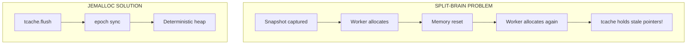
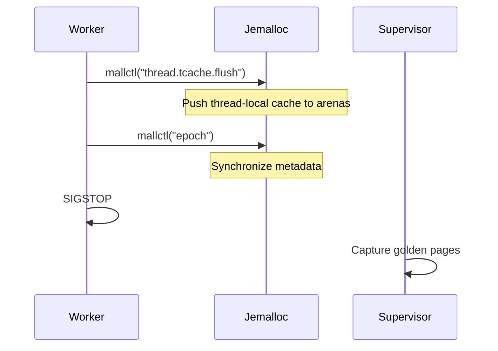
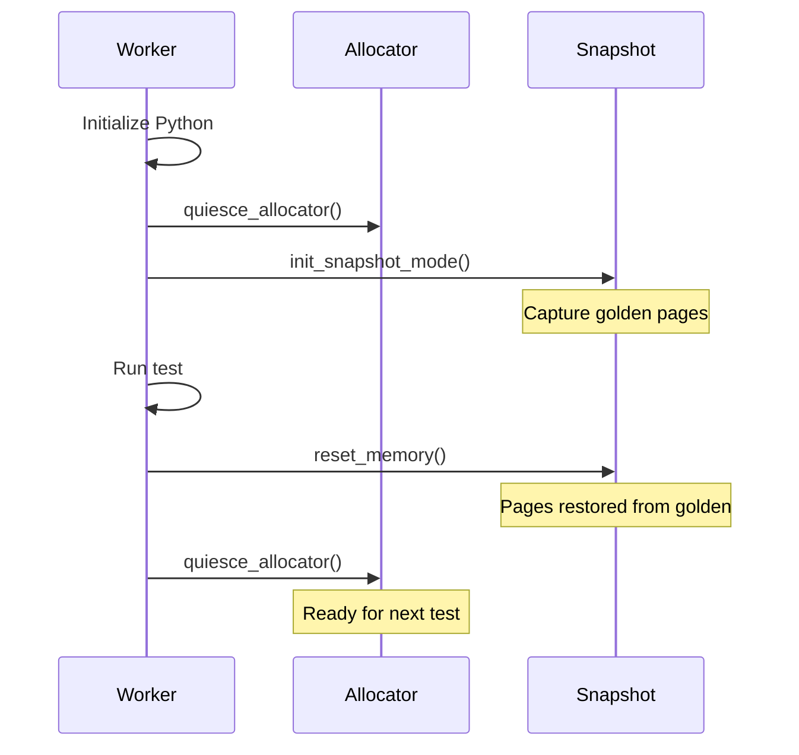

# Allocator (Jemalloc)

The Allocator module integrates Jemalloc to solve the Split-Brain problem.

---

## Overview

Standard allocators (glibc malloc) maintain thread-local caches that become stale after memory snapshot/restore cycles. Jemalloc provides explicit control over these caches.



---

## Global Allocator

```rust
use tikv_jemallocator::Jemalloc;

#[global_allocator]
#[cfg(all(not(target_env = "msvc"), not(test)))]
static GLOBAL: Jemalloc = Jemalloc::default();
```

### Conditional Compilation

Jemalloc is disabled during `cargo test` to prevent instability on WSL2:

```rust
#[cfg(all(not(target_env = "msvc"), not(test)))]
```

---

## Quiesce Sequence

Before capturing a snapshot, the worker must quiesce the allocator:



### tcache Flush

```rust
pub fn flush_tcache() {
    unsafe {
        tikv_jemalloc_sys::mallctl(
            c"thread.tcache.flush".as_ptr(),
            std::ptr::null_mut(),
            std::ptr::null_mut(),
            std::ptr::null(),
            0,
        );
    }
}
```

This pushes all thread-local free list entries back to global arenas.

### Epoch Sync

```rust
pub fn sync_epoch() {
    let mut epoch: u64 = 0;
    let mut len = std::mem::size_of::<u64>();
    unsafe {
        tikv_jemalloc_sys::mallctl(
            c"epoch".as_ptr(),
            &mut epoch as *mut _ as *mut _,
            &mut len,
            &epoch as *const _ as *const _,
            len,
        );
    }
}
```

This advances the jemalloc epoch, forcing metadata synchronization.

### Combined Function

```rust
pub fn quiesce_allocator() {
    flush_tcache();
    sync_epoch();
}
```

---

## Why Jemalloc?

| Feature       | glibc malloc  | Jemalloc                         |
| :------------ | :------------ | :------------------------------- |
| tcache flush  | Not exposed   | `mallctl("thread.tcache.flush")` |
| Epoch sync    | Not available | `mallctl("epoch")`               |
| Determinism   | Poor          | Excellent                        |
| Fragmentation | High          | Low                              |

---

## Runtime Configuration

For production, set environment variables:

```bash
export MALLOC_CONF="background_thread:false,dirty_decay_ms:0,muzzy_decay_ms:0"
```

| Option              | Value | Purpose                      |
| :------------------ | :---- | :--------------------------- |
| `background_thread` | false | Disable background purging   |
| `dirty_decay_ms`    | 0     | Immediate dirty page purging |
| `muzzy_decay_ms`    | 0     | Immediate muzzy page purging |

---

## Verification

```rust
pub fn verify_jemalloc_active() -> bool {
    let mut version: *const libc::c_char = std::ptr::null();
    let mut len = std::mem::size_of::<*const libc::c_char>();

    let result = unsafe {
        tikv_jemalloc_sys::mallctl(
            c"version".as_ptr(),
            &mut version as *mut _ as *mut _,
            &mut len,
            std::ptr::null(),
            0,
        )
    };

    if result == 0 && !version.is_null() {
        let version_str = unsafe { CStr::from_ptr(version) };
        eprintln!("[allocator] Jemalloc version: {:?}", version_str);
        true
    } else {
        false
    }
}
```

---

## Integration with Snapshot



---

## ELF Parsing

For precise libpython segment identification, Tach uses `goblin`:

```rust
fn find_libpython_segments(path: &Path, base: usize) -> Vec<AlignedSegment> {
    let data = std::fs::read(path)?;
    let elf = goblin::elf::Elf::parse(&data)?;

    elf.program_headers
        .iter()
        .filter(|ph| {
            ph.p_type == goblin::elf::program_header::PT_LOAD
                && (ph.p_flags & goblin::elf::program_header::PF_W) != 0
        })
        .map(|ph| AlignedSegment {
            start: base + ph.p_vaddr as usize,
            end: base + ph.p_vaddr as usize + ph.p_memsz as usize,
            description: "libpython data/bss".into(),
        })
        .collect()
}
```

This ensures Python's small-int cache and singletons (None, True, False) are included in snapshots.

---

## Cargo Dependencies

```toml
[dependencies]
tikv-jemallocator = "0.6"
tikv-jemalloc-sys = { version = "0.6", features = ["stats"] }
goblin = "0.10"
```

---

## Related Documentation

- [Physics Engine](snapshot.md) - Memory snapshot details
- [Zygote Lifecycle](zygote.md) - When quiesce is called
- [Troubleshooting](../troubleshooting.md) - Jemalloc build issues
