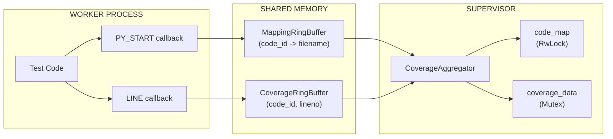
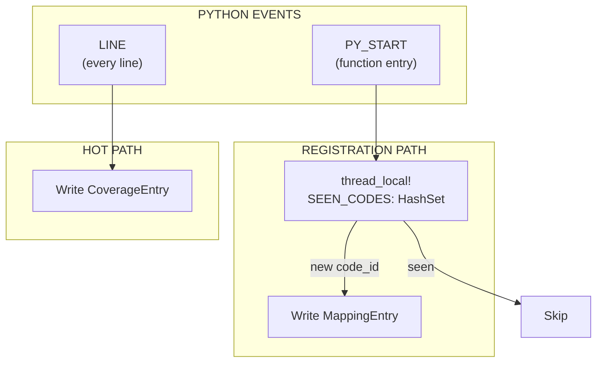
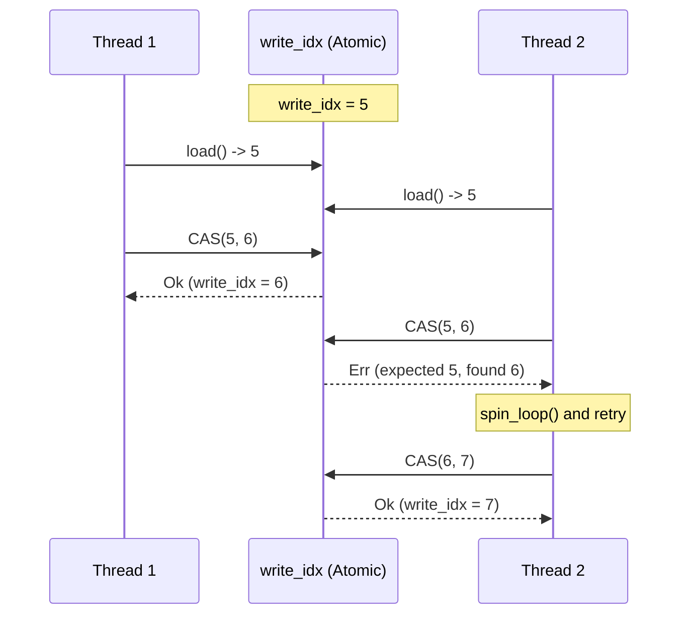
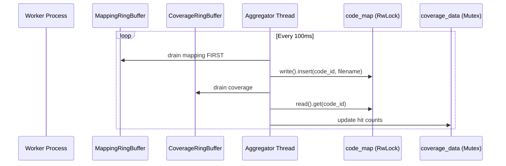

# Coverage System

Zero-overhead coverage collection using PEP 669 `sys.monitoring` with lock-free ring buffers.

---

## Overview



**Key Components:**

- **PEP 669 `sys.monitoring`** (Python 3.12+) for event callbacks
- **Dual ring buffers** with lock-free CAS loops
- **RwLock** for read-heavy code_map access
- **Mutex poisoning recovery** for panic resilience

---

## Data Structures

### RingBufferHeader (64 bytes, cache-line aligned)

```rust
#[repr(C, align(64))]
pub struct RingBufferHeader {
    pub write_idx: AtomicU64,      // Worker increments atomically
    pub read_idx: AtomicU64,       // Supervisor increments
    pub capacity: u64,
    pub overflow_count: AtomicU64, // Entries dropped when full
    _padding: [u8; 32],
}
```

### CoverageEntry (16 bytes)

```rust
#[repr(C, align(16))]
pub struct CoverageEntry {
    pub code_id: u64,  // Python code object address
    pub lineno: u32,
    pub flags: u32,    // Reserved: LINE/CALL/RETURN bits
}
```

### MappingEntry (256 bytes)

```rust
#[repr(C, align(8))]
pub struct MappingEntry {
    pub code_id: u64,
    pub filename_len: u16,
    pub _padding: [u8; 6],
    pub filename: [u8; 240],  // Truncated from LEFT if > 240 bytes
}
```

---

## Buffer Configuration

| Buffer   | Entry Size | Capacity | Total Size |
| :------- | :--------- | :------- | :--------- |
| Coverage | 16 bytes   | 262,144  | ~4 MB      |
| Mapping  | 256 bytes  | 8,192    | ~2 MB      |

```rust
pub const DEFAULT_CAPACITY: usize = 262_144;  // Coverage entries
pub const MAPPING_CAPACITY: usize = 8_192;    // Mapping entries
pub const HEADER_SIZE: usize = 64;
```

---

## Dual-Buffer Architecture



**Why Two Buffers?** PY_START events are infrequent with large entries (256B), LINE events are frequent with small entries (16B). Separation prevents mapping entries from consuming coverage buffer space.

---

## Lock-Free CAS Loop

The CAS (Compare-And-Swap) loop prevents TOCTOU races by atomically checking capacity AND reserving a slot:

```rust
#[inline]
pub fn write(&self, entry: CoverageEntry) -> bool {
    let header = self.header();
    loop {
        let write = header.write_idx.load(Ordering::Acquire);
        let read = header.read_idx.load(Ordering::Acquire);

        if write.wrapping_sub(read) >= header.capacity {
            header.overflow_count.fetch_add(1, Ordering::Relaxed);
            return false;
        }

        match header.write_idx.compare_exchange_weak(
            write, write.wrapping_add(1), Ordering::AcqRel, Ordering::Relaxed
        ) {
            Ok(_) => {
                let slot = (write % self.capacity as u64) as usize;
                unsafe { std::ptr::write_volatile(self.entries_ptr().add(slot), entry); }
                return true;
            }
            Err(_) => { std::hint::spin_loop(); continue; }
        }
    }
}
```



**Invariants:** No slot double-allocation, no buffer overflow, lock-free progress guarantee.

**spin_loop():** Emits `PAUSE` (x86) or `YIELD` (ARM) to reduce power consumption during retry.

---

## RwLock for code_map

The `code_map` uses RwLock for read-heavy access (writes are infrequent, reads happen for every coverage entry):

```rust
pub struct CoverageAggregator {
    data: Arc<Mutex<CoverageData>>,
    code_map: Arc<RwLock<HashMap<u64, String>>>,  // Read-heavy
    stop_flag: Arc<AtomicBool>,
    thread_handle: Option<JoinHandle<()>>,
}
```

```rust
// WRITE: Populating from mapping buffer
let mut guard = code_map.write().unwrap_or_else(|e| e.into_inner());

// READ: Resolving coverage entries (concurrent readers allowed)
let guard = code_map.read().unwrap_or_else(|e| e.into_inner());
```

---

## Mutex Poisoning Recovery

When a thread panics while holding a lock, it becomes "poisoned". Tach recovers using:

```rust
let guard = mutex.lock().unwrap_or_else(|e| e.into_inner());
```

This extracts the guard from `PoisonError`, allowing coverage collection to continue despite test panics.

---

## Performance Optimizations

1. **Zero-Copy Extraction:** `take_data()` uses `std::mem::take()` to move coverage data without cloning.
2. **Pre-allocated HashSet:** `SEEN_CODES` (thread-local) starts with 1024 capacity to avoid hot-path reallocations.
3. **Batch Processing:** Aggregator drains in batches (4096 coverage, 1024 mapping) to amortize lock acquisition.
4. **Volatile Writes:** Ensures visibility across processes without compiler optimization interference.

---

## Ring Buffer Architecture

- **Shared Memory:** Created via `memfd_create` with `MAP_SHARED`.
- **Index Wrapping:** Uses wrapping arithmetic to handle `u64` overflow.
- **Memory Layout:** 64-byte header followed by entry array.



---

## Python Callbacks & FFI

- **PY_START:** Registers `code_id -> filename` once per function.
- **LINE:** Records `(code_id, lineno)` for every line executed.
- **GIL Discipline:** All FFI functions (`record_line`, `record_py_start`) release the GIL using `py.detach()` before shared memory access.

---

## Filename Truncation

Long paths are truncated from the **LEFT** to preserve filenames while fitting in 240-byte `MappingEntry` slots. Truncation respects UTF-8 boundaries.

---

## Memory Exclusion

Coverage buffers (`memfd:tach_coverage`, `memfd:tach_mapping`) are excluded from `userfaultfd` snapshots to ensure coverage persists across memory resets.

---

## Performance Metrics

| Metric        | Value |
| :------------ | :---- |
| Overhead      | < 1%  |
| Write Latency | ~10ns |
| Poll Interval | 100ms |

---

## Test Coverage

Validated by comprehensive unit tests for alignment/wrapping and stress tests for CAS loop concurrency (up to 16 threads). Run `cargo test --lib coverage::` to execute.

---

## Related Documentation

- [Physics Engine](snapshot.md) - Snapshot exclusion
- [API Reference](../api-reference.md) - FFI signatures
- [Configuration](../configuration.md) - Coverage options
