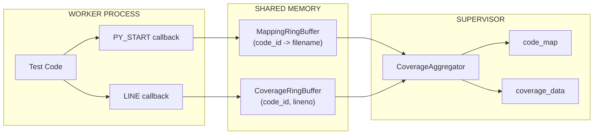
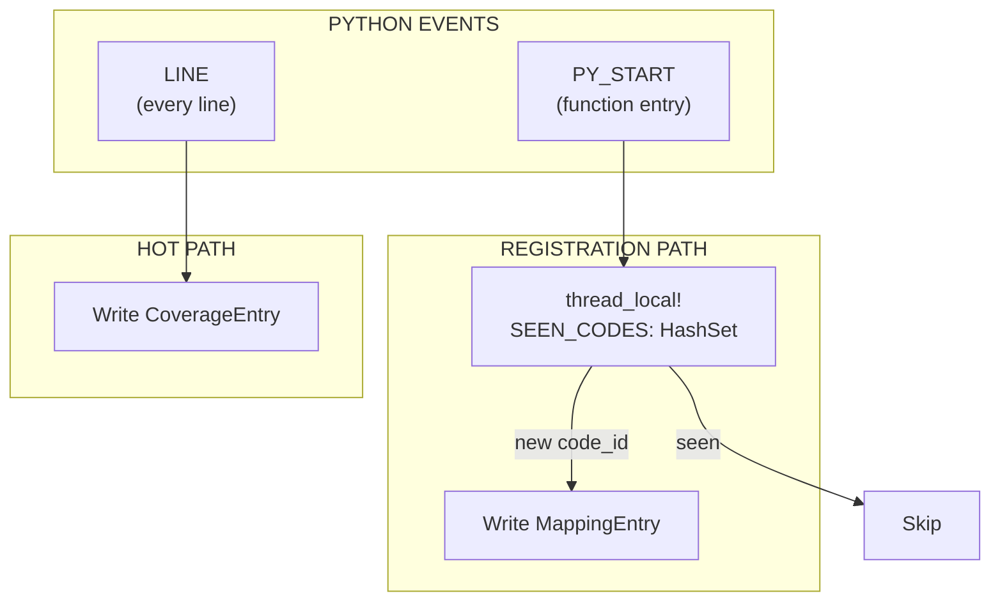
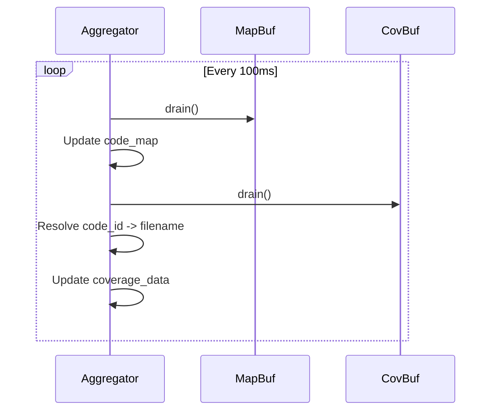

# Coverage System

The Coverage System implements PEP 669 `sys.monitoring` with lock-free ring buffers.

---

## Overview

Tach provides zero-overhead coverage collection using:

1. **PEP 669 `sys.monitoring`** (Python 3.12+) for event callbacks
2. **Dual ring buffers** in shared memory for lock-free data transfer
3. **Aggregator thread** for periodic buffer draining



---

## Data Structures

### RingBufferHeader

64-byte aligned header for cache-line efficiency.

```rust
#[repr(C, align(64))]
pub struct RingBufferHeader {
    pub write_idx: AtomicU64,      // Producer index
    pub read_idx: AtomicU64,       // Consumer index
    pub capacity: u64,             // Number of entries
    pub overflow_count: AtomicU64, // Dropped entries
    _padding: [u8; 32],            // Pad to 64 bytes
}
```

### CoverageEntry

16-byte aligned entry for line events.

```rust
#[repr(C, align(16))]
pub struct CoverageEntry {
    pub code_id: u64,   // id(code_object)
    pub lineno: u32,    // Line number
    pub flags: u32,     // Reserved
}
```

### MappingEntry

256-byte entry for code registration.

```rust
#[repr(C, align(8))]
pub struct MappingEntry {
    pub code_id: u64,
    pub filename_len: u16,
    pub _padding: [u8; 6],
    pub filename: [u8; 240],
}
```

---

## Buffer Configuration

| Buffer   | Entry Size | Capacity | Total Size | Purpose           |
| :------- | :--------- | :------- | :--------- | :---------------- |
| Coverage | 16 bytes   | 262,144  | ~4 MB      | Line events       |
| Mapping  | 256 bytes  | 8,192    | ~2 MB      | Code registration |

---

## Dual-Buffer Architecture



### Why Two Buffers?

1. **PY_START** events are infrequent (once per function)
2. **LINE** events are very frequent (every line)
3. Mapping entries are large (256 bytes for filename)
4. Coverage entries are small (16 bytes)

Separating them prevents large mapping entries from consuming coverage buffer space.

---

## Lock-Free Algorithm

### Write Path (Worker)

```rust
fn write_entry(&self, entry: CoverageEntry) -> bool {
    let write = self.header.write_idx.load(Ordering::Acquire);
    let read = self.header.read_idx.load(Ordering::Acquire);

    // Check if full
    if write.wrapping_sub(read) >= self.header.capacity {
        self.header.overflow_count.fetch_add(1, Ordering::Relaxed);
        return false;
    }

    // Reserve slot
    let slot = self.header.write_idx.fetch_add(1, Ordering::AcqRel);
    let index = (slot % self.header.capacity) as usize;

    // Write entry
    unsafe {
        std::ptr::write_volatile(
            self.entries.add(index),
            entry,
        );
    }
    true
}
```

### Read Path (Aggregator)

```rust
fn drain(&self) -> Vec<CoverageEntry> {
    let mut entries = Vec::new();
    loop {
        let write = self.header.write_idx.load(Ordering::Acquire);
        let read = self.header.read_idx.load(Ordering::Acquire);

        if read >= write {
            break;
        }

        let slot = self.header.read_idx.fetch_add(1, Ordering::AcqRel);
        let index = (slot % self.header.capacity) as usize;

        let entry = unsafe {
            std::ptr::read_volatile(self.entries.add(index))
        };
        entries.push(entry);
    }
    entries
}
```

---

## Aggregator Thread



### Critical: Drain Order

Mapping buffer is drained **FIRST** to ensure `code_map` is populated before coverage entries are resolved.

```rust
impl CoverageAggregator {
    fn poll(&mut self) {
        // FIRST: Drain mapping buffer
        for entry in self.mapping_buffer.drain() {
            let filename = String::from_utf8_lossy(&entry.filename[..entry.filename_len as usize]);
            self.code_map.insert(entry.code_id, filename.to_string());
        }

        // SECOND: Drain coverage buffer
        for entry in self.coverage_buffer.drain() {
            let filename = self.code_map
                .get(&entry.code_id)
                .cloned()
                .unwrap_or_else(|| format!("<code:{:x}>", entry.code_id));

            let key = (filename, entry.lineno);
            *self.coverage_data.entry(key).or_insert(0) += 1;
        }
    }
}
```

---

## Python Callbacks

### PY_START Callback

```python
def _coverage_py_start_callback(code, offset):
    code_id = id(code)

    # Thread-local deduplication
    if code_id in _SEEN_CODES:
        return sys.monitoring.DISABLE

    _SEEN_CODES.add(code_id)
    tach_rust.record_py_start(code_id, code.co_filename)
    return sys.monitoring.DISABLE  # Only need to register once
```

### LINE Callback

```python
def _coverage_line_callback(code, line_number):
    tach_rust.record_line(id(code), line_number)
    # No return value - continue monitoring
```

---

## FFI Functions

### record_line

Hot path - writes to coverage buffer.

```rust
#[pyfunction]
fn record_line(py: Python, code_id: u64, lineno: u32) {
    py.allow_threads(|| {
        COVERAGE_BUFFER.write(CoverageEntry {
            code_id,
            lineno,
            flags: 0,
        });
    });
}
```

### record_py_start

Registration path - writes to mapping buffer.

```rust
#[pyfunction]
fn record_py_start(py: Python, code_id: u64, filename: String) {
    py.allow_threads(|| {
        MAPPING_BUFFER.write(MappingEntry::new(code_id, &filename));
    });
}
```

---

## GIL Discipline

Both callbacks release the GIL before accessing shared memory:

```rust
py.allow_threads(|| {
    // Shared memory access here
});
```

This prevents contention between the Python interpreter and the aggregator thread.

---

## Filename Truncation

Long filenames are truncated from the **LEFT** to preserve the actual filename:

```rust
fn truncate_filename(filename: &str, max_len: usize) -> &str {
    if filename.len() <= max_len {
        return filename;
    }

    let bytes = filename.as_bytes();
    let start = filename.len() - max_len;

    // Find valid UTF-8 boundary
    let mut safe_start = start;
    while safe_start < bytes.len() && (bytes[safe_start] & 0b1100_0000) == 0b1000_0000 {
        safe_start += 1;
    }

    &filename[safe_start..]
}
```

Example: `/very/long/path/to/project/src/module.py` becomes `project/src/module.py`

---

## Memory Exclusion

Coverage buffers must survive memory resets:

```rust
fn should_snapshot(region: &MemoryRegion) -> bool {
    if region.name.contains("tach_coverage") ||
       region.name.contains("tach_mapping") {
        return false;  // Exclude from snapshot
    }
    // ...
}
```

---

## Performance

| Metric        | Value        |
| :------------ | :----------- |
| Overhead      | < 1%         |
| Write latency | ~10ns        |
| Drain batch   | 4096 entries |
| Poll interval | 100ms        |

---

## Related Documentation

- [Physics Engine](snapshot.md) - Buffer exclusion from snapshots
- [API Reference](../api-reference.md) - FFI function signatures
- [Configuration](../configuration.md) - Coverage options
