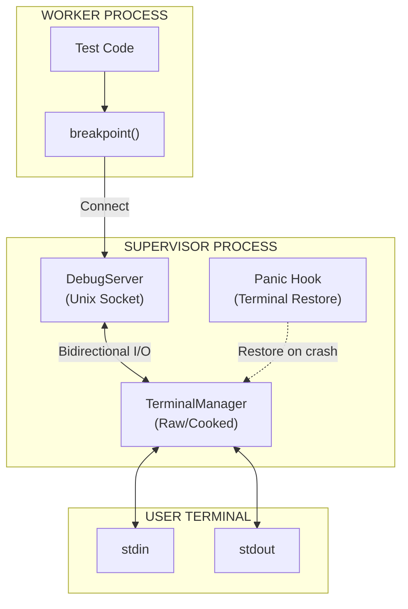
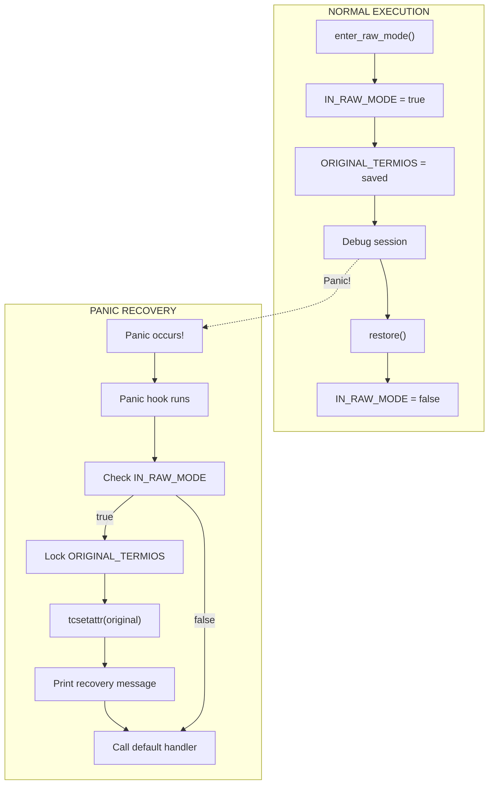
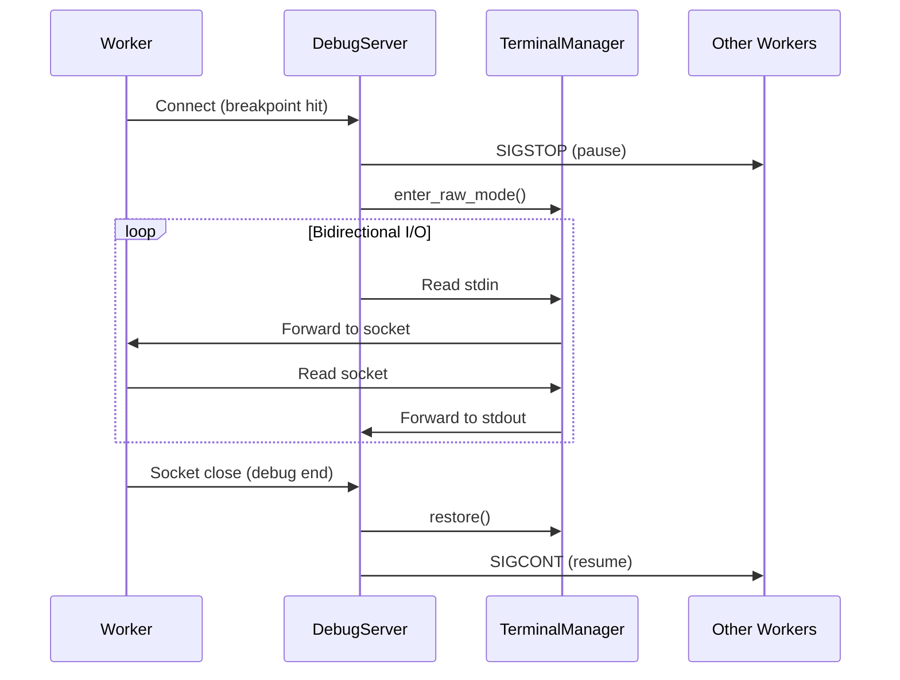

# TTY Proxy for Interactive Debugging

The Debugger module enables `breakpoint()` and `pdb` inside isolated, parallel workers by implementing a bidirectional terminal tunnel between the Supervisor and Workers.

---

## Overview

When a worker hits a breakpoint, the debugger:

1. Pauses all other workers (SIGSTOP) to prevent log interleaving
2. Switches the terminal to Raw mode for character-by-character I/O
3. Tunnels stdin/stdout bidirectionally through a Unix socket
4. Restores Cooked mode and resumes workers (SIGCONT) when debugging ends



---

## Security Fix: Static Mut Elimination

### The Problem: Unsafe Static Mutable State

The original implementation used `static mut` to store the original terminal settings:

```rust
// BAD: Unsafe static mut - causes undefined behavior
static mut ORIGINAL_TERMIOS: Option<Termios> = None;

// Accessing requires unsafe blocks everywhere
unsafe {
    ORIGINAL_TERMIOS = Some(termios);
}
```

This pattern is **fundamentally unsafe** because:

| Issue                    | Description                                                                      |
| :----------------------- | :------------------------------------------------------------------------------- |
| **Data Races**           | Multiple threads accessing `static mut` simultaneously causes undefined behavior |
| **No Synchronization**   | No memory barriers or locks protect the data                                     |
| **Compiler Assumptions** | The compiler may optimize reads/writes incorrectly                               |
| **Undefined Behavior**   | Even single-threaded access can cause UB if the compiler reorders operations     |

### The Solution: Thread-Safe Mutex Pattern

The fix replaces `static mut` with a thread-safe `Mutex<Option<Termios>>`:

```rust
// GOOD: Thread-safe via Mutex
static ORIGINAL_TERMIOS: Mutex<Option<Termios>> = Mutex::new(None);
```

This pattern provides:

| Benefit             | Description                                  |
| :------------------ | :------------------------------------------- |
| **Thread Safety**   | Mutex ensures exclusive access               |
| **Memory Ordering** | Lock/unlock provides proper memory barriers  |
| **No Unsafe**       | All access is through safe Rust APIs         |
| **Panic Safety**    | Mutex poisoning detects panics during access |

### Why Not OnceLock?

The code includes a comment explaining why `OnceLock` cannot be used:

```rust
/// Saved original termios for panic recovery
/// Uses Mutex for thread-safe access without unsafe static mut
/// (Termios contains RefCell which is not Sync, so OnceLock cannot be used)
static ORIGINAL_TERMIOS: Mutex<Option<Termios>> = Mutex::new(None);
```

`OnceLock<T>` requires `T: Sync`, but `Termios` from the `nix` crate contains a `RefCell` internally, which is not `Sync`. Therefore, `Mutex` is the correct choice.

### Safe Access Pattern

Reading from the mutex:

```rust
// Thread-safe read via Mutex
if let Ok(guard) = ORIGINAL_TERMIOS.lock() {
    if let Some(ref original) = *guard {
        let stdin = io::stdin();
        let _ = tcsetattr(&stdin, SetArg::TCSANOW, original);
    }
}
```

Writing to the mutex:

```rust
// Thread-safe write via Mutex
if let Ok(mut guard) = ORIGINAL_TERMIOS.lock() {
    *guard = Some(original.clone());
}
```

---

## Data Structures

### TerminalMode

```rust
#[derive(Debug, Clone, Copy, PartialEq)]
pub enum TerminalMode {
    /// Normal line-buffered mode with echo
    Cooked,
    /// Character-by-character, no echo, no signal processing
    Raw,
}
```

### TerminalManager

Manages terminal state transitions and ensures safe restoration:

```rust
pub struct TerminalManager {
    stdin_fd: RawFd,
    original_termios: Option<Termios>,
    current_mode: TerminalMode,
}
```

### DebugServer

Listens for worker connections on a Unix socket:

```rust
pub struct DebugServer {
    socket_path: PathBuf,  // /tmp/tach_debug_{pid}.sock
    listener: UnixListener,
}
```

---

## Terminal Mode Management

### Raw Mode

Raw mode disables terminal processing for direct character I/O:

```rust
pub fn enter_raw_mode(&mut self) -> Result<()> {
    if self.current_mode == TerminalMode::Raw {
        return Ok(());
    }

    let mut raw = self.original_termios.clone()
        .context("No original termios saved")?;

    // cfmakeraw disables all the flags we need:
    // - ICANON, ECHO, ECHOE, ECHOK, ECHONL, ISIG, IEXTEN
    // - BRKINT, ICRNL, INPCK, ISTRIP, IXON
    // - OPOST
    // - CSIZE, PARENB (sets CS8)
    cfmakeraw(&mut raw);

    let stdin = io::stdin();
    tcsetattr(&stdin, SetArg::TCSANOW, &raw)
        .context("Failed to set raw mode")?;

    IN_RAW_MODE.store(true, Ordering::SeqCst);
    self.current_mode = TerminalMode::Raw;

    Ok(())
}
```

### Cooked Mode Restoration

```rust
pub fn restore(&mut self) -> Result<()> {
    if self.current_mode == TerminalMode::Cooked {
        return Ok(());
    }

    if let Some(ref original) = self.original_termios {
        let stdin = io::stdin();
        tcsetattr(&stdin, SetArg::TCSANOW, original)
            .context("Failed to restore terminal")?;
    }

    IN_RAW_MODE.store(false, Ordering::SeqCst);
    self.current_mode = TerminalMode::Cooked;

    Ok(())
}
```

### Drop Implementation

The `TerminalManager` implements `Drop` to ensure terminal restoration:

```rust
impl Drop for TerminalManager {
    fn drop(&mut self) {
        // Best-effort restoration on drop
        let _ = self.restore();
    }
}
```

---

## Panic Hook Installation

### The Problem

If the program panics while in Raw mode, the terminal is left in an unusable state:

- No echo (you cannot see what you type)
- No line buffering (Enter does not work normally)
- No signal processing (Ctrl+C does not work)

### The Solution

A panic hook is installed at program startup to restore the terminal:

```rust
/// Install panic hook to restore terminal on crash
///
/// CRITICAL: Without this, a panic in raw mode leaves the terminal unusable.
/// Call this once at program startup.
pub fn install_panic_hook() {
    let default_hook = std::panic::take_hook();

    std::panic::set_hook(Box::new(move |info| {
        // Attempt to restore terminal if we were in raw mode
        if IN_RAW_MODE.load(Ordering::SeqCst) {
            // Thread-safe read via Mutex
            if let Ok(guard) = ORIGINAL_TERMIOS.lock() {
                if let Some(ref original) = *guard {
                    let stdin = io::stdin();
                    let _ = tcsetattr(&stdin, SetArg::TCSANOW, original);
                }
            }
            IN_RAW_MODE.store(false, Ordering::SeqCst);
            eprintln!("\n[tach] Terminal restored after panic.\n");
        }

        // Call the default panic handler
        default_hook(info);
    }));
}
```

### How It Works



### Global State for Panic Recovery

Two global variables enable panic recovery:

```rust
/// Global flag to track if we're in raw mode (for panic hook)
static IN_RAW_MODE: AtomicBool = AtomicBool::new(false);

/// Saved original termios for panic recovery
/// Uses Mutex for thread-safe access without unsafe static mut
static ORIGINAL_TERMIOS: Mutex<Option<Termios>> = Mutex::new(None);
```

| Variable           | Type                     | Purpose                                  |
| :----------------- | :----------------------- | :--------------------------------------- |
| `IN_RAW_MODE`      | `AtomicBool`             | Fast check if terminal needs restoration |
| `ORIGINAL_TERMIOS` | `Mutex<Option<Termios>>` | Thread-safe storage of original settings |

---

## DebugServer Implementation

### Socket Creation

```rust
pub fn new() -> Result<Self> {
    let pid = std::process::id();
    let socket_path = PathBuf::from(format!("/tmp/tach_debug_{}.sock", pid));

    // Clean up any stale socket file
    if socket_path.exists() {
        fs::remove_file(&socket_path)
            .context("Failed to remove stale debug socket")?;
    }

    let listener = UnixListener::bind(&socket_path)
        .context("Failed to bind debug socket")?;

    // Set non-blocking so we can check for connections without blocking scheduler
    listener.set_nonblocking(true)
        .context("Failed to set socket non-blocking")?;

    eprintln!("[debugger] Listening on {}", socket_path.display());

    Ok(Self { socket_path, listener })
}
```

### Non-Blocking Accept

```rust
/// Check if a worker is waiting to connect (non-blocking)
pub fn try_accept(&self) -> Option<UnixStream> {
    match self.listener.accept() {
        Ok((stream, _)) => Some(stream),
        Err(ref e) if e.kind() == io::ErrorKind::WouldBlock => None,
        Err(e) => {
            eprintln!("[debugger] Accept error: {}", e);
            None
        }
    }
}
```

### Debug Session Handling



### Worker Pause/Resume

Other workers are paused during debugging to prevent log interleaving:

```rust
/// Pause all workers by sending SIGSTOP
fn pause_workers(worker_pids: &[i32], debug_worker_pid: Option<i32>) {
    for &pid in worker_pids {
        if Some(pid) == debug_worker_pid {
            continue; // Don't stop the worker we're debugging!
        }
        if pid > 0 {
            let _ = kill(Pid::from_raw(pid), Signal::SIGSTOP);
        }
    }
}

/// Resume all paused workers by sending SIGCONT
fn resume_workers(worker_pids: &[i32]) {
    for &pid in worker_pids {
        if pid > 0 {
            let _ = kill(Pid::from_raw(pid), Signal::SIGCONT);
        }
    }
}
```

### Socket Cleanup

```rust
impl Drop for DebugServer {
    fn drop(&mut self) {
        self.cleanup();
    }
}

fn cleanup(&self) {
    if self.socket_path.exists() {
        let _ = fs::remove_file(&self.socket_path);
    }
}
```

---

## Integration with Lifecycle

The debugger integrates with the lifecycle module via a global flag:

```rust
// In handle_session():
crate::lifecycle::IS_DEBUGGING.store(true, Ordering::SeqCst);

// ... debug session ...

crate::lifecycle::IS_DEBUGGING.store(false, Ordering::SeqCst);
```

This flag affects signal handling - SIGINT is ignored during debugging because Raw mode handles Ctrl+C directly (as byte 0x03).

---

## Thread Safety Summary

| Component          | Synchronization          | Notes                                    |
| :----------------- | :----------------------- | :--------------------------------------- |
| `IN_RAW_MODE`      | `AtomicBool`             | Lock-free, fast check                    |
| `ORIGINAL_TERMIOS` | `Mutex<Option<Termios>>` | Thread-safe, handles non-Sync inner type |
| `DebugServer`      | Single-threaded          | Only supervisor uses it                  |
| `TerminalManager`  | Instance-based           | Created per session                      |

---

## Error Handling

| Error                               | Cause             | Recovery                     |
| :---------------------------------- | :---------------- | :--------------------------- |
| `Failed to get terminal attributes` | stdin not a TTY   | Return error, skip debugging |
| `Failed to set raw mode`            | Permission denied | Return error, skip debugging |
| `Failed to bind debug socket`       | Port in use       | Clean stale socket, retry    |
| Panic in raw mode                   | Any panic         | Panic hook restores terminal |

---

## Usage Example

```rust
use tach::reporting::debugger::{DebugServer, install_panic_hook};

fn main() -> Result<()> {
    // Install panic hook at startup (once)
    install_panic_hook();

    // Create debug server
    let debug_server = DebugServer::new()?;

    // In scheduler loop:
    if let Some(stream) = debug_server.try_accept() {
        let worker_pids = get_all_worker_pids();
        let debug_worker_pid = get_connecting_worker_pid();

        debug_server.handle_session(
            stream,
            &worker_pids,
            Some(debug_worker_pid),
        )?;
    }

    Ok(())
}
```

---

## Related Documentation

- [Scheduler](scheduler.md) - How the scheduler integrates with the debug server
- [Zygote Lifecycle](zygote.md) - Worker process management
- [Isolation](isolation.md) - How workers are isolated
