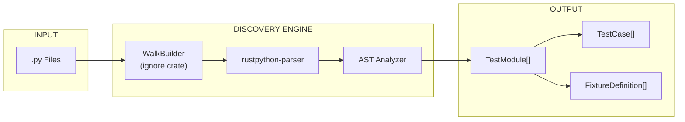
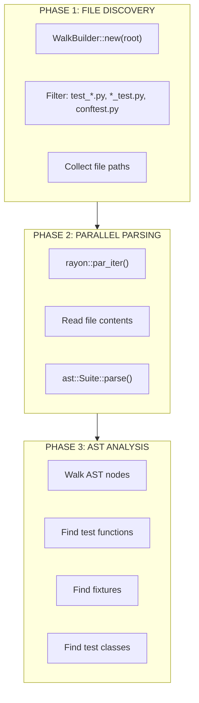
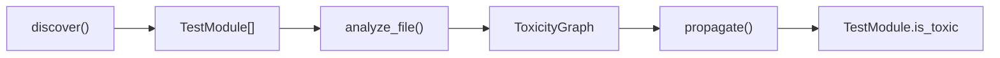

# Discovery Engine

The Discovery Engine performs static AST analysis to find tests without executing Python code.

---

## Overview

Tach uses `rustpython-parser` to parse Python source files into Abstract Syntax Trees (ASTs). This approach is:

- **Fast**: Parallel parsing with `rayon`
- **Safe**: No code execution during discovery
- **Accurate**: Full Python 3.10+ syntax support



---

## Data Structures

### FixtureScope

Defines the lifecycle of a pytest fixture.

```rust
pub enum FixtureScope {
    Function,  // Default - new instance per test
    Class,     // Shared within test class
    Module,    // Shared within test file
    Session,   // Shared across entire run
}
```

### HookDefinition

Represents a pytest hook discovered in conftest.py files.

```rust
pub struct HookDefinition {
    pub name: String,
    pub line_number: usize,
}
```

Hook detection is limited to conftest.py files only (not test files).

### FixtureDefinition

Represents a `@pytest.fixture` decorated function.

```rust
pub struct FixtureDefinition {
    pub name: String,
    pub scope: FixtureScope,
    pub dependencies: Vec<String>,
    pub params: Option<Vec<String>>,
    pub class_scope: Option<String>,
    pub autouse: bool,
}
```

| Field          | Description                                                    |
| :------------- | :------------------------------------------------------------- |
| `name`         | Fixture function name                                          |
| `scope`        | Lifecycle scope (function/class/module/session)                |
| `dependencies` | Other fixtures this fixture requires                           |
| `params`       | Static literal parameters from `@pytest.fixture(params=[...])` |
| `class_scope`  | If defined inside a class, the class name                      |
| `autouse`      | Whether the fixture is automatically applied to all tests      |

### TestCase

Represents an individual test function or method.

```rust
pub struct TestCase {
    pub name: String,
    pub dependencies: Vec<String>,
    pub is_async: bool,
    pub line_number: usize,
    pub parametrized_args: Vec<String>,
    pub timeout_secs: Option<u64>,
    pub markers: Vec<String>,
}
```

| Field               | Description                                                                  |
| :------------------ | :--------------------------------------------------------------------------- |
| `name`              | Test name (e.g., `test_func` or `TestClass::test_method`)                    |
| `dependencies`      | Fixtures required by the test                                                |
| `is_async`          | Whether it's an `async def`                                                  |
| `line_number`       | 1-indexed line number for reporting                                          |
| `parametrized_args` | Arguments from `@pytest.mark.parametrize` (excluded from fixture resolution) |
| `timeout_secs`      | Per-test timeout from `@pytest.mark.timeout(N)`                              |
| `markers`           | Pytest markers applied to the test (e.g., `slow`, `skip`, `xfail`)           |

### TestModule

Represents a single `.py` file.

```rust
pub struct TestModule {
    pub path: PathBuf,
    pub tests: Vec<TestCase>,
    pub fixtures: Vec<FixtureDefinition>,
    pub hooks: Vec<HookDefinition>,
    pub is_toxic: bool,
}
```

### DiscoveryResult

The aggregate result of a project scan.

```rust
pub struct DiscoveryResult {
    pub modules: Vec<TestModule>,
}
```

---

## Discovery Process



### File Filtering

Files are included if they match:

- `test_*.py` - Test files
- `*_test.py` - Test files (alternate convention)
- `conftest.py` - Fixture files

### Pattern Detection

The analyzer detects:

| Pattern         | Detection Method                             |
| :-------------- | :------------------------------------------- |
| Test functions  | `def test_*` at module level                 |
| Async tests     | `async def test_*`                           |
| Test classes    | `class Test*`                                |
| Test methods    | `def test_*` inside `Test*` class            |
| Fixtures        | `@pytest.fixture` or `@fixture` decorator    |
| Parametrization | `@pytest.mark.parametrize` decorator         |
| Mocking         | `@patch` or `@unittest.mock.patch` decorator |

---

## Key Functions

### discover

Entry point for test discovery.

```rust
pub fn discover(root: &Path) -> Result<DiscoveryResult>
```

Uses `WalkBuilder` to find files and `rayon` to parse them in parallel.

### parse_module

Parses a single Python file.

```rust
fn parse_module(path: &Path) -> Result<TestModule>
```

Reads the file and converts its AST into a `TestModule`.

### analyze_function

Extracts test/fixture data from function definitions and populates the provided vectors.

```rust
fn analyze_function(
    func: &ast::StmtFunctionDef,
    source: &str,
    tests: &mut Vec<TestCase>,
    fixtures: &mut Vec<FixtureDefinition>,
    is_async: bool,
)
```

### extract_injected_args

Identifies arguments that are NOT fixtures.

```rust
fn extract_injected_args(
    decorators: &[ast::Expr],
    func_args: &[String],
) -> Vec<String>
```

Filters out arguments from:

- `@pytest.mark.parametrize("arg1, arg2", [...])`
- `@patch("module.thing")` (injects mock as argument)

---

## Special Handling

### self and cls

Method arguments `self` and `cls` are automatically excluded from fixture resolution.

### Parametrization

```python
@pytest.mark.parametrize("x, y", [(1, 2), (3, 4)])
def test_add(x, y, some_fixture):
    pass
```

Here, `x` and `y` are parametrized args (not fixtures), while `some_fixture` is a fixture dependency.

### Mock Patches

```python
@patch("module.SomeClass")
def test_thing(mock_class, some_fixture):
    pass
```

The first argument (`mock_class`) is injected by `@patch`, not a fixture.

### conftest.py

Fixtures in `conftest.py` files are automatically treated as global fixtures available to all tests in the directory tree.

### TYPE_CHECKING Blocks

Imports inside `if TYPE_CHECKING:` blocks are skipped during toxicity analysis to avoid false positives.

---

## Integration with Toxicity

After discovery, each `TestModule` is analyzed for toxicity:



See [Toxicity Analysis](toxicity.md) for details.

---

## Performance Characteristics

| Metric      | Value                                |
| :---------- | :----------------------------------- |
| Parallelism | All CPU cores via `rayon`            |
| Memory      | O(n) where n = number of files       |
| Complexity  | O(n \* m) where m = average AST size |

---

## Limitations

1. **Dynamic Tests**: Tests generated at runtime (e.g., via `pytest_generate_tests`) are not discovered
2. **Eval/Exec**: Tests defined via `eval()` or `exec()` are not discovered
3. **Namespace Packages**: Directories without `__init__.py` fall back to standard import

---

## Related Documentation

- [Toxicity Analysis](toxicity.md) - How discovered modules are analyzed for safety
- [Fixture Resolver](resolver.md) - How fixture dependencies are resolved
