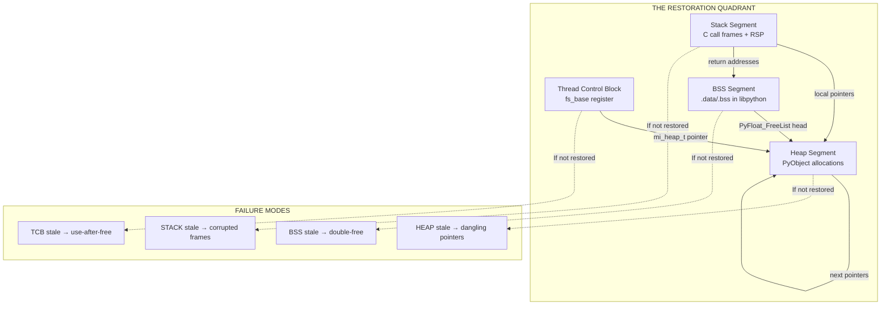
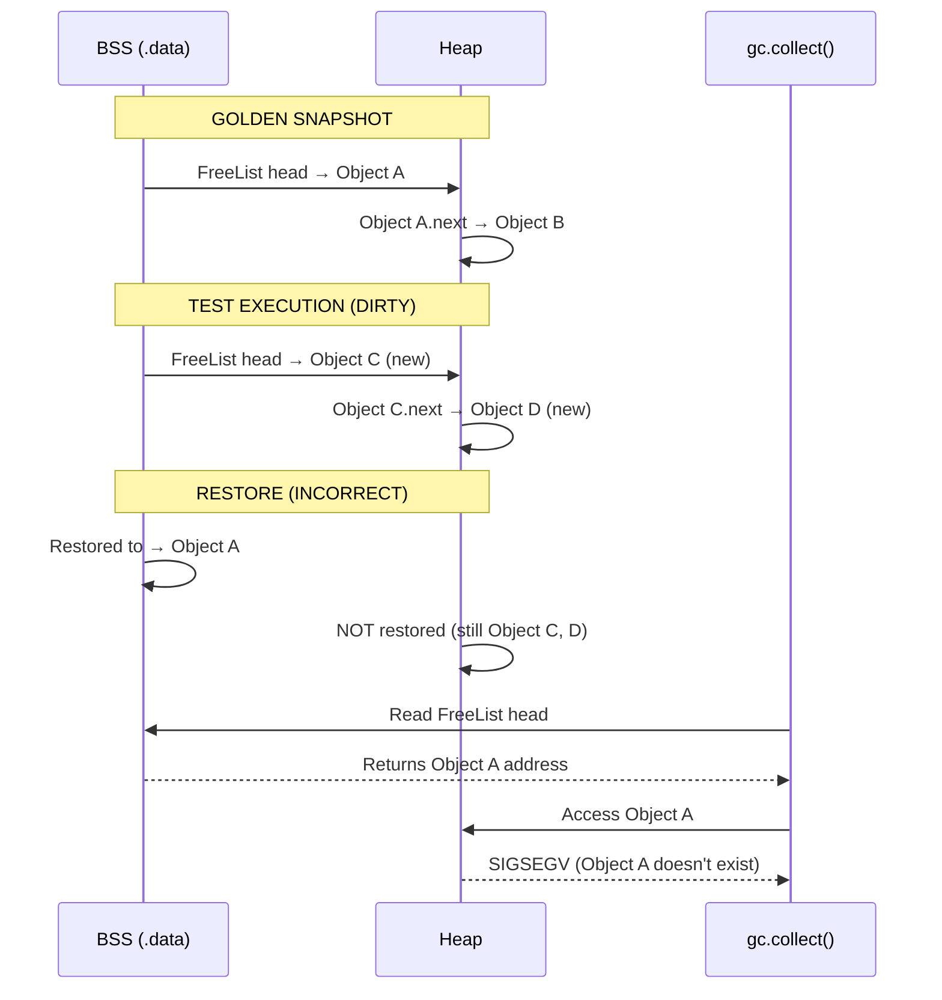
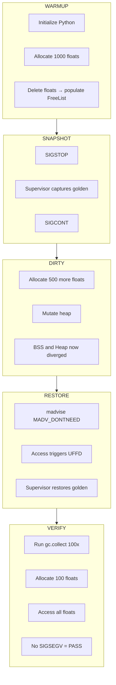
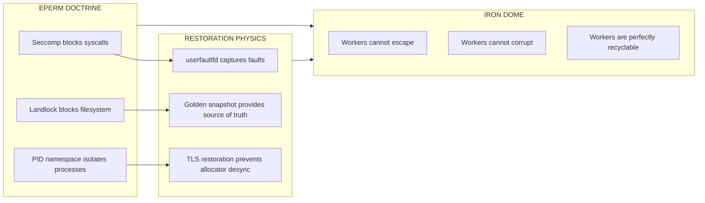
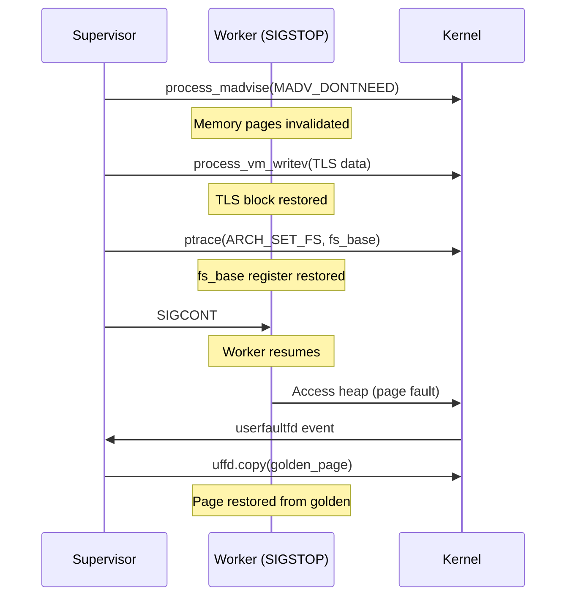

# Internal Architecture: The Physics of Restoration

> **Status**: Physics-Complete (v0.8.0-alpha)
> **Author**: Project Tach Development Team
> **Purpose**: Define restoration invariants and document allocator-specific state locations

---

## Executive Summary

This document bridges the **EPERM Doctrine** (security enforcement) with the **Physics of Restoration** (memory snapshot/restore). It defines the invariants that must hold for successful test isolation and documents the critical memory locations that must be synchronized during restoration.

---

## The Restoration Quadrant

Successful memory restoration requires the synchronization of **four** interdependent memory regions:



### The Four Pillars

| Pillar    | Memory Location             | Contains                            | Restoration Method          |
| --------- | --------------------------- | ----------------------------------- | --------------------------- |
| **TCB**   | `fs_base` register          | TLS pointers (mi_heap_t, mi_tld_t)  | arch_prctl(ARCH_SET_FS)     |
| **BSS**   | libpython .data/.bss        | Free list heads, singletons         | userfaultfd + MADV_DONTNEED |
| **Heap**  | `[heap]` + anonymous maps   | PyObject allocations                | userfaultfd + MADV_DONTNEED |
| **Stack** | `[stack]` in /proc/pid/maps | C call frames, local variables, RSP | userfaultfd + longjmp       |

### Stack Restoration Semantics

The Stack pillar is special because it requires **two-phase restoration**:

1. **Memory Restoration**: userfaultfd restores the stack memory contents (same as Heap/BSS)
2. **Register Restoration**: `longjmp` restores RSP/RBP to point to the correct stack frame

```c
// Phase 1: setjmp captures stack context during golden snapshot
jmp_buf golden_context;
if (setjmp(golden_context) == 0) {
    // First return: capture golden state
    take_snapshot();
} else {
    // Second return: we just restored!
    verify_restoration();
}

// Phase 2: longjmp restores registers after memory is restored
longjmp(golden_context, 1);  // Jumps to setjmp, returns 1
```

**Critical**: `longjmp` only restores **registers** (RSP, RBP, RIP). The actual stack **memory** must already be restored via userfaultfd before longjmp is called.

---

## Restoration Invariants

### Invariant 1: Bit-Perfect Alignment

A successful restore is **NOT** just "no crash." It is a **bit-perfect** alignment of:

| Component | Location                      | Validation                           |
| --------- | ----------------------------- | ------------------------------------ |
| **TCB**   | `fs_base` register            | `self_ptr == fs_base`                |
| **BSS**   | libpython .data/.bss segments | `sha256(restored) == sha256(golden)` |
| **Heap**  | Anonymous mappings + `[heap]` | `sha256(restored) == sha256(golden)` |
| **Stack** | `[stack]` region              | `sha256(restored) == sha256(golden)` |

### Invariant 2: Pointer Consistency

All pointers from BSS → Heap must point to valid, restored objects:

```
BEFORE RESTORE:
  BSS: PyFloat_FreeList → 0x7f1234560000 (heap object A)
  Heap: Object A at 0x7f1234560000, next → Object B

AFTER RESTORE (CORRECT):
  BSS: PyFloat_FreeList → 0x7f1234560000 (SAME address)
  Heap: Object A at 0x7f1234560000 (RESTORED content)

AFTER RESTORE (FAILURE):
  BSS: PyFloat_FreeList → 0x7f1234560000 (old address)
  Heap: 0x7f1234560000 is ZEROED (MADV_DONTNEED zapped it)
  RESULT: Next float allocation follows NULL/garbage pointer → SIGSEGV
```

### Invariant 3: TLS Synchronization

Thread Local Storage must be restored alongside Heap when using allocators that cache state in TLS (mimalloc in Python 3.13+):

```
TCB at fs_base:
  +0x0ad8: mi_heap_t* → points into anonymous heap region
  +0x0ae0: mi_tld_t* → thread-local data
  ...

If Heap is restored but TLS is not:
  mi_heap_t* points to RESTORED memory
  BUT mi_heap_t->pages still references STALE page list
  RESULT: Allocator returns memory that was "freed" in snapshot
```

### Invariant 4: GC Stability

Post-restoration, the garbage collector must be able to traverse all objects without fault:

```python
# Verification: Run 100 times without SIGSEGV
for _ in range(100):
    gc.collect()
```

If any of the following occur, restoration has FAILED:

- `SIGSEGV` (invalid pointer dereference)
- `SIGBUS` (unaligned access)
- Python exception from gc internals
- Memory leak detected by gc

### Invariant 5: Stack Integrity

The C stack must be restored with valid return addresses and frame pointers:

```
BEFORE RESTORE (Golden):
  RSP: 0x7ffe12345000
  Stack: [...][return_addr_A][frame_ptr_A][locals_A][...]

AFTER RESTORE (CORRECT):
  RSP: 0x7ffe12345000 (restored via longjmp)
  Stack: [...][return_addr_A][frame_ptr_A][locals_A][...] (restored via uffd)

AFTER RESTORE (FAILURE):
  RSP: 0x7ffe12345000 (restored via longjmp)
  Stack: [...][GARBAGE][GARBAGE][GARBAGE][...] (not restored)
  RESULT: Next function return jumps to invalid address → SIGSEGV
```

Stack restoration is validated by:

1. Deep recursion before snapshot (stress test with 100+ frames)
2. Restore triggers stack page faults
3. Continue execution without crash
4. Verify local variables are preserved

---

## The mimalloc Offset Registry

Python 3.13 uses mimalloc as its memory allocator. mimalloc stores thread-local state at fixed offsets from `fs_base`.

### Discovered Offsets (Python 3.13, x86_64, glibc)

| Offset from fs_base | Structure    | Description                         |
| ------------------- | ------------ | ----------------------------------- |
| `+0x0ad8`           | `mi_heap_t*` | **Primary heap pointer** (CRITICAL) |
| `+0x0ae0`           | `mi_tld_t*`  | Thread-local data                   |
| `+0x0af8`           | Unknown      | Secondary heap reference            |
| `+0x0b00`           | Unknown      | Page list pointer                   |
| `+0x0b20`           | Unknown      | Segment metadata                    |
| `+0x0b40`           | Unknown      | Segment base                        |
| `+0x0b60`           | Unknown      | Free list cache                     |
| `+0x0b80`           | Unknown      | Free list cache                     |

### Version Compatibility Matrix

| Python Version | Allocator | TLS Offsets               | Status     |
| -------------- | --------- | ------------------------- | ---------- |
| 3.11.x         | pymalloc  | N/A (no TLS caching)      | Safe       |
| 3.12.x         | pymalloc  | N/A (no TLS caching)      | Safe       |
| 3.13.x         | mimalloc  | `fs_base+0xad8` (primary) | **HAZARD** |
| 3.14.x         | TBD       | TBD                       | Unknown    |

### Detection Method

The mimalloc TLS offsets are discovered at runtime using **Sentinel Scan**:

1. Allocate a unique sentinel pattern (`0xDEADC0DE_BAADF00D`) in Python heap via ctypes
2. Read `fs_base` via `arch_prctl(ARCH_GET_FS)`
3. Parse `/proc/self/maps` to identify TLS region boundaries
4. Scan TLS (12KB range) for pointers targeting the sentinel or heap regions
5. Record offsets where valid heap pointers are found

**Why Runtime Discovery?**

Hardcoded offsets are "Voodoo Engineering" because they vary with:

- Python version (3.13.x vs 3.14.x)
- glibc version
- libpython build configuration
- ASLR state

The sentinel scan is performed **once during Zygote warm-up** and cached for the process tree's lifetime.

See `experiments/tls_sentinel_scan.rs` for the implementation.

---

## The Split-Brain Hazard

### Definition

The **Split-Brain Hazard** occurs when BSS and Heap are restored independently, leaving cross-segment pointers in an inconsistent state.



### Mitigation

The Split-Brain Hazard is mitigated by:

1. **Atomic Restoration**: Both BSS and Heap are invalidated in a single `madvise(MADV_DONTNEED)` pass
2. **userfaultfd Handling**: All page faults are resolved from the golden snapshot
3. **Validation**: Post-restore GC stress test (100 iterations)

---

## The Free List Architecture

### PyFloat_FreeList (Example)

Python caches freed `PyFloatObject` instances in a singly-linked free list:

```c
// In Objects/floatobject.c
static PyFloatObject *free_list = NULL;  // BSS segment
static int numfree = 0;                   // BSS segment

// When a float is freed:
void float_dealloc(PyFloatObject *op) {
    op->ob_type = (PyTypeObject *)free_list;  // Heap modification
    free_list = op;                            // BSS modification
    numfree++;
}

// When a float is allocated:
PyFloatObject *float_alloc(void) {
    if (free_list != NULL) {
        PyFloatObject *op = free_list;              // Read from BSS
        free_list = (PyFloatObject *)op->ob_type;   // BSS modification
        numfree--;
        return op;  // Return from Heap
    }
    return PyObject_Malloc(sizeof(PyFloatObject));
}
```

### Restoration Requirement

For correct restoration:

| Segment | Must Contain                                         |
| ------- | ---------------------------------------------------- |
| BSS     | `free_list` pointer from golden snapshot             |
| Heap    | The exact `PyFloatObject` that `free_list` points to |

If BSS is restored but Heap is not:

- `free_list` points to golden address (e.g., `0x7f1234560000`)
- But that address now contains post-test data
- Next `float_alloc()` returns corrupted object

---

## Validation Strategy

### The Memory Invariant Test

Located at: `rust_tests/memory_invariant.rs`



### Success Criteria

| Metric                      | Target            | Validation Method                |
| --------------------------- | ----------------- | -------------------------------- |
| **Bit-Perfect Restoration** | sha256 match      | Compare memory ranges            |
| **GC Stability**            | 100x gc.collect() | No SIGSEGV                       |
| **Float Allocation**        | Success           | Allocate 100 floats post-restore |
| **Latency**                 | <500μs for 1GB    | Benchmark restoration time       |

---

## Security Integration

### From EPERM Doctrine to Physics

The EPERM Doctrine (documented in `docs/security/sandbox-enforcement.md`) ensures that workers cannot escape their sandbox. The Physics of Restoration ensures that workers cannot corrupt each other through stale memory state.



---

## Future Work

### Phase 2.2: TLS Restoration Implementation (COMPLETE)

1. **Runtime Sentinel Scan** - COMPLETE (`experiments/tls_sentinel_scan.rs`)
2. **Stack Registration** - COMPLETE (`src/isolation/snapshot.rs` includes `[stack]`)
3. **Capture TLS** - COMPLETE (via `ptrace(PTRACE_ARCH_PRCTL, ARCH_GET_FS)`)
4. **Restore TLS** - COMPLETE (via `process_vm_writev` + `ptrace(PTRACE_ARCH_PRCTL, ARCH_SET_FS)`)
5. **Validate** mimalloc state after restoration - COMPLETE (via physics tests)

### Phase 2.3: The Final Sync (COMPLETE)

Implemented the full TLS Snapshot/Restore mechanism in `src/isolation/snapshot.rs`:

#### Key Functions Added

| Function                 | Purpose                                          |
| ------------------------ | ------------------------------------------------ |
| `get_fs_base_ptrace()`   | Read fs_base register via ptrace ARCH_GET_FS     |
| `set_fs_base_ptrace()`   | Write fs_base register via ptrace ARCH_SET_FS    |
| `capture_tls_snapshot()` | Capture 12KB TLS block + fs_base during snapshot |
| `restore_tls_snapshot()` | Restore TLS block via process_vm_writev + ptrace |
| `restore_worker_tls()`   | SnapshotManager method for TLS restoration       |
| `reset_worker_full()`    | Combined memory + TLS reset for complete restore |

#### TLS Snapshot Structure

```rust
pub struct TlsSnapshot {
    pub fs_base: usize,           // Thread Control Block address
    pub tls_data: Vec<u8>,        // 12KB TLS memory block
    pub tls_region_start: usize,  // TLS region bounds (from /proc/maps)
    pub tls_region_end: usize,
}
```

#### Restoration Flow



### Performance Optimization (PLANNED for 0.9.0)

1. **Lazy TLS capture**: Only snapshot TLS offsets that contain heap pointers
2. **COW optimization**: Use `userfaultfd(UFFD_FEATURE_MINOR_HUGETLBFS)` for huge pages
3. **Batched restoration**: Group page faults for reduced syscall overhead
4. **Syscall batching**: Explore vectorized `process_vm_writev` for TLS + Stack

### Multi-Version Support (PLANNED for 0.9.0)

1. **Detect Python version** at runtime
2. **Load appropriate offset registry** for that version
3. **Skip TLS restoration** for pre-3.13 (pymalloc doesn't use TLS)

---

## References

- `docs/security/sandbox-enforcement.md` - EPERM Doctrine
- `docs/ci/self-hosted-runner.md` - CI infrastructure requirements
- `experiments/tls_python_poc.rs` - mimalloc TLS detection (static)
- `experiments/tls_sentinel_scan.rs` - Runtime TLS offset discovery (dynamic)
- `rust_tests/memory_invariant.rs` - BSS/Heap validation test
- `rust_tests/physics_check.rs` - Core physics validation
- `src/isolation/snapshot.rs` - Snapshot manager implementation
- `scripts/run_physics_local.sh` - Local physics test bootstrap

---

_"The Iron Dome is only as strong as its weakest pointer."_

_Project Tach Internal Architecture Standard_
