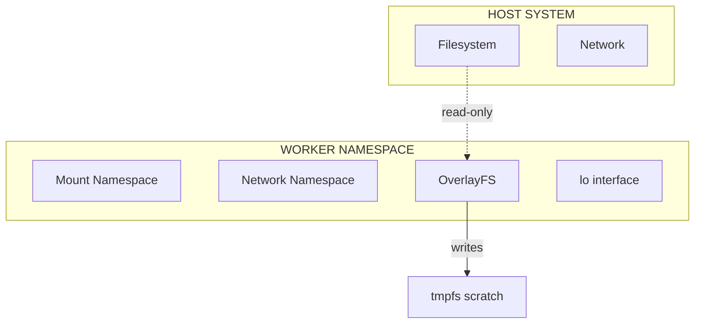
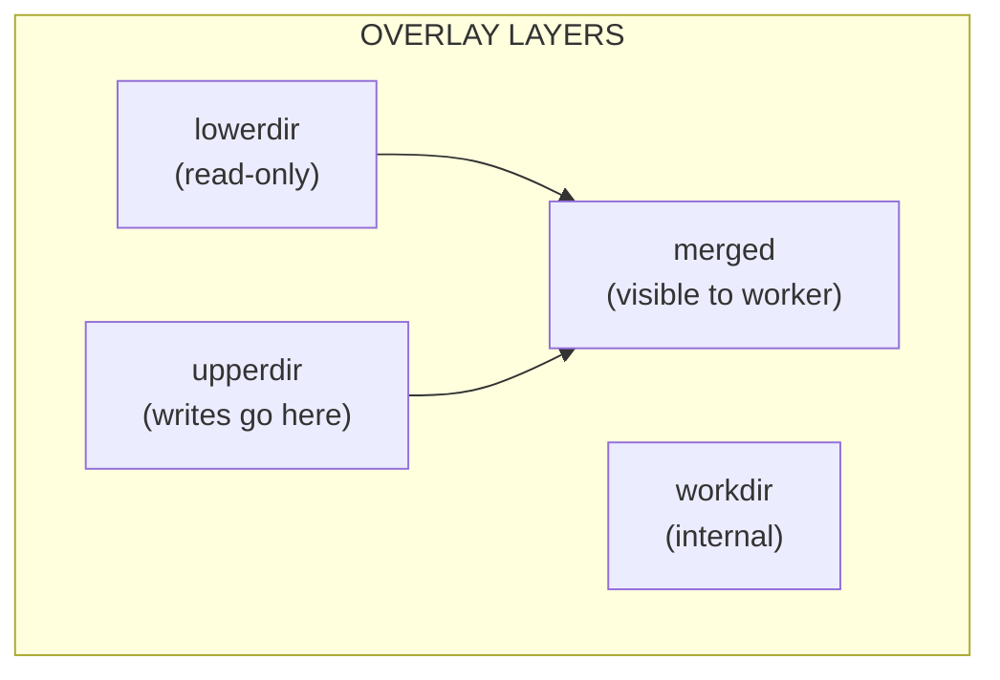
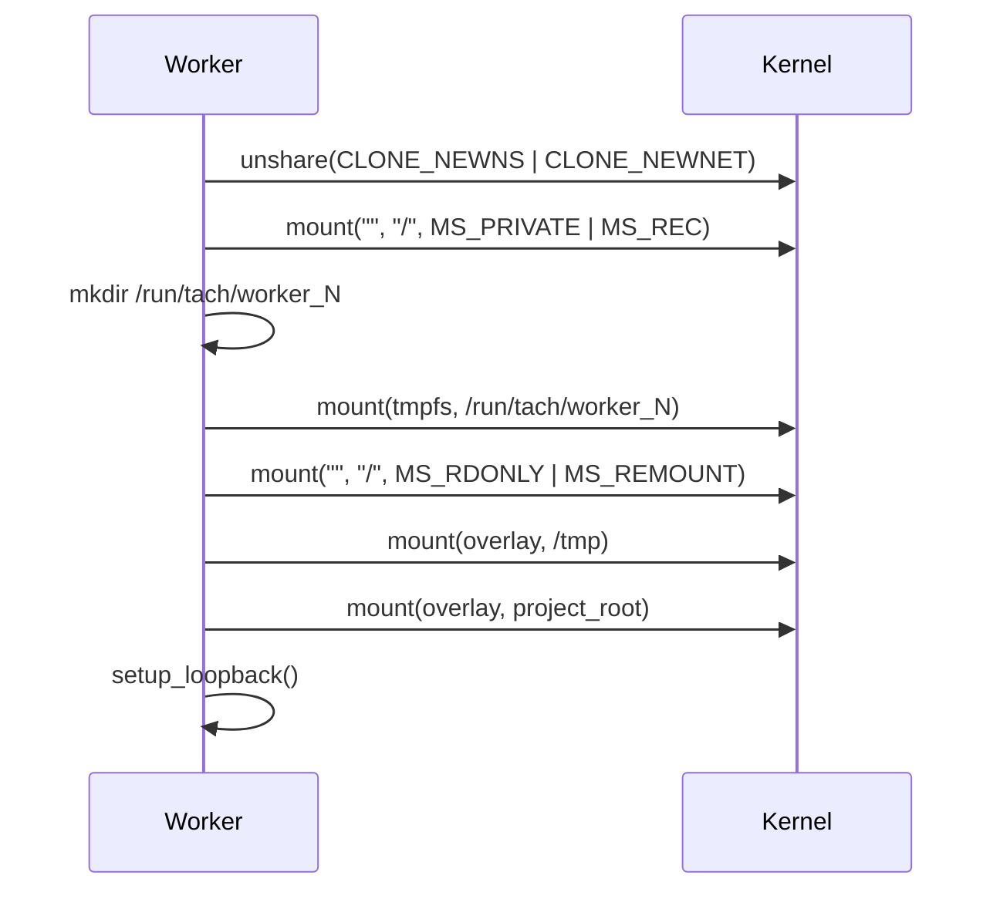

# Isolation (Namespaces and OverlayFS)

Isolation provides filesystem and network separation for worker processes.

---

## Overview

Tach uses Linux namespaces and OverlayFS to create isolated environments:

1. **Mount Namespace**: Private filesystem view
2. **Network Namespace**: Isolated network stack
3. **OverlayFS**: Copy-on-write filesystem layers



---

## Namespace Types

### Mount Namespace (CLONE_NEWNS)

Provides a private set of mount points.

```rust
unsafe {
    libc::unshare(libc::CLONE_NEWNS)?;
}
```

After unshare, the worker's mounts are isolated from the host.

### Network Namespace (CLONE_NEWNET)

Provides an isolated network stack.

```rust
unsafe {
    libc::unshare(libc::CLONE_NEWNET)?;
}
```

The worker gets its own:

- Network interfaces
- Routing tables
- Firewall rules
- Port bindings

### PID Namespace

**Not used.** Tach relies on standard `fork()` and `PR_SET_PDEATHSIG` for process management.

---

## OverlayFS Structure



### /tmp Isolation

```
lowerdir: /tmp (host)
upperdir: /run/tach/worker_N/tmp_upper
workdir:  /run/tach/worker_N/tmp_work
merged:   /tmp (worker view)
```

Tests can write to `/tmp`, but changes are stored in the worker's tmpfs.

### Project Root Isolation

```
lowerdir: {project_root} (source code)
upperdir: /run/tach/worker_N/proj_upper
workdir:  /run/tach/worker_N/proj_work
merged:   {project_root} (worker view)
```

Tests can modify source files without affecting the actual codebase.

---

## Setup Sequence



### Step 1: Enter Namespaces

```rust
pub fn setup_filesystem(project_root: &Path, worker_id: u32) -> Result<()> {
    unsafe {
        libc::unshare(libc::CLONE_NEWNS | libc::CLONE_NEWNET)?;
    }
    Ok(())
}
```

### Step 2: Privatize Mounts

```rust
unsafe {
    libc::mount(
        ptr::null(),
        c"/".as_ptr(),
        ptr::null(),
        libc::MS_PRIVATE | libc::MS_REC,
        ptr::null(),
    )?;
}
```

This prevents mount events from leaking to the host.

### Step 3: Create Worker Directory

```rust
let worker_dir = format!("/run/tach/worker_{}", worker_id);
std::fs::create_dir_all(&worker_dir)?;
```

### Step 4: Mount tmpfs

```rust
unsafe {
    libc::mount(
        c"tmpfs".as_ptr(),
        worker_dir.as_ptr(),
        c"tmpfs".as_ptr(),
        0,
        c"size=100M".as_ptr(),
    )?;
}
```

100MB memory-backed storage for worker scratch space.

### Step 5: Lock Down Root

```rust
unsafe {
    libc::mount(
        ptr::null(),
        c"/".as_ptr(),
        ptr::null(),
        libc::MS_RDONLY | libc::MS_REMOUNT | libc::MS_BIND,
        ptr::null(),
    )?;
}
```

The root filesystem becomes read-only.

### Step 6: Mount Overlays

```rust
fn mount_overlay(lower: &Path, upper: &Path, work: &Path, target: &Path) -> Result<()> {
    let options = format!(
        "lowerdir={},upperdir={},workdir={}",
        lower.display(),
        upper.display(),
        work.display(),
    );

    unsafe {
        libc::mount(
            c"overlay".as_ptr(),
            target.as_ptr(),
            c"overlay".as_ptr(),
            0,
            options.as_ptr(),
        )?;
    }
    Ok(())
}
```

### Step 7: Setup Loopback

```rust
fn setup_loopback() -> Result<()> {
    // Bring up lo interface in the new network namespace
    let sock = socket(AF_INET, SOCK_DGRAM, 0)?;
    let mut ifr: libc::ifreq = unsafe { std::mem::zeroed() };
    ifr.ifr_name[..2].copy_from_slice(b"lo");
    ifr.ifr_ifru.ifru_flags = libc::IFF_UP as i16;

    unsafe {
        libc::ioctl(sock, libc::SIOCSIFFLAGS, &ifr)?;
    }
    Ok(())
}
```

---

## Directory Structure

```
/run/tach/
  worker_0/
    tmp_upper/      # /tmp writes
    tmp_work/       # OverlayFS internal
    proj_upper/     # Project writes
    proj_work/      # OverlayFS internal
  worker_1/
    ...
```

---

## Security Properties

| Property             | Mechanism                         |
| :------------------- | :-------------------------------- |
| Filesystem isolation | Mount namespace + OverlayFS       |
| Network isolation    | Network namespace                 |
| Write containment    | tmpfs + OverlayFS upperdir        |
| Host protection      | Root remounted read-only          |
| Cleanup              | tmpfs automatically freed on exit |

---

## Interaction with Landlock

Isolation and Landlock provide redundant protection:

| Layer           | Protection                         |
| :-------------- | :--------------------------------- |
| Mount namespace | Worker can't see host mounts       |
| OverlayFS       | Writes go to tmpfs, not real files |
| Root read-only  | Can't modify system files          |
| Landlock        | Kernel-level access control        |

This "belt and suspenders" approach ensures security even if one layer fails.

---

## Environment Variable

To disable isolation for development:

```bash
TACH_NO_ISOLATION=1 ./tach-core .
```

Or:

```bash
./tach-core --no-isolation .
```

---

## Related Documentation

- [Iron Dome](sandbox.md) - Landlock and Seccomp
- [Zygote Lifecycle](zygote.md) - When isolation is applied
- [Configuration](../configuration.md) - --no-isolation flag
