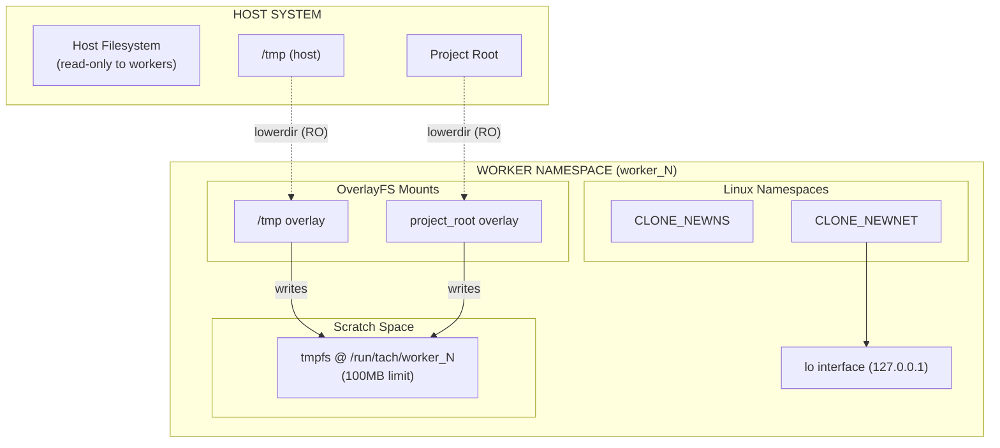
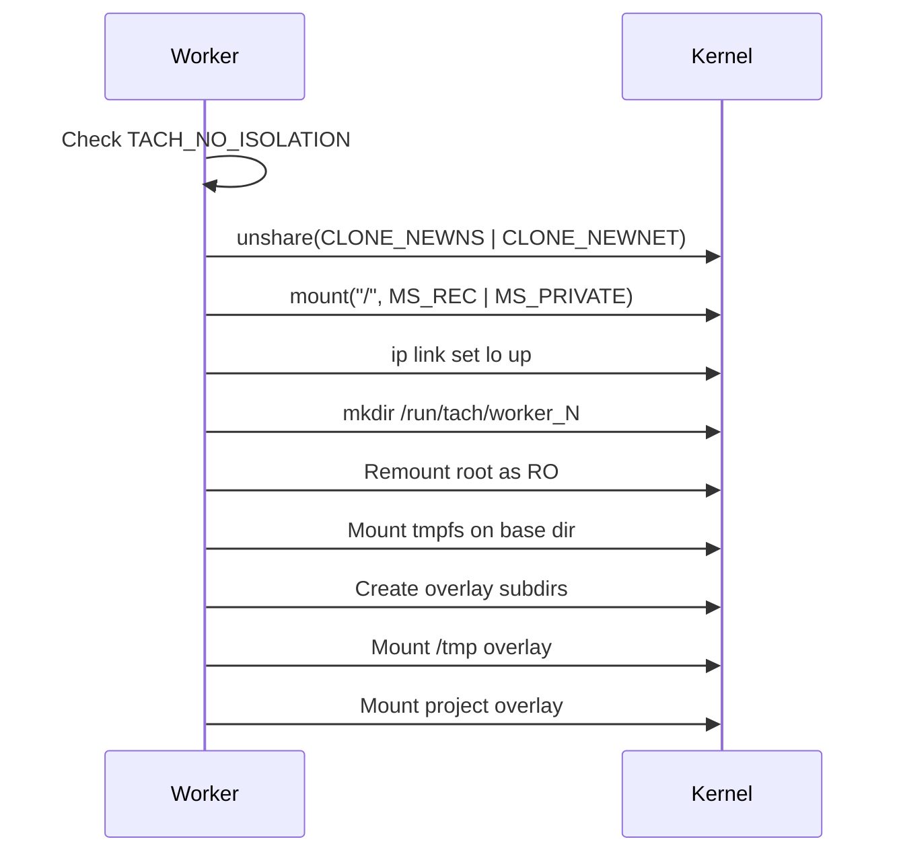
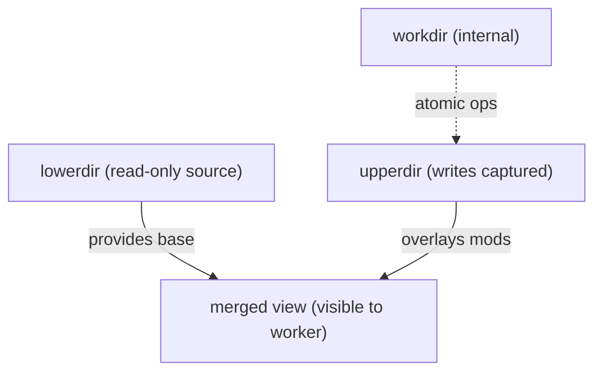
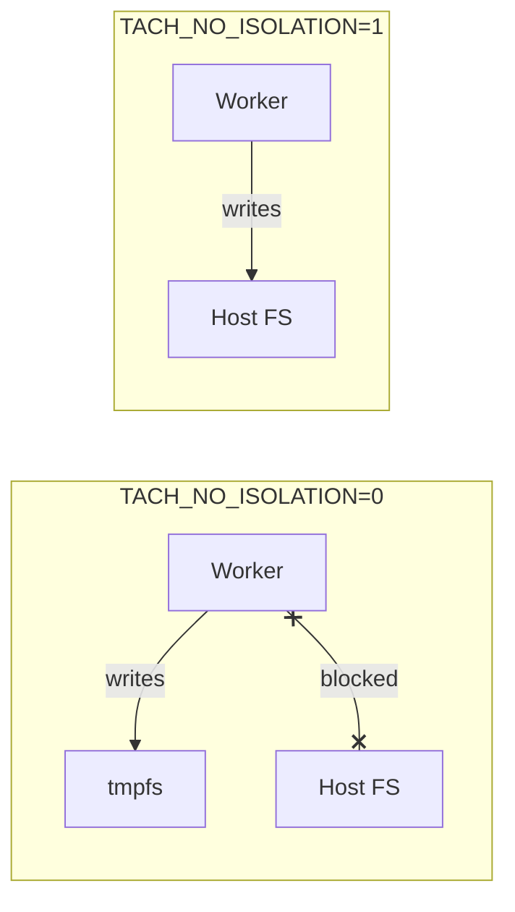
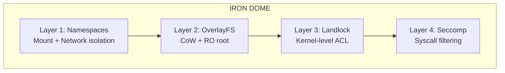

# Isolation Architecture (Namespaces and OverlayFS)

Worker isolation provides filesystem and network separation for test processes, ensuring tests cannot interfere with each other or the host system.

---

## Overview

Tach uses Linux namespaces and OverlayFS to create isolated environments for each worker:

1. **Mount Namespace (CLONE_NEWNS)**: Private filesystem view per worker
2. **Network Namespace (CLONE_NEWNET)**: Isolated network stack with own loopback
3. **OverlayFS**: Copy-on-write layers for `/tmp` and project directory



---

## Namespace Types

### Mount Namespace (CLONE_NEWNS)

Provides a private set of mount points. After entering, mount operations are invisible to host and other workers.

```rust
unshare(CloneFlags::CLONE_NEWNS | CloneFlags::CLONE_NEWNET)
    .context("unshare failed - requires CAP_SYS_ADMIN")?;
```

**Key Properties:** Worker mounts isolated from host; mount propagation disabled via `MS_PRIVATE`.

### Network Namespace (CLONE_NEWNET)

Provides isolated network stack preventing tests from binding conflicting ports or interfering with host services.

**Each Worker Gets:** Own network interfaces, routing tables, firewall rules, and port bindings.

**Loopback Setup:** After entering namespace, bring up loopback manually:

```rust
fn setup_loopback() -> Result<()> {
    Command::new("ip").args(["link", "set", "lo", "up"]).output()?;
    Ok(())
}
```

### PID Namespace

**Not used.** Tach uses standard `fork()` and `PR_SET_PDEATHSIG` for process management.

---

## The setup_filesystem Function

Main entry point for worker isolation with a critical execution sequence.

### Function Signature

```rust
/// Set up complete isolation for a worker (Iron Dome)
/// If TACH_NO_ISOLATION=1, skip all isolation (for benchmarking/debugging)
pub fn setup_filesystem(worker_id: u32, project_root: &Path) -> Result<()>
```

### Critical Execution Sequence



### Implementation (Key Steps)

```rust
pub fn setup_filesystem(worker_id: u32, project_root: &Path) -> Result<()> {
    if std::env::var("TACH_NO_ISOLATION").unwrap_or_default() == "1" {
        return Ok(());
    }

    // 1. Create namespaces
    unshare(CloneFlags::CLONE_NEWNS | CloneFlags::CLONE_NEWNET)?;

    // 2. Privatize mounts
    mount::<str, str, str, str>(None, "/", None, MsFlags::MS_REC | MsFlags::MS_PRIVATE, None)?;

    // 3. Setup loopback
    setup_loopback()?;

    // 4. Create base dir (while root still writable)
    let base = PathBuf::from(format!("/run/tach/worker_{}", worker_id));
    fs::create_dir_all(&base)?;

    // 5. Lock root as read-only
    mount::<str, str, str, str>(Some("/"), "/", None, MsFlags::MS_BIND | MsFlags::MS_REC, None)?;
    mount::<str, str, str, str>(Some("/"), "/", None,
        MsFlags::MS_BIND | MsFlags::MS_REMOUNT | MsFlags::MS_RDONLY | MsFlags::MS_REC, None)?;

    // 6. Mount tmpfs
    mount::<str, PathBuf, str, str>(Some("tmpfs"), &base, Some("tmpfs"),
        MsFlags::empty(), Some("size=100M,mode=0755"))?;

    // 7. Create overlay subdirs and mount overlays
    // ... (tmp_upper, tmp_work, proj_upper, proj_work)
    // ... mount overlay on /tmp and project_root

    Ok(())
}
```

### Mount Flags

| Flag         | Purpose                            |
| :----------- | :--------------------------------- |
| `MS_REC`     | Apply recursively to all submounts |
| `MS_PRIVATE` | Disable mount propagation          |
| `MS_BIND`    | Create bind mount                  |
| `MS_REMOUNT` | Change flags on existing mount     |
| `MS_RDONLY`  | Make mount read-only               |

---

## OverlayFS Structure

OverlayFS provides copy-on-write semantics, allowing workers to appear to modify files while writing to a separate location.



### Overlay Configurations

| Mount Point    | lowerdir         | upperdir                        | workdir                        |
| :------------- | :--------------- | :------------------------------ | :----------------------------- |
| `/tmp`         | `/tmp` (host)    | `/run/tach/worker_N/tmp_upper`  | `/run/tach/worker_N/tmp_work`  |
| `project_root` | `{project_root}` | `/run/tach/worker_N/proj_upper` | `/run/tach/worker_N/proj_work` |

---

## Worker Base Directory Structure

Each worker gets dedicated scratch space under `/run/tach/`:

```
/run/tach/
  worker_0/
    tmp_upper/     # /tmp writes
    tmp_work/      # OverlayFS workdir
    proj_upper/    # Project writes
    proj_work/     # OverlayFS workdir
  worker_1/
    ...
```

**Path Format:** `/run/tach/worker_{worker_id}` (worker_id is u32)

**tmpfs Config:** `size=100M,mode=0755` - prevents disk exhaustion, auto-freed on exit.

---

## Helper Functions API

Pure functions testable without root privileges.

### worker_base_dir

```rust
#[inline]
pub fn worker_base_dir(worker_id: u32) -> PathBuf {
    PathBuf::from(format!("/run/tach/worker_{}", worker_id))
}
```

### tmp_overlay_options / project_overlay_options

```rust
pub fn tmp_overlay_options(base: &Path) -> String {
    format!("lowerdir=/tmp,upperdir={}/tmp_upper,workdir={}/tmp_work",
        base.display(), base.display())
}

pub fn project_overlay_options(base: &Path, project_root: &Path) -> String {
    format!("lowerdir={},upperdir={}/proj_upper,workdir={}/proj_work",
        project_root.display(), base.display(), base.display())
}
```

### is_isolation_disabled

```rust
pub fn is_isolation_disabled() -> bool {
    std::env::var("TACH_NO_ISOLATION").unwrap_or_default() == "1"
}
```

| TACH_NO_ISOLATION | Returns |
| :---------------- | :------ |
| `"1"`             | `true`  |
| Any other value   | `false` |

---

## TACH_NO_ISOLATION Bypass

Skip all isolation for benchmarking, debugging, or CI without privileges.

```bash
TACH_NO_ISOLATION=1 ./tach-core .
```

### Security Implications

| Protection           | With Isolation             | Without Isolation         |
| :------------------- | :------------------------- | :------------------------ |
| Filesystem isolation | Workers isolated           | Workers share filesystem  |
| Network isolation    | Private network per worker | Shared network stack      |
| Write containment    | Writes to tmpfs            | Writes to real filesystem |
| Host protection      | Root read-only             | Root writable             |



---

## Security Properties

| Property             | Mechanism                   | Description                            |
| :------------------- | :-------------------------- | :------------------------------------- |
| Filesystem isolation | Mount namespace + OverlayFS | Workers can't see each other's changes |
| Network isolation    | Network namespace           | Each worker has own network stack      |
| Write containment    | tmpfs + OverlayFS           | All writes to memory-backed storage    |
| Host protection      | Root remounted read-only    | Workers can't modify system files      |
| Automatic cleanup    | tmpfs freed on exit         | No persistent state left behind        |
| Resource limits      | tmpfs size=100M             | Workers can't exhaust host memory      |

### Iron Dome Integration

Isolation works with Landlock and Seccomp for defense in depth:



| Layer           | Protection                  | Failure Mode            |
| :-------------- | :-------------------------- | :---------------------- |
| Mount namespace | Can't see host mounts       | Other layers protect    |
| OverlayFS       | Writes to tmpfs             | Landlock blocks paths   |
| Landlock        | Kernel-level access control | Seccomp blocks syscalls |
| Seccomp         | Syscall filtering           | Process termination     |

---

## Unit Tests

The isolation module includes 15 unit tests verifiable without root privileges.

### Test Categories

| Category              | Tests | Description                              |
| :-------------------- | :---- | :--------------------------------------- |
| Worker Base Directory | 3     | Path format, large IDs, absolute paths   |
| Overlay Options       | 5     | Format validation, no spaces, uniqueness |
| TACH_NO_ISOLATION     | 5     | Environment variable behavior            |
| Path Components       | 2     | Subdirectory consistency                 |

### Running Tests

```bash
cargo test --lib isolation::namespace
cargo test --lib isolation::namespace -- --nocapture
```

---

## Related Documentation

- [Iron Dome (Sandbox)](sandbox.md) - Landlock and Seccomp security layers
- [Zygote Lifecycle](zygote.md) - When isolation is applied during worker spawning
- [Configuration](../configuration.md) - `--no-isolation` CLI flag
- [README](../../README.md) - Project architecture overview
