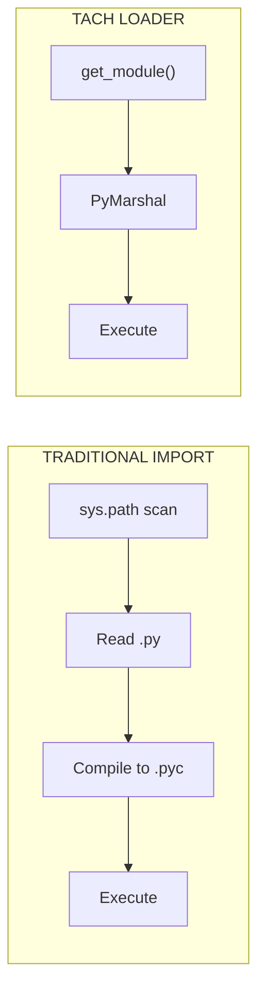
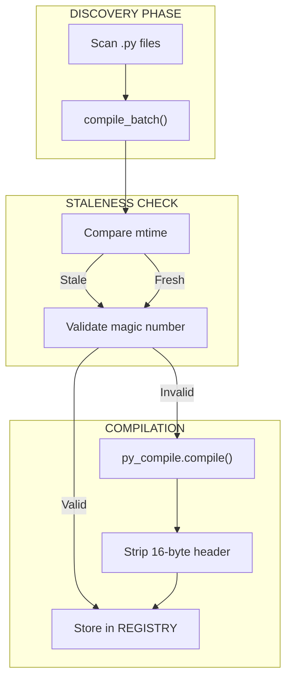
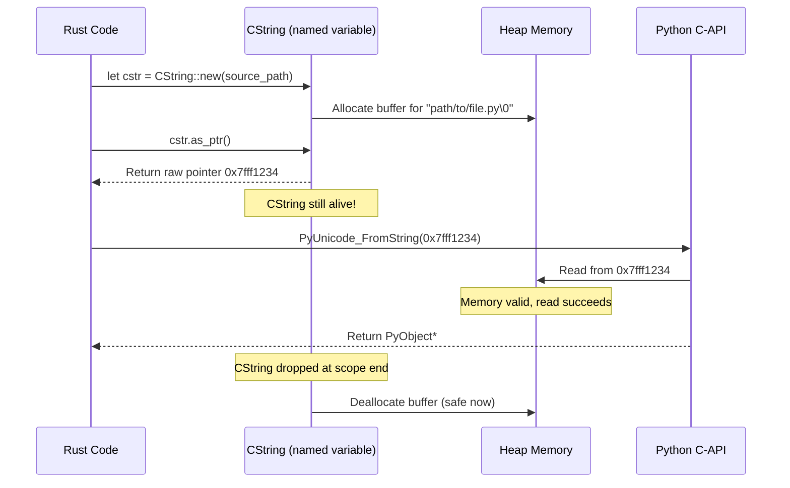
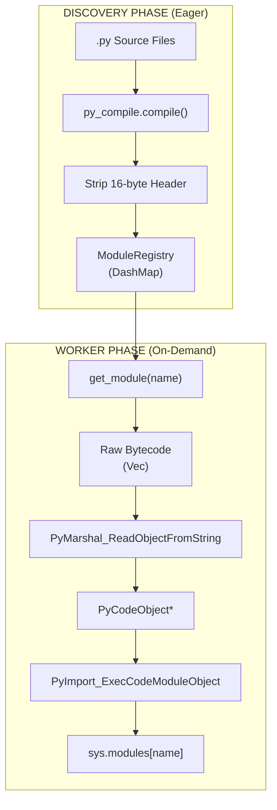
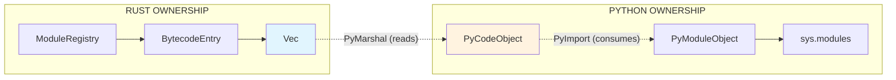

# Zero-Copy Loader

The Zero-Copy Loader bypasses Python's `importlib` for instant module loading.

---

## Overview

Traditional Python imports involve:

1. Scanning `sys.path` for the module
2. Reading the `.py` file from disk
3. Compiling to bytecode (or reading cached `.pyc`)
4. Executing the module code

Tach eliminates steps 1-3 by pre-compiling all modules and injecting bytecode directly via the C-API.



---

## Data Structures

### BytecodeEntry

Represents a single compiled module in the registry.

```rust
pub struct BytecodeEntry {
    pub name: String,
    pub source_path: PathBuf,
    pub bytecode: Vec<u8>,
    pub is_package: bool,
}
```

| Field         | Description                                   |
| :------------ | :-------------------------------------------- |
| `name`        | Fully qualified module name (e.g., `foo.bar`) |
| `source_path` | Absolute path to the original `.py` file      |
| `bytecode`    | Raw bytecode with 16-byte header removed      |
| `is_package`  | True if this was an `__init__.py` file        |

### ModuleRegistry

Thread-safe storage for compiled modules.

```rust
pub struct ModuleRegistry {
    entries: DashMap<String, BytecodeEntry>,
    project_root: PathBuf,
}
```

Uses `DashMap` for concurrent access from multiple worker threads.

### BytecodeCompiler

Handles eager compilation of Python source to bytecode.

```rust
pub struct BytecodeCompiler {
    cache_dir: PathBuf,
    project_root: PathBuf,
    python_exe: PathBuf,
    expected_magic: Option<[u8; 4]>,
}
```

---

## Compilation Pipeline



### Staleness Check

```rust
fn is_cache_stale(source: &Path, cache: &Path) -> bool {
    let source_mtime = source.metadata()?.modified()?;
    let cache_mtime = cache.metadata()?.modified()?;
    source_mtime > cache_mtime
}
```

### Magic Number Validation

Python bytecode files start with a 4-byte magic number that identifies the Python version. If the magic number doesn't match the current interpreter, the cache is invalid.

```rust
fn validate_magic(cache: &Path, expected: [u8; 4]) -> bool {
    let mut file = File::open(cache)?;
    let mut magic = [0u8; 4];
    file.read_exact(&mut magic)?;
    magic == expected
}
```

### Header Stripping

Python 3.7+ `.pyc` files have a 16-byte header (PEP 552):

| Bytes | Content                                   |
| :---- | :---------------------------------------- |
| 0-3   | Magic number                              |
| 4-7   | Bit field (hash-based invalidation flags) |
| 8-11  | Timestamp                                 |
| 12-15 | Source size                               |

Tach strips this header before storing bytecode.

---

## Cache Structure

Bytecode is cached in `.tach/cache/` with flattened filenames:

```
.tach/cache/
  src_utils.py.pyc
  src_models_user.py.pyc
  tests_test_auth.py.pyc
```

Path separators are replaced with underscores to avoid deep directory structures.

---

## Python Import Hook

The import hook is implemented in `tach_harness.py`:

### TachMetaPathFinder

Installed at `sys.meta_path[0]` for maximum priority.

```python
class TachMetaPathFinder:
    def find_spec(self, fullname, path, target=None):
        bytecode = tach_rust.get_module(fullname)
        if bytecode is None:
            return None

        origin = tach_rust.get_module_path(fullname)
        is_package = tach_rust.is_module_package(fullname)

        return ModuleSpec(
            fullname,
            TachLoader(bytecode, origin),
            origin=origin,
            is_package=is_package,
        )
```

### TachLoader

Executes the bytecode via FFI.

```python
class TachLoader:
    def __init__(self, bytecode, origin):
        self.bytecode = bytecode
        self.origin = origin

    def exec_module(self, module):
        tach_rust.load_module(
            module.__name__,
            self.origin,
            self.bytecode,
        )
```

---

## FFI Functions

### get_module

Returns bytecode from the registry.

```rust
#[pyfunction]
fn get_module(name: &str) -> Option<Vec<u8>>
```

### get_module_path

Returns the source path for `__file__`.

```rust
#[pyfunction]
fn get_module_path(name: &str) -> Option<String>
```

### is_module_package

Checks if the module is a package.

```rust
#[pyfunction]
fn is_module_package(name: &str) -> Option<bool>
```

### load_module

Injects bytecode into Python.

```rust
#[pyfunction]
fn load_module(
    py: Python,
    name: &str,
    source_path: &str,
    bytecode: &[u8],
) -> PyResult<bool>
```

Implementation:

1. `PyMarshal_ReadObjectFromString` - Deserialize bytecode to code object
2. `PyImport_ExecCodeModuleObject` - Execute and register in `sys.modules`
3. `patch_module_namespace` - Set `__file__`, `__package__`, `__path__`

---

## Namespace Patching

After loading, the module namespace is patched:

```rust
fn patch_module_namespace(module: &PyModule, entry: &BytecodeEntry) {
    module.setattr("__file__", entry.source_path.to_str())?;
    module.setattr("__package__", parent_package(&entry.name))?;

    if entry.is_package {
        let path = entry.source_path.parent();
        module.setattr("__path__", vec![path.to_str()])?;
    }
}
```

---

## Performance Characteristics

| Metric                   | Cold Cache  | Warm Cache       |
| :----------------------- | :---------- | :--------------- |
| Compilation (91 modules) | 9.7 seconds | 345 milliseconds |
| Speedup Factor           | 1x          | **28x**          |

### Why It's Fast

1. **No filesystem traversal**: Module location is known
2. **No disk I/O**: Bytecode pre-loaded in RAM
3. **No repeated compilation**: Cached once
4. **Sub-millisecond materialization**: Direct memory injection

---

## Global Caching

To prevent redundant work during parallel startup:

```rust
static CACHED_PYTHON_EXE: OnceLock<PathBuf> = OnceLock::new();
static CACHED_MAGIC: OnceLock<[u8; 4]> = OnceLock::new();
```

---

## Limitations

1. **Namespace Packages**: Directories without `__init__.py` fall back to standard `importlib`
2. **Dynamic Imports**: `__import__()` and `importlib.import_module()` bypass the hook
3. **C Extensions**: `.so`/`.pyd` files are not handled by the loader

---

## Security: Dangling Pointer Prevention

When passing C-style strings to the Python C-API, improper `CString` usage can lead to **use-after-free vulnerabilities**.

### The Dangerous Pattern (BAD)

```rust
// BAD - CString is dropped immediately, pointer dangles!
let file_val = ffi::PyUnicode_FromString(
    std::ffi::CString::new(source_path).unwrap().as_ptr()
);
```

The temporary `CString` is dropped after `.as_ptr()` returns, leaving a dangling pointer that `PyUnicode_FromString` reads from - undefined behavior.

### The Safe Pattern (GOOD)

```rust
// GOOD - CString lives long enough for the pointer to be used
let source_path_cstr = std::ffi::CString::new(source_path).unwrap();
let file_val = ffi::PyUnicode_FromString(source_path_cstr.as_ptr());
// source_path_cstr is still alive here, pointer is valid
```

Storing the `CString` in a named variable keeps it alive until scope end, ensuring the pointer remains valid during the C-API call.



### Implementation in Tach

The `patch_module_namespace` and `load_module` functions in `src/discovery/loader.rs` demonstrate this pattern. Each `CString` is stored in a named variable with a `// SAFETY:` comment explaining why the pointer usage is safe.

### Consequences of Use-After-Free

| Scenario                   | Consequence                                       |
| :------------------------- | :------------------------------------------------ |
| Memory reused by allocator | Corrupted module path, wrong `__file__` attribute |
| Memory zeroed by allocator | Empty string or null pointer dereference crash    |
| Memory reused by Python    | Arbitrary string as module path (security risk)   |
| Memory page unmapped       | Segmentation fault (SIGSEGV)                      |
| Intermittent failures      | Heisenbugs that only appear under memory pressure |

### Key Takeaways

1. **Never chain `.as_ptr()` on a temporary `CString`** - always store it in a named variable first
2. **The `CString` must outlive all uses of the pointer** - keep it alive until after the C function returns
3. **Add `// SAFETY:` comments** explaining why the pointer usage is safe
4. **This pattern applies to all FFI string passing** - not just Python C-API

---

## Zero-Copy Bytecode Loading Architecture

The loader implements a zero-copy architecture that minimizes memory allocations and data movement during module loading.

### Memory Flow



### Key Design Decisions

#### 1. Header Stripping at Compile Time

The 16-byte `.pyc` header is stripped during compilation, not at load time:

```rust
fn read_and_strip_header(&self, pyc_path: &Path) -> Result<Vec<u8>> {
    let data = fs::read(pyc_path)?;

    if data.len() < PYC_HEADER_SIZE {
        return Err(anyhow!("Invalid .pyc file (too short)"));
    }

    // Return bytes after header - this is the only copy
    Ok(data[PYC_HEADER_SIZE..].to_vec())
}
```

**Rationale:** The header is only needed for cache validation. By stripping it once during compilation, we avoid repeated slicing operations during the hot path.

#### 2. Direct Pointer Passing to C-API

Bytecode is passed directly to `PyMarshal_ReadObjectFromString` without intermediate copies:

```rust
let code_obj = ffi::PyMarshal_ReadObjectFromString(
    bytecode.as_ptr() as *const i8,  // Direct pointer to Vec<u8> buffer
    bytecode.len() as isize,
);
```

**Rationale:** The `Vec<u8>` buffer is passed by pointer, not copied. Python's marshal module reads directly from our Rust-owned memory.

#### 3. DashMap for Lock-Free Reads

The registry uses `DashMap` instead of `RwLock<HashMap>`:

```rust
pub struct ModuleRegistry {
    entries: DashMap<String, BytecodeEntry>,
    project_root: PathBuf,
}
```

**Rationale:** `DashMap` provides lock-free reads for concurrent worker access. Multiple workers can request different modules simultaneously without contention.

#### 4. Global Caching to Prevent Subprocess Spawning

Python path and magic number are cached globally:

```rust
static CACHED_PYTHON_EXE: OnceLock<PathBuf> = OnceLock::new();
static CACHED_MAGIC: OnceLock<[u8; 4]> = OnceLock::new();
```

**Rationale:** Without caching, each `BytecodeCompiler::new()` call would spawn Python subprocesses to get the magic number. During parallel test execution, this could spawn hundreds of processes, causing OOM.

### Memory Ownership Model



| Component          | Owner                   | Lifetime                   |
| :----------------- | :---------------------- | :------------------------- |
| `BytecodeEntry`    | Rust (`ModuleRegistry`) | Process lifetime           |
| `Vec<u8>` bytecode | Rust (`BytecodeEntry`)  | Process lifetime           |
| `PyCodeObject*`    | Python (new reference)  | Must `Py_DECREF` after use |
| `PyModuleObject*`  | Python (`sys.modules`)  | Until module unloaded      |

### Reference Counting in load_module

The `load_module` function carefully manages Python reference counts:

```rust
unsafe {
    // PyMarshal returns NEW reference - we own it
    let code_obj = ffi::PyMarshal_ReadObjectFromString(...);

    // PyUnicode_FromString returns NEW reference - we own it
    let name_obj = ffi::PyUnicode_FromString(name_cstr.as_ptr());
    let path_obj = ffi::PyUnicode_FromString(path_cstr.as_ptr());

    // PyImport does NOT steal references - we still own them
    let module = ffi::PyImport_ExecCodeModuleObject(
        name_obj,
        code_obj,
        path_obj,
        std::ptr::null_mut(),
    );

    // Clean up all references we created
    ffi::Py_DECREF(code_obj);
    ffi::Py_DECREF(name_obj);
    ffi::Py_DECREF(path_obj);

    // Module is in sys.modules, we can release our reference
    ffi::Py_DECREF(module);
}
```

**Critical:** If any step fails, we must `Py_DECREF` all previously created objects to avoid memory leaks.

---

## Related Documentation

- [Discovery Engine](discovery.md) - How modules are found
- [Zygote Lifecycle](zygote.md) - How the loader is initialized

---

## Research References

This implementation is informed by the following research papers (see `docs/pdfs/txt/` for full text):

| Paper                                        | Key Contribution                                                     |
| :------------------------------------------- | :------------------------------------------------------------------- |
| **Zero-Copy Python Module Loading**          | `sys.meta_path` bypass, `mmap` of `.pyc` artifacts, header stripping |
| **Python Testing Engine Rust Breakthroughs** | Content-addressable logic, eliminating the "Import Tax"              |

### Key Technical Details from Research

- **Stat Storm Elimination**: Traditional `importlib` performs ~10 stat calls per import - bypassing it eliminates this overhead
- **16-Byte Header**: `.pyc` files have a 16-byte header (magic + timestamp + size) that must be stripped before `PyMarshal_ReadObjectFromString`
- **mmap Workflow**: `mmap(pyc_file)` -> skip 16 bytes -> `PyMarshal_ReadObjectFromString` -> `PyImport_ExecCodeModuleObject`
- **Relative Import Hazard**: Must manually set `__package__` and `__path__` attributes or relative imports will fail
- **sys.modules Injection**: Use `PyImport_ExecCodeModuleObject` (preferred over `PyImport_ExecCodeModule`) for full control over module attributes

See [Research Overview](../research/README.md) for complete analysis.
