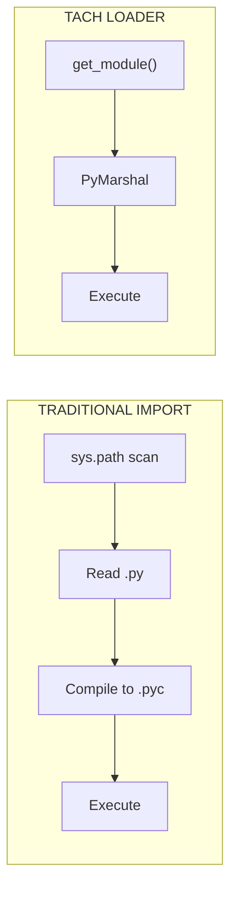
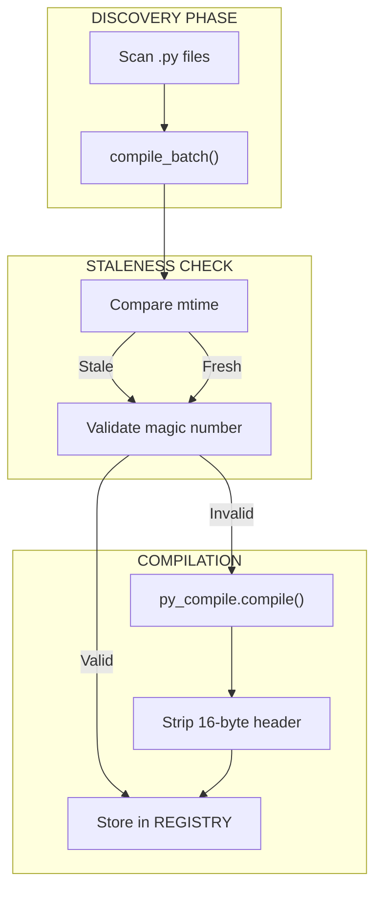

# Zero-Copy Loader

The Zero-Copy Loader bypasses Python's `importlib` for instant module loading.

---

## Overview

Traditional Python imports involve:

1. Scanning `sys.path` for the module
2. Reading the `.py` file from disk
3. Compiling to bytecode (or reading cached `.pyc`)
4. Executing the module code

Tach eliminates steps 1-3 by pre-compiling all modules and injecting bytecode directly via the C-API.



---

## Data Structures

### BytecodeEntry

Represents a single compiled module in the registry.

```rust
pub struct BytecodeEntry {
    pub name: String,
    pub source_path: PathBuf,
    pub bytecode: Vec<u8>,
    pub is_package: bool,
}
```

| Field         | Description                                   |
| :------------ | :-------------------------------------------- |
| `name`        | Fully qualified module name (e.g., `foo.bar`) |
| `source_path` | Absolute path to the original `.py` file      |
| `bytecode`    | Raw bytecode with 16-byte header removed      |
| `is_package`  | True if this was an `__init__.py` file        |

### ModuleRegistry

Thread-safe storage for compiled modules.

```rust
pub struct ModuleRegistry {
    entries: DashMap<String, BytecodeEntry>,
    project_root: PathBuf,
}
```

Uses `DashMap` for concurrent access from multiple worker threads.

### BytecodeCompiler

Handles eager compilation of Python source to bytecode.

```rust
pub struct BytecodeCompiler {
    cache_dir: PathBuf,
    project_root: PathBuf,
    python_exe: PathBuf,
    expected_magic: Option<[u8; 4]>,
}
```

---

## Compilation Pipeline



### Staleness Check

```rust
fn is_cache_stale(source: &Path, cache: &Path) -> bool {
    let source_mtime = source.metadata()?.modified()?;
    let cache_mtime = cache.metadata()?.modified()?;
    source_mtime > cache_mtime
}
```

### Magic Number Validation

Python bytecode files start with a 4-byte magic number that identifies the Python version. If the magic number doesn't match the current interpreter, the cache is invalid.

```rust
fn validate_magic(cache: &Path, expected: [u8; 4]) -> bool {
    let mut file = File::open(cache)?;
    let mut magic = [0u8; 4];
    file.read_exact(&mut magic)?;
    magic == expected
}
```

### Header Stripping

Python 3.7+ `.pyc` files have a 16-byte header (PEP 552):

| Bytes | Content                                   |
| :---- | :---------------------------------------- |
| 0-3   | Magic number                              |
| 4-7   | Bit field (hash-based invalidation flags) |
| 8-11  | Timestamp                                 |
| 12-15 | Source size                               |

Tach strips this header before storing bytecode.

---

## Cache Structure

Bytecode is cached in `.tach/cache/` with flattened filenames:

```
.tach/cache/
  src_utils.py.pyc
  src_models_user.py.pyc
  tests_test_auth.py.pyc
```

Path separators are replaced with underscores to avoid deep directory structures.

---

## Python Import Hook

The import hook is implemented in `tach_harness.py`:

### TachMetaPathFinder

Installed at `sys.meta_path[0]` for maximum priority.

```python
class TachMetaPathFinder:
    def find_spec(self, fullname, path, target=None):
        bytecode = tach_rust.get_module(fullname)
        if bytecode is None:
            return None

        origin = tach_rust.get_module_path(fullname)
        is_package = tach_rust.is_module_package(fullname)

        return ModuleSpec(
            fullname,
            TachLoader(bytecode, origin),
            origin=origin,
            is_package=is_package,
        )
```

### TachLoader

Executes the bytecode via FFI.

```python
class TachLoader:
    def __init__(self, bytecode, origin):
        self.bytecode = bytecode
        self.origin = origin

    def exec_module(self, module):
        tach_rust.load_module(
            module.__name__,
            self.origin,
            self.bytecode,
        )
```

---

## FFI Functions

### get_module

Returns bytecode from the registry.

```rust
#[pyfunction]
fn get_module(name: &str) -> Option<Vec<u8>>
```

### get_module_path

Returns the source path for `__file__`.

```rust
#[pyfunction]
fn get_module_path(name: &str) -> Option<String>
```

### is_module_package

Checks if the module is a package.

```rust
#[pyfunction]
fn is_module_package(name: &str) -> Option<bool>
```

### load_module

Injects bytecode into Python.

```rust
#[pyfunction]
fn load_module(
    py: Python,
    name: &str,
    source_path: &str,
    bytecode: Vec<u8>,
) -> PyResult<bool>
```

Implementation:

1. `PyMarshal_ReadObjectFromString` - Deserialize bytecode to code object
2. `PyImport_ExecCodeModuleObject` - Execute and register in `sys.modules`
3. `patch_module_namespace` - Set `__file__`, `__package__`, `__path__`

---

## Namespace Patching

After loading, the module namespace is patched:

```rust
fn patch_module_namespace(module: &PyModule, entry: &BytecodeEntry) {
    module.setattr("__file__", entry.source_path.to_str())?;
    module.setattr("__package__", parent_package(&entry.name))?;

    if entry.is_package {
        let path = entry.source_path.parent();
        module.setattr("__path__", vec![path.to_str()])?;
    }
}
```

---

## Performance Characteristics

| Metric                   | Cold Cache  | Warm Cache       |
| :----------------------- | :---------- | :--------------- |
| Compilation (91 modules) | 9.7 seconds | 345 milliseconds |
| Speedup Factor           | 1x          | **28x**          |

### Why It's Fast

1. **No filesystem traversal**: Module location is known
2. **No disk I/O**: Bytecode pre-loaded in RAM
3. **No repeated compilation**: Cached once
4. **Sub-millisecond materialization**: Direct memory injection

---

## Global Caching

To prevent redundant work during parallel startup:

```rust
static CACHED_PYTHON_EXE: OnceLock<PathBuf> = OnceLock::new();
static CACHED_MAGIC: OnceLock<[u8; 4]> = OnceLock::new();
```

---

## Limitations

1. **Namespace Packages**: Directories without `__init__.py` fall back to standard `importlib`
2. **Dynamic Imports**: `__import__()` and `importlib.import_module()` bypass the hook
3. **C Extensions**: `.so`/`.pyd` files are not handled by the loader

---

## Related Documentation

- [Discovery Engine](discovery.md) - How modules are found
- [Zygote Lifecycle](zygote.md) - How the loader is initialized
