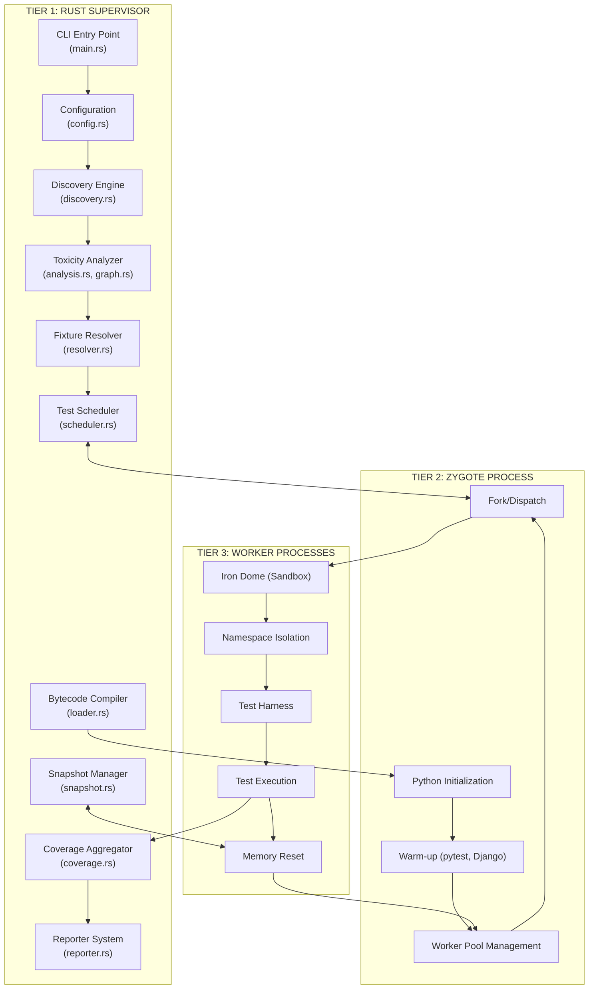
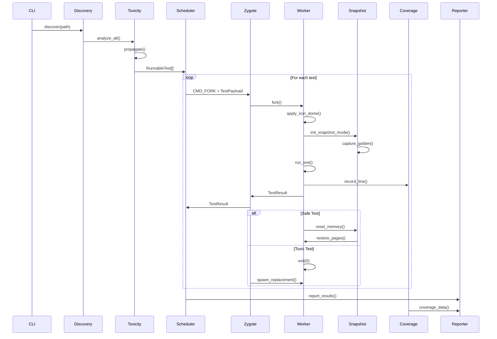
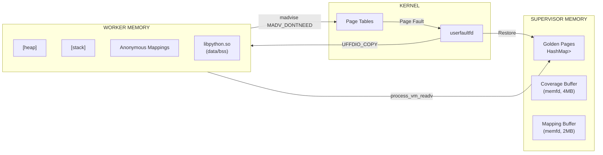
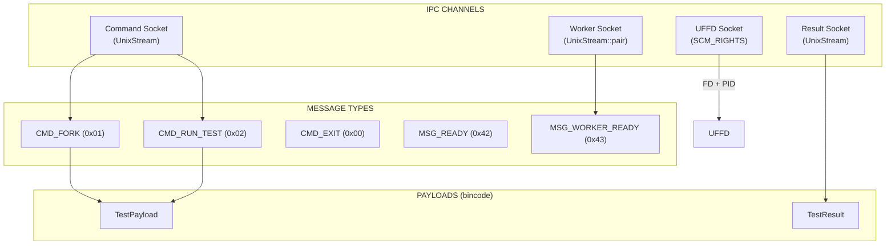
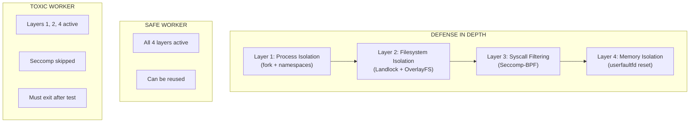

# Architecture Overview

This document provides a high-level view of Tach's architecture and how its components interact.

---

## System Architecture

Tach operates as a three-tier system: **Supervisor**, **Zygote**, and **Workers**.



---

## Component Responsibilities

### Tier 1: Rust Supervisor

| Component         | File                                          | Responsibility                                        |
| :---------------- | :-------------------------------------------- | :---------------------------------------------------- |
| **CLI**           | `main.rs`                                     | Parse arguments, orchestrate execution                |
| **Config**        | `core/config.rs`                              | Load pyproject.toml, merge CLI/env/file settings      |
| **Discovery**     | `discovery/scanner.rs`                        | AST-based test discovery using rustpython-parser      |
| **Toxicity**      | `discovery/analysis.rs`, `discovery/graph.rs` | Detect unsafe modules, propagate via dependency graph |
| **Loader**        | `discovery/loader.rs`                         | Compile .py to .pyc, manage bytecode cache            |
| **Resolver**      | `discovery/resolver.rs`                       | Resolve fixture dependencies, topological sort        |
| **Scheduler**     | `execution/scheduler.rs`                      | Dispatch tests to workers, manage queues              |
| **Snapshot**      | `isolation/snapshot.rs`                       | userfaultfd registration, page fault handling         |
| **Coverage**      | `reporting/coverage.rs`                       | Ring buffer management, aggregation thread            |
| **Reporter**      | `reporting/reporter.rs`                       | Progress bar, dots, JSON output                       |
| **Suggestions**   | `core/suggestions.rs`                         | Error remediation suggestions                         |
| **Plugin Bridge** | `execution/plugin_bridge.rs`                  | Bridges pytest plugin hooks to Tach execution model   |

### Tier 2: Zygote Process

The Zygote is a long-lived Python process that:

1. **Initializes Python** with all imports pre-loaded
2. **Warms up frameworks** (pytest, Django)
3. **Manages the worker pool** for safe test reuse
4. **Forks workers** on demand from the Supervisor

### Tier 3: Worker Processes

Workers are short-lived (toxic) or long-lived (safe) processes that:

1. **Apply security sandbox** (Landlock + Seccomp)
2. **Enter namespace isolation** (Mount + Network)
3. **Execute tests** via the Python harness
4. **Reset memory** or exit based on toxicity

---

## Data Flow



---

## Memory Architecture



---

## IPC Architecture



---

## Security Layers



---

## File Organization

See [README.md](../../README.md#project-structure) for complete source file organization.

---

## Key Design Decisions

| Decision              | Rationale                                             |
| :-------------------- | :---------------------------------------------------- |
| **Rust Supervisor**   | Zero-cost abstractions, memory safety, syscall access |
| **Python Zygote**     | Pay import tax once, share via fork                   |
| **userfaultfd**       | Sub-microsecond page restoration                      |
| **Jemalloc**          | Deterministic heap for snapshot consistency           |
| **Landlock**          | Kernel-level filesystem isolation (5.13+)             |
| **Seccomp**           | Syscall filtering without ptrace overhead             |
| **bincode**           | Fast binary serialization for IPC                     |
| **petgraph**          | Efficient dependency graph for toxicity               |
| **rustpython-parser** | Pure Rust AST parsing, no Python execution            |
| **memfd_create**      | Anonymous shared memory for coverage                  |

---

## Communication Protocol

Tach uses Unix domain sockets with binary serialization for IPC between Supervisor, Zygote, and Workers.

### Message Framing

All structured messages use an 8-byte header with magic bytes, version, and length:

```
+--------+---------+----------+--------+------------------+
| Magic  | Version | Reserved | Length | Payload          |
| 2 bytes| 1 byte  | 1 byte   | 4 bytes| (bincode)        |
| "TA"   | 0x01    | 0x00     | LE u32 |                  |
+--------+---------+----------+--------+------------------+

Total header size: 8 bytes (HEADER_SIZE constant)
```

### Data Structures

**TestPayload** - Sent from Supervisor to Worker to initiate a test:

```rust
#[derive(Debug, Clone, Serialize, Deserialize)]
pub struct TestPayload {
    pub test_id: u32,
    pub file_path: String,
    pub test_name: String,
    pub is_async: bool,
    pub fixtures: Vec<FixtureInfo>,
    pub log_fd: i32,
    pub debug_socket_path: String,
    pub is_toxic: bool,
    pub timeout_secs: Option<u64>,
}
```

**TestResult** - Sent from Worker to Supervisor upon test completion:

```rust
#[derive(Debug, Clone, Serialize, Deserialize)]
pub struct TestResult {
    pub test_id: u32,
    pub status: u8,
    pub duration_ns: u64,
    pub message: String,
    pub memory_rss_bytes: Option<u64>,
}
```

### Command Bytes

| Constant           | Value | Direction            | Purpose                     |
| :----------------- | :---- | :------------------- | :-------------------------- |
| `CMD_EXIT`         | 0x00  | Supervisor -> Zygote | Shutdown                    |
| `CMD_FORK`         | 0x01  | Supervisor -> Zygote | Spawn/dispatch test         |
| `CMD_RUN_TEST`     | 0x02  | Zygote -> Worker     | Run test on existing worker |
| `CMD_PING`         | 0x03  | Supervisor -> Worker | Health check ping           |
| `MSG_READY`        | 0x42  | Zygote -> Supervisor | Zygote initialized          |
| `MSG_WORKER_READY` | 0x43  | Worker -> Zygote     | Worker reset complete       |
| `MSG_PONG`         | 0x44  | Worker -> Supervisor | Health check response       |

### Status Codes

| Constant               | Value | Meaning                 |
| :--------------------- | :---- | :---------------------- |
| `STATUS_PASS`          | 0     | Test passed             |
| `STATUS_FAIL`          | 1     | Test failed (assertion) |
| `STATUS_SKIP`          | 2     | Test skipped            |
| `STATUS_CRASH`         | 3     | Worker crashed          |
| `STATUS_ERROR`         | 4     | Test error (exception)  |
| `STATUS_HARNESS_ERROR` | 5     | Harness error           |
| `STATUS_TIMEOUT`       | 6     | Test timed out          |

### SCM_RIGHTS (File Descriptor Passing)

Used to pass userfaultfd from Worker to Supervisor:

```rust
pub fn send_fd(sock: &UnixStream, pid: i32, fd: RawFd) -> Result<()> {
    let pid_bytes = pid.to_le_bytes();
    let iov = [IoSlice::new(&pid_bytes)];
    let fds = [fd];
    let cmsg = [ControlMessage::ScmRights(&fds)];
    sendmsg::<()>(sock.as_raw_fd(), &iov, &cmsg, MsgFlags::empty(), None)?;
    Ok(())
}
```

### Message Size Limits

To prevent OOM attacks, all IPC messages enforce size limits:

| Limit              | Value  | Purpose                            |
| ------------------ | ------ | ---------------------------------- |
| `MAX_PAYLOAD_SIZE` | 16 MiB | Maximum serialized message size    |
| Message truncation | 4 KiB  | Maximum error/output string length |

Size validation occurs **before** memory allocation using `decode_with_limit`.

---

## Next Steps

- [Discovery Engine](discovery.md) - How tests are found
- [Zero-Copy Loader](loader.md) - How modules are loaded
- [Toxicity Analysis](toxicity.md) - How unsafe code is detected
