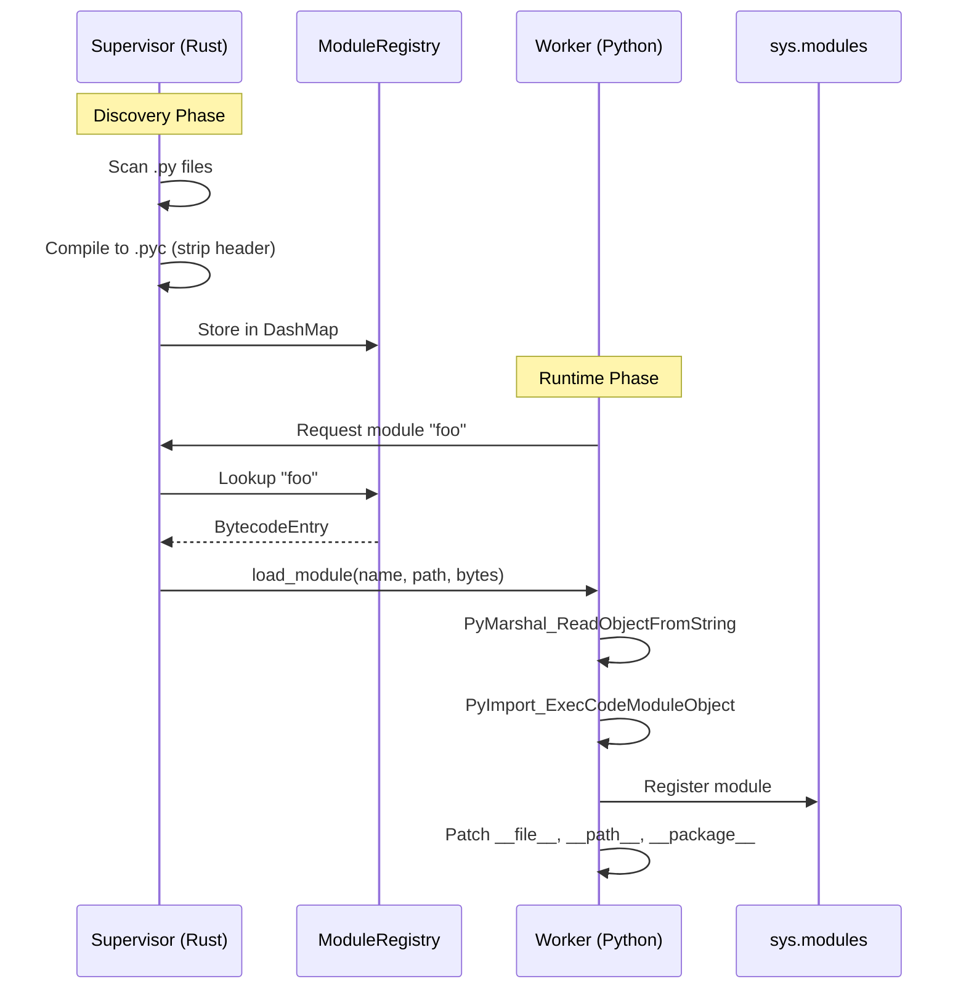
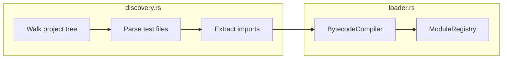

# Phase 2: Zero-Copy Module Loader Architecture

> **Status:** Design Phase  
> **Target:** < 1ms per module load  
> **Prerequisite:** Phase 1 (Physics Check) Complete

---

## 1. Problem Statement

### The Import Tax

Python's module import system (`importlib`) is designed for flexibility, not speed:

1. **Filesystem Traversal**: Searches `sys.path` entries sequentially
2. **Source Compilation**: Parses `.py` → AST → Bytecode on each import
3. **File I/O**: Reads/writes `.pyc` files from disk
4. **Locking**: GIL contention during import

**Cost Breakdown:**
| Operation | Latency |
|:----------|:--------|
| `sys.path` search | ~50-100μs per path entry |
| Source compilation | ~1-5ms for typical module |
| `.pyc` disk I/O | ~100-500μs |
| **Total** | **2-10ms per import** |

For a test suite with 100 tests importing 20 modules each, this adds **4-20 seconds** of pure import overhead.

---

## 2. The Solution: Push Model

Instead of Workers "pulling" modules via `import`, the Supervisor "pushes" pre-compiled bytecode directly into Python's memory.



---

## 3. Component Architecture

### 3.1 BytecodeCompiler

Responsible for `.py` → `.pyc` transformation.

**Strategy Options:**

| Option                        | Pros                     | Cons                                |
| :---------------------------- | :----------------------- | :---------------------------------- |
| `rustpython` crate            | Pure Rust, no subprocess | May have bytecode incompatibilities |
| System `python -m py_compile` | Guaranteed compatibility | Subprocess overhead                 |
| `compileall` module           | Batch compilation        | Requires Python import              |

**Recommended:** System Python with subprocess caching.

```rust
pub struct BytecodeCompiler {
    /// Path to Python executable
    python_exe: PathBuf,
    /// Cache directory for .pyc files
    cache_dir: PathBuf,
}

impl BytecodeCompiler {
    /// Compile a single source file to bytecode
    pub fn compile(&self, source: &Path) -> Result<Vec<u8>> {
        // 1. Generate .pyc via py_compile
        // 2. Read .pyc file
        // 3. Strip 16-byte header
        // 4. Return raw bytecode
    }
}
```

### 3.2 ModuleRegistry

Thread-safe storage for pre-compiled modules.

```rust
use dashmap::DashMap;

pub struct BytecodeEntry {
    /// Python module name (e.g., "foo.bar")
    pub name: String,
    /// Absolute path to source file
    pub source_path: PathBuf,
    /// Bytecode WITHOUT the 16-byte .pyc header
    pub bytecode: Vec<u8>,
    /// Is this a package (__init__.py)?
    pub is_package: bool,
}

pub struct ModuleRegistry {
    /// PathBuf → BytecodeEntry mapping
    entries: DashMap<PathBuf, BytecodeEntry>,
}
```

### 3.3 LoaderInterface (FFI)

The bridge between Rust and Python's C-API.

**Required Python C-API Functions:**

| Function                         | Purpose                                 |
| :------------------------------- | :-------------------------------------- |
| `PyMarshal_ReadObjectFromString` | Deserialize bytecode → code object      |
| `PyImport_ExecCodeModuleObject`  | Execute code, register in `sys.modules` |
| `PyModule_SetDocString`          | Set module docstring                    |

**Critical Constraint: .pyc Header**

```
.pyc File Format:
┌──────────────────────────────────────┐
│ Magic Number (4 bytes)               │ ← Python version identifier
├──────────────────────────────────────┤
│ Bit Field (4 bytes)                  │ ← PEP 552 hash-based validation
├──────────────────────────────────────┤
│ Timestamp (4 bytes)                  │ ← Source modification time
├──────────────────────────────────────┤
│ Size (4 bytes)                       │ ← Source file size
├──────────────────────────────────────┤
│ Marshalled Code Object (N bytes)     │ ← THIS is what PyMarshal expects
└──────────────────────────────────────┘
```

**The loader MUST strip the first 16 bytes before passing to `PyMarshal`.**

---

## 4. Namespace Patching

Standard `importlib` automatically sets module attributes. Our loader must do this manually:

| Attribute     | Purpose             | Value                               |
| :------------ | :------------------ | :---------------------------------- |
| `__file__`    | Source file path    | `/path/to/module.py`                |
| `__name__`    | Module name         | `foo.bar` (set by C-API)            |
| `__package__` | Parent package      | `foo` (for `foo.bar`)               |
| `__path__`    | Package search path | `["/path/to/foo/"]` (packages only) |
| `__loader__`  | Import loader       | Custom `TachLoader` object          |
| `__spec__`    | Module spec         | `ModuleSpec(...)`                   |

**Relative Import Support:**

For `from . import sibling` to work, `__package__` must be set correctly:

```python
# In foo/bar.py:
from . import baz  # Requires __package__ == "foo"
```

---

## 5. Integration Points

### 5.1 Discovery Phase

The `ModuleRegistry` is populated during test discovery:



### 5.2 Zygote Initialization

The Zygote receives the pre-filled `ModuleRegistry` and registers the loader FFI:

```rust
// In zygote.rs entrypoint()
let registry = ModuleRegistry::from_discovery(&discovery_result);

Python::with_gil(|py| {
    inject_tach_rust_module(py, &registry)?;
    Ok(())
})?;
```

### 5.3 Worker Execution

Workers use the loader instead of `import`:

```python
# In tach_harness.py
import tach_rust

def load_module_if_cached(name, path):
    """Load module from Supervisor cache if available."""
    bytecode = tach_rust.get_module_bytecode(name)
    if bytecode:
        tach_rust.load_module(name, path, bytecode)
        return True
    return False  # Fall back to standard import
```

---

## 6. Performance Targets

| Metric              | Target | Measurement Method                    |
| :------------------ | :----- | :------------------------------------ |
| Module load latency | < 1ms  | `Instant::now()` around `load_module` |
| Registry lookup     | < 1μs  | `DashMap` benchmark                   |
| Memory overhead     | < 10MB | For 100 modules, ~100KB bytecode each |

---

## 7. Error Handling

### Compilation Failures

```rust
enum CompileError {
    SyntaxError(String),      // Invalid Python source
    IoError(std::io::Error),  // File read/write failure
    VersionMismatch,          // Python version changed
}
```

**Recovery Strategy:**

1. Log warning
2. Fall back to `importlib` for that module
3. Continue with other modules

### Load Failures

```rust
enum LoadError {
    MarshalError,            // Invalid bytecode
    ExecError(PyErr),        // Module execution failed
    PatchError(PyErr),       // Namespace patching failed
}
```

**Recovery Strategy:**

1. Log error with full traceback
2. Fall back to `importlib`
3. Mark module as "toxic" (do not retry)

---

## 8. Security Considerations

1. **Bytecode Injection**: We compile from source, never accept external bytecode
2. **Path Traversal**: Validate all paths are within project root
3. **Memory Safety**: Use PyO3's safe wrappers where possible, audit `unsafe` blocks

---

## 9. Testing Strategy

### Unit Tests

- `.pyc` header stripping (verify 16 bytes removed)
- Module name extraction from path
- Package detection (`__init__.py`)

### Integration Tests

- Load simple module, verify `sys.modules` entry
- Load package, verify `__path__` is set
- Test relative imports work
- Test circular import handling

### Benchmark Tests

- Load 100 modules, measure total time
- Compare with standard `importlib`
- Memory usage profiling

---

## 10. Future Enhancements

1. **Shared Memory Transport**: Use `memfd_create` for zero-copy bytecode sharing
2. **Lazy Loading**: Load modules on-demand instead of all at startup
3. **Incremental Compilation**: Only recompile changed files
4. **Bytecode Caching**: Persist compiled bytecode between runs
