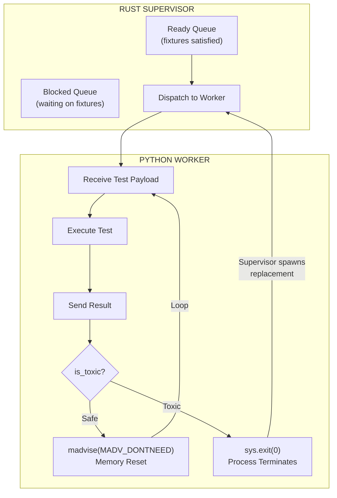
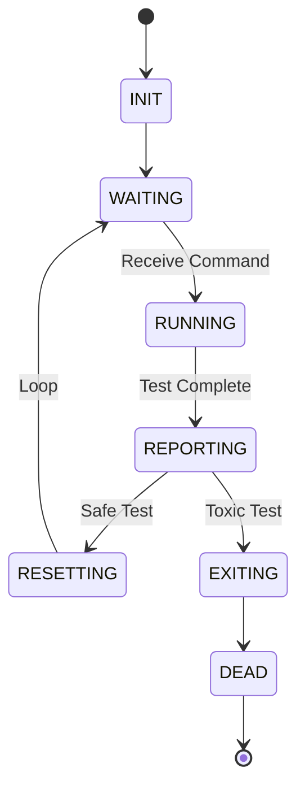
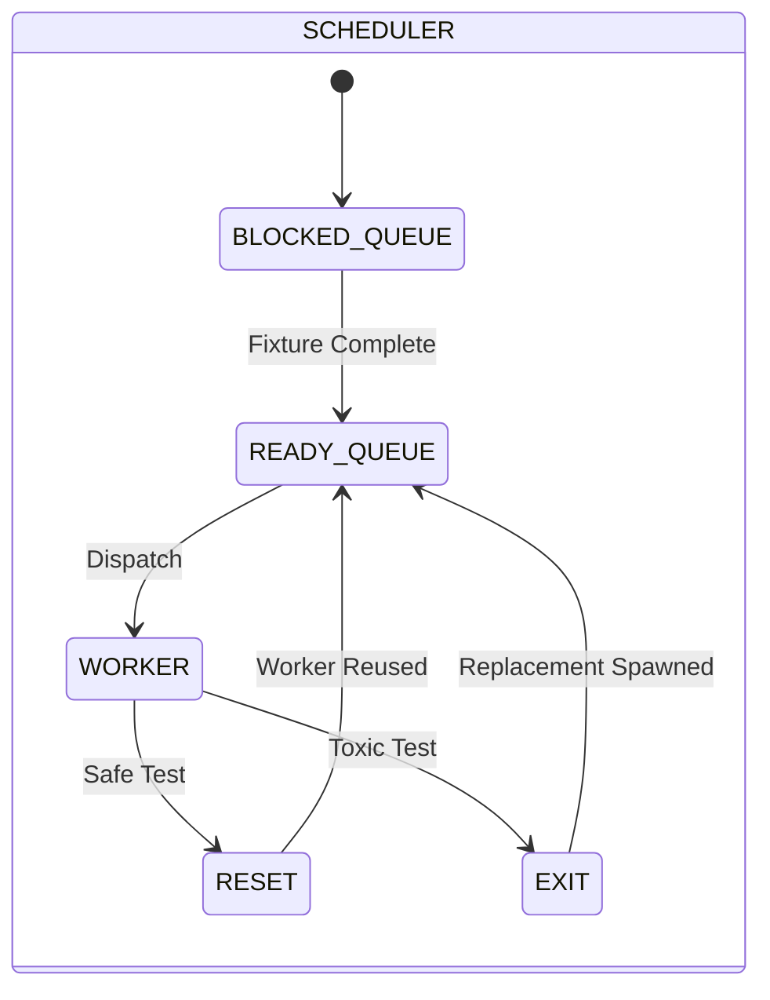
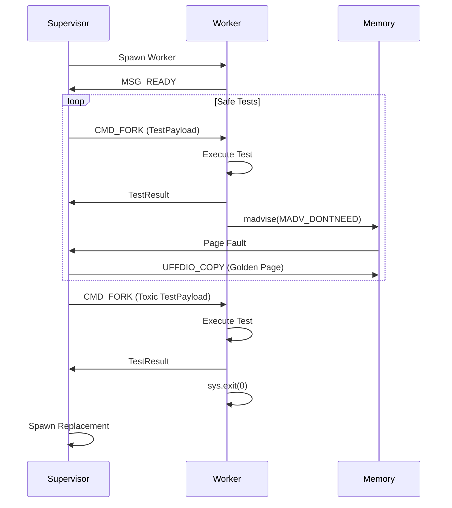

# Phase 4: Worker Loop and Dual-Path Scheduler

> **Status:** Implementation Complete
> **Target:** Worker reuse with memory reset for safe tests, process exit for toxic tests
> **Prerequisite:** Phase 3 (Toxicity Analysis) Complete

---

## 1. Overview

Phase 4 transforms Tach from a simple fork-server into a true **Runtime Hypervisor**. Instead of spawning a new process for each test, workers now:

1. **Loop** - Execute multiple tests in sequence
2. **Decide** - After each test, choose between memory reset or process exit
3. **Reset** - For safe tests, invalidate dirty pages and continue
4. **Exit** - For toxic tests, terminate and let Supervisor spawn replacement

This architecture achieves **sub-50 microsecond** test isolation while maintaining correctness for tests that cannot be safely reset.

---

## 2. Problem Statement

### The Fork Overhead

Traditional test runners (including Tach Phase 1-3) spawn a new process for each test:

```
Test 1: fork() → init Python → run test → exit
Test 2: fork() → init Python → run test → exit
Test 3: fork() → init Python → run test → exit
...
```

Even with Copy-on-Write optimization, each fork incurs:
- ~1-2ms kernel overhead
- ~50-100ms Python initialization (if not using Zygote)
- Memory fragmentation over time

### The Snapshot Solution

With userfaultfd-based memory snapshots (Phase 1), we can:

```
Worker: init Python → snapshot → run test → reset → run test → reset → ...
```

**But not all tests can be safely reset.** Tests that:
- Spawn threads (persist across reset)
- Open sockets (file descriptors leak)
- Register signal handlers (persist across reset)
- Use ctypes/cffi (native memory not tracked)

These "toxic" tests require process termination to ensure isolation.

---

## 3. Architecture

### 3.1 Dual-Path Execution Model



### 3.2 Scheduler Queue Split

The scheduler maintains two queues:

| Queue | Purpose | Condition |
|:------|:--------|:----------|
| `ready_queue` | Tests ready to execute | All fixture dependencies satisfied |
| `blocked_queue` | Tests waiting on fixtures | Missing fixture results |

**Fixture-Aware Scheduling:**

```rust
pub struct Scheduler {
    ready_queue: VecDeque<RunnableTest>,
    blocked_queue: VecDeque<RunnableTest>,
    fixture_results: HashMap<String, FixtureResult>,
    // ...
}

impl Scheduler {
    /// Move tests from blocked to ready when fixtures complete
    pub fn on_fixture_complete(&mut self, fixture_name: &str, result: FixtureResult) {
        self.fixture_results.insert(fixture_name.clone(), result);

        // Check blocked tests
        let mut still_blocked = VecDeque::new();
        while let Some(test) = self.blocked_queue.pop_front() {
            if self.all_fixtures_satisfied(&test) {
                self.ready_queue.push_back(test);
            } else {
                still_blocked.push_back(test);
            }
        }
        self.blocked_queue = still_blocked;
    }
}
```

### 3.3 Worker Loop Protocol

The Python harness implements a continuous loop:

```python
# tach_harness.py

def worker_loop(cmd_socket, result_socket):
    """Main worker loop - runs until EXIT command or toxic test."""

    while True:
        # 1. Receive command
        cmd = receive_command(cmd_socket)

        if cmd.type == CMD_EXIT:
            break

        if cmd.type == CMD_FORK:
            payload = cmd.payload

            # 2. Execute test
            result = run_single_test(payload)

            # 3. Send result BEFORE any exit decision
            send_result(result_socket, result)

            # 4. Dual-path decision
            if payload.is_toxic:
                # Toxic: Exit immediately, Supervisor spawns replacement
                sys.exit(0)
            else:
                # Safe: Reset memory and continue loop
                if snapshot_enabled:
                    tach_rust.reset_memory()
                # Loop continues...
```

### 3.4 Memory Reset Mechanism

The "Seppuku Pattern" - workers invalidate their own memory:

```rust
// zygote.rs

/// Cached memory regions for self-reset
static RESET_REGIONS: Mutex<Vec<(usize, usize)>> = Mutex::new(Vec::new());
static SNAPSHOT_ENABLED: AtomicBool = AtomicBool::new(false);

#[pyfunction]
fn reset_memory() -> PyResult<()> {
    if !SNAPSHOT_ENABLED.load(Ordering::SeqCst) {
        return Ok(());
    }

    let regions = RESET_REGIONS.lock().unwrap();
    for &(start, len) in regions.iter() {
        // SAFETY: madvise with MADV_DONTNEED is safe - marks pages as discardable
        unsafe {
            libc::madvise(start as *mut libc::c_void, len, libc::MADV_DONTNEED);
        }
    }
    Ok(())
}
```

**What happens after `MADV_DONTNEED`:**

1. Kernel marks pages as "not needed"
2. Next access triggers page fault
3. userfaultfd notifies Supervisor
4. Supervisor copies golden page back via `UFFDIO_COPY`
5. Worker continues with pristine memory state

---

## 4. Implementation Details

### 4.1 Static Mut Elimination (UB Fix)

**Problem:** The original implementation used `static mut` which is undefined behavior in Rust 2024:

```rust
// BEFORE (Undefined Behavior)
static mut RESET_REGIONS: Vec<(usize, usize)> = Vec::new();
static mut SNAPSHOT_ENABLED: bool = false;
```

**Solution:** Replace with thread-safe primitives:

```rust
// AFTER (Safe)
use std::sync::atomic::{AtomicBool, Ordering};
use std::sync::Mutex;

static RESET_REGIONS: Mutex<Vec<(usize, usize)>> = Mutex::new(Vec::new());
static SNAPSHOT_ENABLED: AtomicBool = AtomicBool::new(false);
```

**Why this is safe:**
- The Zygote is single-threaded after fork (no contention)
- `Mutex` provides interior mutability without UB
- `AtomicBool` is lock-free for simple flag checks

### 4.2 Fixture Scope Tracking

Workers track fixture scopes to determine reset eligibility:

```python
# tach_harness.py

class FixtureTracker:
    """Tracks active fixtures and their scopes."""

    def __init__(self):
        self.active_fixtures: Dict[str, FixtureScope] = {}

    def should_reset(self, completed_test: TestPayload) -> bool:
        """Determine if memory reset is safe after this test."""

        # Never reset after toxic tests
        if completed_test.is_toxic:
            return False

        # Check if any module-scoped fixtures are active
        for name, scope in self.active_fixtures.items():
            if scope == FixtureScope.MODULE:
                # Module fixtures persist - don't reset mid-module
                return False

        return True
```

### 4.3 Dead Man's Switch

Workers set `PR_SET_PDEATHSIG` to ensure cleanup if Supervisor dies:

```rust
// zygote.rs - First thing in entrypoint()

unsafe {
    libc::prctl(libc::PR_SET_PDEATHSIG, libc::SIGKILL);
}
```

This ensures no orphaned workers if the Supervisor crashes.

### 4.4 Result-Before-Exit Invariant

**Critical:** Toxic workers MUST send their result before exiting:

```python
# CORRECT
result = run_test(payload)
send_result(result_socket, result)  # Result sent
if payload.is_toxic:
    sys.exit(0)  # Now safe to exit

# WRONG - Result lost!
if payload.is_toxic:
    sys.exit(0)  # Exits before sending result!
result = run_test(payload)
send_result(result_socket, result)
```

The Scheduler distinguishes:
- **Expected exit:** Result received, then process terminates
- **Crash:** Process terminates without result

---

## 5. IPC Protocol

### 5.1 Command Channel (Supervisor → Worker)

| Command | Payload | Description |
|:--------|:--------|:------------|
| `CMD_FORK` (0x01) | `TestPayload` | Execute this test |
| `CMD_EXIT` (0x02) | None | Graceful shutdown |

### 5.2 Result Channel (Worker → Supervisor)

| Message | Payload | Description |
|:--------|:--------|:------------|
| `MSG_READY` (0x00) | None | Worker ready for commands |
| `TestResult` | Serialized result | Test execution result |

### 5.3 TestPayload Structure

```rust
#[derive(Serialize, Deserialize)]
pub struct TestPayload {
    pub test_id: u32,
    pub file_path: String,
    pub test_name: String,
    pub is_async: bool,
    pub fixtures: Vec<FixtureInfo>,
    pub log_fd: i32,
    pub debug_socket_path: String,
    pub is_toxic: bool,  // Phase 4: Dual-path decision flag
}
```

---

## 6. Performance Characteristics

### 6.1 Latency Comparison

| Operation | Fork-Server | Hypervisor (Phase 4) |
|:----------|:------------|:---------------------|
| Test isolation | ~1-2ms (fork) | **< 50μs** (madvise) |
| Memory overhead | Full CoW copy | Page-level tracking |
| Worker reuse | Never | Until toxic test |

### 6.2 Throughput Model

For a test suite with N tests, T toxic tests:

```
Fork-Server:     N × fork_cost
Hypervisor:      (N - T) × reset_cost + T × fork_cost

Where:
  fork_cost  ≈ 1-2ms
  reset_cost ≈ 50μs

Example (1000 tests, 50 toxic):
  Fork-Server: 1000 × 1.5ms = 1.5 seconds
  Hypervisor:  950 × 0.05ms + 50 × 1.5ms = 47.5ms + 75ms = 122.5ms

  Speedup: 12x
```

---

## 7. Error Handling

### 7.1 Worker Crash Detection

```rust
impl Scheduler {
    async fn handle_worker_exit(&mut self, worker_id: WorkerId, exit_status: ExitStatus) {
        if let Some(pending_test) = self.get_pending_test(worker_id) {
            if !self.received_result(pending_test.test_id) {
                // Crash: No result received
                self.record_crash(pending_test, exit_status);
            }
            // Expected exit: Result already recorded
        }

        // Spawn replacement worker
        self.spawn_worker().await;
    }
}
```

### 7.2 Reset Failure Recovery

If `madvise` fails (rare), the worker logs and continues:

```rust
let ret = unsafe { libc::madvise(start as *mut _, len, libc::MADV_DONTNEED) };
if ret != 0 {
    eprintln!(
        "[tach_rust] madvise failed for region {:x}-{:x}: {}",
        start, start + len, std::io::Error::last_os_error()
    );
    // Continue anyway - pages will be dirty but test isolation maintained
}
```

---

## 8. Testing Strategy

### 8.1 Unit Tests

| Test | File | Description |
|:-----|:-----|:------------|
| `test_worker_loop_safe_reset` | `zygote.rs` | Safe test triggers reset, loop continues |
| `test_worker_loop_toxic_exit` | `zygote.rs` | Toxic test triggers exit |
| `test_scheduler_queue_split` | `scheduler.rs` | Ready/blocked queue management |
| `test_fixture_dependency_resolution` | `resolver.rs` | Fixture ordering |

### 8.2 Integration Tests

| Test | File | Description |
|:-----|:-----|:------------|
| `test_dual_path_execution` | `phase4_integration.rs` | End-to-end safe/toxic handling |
| `test_worker_replacement` | `phase4_integration.rs` | Supervisor spawns replacement after toxic |
| `test_memory_reset_isolation` | `phase4_integration.rs` | State doesn't leak between tests |

### 8.3 Stress Tests

- Run 1000 safe tests on single worker (verify no memory leaks)
- Interleave safe and toxic tests (verify correct path selection)
- Kill Supervisor mid-run (verify workers die via PDEATHSIG)

---

## 9. Future Enhancements

### 9.1 Predictive Reset

Use historical data to predict which tests are likely safe:

```rust
struct TestHistory {
    test_name: String,
    reset_success_rate: f64,
    avg_memory_delta: usize,
}

fn should_attempt_reset(test: &RunnableTest, history: &TestHistory) -> bool {
    history.reset_success_rate > 0.95 && history.avg_memory_delta < 1_000_000
}
```

### 9.2 Partial Reset

Only reset memory regions that were actually modified:

```rust
// Track dirty pages via userfaultfd write-protect
let dirty_pages = uffd.get_dirty_pages();
for page in dirty_pages {
    madvise(page, PAGE_SIZE, MADV_DONTNEED);
}
```

### 9.3 Worker Pooling

Maintain multiple workers for parallel execution:

```rust
struct WorkerPool {
    workers: Vec<Worker>,
    safe_workers: VecDeque<WorkerId>,   // Available for safe tests
    toxic_workers: VecDeque<WorkerId>,  // Dedicated for toxic tests
}
```

---

## 10. Appendix: State Machine Diagrams

### Worker State Machine



### Scheduler State Machine



### Complete Worker Lifecycle


