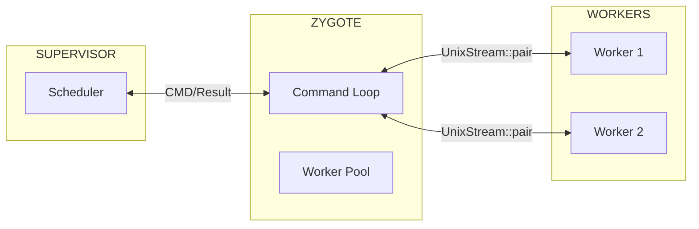
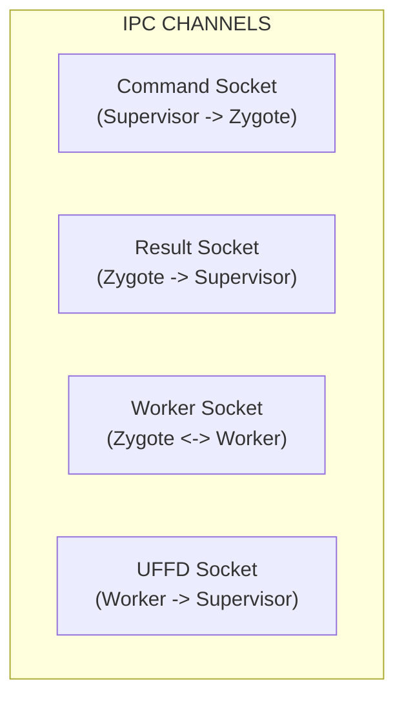
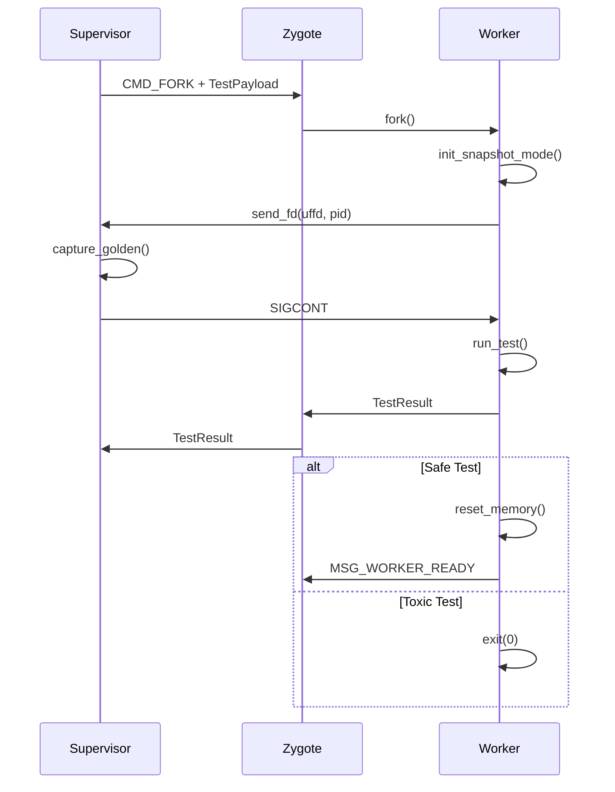

# IPC Protocol

The IPC Protocol defines communication between Supervisor, Zygote, and Workers.

---

## Overview

Tach uses Unix domain sockets with binary serialization:

1. **bincode** for structured message serialization
2. **Length-prefixed framing** for message boundaries
3. **SCM_RIGHTS** for file descriptor passing



---

## Data Structures

### TestPayload

Sent from Supervisor to Worker to initiate a test.

```rust
#[derive(Debug, Clone, Serialize, Deserialize)]
pub struct TestPayload {
    pub test_id: u32,
    pub file_path: String,
    pub test_name: String,
    pub is_async: bool,
    pub fixtures: Vec<FixtureInfo>,
    pub log_fd: i32,
    pub debug_socket_path: String,
    pub is_toxic: bool,
}
```

| Field               | Description                               |
| :------------------ | :---------------------------------------- |
| `test_id`           | Unique identifier for result correlation  |
| `file_path`         | Path to test file                         |
| `test_name`         | Fully qualified test name (node ID)       |
| `is_async`          | Whether test is async                     |
| `fixtures`          | Required fixtures                         |
| `log_fd`            | File descriptor for stdout/stderr capture |
| `debug_socket_path` | Path for pdb tunneling                    |
| `is_toxic`          | Determines worker lifecycle               |

### TestResult

Sent from Worker to Supervisor upon test completion.

```rust
#[derive(Debug, Clone, Serialize, Deserialize)]
pub struct TestResult {
    pub test_id: u32,
    pub status: u8,
    pub duration_ns: u64,
    pub message: String,
}
```

### FixtureInfo

Metadata about required fixtures.

```rust
#[derive(Debug, Clone, Serialize, Deserialize)]
pub struct FixtureInfo {
    pub name: String,
    pub scope: String,
}
```

---

## Command Bytes

| Constant           | Value | Direction            | Purpose                     |
| :----------------- | :---- | :------------------- | :-------------------------- |
| `CMD_EXIT`         | 0x00  | Supervisor -> Zygote | Shutdown                    |
| `CMD_FORK`         | 0x01  | Supervisor -> Zygote | Spawn/dispatch test         |
| `CMD_RUN_TEST`     | 0x02  | Zygote -> Worker     | Run test on existing worker |
| `MSG_READY`        | 0x42  | Zygote -> Supervisor | Zygote initialized          |
| `MSG_WORKER_READY` | 0x43  | Worker -> Zygote     | Worker reset complete       |

---

## Status Codes

| Constant               | Value | Meaning                 |
| :--------------------- | :---- | :---------------------- |
| `STATUS_PASS`          | 0     | Test passed             |
| `STATUS_FAIL`          | 1     | Test failed (assertion) |
| `STATUS_SKIP`          | 2     | Test skipped            |
| `STATUS_CRASH`         | 3     | Worker crashed          |
| `STATUS_ERROR`         | 4     | Test error (exception)  |
| `STATUS_HARNESS_ERROR` | 5     | Harness error           |

---

## Message Framing

All structured messages use an 8-byte header with magic bytes, version, and length:

```
+--------+---------+----------+--------+------------------+
| Magic  | Version | Reserved | Length | Payload          |
| 2 bytes| 1 byte  | 1 byte   | 4 bytes| (bincode)        |
| "TA"   | 0x01    | 0x00     | LE u32 |                  |
+--------+---------+----------+--------+------------------+

Total header size: 8 bytes (HEADER_SIZE constant)
```

### Encoding

```rust
/// Encode a struct to bincode bytes with protocol header
pub fn encode_with_length<T: serde::Serialize>(
    value: &T,
) -> Result<Vec<u8>, bincode::error::EncodeError> {
    let payload = bincode::serde::encode_to_vec(value, bincode::config::standard())?;
    let len = payload.len() as u32;
    let mut result = Vec::with_capacity(HEADER_SIZE + payload.len());
    result.extend_from_slice(&PROTOCOL_MAGIC);  // "TA"
    result.push(PROTOCOL_VERSION);              // 1
    result.push(0);                             // Reserved
    result.extend_from_slice(&len.to_le_bytes());
    result.extend_from_slice(&payload);
    Ok(result)
}
```

### Decoding

Decoding uses `decode_with_limit` which validates the protocol header before parsing:

```rust
// Read protocol header: magic(2) + version(1) + reserved(1) + length(4) = 8 bytes
let mut header_buf = [0u8; HEADER_SIZE];
reader.read_exact(&mut header_buf)?;

// Extract length from bytes 4-7 (little-endian u32)
let len = u32::from_le_bytes(header_buf[4..8].try_into().unwrap()) as usize;

// OOM protection: Validate size BEFORE allocating
if len > MAX_PAYLOAD_SIZE {
    return Err(ProtocolError::PayloadTooLarge);
}

// Allocate buffer for header + payload
let mut full_buf = vec![0u8; HEADER_SIZE + len];
full_buf[..HEADER_SIZE].copy_from_slice(&header_buf);
reader.read_exact(&mut full_buf[HEADER_SIZE..])?;

// Decode with header validation
let decoded: T = decode_with_limit(&full_buf, MAX_PAYLOAD_SIZE)?;
```

> **Note:** `decode_with_limit` validates magic bytes and protocol version before decoding.

---

## Message Size Limits

To prevent OOM attacks from malicious payloads, all IPC messages enforce size limits:

| Limit              | Value  | Purpose                            |
| ------------------ | ------ | ---------------------------------- |
| `MAX_PAYLOAD_SIZE` | 16 MiB | Maximum serialized message size    |
| Message truncation | 4 KiB  | Maximum error/output string length |

### Enforcement

Size validation occurs **before** memory allocation using `decode_with_limit`:

```rust
pub fn decode_with_limit<T: DeserializeOwned>(
    data: &[u8],
    max_size: usize,
) -> Result<T, DecodeWithLimitError> {
    // Validate minimum header size
    if data.len() < HEADER_SIZE {
        return Err(DecodeWithLimitError::InsufficientData { ... });
    }

    // Validate magic bytes
    if data[0..2] != PROTOCOL_MAGIC {
        return Err(DecodeWithLimitError::InvalidMagic);
    }

    // Validate protocol version
    if data[2] != PROTOCOL_VERSION {
        return Err(DecodeWithLimitError::VersionMismatch { ... });
    }

    // Extract length from bytes 4-7 (after magic, version, reserved)
    let claimed_len = u32::from_le_bytes(data[4..8].try_into()?) as usize;

    // Reject before allocating
    if claimed_len > max_size {
        return Err(DecodeWithLimitError::PayloadTooLarge { ... });
    }
    // ... proceed with decode
}
```

This prevents a malicious actor from sending a crafted length prefix (e.g., `0xFFFFFFFF`) to trigger a 4GB allocation.

> **Security Note:** The `decode_with_limit` function is used at all IPC boundaries where untrusted data is received (Supervisor ↔ Zygote, Zygote ↔ Worker).

---

## Socket Architecture



### Supervisor <-> Zygote

Two separate sockets prevent head-of-line blocking:

```rust
let (cmd_sock, zygote_cmd) = UnixStream::pair()?;
let (res_sock, zygote_res) = UnixStream::pair()?;
```

### Zygote <-> Worker

Created at fork time:

```rust
let (parent_sock, child_sock) = UnixStream::pair()?;
match unsafe { fork() } {
    0 => {
        // Child uses child_sock
        drop(parent_sock);
    }
    pid => {
        // Parent uses parent_sock
        drop(child_sock);
    }
}
```

---

## SCM_RIGHTS (File Descriptor Passing)

Used to pass userfaultfd from Worker to Supervisor.

### Sending

```rust
pub fn send_fd(sock: &UnixStream, pid: i32, fd: RawFd) -> Result<()> {
    let pid_bytes = pid.to_le_bytes();
    let iov = [IoSlice::new(&pid_bytes)];
    let fds = [fd];
    let cmsg = [ControlMessage::ScmRights(&fds)];

    sendmsg::<()>(sock.as_raw_fd(), &iov, &cmsg, MsgFlags::empty(), None)?;
    Ok(())
}
```

### Receiving

```rust
pub fn recv_fd(sock: &UnixStream) -> Result<(i32, OwnedFd)> {
    let mut pid_buf = [0u8; 4];
    let mut iov = [IoSliceMut::new(&mut pid_buf)];
    let mut cmsg_buf = cmsg_space!([RawFd; 1]);

    let msg = recvmsg::<()>(
        sock.as_raw_fd(),
        &mut iov,
        Some(&mut cmsg_buf),
        MsgFlags::empty(),
    )?;

    let pid = i32::from_le_bytes(pid_buf);
    let fd = extract_fd_from_cmsg(&msg)?;
    Ok((pid, fd))
}
```

---

## Message Truncation

Result messages are truncated to prevent buffer overflow:

```rust
fn truncate_message(msg: String) -> String {
    const MAX_LEN: usize = 4096;
    if msg.len() > MAX_LEN {
        format!("{}... [truncated]", &msg[..MAX_LEN])
    } else {
        msg
    }
}
```

---

## Timeout Handling

The scheduler uses read timeouts for crash detection:

```rust
sock.set_read_timeout(Some(Duration::from_secs(5)))?;

// Read length-prefixed message with timeout
let mut len_buf = [0u8; 4];
match sock.read_exact(&mut len_buf) {
    Ok(_) => {
        let len = u32::from_le_bytes(len_buf) as usize;
        let mut payload = vec![0u8; len];
        sock.read_exact(&mut payload)?;
        let (result, _): (TestResult, usize) =
            bincode::serde::decode_from_slice(&payload, bincode::config::standard())?;
        handle_result(result);
    }
    Err(e) if e.kind() == ErrorKind::TimedOut => {
        mark_worker_crashed(worker_id);
    }
    Err(e) => return Err(e.into()),
}
```

---

## Protocol Flow



---

## Related Documentation

- [Scheduler](scheduler.md) - How messages are dispatched
- [Zygote Lifecycle](zygote.md) - Command loop implementation
- [Physics Engine](snapshot.md) - UFFD handshake details
