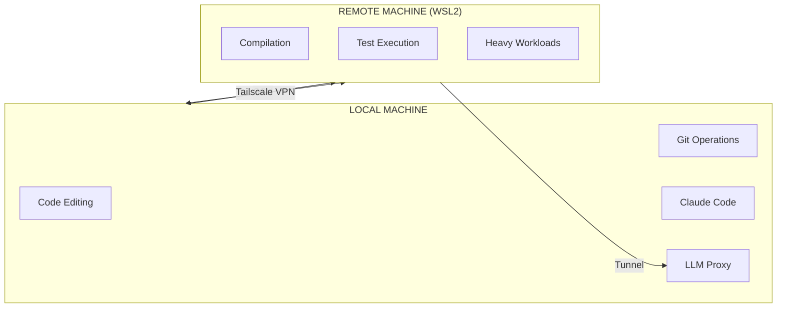

# Remote Development Setup Guide

> **Purpose:** Develop Tach across multiple machines using WSL2 and Tailscale
> **Architecture:** Local Linux PC + Remote Windows/WSL2

---

## 1. Overview

Tach development can benefit from distributed development across machines:
- PyO3 compilation: 2-3GB RAM per parallel job
- Test execution: Fork/snapshot operations need headroom
- Debug builds: 80MB+ test binaries

This guide sets up a remote development workflow:



---

## 2. Prerequisites

### Local Machine (Linux)
- Ubuntu 22.04+ or similar
- Git, SSH client
- Claude Code Router (ccr) with LLM proxy configured (optional)
- Tailscale installed

### Remote Machine (Windows + WSL2)
- Windows 10 21H2+ or Windows 11
- WSL2 with Ubuntu 24.04 LTS
- 16GB+ RAM recommended
- Tailscale installed

---

## 3. WSL2 Setup (Remote Machine)

### 3.1 Enable WSL2

Open PowerShell as Administrator:

```powershell
wsl --install -d Ubuntu-24.04
```

Reboot if prompted, then set up your Ubuntu user.

### 3.2 Prevent Auto-Shutdown

Create `C:\Users\YOUR_USERNAME\.wslconfig`:

```ini
[wsl2]
vmIdleTimeout=-1
memory=32GB
processors=8
```

Then restart WSL:

```powershell
wsl --shutdown
wsl
```

### 3.3 Install Development Dependencies

Inside WSL2 Ubuntu:

```bash
# Update system
sudo apt update && sudo apt upgrade -y

# Install build essentials
sudo apt install -y build-essential curl git python3 python3-pip python3-venv \
    pkg-config libssl-dev llvm clang libclang-dev openssh-server

# Install Rust
curl --proto '=https' --tlsv1.2 -sSf https://sh.rustup.rs | sh -s -- -y
source ~/.cargo/env

# Install Node.js (for Claude Code)
curl -fsSL https://deb.nodesource.com/setup_20.x | sudo -E bash -
sudo apt install -y nodejs

# Install Claude Code
sudo npm install -g @anthropic-ai/claude-code

# Verify installations
rustc --version
python3 --version
node --version
claude --version
```

### 3.4 Start SSH Server

```bash
# Start SSH
sudo service ssh start

# Auto-start SSH on WSL launch
echo 'sudo service ssh start' >> ~/.bashrc

# Set password for SSH access
sudo passwd $USER
```

---

## 4. Tailscale Setup (Cross-Network Connectivity)

Tailscale creates a secure mesh VPN that works across different networks.

### 4.1 Install on WSL2 (Remote)

```bash
curl -fsSL https://tailscale.com/install.sh | sh
sudo tailscale up
```

Follow the authentication URL and sign in.

### 4.2 Install on Local Machine

```bash
curl -fsSL https://tailscale.com/install.sh | sh
sudo tailscale up
```

Sign in with the **same account**.

### 4.3 Get Tailscale IPs

```bash
# On each machine
tailscale ip -4
```

Example output:
- Local: `100.x.x.x`
- Remote: `100.y.y.y`

### 4.4 Test Connectivity

From local machine:

```bash
ping <remote-tailscale-ip>
ssh <username>@<remote-tailscale-ip>
```

---

## 5. SSH Key Authentication

### 5.1 Generate Key (Local Machine)

```bash
ssh-keygen -t ed25519 -N "" -f ~/.ssh/id_ed25519
```

### 5.2 Copy to Remote

```bash
ssh-copy-id <username>@<remote-tailscale-ip>
```

### 5.3 Verify Passwordless Login

```bash
ssh <username>@<remote-tailscale-ip> "echo 'SSH key auth works!'"
```

---

## 6. LLM Proxy Tunnel

If your LLM proxy (Claude Code Router) runs on the local machine, you need to tunnel it to the remote.

### 6.1 Start Tunnel (From Remote)

```bash
ssh -L 3456:127.0.0.1:3456 <username>@<local-tailscale-ip> -N &
```

This forwards remote's `localhost:3456` to local's `localhost:3456`.

### 6.2 Configure Claude Code (Remote)

```bash
# Add to ~/.bashrc on remote
export ANTHROPIC_BASE_URL="http://127.0.0.1:3456"
export ANTHROPIC_AUTH_TOKEN="any-string-is-ok"
```

### 6.3 Verify Tunnel

```bash
curl http://127.0.0.1:3456
# Should return: {"message":"LLMs API","version":"..."}
```

---

## 7. Clone and Build Tach

### 7.1 Clone Repository (Remote)

```bash
mkdir -p ~/dev && cd ~/dev
git clone https://github.com/YOUR_USERNAME/tach-core.git
cd tach-core
```

### 7.2 Setup Python Environment

```bash
python3 -m venv .venv
source .venv/bin/activate
pip install pytest
```

### 7.3 Configure Rust Environment

```bash
export PYO3_PYTHON=$(which python)
echo 'export PYO3_PYTHON=$(which python)' >> ~/.bashrc
```

### 7.4 Build

```bash
cargo build
```

### 7.5 Run Tests

```bash
cargo test --lib
cargo test --test resolver_integration
```

---

## 8. Development Workflow

### Option A: Run Claude Code on Remote

SSH into remote and run Claude Code there:

```bash
ssh <username>@<remote-tailscale-ip>
cd ~/dev/tach-core
source .venv/bin/activate
claude
```

### Option B: Run Claude Code Locally, Execute Remotely

Keep Claude Code on local machine, but run heavy commands via SSH:

```bash
# From local Claude Code session
ssh <username>@<remote-tailscale-ip> "cd ~/dev/tach-core && source ~/.cargo/env && cargo test --lib"
```

### Option C: VS Code Remote Development

1. Install "Remote - SSH" extension in VS Code
2. Connect to `<username>@<remote-tailscale-ip>`
3. Open `/home/<username>/dev/tach-core`
4. Use integrated terminal for builds/tests

---

## 9. Syncing Code

### 9.1 Git-Based Sync (Recommended)

```bash
# On local: commit and push
git add -A && git commit -m "feat: my changes" && git push

# On remote: pull
ssh <username>@<remote-tailscale-ip> "cd ~/dev/tach-core && git pull"
```

### 9.2 rsync-Based Sync (For Uncommitted Changes)

```bash
# Sync local changes to remote
rsync -avz --exclude 'target/' --exclude '.git/' \
    /path/to/local/tach-core/ \
    <username>@<remote-tailscale-ip>:~/dev/tach-core/
```

---

## 10. Troubleshooting

### WSL2 Shuts Down Unexpectedly

**Cause:** Windows reclaims resources or idle timeout.

**Fix:** Create `.wslconfig` with `vmIdleTimeout=-1`.

### SSH Connection Refused

**Cause:** SSH server not running in WSL2.

**Fix:**
```bash
sudo service ssh start
```

### Tailscale IP Not Reachable

**Cause:** Tailscale not running or not authenticated.

**Fix:**
```bash
sudo tailscale up
tailscale status
```

### LLM Proxy Tunnel Drops

**Cause:** SSH session closed.

**Fix:** Use autossh for persistent tunnels:
```bash
sudo apt install autossh
autossh -M 0 -f -N -L 3456:127.0.0.1:3456 <username>@<local-tailscale-ip>
```

### Cargo Build Fails with "libclang not found"

**Cause:** LLVM/Clang not installed.

**Fix:**
```bash
sudo apt install -y llvm clang libclang-dev
```

---

## 11. Security Considerations

1. **Tailscale:** End-to-end encrypted, no port forwarding needed
2. **SSH Keys:** Use ed25519, never share private keys
3. **LLM Proxy:** Only accessible via SSH tunnel, not exposed to network
4. **WSL2:** Isolated from Windows, but shares filesystem at `/mnt/c/`

---

## 12. Quick Reference

### Start Development Session

```bash
# 1. Start SSH tunnel for LLM proxy (on remote)
ssh -L 3456:127.0.0.1:3456 <username>@<local-tailscale-ip> -N &

# 2. SSH into remote
ssh <username>@<remote-tailscale-ip>

# 3. Navigate to project
cd ~/dev/tach-core
source .venv/bin/activate

# 4. Pull latest changes
git pull

# 5. Build and test
cargo build && cargo test --lib

# 6. Start Claude Code (optional)
claude
```

### End Development Session

```bash
# On remote: commit and push
git add -A && git commit -m "feat: my changes" && git push

# Exit SSH
exit
```
