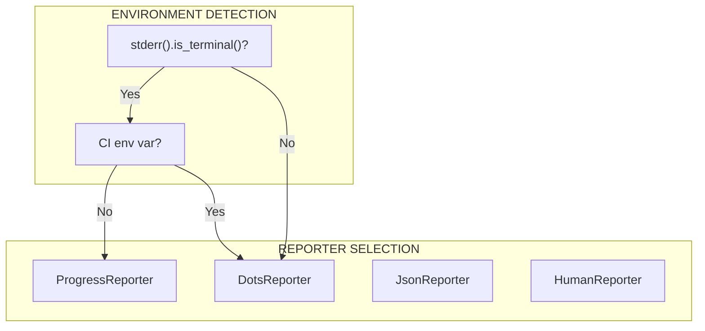

# Reporter

The Reporter system provides adaptive output based on environment detection.

---

## Overview

Tach supports multiple output formats:

1. **ProgressReporter** - Interactive progress bar for terminals
2. **DotsReporter** - Simple dots for CI environments
3. **HumanReporter** - Simple human-readable text output
4. **JsonReporter** - NDJSON for IDE integration



---

## Reporter Trait

```rust
pub trait Reporter {
    /// Called at start of test run
    fn on_run_start(&mut self, count: usize);

    /// Called when a test begins execution
    fn on_test_start(&mut self, id: &str, file: &str);

    /// Called when a test completes
    fn on_test_finished(&mut self, id: &str, status: &str, duration_ms: u64, message: Option<&str>);

    /// Called at end of test run
    fn on_run_finished(&mut self, passed: usize, failed: usize, skipped: usize, duration_ms: u64);

    /// Called on fatal error
    fn on_error(&mut self, message: &str);
}
```

### Status Strings

The reporter uses simple string literals for status values:

- `"pass"` - Test passed
- `"fail"` - Test failed
- `"skip"` - Test skipped

---

## HumanReporter

Simple human-readable output to stderr. Example:

```
[tach] Running 100 tests...
  test_foo.py::test_example ... PASS (12ms)
  test_foo.py::test_another ... FAIL (8ms)
[tach] 98 passed, 1 failed, 1 skipped in 2.50s
```

---

## ProgressReporter

Interactive progress bar using `indicatif`.

### Output Format

```
Running tests...
[=>          ] 45/100  P:40 F:3 S:2
```

### Implementation

```rust
/// Record of a test failure for summary display
struct FailureRecord {
    id: String,
    message: String,
}

pub struct ProgressReporter {
    bar: ProgressBar,
    passed: usize,
    failed: usize,
    skipped: usize,
    failures: Vec<FailureRecord>,
    total: usize,
}

impl ProgressReporter {
    pub fn new() -> Self {
        let bar = ProgressBar::new(0);
        bar.set_style(
            ProgressStyle::default_bar()
                .template(
                    "{spinner:.green} [{elapsed_precise}] [{bar:40.cyan/blue}] {pos}/{len} {msg}",
                )
                .unwrap_or_else(|_| ProgressStyle::default_bar())
                .progress_chars("=>-"),
        );

        Self {
            bar,
            passed: 0,
            failed: 0,
            skipped: 0,
            failures: Vec::new(),
            total: 0,
        }
    }

    /// Check if we should use progress bar (interactive terminal)
    pub fn should_use_progress_bar() -> bool {
        std::io::stderr().is_terminal() && std::env::var("CI").is_err()
    }
}
```

### Failure Buffering

Failures are buffered and displayed at the end:

```rust
fn on_run_finished(&mut self, passed: usize, failed: usize, skipped: usize, duration_ms: u64) {
    self.bar.finish_and_clear();

    // Print failure details
    if !self.failures.is_empty() {
        eprintln!("\n{} FAILURES {}", "=".repeat(30), "=".repeat(30));
        for failure in &self.failures {
            eprintln!("\n{}", failure.id);
            eprintln!("{}", "-".repeat(failure.id.len().min(70)));
            // Limit failure message to 20 lines
            for line in failure.message.lines().take(20) {
                eprintln!("{}", line);
            }
        }
        eprintln!("{}", "=".repeat(70));
    }

    // Print summary with colors
    let duration_secs = duration_ms as f64 / 1000.0;
    if failed > 0 {
        eprintln!(
            "\n\x1b[31m{} passed, {} failed, {} skipped in {:.2}s\x1b[0m",
            passed, failed, skipped, duration_secs
        );
    } else {
        eprintln!(
            "\n\x1b[32m{} passed, {} failed, {} skipped in {:.2}s\x1b[0m",
            passed, failed, skipped, duration_secs
        );
    }
}
```

---

## DotsReporter

Simple dots output for CI environments.

### Output Format

```
....F..s.....F.....
```

- `.` = passed
- `F` = failed
- `s` = skipped
- `?` = unknown status

### Implementation

```rust
pub struct DotsReporter {
    passed: usize,
    failed: usize,
    skipped: usize,
    failures: Vec<FailureRecord>,
    column: usize,
}

impl Reporter for DotsReporter {
    fn on_test_finished(
        &mut self,
        id: &str,
        status: &str,
        _duration_ms: u64,
        message: Option<&str>,
    ) {
        match status {
            "pass" => {
                self.passed += 1;
                self.print_char('.');
            }
            "fail" => {
                self.failed += 1;
                self.print_char('F');
                // Buffer failure for summary
                self.failures.push(FailureRecord {
                    id: id.to_string(),
                    message: message.unwrap_or("").to_string(),
                });
            }
            "skip" => {
                self.skipped += 1;
                self.print_char('s');
            }
            _ => {
                self.print_char('?');
            }
        }
    }
}
```

The DotsReporter wraps output at 80 columns for readability.

---

## JsonReporter

NDJSON output for IDE integration.

### Output Format

```json
{"event":"run_start","count":100}
{"event":"test_start","id":"test_example.py::test_foo","file":"test_example.py"}
{"event":"test_finished","id":"test_example.py::test_foo","status":"pass","duration_ms":12}
{"event":"run_finished","passed":98,"failed":1,"skipped":1,"duration_ms":2500}
```

### MachineEvent Enum

```rust
#[derive(Serialize)]
#[serde(tag = "event", rename_all = "snake_case")]
pub enum MachineEvent<'a> {
    RunStart { count: usize },
    TestStart { id: &'a str, file: &'a str },
    TestFinished {
        id: &'a str,
        status: &'a str,
        duration_ms: u64,
        #[serde(skip_serializing_if = "Option::is_none")]
        message: Option<&'a str>,
    },
    RunFinished {
        passed: usize,
        failed: usize,
        skipped: usize,
        duration_ms: u64,
    },
    Error { message: &'a str },
}
```

### Implementation

```rust
pub struct JsonReporter;

impl Reporter for JsonReporter {
    fn on_test_finished(
        &mut self,
        id: &str,
        status: &str,
        duration_ms: u64,
        message: Option<&str>,
    ) {
        let event = MachineEvent::TestFinished {
            id,
            status,
            duration_ms,
            message,
        };
        if let Ok(json) = serde_json::to_string(&event) {
            println!("{}", json);
        }
    }
}
```

### Stdout Purity

JsonReporter writes to **stdout** while other output goes to **stderr**, ensuring clean JSON parsing.

---

## MultiReporter

Broadcasts events to multiple reporters.

```rust
pub struct MultiReporter {
    reporters: Vec<Box<dyn Reporter>>,
}

impl MultiReporter {
    pub fn new(reporters: Vec<Box<dyn Reporter>>) -> Self {
        Self { reporters }
    }
}

impl Reporter for MultiReporter {
    fn on_test_finished(&mut self, id: &str, status: &str, duration_ms: u64, message: Option<&str>) {
        for reporter in &mut self.reporters {
            reporter.on_test_finished(id, status, duration_ms, message);
        }
    }
}
```

### Usage

```rust
let reporters: Vec<Box<dyn Reporter>> = vec![
    Box::new(ProgressReporter::new()),
    Box::new(JsonReporter),
];
let mut multi = MultiReporter::new(reporters);
```

---

## Environment Detection

```rust
pub fn should_use_progress_bar() -> bool {
    std::io::stderr().is_terminal() && std::env::var("CI").is_err()
}
```

| Condition       | Reporter         |
| :-------------- | :--------------- |
| TTY + no CI     | ProgressReporter |
| TTY + CI        | DotsReporter     |
| No TTY          | DotsReporter     |
| `--format json` | JsonReporter     |

---

## Color Output

The reporters use raw ANSI escape codes for terminal colors:

```rust
// Red for failures
eprintln!("\x1b[31m{} passed, {} failed, {} skipped\x1b[0m", passed, failed, skipped);

// Green for success
eprintln!("\x1b[32m{} passed, {} failed, {} skipped\x1b[0m", passed, failed, skipped);

// Cyan for informational messages
eprintln!("\x1b[36m(Saved {:.1}s of initialization overhead)\x1b[0m", saved_secs);
```

ANSI color codes used:

- `\x1b[31m` - Red (failures)
- `\x1b[32m` - Green (success)
- `\x1b[36m` - Cyan (info)
- `\x1b[0m` - Reset

---

## CLI Integration

```rust
// In main.rs
let reporters: Vec<Box<dyn Reporter>> = if cli.format == "json" {
    vec![Box::new(JsonReporter)]
} else if ProgressReporter::should_use_progress_bar() {
    vec![Box::new(ProgressReporter::new())]
} else {
    vec![Box::new(DotsReporter::new())]
};

let mut multi = MultiReporter::new(reporters);
scheduler.run(&mut multi)?;
```

---

## Related Documentation

- [Scheduler](scheduler.md) - How results are collected
- [Configuration](../configuration.md) - --format and --junit-xml flags
