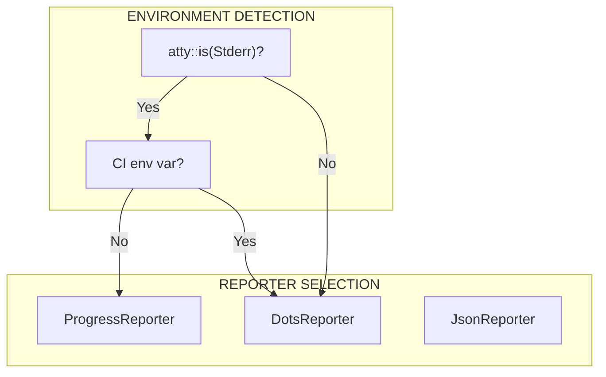

# Reporter

The Reporter system provides adaptive output based on environment detection.

---

## Overview

Tach supports multiple output formats:

1. **ProgressReporter** - Interactive progress bar for terminals
2. **DotsReporter** - Simple dots for CI environments
3. **JsonReporter** - NDJSON for IDE integration
4. **JunitReporter** - JUnit XML for CI systems



---

## Reporter Trait

```rust
pub trait Reporter {
    fn on_run_start(&mut self, total: usize);
    fn on_test_started(&mut self, test: &RunnableTest);
    fn on_test_finished(&mut self, result: &TestResult);
    fn on_run_finished(&mut self, results: &[TestResult]);
}
```

---

## ProgressReporter

Interactive progress bar using `indicatif`.

### Output Format

```
Running tests...
[=========>          ] 45/100  P:40 F:3 S:2
```

### Implementation

```rust
pub struct ProgressReporter {
    bar: ProgressBar,
    passed: usize,
    failed: usize,
    skipped: usize,
    failures: Vec<TestResult>,
}

impl ProgressReporter {
    pub fn new() -> Self {
        let bar = ProgressBar::new(0);
        bar.set_style(ProgressStyle::default_bar()
            .template("{msg}\n[{bar:40}] {pos}/{len}  P:{passed} F:{failed} S:{skipped}")
            .unwrap());
        Self {
            bar,
            passed: 0,
            failed: 0,
            skipped: 0,
            failures: Vec::new(),
        }
    }
}
```

### Failure Buffering

Failures are buffered and displayed at the end:

```rust
fn on_run_finished(&mut self, _results: &[TestResult]) {
    self.bar.finish_and_clear();

    if !self.failures.is_empty() {
        eprintln!("\n=== FAILURES ===\n");
        for failure in &self.failures {
            eprintln!("FAILED: {}", failure.test_name);
            eprintln!("{}\n", failure.message);
        }
    }

    eprintln!("\n{} passed, {} failed, {} skipped",
        self.passed, self.failed, self.skipped);
}
```

---

## DotsReporter

Simple dots output for CI environments.

### Output Format

```
....F..s....F.....
```

- `.` = passed
- `F` = failed
- `s` = skipped

### Implementation

```rust
pub struct DotsReporter {
    failures: Vec<TestResult>,
}

impl Reporter for DotsReporter {
    fn on_test_finished(&mut self, result: &TestResult) {
        let char = match result.status {
            STATUS_PASS => '.',
            STATUS_FAIL | STATUS_ERROR => 'F',
            STATUS_SKIP => 's',
            STATUS_CRASH => 'C',
            _ => '?',
        };
        eprint!("{}", char);

        if result.status == STATUS_FAIL || result.status == STATUS_ERROR {
            self.failures.push(result.clone());
        }
    }
}
```

---

## JsonReporter

NDJSON output for IDE integration.

### Output Format

```json
{"event":"test_started","test":"test_example.py::test_foo"}
{"event":"test_finished","test":"test_example.py::test_foo","status":"pass","duration_ms":12}
```

### Implementation

```rust
pub struct JsonReporter;

impl Reporter for JsonReporter {
    fn on_test_finished(&mut self, result: &TestResult) {
        let event = json!({
            "event": "test_finished",
            "test": result.test_name,
            "status": status_to_string(result.status),
            "duration_ms": result.duration_ns / 1_000_000,
            "message": result.message,
        });
        println!("{}", event);
    }
}
```

### Stdout Purity

JsonReporter writes to **stdout** while other output goes to **stderr**, ensuring clean JSON parsing.

---

## JunitReporter

JUnit XML for CI systems.

### Output Format

```xml
<?xml version="1.0" encoding="UTF-8"?>
<testsuites>
  <testsuite name="tach" tests="100" failures="3" errors="0" skipped="2">
    <testcase name="test_foo" classname="test_example" time="0.012"/>
    <testcase name="test_bar" classname="test_example" time="0.008">
      <failure message="AssertionError">...</failure>
    </testcase>
  </testsuite>
</testsuites>
```

### Implementation

```rust
pub struct JunitReporter {
    output_path: PathBuf,
    results: Vec<TestResult>,
}

impl Reporter for JunitReporter {
    fn on_run_finished(&mut self, results: &[TestResult]) {
        let xml = generate_junit_xml(results);
        std::fs::write(&self.output_path, xml).unwrap();
    }
}
```

---

## MultiReporter

Broadcasts events to multiple reporters.

```rust
pub struct MultiReporter {
    reporters: Vec<Box<dyn Reporter>>,
}

impl Reporter for MultiReporter {
    fn on_test_finished(&mut self, result: &TestResult) {
        for reporter in &mut self.reporters {
            reporter.on_test_finished(result);
        }
    }
}
```

### Usage

```rust
let mut reporters = MultiReporter::new();
reporters.add(Box::new(ProgressReporter::new()));
reporters.add(Box::new(JunitReporter::new("results.xml")));
```

---

## Environment Detection

```rust
pub fn should_use_progress_bar() -> bool {
    atty::is(atty::Stream::Stderr) && std::env::var("CI").is_err()
}
```

| Condition       | Reporter         |
| :-------------- | :--------------- |
| TTY + no CI     | ProgressReporter |
| TTY + CI        | DotsReporter     |
| No TTY          | DotsReporter     |
| `--format json` | JsonReporter     |

---

## Color Output

```rust
fn format_status(status: u8) -> ColoredString {
    match status {
        STATUS_PASS => "PASS".green(),
        STATUS_FAIL => "FAIL".red(),
        STATUS_SKIP => "SKIP".yellow(),
        STATUS_CRASH => "CRASH".red().bold(),
        _ => "???".normal(),
    }
}
```

---

## CLI Integration

```rust
// In main.rs
let mut reporters: Vec<Box<dyn Reporter>> = Vec::new();

if cli.format == "json" {
    reporters.push(Box::new(JsonReporter::new()));
} else if should_use_progress_bar() {
    reporters.push(Box::new(ProgressReporter::new()));
} else {
    reporters.push(Box::new(DotsReporter::new()));
}

if let Some(path) = &cli.junit_xml {
    reporters.push(Box::new(JunitReporter::new(path)));
}

let mut multi = MultiReporter::new(reporters);
scheduler.run(&mut multi)?;
```

---

## Related Documentation

- [Scheduler](scheduler.md) - How results are collected
- [Configuration](../configuration.md) - --format and --junit-xml flags
