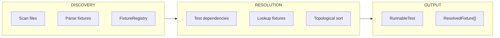

# Fixture Resolver

The Fixture Resolver discovers and resolves pytest fixture dependencies.

---

## Overview

Tach resolves fixtures statically via AST analysis, enabling:

1. **Dependency ordering** via topological sort
2. **Scope tracking** (function, class, module, session)
3. **conftest.py integration** for global fixtures



---

## Data Structures

### FixtureRegistry

Central repository for all discovered fixtures.

```rust
pub struct FixtureRegistry {
    pub global: HashMap<String, (FixtureDefinition, PathBuf)>,
    pub local: HashMap<PathBuf, HashMap<String, FixtureDefinition>>,
    pub class_scoped: HashMap<(PathBuf, String), HashMap<String, FixtureDefinition>>,
}
```

| Field          | Description                                          |
| :------------- | :--------------------------------------------------- |
| `global`       | Fixtures from `conftest.py` files (with source path) |
| `local`        | Module-level fixtures per file                       |
| `class_scoped` | Fixtures defined inside test classes                 |

### ResolvedFixture

A fixture that has been located and linked.

```rust
pub struct ResolvedFixture {
    pub name: String,
    pub source_file: PathBuf,
    pub scope: FixtureScope,
}
```

### RunnableTest

The final output with resolved fixtures.

```rust
pub struct RunnableTest {
    pub file_path: PathBuf,
    pub test_name: String,
    pub is_async: bool,
    pub is_toxic: bool,
    pub fixtures: Vec<ResolvedFixture>,  // Topologically sorted
}
```

### ResolutionError

```rust
pub enum ResolutionError {
    MissingFixture { test: String, fixture: String },
    CyclicDependency { test: String, cycle: Vec<String> },
}
```

---

## Resolution Algorithm


### Lookup Priority

1. **Class scope**: Fixtures defined in the test class
2. **Module scope**: Fixtures in the same file
3. **Global scope**: Fixtures from `conftest.py`
4. **Builtins**: pytest-provided fixtures (skipped)

### Topological Sort

Fixtures are added in dependency order:

```rust
fn resolve_fixture(
    &mut self,
    name: &str,
    stack: &mut HashSet<String>,
    result: &mut Vec<ResolvedFixture>,
) -> Result<()> {
    // Cycle detection
    if stack.contains(name) {
        return Err(ResolutionError::CyclicDependency {
            cycle: stack.iter().cloned().collect(),
        });
    }

    // Skip if already resolved
    if result.iter().any(|f| f.name == name) {
        return Ok(());
    }

    // Skip builtins
    if PYTEST_BUILTINS.contains(&name) {
        return Ok(());
    }

    // Lookup fixture
    let fixture = self.lookup(name)?;

    // Resolve dependencies first (recursion)
    stack.insert(name.to_string());
    for dep in &fixture.dependencies {
        self.resolve_fixture(dep, stack, result)?;
    }
    stack.remove(name);

    // Add after dependencies (post-order)
    result.push(ResolvedFixture::from(fixture));
    Ok(())
}
```

---

## pytest Builtins

These fixtures are provided by pytest at runtime and skipped during static resolution:

```rust
const PYTEST_BUILTINS: &[&str] = &[
    // Monkey-patching and environment
    "monkeypatch",
    // Temporary directories
    "tmp_path",
    "tmp_path_factory",
    "tmpdir",
    "tmpdir_factory",
    // Output capture
    "capsys",
    "capfd",
    "capsysbinary",
    "capfdbinary",
    "caplog",
    // Fixture metadata
    "request",
    // Caching
    "cache",
    // Recording
    "record_property",
    "record_testsuite_property",
    "record_xml_attribute",
    // Doctest
    "doctest_namespace",
    // Recwarn
    "recwarn",
    // Pytestconfig
    "pytestconfig",
];
```

---

## conftest.py Handling

Fixtures in `conftest.py` are automatically global:

```rust
fn register_fixtures(&mut self, module: &TestModule) {
    let is_conftest = module.path.file_name() == Some("conftest.py".as_ref());

    for fixture in &module.fixtures {
        if is_conftest {
            self.global.insert(fixture.name.clone(), fixture.clone());
        } else {
            self.local
                .entry(module.path.clone())
                .or_default()
                .insert(fixture.name.clone(), fixture.clone());
        }
    }
}
```

### Shadowing

Local fixtures shadow global fixtures:

```python
# conftest.py
@pytest.fixture
def db():
    return global_db()

# test_module.py
@pytest.fixture
def db():
    return local_db()  # This one is used

def test_something(db):
    pass  # Gets local_db()
```

---

## Parametrization Filtering

Arguments from `@pytest.mark.parametrize` are not fixtures:

```python
@pytest.mark.parametrize("x, y", [(1, 2), (3, 4)])
def test_add(x, y, some_fixture):
    pass
```

Here:

- `x`, `y` are parametrized args (not resolved)
- `some_fixture` is a fixture dependency (resolved)

```rust
fn get_fixture_dependencies(test: &TestCase) -> Vec<String> {
    test.dependencies
        .iter()
        .filter(|dep| !test.parametrized_args.contains(dep))
        .cloned()
        .collect()
}
```

---

## Class-Scoped Fixtures

Fixtures defined inside test classes:

```python
class TestUser:
    @pytest.fixture
    def user(self):
        return User(name="test")

    def test_name(self, user):
        assert user.name == "test"
```

```rust
fn lookup_class_fixture(
    &self,
    name: &str,
    file: &Path,
    class_name: &str,
) -> Option<&FixtureDefinition> {
    self.class_scoped
        .get(&(file.to_path_buf(), class_name.to_string()))
        .and_then(|fixtures| fixtures.get(name))
}
```

---

## Error Handling

### Missing Fixture

```rust
ResolutionError::MissingFixture {
    test: "test_something".into(),
    fixture: "unknown_fixture".into(),
}
```

### Cyclic Dependency

```rust
ResolutionError::CyclicDependency {
    test: "test_something".into(),
    cycle: vec!["fixture_a", "fixture_b", "fixture_a"],
}
```

---

## Integration with Harness

The Python harness uses resolved fixtures:

```python
def run_test(file_path, test_name, fixtures):
    # Fixtures are already in dependency order
    fixture_values = {}
    for fixture in fixtures:
        if fixture.name in PYTEST_BUILTINS:
            fixture_values[fixture.name] = get_builtin(fixture.name)
        else:
            fixture_values[fixture.name] = call_fixture(
                fixture,
                fixture_values,
            )

    # Call test with fixture values
    test_func(**fixture_values)
```

---

## Related Documentation

- [Discovery Engine](discovery.md) - How fixtures are discovered
- [Zygote Lifecycle](zygote.md) - Fixture execution
- [Architecture Overview](overview.md) - System architecture and IPC protocol
