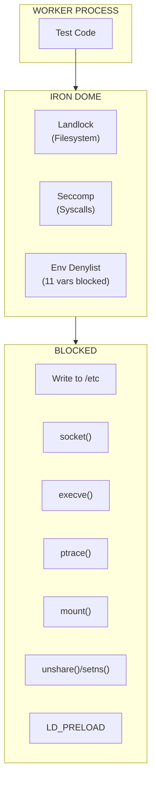
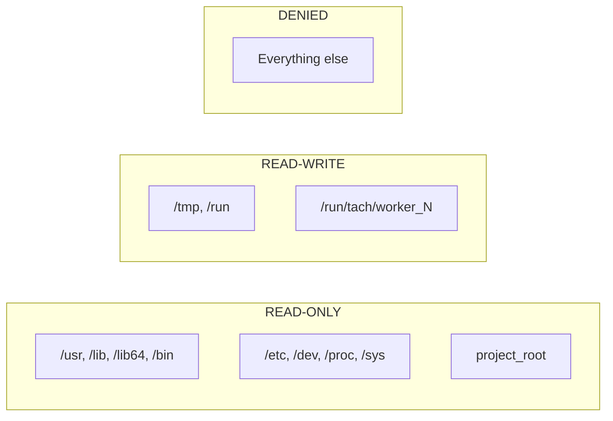
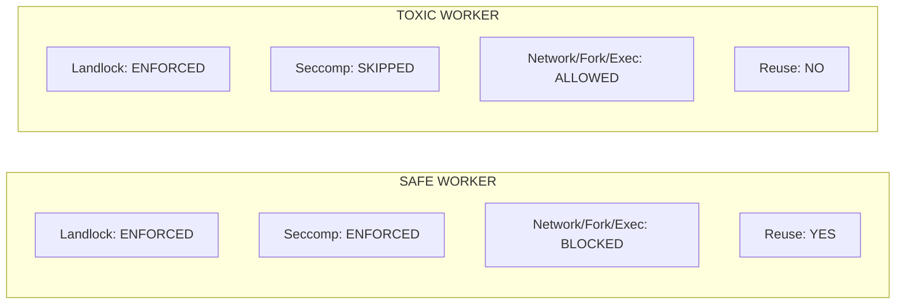
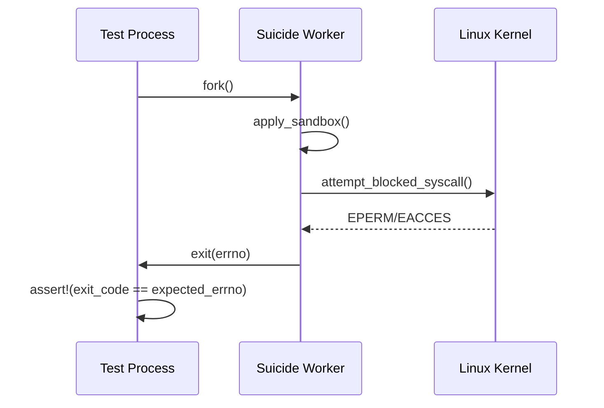

# Iron Dome (Sandbox)

Defense-in-depth security for worker processes using Landlock filesystem isolation, Seccomp syscall filtering, and environment variable sanitization.

---

## Overview

Workers execute untrusted test code. The Iron Dome restricts:

1. **Filesystem access** via Landlock (kernel 5.13+)
2. **System calls** via Seccomp-BPF (kernel 3.17+)
3. **Environment variables** via denylist filtering



---

## SandboxStatus

```rust
#[derive(Debug, Clone, Copy, PartialEq, Eq)]
pub enum SandboxStatus {
    FullyEnforced,      // All restrictions enforced (kernel supports all features)
    PartiallyEnforced,  // Some restrictions enforced (partial kernel support)
    NotEnforced,        // No restrictions (kernel < 5.13 or disabled)
}
```

---

## Landlock Implementation

Landlock is a Linux Security Module (LSM) for kernel-level filesystem access control, allowing unprivileged processes to restrict their own access.

### ABI Version

Tach uses **ABI V1** for maximum compatibility (Linux 5.13+):

| ABI | Kernel | Features Added                  |
| :-- | :----- | :------------------------------ |
| V1  | 5.13+  | Basic filesystem access control |
| V2  | 5.19+  | TRUNCATE rights                 |
| V3  | 6.2+   | Network access control          |
| V4  | 6.7+   | More granular rights            |

### Path Rules



| Path                                 | Access | Purpose                              |
| :----------------------------------- | :----- | :----------------------------------- |
| `project_root`                       | RO     | Source files (writes go to overlay)  |
| `/usr`, `/lib`, `/lib64`, `/bin`     | RO     | System libraries and binaries        |
| `/etc`                               | RO     | Python configs, SSL certs, timezone  |
| `/dev`, `/proc`, `/sys`              | RO     | Device nodes, process info, hardware |
| `/tmp`, `/run`, `/run/tach/worker_N` | RW     | Worker scratch space and overlays    |

### TOCTOU Fix

**Problem:** Using `path.exists()` before adding Landlock rules creates a race condition.

**Solution:** Attempt `PathFd::new()` directly and handle `ENOENT` atomically:

```rust
fn add_path_rule_if_exists<T, A>(ruleset: T, path: impl AsRef<Path>, access: A) -> Result<T>
where
    T: landlock::RulesetCreatedAttr,
    A: Into<landlock::BitFlags<landlock::AccessFs>> + Copy,
{
    match PathFd::new(path.as_ref()) {
        Ok(fd) => ruleset.add_rule(PathBeneath::new(fd, access)),
        Err(PathFdError::OpenCall { source, .. })
            if source.raw_os_error() == Some(libc::ENOENT) => Ok(ruleset),
        Err(_) => Ok(ruleset), // Graceful degradation
    }
}
```

This prevents TOCTOU because `PathFd::new()` opens the file descriptor atomically, and once obtained, it refers to the inode, not the path.

### Implementation

```rust
pub fn apply_landlock(project_root: &Path, worker_id: u32) -> Result<SandboxStatus> {
    let abi = ABI::V1;
    let project_root = project_root.canonicalize()?;
    let worker_scratch = format!("/run/tach/worker_{}", worker_id);

    let all_access = AccessFs::from_all(abi);
    let read_access = AccessFs::from_read(abi);

    let ruleset = Ruleset::default().handle_access(all_access)?.create()?;

    // Read-only paths
    let ruleset = add_path_rule(ruleset, &project_root, read_access)?;
    let ruleset = add_path_rule_if_exists(ruleset, "/usr", read_access)?;
    // ... other read-only paths ...

    // Read-write paths
    let ruleset = add_path_rule_if_exists(ruleset, "/tmp", all_access)?;
    let ruleset = add_path_rule_if_exists(ruleset, &worker_scratch, all_access)?;

    let status = ruleset.restrict_self()?;
    Ok(status.ruleset.into())
}
```

---

## Seccomp Implementation

Seccomp-BPF filters system calls at the kernel level. Tach uses a **blacklist approach** (Python's syscall patterns vary too much for a whitelist).

**Supported architectures:** x86_64, aarch64 (others gracefully degrade)

### Blocked Syscalls (15 Total)

| Category          | Syscalls                                                   | Purpose                  |
| :---------------- | :--------------------------------------------------------- | :----------------------- |
| **Network (6)**   | `socket`, `bind`, `connect`, `listen`, `accept`, `accept4` | Prevent network I/O      |
| **Process (4)**   | `fork`, `vfork`, `execve`, `execveat`                      | Prevent process spawning |
| **Privilege (5)** | `ptrace`, `mount`, `umount2`, `unshare`, `setns`           | Prevent sandbox escape   |

### Critical: clone NOT Blocked

Python's `threading` module requires `clone()`. Forked processes are still harmless because:

- Cannot execute new programs (`execve` blocked)
- Cannot write outside allowed paths (Landlock)
- Inherit the same Seccomp filter

### Implementation

```rust
pub fn apply_seccomp() -> Result<()> {
    let target_arch = match std::env::consts::ARCH {
        "x86_64" => TargetArch::x86_64,
        "aarch64" => TargetArch::aarch64,
        arch => anyhow::bail!("Unsupported architecture: {}", arch),
    };

    let mut rules: BTreeMap<i64, Vec<SeccompRule>> = BTreeMap::new();
    // Network, process, and privilege escalation syscalls...
    rules.insert(libc::SYS_socket, vec![]);
    // ... (15 total syscalls)

    let filter = SeccompFilter::new(
        rules,
        SeccompAction::Allow,
        SeccompAction::Errno(libc::EPERM as u32), // EPERM, not SIGSYS
        target_arch,
    )?;

    seccompiler::apply_filter(&filter.try_into()?)?;
    Ok(())
}
```

### EPERM vs SIGSYS

Blocked syscalls return `EPERM` (not `SIGSYS`) so Python can catch errors gracefully via `OSError` instead of crashing with a core dump

---

## Environment Variable Denylist

Tach blocks dangerous environment variables to prevent malicious configuration injection via `pyproject.toml`.

### Blocked Variables (11 Total)

| Category              | Variables                                                   |
| :-------------------- | :---------------------------------------------------------- |
| **Library Injection** | `LD_PRELOAD`, `LD_LIBRARY_PATH`, `LD_AUDIT`, `LD_DEBUG`     |
| **Python Hijacking**  | `PYTHONPATH`, `PYTHONHOME`, `PYTHONSTARTUP`, `PYTHONMALLOC` |
| **Path Manipulation** | `PATH`, `HOME`, `USER`                                      |

Matching is **case-insensitive** to prevent bypass attempts.

---

## Safe vs Toxic Workers



Toxic workers (e.g., integration tests needing network or subprocesses) skip Seccomp but still have Landlock filesystem isolation.

### apply_iron_dome

```rust
pub fn apply_iron_dome(project_root: &Path, worker_id: u32, is_toxic: bool) -> Result<SandboxStatus> {
    // Landlock is always applied
    let landlock_status = apply_landlock(project_root, worker_id).unwrap_or(SandboxStatus::NotEnforced);

    // Seccomp is for safe workers only
    if !is_toxic {
        let _ = apply_seccomp();
    }

    Ok(landlock_status)
}
```

---

## Graceful Degradation

The Iron Dome logs warnings and continues with reduced protection on older kernels.

| Kernel | Landlock | Seccomp | Behavior         |
| :----- | :------- | :------ | :--------------- |
| 5.13+  | Full     | Full    | Complete sandbox |
| 5.0+   | None     | Full    | Seccomp only     |
| < 3.17 | None     | None    | No sandbox       |

---

## Security Considerations

- **TOCTOU:** Prevented by atomic `PathFd::new()` handling.
- **Symlinks:** Mitigated by path canonicalization.
- **clone:** Allowed for threading; `execve` blocked instead.
- **Escapes:** `ptrace`, `mount`, and namespaces blocked in Seccomp.

---

## Overhead

- **Setup:** ~150us one-time per worker.
- **Runtime:** Near zero (kernel-level enforcement).

---

## Sandbox Enforcement Testing

### The EPERM Doctrine

> A sandbox is only as strong as the kernel's refusal to cooperate with malicious code.

We do not trust our sandbox implementation based on code inspection. We trust it because:

1. **Seccomp** returns `EPERM` (errno 1) when blocked syscalls are attempted
2. **Landlock** returns `EACCES` (errno 13) when blocked filesystem access is attempted
3. **PID Namespaces** return `ESRCH` (errno 3) when attempting to signal invisible processes

```
Traditional Testing:     "Did our code set up the sandbox correctly?"
EPERM Doctrine Testing:  "Does the kernel actually block the operation?"
```

### The Suicide Worker Pattern

The **Suicide Worker** is Project Tach's gold standard for isolation testing. It validates kernel enforcement by deliberately attempting prohibited operations.



**Implementation Pattern:**

```rust
#[test]
fn test_seccomp_blocks_socket() {
    match unsafe { fork() }.expect("fork failed") {
        ForkResult::Child => {
            apply_seccomp().expect("Failed to apply Seccomp");

            let result = unsafe {
                libc::socket(libc::AF_INET, libc::SOCK_STREAM, 0)
            };

            if result == -1 {
                let errno = std::io::Error::last_os_error()
                    .raw_os_error().unwrap_or(0);
                std::process::exit(errno);  // Exit with errno
            } else {
                std::process::exit(255);  // CRITICAL: Sandbox failed!
            }
        }
        ForkResult::Parent { child } => {
            match waitpid(child, None).expect("waitpid failed") {
                WaitStatus::Exited(_, code) => {
                    assert_eq!(code, libc::EPERM,
                        "Seccomp should block socket() with EPERM");
                }
                status => panic!("Unexpected status: {:?}", status),
            }
        }
    }
}
```

**Exit Code Meanings:**

- `exit(1)` = `EPERM` - Seccomp blocked the syscall
- `exit(13)` = `EACCES` - Landlock blocked filesystem access
- `exit(255)` = Operation succeeded - **SANDBOX FAILURE**

### Fork-Clone Duality

Modern glibc maps `fork()` to the `clone()` syscall internally. This is critical for Seccomp testing:

```
User Code:           libc::fork()
Glibc Translation:   SYS_clone(SIGCHLD, 0, NULL, NULL, 0)
Kernel Execution:    clone() syscall
```

| Approach                  | Syscall     | Result                                       |
| ------------------------- | ----------- | -------------------------------------------- |
| `libc::fork()`            | `SYS_clone` | Allowed (clone is whitelisted for threading) |
| `libc::syscall(SYS_fork)` | `SYS_fork`  | Blocked with EPERM                           |

```rust
// WRONG: Tests clone(), not fork()
let result = unsafe { libc::fork() };

// CORRECT: Tests actual SYS_fork syscall
let result = unsafe { libc::syscall(libc::SYS_fork) };
```

---

## Error Code Reference

| Error    | Code | Context  | Meaning                                 |
| -------- | ---- | -------- | --------------------------------------- |
| `EPERM`  | 1    | Seccomp  | Syscall blocked by BPF filter           |
| `EACCES` | 13   | Landlock | Filesystem access denied                |
| `ESRCH`  | 3    | kill()   | Process not found (namespace isolation) |
| `EINVAL` | 22   | Landlock | Invalid ruleset configuration           |
| `SIGSYS` | 31   | Seccomp  | Process killed (SECCOMP_RET_KILL mode)  |

---

## Kernel Version Requirements

| Feature         | Minimum Kernel | Notes                          |
| --------------- | -------------- | ------------------------------ |
| PID Namespaces  | 2.6.24         | Process isolation              |
| Seccomp-BPF     | 3.17           | Required for syscall filtering |
| userfaultfd     | 4.11           | Memory snapshot/restore        |
| Landlock        | 5.13           | Filesystem sandboxing          |
| Landlock ABI v2 | 5.19           | File truncation rules          |

---

## Related Documentation

- [Isolation](isolation.md) - Namespace and OverlayFS setup
- [Toxicity Analysis](toxicity.md) - How toxicity is determined
- [Zygote Lifecycle](zygote.md) - When sandbox is applied
- [Configuration](../configuration.md) - pyproject.toml settings
