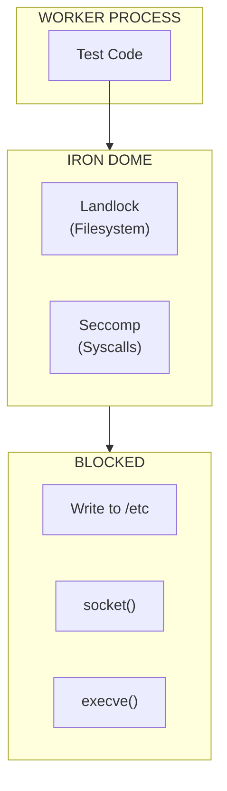
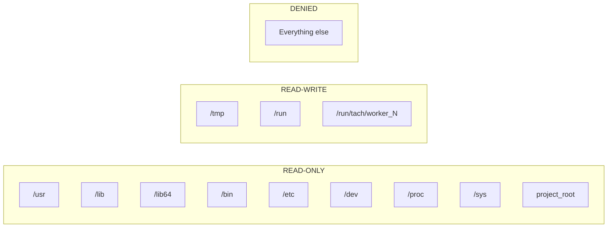
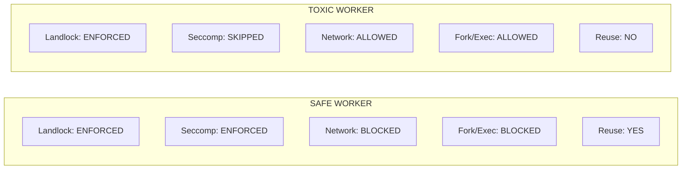

# Iron Dome (Sandbox)

The Iron Dome provides defense-in-depth security for worker processes using Landlock and Seccomp.

---

## Overview

Workers execute untrusted test code. The Iron Dome restricts:

1. **Filesystem access** via Landlock (kernel 5.13+)
2. **System calls** via Seccomp-BPF (kernel 3.17+)



---

## Data Structures

### SandboxStatus

```rust
pub enum SandboxStatus {
    FullyEnforced,      // All restrictions active
    PartiallyEnforced,  // Some features unavailable
    NotEnforced,        // Kernel too old
}
```

---

## Landlock Implementation

Landlock provides kernel-level filesystem access control.

### ABI Version

Tach uses **ABI V1** for maximum compatibility (Linux 5.13+).

### Path Rules



### Implementation

```rust
pub fn apply_landlock(project_root: &Path, worker_id: u32) -> Result<SandboxStatus> {
    let abi = ABI::V1;
    let mut ruleset = Ruleset::default()
        .handle_access(AccessFs::from_all(abi))?
        .create()?;

    // Read-only paths
    let ro_paths = [
        project_root,
        Path::new("/usr"),
        Path::new("/lib"),
        Path::new("/lib64"),
        Path::new("/bin"),
        Path::new("/etc"),
        Path::new("/dev"),
        Path::new("/proc"),
        Path::new("/sys"),
    ];

    for path in &ro_paths {
        add_path_rule_if_exists(&mut ruleset, path, AccessFs::from_read(abi))?;
    }

    // Read-write paths
    let worker_dir = format!("/run/tach/worker_{}", worker_id);
    let rw_paths = [
        Path::new("/tmp"),
        Path::new("/run"),
        Path::new(&worker_dir),
    ];

    for path in &rw_paths {
        add_path_rule_if_exists(&mut ruleset, path, AccessFs::from_all(abi))?;
    }

    let status = ruleset.restrict_self()?;
    Ok(status.into())
}
```

### Path Canonicalization

All paths are canonicalized before adding rules to prevent symlink bypasses:

```rust
fn add_path_rule_if_exists(
    ruleset: &mut Ruleset,
    path: &Path,
    access: AccessFs,
) -> Result<()> {
    if let Ok(canonical) = path.canonicalize() {
        ruleset.add_rule(PathBeneath::new(
            PathFd::new(&canonical)?,
            access,
        ))?;
    }
    Ok(())
}
```

---

## Seccomp Implementation

Seccomp-BPF filters system calls at the kernel level.

### Architecture Support

| Architecture | Supported |
| :----------- | :-------- |
| x86_64       | Yes       |
| aarch64      | Yes       |
| Other        | No        |

### Blocked Syscalls

```rust
const BLOCKED_SYSCALLS: &[i64] = &[
    // Network
    libc::SYS_socket,
    libc::SYS_bind,
    libc::SYS_connect,
    libc::SYS_listen,
    libc::SYS_accept,
    libc::SYS_accept4,

    // Process creation
    libc::SYS_fork,
    libc::SYS_vfork,
    libc::SYS_execve,
    libc::SYS_execveat,
];
```

### Critical: clone NOT Blocked

```rust
// clone and clone3 are NOT blocked
// Python threading requires clone()
```

### Implementation

```rust
pub fn apply_seccomp() -> Result<()> {
    let arch = std::env::consts::ARCH;
    let arch_token = match arch {
        "x86_64" => AUDIT_ARCH_X86_64,
        "aarch64" => AUDIT_ARCH_AARCH64,
        _ => return Err(anyhow!("Unsupported architecture")),
    };

    let mut rules = BpfMap::new();
    for syscall in BLOCKED_SYSCALLS {
        rules.insert(*syscall, vec![SeccompRule::new(vec![])?]);
    }

    let filter = SeccompFilter::new(
        rules,
        SeccompAction::Allow,  // Default: allow
        SeccompAction::Errno(libc::EPERM),  // Blocked: EPERM
        arch_token,
    )?;

    apply_filter(&filter)?;
    Ok(())
}
```

### EPERM vs SIGSYS

Blocked syscalls return `EPERM` instead of killing the process. This allows Python to catch the error:

```python
try:
    import socket
    s = socket.socket()  # Returns EPERM
except OSError as e:
    print(f"Socket blocked: {e}")
```

---

## Safe vs Toxic Workers



### apply_iron_dome

```rust
pub fn apply_iron_dome(
    project_root: &Path,
    worker_id: u32,
    is_toxic: bool,
) -> Result<SandboxStatus> {
    // Always apply Landlock
    let status = apply_landlock(project_root, worker_id)?;

    // Only apply Seccomp for safe workers
    if !is_toxic {
        if let Err(e) = apply_seccomp() {
            eprintln!("[sandbox] Seccomp failed: {}", e);
        }
    }

    Ok(status)
}
```

---

## Graceful Degradation

| Kernel Version | Landlock | Seccomp | Behavior              |
| :------------- | :------- | :------ | :-------------------- |
| 5.13+          | Full     | Full    | Complete sandbox      |
| 5.0-5.12       | None     | Full    | Seccomp only, warning |
| 3.17-4.x       | None     | Full    | Seccomp only, warning |
| < 3.17         | None     | None    | No sandbox, warning   |

```rust
fn apply_landlock(...) -> Result<SandboxStatus> {
    match Ruleset::default().create() {
        Ok(ruleset) => { /* apply rules */ }
        Err(e) if e.kind() == ErrorKind::Unsupported => {
            eprintln!("[sandbox] Landlock not available (kernel < 5.13)");
            return Ok(SandboxStatus::NotEnforced);
        }
        Err(e) => return Err(e.into()),
    }
}
```

---

## Security Considerations

| Consideration              | Status    | Notes                        |
| :------------------------- | :-------- | :--------------------------- |
| Symlink bypass             | Mitigated | Paths canonicalized          |
| clone bypass               | By design | Python threading needs clone |
| Toxic network access       | Allowed   | Seccomp skipped for toxic    |
| File write outside sandbox | Blocked   | Landlock enforced            |

---

## Overhead

| Component        | Overhead | Notes                    |
| :--------------- | :------- | :----------------------- |
| Landlock setup   | ~100us   | One-time per worker      |
| Seccomp setup    | ~50us    | One-time per worker      |
| Runtime overhead | ~0       | Kernel-level enforcement |

---

## Related Documentation

- [Isolation](isolation.md) - Namespace and OverlayFS setup
- [Toxicity Analysis](toxicity.md) - How toxicity is determined
- [Zygote Lifecycle](zygote.md) - When sandbox is applied
