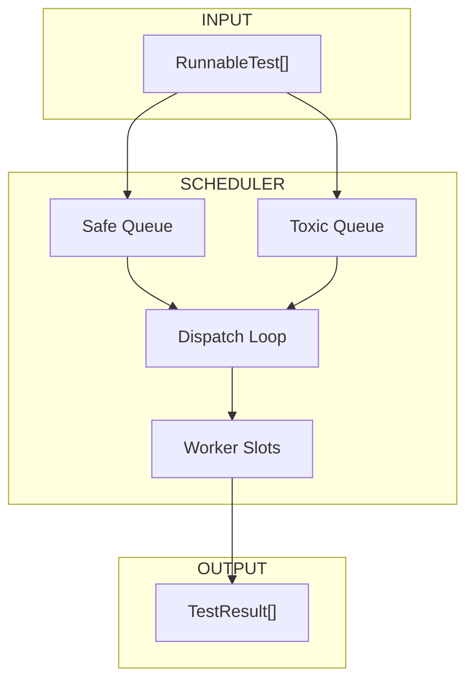
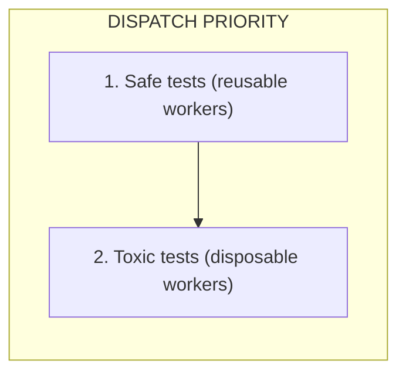
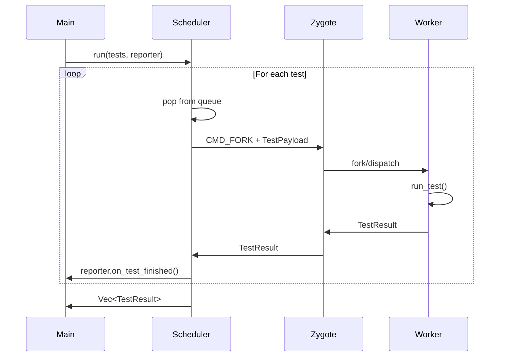

# Scheduler

The Scheduler dispatches tests to workers using a dual-queue system.

---

## Overview

The Scheduler manages test execution with:

1. **Dual queues** for safe and toxic tests
2. **Worker slot management** for parallelism
3. **Result collection** with timeout handling



---

## Data Structures

### Scheduler

```rust
pub struct Scheduler {
    cmd_socket: UnixStream,
    result_socket: UnixStream,
    safe_queue: VecDeque<RunnableTest>,
    toxic_queue: VecDeque<RunnableTest>,
    active_workers: Mutex<HashMap<u32, ActiveWorker>>,
    max_workers: usize,
}
```

### ActiveWorker

```rust
pub struct ActiveWorker {
    pub test_id: u32,
    pub start_time: Instant,
    pub pid: Option<i32>,
}
```

---

## Queue Priority

Safe tests are dispatched first to maximize worker reuse:



### Rationale

- **Safe workers** reset in ~50us and continue
- **Toxic workers** exit and must be replaced (~2ms)

Processing safe tests first maximizes the benefit of snapshot-based reset.

---

## Dispatch Loop

```rust
impl Scheduler {
    pub fn run(&mut self, reporter: &mut dyn Reporter) -> Result<Vec<TestResult>> {
        let mut results = Vec::new();

        while !self.safe_queue.is_empty() || !self.toxic_queue.is_empty() {
            // Wait for available slot
            while self.active_count() >= self.max_workers {
                if let Some(result) = self.try_collect_result()? {
                    results.push(result);
                    reporter.on_test_finished(&result);
                }
            }

            // Dispatch next test (safe first)
            let test = self.safe_queue.pop_front()
                .or_else(|| self.toxic_queue.pop_front());

            if let Some(test) = test {
                self.dispatch(test)?;
            }
        }

        // Collect remaining results
        while self.active_count() > 0 {
            if let Some(result) = self.try_collect_result()? {
                results.push(result);
                reporter.on_test_finished(&result);
            }
        }

        Ok(results)
    }
}
```

---

## Test Dispatch

```rust
fn dispatch(&mut self, test: RunnableTest) -> Result<()> {
    let payload = TestPayload {
        test_id: self.next_test_id(),
        file_path: test.file_path.to_string_lossy().to_string(),
        test_name: test.test_name.clone(),
        is_async: test.is_async,
        fixtures: test.fixtures.iter().map(FixtureInfo::from).collect(),
        log_fd: self.log_capture.get_fd()?,
        debug_socket_path: self.debug_socket_path.clone(),
        is_toxic: test.is_toxic,
    };

    // Send to Zygote
    self.cmd_socket.write_all(&[CMD_FORK])?;
    let encoded = encode_with_length(&payload)?;
    self.cmd_socket.write_all(&encoded)?;

    // Track active worker
    self.active_workers.lock().insert(payload.test_id, ActiveWorker {
        test_id: payload.test_id,
        start_time: Instant::now(),
        pid: None,
    });

    Ok(())
}
```

---

## Result Collection

```rust
fn try_collect_result(&mut self) -> Result<Option<TestResult>> {
    self.result_socket.set_read_timeout(Some(Duration::from_millis(100)))?;

    match decode_with_length::<TestResult>(&mut self.result_socket) {
        Ok(result) => {
            self.active_workers.lock().remove(&result.test_id);
            Ok(Some(result))
        }
        Err(e) if e.kind() == ErrorKind::WouldBlock => Ok(None),
        Err(e) if e.kind() == ErrorKind::TimedOut => {
            self.check_stale_workers()?;
            Ok(None)
        }
        Err(e) => Err(e.into()),
    }
}
```

---

## Crash Detection

Workers that don't respond within the timeout are marked as crashed:

```rust
fn check_stale_workers(&mut self) -> Result<()> {
    let stale_threshold = Duration::from_secs(3);
    let now = Instant::now();

    let stale: Vec<u32> = self.active_workers.lock()
        .iter()
        .filter(|(_, w)| now.duration_since(w.start_time) > stale_threshold)
        .map(|(id, _)| *id)
        .collect();

    for test_id in stale {
        self.active_workers.lock().remove(&test_id);
        // Report as crashed
        self.report_crash(test_id)?;
    }

    Ok(())
}
```

---

## Slot Management

The number of concurrent workers is limited:

```rust
fn active_count(&self) -> usize {
    self.active_workers.lock().len()
}
```

`max_workers` is typically set to `num_cpus` or configured via `[tool.tach].workers`.

---

## Log Capture

Each worker slot has a dedicated memfd for stdout/stderr:

```rust
pub struct LogCapture {
    slots: Vec<OwnedFd>,
    slot_count: usize,
}

impl LogCapture {
    pub fn get_fd(&mut self) -> Result<i32> {
        // Round-robin slot assignment
        let slot = self.next_slot % self.slot_count;
        self.next_slot += 1;
        Ok(self.slots[slot].as_raw_fd())
    }
}
```

---

## Synchronous Design

The current scheduler is **synchronous** (not async/tokio):

```rust
// Blocking socket operations
self.result_socket.set_read_timeout(Some(Duration::from_millis(100)))?;
let result = decode_with_length::<TestResult>(&mut self.result_socket)?;
```

This simplifies the implementation while still achieving high throughput due to the fast worker reset times.

---

## Integration Flow



---

## Configuration

| Setting   | Source                | Default    |
| :-------- | :-------------------- | :--------- |
| `workers` | `[tool.tach].workers` | `num_cpus` |
| `timeout` | `[tool.tach].timeout` | 60 seconds |

---

## Related Documentation

- [IPC Protocol](protocol.md) - Message format
- [Zygote Lifecycle](zygote.md) - Command handling
- [Reporter](reporter.md) - Result reporting
