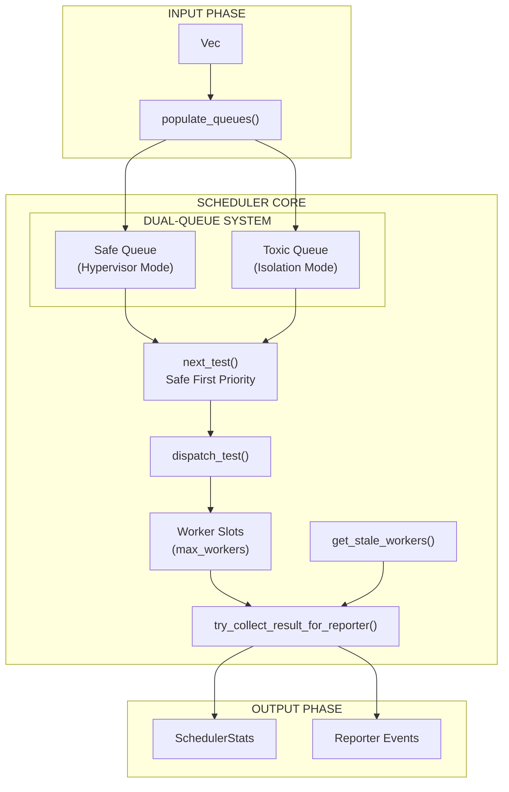
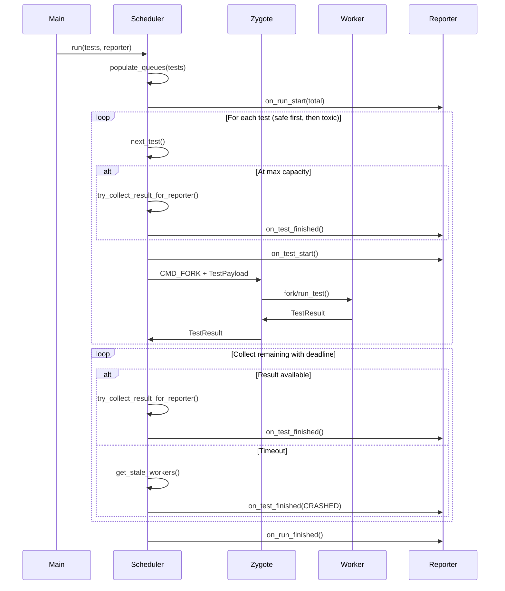

# Scheduler Architecture

The Scheduler orchestrates test execution using a **dual-queue priority system** with crash detection and mutex poisoning recovery.

---

## Overview

Key capabilities:

- **Dual-queue priority** - Safe tests first (Hypervisor Mode), toxic tests last (Isolation Mode)
- **Worker slot management** - Parallelism based on CPU cores
- **Crash detection** - Timeout-based stale worker identification
- **Mutex poisoning recovery** - Prevents panics from worker failures
- **Deadline-based result collection** - Non-blocking with timeout handling



---

## Dual-Queue Architecture

| Mode                | Queue       | Worker Behavior             | Throughput         |
| ------------------- | ----------- | --------------------------- | ------------------ |
| **Hypervisor Mode** | Safe Queue  | Reset via snapshot and loop | High (~50us reset) |
| **Isolation Mode**  | Toxic Queue | Exit after each test        | Lower (~2ms spawn) |

**Why Safe First?** Safe workers reset via userfaultfd in ~50us; toxic workers must exit and respawn (~2ms). Processing safe tests first maximizes snapshot reuse before incurring isolation overhead.

---

## Data Structures

### Scheduler Struct

```rust
pub struct Scheduler {
    cmd_socket: UnixStream,
    result_socket: Arc<Mutex<UnixStream>>,
    log_capture: Arc<Mutex<LogCapture>>,
    active_workers: Arc<Mutex<HashMap<u32, ActiveWorker>>>,
    max_workers: usize,
    debug_socket_path: PathBuf,
    safe_queue: VecDeque<(u32, RunnableTest)>,
    toxic_queue: VecDeque<(u32, RunnableTest)>,
}
```

| Field            | Purpose                                    |
| ---------------- | ------------------------------------------ |
| `cmd_socket`     | Sends CMD_FORK/CMD_EXIT to Zygote          |
| `result_socket`  | Receives TestResult from workers           |
| `log_capture`    | Per-slot memfd log capture                 |
| `active_workers` | Tracks in-flight tests for crash detection |
| `max_workers`    | Maximum concurrent workers                 |
| `safe_queue`     | Queue of non-toxic tests (Hypervisor Mode) |
| `toxic_queue`    | Queue of toxic tests (Isolation Mode)      |

### ActiveWorker Struct

```rust
struct ActiveWorker {
    test_name: String,
    slot: usize,
    start_time: Instant,
}
```

### SchedulerStats Struct

```rust
pub struct SchedulerStats {
    pub total: usize,
    pub passed: usize,
    pub failed: usize,
    pub duration_ms: u64,
}
```

---

## Queue Population and Priority Dispatch

`populate_queues()` sorts tests into queues based on toxicity. `next_test()` implements priority dispatch: safe tests first (high throughput via reset), then toxic tests (containment via exit).

```rust
fn next_test(&mut self) -> Option<(u32, RunnableTest)> {
    self.safe_queue.pop_front().or_else(|| self.toxic_queue.pop_front())
}
```

---

## Mutex Poisoning Recovery

The scheduler uses a **recovery pattern** to prevent panics if a thread holding a lock panics:

```rust
.lock().unwrap_or_else(|e| e.into_inner())
```

This extracts the underlying `MutexGuard` from a `PoisonError`, allowing the scheduler to continue operating even after worker failures. This is applied to `active_workers`, `result_socket`, and `log_capture`.

---

## Stale Worker Detection

Crash detection is implemented via timeout-based identification:

```rust
fn get_stale_workers(&self, timeout: Duration) -> Vec<(u32, String, usize)> {
    let workers = self.active_workers.lock().unwrap_or_else(|e| e.into_inner());
    workers.iter()
        .filter(|(_, w)| w.start_time.elapsed() > timeout)
        .map(|(id, w)| (*id, w.test_name.clone(), w.slot))
        .collect()
}
```

| Timeout                | Value      | Purpose                             |
| ---------------------- | ---------- | ----------------------------------- |
| Socket read timeout    | 5 seconds  | Result socket timeout               |
| Stale worker threshold | 3 seconds  | Threshold for `get_stale_workers()` |
| Collection deadline    | 10 seconds | Maximum wait for remaining results  |

---

## Test Dispatch Protocol

`dispatch_test()` serializes a `TestPayload` and sends it to the Zygote via `cmd_socket`:

```rust
fn dispatch_test(&mut self, test: &RunnableTest, test_id: u32, slot: usize) -> Result<()> {
    let log_fd = self.log_capture.lock().unwrap_or_else(|e| e.into_inner()).get_fd(slot).unwrap_or(-1);
    let payload = TestPayload { /* ... */ };
    let payload_bytes = bincode::serde::encode_to_vec(&payload, bincode::config::standard())?;
    let len = payload_bytes.len() as u32;

    self.cmd_socket.write_all(&[CMD_FORK])?;
    self.cmd_socket.write_all(&len.to_le_bytes())?;
    self.cmd_socket.write_all(&payload_bytes)?;

    let mut pid_buf = [0u8; 4];
    self.cmd_socket.read_exact(&mut pid_buf)?;
    // ... track in active_workers
    Ok(())
}
```

---

## Result Collection

`try_collect_result_for_reporter()` handles non-blocking result retrieval and log cleanup:

```rust
fn try_collect_result_for_reporter(&self) -> Option<(String, &'static str, u64, Option<String>)> {
    let mut socket = self.result_socket.lock().unwrap_or_else(|e| e.into_inner());
    let mut len_buf = [0u8; 4];
    if socket.read_exact(&mut len_buf).is_ok() {
        let len = u32::from_le_bytes(len_buf) as usize;
        let mut result_buf = vec![0u8; len];
        if socket.read_exact(&mut result_buf).is_ok() {
            if let Ok((result, _)) = bincode::serde::decode_from_slice::<TestResult, _>(
                &result_buf,
                bincode::config::standard(),
            ) {
                // ... remove worker, clear logs, format for reporter
                return Some((test_name, status, duration_ms, msg));
            }
        }
    }
    None
}
```

---

## Slot Management

Worker slots are assigned using modular arithmetic to ensure even distribution:

```rust
let slot = test_id as usize % self.max_workers;
```

The scheduler blocks when `active_workers.len() >= max_workers`, waiting for results to free up slots.

---

## Log Capture Integration

Each worker slot has a dedicated memfd for stdout/stderr. The scheduler:

1. Passes the log FD to the worker via `TestPayload.log_fd`
2. Clears the log slot after collecting the result via `log_capture.read_and_clear(slot)`

---

## Synchronous Design

The scheduler uses **synchronous blocking I/O** (with timeouts) instead of async/tokio.

**Rationale:**

- **Complexity:** Lower overhead, no async runtime needed.
- **Throughput:** Worker reset (~50us) is the bottleneck, not I/O.
- **Debugging:** Straightforward stack traces.

---

## Integration Flow



---

## Related Documentation

- [IPC Protocol](protocol.md)
- [Zygote Lifecycle](zygote.md)
- [Reporter](reporter.md)
- [Sandbox](sandbox.md)
- [Coverage](coverage.md)
