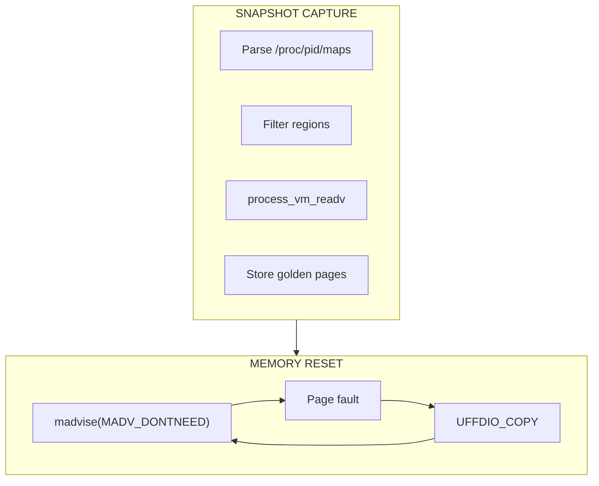
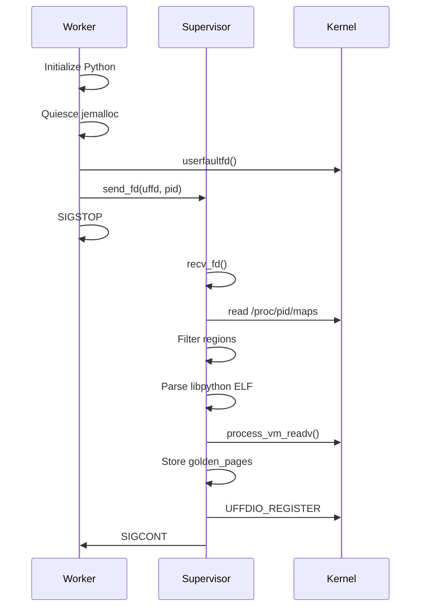
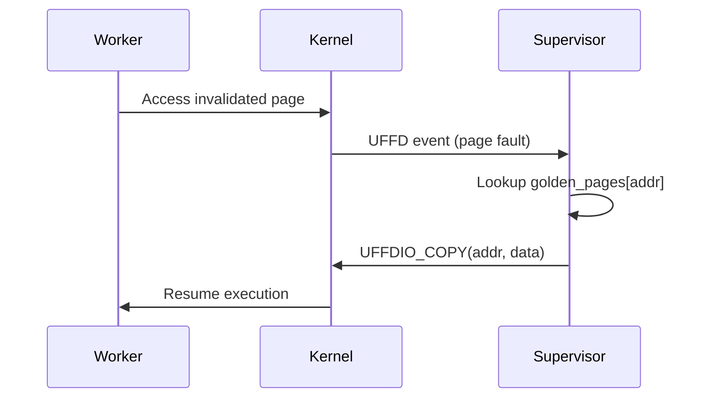
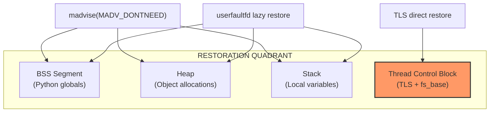
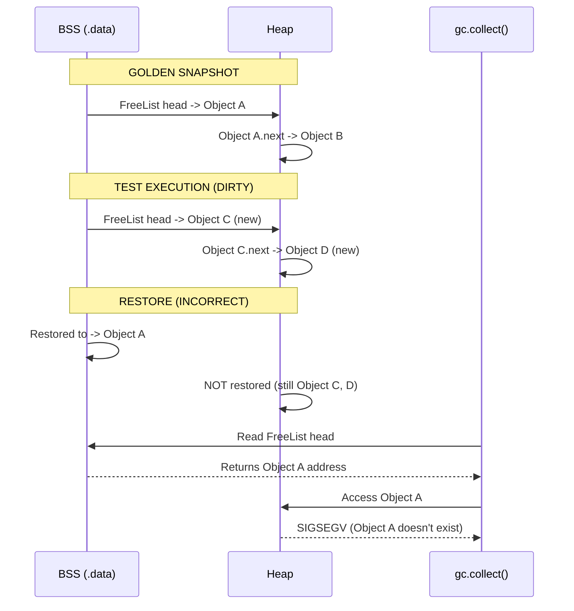
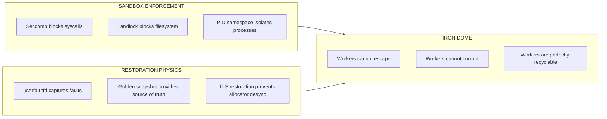

# Physics Engine (Snapshot)

The Physics Engine manages memory snapshots using Linux `userfaultfd`.

---

## Overview

Traditional test isolation creates a new process per test. Tach instead:

1. **Captures** a "golden" memory snapshot after Python initialization
2. **Runs** the test, which modifies memory
3. **Resets** memory by invalidating dirty pages
4. **Restores** pages on-demand when accessed

This achieves sub-50 microsecond reset times.



---

## Data Structures

### MemoryRegion

Represents a raw entry from `/proc/pid/maps`.

```rust
pub struct MemoryRegion {
    pub start: usize,
    pub end: usize,
    pub len: usize,
    pub perms: String,    // e.g., "rw-p"
    pub name: String,     // e.g., "[heap]"
}
```

### AlignedSegment

A page-aligned memory range for userfaultfd registration.

```rust
pub struct AlignedSegment {
    pub start: usize,     // Aligned down to page boundary
    pub end: usize,       // Aligned up to page boundary
    pub description: String,
}
```

### WorkerSnapshot

Holds the golden state for a specific worker.

```rust
pub struct WorkerSnapshot {
    pub uffd: Uffd,
    pub golden_pages: HashMap<usize, Vec<u8>>,
    pub regions: Vec<MemoryRegion>,
    #[cfg(target_arch = "x86_64")]
    pub tls_snapshot: Option<TlsSnapshot>,
}
```

| Field          | Description                                                  |
| :------------- | :----------------------------------------------------------- |
| `uffd`         | The userfaultfd object for this worker                       |
| `golden_pages` | Map of page address to page data                             |
| `regions`      | Original memory regions                                      |
| `tls_snapshot` | TLS snapshot for Python 3.13+ mimalloc support (x86_64 only) |

### SnapshotManager

Central supervisor-side authority.

```rust
pub struct SnapshotManager {
    pub available: bool,
    workers: HashMap<i32, WorkerSnapshot>,  // private field
    #[cfg(target_arch = "x86_64")]
    calibration: Option<TlsCalibration>,    // TLS calibration data
}
```

| Field         | Description                                             |
| :------------ | :------------------------------------------------------ |
| `available`   | Whether userfaultfd is available on this kernel         |
| `workers`     | Per-worker snapshot state (private field)               |
| `calibration` | TLS calibration data for mimalloc support (x86_64 only) |

### LibpythonInfo

Metadata for locating Python's global state.

```rust
pub struct LibpythonInfo {
    pub path: PathBuf,
    pub base_addr: usize,
    pub is_static: bool,
}
```

---

## Snapshot Capture Sequence



### Step 1: Quiesce Allocator

Before snapshot, the worker flushes jemalloc state:

```rust
fn quiesce_allocator() {
    mallctl(c"thread.tcache.flush", ...);
    mallctl(c"epoch", ...);
}
```

This ensures deterministic heap layout.

### Step 2: UFFD Handshake

The worker creates a userfaultfd and sends it to the supervisor via SCM_RIGHTS:

```rust
fn init_snapshot_mode(supervisor_sock: &str) -> bool {
    let uffd = userfaultfd::UffdBuilder::new()
        .non_blocking(false)
        .create()?;

    send_fd(&sock, pid, uffd.as_raw_fd())?;
    raise(SIGSTOP);
    true
}
```

### Step 3: Memory Discovery

The supervisor parses `/proc/pid/maps`:

```
7f1234560000-7f1234580000 rw-p 00000000 00:00 0    [heap]
7f1234580000-7f12345a0000 rw-p 00000000 00:00 0
7ffd12340000-7ffd12360000 rw-p 00000000 00:00 0    [stack]
```

### Step 4: Region Filtering

Regions are filtered for snapshot eligibility:

| Region                | Included | Reason              |
| :-------------------- | :------- | :------------------ |
| `[heap]`              | Yes      | Python objects      |
| `[stack]`             | Yes      | Local variables     |
| Anonymous (`rw-p`)    | Yes      | Dynamic allocations |
| `libpython.so` data   | Yes      | Python globals      |
| `[vdso]`              | No       | Kernel-provided     |
| `[vsyscall]`          | No       | Kernel-provided     |
| `memfd:tach_coverage` | No       | Must survive reset  |
| Read-only             | No       | Code segments       |

### Step 5: ELF Parsing

For `libpython.so`, the supervisor uses `goblin` to find writable segments:

```rust
fn find_libpython_segments(path: &Path, base: usize) -> Vec<AlignedSegment> {
    let elf = goblin::elf::Elf::parse(&data)?;
    elf.program_headers
        .iter()
        .filter(|ph| ph.p_type == PT_LOAD && ph.p_flags & PF_W != 0)
        .map(|ph| AlignedSegment {
            start: base + ph.p_vaddr as usize,
            end: base + ph.p_vaddr as usize + ph.p_memsz as usize,
            description: "libpython data".into(),
        })
        .collect()
}
```

### Step 6: Memory Capture

```rust
fn capture_golden(pid: i32, regions: &[MemoryRegion]) -> HashMap<usize, Vec<u8>> {
    let mut golden = HashMap::new();
    for region in regions {
        let mut data = vec![0u8; region.len];
        let local = IoSliceMut::new(&mut data);
        let remote = RemoteIoVec {
            base: region.start,
            len: region.len,
        };
        process_vm_readv(pid, &mut [local], &[remote])?;

        for offset in (0..region.len).step_by(PAGE_SIZE) {
            let page_addr = region.start + offset;
            let page_data = data[offset..offset + PAGE_SIZE].to_vec();
            golden.insert(page_addr, page_data);
        }
    }
    golden
}
```

---

## Memory Reset

### The Seppuku Pattern

Workers reset their own memory:

```rust
fn reset_memory() {
    for region in RESET_REGIONS.lock().iter() {
        // Skip stack to avoid crashing current execution
        if region.name == "[stack]" {
            continue;
        }
        unsafe {
            libc::madvise(
                region.start as *mut _,
                region.len,
                libc::MADV_DONTNEED,
            );
        }
    }
}
```

`MADV_DONTNEED` tells the kernel to discard the pages. The next access triggers a page fault.

### Page Fault Handling



```rust
fn handle_pending_faults(worker: &mut WorkerSnapshot) {
    loop {
        match worker.uffd.read_event() {
            Ok(Event::Pagefault { addr, .. }) => {
                let page_addr = addr & !0xFFF;
                if let Some(data) = worker.golden_pages.get(&page_addr) {
                    worker.uffd.copy(page_addr, data, true)?;
                } else {
                    worker.uffd.zeropage(page_addr, PAGE_SIZE, true)?;
                }
            }
            Err(e) if e.kind() == WouldBlock => break,
            _ => break,
        }
    }
}
```

---

## TLS Restoration System

Python 3.13+ uses mimalloc instead of pymalloc. mimalloc stores critical heap pointers in Thread Local Storage (TLS). Without restoring TLS alongside memory, workers suffer from "Fractured Brain" syndrome where heap pointers point to stale data.

### The Restoration Quadrant

The complete memory restoration requires four components:



### TlsSnapshot

```rust
pub struct TlsSnapshot {
    pub fs_base: usize,           // x86_64 fs_base register (TCB address)
    pub tls_data: Vec<u8>,        // Captured TLS memory (dynamic size)
    pub tls_region_start: usize,  // From /proc/pid/maps
    pub tls_region_end: usize,
}
```

### Key Functions (x86_64 only)

```rust
pub fn get_fs_base_ptrace(pid: Pid) -> Result<usize>;
pub fn set_fs_base_ptrace(pid: Pid, fs_base: usize) -> Result<()>;
pub fn capture_tls_snapshot(pid: Pid) -> Result<TlsSnapshot>;
pub fn restore_tls_snapshot(pid: Pid, snapshot: &TlsSnapshot) -> Result<()>;
pub fn restore_vectorized(pid: Pid, regions: &[RestoreRegion]) -> Result<VectorizedRestoreResult>;
```

**Dynamic TLS Sizing**: Capture size from `/proc/pid/maps` boundaries, not fixed 12KB. Handles TensorFlow/PyTorch C-extensions with large Dynamic Thread Vectors.

**Performance**: Expected 20-40% reduction in restoration time compared to individual restores.

---

## Full Reset Methods

### reset_worker_full

Complete worker reset with TLS restoration.

```rust
#[cfg(target_arch = "x86_64")]
pub fn reset_worker_full(&self, pid: Pid) -> Result<()>;
```

**Sequence**:

1. Invalidate memory pages via `process_madvise(MADV_DONTNEED)`
2. Restore TLS block via `process_vm_writev`
3. Restore fs_base register via `ptrace ARCH_SET_FS`
4. Page faults restore heap/BSS via userfaultfd

### reset_worker_full_vectorized

Optimized version using batched writes.

```rust
#[cfg(target_arch = "x86_64")]
pub fn reset_worker_full_vectorized(&self, pid: Pid) -> Result<VectorizedRestoreResult>;
```

**Sequence**:

1. Invalidate memory pages via `process_madvise(MADV_DONTNEED)`
2. Vectorized restore: TLS + critical regions in single syscall
3. Restore fs_base register via ptrace
4. Page faults restore remaining heap/BSS via userfaultfd

---

## System Calls

| System Call              | Purpose                                           |
| :----------------------- | :------------------------------------------------ |
| `userfaultfd`            | Create tracking object for lazy restoration       |
| `process_vm_readv`       | Copy worker memory to supervisor without ptrace   |
| `process_vm_writev`      | Write memory to worker (TLS restoration)          |
| `madvise(MADV_DONTNEED)` | Drop pages, forcing re-fault on access            |
| `ioctl(UFFDIO_REGISTER)` | Register memory regions for fault notification    |
| `ioctl(UFFDIO_COPY)`     | Copy golden page back to worker                   |
| `ioctl(UFFDIO_ZEROPAGE)` | Zero-fill new pages                               |
| `pidfd_open`             | Get process file descriptor for remote operations |
| `process_madvise`        | Remote memory invalidation (syscall 440)          |
| `ptrace(ARCH_PRCTL)`     | Get/set fs_base register for TLS (x86_64)         |

---

## Coverage Buffer Exclusion

The coverage ring buffer must survive memory resets:

```rust
fn should_snapshot(region: &MemoryRegion) -> bool {
    // Exclude coverage buffer and other tach-managed memfd regions
    if region.name.contains("tach_coverage") ||
       region.name.contains("memfd:tach") {
        return false;
    }
    // ... other filters
}
```

---

## Performance Characteristics

| Operation           | Time             |
| :------------------ | :--------------- |
| Snapshot capture    | ~10ms (one-time) |
| Memory reset        | **< 50us**       |
| Page fault handling | ~1us per page    |

---

## Kernel Requirements

| Feature          | Minimum Kernel | Recommended |
| :--------------- | :------------- | :---------- |
| userfaultfd      | 4.11           | 5.11+       |
| process_vm_readv | 3.2            | 5.0+        |
| process_madvise  | 5.10           | 5.10+       |

---

## File Descriptor Hazards After Fork

When a process is forked, file descriptors are inherited but point to the same kernel `struct file` object. This creates hazards:

1. **Shared Offsets**: Read/write position is shared between parent and child
2. **Race Conditions**: Concurrent writes interleave at kernel level
3. **Ghost Writes**: Child's `shutdown()` affects parent's connection

**Tach Mitigation**:

- Django connections are closed via `connections.close_all()` before each test
- Tests should not maintain persistent connections to external services
- Use `@pytest.mark.toxic` for tests that require network isolation

**User Guidance**: If your tests use database connections, ensure your framework re-establishes connections lazily after fork.

---

## Related Documentation

- [Allocator](allocator.md) - Jemalloc quiesce sequence
- [Zygote Lifecycle](zygote.md) - Worker initialization
- [Architecture Overview](overview.md) - System architecture and IPC protocol

---

## Restoration Physics

This section defines the invariants that must hold for successful test isolation and documents critical memory synchronization requirements.

### Restoration Invariants

#### Invariant 1: Bit-Perfect Alignment

A successful restore is **NOT** just "no crash." It is a **bit-perfect** alignment of:

| Component | Location                      | Validation                           |
| --------- | ----------------------------- | ------------------------------------ |
| **TCB**   | `fs_base` register            | `self_ptr == fs_base`                |
| **BSS**   | libpython .data/.bss segments | `sha256(restored) == sha256(golden)` |
| **Heap**  | Anonymous mappings + `[heap]` | `sha256(restored) == sha256(golden)` |
| **Stack** | `[stack]` region              | `sha256(restored) == sha256(golden)` |

#### Invariant 2: Pointer Consistency

All pointers from BSS to Heap must point to valid, restored objects:

```
BEFORE RESTORE:
  BSS: PyFloat_FreeList -> 0x7f1234560000 (heap object A)
  Heap: Object A at 0x7f1234560000, next -> Object B

AFTER RESTORE (CORRECT):
  BSS: PyFloat_FreeList -> 0x7f1234560000 (SAME address)
  Heap: Object A at 0x7f1234560000 (RESTORED content)

AFTER RESTORE (FAILURE):
  BSS: PyFloat_FreeList -> 0x7f1234560000 (old address)
  Heap: 0x7f1234560000 is ZEROED (MADV_DONTNEED zapped it)
  RESULT: Next float allocation follows NULL/garbage pointer -> SIGSEGV
```

#### Invariant 3: TLS Synchronization

Thread Local Storage must be restored alongside Heap when using allocators that cache state in TLS (mimalloc in Python 3.13+):

```
TCB at fs_base:
  +0x0ad8: mi_heap_t* -> points into anonymous heap region
  +0x0ae0: mi_tld_t* -> thread-local data

If Heap is restored but TLS is not:
  mi_heap_t* points to RESTORED memory
  BUT mi_heap_t->pages still references STALE page list
  RESULT: Allocator returns memory that was "freed" in snapshot
```

#### Invariant 4: GC Stability

Post-restoration, the garbage collector must traverse all objects without fault:

```python
# Verification: Run 100 times without SIGSEGV
for _ in range(100):
    gc.collect()
```

If any of the following occur, restoration has FAILED:

- `SIGSEGV` (invalid pointer dereference)
- `SIGBUS` (unaligned access)
- Python exception from gc internals
- Memory leak detected by gc

#### Invariant 5: Stack Integrity

The C stack must be restored with valid return addresses and frame pointers. Stack restoration requires **two-phase restoration**:

1. **Memory Restoration**: userfaultfd restores the stack memory contents
2. **Register Restoration**: `longjmp` restores RSP/RBP to point to the correct stack frame

**Critical**: `longjmp` only restores **registers** (RSP, RBP, RIP). The actual stack **memory** must already be restored via userfaultfd before longjmp is called.

### The mimalloc Offset Registry

Python 3.13 uses mimalloc as its memory allocator. mimalloc stores thread-local state at fixed offsets from `fs_base`.

#### Discovered Offsets (Python 3.13, x86_64, glibc)

| Offset from fs_base | Structure    | Description                         |
| ------------------- | ------------ | ----------------------------------- |
| `+0x0ad8`           | `mi_heap_t*` | **Primary heap pointer** (CRITICAL) |
| `+0x0ae0`           | `mi_tld_t*`  | Thread-local data                   |
| `+0x0af8`           | Unknown      | Secondary heap reference            |
| `+0x0b00`           | Unknown      | Page list pointer                   |

#### Version Compatibility Matrix

| Python Version | Allocator | TLS Offsets               | Status     |
| -------------- | --------- | ------------------------- | ---------- |
| 3.11.x         | pymalloc  | N/A (no TLS caching)      | Safe       |
| 3.12.x         | pymalloc  | N/A (no TLS caching)      | Safe       |
| 3.13.x         | mimalloc  | `fs_base+0xad8` (primary) | **HAZARD** |
| 3.14.x         | TBD       | TBD                       | Unknown    |

#### Detection Method

The mimalloc TLS offsets are discovered at runtime using **Sentinel Scan**:

1. Allocate a unique sentinel pattern in Python heap via ctypes
2. Read `fs_base` via `arch_prctl(ARCH_GET_FS)`
3. Parse `/proc/self/maps` to identify TLS region boundaries
4. Scan TLS range for pointers targeting the sentinel or heap regions
5. Record offsets where valid heap pointers are found

**Why Runtime Discovery?** Hardcoded offsets vary with Python version, glibc version, libpython build configuration, and ASLR state.

### The Split-Brain Hazard

The **Split-Brain Hazard** occurs when BSS and Heap are restored independently, leaving cross-segment pointers in an inconsistent state.



**Mitigation**: Both BSS and Heap are invalidated in a single `madvise(MADV_DONTNEED)` pass, and all page faults are resolved from the golden snapshot.

### The Free List Architecture

Python caches freed objects in singly-linked free lists. For example, `PyFloat_FreeList`:

```c
// In Objects/floatobject.c
static PyFloatObject *free_list = NULL;  // BSS segment
static int numfree = 0;                   // BSS segment

// When a float is freed:
void float_dealloc(PyFloatObject *op) {
    op->ob_type = (PyTypeObject *)free_list;  // Heap modification
    free_list = op;                            // BSS modification
}
```

For correct restoration, BSS must contain the `free_list` pointer from the golden snapshot, and the Heap must contain the exact `PyFloatObject` that `free_list` points to. If BSS is restored but Heap is not, the next `float_alloc()` returns a corrupted object.

### Security Integration

The sandbox enforcement (documented in `sandbox.md`) ensures workers cannot escape. The Physics of Restoration ensures workers cannot corrupt each other through stale memory state.



---

## Research References

This implementation is informed by the following research papers (see `docs/pdfs/txt/` for full text):

| Paper                                             | Key Contribution                                                                        |
| :------------------------------------------------ | :-------------------------------------------------------------------------------------- |
| **Python Memory Snapshotting with Userfaultfd**   | Core UFFD architecture, `UFFDIO_COPY` workflow, O(N) cost model where N = touched pages |
| **Userfaultfd and CPython Allocator Interaction** | TLS restoration requirements, `mi_heap_t` synchronization, GC race conditions           |
| **Rust-Python Test Isolation Blueprint**          | `MADV_DONTNEED` reset loop, stack restoration requirements                              |

### Key Technical Details from Research

- **Page Fault Lifecycle**: `handle_mm_fault` -> UFFD-managed VMA check -> thread suspension -> `UFFD_EVENT_PAGEFAULT` -> supervisor `UFFDIO_COPY` -> thread wake
- **TLB Shootdown Cost**: `MADV_DONTNEED` triggers Inter-Processor Interrupts (IPIs) to flush TLBs across all cores - this is the primary performance bottleneck
- **setjmp/longjmp Limitation**: `longjmp` restores RSP but NOT stack contents - full stack memory must be tracked and restored
- **mimalloc TLS Hazard**: Python 3.13+ stores `mi_heap_t` pointers in TLS via `fs_base` - must use `arch_prctl(ARCH_GET_FS)` to capture

See [Research Overview](../research/README.md) for complete analysis.
