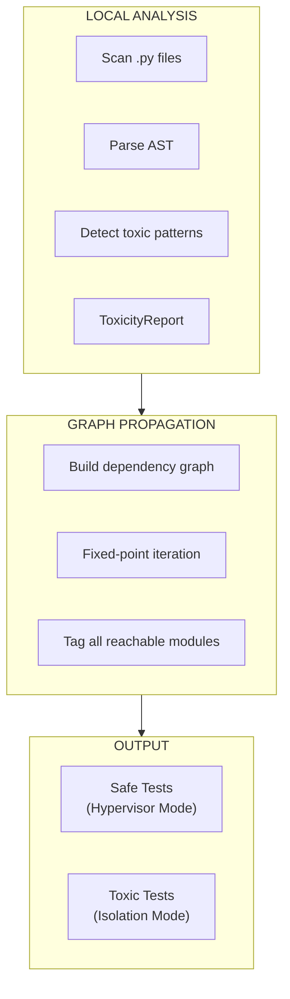
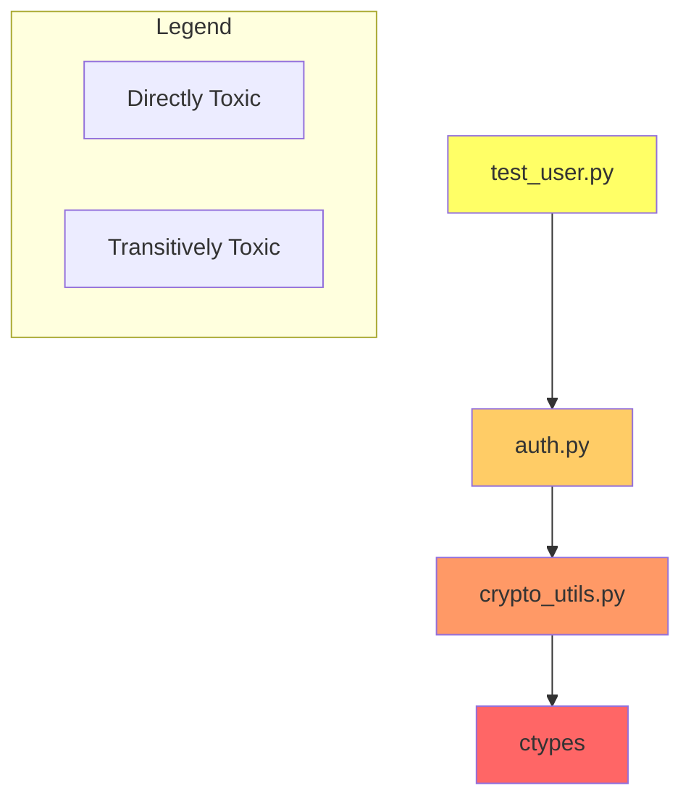
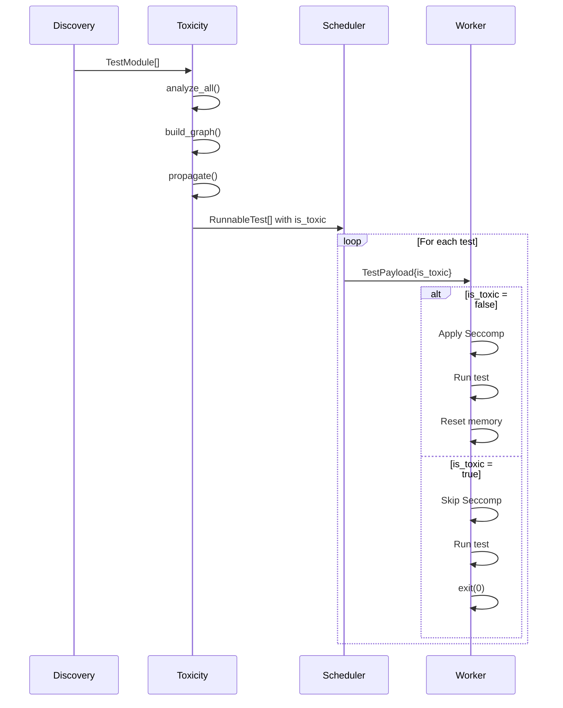

# Toxicity Analysis

The Toxicity Analyzer identifies modules that cannot be safely snapshotted and restored.

---

## Overview

Some Python code creates state that cannot be reset via memory snapshots:

- **Threading**: Background threads, locks, condition variables
- **Networking**: Open sockets, connections
- **Subprocesses**: Child processes, file descriptors
- **FFI**: C extensions with global state

Tach detects these patterns statically and marks affected tests as "toxic", forcing them to run in isolated processes that exit after each test.



---

## Data Structures

### ToxicityReport

Result of analyzing a single file.

```rust
pub struct ToxicityReport {
    pub is_toxic: bool,
    pub reasons: Vec<String>,
    pub imports: Vec<String>,
}
```

| Field      | Description                                   |
| :--------- | :-------------------------------------------- |
| `is_toxic` | Whether the file contains toxic patterns      |
| `reasons`  | Human-readable explanations                   |
| `imports`  | All detected imports (for graph construction) |

### ModuleNode

Data stored in each graph node.

```rust
pub struct ModuleNode {
    pub name: String,
    pub path: PathBuf,
    pub is_toxic: bool,
    pub reasons: Vec<String>,
}
```

### ToxicityGraph

The dependency graph for toxicity propagation.

```rust
pub struct ToxicityGraph {
    graph: DiGraph<ModuleNode, ()>,
    name_to_node: HashMap<String, NodeIndex>,
    path_to_node: HashMap<PathBuf, NodeIndex>,
}
```

Uses `petgraph::graph::DiGraph` where an edge `A -> B` means "A imports B".

---

## Toxic Patterns

### Standard Library Blocklist

```rust
const TOXIC_STD_LIB: &[&str] = &[
    "threading",
    "_thread",
    "multiprocessing",
    "socket",
    "ctypes",
    "signal",
    "concurrent.futures",
];
```

### External Module Blocklist

```rust
const TOXIC_EXTERNAL_MODULES: &[&str] = &[
    "grpc",
    "pandas",      // OpenMP threads
    "tensorflow",  // CUDA state
    "torch",       // CUDA state
    "cv2",         // OpenCV threads
    "gevent",      // Greenlets
    "cffi",
];
```

### Dynamic Import Patterns

| Pattern                   | Example                             | Reason                   |
| :------------------------ | :---------------------------------- | :----------------------- |
| `__import__`              | `__import__("threading")`           | Runtime module loading   |
| `exec`                    | `exec("import socket")`             | Arbitrary code execution |
| `importlib.import_module` | `importlib.import_module("ctypes")` | Dynamic imports          |

### Star Imports

```python
from threading import *  # Toxic - imports Thread, Lock, etc.
```

Star imports from toxic modules are aggressively marked toxic.

### Toxic Calls

```python
import threading
t = threading.Thread(target=fn)  # Toxic call detected
```

Direct calls to functions from toxic modules are detected even with aliasing.

---

## Propagation Algorithm

Toxicity propagates transitively through the import graph:



### Fixed-Point Iteration

```
1. Build directed graph: Module -> Imports
2. Analyze each module for LOCAL toxicity
3. Fixed-point iteration:
   REPEAT:
     FOR each edge (from, to):
       IF to.is_toxic AND NOT from.is_toxic:
         from.is_toxic = true
         from.reasons.push("Imports toxic module '{to.name}'")
   UNTIL no changes
4. Result: Complete transitive closure of toxicity
```

### Implementation

```rust
impl ToxicityGraph {
    pub fn propagate(&mut self) {
        let mut changed = true;
        while changed {
            changed = false;
            for edge in self.graph.edge_indices() {
                let (from, to) = self.graph.edge_endpoints(edge).unwrap();
                let to_toxic = self.graph[to].is_toxic;
                let from_node = &mut self.graph[from];

                if to_toxic && !from_node.is_toxic {
                    from_node.is_toxic = true;
                    from_node.reasons.push(format!(
                        "Imports toxic module '{}'",
                        self.graph[to].name
                    ));
                    changed = true;
                }
            }
        }
    }
}
```

---

## Integration with Test Pipeline



---

## False Positive Mitigation

### TYPE_CHECKING Blocks

Imports inside `if TYPE_CHECKING:` blocks are skipped:

```python
from typing import TYPE_CHECKING

if TYPE_CHECKING:
    import threading  # NOT toxic - only for type hints
```

### Conditional Imports

Currently, all imports are detected regardless of runtime conditions:

```python
if sys.platform == "win32":
    import ctypes  # Still marked toxic
```

This is conservative but safe.

---

## Key Functions

### analyze_file

Analyzes a single Python file for local toxicity.

```rust
pub fn analyze_file(path: &Path) -> Result<ToxicityReport>
```

### ToxicityGraph::build

Constructs the dependency graph from all project files.

```rust
pub fn build(modules: &[TestModule]) -> ToxicityGraph
```

### ToxicityGraph::is_toxic

Queries whether a module is toxic (including transitively).

```rust
pub fn is_toxic(&self, path: &Path) -> bool
```

---

## Worker Behavior

| Test Type | Seccomp | After Execution | Worker Fate       |
| :-------- | :------ | :-------------- | :---------------- |
| Safe      | Applied | Memory reset    | Continues in pool |
| Toxic     | Skipped | `exit(0)`       | Replaced          |

Toxic workers skip Seccomp because they may legitimately need:

- `fork`/`exec` for subprocess tests
- `socket` for network tests

---

## Related Documentation

- [Discovery Engine](discovery.md) - How modules are found
- [Iron Dome](sandbox.md) - How Seccomp is applied
- [Scheduler](scheduler.md) - How tests are dispatched
