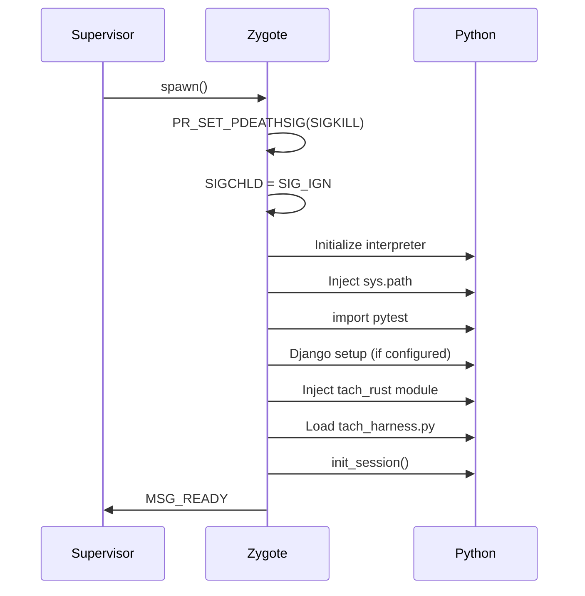
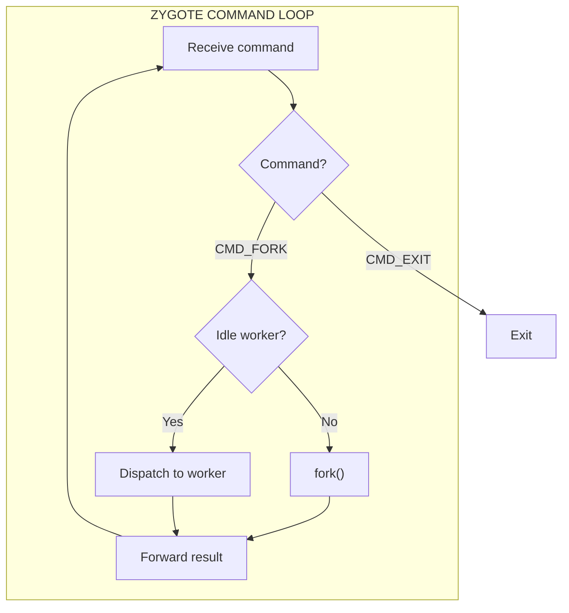
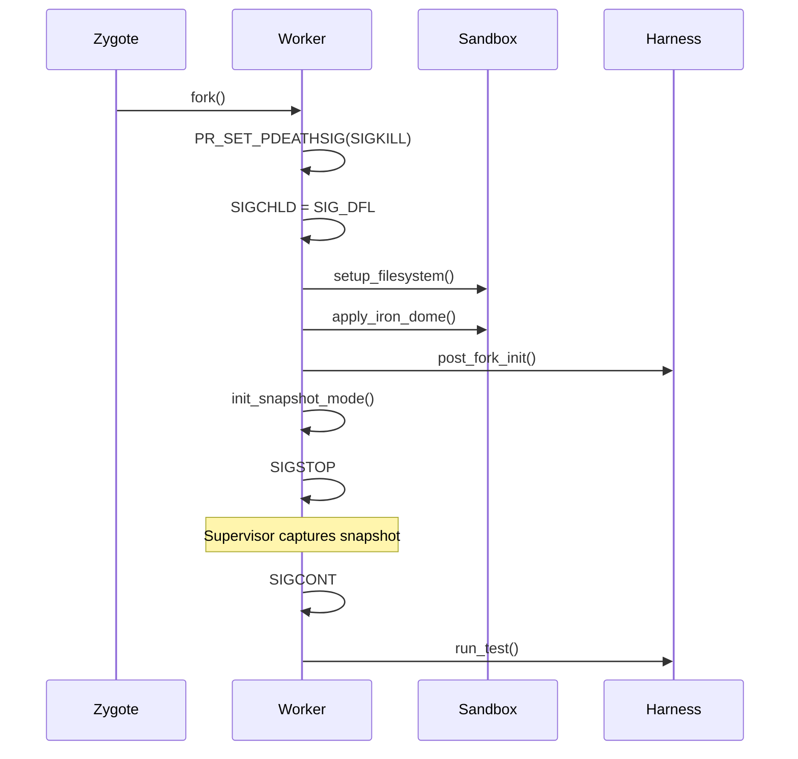
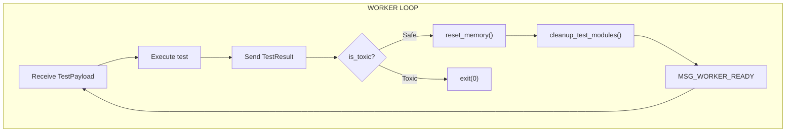

# Zygote Lifecycle

The Zygote manages Python process initialization and worker spawning.

---

## Overview

The Zygote is a long-lived Python process that:

1. **Initializes Python** with all imports pre-loaded
2. **Warms up frameworks** (pytest, Django)
3. **Manages the worker pool** for safe test reuse
4. **Forks workers** on demand from the Supervisor

```mermaid
flowchart TB
    subgraph Supervisor["RUST SUPERVISOR"]
        Scheduler["Scheduler"]
    end

    subgraph Zygote["ZYGOTE PROCESS"]
        Init["Python Init"]
        Warmup["Framework Warmup"]
        Pool["Worker Pool"]
        Fork["Fork/Dispatch"]
    end

    subgraph Workers["WORKER PROCESSES"]
        W1["Worker 1"]
        W2["Worker 2"]
        W3["Worker N"]
    end

    Scheduler -->|CMD_FORK| Fork
    Fork -->|fork()| W1
    Fork -->|fork()| W2
    Fork -->|fork()| W3
    W1 -->|MSG_WORKER_READY| Pool
    W2 -->|MSG_WORKER_READY| Pool
```

---

## Data Structures

### WorkerHandle

Represents a persistent worker in the pool.

```rust
struct WorkerHandle {
    pid: i32,
    socket: UnixStream,
}
```

### Static State

```rust
// Pool of idle workers ready for reuse
static IDLE_WORKERS: Mutex<Vec<WorkerHandle>> = Mutex::new(Vec::new());

// Cached memory regions for self-reset (start_address, length)
static RESET_REGIONS: Mutex<Vec<(usize, usize)>> = Mutex::new(Vec::new());

// Whether snapshot mode is active
static SNAPSHOT_ENABLED: AtomicBool = AtomicBool::new(false);
```

---

## Initialization Sequence



### Dead Man's Switch

```rust
unsafe {
    libc::prctl(libc::PR_SET_PDEATHSIG, libc::SIGKILL);
}
```

If the Supervisor dies, the Zygote is automatically killed.

### Zombie Prevention

```rust
unsafe {
    libc::signal(libc::SIGCHLD, libc::SIG_IGN);
}
```

Child processes are automatically reaped.

### Python Warm-up

```python
# In Zygote initialization
import sys
sys.path.insert(0, venv_site_packages)
sys.path.insert(0, project_root)

import pytest
pytest.main(["--collect-only", "-q"])  # Pay collection tax once

# Django warm-up
if os.environ.get("DJANGO_SETTINGS_MODULE"):
    import django
    django.setup()
    # Warm up DB connections
    from django.db import connections
    for conn in connections.all():
        conn.ensure_connection()
```

---

## Command Loop



### Worker Reuse

For safe tests, the Zygote attempts to reuse idle workers:

```rust
fn handle_fork_command(payload: TestPayload) {
    if !payload.is_toxic {
        if let Some(worker) = IDLE_WORKERS.lock().pop() {
            // Reuse existing worker
            send_command(&worker.socket, CMD_RUN_TEST, &payload)?;
            return;
        }
    }
    // Fork new worker
    fork_worker(payload)?;
}
```

---

## Fork Sequence



### Step 1: Fork

```rust
match unsafe { libc::fork() } {
    0 => {
        // Child process
        run_worker(payload, socket)?;
    }
    pid => {
        // Parent (Zygote)
        workers.insert(pid, WorkerHandle { pid, socket });
    }
}
```

### Step 2: Dead Man's Switch (Worker)

```rust
unsafe {
    libc::prctl(libc::PR_SET_PDEATHSIG, libc::SIGKILL);
}
```

### Step 3: Restore SIGCHLD

```rust
unsafe {
    libc::signal(libc::SIGCHLD, libc::SIG_DFL);
}
```

Workers need `SIG_DFL` for `subprocess` and `multiprocessing` to work.

### Step 4: Apply Sandbox

```rust
isolation::setup_filesystem(project_root, worker_id)?;
sandbox::apply_iron_dome(project_root, worker_id, payload.is_toxic)?;
```

### Step 5: Post-Fork Init

```python
def post_fork_init():
    # Capture module baseline for cleanup
    global _INITIAL_MODULES
    _INITIAL_MODULES = set(sys.modules.keys())

    # Reseed RNGs (The Clone Curse)
    inject_entropy()

    # Fix logging locks (fork corrupts RLocks)
    import logging
    logging._lock = threading.RLock()
    logging.Manager._lock = threading.RLock()
```

### Step 6: Snapshot Handshake

```python
def init_snapshot_mode(sock_path):
    # Create userfaultfd
    # Send to supervisor via SCM_RIGHTS
    # SIGSTOP (supervisor captures golden state)
    # Resume on SIGCONT
    return tach_rust.init_snapshot_mode(sock_path)
```

---

## Worker Loop



### Safe Path (Hypervisor Mode)

```python
def worker_loop_iteration(payload):
    result = run_test(payload.file_path, payload.test_name)
    send_result(result)

    if not payload.is_toxic:
        tach_rust.reset_memory()
        cleanup_test_modules()
        send_message(MSG_WORKER_READY)
        return True  # Continue loop
    else:
        sys.exit(0)
```

### Toxic Path (Isolation Mode)

Toxic workers exit immediately after the test. The Zygote spawns a replacement.

---

## FFI Functions

The `tach_rust` module is injected into Python's `sys.modules` by `inject_tach_rust_module()` and exposes 14 functions organized into 5 categories:

### Snapshot Mode

Core functions for memory snapshotting and reset.

| Function             | Signature                                                  | Description                                                                                                                                                                                    |
| -------------------- | ---------------------------------------------------------- | ---------------------------------------------------------------------------------------------------------------------------------------------------------------------------------------------- |
| `init_snapshot_mode` | `fn init_snapshot_mode(sock_path: &str) -> PyResult<bool>` | Creates userfaultfd, sends to Supervisor via SCM_RIGHTS, caches memory regions, quiesces jemalloc, then SIGSTOP for snapshot capture. Returns true if snapshotting enabled, false if fallback. |
| `reset_memory`       | `fn reset_memory() -> PyResult<()>`                        | The "Seppuku" pattern - calls `madvise(MADV_DONTNEED)` on cached regions to trigger UFFD faults for golden page restoration.                                                                   |
| `cleanup_modules`    | `fn cleanup_modules() -> PyResult<()>`                     | Delegates to `tach_harness.cleanup_test_modules()` to remove test-imported modules from `sys.modules`.                                                                                         |

### Jemalloc Allocator Control

Functions for managing the jemalloc allocator state before snapshot.

| Function            | Signature                                     | Description                                                                                                                                 |
| ------------------- | --------------------------------------------- | ------------------------------------------------------------------------------------------------------------------------------------------- |
| `quiesce_allocator` | `fn py_quiesce_allocator() -> PyResult<()>`   | Flushes thread-local caches (`thread.tcache.flush`) and synchronizes allocator metadata (`epoch`) to ensure heap is in snapshot-safe state. |
| `verify_jemalloc`   | `fn py_verify_jemalloc() -> PyResult<String>` | Verifies that jemalloc is the active allocator. Returns version string or error.                                                            |

### Zero-Overhead Coverage (PEP 669)

Functions for `sys.monitoring` callbacks to record coverage data in ring buffers.

| Function                | Signature                                                          | Description                                                                                                           |
| ----------------------- | ------------------------------------------------------------------ | --------------------------------------------------------------------------------------------------------------------- |
| `record_line`           | `fn py_record_line(py: Python, code_id: u64, lineno: u32) -> bool` | Records a LINE event (code_id, lineno) to the ring buffer. Returns false if buffer full. Releases GIL before writing. |
| `is_coverage_enabled`   | `fn py_is_coverage_enabled() -> bool`                              | Returns true if coverage collection is active.                                                                        |
| `get_coverage_overflow` | `fn py_get_coverage_overflow() -> u64`                             | Returns count of dropped entries due to buffer full.                                                                  |

### Coverage Resolution

Functions for mapping code_id to filename.

| Function               | Signature                                                           | Description                                                                                                         |
| ---------------------- | ------------------------------------------------------------------- | ------------------------------------------------------------------------------------------------------------------- |
| `record_py_start`      | `fn py_record_py_start(py: Python, code_id: u64, filename: String)` | Registers code object on first function entry (PY_START event). Maps code_id to filename. Releases GIL before work. |
| `get_mapping_overflow` | `fn py_get_mapping_overflow() -> u64`                               | Returns count of dropped mappings due to buffer full.                                                               |

### Zero-Copy Loader

Functions for the bytecode registry (Request Model).

| Function            | Signature                                                                                      | Description                                                                                                  |
| ------------------- | ---------------------------------------------------------------------------------------------- | ------------------------------------------------------------------------------------------------------------ |
| `get_module`        | `fn get_module(name: &str) -> Option<Vec<u8>>`                                                 | Returns pre-compiled bytecode for a module from the registry.                                                |
| `get_module_path`   | `fn get_module_path(name: &str) -> Option<String>`                                             | Returns the source file path for a module.                                                                   |
| `is_module_package` | `fn is_module_package(name: &str) -> Option<bool>`                                             | Returns whether the module is a package.                                                                     |
| `load_module`       | `fn load_module(py: Python, name: &str, source_path: &str, bytecode: &[u8]) -> PyResult<bool>` | Deserializes bytecode via `PyMarshal_ReadObjectFromString` and executes via `PyImport_ExecCodeModuleObject`. |

---

## Entropy Injection

The "Clone Curse" causes forked processes to share RNG state:

```python
def inject_entropy():
    import random
    random.seed()

    try:
        import numpy as np
        np.random.seed()
    except ImportError:
        pass

    try:
        import torch
        torch.manual_seed(torch.initial_seed())
    except ImportError:
        pass
```

---

## Logging Lock Reset

Fork corrupts `threading.RLock` state:

```python
def reset_logging_locks():
    import logging
    import threading

    # Recreate the global lock
    logging._lock = threading.RLock()

    # Recreate the manager lock
    if hasattr(logging.Logger, 'manager'):
        logging.Logger.manager._lock = threading.RLock()
```

---

## Django Integration

```python
def setup_django():
    if not os.environ.get("DJANGO_SETTINGS_MODULE"):
        return

    import django
    django.setup()

    # Warm up database connections
    from django.db import connections
    for alias in connections:
        connections[alias].ensure_connection()
```

During test execution, Django tests are wrapped in transactions:

```python
def run_django_test(test_func):
    from django.db import connections, transaction

    for conn in connections.all():
        atomic = transaction.atomic(using=conn.alias)
        atomic.__enter__()

    try:
        result = test_func()
    finally:
        for conn in connections.all():
            transaction.set_rollback(True, using=conn.alias)
            atomic.__exit__(None, None, None)

    return result
```

---

## Related Documentation

- [Physics Engine](snapshot.md) - Memory snapshot details
- [Iron Dome](sandbox.md) - Sandbox application
- [IPC Protocol](protocol.md) - Message format

---

## Research References

This implementation is informed by the following research papers (see `docs/pdfs/txt/` for full text):

| Paper                                       | Key Contribution                                                                             |
| :------------------------------------------ | :------------------------------------------------------------------------------------------- |
| **Python Monorepo Zygote Tree Design**      | Hierarchical zygote trees, DAAC clustering algorithm, tiered warm-up                         |
| **Forklift: Fitting Zygote Trees**          | Original research on hierarchical zygotes, 5x latency improvement, top-15 package preloading |
| **Cross-Platform Process Cloning Research** | macOS `mach_vm_remap`, Windows NT process cloning, platform-specific spawning                |

### Key Technical Details from Research

- **DAAC Algorithm**: Dependency-Aware Agglomerative Clustering groups tests by shared "Safe" dependencies using Jaccard similarity
- **Tiered Architecture**: Root Zygote (bare Python) -> Specialized Zygotes (framework-specific) -> Leaf Workers
- **Merge Gain Formula**: `gain = memory_saved / (latency_increase + epsilon)` for tree pruning decisions
- **Top-15 Optimization**: Pre-importing the top 15 most common packages (requests, numpy, django, etc.) improves median latency by 5x
- **Tree Depth Limit**: Deep trees (depth > 3) increase OS scheduler latency - prefer wider, shallower trees
- **macOS Alternative**: Use `mach_vm_remap` with `VM_FLAGS_OVERWRITE` + `copy=TRUE` for CoW semantics without fork()

See [Research Investigation](../research-investigation.md) for complete analysis.
