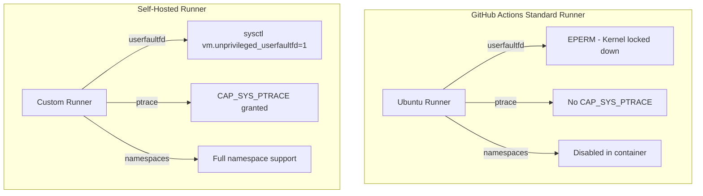

# Self-Hosted Runner Requirements

> **Status**: Phase 2 - Infrastructure Documentation
> **Author**: Project Tach Development Team
> **Purpose**: Define requirements for running Tach's Physics tests in CI

---

## Executive Summary

Tach's Physics tests (memory snapshot/restore validation) require kernel capabilities that are unavailable in standard GitHub Actions runners. This document specifies the requirements for a self-hosted runner capable of executing the full test suite.

---

## Why Self-Hosted?



### Kernel Features Required

| Feature        | Purpose                             | Why Not Available in GHA                   |
| -------------- | ----------------------------------- | ------------------------------------------ |
| `userfaultfd`  | Memory snapshot/restore             | `vm.unprivileged_userfaultfd=0` by default |
| `ptrace`       | TLS exploration, process inspection | Container lacks `CAP_SYS_PTRACE`           |
| PID Namespaces | Worker isolation                    | Container namespace nesting disabled       |
| Landlock       | Filesystem sandboxing               | Requires kernel 5.13+, GHA may be older    |
| Seccomp        | Syscall filtering                   | GHA applies restrictive seccomp profile    |

---

## Runner Requirements

### Operating System

| Requirement      | Specification                         |
| ---------------- | ------------------------------------- |
| **Distribution** | Ubuntu 22.04 LTS or later             |
| **Kernel**       | 5.15+ (required for Landlock ABI v1)  |
| **Architecture** | x86_64 (primary), aarch64 (secondary) |

### Kernel Configuration

The following sysctl settings must be applied:

```bash
# Enable unprivileged userfaultfd (required for Physics tests)
sudo sysctl -w vm.unprivileged_userfaultfd=1

# Persist across reboots
echo "vm.unprivileged_userfaultfd=1" | sudo tee /etc/sysctl.d/99-tach.conf
```

### Docker Configuration (If Using Docker)

If the runner uses Docker for isolation, the container must be started with:

```bash
docker run \
  --cap-add=SYS_PTRACE \
  --security-opt seccomp=unconfined \
  --security-opt apparmor=unconfined \
  --privileged \
  <image>
```

**Or with specific capabilities:**

```bash
docker run \
  --cap-add=SYS_PTRACE \
  --cap-add=SYS_ADMIN \
  --security-opt seccomp=unconfined \
  <image>
```

### Required Capabilities

| Capability       | Purpose                                           |
| ---------------- | ------------------------------------------------- |
| `CAP_SYS_PTRACE` | Process memory access, TLS exploration            |
| `CAP_SYS_ADMIN`  | Namespace creation (optional, enhances isolation) |

---

## Software Dependencies

### Build Tools

```bash
# Rust toolchain
curl --proto '=https' --tlsv1.2 -sSf https://sh.rustup.rs | sh
rustup default stable

# Python 3.12+ (PyO3 requires 3.8+, but 3.12+ recommended for sys.monitoring)
sudo apt install python3.12 python3.12-venv python3.12-dev

# Build essentials
sudo apt install build-essential pkg-config libssl-dev
```

### Python Environment

```bash
python3.12 -m venv .venv
source .venv/bin/activate
pip install pytest
```

### Environment Variables

```bash
# Required for PyO3 compilation
export PYO3_PYTHON=/path/to/.venv/bin/python

# Optional: Jemalloc configuration for production builds
export MALLOC_CONF="background_thread:false,dirty_decay_ms:0,muzzy_decay_ms:0"
```

---

## GitHub Actions Integration

### Runner Labels

Add the following labels to the self-hosted runner:

- `self-hosted`
- `linux`
- `x86_64`
- `physics` (custom label for Physics tests)

### Workflow Configuration

```yaml
# .github/workflows/physics.yml
name: Physics Tests

on:
  push:
    branches: [master]
  pull_request:
    branches: [master]

jobs:
  physics:
    runs-on: [self-hosted, linux, physics]
    steps:
      - uses: actions/checkout@v4

      - name: Verify Kernel Support
        run: |
          echo "Kernel version: $(uname -r)"
          sysctl vm.unprivileged_userfaultfd

      - name: Setup Python
        run: |
          python3 -m venv .venv
          source .venv/bin/activate
          pip install pytest

      - name: Build
        run: |
          source .venv/bin/activate
          export PYO3_PYTHON=$(which python)
          cargo build --release

      - name: Run Physics Tests
        run: |
          source .venv/bin/activate
          export PYO3_PYTHON=$(which python)
          cargo test --test physics_check -- --ignored --nocapture
          cargo test --test memory_invariant -- --ignored --nocapture

      - name: Run Sandbox Enforcement Tests
        run: |
          source .venv/bin/activate
          export PYO3_PYTHON=$(which python)
          cargo test --test sandbox_enforcement -- --nocapture
```

---

## Verification Script

Run this script to verify the runner meets all requirements:

```bash
#!/bin/bash
set -e

echo "=== Tach Self-Hosted Runner Verification ==="

# Check kernel version
KERNEL=$(uname -r)
echo "Kernel: $KERNEL"

# Check userfaultfd
UFFD=$(sysctl -n vm.unprivileged_userfaultfd 2>/dev/null || echo "0")
if [ "$UFFD" = "1" ]; then
    echo "userfaultfd: ENABLED"
else
    echo "userfaultfd: DISABLED (run: sudo sysctl -w vm.unprivileged_userfaultfd=1)"
    exit 1
fi

# Check for landlock support
if [ -d "/sys/kernel/security/landlock" ]; then
    echo "Landlock: AVAILABLE"
else
    echo "Landlock: NOT AVAILABLE (kernel too old)"
fi

# Check Rust
if command -v cargo &> /dev/null; then
    echo "Rust: $(cargo --version)"
else
    echo "Rust: NOT INSTALLED"
    exit 1
fi

# Check Python
if command -v python3 &> /dev/null; then
    echo "Python: $(python3 --version)"
else
    echo "Python: NOT INSTALLED"
    exit 1
fi

# Try creating userfaultfd
echo "Testing userfaultfd creation..."
python3 -c "
import os
import ctypes
libc = ctypes.CDLL('libc.so.6')
# Try userfaultfd syscall
result = libc.syscall(323, 0)  # SYS_userfaultfd on x86_64
if result >= 0:
    os.close(result)
    print('userfaultfd creation: SUCCESS')
else:
    print('userfaultfd creation: FAILED (errno:', ctypes.get_errno(), ')')
    exit(1)
"

echo "=== All Checks Passed ==="
```

---

## Security Considerations

### Runner Isolation

The self-hosted runner should:

1. **Run on dedicated hardware** - Not shared with production workloads
2. **Use ephemeral workers** - Clean up after each job
3. **Limit network access** - Only allow required GitHub API endpoints
4. **Monitor for abuse** - Log all job executions

### Capability Justification

| Capability           | Why Needed                                              | Risk Mitigation                    |
| -------------------- | ------------------------------------------------------- | ---------------------------------- |
| `CAP_SYS_PTRACE`     | TLS exploration via `arch_prctl`, process memory access | Runner runs only trusted Tach code |
| `SYS_ADMIN`          | PID namespace creation                                  | Optional, enhances isolation       |
| `seccomp=unconfined` | Allow userfaultfd syscall                               | Runner is isolated, not exposed    |

---

## Troubleshooting

### Common Issues

| Issue                  | Cause                           | Solution                     |
| ---------------------- | ------------------------------- | ---------------------------- |
| `EPERM` on userfaultfd | `vm.unprivileged_userfaultfd=0` | Run sysctl command           |
| `EPERM` on ptrace      | Missing `CAP_SYS_PTRACE`        | Add capability to container  |
| Test hangs             | Missing SIGSTOP handling        | Ensure test timeout is set   |
| Landlock `ENOSYS`      | Kernel < 5.13                   | Upgrade kernel or skip tests |

### Debugging

```bash
# Check userfaultfd availability
cat /proc/sys/vm/unprivileged_userfaultfd

# Check capabilities
capsh --print

# Check seccomp profile
cat /proc/self/status | grep Seccomp

# Check Landlock
ls -la /sys/kernel/security/landlock/
```

---

## Cloud Provider Options

### AWS EC2

Recommended instance type: `t3.medium` or larger

```bash
# User data script
#!/bin/bash
sysctl -w vm.unprivileged_userfaultfd=1
echo "vm.unprivileged_userfaultfd=1" >> /etc/sysctl.conf
```

### Google Cloud Compute

```bash
# Startup script
#!/bin/bash
sysctl -w vm.unprivileged_userfaultfd=1
```

### Azure VM

Use Ubuntu 22.04 LTS image with Standard_B2s or larger.

---

## References

- [GitHub Self-Hosted Runners](https://docs.github.com/en/actions/hosting-your-own-runners)
- [userfaultfd(2) man page](https://man7.org/linux/man-pages/man2/userfaultfd.2.html)
- [Landlock Documentation](https://docs.kernel.org/security/landlock.html)
- [Docker Security Options](https://docs.docker.com/engine/reference/run/#security-configuration)

---

_"The Iron Dome requires an iron foundation."_

_Project Tach CI Infrastructure Standard_
