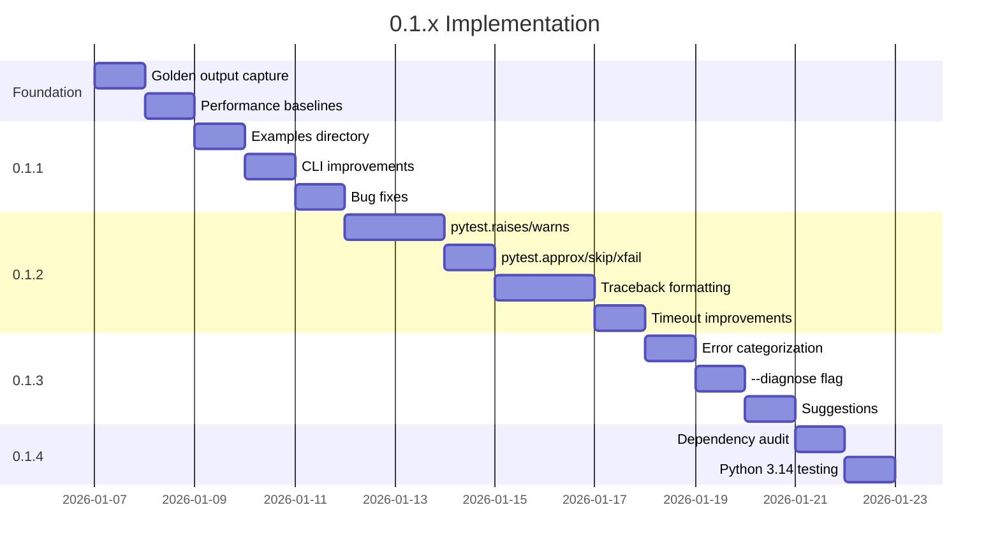

# 0.1.x Implementation Plan

> **Goal**: Complete all 0.1.x milestones with maximum regression prevention.
> **Approach**: Implement features with tests, golden output capture, performance baselines.

---

## Research Foundation

This plan is informed by the following research documents:

| Topic                   | Reference                                                           | Relevance to 0.1.x                   |
| ----------------------- | ------------------------------------------------------------------- | ------------------------------------ |
| **Kineton Engine**      | [rust-integration.md](../research/topics/rust-integration.md)       | AST-based discovery, static analysis |
| **Fork Safety**         | [fork-safety.md](../research/topics/fork-safety.md)                 | Timeout handling, worker lifecycle   |
| **Memory Snapshotting** | [memory-snapshotting.md](../research/topics/memory-snapshotting.md) | Diagnostics, snapshot verification   |
| **Test Isolation**      | [isolation.md](../research/topics/isolation.md)                     | Error handling, container detection  |

### Key Quotes Guiding Implementation

> "shifts the heavy lifting of static analysis, dependency graph resolution, and execution supervision out of the slow, interpreted Python runtime and into a high-performance, compiled substrate: Rust"
> — _Python Testing Engine Rust Breakthroughs_

> "If a background thread holds a mutex or lock at the precise nanosecond fork() is invoked, that lock is copied into the child process's memory in a 'locked' state"
> — _Fork Safety of Python C-Extensions_ (relevant to timeout/worker lifecycle in 0.1.2)

> "The userfaultfd subsystem fundamentally alters the contract between the memory management unit (MMU) and the user-space application"
> — _Python Memory Snapshotting with Userfaultfd_ (relevant to --diagnose in 0.1.3)

---

## Overview

This plan covers the full implementation of 0.1.1 through 0.1.4 as defined in CHANGELOG.md.

```mermaid
flowchart LR
    subgraph v011["0.1.1 - Documentation & Polish"]
        A1[Examples]
        A2[CLI improvements]
        A3[Bug fixes]
    end

    subgraph v012["0.1.2 - Test Compatibility"]
        B1[pytest.raises]
        B2[pytest.warns]
        B3[pytest.approx]
        B4[Tracebacks]
        B5[Timeouts]
    end

    subgraph v013["0.1.3 - Error Handling"]
        C1[Error codes]
        C2[--diagnose]
        C3[Suggestions]
    end

    subgraph v014["0.1.4 - Dependencies"]
        D1[Rust updates]
        D2[Python 3.14]
    end

    v011 --> v012 --> v013 --> v014
```



---

## Regression Test Strategy

### Golden Output Tests

Before any implementation, capture current behavior:

```
tests/regression/
  golden/
    snapshots/
      gauntlet.stdout.golden
      gauntlet_db.stdout.golden
      gauntlet_numpy.stdout.golden
      coverage.lcov.golden
      junit.xml.golden
    test_golden_outputs.py
```

**Update protocol**: Run `UPDATE_GOLDEN=1 pytest tests/regression/` to refresh snapshots.

### Performance Baselines

```
tests/regression/
  perf/
    baselines/
      timing.json        # Test execution times
      memory.json        # Peak RSS measurements
    test_perf_regression.py
```

**Thresholds**: Fail if >10% slower or >20% more memory.

---

## 0.1.1 - Documentation and Polish

### Examples Directory

```
examples/
  simple/
    tests/
      test_basic.py       # Basic assertions
      test_fixtures.py    # Fixture patterns
      conftest.py
    pyproject.toml
    README.md

  async/
    tests/
      test_async.py       # async def tests
      test_gather.py      # asyncio patterns
    README.md

  parametrized/
    tests/
      test_params.py      # @pytest.mark.parametrize
    README.md

  markers/
    tests/
      test_markers.py     # Custom markers, -m filtering
    README.md

  conftest/
    tests/
      outer/
        conftest.py
        inner/
          conftest.py
          test_nested.py
    README.md
```

### CLI Improvements

| Flag                  | Implementation                                    |
| --------------------- | ------------------------------------------------- |
| `--version --verbose` | Show Python version, kernel version, capabilities |
| `--dry-run`           | Discover tests, print what would run, exit        |
| `--collect-only`      | Alias for `list` command                          |
| `--help` improvements | Add examples for each flag                        |

**Files to modify**: `src/main.rs`, `src/core/config.rs`

### Bug Fixes

| Bug                      | Fix Location                                         |
| ------------------------ | ---------------------------------------------------- |
| Decorated test functions | `src/discovery/scanner.rs` - handle decorator chains |
| Nested conftest.py       | `src/discovery/resolver.rs` - fix inheritance        |
| Symlinked directories    | `src/discovery/scanner.rs` - canonicalize paths      |
| Long test names          | `src/reporting/reporter.rs` - truncate display       |
| Narrow terminal progress | `src/reporting/reporter.rs` - responsive layout      |

### Tests for 0.1.1

```
tests/
  gauntlet_011/
    test_cli_flags.py       # --dry-run, --collect-only, --version
    test_decorated.py       # Decorated function discovery
    test_conftest_nested.py # Nested conftest inheritance
    test_symlinks.py        # Symlinked test directories
```

---

## 0.1.2 - Test Compatibility

### pytest.raises() Implementation

**Location**: `src/tach_harness.py` (Python-side compatibility layer)

```python
class raises:
    """Context manager for expected exceptions."""

    def __init__(self, expected_exception, *, match=None):
        self.expected_exception = expected_exception
        self.match = match
        self.excinfo = None

    def __enter__(self):
        return self

    def __exit__(self, exc_type, exc_val, exc_tb):
        if exc_type is None:
            raise AssertionError(f"DID NOT RAISE {self.expected_exception}")
        if not issubclass(exc_type, self.expected_exception):
            return False  # Re-raise
        if self.match and not re.search(self.match, str(exc_val)):
            raise AssertionError(f"Pattern '{self.match}' not found in '{exc_val}'")
        self.excinfo = ExceptionInfo(exc_type, exc_val, exc_tb)
        return True  # Suppress exception
```

### pytest.warns() Implementation

Similar pattern for warnings:

```python
class warns:
    """Context manager for expected warnings."""

    def __init__(self, expected_warning, *, match=None):
        self.expected_warning = expected_warning
        self.match = match

    def __enter__(self):
        self._catch = warnings.catch_warnings(record=True)
        self._warnings = self._catch.__enter__()
        warnings.simplefilter("always")
        return self

    def __exit__(self, *args):
        self._catch.__exit__(*args)
        matching = [w for w in self._warnings
                    if issubclass(w.category, self.expected_warning)]
        if not matching:
            raise AssertionError(f"DID NOT WARN {self.expected_warning}")
        if self.match:
            if not any(re.search(self.match, str(w.message)) for w in matching):
                raise AssertionError(f"Pattern '{self.match}' not found")
```

### pytest.approx() Implementation

```python
class approx:
    """Approximate floating point comparison."""

    def __init__(self, expected, rel=None, abs=None):
        self.expected = expected
        self.rel = rel if rel is not None else 1e-6
        self.abs = abs if abs is not None else 1e-12

    def __eq__(self, actual):
        if isinstance(self.expected, (list, tuple)):
            return all(approx(e, self.rel, self.abs) == a
                       for e, a in zip(self.expected, actual))
        tolerance = max(self.rel * abs(self.expected), self.abs)
        return abs(self.expected - actual) <= tolerance

    def __repr__(self):
        return f"approx({self.expected} ± {self.rel*100}%)"
```

### pytest.fail/skip/xfail

```python
def fail(reason=""):
    """Explicitly fail the test."""
    raise AssertionError(reason or "Test failed")

def skip(reason=""):
    """Skip the current test."""
    raise SkipException(reason)

def xfail(reason=""):
    """Mark test as expected to fail."""
    raise XFailException(reason)

def importorskip(modname, minversion=None):
    """Import and return module, or skip if not available."""
    try:
        mod = importlib.import_module(modname)
        if minversion:
            version = getattr(mod, "__version__", "0.0.0")
            if parse_version(version) < parse_version(minversion):
                skip(f"{modname} >= {minversion} required")
        return mod
    except ImportError:
        skip(f"{modname} not available")
```

### Traceback Formatting

**Location**: `src/reporting/reporter.rs`

| Format        | Description                |
| ------------- | -------------------------- |
| `--tb=short`  | First and last frames only |
| `--tb=long`   | Full traceback with locals |
| `--tb=line`   | One line per failure       |
| `--tb=native` | Python's default format    |
| `--tb=no`     | No traceback               |

### Timeout Improvements

**Location**: `src/execution/zygote.rs`

- Per-test timeout via `@pytest.mark.timeout(30)`
- Global timeout in pyproject.toml
- Graceful cleanup on timeout (kill tree, collect partial output)

### Tests for 0.1.2

```
tests/
  gauntlet_012/
    test_raises.py          # pytest.raises patterns
    test_warns.py           # pytest.warns patterns
    test_approx.py          # Floating point comparisons
    test_skip_xfail.py      # skip, xfail, importorskip
    test_tracebacks.py      # --tb flag variants
    test_timeouts.py        # Timeout marker and config
```

---

## 0.1.3 - Error Handling and Diagnostics

### Error Categorization

```rust
// src/core/errors.rs

pub enum ErrorCategory {
    User,    // Test failures, import errors, fixture errors
    System,  // Kernel issues, permissions, OOM
}

pub struct TachError {
    pub code: &'static str,    // E001, E002, etc.
    pub category: ErrorCategory,
    pub message: String,
    pub suggestion: Option<String>,
}
```

### Error Code Registry

| Code | Category | Meaning                   |
| ---- | -------- | ------------------------- |
| E001 | User     | Test assertion failed     |
| E002 | User     | Import error in test file |
| E003 | User     | Fixture not found         |
| E004 | User     | Invalid marker expression |
| E005 | System   | userfaultfd not available |
| E006 | System   | Landlock not supported    |
| E007 | System   | Permission denied         |
| E008 | System   | Out of memory             |
| E009 | System   | Too many open files       |
| E010 | User     | Timeout exceeded          |

### --diagnose Flag

**Location**: `src/core/diagnostics.rs`

```
$ tach --diagnose

Tach Diagnostics
================

System:
  Kernel: 6.6.87 ✓
  Architecture: x86_64 ✓

Capabilities:
  userfaultfd: ✓ (unprivileged)
  Landlock: ✓ (ABI v4)
  Seccomp: ✓

Python:
  Version: 3.12.1 ✓
  libpython: /usr/lib/libpython3.12.so ✓
  pytest: 8.0.0 ✓

Performance:
  Snapshot/restore cycle: 45μs ✓
  Fork overhead: 1.2ms ✓

All checks passed. Tach is ready.
```

### Common Failure Suggestions

| Condition            | Suggestion                                                              |
| -------------------- | ----------------------------------------------------------------------- |
| EPERM on userfaultfd | "Set vm.unprivileged_userfaultfd=1 or run with CAP_SYS_PTRACE"          |
| Kernel < 5.13        | "Landlock requires kernel 5.13+. Running without filesystem isolation." |
| pytest not found     | "Install pytest: pip install pytest"                                    |
| PYO3_PYTHON wrong    | "Set PYO3_PYTHON to your Python interpreter path"                       |

### Tests for 0.1.3

```
tests/
  gauntlet_013/
    test_error_codes.py     # Verify error codes are correct
    test_diagnose.py        # --diagnose output
    test_suggestions.py     # Helpful error messages
```

---

## 0.1.4 - Dependency Updates

### Rust Dependencies

| Dependency  | Action                             |
| ----------- | ---------------------------------- |
| PyO3        | Update to latest stable            |
| tokio       | Evaluate updates                   |
| clap        | Update to latest                   |
| notify      | Already updated to 8.x             |
| seccompiler | Evaluate as alternative to raw BPF |

### Python Compatibility Matrix

| Python | Status           | Notes                 |
| ------ | ---------------- | --------------------- |
| 3.8    | Supported (MSRV) | Minimum supported     |
| 3.9    | Supported        |                       |
| 3.10   | Supported        |                       |
| 3.11   | Supported        |                       |
| 3.12   | Supported        | PEP 669 coverage      |
| 3.13   | Supported        | mimalloc TLS handling |
| 3.14   | Testing          | When beta available   |
| PyPy   | Experimental     | Document limitations  |

### Tests for 0.1.4

```
tests/
  gauntlet_014/
    test_python_versions.py  # Version detection
    test_features.py         # Feature detection per version
```

---

## Implementation Order



---

## Success Criteria

### Regression Gates

- [ ] All golden output tests pass
- [ ] Performance within 10% of baseline
- [ ] No new clippy warnings
- [ ] Test coverage >= 80%

### Feature Completion

- [ ] `pytest.raises()` works identically to pytest
- [ ] `pytest.warns()` works identically to pytest
- [ ] `pytest.approx()` works identically to pytest
- [ ] All `--tb` formats match pytest output
- [ ] `--diagnose` reports all system capabilities
- [ ] Error messages include actionable suggestions

### Documentation

- [ ] All examples run successfully
- [ ] Quick-start guide is accurate
- [ ] CLI help is comprehensive

---

## File Changes Summary

| Area           | Files Modified | Files Added |
| -------------- | -------------- | ----------- |
| Core           | 5              | 2           |
| Discovery      | 2              | 0           |
| Execution      | 1              | 0           |
| Reporting      | 2              | 0           |
| Python harness | 1              | 0           |
| Examples       | 0              | ~15         |
| Tests          | 0              | ~20         |
| Docs           | ~5             | ~3          |

---

_Created: 2026-01-07_
