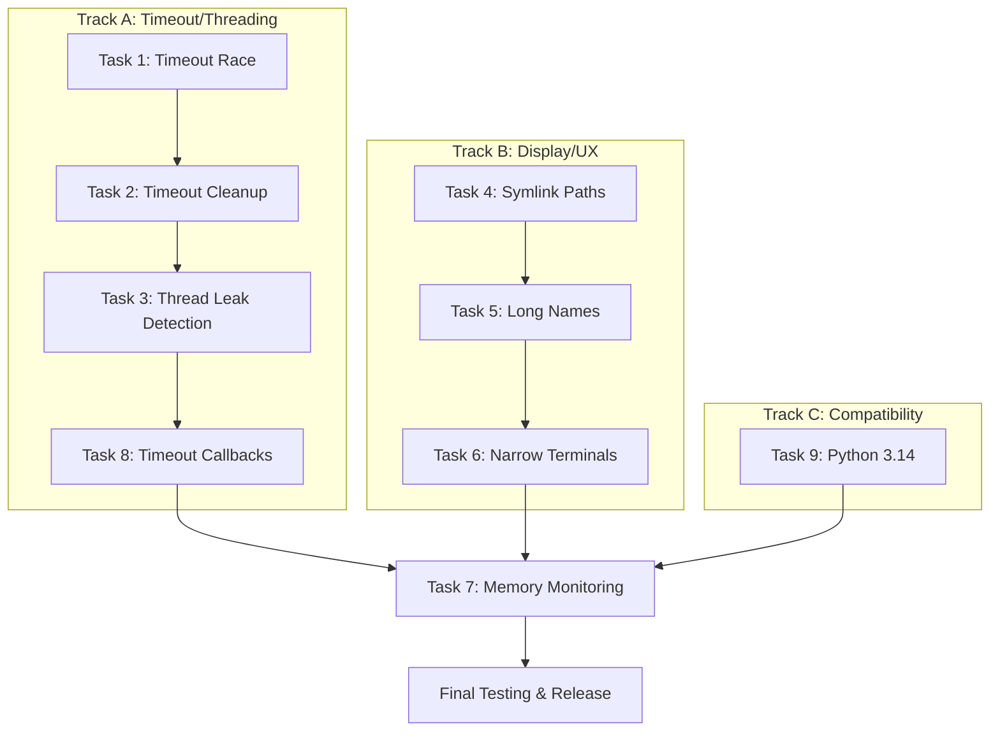

# Plan: Complete 0.1.x Release Series

> **Date:** 2026-01-08
> **Status:** Draft - Awaiting Approval
> **Scope:** Complete all remaining 0.1.1, 0.1.2, and 0.1.4 items to finalize the 0.1.x series

## Executive Summary

The 0.1.x series is approximately 85% complete. This plan addresses the **11 remaining unchecked items**:

| Version | Remaining Items | Category                                     |
| ------- | --------------- | -------------------------------------------- |
| 0.1.1   | 5 items         | 2 docs (deferred) + 3 bug fixes              |
| 0.1.2   | 5 items         | Timeout handling (4) + memory monitoring (1) |
| 0.1.3   | 0 items         | Complete                                     |
| 0.1.4   | 1 item          | Python 3.14 testing (now unblocked)          |

**Total: 11 items = 9 code tasks + 2 documentation tasks**

---

## Complete Inventory of Remaining Items

### 0.1.1 - Documentation and Polish

| #   | Item                                               | Type | In Plan  |
| --- | -------------------------------------------------- | ---- | -------- |
| 1   | Create `examples/` directory with sample projects  | Docs | Deferred |
| 2   | Write quick-start tutorial in `docs/quickstart.md` | Docs | Deferred |
| 3   | Fix path resolution for symlinked test directories | Code | Task 4   |
| 4   | Handle tests with very long names gracefully       | Code | Task 5   |
| 5   | Fix progress bar rendering on narrow terminals     | Code | Task 6   |

### 0.1.2 - Test Compatibility

| #   | Item                                                   | Type | In Plan |
| --- | ------------------------------------------------------ | ---- | ------- |
| 6   | Fix race condition in worker timeout detection         | Code | Task 1  |
| 7   | Improve cleanup when test times out mid-execution      | Code | Task 2  |
| 8   | Handle tests that spawn threads which outlive the test | Code | Task 3  |
| 9   | Support timeout callback hooks                         | Code | Task 8  |
| 10  | Add worker memory usage monitoring                     | Code | Task 7  |

### 0.1.3 - Error Handling and Diagnostics

**Status: COMPLETE** - All items checked in CHANGELOG.md

### 0.1.4 - Dependency Updates

| #   | Item                     | Type | In Plan |
| --- | ------------------------ | ---- | ------- |
| 11  | Test against Python 3.14 | Code | Task 9  |

---

## Prioritization

### Must Complete (9 Code Tasks)

| Priority | Task   | Item                                               | Version | Complexity | Risk   |
| -------- | ------ | -------------------------------------------------- | ------- | ---------- | ------ |
| P1       | Task 1 | Fix race condition in worker timeout detection     | 0.1.2   | High       | High   |
| P2       | Task 2 | Improve cleanup when test times out mid-execution  | 0.1.2   | Medium     | Medium |
| P3       | Task 3 | Handle tests that spawn threads which outlive test | 0.1.2   | High       | Medium |
| P4       | Task 4 | Fix path resolution for symlinked test directories | 0.1.1   | Low        | Low    |
| P5       | Task 5 | Handle tests with very long names gracefully       | 0.1.1   | Low        | Low    |
| P6       | Task 6 | Fix progress bar rendering on narrow terminals     | 0.1.1   | Low        | Low    |
| P7       | Task 7 | Add worker memory usage monitoring                 | 0.1.2   | Medium     | Low    |
| P8       | Task 8 | Support timeout callback hooks                     | 0.1.2   | Medium     | Low    |
| P9       | Task 9 | Test against Python 3.14                           | 0.1.4   | Low        | Medium |

### Deferred (2 Documentation Tasks)

| Item                                          | Reason                                   |
| --------------------------------------------- | ---------------------------------------- |
| Create `examples/` directory (6 sub-projects) | Nice-to-have, not blocking functionality |
| Write `docs/quickstart.md` (4 sections)       | Nice-to-have, not blocking functionality |

**Rationale for deferral:** These are pure documentation tasks that don't affect code functionality. They can be addressed in a dedicated documentation sprint after the code is stable.

---

## Detailed Implementation Plan

### Task 1: Fix Race Condition in Worker Timeout Detection

**CHANGELOG Item:** `[ ] Fix race condition in worker timeout detection` (0.1.2)

**File:** `src/execution/scheduler.rs`

**Problem:** When multiple workers timeout simultaneously, the scheduler may miss some timeouts or double-kill workers due to race conditions between the timeout check loop and result collection.

**Approach:**

1. Investigate current timeout detection in `check_stale_workers()`
2. Add atomic state tracking for worker timeout status
3. Use `AtomicU64` timestamp for last activity instead of mutex-protected instant
4. Implement compare-and-swap pattern for timeout state transitions
5. Add integration test that spawns 10+ workers with short timeouts

**Acceptance Criteria:**

- [ ] No panics when 10 workers timeout simultaneously
- [ ] Each timed-out worker is killed exactly once
- [ ] Results are reported correctly for each timeout
- [ ] Unit test: `test_concurrent_timeout_no_race`

**Estimated Effort:** 4 hours

---

### Task 2: Improve Cleanup When Test Times Out Mid-Execution

**CHANGELOG Item:** `[ ] Improve cleanup when test times out mid-execution` (0.1.2)

**Files:** `src/execution/scheduler.rs`, `src/execution/zygote.rs`

**Problem:** When a test times out during execution, leftover resources (file descriptors, temp files, Python objects) may leak.

**Approach:**

1. Add SIGTERM before SIGKILL with 100ms grace period
2. Track resources opened by worker (via `/proc/{pid}/fd`)
3. Implement cleanup callback in worker lifecycle
4. Ensure memfd for log capture is closed
5. Add test that verifies FD count doesn't increase after timeout

**Acceptance Criteria:**

- [ ] Workers receive SIGTERM before SIGKILL
- [ ] memfd log buffers are properly closed
- [ ] No FD leaks after 100 consecutive timeouts
- [ ] Unit test: `test_timeout_cleanup_no_fd_leak`

**Estimated Effort:** 3 hours

---

### Task 3: Handle Tests That Spawn Threads Which Outlive the Test

**CHANGELOG Item:** `[ ] Handle tests that spawn threads which outlive the test` (0.1.2)

**Files:** `src/execution/scheduler.rs`, `src/tach_harness.py`

**Problem:** If a test spawns a background thread (e.g., `threading.Thread(daemon=False)`), the thread continues running after the test completes, potentially affecting subsequent tests or causing orphan processes.

**Approach:**

1. Before test execution, record active Python thread count via `threading.active_count()`
2. After test execution, compare thread count
3. If threads increased, log warning and wait up to 500ms for threads to terminate
4. If threads still running, mark worker as toxic (cannot be reused)
5. Add `@pytest.mark.allow_threads` marker to opt out of this check

**Acceptance Criteria:**

- [ ] Detect when test spawns non-daemon threads
- [ ] Warn user about thread leak
- [ ] Worker marked toxic if threads don't terminate within grace period
- [ ] `@pytest.mark.allow_threads` bypasses check
- [ ] Unit test: `test_thread_leak_detection`

**Estimated Effort:** 4 hours

---

### Task 4: Fix Path Resolution for Symlinked Test Directories

**CHANGELOG Item:** `[ ] Fix path resolution for symlinked test directories` (0.1.1)

**File:** `src/discovery/scanner.rs`

**Problem:** When the test path contains symlinks, test discovery may fail or produce incorrect module names.

**Approach:**

1. Add `canonicalize()` call in `collect_test_files()`
2. Handle symlink cycles gracefully (max depth limit of 20)
3. Ensure `node_id` uses canonical path for consistency
4. Add test with symlinked `tests/` directory

**Acceptance Criteria:**

- [ ] Tests discovered correctly when path is symlink
- [ ] Symlink cycles don't cause infinite loop
- [ ] `node_id` matches pytest's behavior
- [ ] Integration test: `test_symlinked_test_directory`

**Estimated Effort:** 1.5 hours

---

### Task 5: Handle Tests with Very Long Names Gracefully

**CHANGELOG Item:** `[ ] Handle tests with very long names gracefully` (0.1.1)

**Files:** `src/discovery/scanner.rs`, `src/reporting/mod.rs`

**Problem:** Tests with names > 200 characters may cause display issues or overflow buffers.

**Approach:**

1. Truncate test names in display to 100 chars with `...` suffix
2. Store full name internally but display truncated
3. Ensure JUnit XML uses full name (spec requires it)
4. Add proptest for names up to 10000 chars

**Acceptance Criteria:**

- [ ] Names > 100 chars display as `name[0:97]...`
- [ ] JUnit XML contains full name
- [ ] Progress bar doesn't overflow
- [ ] Proptest: `proptest_long_test_names`

**Estimated Effort:** 1 hour

---

### Task 6: Fix Progress Bar Rendering on Narrow Terminals

**CHANGELOG Item:** `[ ] Fix progress bar rendering on narrow terminals` (0.1.1)

**File:** `src/reporting/mod.rs`

**Problem:** On terminals < 80 columns, the progress bar may wrap incorrectly or produce garbled output.

**Approach:**

1. Detect terminal width via `terminal_size` crate (already in deps)
2. If width < 60, switch to minimal mode: `[42/100] test_name`
3. If width < 40, switch to dots-only mode: `.F.S.`
4. Add `TACH_TERM_WIDTH` env override for testing

**Acceptance Criteria:**

- [ ] Progress bar readable at 40 columns
- [ ] No wrapping or garbled output
- [ ] Dots mode works at 30 columns
- [ ] Integration test with `TACH_TERM_WIDTH=40`

**Estimated Effort:** 1.5 hours

---

### Task 7: Add Worker Memory Usage Monitoring

**CHANGELOG Item:** `[ ] Add worker memory usage monitoring` (0.1.2)

**Files:** `src/execution/scheduler.rs`, `src/core/protocol.rs`

**Problem:** No visibility into worker memory consumption, making it hard to debug OOM issues.

**Approach:**

1. Read `/proc/{pid}/statm` to get RSS (resident set size)
2. Add `memory_rss_bytes` field to `TestResult`
3. Report peak memory in `--durations` output
4. Add `--memory` flag to show per-test memory usage
5. Warn if any test uses > 500MB

**Acceptance Criteria:**

- [ ] Each test result includes memory usage
- [ ] `--memory` flag shows memory per test
- [ ] Warning emitted for > 500MB tests
- [ ] Unit test: `test_memory_monitoring`

**Estimated Effort:** 2.5 hours

---

### Task 8: Support Timeout Callback Hooks

**CHANGELOG Item:** `[ ] Support timeout callback hooks` (0.1.2)

**Files:** `src/execution/scheduler.rs`, `src/core/config.rs`, `src/tach_harness.py`

**Problem:** Users want to run cleanup code when a test times out (e.g., capture heap dump, send alert).

**Approach:**

1. Add `timeout_hook` field to `[tool.tach]` config
2. Hook is a Python function path: `mymodule:on_timeout`
3. Hook receives `(test_id, test_name, timeout_seconds)`
4. Hook runs in supervisor, not worker (worker is dead)
5. Hook timeout: 5 seconds max

**Acceptance Criteria:**

- [ ] `timeout_hook` config option documented
- [ ] Hook invoked with correct arguments
- [ ] Hook timeout prevents hanging
- [ ] Integration test: `test_timeout_hook_invoked`

**Estimated Effort:** 3 hours

---

### Task 9: Test Against Python 3.14

**CHANGELOG Item:** `[ ] Test against Python 3.14 beta (when available)` (0.1.4)

**Files:** CI configuration, `docs/python-compatibility.md`

**Problem:** Python 3.14 is now released and needs compatibility verification.

**Approach:**

1. Install Python 3.14 in test environment
2. Run full test suite: `cargo test --lib && cargo test --test '*'`
3. Run gauntlet tests: `pytest tests/gauntlet/`
4. Document any breaking changes or new features
5. Update compatibility matrix in `docs/python-compatibility.md`
6. Add Python 3.14 to CI matrix

**Key Python 3.14 changes to verify:**

- PEP 649: Deferred Evaluation of Annotations (default)
- PEP 750: Template Strings (t-strings)
- Improved error messages
- `sys.monitoring` improvements (affects coverage)
- Free-threaded build availability

**Acceptance Criteria:**

- [ ] All unit tests pass on Python 3.14
- [ ] All gauntlet tests pass on Python 3.14
- [ ] Coverage collection works correctly
- [ ] `sys.monitoring` callbacks function properly
- [ ] Compatibility matrix updated
- [ ] CI includes Python 3.14

**Estimated Effort:** 3 hours

---

## Implementation Order

**Parallel execution:**

- **Track A (Timeout/Threading):** Tasks 1 → 2 → 3 → 8 (sequential dependencies)
- **Track B (Display/UX):** Tasks 4 → 5 → 6 (can run in parallel with Track A)
- **Track C (Compatibility):** Task 9 (independent, can run anytime)
- **Merge:** Task 7 (Memory Monitoring) after all tracks complete

---

## Testing Strategy

### Unit Tests (Required for Each Task)

| Task | Test Name                         | Type          | Location                               |
| ---- | --------------------------------- | ------------- | -------------------------------------- |
| 1    | `test_concurrent_timeout_no_race` | Stress        | `src/execution/scheduler.rs`           |
| 2    | `test_timeout_cleanup_no_fd_leak` | Resource      | `rust_tests/timeout_behavior_tests.rs` |
| 3    | `test_thread_leak_detection`      | Behavior      | `src/execution/scheduler.rs`           |
| 4    | `test_symlinked_test_directory`   | Integration   | `rust_tests/discovery_integration.rs`  |
| 5    | `proptest_long_test_names`        | Property      | `rust_tests/proptest_discovery.rs`     |
| 6    | `test_narrow_terminal_rendering`  | Visual        | `src/reporting/mod.rs`                 |
| 7    | `test_memory_monitoring`          | Feature       | `src/execution/scheduler.rs`           |
| 8    | `test_timeout_hook_invoked`       | Integration   | `rust_tests/timeout_behavior_tests.rs` |
| 9    | (full test suite on Python 3.14)  | Compatibility | CI                                     |

### Gauntlet Tests

Add to `tests/gauntlet_012/`:

- `test_timeout_edge_cases.py` - Covers Tasks 1, 2, 3, 8
- `test_display_edge_cases.py` - Covers Tasks 5, 6

---

## Risk Assessment

| Risk                                      | Impact | Probability | Mitigation                                                 |
| ----------------------------------------- | ------ | ----------- | ---------------------------------------------------------- |
| Timeout race fix breaks existing behavior | High   | Medium      | Add extensive regression tests before refactor             |
| Thread detection false positives          | Medium | Medium      | Allow opt-out via `@pytest.mark.allow_threads`             |
| Memory monitoring overhead                | Low    | Low         | Only read /proc on result collection, not during execution |
| Symlink cycle infinite loop               | High   | Low         | Add max depth (20) and cycle detection                     |
| Python 3.14 incompatibilities             | Medium | Low         | Run full test suite, check sys.monitoring changes          |

---

## Success Criteria

0.1.x series is complete when:

1. **All 9 code tasks implemented and tested**
2. **All checkboxes in CHANGELOG.md for 0.1.1-0.1.4 are checked** (except deferred docs)
3. **All new unit tests pass**
4. **All gauntlet tests pass**
5. **No regressions in existing 617 tests**
6. **Python 3.14 added to CI and passing**
7. **Documentation updated for new features** (`--memory` flag, `timeout_hook`)

---

## Estimated Total Effort

| Category              | Tasks       | Hours          |
| --------------------- | ----------- | -------------- |
| Timeout handling      | 1, 2, 3, 8  | 14             |
| Display fixes         | 4, 5, 6     | 4              |
| Memory monitoring     | 7           | 2.5            |
| Python 3.14 testing   | 9           | 3              |
| Testing & integration | -           | 4              |
| **Total**             | **9 tasks** | **27.5 hours** |

---

## Post-0.1.x Recommendations

1. **Documentation Sprint** - Create `examples/` directory and `docs/quickstart.md` as a dedicated effort
2. **Performance Baseline** - Establish benchmarks before starting 0.2.x plugin work
3. **Release Notes** - Compile comprehensive release notes for 0.1.x series

---

## Appendix: Deferred Documentation Tasks

These items are explicitly deferred and will NOT block the 0.1.x release:

### Create `examples/` Directory

- `examples/simple/` - Basic test suite with fixtures
- `examples/django/` - Django project with database tests
- `examples/async/` - Async test patterns
- `examples/parametrized/` - Complex parametrization examples
- `examples/markers/` - Custom markers and filtering
- `examples/conftest/` - Nested conftest patterns

### Write `docs/quickstart.md`

- Installation instructions for common distros
- First test run walkthrough
- Comparison with pytest workflow
- Migration guide from pytest

**Estimated effort for deferred docs:** 8 hours (separate sprint)
