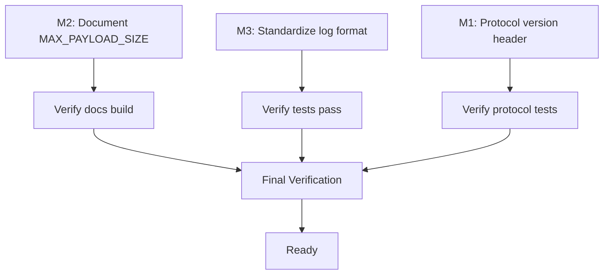

# Minor Improvements Plan

**Created:** 2026-01-08
**Status:** Ready for Implementation
**Scope:** Address 3 minor suggestions from code review

---

## Context

Code review of regression prevention fixes identified 3 minor improvements. Investigation verified all 3 are actionable with clear scope.

### Research Summary

| Suggestion                    | Scope                   | Complexity  | Verified |
| ----------------------------- | ----------------------- | ----------- | -------- |
| M1: Protocol version header   | 6 files, ~15 locations  | Medium      | ✅       |
| M2: Document MAX_PAYLOAD_SIZE | 1 file (protocol.md)    | Trivial     | ✅       |
| M3: Consistent log format     | 16 files, 102 locations | Medium-High | ✅       |

---

## Task M1: Add Protocol Version Header

### Problem

The IPC protocol has no version identification. Future protocol changes could cause silent incompatibilities between mismatched Supervisor/Zygote/Worker versions.

### Research Findings

**Current message framing:**

```
[Length (4 bytes, LE u32)] [Payload (bincode)]
```

**Protocol boundaries affected:**

1. Supervisor → Zygote: CMD_FORK with TestPayload
2. Zygote → Worker: CMD_RUN_TEST with TestPayload
3. Worker → Zygote → Supervisor: TestResult
4. Zygote → Supervisor: MSG_READY handshake

**Files requiring changes:**

- `src/core/protocol.rs` - Add constants, update encode/decode functions
- `src/execution/scheduler.rs` - Update dispatch and collection
- `src/execution/zygote.rs` - Update command loop and worker loop

### Proposed Design

**New framing format:**

```
[Magic (2 bytes: "TA")] [Version (1 byte)] [Reserved (1 byte)] [Length (4 bytes)] [Payload]
```

**Constants to add in `src/core/protocol.rs`:**

```rust
/// Protocol magic bytes for frame validation
pub const PROTOCOL_MAGIC: [u8; 2] = *b"TA";

/// Protocol version for compatibility checking
pub const PROTOCOL_VERSION: u8 = 1;

/// Header size: magic(2) + version(1) + reserved(1) + length(4)
pub const HEADER_SIZE: usize = 8;
```

### Implementation Steps

1. **Update `src/core/protocol.rs`:**
   - Add `PROTOCOL_MAGIC`, `PROTOCOL_VERSION`, `HEADER_SIZE` constants
   - Modify `encode_with_length` to prepend header
   - Modify `decode_with_limit` to validate header
   - Add `ProtocolError` variant for version mismatch

2. **Update `src/execution/zygote.rs`:**
   - Update `MSG_READY` handshake to include version
   - Update command reading in `entrypoint()` and `worker_loop()`
   - Update result forwarding in `spawn_result_collector()`

3. **Update `src/execution/scheduler.rs`:**
   - Update `dispatch_test()` to use new framing
   - Update `try_collect_result()` and `try_collect_result_for_reporter()`

4. **Update tests:**
   - Update protocol unit tests
   - Update integration tests that mock protocol messages

### Verification

```bash
cargo test --lib protocol
cargo test --test '*'
```

### Risks

- **Breaking change**: Old binaries cannot communicate with new binaries
- **Mitigation**: This is acceptable for pre-1.0 software; document in CHANGELOG

---

## Task M2: Document MAX_PAYLOAD_SIZE in Architecture Docs

### Problem

`MAX_PAYLOAD_SIZE` (16 MiB) is a security-critical constant but not documented in architecture docs.

### Research Findings

**Best location:** `docs/architecture/protocol.md`

- Already has "Message Framing" section
- Already documents "Message Truncation" (4096 bytes for strings)
- Natural place for size limits

**Current state of protocol.md:**

- Line 122: "Message Framing" section exists
- Line 251: "Message Truncation" section exists
- No mention of MAX_PAYLOAD_SIZE or OOM protection

### Implementation Steps

1. **Add new section after "Message Framing" in `docs/architecture/protocol.md`:**

````markdown
## Message Size Limits

To prevent OOM attacks from malicious payloads, all IPC messages enforce size limits:

| Limit              | Value  | Purpose                            |
| ------------------ | ------ | ---------------------------------- |
| `MAX_PAYLOAD_SIZE` | 16 MiB | Maximum serialized message size    |
| Message truncation | 4 KiB  | Maximum error/output string length |

### Enforcement

Size validation occurs **before** memory allocation:

```rust
pub fn decode_with_limit<T: DeserializeOwned>(
    data: &[u8],
    max_size: usize,
) -> Result<T, DecodeWithLimitError> {
    // Extract claimed length from first 4 bytes
    let claimed_len = u32::from_le_bytes(data[..4].try_into()?) as usize;

    // Reject before allocating
    if claimed_len > max_size {
        return Err(DecodeWithLimitError::PayloadTooLarge {
            claimed: claimed_len,
            limit: max_size,
        });
    }
    // ... proceed with decode
}
```
````

This prevents a malicious actor from sending a crafted length prefix (e.g., `0xFFFFFFFF`) to trigger a 4GB allocation.

````

2. **Update "Related Documentation" section** to reference security implications

### Verification
```bash
# Build docs and verify section appears
cargo doc --no-deps
grep -A5 "Message Size Limits" docs/architecture/protocol.md
````

---

## Task M3: Standardize Log Format to `[tach:module]`

### Problem

Inconsistent log prefixes make filtering and debugging difficult:

- `[tach]` vs `[supervisor]` vs `[zygote]` vs `[worker]` vs `[scheduler]`

### Research Findings

**Current state:**

- 102 `eprintln!` statements with `[...]` prefixes across 16 files
- No documented convention in CLAUDE.md

**Unique prefixes found:**
| Current | Count | Proposed |
|---------|-------|----------|
| `[tach]` | 16 | `[tach]` (keep for CLI-level) |
| `[supervisor]` | 21 | `[tach:supervisor]` |
| `[zygote]` | 18 | `[tach:zygote]` |
| `[worker]` | 18 | `[tach:worker]` |
| `[scheduler]` | 1 | `[tach:scheduler]` |
| `[snapshot]` | 8 | `[tach:snapshot]` |
| `[calibration]` | 6 | `[tach:calibration]` |
| `[coverage]` | 2 | `[tach:coverage]` |
| `[config]` | 3 | `[tach:config]` |
| `[test]` | 12 | `[tach:test]` |
| Others | ~17 | `[tach:<module>]` |

### Proposed Convention

**Format:** `[tach:<module>]` where `<module>` is the logical component name

**Module mapping:**

```
src/main.rs           → [tach] or [tach:cli]
src/execution/        → [tach:scheduler], [tach:zygote], [tach:worker]
src/isolation/        → [tach:snapshot], [tach:sandbox], [tach:calibration]
src/reporting/        → [tach:reporter], [tach:coverage], [tach:junit]
src/core/             → [tach:config], [tach:protocol]
src/discovery/        → [tach:loader], [tach:scanner]
```

### Implementation Steps

1. **Document convention in CLAUDE.md:**
   Add to "Coding Standards" section:

   ```markdown
   ### Logging Format

   | Aspect        | Rule                                                                   |
   | ------------- | ---------------------------------------------------------------------- |
   | **Prefix**    | `[tach:<module>]` for all `eprintln!` diagnostic messages              |
   | **Modules**   | Use logical component name (scheduler, zygote, worker, snapshot, etc.) |
   | **CLI-level** | Use plain `[tach]` for top-level CLI messages in main.rs               |
   ```

2. **Update log statements by file:**
   - `src/execution/zygote.rs` (37 occurrences) - highest priority
   - `src/main.rs` (16 occurrences)
   - `src/isolation/snapshot.rs` (9 occurrences)
   - `src/isolation/calibration.rs` (9 occurrences)
   - Remaining 12 files (~31 occurrences)

3. **Use replace_all for efficiency:**
   ```bash
   # Example for zygote.rs
   sed -i 's/\[zygote\]/[tach:zygote]/g' src/execution/zygote.rs
   sed -i 's/\[worker\]/[tach:worker]/g' src/execution/zygote.rs
   ```

### Verification

```bash
# Verify no old-style prefixes remain
grep -r 'eprintln!("\[' src/ | grep -v '\[tach' | wc -l
# Should be 0

# Run tests to ensure nothing broke
cargo test --lib
```

---

## Execution Order



**Recommended order:**

1. **M2** (trivial - documentation only)
2. **M3** (medium - text replacement, low risk)
3. **M1** (medium - protocol change, requires careful testing)

---

## Verification Checklist

Before merge, verify:

- [ ] `docs/architecture/protocol.md` has "Message Size Limits" section
- [ ] No `eprintln!` with old-style prefixes (all use `[tach:*]`)
- [ ] CLAUDE.md has logging convention documented
- [ ] Protocol tests pass with new header format
- [ ] All integration tests pass
- [ ] `cargo test --lib` passes
- [ ] `cargo test --test '*'` passes

---

## Decision Point: M1 Scope

**Option A: Full protocol versioning (recommended)**

- Add magic + version header to all framed messages
- Higher effort, better future-proofing
- Estimated: 2-3 hours

**Option B: Version in handshake only**

- Add version to MSG_READY handshake
- Lower effort, limited benefit
- Estimated: 30 minutes

**Option C: Skip M1 for now**

- Document as future work
- Zero effort, kicks can down road
- Risk: Breaking changes harder later

**Recommendation:** Option A if targeting 1.0 soon, otherwise Option C and revisit before release.

---

## Success Criteria

1. MAX_PAYLOAD_SIZE documented in protocol.md
2. All log messages use consistent `[tach:module]` format
3. Protocol includes version header for future compatibility
4. All tests pass
5. Documentation is accurate and complete
