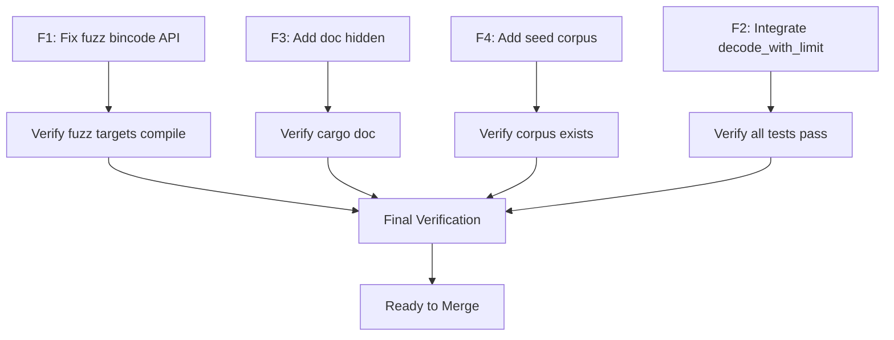

# Regression Prevention - Fix Plan (VERIFIED)

**Created:** 2026-01-08
**Status:** Ready for Implementation
**Scope:** Fix issues identified in code review before merge

---

## Context

The regression prevention implementation (Phase 1 & Phase 2) is complete and passes all tests. Code review identified issues that should be fixed before merge.

**Note:** This plan was updated after research verification. Original claims about F5 (P2-T1 spec gaps) were INCORRECT - those tests already exist.

### Issues to Address (Verified)

| ID     | Severity     | Issue                                                | Verified | Decision                                                 |
| ------ | ------------ | ---------------------------------------------------- | -------- | -------------------------------------------------------- |
| F1     | Important    | `fuzz_protocol_deserialize.rs` uses bincode v1.3 API | ✅ Yes   | **Fix** - Update to v2.0 API                             |
| F2     | Important    | `decode_with_limit` not used in production code      | ✅ Yes   | **Fix** - 4 locations                                    |
| F3     | Minor        | `strip_ansi_codes` public without `#[doc(hidden)]`   | ✅ Yes   | **Fix**                                                  |
| F4     | Minor        | Missing seed corpus for fuzz targets                 | ✅ Yes   | **Fix**                                                  |
| ~~G1~~ | ~~Spec Gap~~ | ~~P2-T1 missing unsupported arch test~~              | ❌ FALSE | Test exists: `test_seccomp_arch_error_message_format`    |
| ~~G2~~ | ~~Spec Gap~~ | ~~P2-T1 missing Landlock unavailable test~~          | ❌ FALSE | Test exists: `test_apply_iron_dome_graceful_degradation` |

---

## Implementation Plan

### Task F1: Fix fuzz_protocol_deserialize.rs (Bincode Version Mismatch)

**File:** `fuzz/fuzz_targets/fuzz_protocol_deserialize.rs` and `fuzz/Cargo.toml`

**Problem:** The fuzzer uses bincode 2.0 API syntax but `fuzz/Cargo.toml` has `bincode = "1.3"` which has a completely different API.

**Root Cause Analysis (via Context7 MCP):**

| Current Code (broken)                                                  | API Version | What It Expects                                       |
| ---------------------------------------------------------------------- | ----------- | ----------------------------------------------------- |
| `bincode::serde::decode_from_slice(data, bincode::config::standard())` | Bincode 2.0 | `bincode = { version = "2.0", features = ["serde"] }` |
| What `fuzz/Cargo.toml` has                                             | Bincode 1.3 | `bincode::deserialize(&[u8])`                         |

**Bincode 1.x vs 2.0 API (from Context7 migration guide):**

```
Bincode 1 API:                           Bincode 2 API:
bincode::deserialize(&[u8])         →    bincode::serde::decode_from_slice(&[u8], Configuration)
bincode::serialize(T)               →    bincode::serde::encode_to_vec(T, Configuration)
```

**Fix: Update `fuzz/Cargo.toml` to bincode 2.0:**

```toml
# BEFORE (broken):
bincode = "1.3"

# AFTER (fixed):
bincode = { version = "2.0", features = ["serde"] }
```

**Also add `timeout_secs: None` to TestPayload in the fuzzer:**

```rust
let test_payload = TestPayload {
    test_id: 1,
    file_path: String::from("test.py"),
    test_name: String::from("test_foo"),
    is_async: false,
    fixtures: vec![],
    log_fd: -1,
    debug_socket_path: String::new(),
    is_toxic: false,
    timeout_secs: None,  // ADD THIS - new field in TestPayload
};
```

**Verification:**

```bash
cargo check --manifest-path fuzz/Cargo.toml
```

---

### Task F2: Integrate decode_with_limit into Production Code

**Problem:** The `decode_with_limit` function exists but production code still uses raw `decode_from_slice`, leaving the OOM vulnerability open.

**Verified Production Locations (4 total):**

1. `src/execution/scheduler.rs:333` - Decodes `TestResult` from worker
2. `src/execution/scheduler.rs:446` - Decodes `TestResult` from worker
3. `src/execution/zygote.rs:378` - Decodes `TestPayload` from supervisor
4. `src/execution/zygote.rs:728` - Decodes `TestPayload` from supervisor

**Fix Pattern:**

```rust
// BEFORE (vulnerable):
let (result, _) = bincode::serde::decode_from_slice::<TestResult, _>(
    &result_buf,
    bincode::config::standard(),
)?;

// AFTER (protected):
use crate::protocol::{decode_with_limit, MAX_PAYLOAD_SIZE};
let result: TestResult = decode_with_limit(&result_buf, MAX_PAYLOAD_SIZE)?;
```

**Note:** The length prefix is already read separately, so we pass just the payload buffer.

**Verification:**

```bash
cargo test --lib protocol
cargo test --test '*'
```

---

### Task F3: Add #[doc(hidden)] to strip_ansi_codes (M1)

**File:** `src/reporting/junit.rs`

**Problem:** Function made public only for fuzzer access, not intended as public API.

**Fix:**

```rust
/// Strip ANSI color codes from strings (Boss Refinement #1)
/// ...existing docstring...
#[doc(hidden)]  // ADD THIS - public only for fuzz testing
pub fn strip_ansi_codes(s: &str) -> String {
```

**Verification:**

```bash
cargo doc --no-deps
# Verify strip_ansi_codes doesn't appear in public API docs
```

---

### Task F4: Add Seed Corpus for Fuzz Targets (M3)

**Directories to Create:**

- `fuzz/corpus/fuzz_toxicity_ast/`
- `fuzz/corpus/fuzz_ansi_stripper/`

**Seed Files for fuzz_toxicity_ast:**

```
# fuzz/corpus/fuzz_toxicity_ast/valid_import.py
import threading

# fuzz/corpus/fuzz_toxicity_ast/valid_from_import.py
from socket import socket

# fuzz/corpus/fuzz_toxicity_ast/safe_code.py
def hello():
    return "world"

# fuzz/corpus/fuzz_toxicity_ast/syntax_error.py
def broken(

# fuzz/corpus/fuzz_toxicity_ast/unicode.py
# 日本語コメント
def テスト():
    pass
```

**Seed Files for fuzz_ansi_stripper:**

```
# fuzz/corpus/fuzz_ansi_stripper/color_red (raw bytes)
\x1b[31mRed\x1b[0m

# fuzz/corpus/fuzz_ansi_stripper/incomplete_csi (raw bytes)
text\x1b[

# fuzz/corpus/fuzz_ansi_stripper/osc_sequence (raw bytes)
\x1b]0;title\x07

# fuzz/corpus/fuzz_ansi_stripper/unicode_emoji (raw bytes)
\x1b[32m✓\x1b[0m passed

# fuzz/corpus/fuzz_ansi_stripper/null_bytes (raw bytes)
text\x00with\x00nulls
```

**Verification:**

```bash
ls -la fuzz/corpus/fuzz_toxicity_ast/
ls -la fuzz/corpus/fuzz_ansi_stripper/
```

---

## ~~Task F5: Add Missing P2-T1 Tests~~ (CANCELLED)

**Status:** ❌ NOT NEEDED

**Reason:** Research verified these tests already exist:

- `test_seccomp_arch_error_message_format` (line 1142) - covers unsupported architecture
- `test_apply_iron_dome_graceful_degradation` (line 1076) - covers Landlock unavailable

The original code review incorrectly claimed these were missing.

---

## Execution Order



**Recommended Order:**

1. F1 (update bincode version + API)
2. F3 (one-line fix)
3. F4 (create seed files)
4. F2 (most complex, do last)

---

## Verification Checklist

Before merge, verify:

- [ ] `cargo check --manifest-path fuzz/Cargo.toml` passes
- [ ] `cargo test --lib` passes (690+ tests)
- [ ] `cargo test --test '*'` passes (integration tests)
- [ ] `cargo doc --no-deps` builds without `strip_ansi_codes` in public API
- [ ] Seed corpus directories exist with representative files

---

## Estimated Effort

| Task      | Complexity | Time    |
| --------- | ---------- | ------- |
| F1        | Medium     | 10 min  |
| F2        | Medium     | 15 min  |
| F3        | Trivial    | 1 min   |
| F4        | Easy       | 10 min  |
| ~~F5~~    | CANCELLED  | 0 min   |
| **Total** |            | ~35 min |

---

## Success Criteria

1. All identified issues are resolved
2. All tests pass
3. Fuzz targets compile and have seed corpus
4. API surface is clean (`#[doc(hidden)]` applied)
5. `decode_with_limit` is integrated into actual code paths
