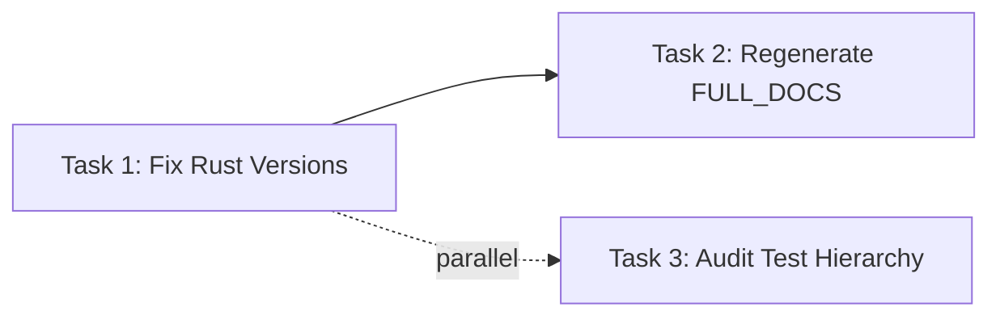

# Documentation Updates Implementation Plan

> **For Claude:** REQUIRED SUB-SKILL: Use superpowers:executing-plans to implement this plan task-by-task.

**Goal:** Fix stale Rust version references (1.85 -> 1.88), regenerate FULL_DOCUMENTATION.md, and verify test hierarchy consistency.

**Architecture:** Three independent documentation update tasks that can be executed in parallel. Task 1 fixes source docs, Task 2 regenerates the consolidated doc (must run AFTER Task 1), Task 3 audits test hierarchy references.

**Tech Stack:** Markdown, Bash (build-docs.sh script)

---

## Background

Recent commits updated Cargo.toml to require Rust 1.88 (MSRV), but several documentation files still reference Rust 1.85. Additionally, the `tests/crash_test/` directory was created recently and should be verified in docs.

**Authoritative Source:**

- `Cargo.toml:8` - `rust-version = "1.88"`
- `README.md:8` - Badge shows "Rust-1.88+"
- `README.md:89` - System requirements table shows "1.88+ (stable)"

**Stale Files:**

- `docs/development.md:11` - says "1.85+"
- `docs/decisions/rust-2024-edition-migration.md` - multiple "1.85" references
- `docs/research/research-investigation.md:88` - says "1.85+"

---

## Task 1: Fix Rust Version References in Source Docs

**Files:**

- Modify: `docs/development.md:11`
- Modify: `docs/decisions/rust-2024-edition-migration.md:6,12,167,169,188,190,284`
- Modify: `docs/research/research-investigation.md:88`

**Step 1: Update docs/development.md**

Change line 11 from:

```markdown
| Rust | 1.85+ | Async traits, Rust 2024 Edition |
```

To:

```markdown
| Rust | 1.88+ | Async traits, Rust 2024 Edition |
```

**Step 2: Update docs/decisions/rust-2024-edition-migration.md**

This file documents the migration to Rust 2024 Edition. Update all references from 1.85 to 1.88:

Line 6:

```markdown
> **Rust Version**: 1.88.0+ required for Edition 2024
```

Line 12:

```markdown
Rust 2024 Edition was stabilized with Rust 1.85.0 (February 20, 2025). This project now requires Rust 1.88.0+ as the MSRV. This document analyzes whether tach-core should migrate from Edition 2021 to Edition 2024, covering the pros, cons, breaking changes, and impact on our codebase.
```

Line 167:

```markdown
- Requires Rust 1.88.0+
```

Line 169:

```markdown
- CI must use 1.88.0+
```

Line 188:

```markdown
# 1. Ensure Rust 1.88.0+
```

Line 190:

```markdown
rustc --version # Should show 1.88.0 or later
```

Line 284:

```markdown
- [Rust 1.85.0 Release Announcement](https://blog.rust-lang.org/2025/02/20/Rust-1.85.0/) (Edition 2024 stabilization)
```

Note: Line 284 should keep 1.85.0 as it's a historical reference to when Edition 2024 was stabilized, but add context.

**Step 3: Update docs/research/research-investigation.md**

Change line 88 from:

```markdown
| Rust Toolchain | 1.85+ (2024 Edition) | Cargo.toml |
```

To:

```markdown
| Rust Toolchain | 1.88+ (2024 Edition) | Cargo.toml |
```

**Step 4: Verify changes**

Run:

```bash
grep -n "1\.85" docs/development.md docs/research/research-investigation.md
```

Expected: No matches (empty output)

Run:

```bash
grep -n "1\.88" docs/development.md docs/research/research-investigation.md
```

Expected: Shows the updated lines

**Step 5: Commit**

```bash
git add docs/development.md docs/decisions/rust-2024-edition-migration.md docs/research/research-investigation.md
git commit -m "$(cat <<'EOF'
docs: update Rust version requirement from 1.85 to 1.88

Synchronize documentation with Cargo.toml MSRV (rust-version = "1.88").
The previous 1.85+ references were from the Edition 2024 stabilization,
but Tach now requires 1.88+ for additional features.

Co-Authored-By: Claude <noreply@anthropic.com>
EOF
)"
```

---

## Task 2: Regenerate FULL_DOCUMENTATION.md

**Dependencies:** Must run AFTER Task 1 completes (to include updated version references).

**Files:**

- Regenerate: `docs/FULL_DOCUMENTATION.md` (via `scripts/build-docs.sh`)

**Step 1: Run the build script**

```bash
./scripts/build-docs.sh
```

Expected output:

```
Building consolidated documentation...

Generated: /home/louiskaneko/dev/tach-core/docs/FULL_DOCUMENTATION.md
  - 38 source files
  - ~10500 lines

To set up alias, add to ~/.bashrc:
  alias tach-docs='/home/louiskaneko/dev/tach-core/scripts/build-docs.sh'
```

**Step 2: Verify Rust version is updated in regenerated file**

Run:

```bash
grep -c "1\.88" docs/FULL_DOCUMENTATION.md
```

Expected: At least 3 matches (from the updated source docs)

Run:

```bash
grep "Rust.*1\.85" docs/FULL_DOCUMENTATION.md | head -5
```

Expected: Only historical references (the 1.85.0 release announcement link)

**Step 3: Commit**

```bash
git add docs/FULL_DOCUMENTATION.md
git commit -m "$(cat <<'EOF'
docs: regenerate FULL_DOCUMENTATION.md with updated Rust version

Rebuilt from source docs after updating Rust version references.

Co-Authored-By: Claude <noreply@anthropic.com>
EOF
)"
```

---

## Task 3: Audit Test Hierarchy Documentation

**Files:**

- Verify: `CLAUDE.md` (test hierarchy section)
- Verify: `docs/development.md` (testing section)
- Verify: `README.md` (if test directories mentioned)

**Step 1: Verify CLAUDE.md has crash_test/**

Run:

```bash
grep -n "crash_test" CLAUDE.md
```

Expected: Should show `crash_test/` in the test hierarchy (line ~198)

**Step 2: Verify test directories match filesystem**

Run:

```bash
ls -d tests/*/ | sort
```

Compare output with CLAUDE.md test hierarchy section. The directories should match.

**Step 3: Check docs/development.md test section**

Run:

```bash
grep -A5 "Python Gauntlet" docs/development.md
```

Verify the gauntlet test directories listed match what exists in `tests/`.

**Step 4: Verify no references to old test_segfault location**

Run:

```bash
grep -r "gauntlet/test_segfault\|gauntlet.*segfault" docs/ CLAUDE.md README.md
```

Expected: No matches (file was moved to crash_test/)

**Step 5: Document findings**

If all checks pass, no commit needed. If discrepancies found:

```bash
git add <modified-files>
git commit -m "$(cat <<'EOF'
docs: update test hierarchy documentation

Align documentation with current test directory structure.

Co-Authored-By: Claude <noreply@anthropic.com>
EOF
)"
```

---

## Execution Order



**Parallelizable:** Tasks 1 and 3 can run in parallel.
**Sequential:** Task 2 must run after Task 1 completes.

---

## Verification Checklist

After all tasks complete:

- [ ] `grep -c "1\.85" docs/development.md docs/research/research-investigation.md` returns 0
- [ ] `grep "Rust.*1\.88" docs/development.md` shows updated version
- [ ] `./scripts/build-docs.sh` runs successfully
- [ ] `docs/FULL_DOCUMENTATION.md` contains updated version references
- [ ] `tests/crash_test/` is documented in CLAUDE.md
- [ ] No stale references to `gauntlet/test_segfault.py`
- [ ] All commits follow conventional commit format

---

## Summary

| Task                                | Files Modified | Parallel?         |
| ----------------------------------- | -------------- | ----------------- |
| 1. Fix Rust versions                | 3 files        | Yes               |
| 2. Regenerate FULL_DOCUMENTATION.md | 1 file         | No (after Task 1) |
| 3. Audit test hierarchy             | 0-3 files      | Yes               |

**Total estimated changes:** 3-4 commits, ~15 lines modified in source docs + 1 regenerated file.
