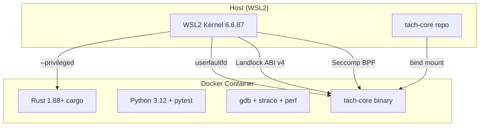

# Docker Development Environment Design

> **Status:** Approved
> **Date:** 2026-01-10
> **Goal:** Full-featured Docker dev environment for tach-core with no compromises

---

## Context

tach-core requires specific Linux kernel features:

- **userfaultfd** - Memory snapshots for fast test isolation
- **Landlock** - Filesystem sandboxing (ABI v4)
- **Seccomp** - Syscall filtering
- **Namespaces** - Process isolation

The user's WSL2 kernel (6.6.87) is fully configured with all features. Docker needs `--privileged` mode to access these kernel features.

## Requirements

1. **Hybrid usage** - Works as VS Code Dev Container AND standalone Docker
2. **Python 3.12** - Match host environment
3. **Full test suite** - All gauntlet tests runnable
4. **Debug tools** - gdb, strace, perf, htop
5. **Fast rebuilds** - Persistent cargo/target caches

## Architecture



## Files to Create

```
tach-core/
├── Dockerfile                  # Multi-stage build
├── docker-compose.yml          # Easy `docker compose up`
├── .devcontainer/
│   ├── devcontainer.json       # VS Code integration
│   └── post-create.sh          # Setup after container creation
└── docs/wsl2-setup.md          # Update with Docker section
```

## Dockerfile Design

### Base Image

- `ubuntu:24.04` - Matches WSL2, has Python 3.12

### Build Dependencies

- `rustup` with Rust 1.88+
- `build-essential`, `clang`, `libclang-dev` (for bindgen/userfaultfd-sys)
- `pkg-config`, `libssl-dev`

### Python Environment

- `python3.12`, `python3.12-venv`, `python3-pip`
- pytest installed in venv

### Debug Tools

- `gdb` - Rust/Python debugging
- `strace` - Syscall tracing
- `perf` - Performance profiling (linux-tools-generic)
- `htop`, `procps` - Process monitoring

### Extras

- `git`, `curl`, `jq`
- `ripgrep`, `fd-find` - Fast searching

### Configuration

- Working dir: `/workspace`
- User: `root` (required for privileged features)
- Shell: `bash`
- Environment: `PYO3_PYTHON=/workspace/.venv/bin/python`

## Docker Compose Design

```yaml
services:
  dev:
    build: .
    privileged: true
    volumes:
      - .:/workspace
      - cargo-cache:/root/.cargo/registry
      - cargo-git:/root/.cargo/git
      - target-cache:/workspace/target
    working_dir: /workspace
    stdin_open: true
    tty: true
    environment:
      - PYO3_PYTHON=/workspace/.venv/bin/python
      - CARGO_TARGET_DIR=/workspace/target

volumes:
  cargo-cache:
  cargo-git:
  target-cache:
```

## Dev Container Design

### devcontainer.json

- References Dockerfile
- Sets `"privileged": true`
- Runs `post-create.sh` on creation
- VS Code extensions:
  - `rust-lang.rust-analyzer`
  - `ms-python.python`
  - `tamasfe.even-better-toml`
  - `vadimcn.vscode-lldb` (debugging)

### post-create.sh

1. Create Python venv if not exists
2. Install pytest and test dependencies
3. Set up cargo environment
4. Run initial build

## Usage

### Standalone Docker

```bash
# Start container
docker compose up -d

# Enter container
docker compose exec dev bash

# Inside container
source .venv/bin/activate
cargo build --release
./target/release/tach-core self-test
pytest tests/gauntlet/ -v
```

### VS Code Dev Container

1. Open tach-core folder in VS Code
2. Click "Reopen in Container" when prompted
3. Wait for post-create.sh to complete
4. Terminal ready with all tools

## Verification Checklist

After implementation, verify:

- [ ] `tach-core self-test` passes all 8 checks
- [ ] `cargo test --lib` passes
- [ ] `pytest tests/gauntlet/` runs successfully
- [ ] `strace`, `gdb`, `perf` are available
- [ ] Cargo cache persists across container restarts
- [ ] VS Code Dev Container opens without errors

## Non-Goals

- Multi-architecture support (x86_64 only)
- Production deployment image
- CI/CD integration (separate concern)
