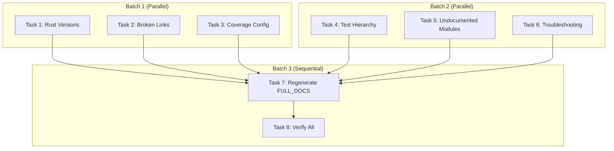

# Comprehensive Documentation Fixes Implementation Plan

> **For Claude:** REQUIRED SUB-SKILL: Use superpowers:executing-plans to implement this plan task-by-task.

**Goal:** Fix all documentation issues identified in the comprehensive audit: stale versions, broken links, incorrect examples, missing content, and outdated references.

**Architecture:** 8 independent tasks organized into 3 batches. Batch 1 (Tasks 1-3) can run in parallel. Batch 2 (Tasks 4-6) can run in parallel. Batch 3 (Tasks 7-8) must run sequentially after all others complete.

**Tech Stack:** Markdown, Bash, `scripts/build-docs.sh`

---

## Issue Summary

| Category                         | Count   | Tasks  |
| -------------------------------- | ------- | ------ |
| Stale Rust version (1.85→1.88)   | 3 files | Task 1 |
| Broken/incorrect links           | 6 files | Task 2 |
| Coverage config mismatch         | 2 files | Task 3 |
| Test hierarchy incomplete        | 1 file  | Task 4 |
| Undocumented modules             | 1 file  | Task 5 |
| Troubleshooting improvements     | 1 file  | Task 6 |
| Regenerate FULL_DOCUMENTATION.md | 1 file  | Task 7 |
| Verify all changes               | -       | Task 8 |

---

## Batch 1: High Priority Fixes (Parallel)

### Task 1: Fix Rust Version References

**Files:**

- Modify: `docs/development.md:11`
- Modify: `docs/decisions/rust-2024-edition-migration.md:6,12,167,169,188,190`
- Modify: `docs/research/research-investigation.md:88`

**Step 1: Update docs/development.md line 11**

```bash
# Find and replace
sed -i 's/| Rust        | 1\.85+/| Rust        | 1.88+/' docs/development.md
```

Verify:

```bash
grep "Rust.*1.88" docs/development.md
```

Expected: `| Rust        | 1.88+                      | Async traits, Rust 2024 Edition |`

**Step 2: Update docs/decisions/rust-2024-edition-migration.md**

Make these changes:

Line 6 - Change:

```markdown
> **Rust Version**: 1.85.0+ required for Edition 2024
```

To:

```markdown
> **Rust Version**: 1.88.0+ required (MSRV). Edition 2024 stabilized in 1.85.0.
```

Line 12 - Change:

```markdown
Rust 2024 Edition was stabilized with Rust 1.85.0 (February 20, 2025). This document analyzes whether tach-core should migrate from Edition 2021 to Edition 2024, covering the pros, cons, breaking changes, and impact on our codebase.
```

To:

```markdown
Rust 2024 Edition was stabilized with Rust 1.85.0 (February 20, 2025). This project now requires **Rust 1.88.0+** as the MSRV. This document analyzes the migration from Edition 2021 to Edition 2024, covering the pros, cons, breaking changes, and impact on our codebase.
```

Line 167 - Change `1.85.0+` to `1.88.0+`
Line 169 - Change `1.85.0+` to `1.88.0+`
Line 188 - Change `1.85.0+` to `1.88.0+`
Line 190 - Change `1.85.0` to `1.88.0`

**Step 3: Update docs/research/research-investigation.md line 88**

```bash
sed -i 's/| Rust Toolchain | 1\.85+/| Rust Toolchain | 1.88+/' docs/research/research-investigation.md
```

**Step 4: Verify no stale 1.85 references remain**

```bash
grep -n "1\.85" docs/development.md docs/research/research-investigation.md
```

Expected: No output (except historical references in decisions doc)

**Step 5: Commit**

```bash
git add docs/development.md docs/decisions/rust-2024-edition-migration.md docs/research/research-investigation.md
git commit -m "$(cat <<'EOF'
docs: update Rust version requirement from 1.85 to 1.88

Synchronize documentation with Cargo.toml MSRV (rust-version = "1.88").
The project now requires Rust 1.88+ while Edition 2024 was stabilized in 1.85.

Files updated:
- docs/development.md
- docs/decisions/rust-2024-edition-migration.md
- docs/research/research-investigation.md

Co-Authored-By: Claude <noreply@anthropic.com>
EOF
)"
```

---

### Task 2: Fix Broken Links

**Files:**

- Modify: `docs/benchmarks.md:46`
- Modify: `docs/research/roadmap.md:496`
- Modify: `docs/research/topics/zygote-patterns.md:149,221,233-235`
- Modify: `SECURITY.md:29`

**Step 1: Fix docs/benchmarks.md anchor**

Line 46 - Change:

```markdown
[docs/research/external-research.md](research/external-research.md#23-competitive-landscape)
```

To:

```markdown
[docs/research/external-research.md](research/external-research.md#23-rust-based-python-test-runners)
```

**Step 2: Fix docs/research/roadmap.md relative path**

Line 496 (or similar) - Change any occurrence of:

```markdown
[external-research.md §23](docs/research/external-research.md)
```

To:

```markdown
[external-research.md §23](external-research.md#23-rust-based-python-test-runners)
```

**Step 3: Fix docs/research/topics/zygote-patterns.md absolute paths**

Replace all root-relative paths with proper relative paths:

```bash
# Fix absolute paths to relative
sed -i 's|\[/docs/architecture/zygote.md\](/docs/architecture/zygote.md)|[zygote.md](../../architecture/zygote.md)|g' docs/research/topics/zygote-patterns.md
sed -i 's|\[/docs/architecture/toxicity.md\](/docs/architecture/toxicity.md)|[toxicity.md](../../architecture/toxicity.md)|g' docs/research/topics/zygote-patterns.md
sed -i 's|\[/CHANGELOG.md\](/CHANGELOG.md)|[CHANGELOG.md](../../../CHANGELOG.md)|g' docs/research/topics/zygote-patterns.md
```

**Step 4: Fix SECURITY.md anchor**

Line 29 - Change:

```markdown
[docs/development.md](docs/development.md#security-hardening)
```

To:

```markdown
[CLAUDE.md](CLAUDE.md#security-standards)
```

**Step 5: Verify links**

```bash
# Check fixed files for remaining broken patterns
grep -n "/docs/" docs/research/topics/zygote-patterns.md | head -5
```

Expected: No root-relative paths remaining

**Step 6: Commit**

```bash
git add docs/benchmarks.md docs/research/roadmap.md docs/research/topics/zygote-patterns.md SECURITY.md
git commit -m "$(cat <<'EOF'
docs: fix broken internal links and incorrect paths

- Fix anchor in benchmarks.md to match actual header
- Fix relative path in roadmap.md (same directory)
- Convert root-relative paths to proper relative paths in zygote-patterns.md
- Update SECURITY.md to point to correct security docs location

Co-Authored-By: Claude <noreply@anthropic.com>
EOF
)"
```

---

### Task 3: Fix Coverage Configuration Documentation

**Files:**

- Modify: `docs/configuration.md:192,215`

**Step 1: Update default coverage output documentation**

The documentation says default is `.coverage` but code uses `coverage.lcov`.

Line 192 - Change:

```markdown
output = ".coverage"
```

To:

```markdown
output = "coverage.lcov"
```

Line 215 - Change:

```markdown
| `output` | string | `".coverage"` | Output file path |
```

To:

```markdown
| `output` | string | `"coverage.lcov"` | Output file path |
```

**Step 2: Add note about environment variable precedence**

After line 196, add:

```markdown
> **Note:** Environment variables `TACH_COVERAGE_OUTPUT` and `TACH_COVERAGE_FORMAT` take precedence over `pyproject.toml` settings.
```

**Step 3: Verify changes**

```bash
grep -n "coverage.lcov\|\.coverage" docs/configuration.md
```

Expected: Shows `coverage.lcov` as default, `.coverage` only in historical/example context

**Step 4: Commit**

```bash
git add docs/configuration.md
git commit -m "$(cat <<'EOF'
docs: fix coverage configuration defaults

- Change default output from ".coverage" to "coverage.lcov" to match code
- Add note about environment variable precedence

Co-Authored-By: Claude <noreply@anthropic.com>
EOF
)"
```

---

## Batch 2: Medium Priority Fixes (Parallel)

### Task 4: Update Test Hierarchy in CLAUDE.md

**Files:**

- Modify: `CLAUDE.md:184-203`

**Step 1: Compare filesystem to documentation**

Current filesystem has:

```
benchmark/
crash_test/
django_project/
dummy_project/
env_test/
fd_leak_test/
gauntlet/
gauntlet_011/
gauntlet_012/
gauntlet_013/
gauntlet_014/
gauntlet_concurrent/
gauntlet_coverage/
gauntlet_db/
gauntlet_numpy/
gauntlet_phase1/
gauntlet_phase2/
gauntlet_phase3/
gauntlet_phase5/
gauntlet_phase5_1/
gauntlet_phase5_2/
gauntlet_phase5_4/
gauntlet_plugin/
gauntlet_restoration/
manual/
parallel_test/
regression/
```

**Step 2: Update CLAUDE.md test hierarchy**

Replace lines 184-203 with updated hierarchy:

```markdown
tests/
regression/ # Regression prevention
golden/ # Output snapshot tests
perf/ # Performance baselines
gauntlet/ # General stress tests
gauntlet_db/ # Database integration
gauntlet_numpy/ # NumPy/C-extension compat
gauntlet_coverage/ # Coverage ring buffer
gauntlet_phase1/ # Phase 1: Discovery
gauntlet_phase2/ # Phase 2: Zygote
gauntlet_phase3/ # Phase 3: Snapshot
gauntlet_phase5/ # Phase 5: Coverage (general)
gauntlet_phase5_1/ # Phase 5.1: Coverage collection
gauntlet_phase5_2/ # Phase 5.2: Sandbox integration
gauntlet_phase5_4/ # Phase 5.4: Allocator quiesce
gauntlet_011/ # Version 0.1.1 features
gauntlet_012/ # Version 0.1.2 features
gauntlet_013/ # Version 0.1.3 features
gauntlet_014/ # Version 0.1.4 features
gauntlet_concurrent/ # Worker storm/stress
gauntlet_restoration/ # TLS/state restoration
gauntlet_plugin/ # Plugin bridge stress
benchmark/ # Performance benchmarks
crash_test/ # Failure handling (SIGSEGV, etc.)
fd_leak_test/ # File descriptor leaks
parallel_test/ # Parallel execution
env_test/ # Environment handling
django_project/ # Django integration fixture
dummy_project/ # Test fixtures/samples
manual/ # Manual verification
```

**Step 3: Update docs/development.md test examples**

Find line mentioning `gauntlet_012` and update to show range:

```bash
grep -n "gauntlet_012" docs/development.md
```

Update to:

```markdown
pytest tests/gauntlet_01[1-4]/ -v # Version-specific gauntlets
```

**Step 4: Commit**

```bash
git add CLAUDE.md docs/development.md
git commit -m "$(cat <<'EOF'
docs: update test hierarchy to match filesystem

- Add all gauntlet_phase5_* subdirectories
- Add gauntlet_013, gauntlet_014
- Add gauntlet_plugin, gauntlet_restoration
- Add django_project directory
- Update development.md test example to show version range

Co-Authored-By: Claude <noreply@anthropic.com>
EOF
)"
```

---

### Task 5: Document Undocumented Modules

**Files:**

- Modify: `docs/architecture/overview.md`

**Step 1: Find the component list section**

```bash
grep -n "suggestions\|plugin_bridge" docs/architecture/overview.md
```

If not found, add to appropriate tier.

**Step 2: Add suggestions.rs to component list**

Find the Tier 2 or utility components section and add:

```markdown
| `src/core/suggestions.rs` | Error remediation suggestions | Provides actionable fix suggestions for common errors |
```

**Step 3: Add plugin_bridge.rs to component list**

```markdown
| `src/execution/plugin_bridge.rs` | Plugin compatibility layer | Bridges pytest plugin hooks to Tach execution model |
```

**Step 4: Commit**

```bash
git add docs/architecture/overview.md
git commit -m "$(cat <<'EOF'
docs: add suggestions.rs and plugin_bridge.rs to architecture overview

These modules were added but not documented in the architecture overview.

Co-Authored-By: Claude <noreply@anthropic.com>
EOF
)"
```

---

### Task 6: Improve Troubleshooting Documentation

**Files:**

- Modify: `docs/troubleshooting.md`

**Step 1: Add alternative kernel config check**

Find the seccomp check section (around line 19) and add alternative:

After:

```bash
grep CONFIG_SECCOMP /boot/config-$(uname -r)
```

Add:

````markdown
If `/boot/config-*` doesn't exist (common on WSL2 or cloud kernels):

```bash
zgrep CONFIG_SECCOMP /proc/config.gz
```
````

````

**Step 2: Add WSL2 .envrc tip**

Find the PYO3_PYTHON section and add:

```markdown
> **WSL2 Users:** Source `.envrc` to automatically set PYO3_PYTHON:
> ```bash
> source .envrc
> ```
````

**Step 3: Commit**

```bash
git add docs/troubleshooting.md
git commit -m "$(cat <<'EOF'
docs: improve troubleshooting for WSL2 and cloud kernels

- Add alternative kernel config check via /proc/config.gz
- Add .envrc tip for WSL2 users

Co-Authored-By: Claude <noreply@anthropic.com>
EOF
)"
```

---

## Batch 3: Finalization (Sequential)

### Task 7: Regenerate FULL_DOCUMENTATION.md

**Dependencies:** Must run AFTER Tasks 1-6 complete.

**Files:**

- Regenerate: `docs/FULL_DOCUMENTATION.md`

**Step 1: Run build script**

```bash
./scripts/build-docs.sh
```

Expected output:

```
Building consolidated documentation...

Generated: /home/louiskaneko/dev/tach-core/docs/FULL_DOCUMENTATION.md
  - ~40 source files
  - ~10500 lines
```

**Step 2: Verify key fixes are included**

```bash
# Check Rust version is updated
grep -c "1\.88" docs/FULL_DOCUMENTATION.md
# Expected: 3+ matches

# Check coverage.lcov default
grep "coverage.lcov" docs/FULL_DOCUMENTATION.md | head -2
# Expected: Shows updated default

# Check no broken absolute paths
grep -c "/docs/architecture/" docs/FULL_DOCUMENTATION.md
# Expected: 0 (all should be relative or anchors)
```

**Step 3: Commit**

```bash
git add docs/FULL_DOCUMENTATION.md
git commit -m "$(cat <<'EOF'
docs: regenerate FULL_DOCUMENTATION.md

Rebuilt from source docs after fixing:
- Rust version references (1.85 -> 1.88)
- Broken internal links
- Coverage configuration defaults
- Test hierarchy documentation
- Architecture module documentation
- Troubleshooting improvements

Co-Authored-By: Claude <noreply@anthropic.com>
EOF
)"
```

---

### Task 8: Final Verification

**Step 1: Run comprehensive link check**

```bash
# Check for remaining stale version references
grep -rn "1\.85" docs/ --include="*.md" | grep -v "1.85.0 Release\|stabilized.*1.85"
# Expected: No matches (only historical references allowed)

# Check for broken root-relative paths
grep -rn "\](/docs/" docs/ --include="*.md"
# Expected: No matches

# Check for broken anchors (spot check)
grep -rn "#security-hardening" docs/ SECURITY.md README.md
# Expected: No matches (was renamed)
```

**Step 2: Verify all commits**

```bash
git log --oneline -10
```

Expected: 7 commits from this plan

**Step 3: Run documentation build**

```bash
./scripts/build-docs.sh
```

Should complete without errors.

---

## Execution Order Diagram



---

## Verification Checklist

After all tasks complete:

- [ ] `grep -c "1\.85" docs/development.md` returns 0
- [ ] `grep -c "1\.88" docs/development.md` returns 1+
- [ ] `grep -c "/docs/" docs/research/topics/zygote-patterns.md` returns 0
- [ ] `grep "coverage.lcov" docs/configuration.md` shows updated default
- [ ] `grep -c "gauntlet_013" CLAUDE.md` returns 1+
- [ ] `grep -c "suggestions.rs" docs/architecture/overview.md` returns 1+
- [ ] `./scripts/build-docs.sh` completes successfully
- [ ] All 7 commits created with conventional format
- [ ] No broken links in regenerated FULL_DOCUMENTATION.md

---

## Summary

| Task                    | Files Modified | Commits | Parallelizable |
| ----------------------- | -------------- | ------- | -------------- |
| 1. Rust versions        | 3              | 1       | Yes (Batch 1)  |
| 2. Broken links         | 4              | 1       | Yes (Batch 1)  |
| 3. Coverage config      | 1              | 1       | Yes (Batch 1)  |
| 4. Test hierarchy       | 2              | 1       | Yes (Batch 2)  |
| 5. Undocumented modules | 1              | 1       | Yes (Batch 2)  |
| 6. Troubleshooting      | 1              | 1       | Yes (Batch 2)  |
| 7. Regenerate docs      | 1              | 1       | No (after all) |
| 8. Verification         | 0              | 0       | No (last)      |

**Total:** 13 files modified, 7 commits, ~50 lines changed in source docs + 1 regenerated file (~10k lines)
