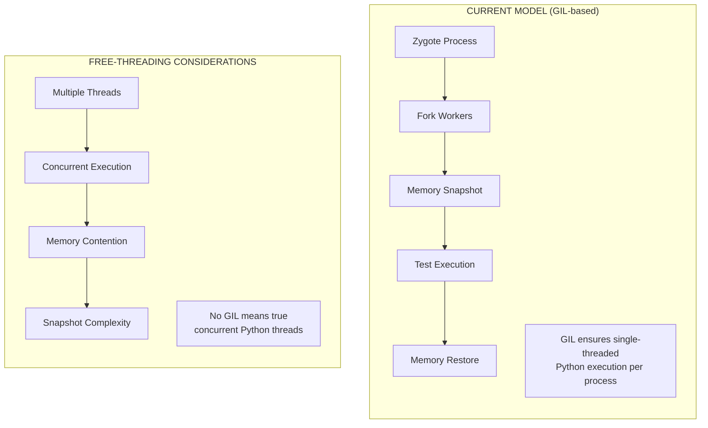

# Python Compatibility

This document describes Python version compatibility for Tach.

---

## Version Matrix

| Python Version    | Status       | Notes                            |
| :---------------- | :----------- | :------------------------------- |
| **3.10**          | Supported    | Minimum supported version        |
| **3.11**          | Supported    | Full feature support             |
| **3.12**          | Supported    | Required for PEP 669 coverage    |
| **3.13**          | Supported    | Includes mimalloc TLS handling   |
| **3.13t**         | Experimental | Free-threading build (see below) |
| **3.14**          | Supported    | Latest release (Oct 2025)        |
| **3.9 and below** | Unsupported  | May work but not tested          |

### Feature Availability by Version

| Feature                  | Minimum Version | Notes                                |
| :----------------------- | :-------------- | :----------------------------------- |
| Core test execution      | 3.10            | Basic functionality                  |
| Zero-overhead coverage   | 3.12            | Uses PEP 669 (Low-Impact Monitoring) |
| mimalloc TLS restoration | 3.13            | Self-calibrating offset discovery    |

---

## PyO3 Compatibility

Tach uses [PyO3](https://pyo3.rs/) 0.27 for Rust-Python integration.

### PyO3 0.27 Support Matrix

| Implementation | Version              | Status            |
| :------------- | :------------------- | :---------------- |
| **CPython**    | 3.7+                 | Supported by PyO3 |
| **PyPy**       | 7.3 (Python 3.11+)   | Experimental      |
| **GraalPy**    | 24.0+ (Python 3.10+) | Untested          |

> **Note**: While PyO3 supports CPython 3.7+, Tach requires Python 3.10+ for its own functionality.

---

## Alternative Python Implementations

### PyPy (Experimental)

PyPy is an alternative Python implementation with a JIT compiler. PyO3 0.27 provides experimental support for PyPy 7.3 (targeting Python 3.11+).

**Current Status**: Untested with Tach.

**Known Considerations**:

- PyPy has a different memory model than CPython
- The userfaultfd-based snapshot/restore may behave differently
- C extension compatibility varies
- JIT compilation may interact unexpectedly with Tach's isolation model

**Recommendation**: PyPy support is experimental. If you need to test PyPy-based projects, consider using `--no-isolation` mode and report any issues encountered.

### GraalPy

GraalPy is the GraalVM-based Python implementation.

**Current Status**: Untested with Tach.

GraalPy has a fundamentally different runtime architecture that may not be compatible with Tach's low-level process manipulation.

---

## PEP 703: Free-Threading (No-GIL Python)

### Overview

[PEP 703](https://peps.python.org/pep-0703/) introduces a build configuration (`--disable-gil`) that allows CPython to run without the Global Interpreter Lock (GIL). This is available as an experimental feature starting with Python 3.13.

Free-threaded Python builds are identified as `python3.13t` (the "t" suffix indicates free-threading).

### Key Changes in Free-Threading Mode

1. **No Global Interpreter Lock**: Multiple threads can execute Python bytecode simultaneously
2. **Memory Model**: Uses biased reference counting instead of the traditional reference counting
3. **Allocator**: Replaces pymalloc with mimalloc for thread-safe memory allocation
4. **C Extensions**: Must explicitly declare thread-safety; otherwise, the GIL is re-enabled

### Implications for Tach

#### Worker Model Impact

Tach's current architecture relies on several assumptions that may be affected:



**Considerations**:

| Aspect             | Current (GIL)              | Free-Threading                       |
| :----------------- | :------------------------- | :----------------------------------- |
| Thread Safety      | GIL serializes access      | Explicit synchronization required    |
| Memory Snapshots   | Single-threaded state      | Must handle concurrent modifications |
| Reference Counting | Simple increment/decrement | Biased reference counting            |
| Allocator          | pymalloc/jemalloc          | mimalloc (thread-local)              |
| C Extensions       | Assume GIL protection      | Must declare `Py_mod_gil`            |

#### Specific Technical Concerns

1. **Snapshot Timing**: Without the GIL, determining a safe point to capture memory state becomes more complex. Multiple threads may be modifying Python objects concurrently.

2. **Reference Count Integrity**: The biased reference counting system in free-threaded Python uses deferred reference counting for some objects, which may affect snapshot consistency.

3. **mimalloc Thread-Local State**: Free-threaded Python uses mimalloc with thread-local allocation buffers (TLABs). Tach already handles mimalloc TLS restoration for Python 3.13+, but concurrent thread allocation patterns may introduce new edge cases.

4. **Extension Compatibility**: PyO3-based extensions (including Tach itself) must declare free-threading compatibility using `#[pymodule(gil_used = false)]` or the GIL will be re-enabled at runtime.

#### Recommended Approach

For free-threaded Python support in Tach:

1. **Phase 1 (Current)**: Document implications and monitor Python 3.13t ecosystem maturity
2. **Phase 2 (Future)**: Test basic functionality with `--no-isolation` mode
3. **Phase 3 (Future)**: Investigate snapshot-safe synchronization primitives
4. **Phase 4 (Future)**: Implement full free-threading support if demand exists

### PyO3 Free-Threading Support

PyO3 0.23+ provides experimental support for free-threaded Python:

- Use `#[pymodule(gil_used = false)]` to declare thread-safety
- Use `Py_GIL_DISABLED` for conditional compilation
- Replace `static mut` with `PyOnceLock` or `Mutex` for shared state
- abi3 (limited API) is not compatible with free-threading

**Note**: Extensions that do not explicitly declare free-threading support will cause the interpreter to re-enable the GIL at runtime, effectively falling back to the traditional model.

---

## Python 3.14

Python 3.14 was released on October 7, 2025 and is fully supported by Tach.

### Key Python 3.14 Changes

| Feature                          | Status     | Notes                                      |
| :------------------------------- | :--------- | :----------------------------------------- |
| PEP 649: Deferred Annotations    | Compatible | Annotations evaluated lazily (now default) |
| PEP 750: Template Strings        | Compatible | New t-strings syntax supported             |
| Improved error messages          | Compatible | Better exception formatting                |
| `sys.monitoring` improvements    | Compatible | Coverage collection works correctly        |
| Free-threaded build availability | Untested   | 3.14t builds not yet tested                |

### Compatibility Notes

- All core functionality works identically to Python 3.13
- Coverage collection via PEP 669 (`sys.monitoring`) functions correctly
- No changes required to Tach configuration
- mimalloc TLS handling continues to work as in 3.13

See the [Python 3.14 release notes](https://docs.python.org/3/whatsnew/3.14.html) and
[PEP 745 (Release Schedule)](https://peps.python.org/pep-0745/) for details.

---

## Version Detection

Tach automatically detects the Python version at runtime:

```bash
# Check Python version
python --version

# Verify Tach sees the correct Python
./target/release/tach-core self-test
```

The `self-test` command reports the detected Python version and validates system compatibility.

---

## Troubleshooting

### Wrong Python Version Detected

If Tach uses the wrong Python version:

1. Ensure `PYO3_PYTHON` is set during build:

   ```bash
   export PYO3_PYTHON=$(which python)
   cargo build --release
   ```

2. Verify the virtual environment is active:
   ```bash
   source .venv/bin/activate
   which python
   ```

### Coverage Not Working

Coverage requires Python 3.12+ for PEP 669 support:

```bash
python --version  # Must be 3.12+
./target/release/tach-core --coverage .
```

If using Python 3.10 or 3.11, coverage collection is disabled.

### mimalloc Issues on Python 3.13+

Python 3.13 switched from pymalloc to mimalloc. If you encounter memory-related issues:

1. Verify Tach version supports Python 3.13
2. Check for TLS restoration errors in verbose output (`-vv`)
3. Report issues with detailed system information

---

## Related Documentation

- [Development Guide](development.md) - Build and test instructions
- [Configuration](configuration.md) - Runtime configuration options
- [Troubleshooting](troubleshooting.md) - Common issues and solutions
- [Architecture: Snapshot](architecture/snapshot.md) - Memory snapshot internals
