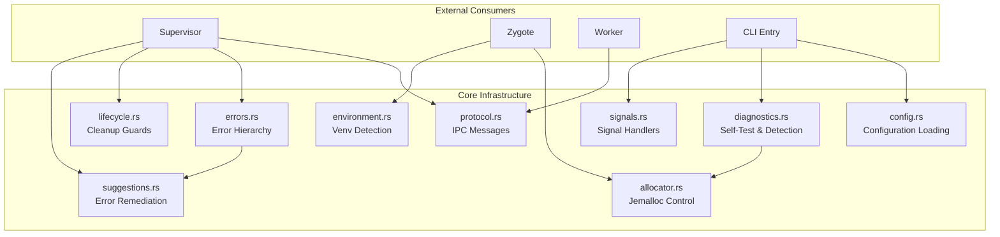
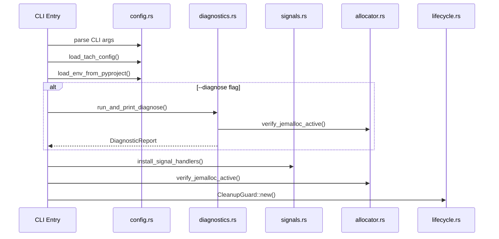
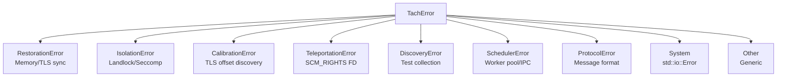
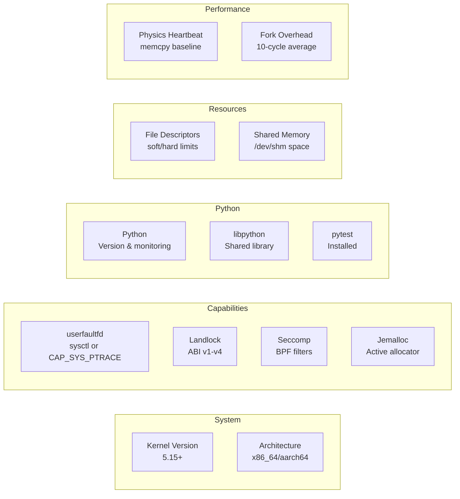
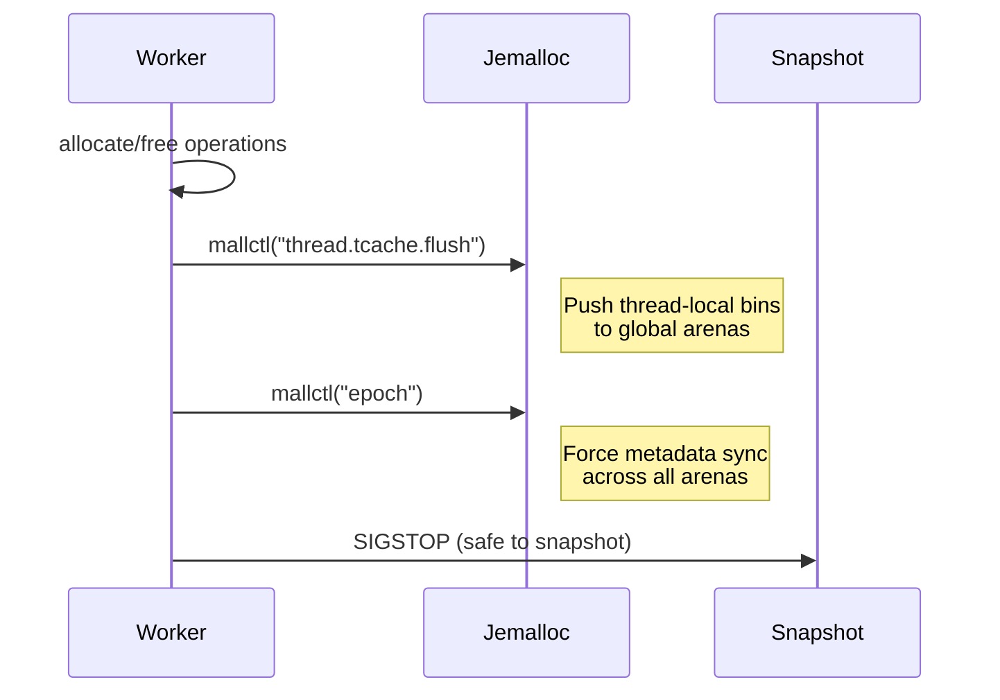
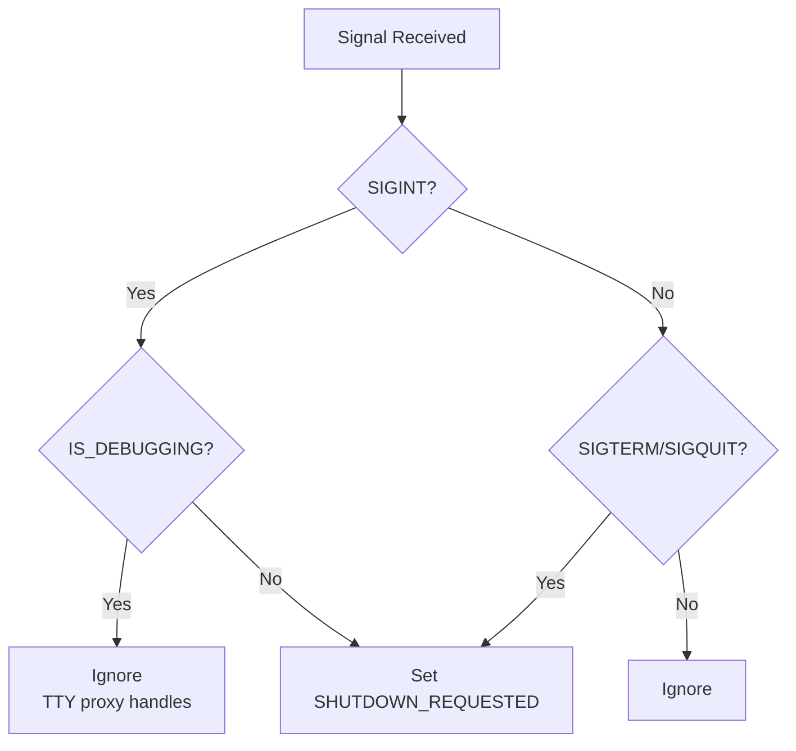
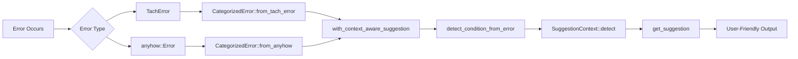
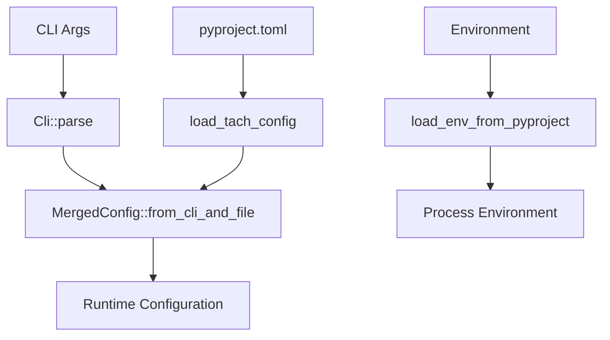
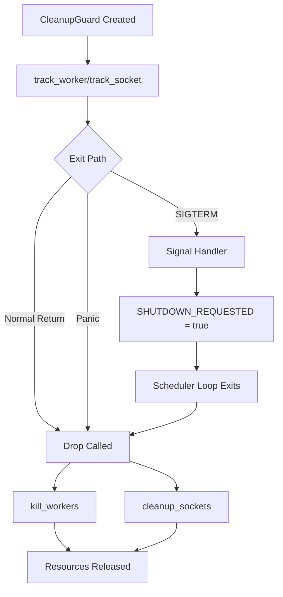

# Core Infrastructure Deep Dive

> **Purpose**: Technical deep-dive into Tach's core infrastructure modules. This document provides architectural understanding for contributors and maintainers.
>
> **Related**: See [external-research.md](./external-research.md) for external technologies and competitive analysis.

---

## 1. Architecture Overview

Tach's core infrastructure provides the foundational services that all other components depend on. These modules handle configuration, error management, diagnostics, IPC protocol, suggestions, memory allocation, process lifecycle, environment detection, and signal handling.

### Core Module Dependency Graph



### Data Flow: Startup Sequence



---

## 2. Configuration System

The configuration system (`config.rs`) provides a unified interface for loading settings from multiple sources with clear precedence rules.

### Configuration Sources (Priority Order)

| Priority    | Source                       | Example                   |
| ----------- | ---------------------------- | ------------------------- |
| 1 (Highest) | CLI Arguments                | `tach -n 4 --coverage`    |
| 2           | Environment Variables        | `TACH_WORKERS=4`          |
| 3           | pyproject.toml `[tool.tach]` | `timeout = 60`            |
| 4 (Lowest)  | Hardcoded Defaults           | 60s timeout, auto workers |

### Key Structures

#### `Cli` - Command Line Interface

The main CLI parser built with `clap`. Key argument groups:

- **Parallel Execution**: `-n/--workers` (pytest-xdist compatible)
- **Test Selection**: `-k/--keyword`, `-m/--markers`
- **Execution Control**: `-x/--exitfirst`, `--maxfail`, `-w/--watch`
- **Output Control**: `-v/--verbose`, `-q/--quiet`, `--format`, `--tb`
- **Coverage**: `--coverage`, `--cov`
- **Tach-Specific**: `--no-isolation`, `--force-toxic`, `--no-ignore`

#### `TachConfig` - File Configuration

Loaded from `pyproject.toml`:

```toml
[tool.tach]
test_pattern = "test_*.py"
timeout = 60
workers = 4
isolation_strategy = "auto"
timeout_hook = "mymodule:on_timeout"

[tool.tach.coverage]
enabled = true
source = ["src"]
omit = ["**/migrations/*"]
```

#### `MergedConfig` - Unified Configuration

The `MergedConfig::from_cli_and_file()` function merges CLI and file configuration:

- CLI arguments take precedence over file configuration
- Coverage enabled if CLI flag OR file config enables it
- Disabled plugins merged from both sources

### Environment Variable Security

The `load_env_from_pyproject()` function blocks dangerous environment variables:

| Blocked Variable       | Reason                                     |
| ---------------------- | ------------------------------------------ |
| `LD_PRELOAD`           | Library injection vector                   |
| `LD_LIBRARY_PATH`      | Library path manipulation                  |
| `PYTHONPATH`           | Python module hijacking                    |
| `PYTHONMALLOC`         | Critical for jemalloc snapshot consistency |
| `PATH`, `HOME`, `USER` | Path manipulation                          |

### Key Functions

| Function                    | Purpose                                     |
| --------------------------- | ------------------------------------------- |
| `Cli::worker_count()`       | Parse worker count, returns None for "auto" |
| `Cli::verbosity()`          | Get effective verbosity level               |
| `Cli::fail_fast()`          | Check if fail-fast is enabled               |
| `load_tach_config()`        | Load `[tool.tach]` from pyproject.toml      |
| `load_env_from_pyproject()` | Apply `[tool.pytest_env]` to environment    |
| `generate_completions()`    | Generate shell completion scripts           |

---

## 3. Error Handling Strategy

The error system (`errors.rs`) provides domain-specific errors that enable intelligent handling decisions.

### Error Hierarchy



### Error Decision Matrix

Each error type implements methods for intelligent handling:

| Method                 | Purpose                                 | Used By       |
| ---------------------- | --------------------------------------- | ------------- |
| `is_retryable()`       | Transient failures may succeed on retry | Scheduler     |
| `requires_kill()`      | Corruption detected, worker must die    | Supervisor    |
| `allows_degradation()` | Missing kernel features, reduced mode   | Sandbox setup |

### Error Categories by Domain

#### RestorationError (Memory Corruption)

| Variant       | Retryable | Requires Kill |
| ------------- | --------- | ------------- |
| `HeapDesync`  | No        | Yes           |
| `BssDesync`   | No        | Yes           |
| `TlsFailed`   | No        | No            |
| `UffdFault`   | Yes       | No            |
| `GhostObject` | No        | Yes           |
| `DtvMismatch` | No        | Yes           |

#### IsolationError (Sandbox Failures)

| Variant                 | Allows Degradation |
| ----------------------- | ------------------ |
| `LandlockUnavailable`   | Yes                |
| `SeccompUnavailable`    | Yes                |
| `CapabilityMissing`     | Yes                |
| `LandlockRulesetFailed` | No                 |
| `SeccompFailed`         | No                 |

### Error Codes Registry

User-facing error codes follow the pattern `E###`:

| Code | Category | Description                   |
| ---- | -------- | ----------------------------- |
| E001 | User     | Test assertion failed         |
| E002 | User     | Import error in test file     |
| E003 | User     | Fixture not found             |
| E004 | User     | Invalid marker expression     |
| E005 | System   | userfaultfd not available     |
| E006 | System   | Landlock not supported        |
| E007 | System   | Permission denied             |
| E008 | System   | Out of memory                 |
| E009 | System   | Too many open files           |
| E010 | User     | Timeout exceeded              |
| E011 | System   | OverlayFS mount failed        |
| E012 | User     | Python version mismatch       |
| E013 | System   | Namespace creation failed     |
| E014 | System   | Worker crash (SIGSEGV/SIGBUS) |
| E015 | System   | IPC channel failure           |
| E016 | System   | Snapshot integrity failure    |
| E017 | User     | Syntax error in test file     |
| E018 | User     | Circular fixture dependency   |
| E019 | User     | Skipped test (info)           |
| E020 | User     | Xfail test (expected failure) |

### CategorizedError

The `CategorizedError` struct provides user-friendly error output:

```
[E005] System Error: userfaultfd not available: EPERM
  Hint: Set vm.unprivileged_userfaultfd=1 or run with CAP_SYS_PTRACE
```

Key methods:

- `with_context_aware_suggestion()` - Enhance with system-detected context
- `with_quick_suggestion()` - Lightweight suggestion without full detection
- `from_anyhow()` - Convert anyhow errors with auto-categorization
- `from_tach_error()` - Convert internal errors for user display

---

## 4. Diagnostic System

The diagnostic system (`diagnostics.rs`) implements the `tach self-test` command, providing a pre-flight check that guarantees Tach will function correctly.

### The Pre-Flight Contract

> If `self-test` passes, the user has a **100% guarantee** that Tach will function correctly on their system.

### Diagnostic Checks



### Diagnostic Result Types

| Type | Icon     | Description                              |
| ---- | -------- | ---------------------------------------- |
| Pass | `[PASS]` | Check succeeded, feature available       |
| Fail | `[FAIL]` | Required check failed, Tach may not work |
| Warn | `[WARN]` | Non-required check failed, degraded mode |

### Remediation System

Each failed check can include remediation information:

```rust
Remediation {
    command: Some("sudo sysctl -w vm.unprivileged_userfaultfd=1"),
    docs_url: Some("https://github.com/.../troubleshooting.md#e005"),
    explanation: "Enable unprivileged userfaultfd for memory snapshots",
}
```

### Key Detection Functions

| Function                    | Checks                                    |
| --------------------------- | ----------------------------------------- |
| `check_kernel_version()`    | Linux 5.15+ for Landlock ABI v1           |
| `check_userfaultfd()`       | sysctl setting or CAP_SYS_PTRACE fallback |
| `check_landlock()`          | ABI version detection by kernel version   |
| `check_seccomp()`           | `prctl(PR_GET_SECCOMP)` availability      |
| `check_jemalloc()`          | `mallctl("version")` query                |
| `check_ptrace_capability()` | Micro-ptrace test via fork                |
| `check_python()`            | Version and sys.monitoring support        |
| `check_fd_limits()`         | `/proc/self/limits` parsing               |
| `check_shared_memory()`     | `/dev/shm` write test and space check     |
| `check_physics_heartbeat()` | 100-cycle memcpy baseline                 |
| `check_fork_overhead()`     | 10-fork timing measurement                |

### Output Modes

- `run_diagnostics()` - Returns `DiagnosticReport` for programmatic use
- `run_and_print_diagnostics()` - Basic self-test output
- `run_and_print_diagnose()` - Enhanced `--diagnose` output with categories

---

## 5. IPC Protocol Design

The protocol module (`protocol.rs`) defines the binary IPC format for supervisor-worker communication using bincode serialization.

### Protocol Frame Format

```
+--------+--------+----------+--------+------------------+
| Magic  | Version| Reserved | Length |     Payload      |
| 2 bytes| 1 byte | 1 byte   | 4 bytes| variable         |
+--------+--------+----------+--------+------------------+
   "TA"      1        0        u32 LE   bincode-encoded
```

### Command Bytes

| Constant           | Value | Direction            | Purpose               |
| ------------------ | ----- | -------------------- | --------------------- |
| `CMD_EXIT`         | 0x00  | Supervisor -> Zygote | Shutdown              |
| `CMD_FORK`         | 0x01  | Supervisor -> Zygote | Fork new worker       |
| `CMD_RUN_TEST`     | 0x02  | Supervisor -> Worker | Execute test          |
| `CMD_PING`         | 0x03  | Supervisor -> Worker | Health check          |
| `MSG_READY`        | 0x42  | Zygote -> Supervisor | Ready signal          |
| `MSG_WORKER_READY` | 0x43  | Worker -> Supervisor | Available for reuse   |
| `MSG_PONG`         | 0x44  | Worker -> Supervisor | Health check response |

### Status Codes

| Constant               | Value | Meaning                 |
| ---------------------- | ----- | ----------------------- |
| `STATUS_PASS`          | 0     | Test passed             |
| `STATUS_FAIL`          | 1     | Test failed (assertion) |
| `STATUS_SKIP`          | 2     | Test skipped            |
| `STATUS_CRASH`         | 3     | Worker crashed          |
| `STATUS_ERROR`         | 4     | Collection/setup error  |
| `STATUS_HARNESS_ERROR` | 5     | Tach internal error     |
| `STATUS_TIMEOUT`       | 6     | Test exceeded timeout   |

### Message Types

#### TestPayload (Supervisor -> Worker)

```rust
struct TestPayload {
    test_id: u32,
    file_path: String,
    test_name: String,
    is_async: bool,
    fixtures: Vec<FixtureInfo>,
    log_fd: i32,                    // memfd for log capture
    debug_socket_path: String,      // breakpoint() support
    is_toxic: bool,                 // requires fork/kill
    timeout_secs: Option<u64>,      // per-test timeout
    hooks: Vec<Hook>,               // conftest hooks
    cached_effects: Vec<HookEffect>,// session-level hook effects
    markers: Vec<String>,           // pytest markers
}
```

#### TestResult (Worker -> Supervisor)

```rust
struct TestResult {
    test_id: u32,
    status: u8,
    duration_ns: u64,
    message: String,                // truncated to 4KB
    memory_rss_bytes: Option<u64>,  // peak RSS from /proc
}
```

### Security: Payload Size Limits

- `MAX_PAYLOAD_SIZE`: 16 MiB - Prevents OOM attacks from malicious payloads
- `HEADER_SIZE`: 8 bytes - Fixed header for frame validation
- Length checked BEFORE allocation to prevent memory exhaustion

### Key Functions

| Function                    | Purpose                           |
| --------------------------- | --------------------------------- |
| `encode_with_length()`      | Serialize with protocol header    |
| `decode_with_limit()`       | Deserialize with size validation  |
| `read_process_memory_rss()` | Read RSS from `/proc/{pid}/statm` |
| `truncate_message()`        | Limit message to 4KB              |

### Memory Monitoring

The protocol includes memory usage tracking:

```rust
const MEMORY_WARNING_THRESHOLD_BYTES: u64 = 500 * 1024 * 1024; // 500MB
```

---

## 6. Suggestion Engine

The suggestion system (`suggestions.rs`) provides context-aware error remediation by detecting the runtime environment and providing targeted advice.

### Design Philosophy

Instead of generic hints, the system detects actual system state:

- If userfaultfd fails with EPERM, check if sysctl is set
- If pytest isn't found, suggest pip install with detected Python path
- If in Docker, suggest container-specific flags

### Failure Conditions

| Condition               | Detection Pattern                 |
| ----------------------- | --------------------------------- |
| `UserfaultfdEperm`      | EPERM + userfaultfd               |
| `LandlockKernelTooOld`  | landlock + unavailable/5.13       |
| `PytestNotFound`        | pytest + not found/no module      |
| `Pyo3PythonInvalid`     | pyo3_python OR python + not found |
| `TooManyOpenFiles`      | too many open files/emfile/enfile |
| `SharedMemoryExhausted` | shm + exhausted/no space          |
| `ContainerRestrictions` | container + restriction           |
| `PermissionDenied`      | permission denied/eacces          |
| `OutOfMemory`           | out of memory/enomem/oom          |
| `SeccompBlocked`        | seccomp + blocked                 |
| `JemallocNotActive`     | jemalloc + not                    |
| `LibpythonNotFound`     | libpython + not found             |

### SuggestionContext

The context detection captures:

```rust
struct SuggestionContext {
    kernel_version: Option<(u32, u32, u32)>,
    userfaultfd_enabled: bool,
    in_container: bool,
    container_runtime: Option<String>,  // docker, podman, kubernetes
    fd_limit: Option<u64>,
    pytest_available: bool,             // Lazy detection
    python_path: Option<String>,
    jemalloc_active: bool,
}
```

### Context Detection Methods

| Function                       | Detection Method                               |
| ------------------------------ | ---------------------------------------------- |
| `detect_kernel_version()`      | Parse `/proc/version`                          |
| `detect_userfaultfd_enabled()` | Read `/proc/sys/vm/unprivileged_userfaultfd`   |
| `detect_in_container()`        | Check `/.dockerenv`, `container` env, cgroups  |
| `detect_container_runtime()`   | Check container-specific files                 |
| `detect_fd_limit()`            | Parse `/proc/self/limits`                      |
| `detect_python_path()`         | Check `PYO3_PYTHON`, `PYTHON`, `which python3` |
| `detect_jemalloc_active()`     | Query `allocator::verify_jemalloc_active()`    |

### Container-Aware Suggestions

Example for userfaultfd EPERM in Docker:

```
Running in a container. Run with: docker run --privileged or --cap-add=SYS_PTRACE
```

For Kubernetes:

```
Add SYS_PTRACE capability to your pod security context
```

### API Levels

| Function                       | Performance | Use Case                        |
| ------------------------------ | ----------- | ------------------------------- |
| `quick_suggestion()`           | Fast        | Static hints, no detection      |
| `get_suggestion()`             | Medium      | Full context-aware suggestion   |
| `suggest_for_error()`          | Fast        | Error message -> quick hint     |
| `suggest_for_error_detailed()` | Slow        | Error message -> full detection |

---

## 7. Allocator Integration

The allocator module (`allocator.rs`) provides jemalloc control for deterministic memory snapshots.

### The "Split-Brain" Problem

When using userfaultfd to snapshot and restore memory, the allocator's internal state must be deterministic. glibc's malloc has several issues:

1. **Thread-local caches (tcache)**: After restore, caches may point to freed memory
2. **Pointer mangling**: Per-process randomness doesn't survive restore
3. **Arena metadata**: Complex locking can have inconsistent state mid-operation

### Jemalloc Solution

Jemalloc provides explicit control via `mallctl()`:



### Key Functions

#### `verify_jemalloc_active()`

Called at startup to ensure jemalloc is the active allocator:

```rust
// Query jemalloc version via mallctl
mallctl("version", &mut version_ptr, &mut version_len, null, 0)
```

Returns `Ok(version_string)` or fatal error if jemalloc not active.

#### `quiesce_allocator()`

The "Quiesce Sequence" before snapshot:

1. **Flush thread cache**: `mallctl("thread.tcache.flush")`
   - Pushes all thread-local free list entries to global arenas
   - Ensures no thread-local pointers become stale after restore

2. **Advance epoch**: `mallctl("epoch")`
   - Forces metadata synchronization across all arenas
   - Ensures consistent view of allocation state

### PyO3 Exports

The module exports functions callable from Python:

- `quiesce_allocator()` -> `tach_rust.quiesce_allocator()`
- `verify_jemalloc()` -> `tach_rust.verify_jemalloc()`

### Testing Note

Tests gracefully skip when jemalloc isn't active (e.g., during `cargo test` on WSL2 where jemalloc is disabled for stability).

---

## 8. Process Lifecycle Management

The lifecycle module (`lifecycle.rs`) implements the "Reaper Architecture" - a defense-in-depth cleanup strategy.

### CleanupGuard

RAII struct that guarantees resource cleanup on any exit path:

```rust
struct CleanupGuard {
    worker_pids: Mutex<Vec<i32>>,
    socket_paths: Mutex<Vec<PathBuf>>,
    zygote_pid: Mutex<Option<i32>>,
}
```

### Mutex Poison Immunity

If the application panics while holding a lock, the mutex becomes "poisoned". During cleanup, we MUST ignore poison status:

```rust
// BOSS REFINEMENT: Ignore mutex poison - we MUST kill workers even after panic
let pids = self.worker_pids.lock().unwrap_or_else(|e| e.into_inner());
```

### Cleanup Sequence

On `Drop`:

1. **Kill all workers** (they hold resources)
   - Kill process group: `kill(-pid, SIGKILL)`
   - Kill process directly: `kill(pid, SIGKILL)`
   - Kill Zygote

2. **Remove socket files**
   - Debug server sockets
   - IPC sockets

### IS_DEBUGGING Flag

Global `AtomicBool` for signal routing:

- **Debug mode**: Forward SIGINT to worker (TTY proxy handles)
- **Normal mode**: Initiate graceful shutdown

### Key Methods

| Method                | Purpose                                      |
| --------------------- | -------------------------------------------- |
| `track_worker(pid)`   | Add worker PID for cleanup                   |
| `untrack_worker(pid)` | Remove completed worker                      |
| `set_zygote_pid(pid)` | Track Zygote for cleanup                     |
| `track_socket(path)`  | Add socket path for cleanup                  |
| `get_worker_pids()`   | Get clone of worker PIDs (for debug session) |

---

## 9. Environment Detection

The environment module (`environment.rs`) provides virtual environment auto-detection and Python path injection.

### Venv Search Order

1. `$VIRTUAL_ENV` environment variable (highest priority - user explicitly activated)
2. `.venv` directory in project root
3. `venv` directory in project root

### Site-Packages Discovery

Within a virtual environment:

```
{venv}/lib/python{X.Y}/site-packages
```

The `find_site_packages_in_venv()` function:

1. Checks if `lib/` exists
2. Iterates entries looking for `python*` directories
3. Returns `site-packages` path if found

### Key Functions

| Function                           | Purpose                                       |
| ---------------------------------- | --------------------------------------------- |
| `find_site_packages(project_root)` | Find site-packages using search order         |
| `find_site_packages_in_venv(venv)` | Find site-packages within a specific venv     |
| `get_python_paths(project_root)`   | Returns (project_root, Option<site_packages>) |

---

## 10. Signal Handling

The signal module (`signals.rs`) provides graceful shutdown via signal routing.

### Signal Routing Logic



### Implementation

- Signal thread spawned as daemon (dies when main exits)
- Uses `signal_hook` crate for safe signal handling
- `SHUTDOWN_REQUESTED` is `AtomicBool` for lock-free checking

### Key Components

| Component                   | Type         | Purpose                              |
| --------------------------- | ------------ | ------------------------------------ |
| `SHUTDOWN_REQUESTED`        | `AtomicBool` | Global shutdown flag                 |
| `install_signal_handlers()` | Function     | Spawn signal handling thread         |
| `shutdown_requested()`      | Function     | Check if shutdown requested (inline) |

### Signal Behavior

| Signal    | Debug Mode                 | Normal Mode       |
| --------- | -------------------------- | ----------------- |
| `SIGINT`  | Ignored (raw mode handles) | Graceful shutdown |
| `SIGTERM` | Graceful shutdown          | Graceful shutdown |
| `SIGQUIT` | Graceful shutdown          | Graceful shutdown |

---

## 11. Integration Patterns

### Error Flow: From Detection to User



### Configuration Flow: Startup



### Lifecycle: Process Cleanup



---

## 12. Module Size Analysis

| Module           | Lines | Complexity | Notes                          |
| ---------------- | ----- | ---------- | ------------------------------ |
| `config.rs`      | ~1080 | Medium     | CLI parsing, file loading      |
| `diagnostics.rs` | ~1438 | High       | Many detection functions       |
| `errors.rs`      | ~1644 | High       | Large error hierarchy          |
| `protocol.rs`    | ~841  | Medium     | Serialization, frame handling  |
| `suggestions.rs` | ~865  | Medium     | Context detection, suggestions |
| `allocator.rs`   | ~429  | Low        | Jemalloc control               |
| `lifecycle.rs`   | ~222  | Low        | RAII cleanup                   |
| `environment.rs` | ~241  | Low        | Venv detection                 |
| `signals.rs`     | ~132  | Low        | Signal handlers                |

### Recommended Splits

If modules grow beyond 500 lines of core logic:

1. **diagnostics.rs** - Could split into:
   - `diagnostics/checks.rs` - Individual check functions
   - `diagnostics/report.rs` - Report generation and display

2. **errors.rs** - Could split into:
   - `errors/domains.rs` - Domain-specific error enums
   - `errors/categorized.rs` - CategorizedError and codes

---

## References

### Internal Documentation

- [README.md](../../README.md) - Architecture overview
- [CLAUDE.md](../../CLAUDE.md) - Development guidelines
- [external-research.md](./external-research.md) - External technologies

### Key Crates Used

- `clap` - CLI argument parsing
- `serde` / `bincode` - Serialization
- `thiserror` / `anyhow` - Error handling
- `tikv-jemalloc-sys` - Jemalloc bindings
- `signal-hook` - Safe signal handling
- `nix` - Unix system calls

---

_Last Updated: 2026-01-17_
