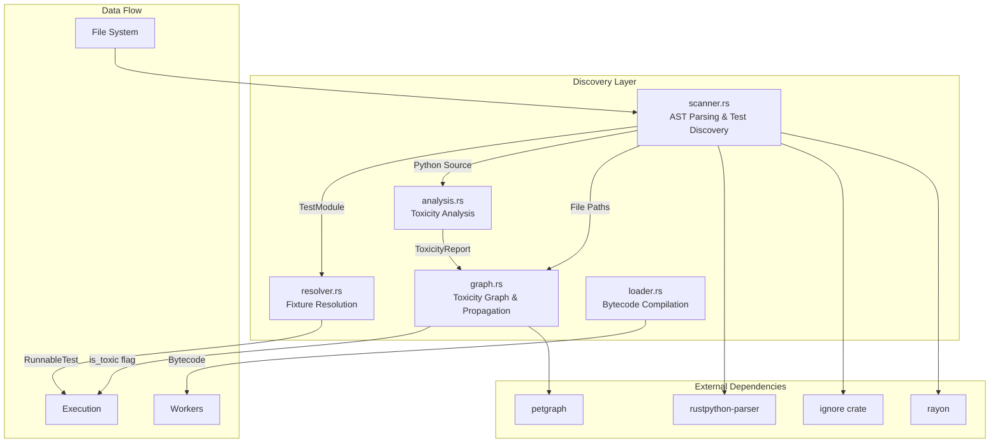
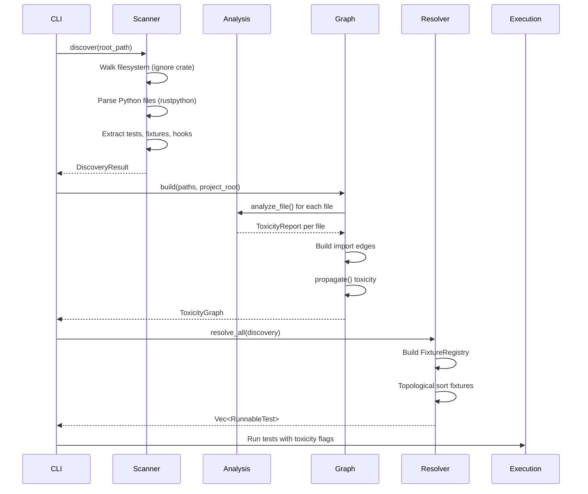
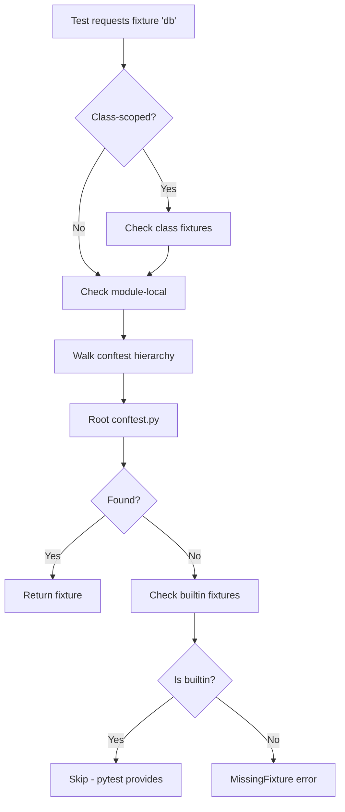
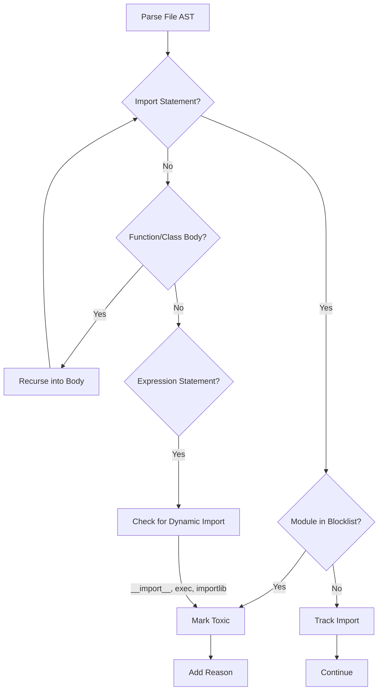
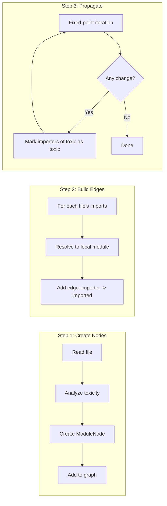
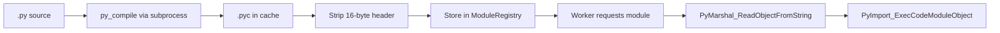

# Test Discovery System: Deep Dive

> Comprehensive technical documentation of Tach's static AST-based test discovery engine.
> This document analyzes the discovery module architecture, algorithms, and design decisions.
>
> **Related Documents:**
>
> - [Test Discovery Analysis](./test-discovery-analysis.md) - Ignored tests and edge cases
> - [External Research](./external-research.md) - Related projects and technologies

---

## Table of Contents

1. [Architecture Overview](#1-architecture-overview)
2. [AST Parsing Strategy](#2-ast-parsing-strategy)
3. [Test Pattern Matching](#3-test-pattern-matching)
4. [Fixture Resolution Algorithm](#4-fixture-resolution-algorithm)
5. [Conftest.py Inheritance Chain](#5-conftestpy-inheritance-chain)
6. [Toxicity Classification System](#6-toxicity-classification-system)
7. [Import Graph Analysis](#7-import-graph-analysis)
8. [Marker Extraction and Handling](#8-marker-extraction-and-handling)
9. [Performance Optimizations](#9-performance-optimizations)
10. [Module Loader Integration](#10-module-loader-integration)

---

## 1. Architecture Overview

The test discovery system is composed of five core modules that work together to discover, analyze, and prepare tests for execution.

### 1.1 Module Dependency Graph



### 1.2 Core Data Structures

| Structure           | Module      | Purpose                                                                    |
| ------------------- | ----------- | -------------------------------------------------------------------------- |
| `TestCase`          | scanner.rs  | Represents a single test function with dependencies, markers, and metadata |
| `FixtureDefinition` | scanner.rs  | Represents a pytest fixture with scope, dependencies, and parameters       |
| `TestModule`        | scanner.rs  | A Python file containing tests, fixtures, and hooks                        |
| `DiscoveryResult`   | scanner.rs  | Collection of all discovered modules                                       |
| `ToxicityReport`    | analysis.rs | Per-file toxicity status with reasons and imports                          |
| `RunnableTest`      | resolver.rs | Fully resolved test ready for execution                                    |
| `ToxicityGraph`     | graph.rs    | Dependency graph for transitive toxicity propagation                       |

### 1.3 Discovery Pipeline



---

## 2. AST Parsing Strategy

Tach uses **static AST analysis** exclusively - Python code is never executed during discovery. This is a fundamental design decision that enables:

- **Speed**: No Python interpreter startup overhead
- **Safety**: Malicious test code cannot execute during discovery
- **Parallelism**: Files can be parsed concurrently without GIL concerns

### 2.1 Parser Selection: rustpython-parser

The `rustpython-parser` crate provides a complete Python 3 AST parser written in Rust:

```rust
use rustpython_ast as ast;
use rustpython_parser::Parse;

let suite = ast::Suite::parse(&source, &path_str)?;
```

**Key Characteristics:**

- Full Python 3.x syntax support
- Returns `rustpython_ast::Suite` (list of statements)
- Graceful error handling for syntax errors
- No Python runtime required

### 2.2 Parse Error Handling

Files with syntax errors are handled gracefully:

```rust
// In parse_module_with_relative_path
let suite = match ast::Suite::parse(&source, &path_str) {
    Ok(s) => s,
    Err(_) => {
        // Return empty module - don't crash discovery
        return Ok(TestModule {
            path: rel_path.to_path_buf(),
            tests: vec![],
            fixtures: vec![],
            hooks: vec![],
            is_toxic: false,
        });
    }
};
```

**Design Decision**: Parse errors in one file don't prevent discovery of other files. However, in toxicity analysis, parse errors are treated as toxic (conservative approach).

### 2.3 Statement Traversal Pattern

The scanner uses a two-level traversal:

1. **Top-level statements**: Iterate through `suite` directly
2. **Class body statements**: Recurse into `ClassDef.body` for test classes

```rust
for stmt in suite {
    match stmt {
        ast::Stmt::FunctionDef(func) => { /* top-level function */ }
        ast::Stmt::AsyncFunctionDef(func) => { /* async function */ }
        ast::Stmt::ClassDef(class) => {
            if class.name.as_str().starts_with("Test") {
                for stmt in &class.body {
                    // Process class methods
                }
            }
        }
        _ => {}
    }
}
```

---

## 3. Test Pattern Matching

### 3.1 Test File Detection

The `is_test_file` function determines which files to parse:

```rust
fn is_test_file(path: &Path) -> bool {
    if !path.is_file() { return false; }
    let ext = path.extension().and_then(|e| e.to_str());
    if ext != Some("py") { return false; }
    let name = path.file_name().and_then(|n| n.to_str()).unwrap_or("");
    name.starts_with("test_") || name.ends_with("_test.py") || name == "conftest.py"
}
```

**Patterns Matched:**
| Pattern | Example |
|---------|---------|
| `test_*.py` | `test_users.py`, `test_api.py` |
| `*_test.py` | `users_test.py`, `integration_test.py` |
| `conftest.py` | Fixture and hook definitions |

### 3.2 Test Function Detection

Functions are identified as tests by the `test_` prefix:

```rust
if name.starts_with("test_") {
    let line_number = get_line_number(source, func.range.start().to_usize());
    tests.push(TestCase {
        name: name.to_string(),
        dependencies: extract_args_from_arguments(&func.args),
        is_async,
        line_number,
        parametrized_args: extract_injected_args(&func.decorator_list, &args),
        timeout_secs: extract_timeout_from_decorators(&func.decorator_list),
        markers: extract_markers_from_decorators(&func.decorator_list),
    });
}
```

### 3.3 Test Class Detection

Classes starting with `Test` are recognized as test containers:

```rust
ast::Stmt::ClassDef(class) => {
    let class_name = class.name.as_str();
    if class_name.starts_with("Test") {
        for stmt in &class.body {
            // Process test methods
        }
    }
}
```

**Test method naming**: `ClassName::method_name` (e.g., `TestUsers::test_create`)

### 3.4 Async Test Support

Both sync and async tests are fully supported:

| Statement Type                | Detected As       |
| ----------------------------- | ----------------- |
| `ast::Stmt::FunctionDef`      | `is_async: false` |
| `ast::Stmt::AsyncFunctionDef` | `is_async: true`  |

---

## 4. Fixture Resolution Algorithm

The resolver implements pytest's fixture lookup semantics with dependency ordering.

### 4.1 Fixture Lookup Priority



**Priority Order (highest to lowest):**

1. Class-scoped fixtures (for test methods in classes)
2. Module-local fixtures (same file as test)
3. Conftest hierarchy (innermost to outermost)
4. Pytest builtins (skipped during resolution)

### 4.2 FixtureRegistry Structure

```rust
pub struct FixtureRegistry {
    /// Conftest fixtures by directory path
    conftest: HashMap<PathBuf, HashMap<String, (FixtureDefinition, PathBuf)>>,
    /// Local fixtures per module (non-class-scoped only)
    local: HashMap<PathBuf, HashMap<String, FixtureDefinition>>,
    /// Class-scoped fixtures: (module_path, class_name) -> fixture_name -> fixture
    class_scoped: HashMap<(PathBuf, String), HashMap<String, FixtureDefinition>>,
}
```

### 4.3 Topological Sort (DFS with Cycle Detection)

Fixtures are ordered using DFS post-order traversal:

```rust
fn resolve_fixture(
    &self,
    name: &str,
    module_path: &PathBuf,
    test_name: &str,
    resolved: &mut Vec<ResolvedFixture>,
    visited: &mut HashSet<String>,
    stack: &mut Vec<String>,  // Recursion stack for cycle detection
) -> Result<(), ResolutionError> {
    // Already fully resolved
    if visited.contains(name) { return Ok(()); }

    // Cycle detection
    if stack.contains(&name.to_string()) {
        stack.push(name.to_string());
        return Err(ResolutionError::CyclicDependency { ... });
    }

    stack.push(name.to_string());

    // Resolve dependencies first (DFS)
    for dep in &fixture.dependencies {
        self.resolve_fixture(dep, ...)?;
    }

    stack.pop();
    visited.insert(name.to_string());
    resolved.push(ResolvedFixture { ... });  // Post-order
    Ok(())
}
```

**Result**: Dependencies appear before dependents in the resolved list.

### 4.4 Pytest Builtin Fixtures

These fixtures are provided by pytest at runtime and skipped during static resolution:

```rust
const PYTEST_BUILTINS: &[&str] = &[
    "monkeypatch", "tmp_path", "tmp_path_factory", "tmpdir", "tmpdir_factory",
    "capsys", "capfd", "capsysbinary", "capfdbinary", "caplog",
    "request", "cache", "record_property", "record_testsuite_property",
    "record_xml_attribute", "doctest_namespace", "recwarn", "pytestconfig",
];
```

### 4.5 Parametrized Argument Exclusion

Arguments from `@pytest.mark.parametrize` are NOT fixtures:

```rust
// Filter out parametrized args - they're NOT fixtures
let parametrized_set: HashSet<_> = test.parametrized_args.iter().collect();

for dep_name in &test.dependencies {
    if parametrized_set.contains(dep_name) {
        continue;  // Skip - not a fixture
    }
    self.resolve_fixture(dep_name, ...)?;
}
```

---

## 5. Conftest.py Inheritance Chain

### 5.1 Directory Hierarchy Model

```
project/
├── conftest.py           <- Level 3 (root) - defines 'db'
├── tests/
│   ├── conftest.py       <- Level 2 - defines 'client', overrides 'db'
│   └── subdir/
│       ├── conftest.py   <- Level 1 (closest) - defines 'mock_api'
│       └── test_api.py   <- Test file
```

For `test_api.py`:

- Fixture `mock_api` found at Level 1
- Fixture `client` found at Level 2
- Fixture `db` found at Level 2 (overrides Level 3)

### 5.2 Walk-Up Algorithm

```rust
fn lookup(&self, name: &str, module_path: &PathBuf, test_name: &str)
    -> Option<(FixtureDefinition, PathBuf)>
{
    // 1. Check class-scoped fixtures first
    if let Some(class_name) = extract_class_name(test_name) {
        if let Some(fixture) = self.class_scoped.get(&(module_path, class_name)) {
            if let Some(f) = fixture.get(name) {
                return Some((f.clone(), module_path.clone()));
            }
        }
    }

    // 2. Check local module scope
    if let Some(local_fixtures) = self.local.get(module_path) {
        if let Some(fixture) = local_fixtures.get(name) {
            return Some((fixture.clone(), module_path.clone()));
        }
    }

    // 3. Walk UP directory tree
    let mut current_dir = module_path.parent();
    while let Some(dir) = current_dir {
        if let Some(conftest_fixtures) = self.conftest.get(dir) {
            if let Some((fixture, source)) = conftest_fixtures.get(name) {
                return Some((fixture.clone(), source.clone()));
            }
        }
        current_dir = dir.parent();  // Move up
    }

    // 4. Check root-level conftest
    if let Some(root_fixtures) = self.conftest.get(&PathBuf::new()) {
        if let Some((fixture, source)) = root_fixtures.get(name) {
            return Some((fixture.clone(), source.clone()));
        }
    }

    None  // Not found
}
```

### 5.3 Fixture Shadowing

Inner conftest.py files **shadow** fixtures with the same name from outer directories:

```python
# conftest.py (root)
@pytest.fixture(scope="session")
def db():
    return RealDatabase()

# tests/conftest.py
@pytest.fixture  # Function scope, shadows root
def db():
    return MockDatabase()
```

Tests in `tests/` will use `MockDatabase`, not `RealDatabase`.

---

## 6. Toxicity Classification System

The toxicity system determines which tests can use memory snapshots vs. requiring fork/kill isolation.

### 6.1 Research Foundation

From the _Python Monorepo Zygote Tree Design_ research:

> "Toxicity is contagious. If Module A imports Module B, and Module B opens a database connection, then importing Module A effectively opens a database connection."

### 6.2 Toxic Module Blocklists

**Standard Library (fork-unsafe):**

```rust
const TOXIC_STD_LIB: &[&str] = &[
    "threading",      // OS threads with corrupted locks after fork
    "_thread",        // Low-level thread module
    "multiprocessing", // Child processes with shared state
    "socket",         // File descriptors with kernel TCP state
    "ctypes",         // Direct C library access with opaque state
    "signal",         // Signal handlers persist across reset
    "concurrent.futures", // Thread/process pools
];
```

**External Packages (native dependencies):**

```rust
const TOXIC_EXTERNAL_MODULES: &[&str] = &[
    "grpc",       // gRPC C core
    "pandas",     // OpenMP thread pools
    "tensorflow", // CUDA context
    "torch",      // CUDA context
    "cv2",        // OpenCV threads
    "gevent",     // Greenlet stacks
    "cffi",       // C FFI
];
```

### 6.3 Detection Algorithm



### 6.4 Dynamic Import Detection

```rust
fn is_dynamic_import(func: &ast::Expr, ...) -> bool {
    match func {
        ast::Expr::Name(name) => {
            let local = name.id.as_str();
            // __import__ and exec are always dynamic
            if local == "__import__" || local == "exec" {
                return true;
            }
            // Check for importlib.import_module via from-import
            if let Some(full) = from_imports.get(local) {
                return full == "importlib.import_module";
            }
            false
        }
        ast::Expr::Attribute(attr) => {
            // importlib.import_module pattern
            // ...
        }
        _ => false,
    }
}
```

### 6.5 TYPE_CHECKING Skip

Imports inside `if TYPE_CHECKING:` blocks are **never executed** at runtime:

```rust
fn is_type_checking_block(test: &ast::Expr) -> bool {
    match test {
        ast::Expr::Name(name) => name.id.as_str() == "TYPE_CHECKING",
        ast::Expr::Attribute(attr) => {
            attr.attr.as_str() == "TYPE_CHECKING" &&
            matches!(&*attr.value, ast::Expr::Name(n) if n.id.as_str() == "typing")
        }
        _ => false,
    }
}
```

These blocks are skipped during toxicity analysis to avoid false positives.

---

## 7. Import Graph Analysis

The `ToxicityGraph` builds a dependency graph and propagates toxicity transitively.

### 7.1 Graph Structure

```rust
pub struct ToxicityGraph {
    /// Directed graph: Edge A -> B means "A imports B"
    graph: DiGraph<ModuleNode, ()>,
    /// Map module name -> NodeIndex
    name_to_node: HashMap<String, NodeIndex>,
    /// Map file path -> NodeIndex
    path_to_node: HashMap<PathBuf, NodeIndex>,
}
```

**Using petgraph**: The `petgraph::graph::DiGraph` provides efficient directed graph operations.

### 7.2 Graph Construction



### 7.3 Import Resolution

```rust
fn resolve_import(&self, import: &str, _project_root: &Path) -> Option<&NodeIndex> {
    // Direct match: "app.utils" -> node "app.utils"
    if let Some(idx) = self.name_to_node.get(import) {
        return Some(idx);
    }

    // Try parent modules: "app.utils.helper" -> "app.utils"
    let parts: Vec<&str> = import.split('.').collect();
    for i in (1..parts.len()).rev() {
        let parent = parts[..i].join(".");
        if let Some(idx) = self.name_to_node.get(&parent) {
            return Some(idx);
        }
    }

    None  // External import - not in our graph
}
```

### 7.4 Fixed-Point Propagation

```rust
fn propagate(&mut self) {
    loop {
        let mut changed = false;

        let edges: Vec<(NodeIndex, NodeIndex)> = self.graph
            .edge_indices()
            .filter_map(|e| self.graph.edge_endpoints(e))
            .collect();

        for (from_idx, to_idx) in edges {
            let to_toxic = self.graph[to_idx].is_toxic;

            if to_toxic && !self.graph[from_idx].is_toxic {
                self.graph[from_idx].is_toxic = true;
                self.graph[from_idx].reasons.push(
                    format!("Imports toxic module '{}'", self.graph[to_idx].name)
                );
                changed = true;
            }
        }

        if !changed { break; }  // Fixed point reached
    }
}
```

**Handles cycles**: The fixed-point algorithm naturally handles circular imports.

### 7.5 Hook-Based Toxicity

Pytest hooks that modify global state also contribute to toxicity:

```rust
if registry.file_has_toxic_hooks(&canonical_path) {
    report.is_toxic = true;
    for hook in registry.get_hooks_for_file(&canonical_path) {
        if hook.spec.modifies_global_state {
            report.reasons.push(format!(
                "Contains toxic hook '{}' (modifies global state)",
                hook.spec.name
            ));
        }
    }
}
```

---

## 8. Marker Extraction and Handling

### 8.1 Marker Detection

Markers are extracted from `@pytest.mark.*` decorators:

```rust
fn extract_markers_from_decorators(decorators: &[ast::Expr]) -> Vec<String> {
    let mut markers = vec![];

    for decorator in decorators {
        // @pytest.mark.name (bare marker)
        if let ast::Expr::Attribute(attr) = decorator {
            if matches_pytest_mark_pattern(attr) {
                markers.push(attr.attr.to_string());
            }
        }
        // @pytest.mark.name(args) (marker with arguments)
        if let ast::Expr::Call(call) = decorator {
            if let ast::Expr::Attribute(attr) = &*call.func {
                if matches_pytest_mark_pattern(attr) {
                    markers.push(attr.attr.to_string());
                }
            }
        }
    }

    markers
}
```

### 8.2 Decorator-Only Markers

Some markers are decorators, not test selection markers:

```rust
const DECORATOR_ONLY_MARKERS: &[&str] = &[
    "parametrize",     // Generates test variants
    "usefixtures",     // Applies fixtures
    "filterwarnings",  // Warning configuration
];
```

These are excluded from the markers list used for `-m` filtering.

### 8.3 Timeout Extraction

```rust
fn extract_timeout_from_decorators(decorators: &[ast::Expr]) -> Option<u64> {
    for decorator in decorators {
        if !is_timeout_decorator(decorator) { continue; }

        if let ast::Expr::Call(call) = decorator {
            // Positional: @pytest.mark.timeout(30)
            if let Some(ast::Expr::Constant(c)) = call.args.first() {
                if let ast::Constant::Int(i) = &c.value {
                    let val = i.to_string().parse::<u64>().ok()?;
                    if val == 0 { return None; }  // 0 means no timeout
                    return Some(val);
                }
            }
            // Keyword: @pytest.mark.timeout(seconds=30)
            // ...
        }
    }
    None
}
```

### 8.4 Parametrize Argument Extraction

```rust
fn extract_parametrized_args(decorators: &[ast::Expr]) -> Vec<String> {
    let mut args = Vec::new();

    for decorator in decorators {
        if !is_parametrize_decorator(decorator) { continue; }

        if let ast::Expr::Call(call) = decorator {
            if let Some(first_arg) = call.args.first() {
                match first_arg {
                    // "arg1, arg2" (comma-separated string)
                    ast::Expr::Constant(c) => {
                        if let ast::Constant::Str(s) = &c.value {
                            for name in s.as_str().split(',') {
                                args.push(name.trim().to_string());
                            }
                        }
                    }
                    // ["arg1", "arg2"] (list of strings)
                    ast::Expr::List(list) => { /* ... */ }
                    // ("arg1", "arg2") (tuple of strings)
                    ast::Expr::Tuple(tuple) => { /* ... */ }
                    _ => {}
                }
            }
        }
    }

    args
}
```

---

## 9. Performance Optimizations

### 9.1 Parallel File Parsing

The scanner uses Rayon for parallel AST parsing:

```rust
let modules: Vec<TestModule> = paths
    .par_iter()  // Rayon parallel iterator
    .filter_map(|(abs_path, rel_path)| {
        parse_module_with_relative_path(abs_path, rel_path).ok()
    })
    .filter(|m| !m.tests.is_empty() || !m.fixtures.is_empty() || !m.hooks.is_empty())
    .collect();
```

**Benefit**: On multi-core systems, file parsing scales linearly with cores.

### 9.2 Ignore-Aware File Walking

The `ignore` crate respects `.gitignore` and `.ignore` patterns:

```rust
let paths: Vec<(PathBuf, PathBuf)> = WalkBuilder::new(&canonical_root)
    .standard_filters(!no_ignore)  // Respect .gitignore
    .follow_links(true)            // Follow symlinks
    .build()
    .filter_map(|e| e.ok())
    .filter(|e| is_test_file(e.path()))
    .collect();
```

**Benefit**: Avoids parsing non-test files and respects project ignores.

### 9.3 Lazy Bytecode Compilation

The loader uses mtime-based cache invalidation:

```rust
fn is_cache_stale(&self, source: &Path, cache: &Path) -> bool {
    if !cache.exists() { return true; }

    let source_mtime = fs::metadata(source).and_then(|m| m.modified())?;
    let cache_mtime = fs::metadata(cache).and_then(|m| m.modified())?;

    source_mtime > cache_mtime
}
```

**Benefit**: Only recompile changed files.

### 9.4 Global Caching for Subprocess Operations

Python path and magic number lookups are cached globally:

```rust
static CACHED_PYTHON_EXE: OnceLock<PathBuf> = OnceLock::new();
static CACHED_MAGIC: OnceLock<[u8; 4]> = OnceLock::new();

fn find_python_cached() -> Result<PathBuf> {
    if let Some(cached) = CACHED_PYTHON_EXE.get() {
        return Ok(cached.clone());
    }
    // ... find Python and cache it
}
```

**Benefit**: Prevents spawning multiple Python processes during parallel tests.

### 9.5 DashMap for Concurrent Registry Access

The module registry uses `DashMap` for lock-free concurrent access:

```rust
pub struct ModuleRegistry {
    entries: DashMap<String, BytecodeEntry>,
    // ...
}
```

**Benefit**: Multiple workers can query bytecode without contention.

---

## 10. Module Loader Integration

### 10.1 Bytecode Compilation Pipeline



### 10.2 PYC Header Structure

```rust
/// .pyc header size for Python 3.7+ (PEP 552)
/// Format: Magic (4) + BitField (4) + Timestamp (4) + Size (4) = 16 bytes
const PYC_HEADER_SIZE: usize = 16;
```

### 10.3 Module Loading FFI

```rust
#[pyfunction]
pub fn load_module(
    py: Python<'_>,
    name: &str,
    source_path: &str,
    bytecode: &[u8],
) -> PyResult<bool> {
    unsafe {
        // 1. Deserialize bytecode to code object
        let code_obj = ffi::PyMarshal_ReadObjectFromString(...);

        // 2. Execute code, creating module in sys.modules
        let module = ffi::PyImport_ExecCodeModuleObject(...);

        // 3. Patch namespace attributes (__file__, __package__, __path__)
        patch_module_namespace(py, module, name, source_path)?;

        Ok(true)
    }
}
```

### 10.4 Path to Module Name Conversion

```rust
fn path_to_module_name(&self, path: &Path) -> String {
    let relative = path.strip_prefix(&self.project_root).unwrap_or(path);

    let mut name = relative
        .with_extension("")
        .to_string_lossy()
        .replace(std::path::MAIN_SEPARATOR, ".");

    // Remove __init__ suffix for packages
    if name.ends_with(".__init__") {
        name = name.trim_end_matches(".__init__").to_string();
    }

    name
}
```

**Examples:**
| Path | Module Name |
|------|-------------|
| `app/utils.py` | `app.utils` |
| `app/core/__init__.py` | `app.core` |
| `test_foo.py` | `test_foo` |

---

## Appendix: Key Function Reference

| Function                          | Module      | Purpose                                |
| --------------------------------- | ----------- | -------------------------------------- |
| `discover`                        | scanner.rs  | Main entry point for test discovery    |
| `parse_module_with_relative_path` | scanner.rs  | Parse single Python file to TestModule |
| `analyze_file`                    | analysis.rs | Analyze single file for toxicity       |
| `analyze_stmt`                    | analysis.rs | Recursive statement analysis           |
| `ToxicityGraph::build`            | graph.rs    | Construct dependency graph             |
| `ToxicityGraph::propagate`        | graph.rs    | Fixed-point toxicity propagation       |
| `FixtureRegistry::from_discovery` | resolver.rs | Build fixture lookup tables            |
| `Resolver::resolve_all`           | resolver.rs | Resolve all tests' fixtures            |
| `BytecodeCompiler::compile`       | loader.rs   | Compile .py to bytecode                |
| `load_module`                     | loader.rs   | FFI function for bytecode injection    |

---

_Last Updated: 2026-01-17_
